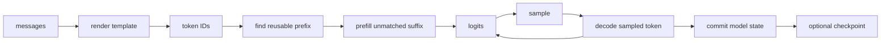

# 2. One complete DwarfStar request

[Previous](01-foundations.md) · [Index](README.md) · [Next](03-deepseek-v4.md)

## Why this matters

A request crosses template, model, state, sampling, and persistence boundaries.
DwarfStar makes those transitions concrete if its DeepSeek assumptions are
kept visibly separate.

A beginner often sees inference as one call such as `generate(prompt)`. Inside
an engine, that call is a protocol with several representations and owners. A
bug at any boundary can look like a model bug: a wrong chat template changes
the token IDs, a stale cache changes later hidden states, and committing a token
too early corrupts rollback. This chapter names those boundaries before looking
at kernels.

## The representations in one request

Suppose the application receives the message `{"role":"user","content":"Hi"}`.
It passes through these forms:

| Form | Example | Owned by |
|---|---|---|
| application message | role and UTF-8 text | CLI/server |
| rendered prompt | control tokens plus `Hi` | chat-template layer |
| token sequence | integer IDs such as `[a,b,c]` | tokenizer/session |
| embedding rows | one `[5120]` vector per ID | model execution |
| hidden rows | transformed `[5120]` vectors | temporary workspace |
| logits | 248,320 next-token scores | session until sampling |
| persistent state | GDN summaries, rings, and KV | session |

The **tokenizer** maps byte strings to vocabulary IDs; it is not generally one
character or word per token. The **chat template** inserts model-specific role
markers and generation markers before tokenization. Two prompts that look the
same to a person may produce different token sequences, so cache identity is
defined by IDs and positions rather than displayed text.

## Trace and annotations



### Open the engine

Opening is where file metadata becomes validated model data. The loader reads
tensor descriptions, `ModelSpec` checks every required dimension and layer
kind, and the binder associates each name with a semantic role such as layer
7's key projection. Only then does a backend allocate or repack weights. This
prevents a kernel compiled for one shape from reading an incompatible tensor.

### Create and synchronize a session

A new session starts with empty state and a position frontier of zero. Prefill
advances it through the prompt. On a later turn, the engine compares new
rendered IDs with committed IDs. If the first `K` IDs match, state at position
`K` can be reused and only the suffix needs evaluation. This is **prefix reuse**.

For example, old IDs `[10,20,30,40]` and new IDs `[10,20,31,50]` share two
positions. State after ID 20 is reusable; state from IDs 30 and 40 is not.
Because GDN state cannot simply be subtracted, the engine needs a checkpoint at
position two or must replay from an earlier checkpoint.

### Sample, evaluate, and commit

Logits describe the token after the last evaluated input. Sampling chooses an
ID but does not update the model. The chosen ID must be evaluated to produce
the next state and next logits:

```text
old committed state + sampled ID
  -> tentative forward pass
  -> new state + next logits
  -> commit ID, position, every layer's state, and logits together
```

If a kernel fails halfway through, the session must still describe the old
prefix. “Atomic” is a logical guarantee; the implementation may use shadow
buffers, a journal, or recoverable in-place updates.

### Persist and restore

A checkpoint is more than token IDs. IDs permit replay, but replay can be
expensive. A state checkpoint contains every GDN matrix, convolution ring,
attention KV row, logical length, and position frontier needed for the next
call. Hashes prevent restoring that state under different weights, tokenizer
rules, templates, or quantization.

1. `ds4_engine_open_internal` opens, validates a known shape, binds exact tensor
   names, and initializes a backend. **Reuse:** validate before kernels. **Discard:**
   DwarfStar shapes and names.
2. `ds4_chat_*` renders and `ds4_tokenize_rendered_chat` encodes. **Reuse:**
   template bytes are semantics. **Adapt:** pin Qwen tokenizer and policy.
3. `ds4_session_create` owns logits, scratch, and prefix state. Sync compares
   token IDs and prefills only the suffix. **Reuse:** lifetime and prefix policy.
   **Discard:** raw/compressed cache layout.
4. `ds4_session_sample` selects logits; `ds4_session_eval` evaluates the token
   and only then appends it to the checkpoint. **Reuse unchanged:** commit order.
5. `ds4_session_save_payload` saves all hidden cache components. **Adapt:** save
   Qwen GDN matrices/rings, ordinary KV, and positions.

For a prompt of `P` tokens, the first call accepts `[1,P,5120]`; only the final
`[248320]` logit row need survive. Each decode call accepts `[1,1,5120]`, updates
all 64 layers, and emits the next logits.

The leading `1` is batch size. During prefill, logits for earlier prompt rows
are normally discarded because the application needs the distribution after
the complete prompt. Hidden rows remain only as long as the current layer needs
them; the session retains the smaller persistent state described in Chapter 3.

## Concrete Qwen engine work

```text
Engine(ModelSpec, ModelWeights, BackendOps)
Session(SequenceInput prefix, SessionState, sampler state)
sync(ids): longest common token prefix -> restore/replay -> prefill suffix
step(token): embed -> forward(position) -> logits -> atomic state/token commit
```

Store model, tokenizer, template, quant, and state-format hashes in checkpoints.

## Common failures

- Appending a sample before evaluating it.
- Matching source strings rather than rendered token IDs.
- Saving tokens but silently replaying missing state.
- Saving attention KV while losing GDN state.
- Treating DwarfStar measurements as Qwen estimates.

## Exercise and expected result

Trace a two-turn request, then change one early token. Expected: reuse ends at
the first differing ID, only the suffix prefills, and a sampled token becomes
reusable after all hybrid state commits.
