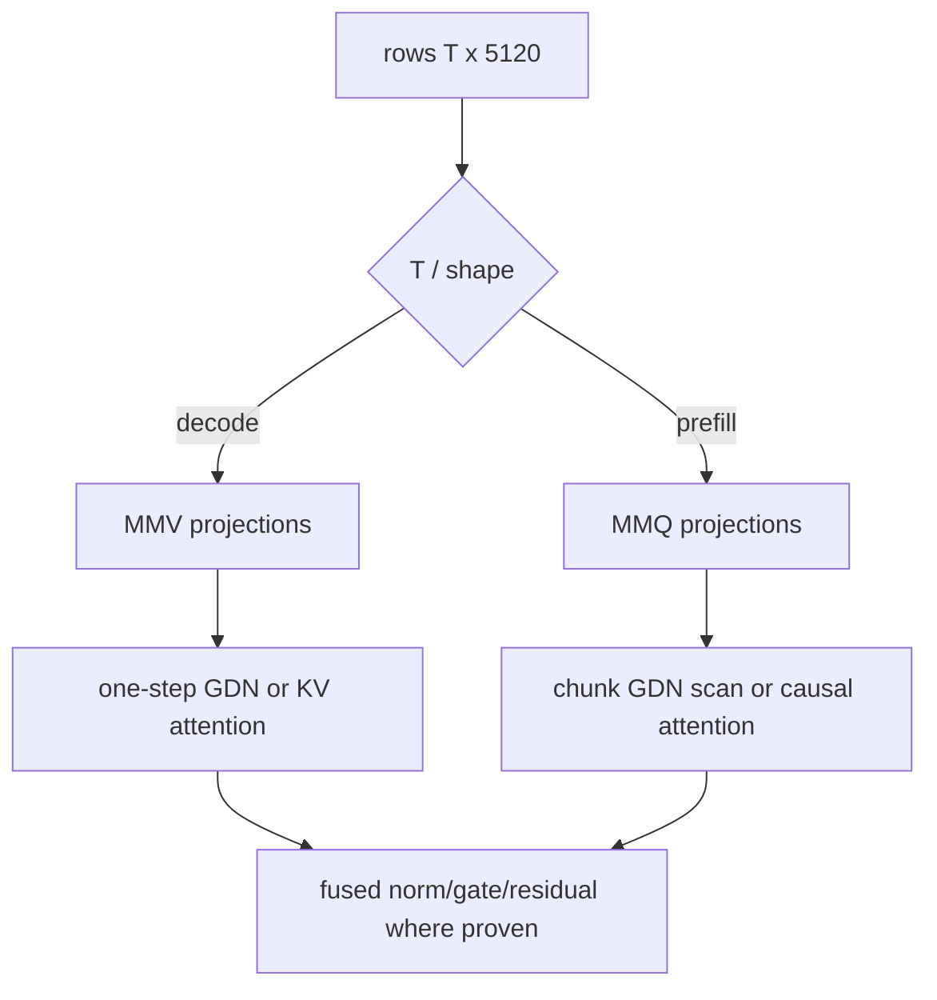

# 6. CUDA execution for decode and prefill

[Previous](05-gpu-implementation.md) · [Index](README.md) · [Next](07-engineering-method.md)

## Why this matters

One CPU loop translated into one kernel leaves decode launch-bound and prefill
compute-starved. Dispatch must reflect row count and the GDN dependency chain.

A GPU runs thousands of lightweight **threads**. Threads are grouped into
blocks, blocks are scheduled onto streaming multiprocessors (SMs), and nearby
threads ideally read adjacent memory so requests are **coalesced**. Global GPU
memory is large and high-bandwidth but has high latency; registers and shared
memory are much smaller and faster. Kernel design is the work of assigning
tensor elements to threads while reusing data in the fast levels without using
so many registers or shared bytes that too few blocks can run.

## Phase-specific dataflow

An **MMV** kernel computes a matrix times one (or a few) vectors. It minimizes
setup for a small row count but cannot reuse each weight tile across many rows.
An **MMQ** kernel computes a matrix times a matrix. It spends more effort
tiling, but a weight tile can serve many prompt rows and often maps to tensor
cores. The names describe the operation, not a promise that one is always
faster. Quartz production Q4_K/Q6_K prompt MMQ uses tensor-core MMA for
`prompt_rows >= 8`. Mixer Q8_0 prompt MMQ uses quality MMA (D4 Y, packed
load-tiles, `MMQ_ITER_K=256`) for `prompt_rows >= 8`, and mixer GEMMs that
share the residual activation share one D4 Y per layer (OPT-022). Mixer Q8_0
GEMMs with `output_rows < 128` (GDN α/β) dispatch the A/B-winning small-I
quality MMA path (OPT-023). Large mixer Q8_0 D2R was A/B'd and not
installed (OPT-024); those GEMMs stay I=128 quality MMA. Dense prompt FFN
Q4_K shares one DS4 Y for gate/up and writes down-leg Y from SwiGLU
(OPT-025). Independent 4K FFN quality-MMA I/J retuning was A/B-lost
and not installed (OPT-037); production stays I=128 / J=128.
Production prompt attention uses Ada+ stream-K fattn after the
OPT-026 keep, with register-resident value sums after the OPT-033 keep
and dual-F16 probability×V MMA after the OPT-035 keep, with warp-owned QK
microtiles after the OPT-041 keep; persistent stream-K was A/B-lost and not
installed (OPT-027). Q4_K/Q6_K MMQ stream-K was A/B-lost and not installed
(OPT-028); production quality MMA stays 2D tiling. Fusing GDN conv and
gated-output into the warp-column token loop was A/B-lost and not
installed (OPT-029); production GDN core stays split parallel conv +
warp-column + gated-output. Hopper/Blackwell PDL on ungraphed prompt
launches was A/B-won then 4K-rejected (OPT-030); production stays
ordinary `<<<>>>`. Production prompt GDN may hoist per-(token, key_head)
Q/K inverses into existing overlay scratch after the OPT-040 keep, and
may hoist scaled Q/K and decay plus a conversion-inclusive column-major
state tile after the OPT-052 keep;
production quality MMA may use explicit FMA scale accumulation and a
two-stage packed-Y `cp.async` loader after the OPT-053 keep;
internal prefill microbatches stay 4096 after the OPT-054 keep unless a
smaller complete-P winner is installed;
decode/prompt execution graphs stay FFN-only after the OPT-055 measured
no-change unless remaining idle exceeds noise;
decode sequential GDN is unchanged. Decode stays MMV, with packed
blockwise Q4_K/Q6_K loads after the OPT-034 keep.
Tiny mixer prompts keep the
OPT-009 tiled `__fmul_rn`/`__fadd_rn` kernel.
Rank-1 fused MMA remains a non-production kernel. MMA here is Measured
component recovery plus a 4K keep versus the frozen oracle baseline, not the
OPT-016 2K llama.cpp parity gate. Production prompt GDN recurrence is the
warp-column fused quality path; sequential windows remain the unloosened
reference. Production prompt attention (`token_count >= 16`) is the fattn-mma
analog with Ada+ stream-K after the OPT-026 keep, register-resident
value sums after the OPT-033 keep, dual-F16 probability×V MMA after
the OPT-035 keep, and warp-owned QK microtiles after the OPT-041 keep;
persistent stream-K was measured and rejected (OPT-027); tiled attention
remains the unloosened reference. Q4_K/Q6_K MMQ stream-K was measured and rejected
(OPT-028); production quality MMA remains 2D tiling. Fusing GDN conv and
gated-output into the warp-column token loop was measured and rejected
(OPT-029); production GDN core remains split conv + warp-column +
gated-output. Hopper/Blackwell PDL serialization of ungraphed mixer/GDN/
attention launches was measured and rejected (OPT-030); production
stays ordinary `<<<>>>`. Those core-quality
paths are also Measured component recovery plus a 4K keep versus the frozen
oracle baseline, not the 2K parity gate.

For a decode projection, all output threads need the same input vector but
different weight rows. A useful MMV kernel keeps pieces of the input available
while streaming quantized weights. For prefill, a tile of weights can multiply
several input rows before it is evicted. That reuse raises **arithmetic
intensity**—more math per byte fetched—and makes the extra MMQ setup worthwhile.

For decode (`T=1`), select quantized MMV kernels, fuse cheap elementwise work
where proven, and update state in place. For prefill (`T>1`), select MMQ/GEMM,
reuse weights across rows, and use chunked GDN scans. Dispatch keys include
format, input/output widths, row bucket, dtype, alignment, tails, GPU capability,
and graph compatibility; unsupported combinations fail explicitly.

A **dispatch key** is simply the set of facts needed to select a correct kernel.
“Tail” means a dimension not divisible by the tile width; for example, a kernel
processing 128 columns at a time needs guarded handling for a width that ends
with only 32 columns. A fast main path without a correct tail path is not a
supported operation.

## GDN kernels

The GDN decode kernel is a dependency chain, not just a large matrix multiply.
It first makes projection rows, then must read the old convolution ring and
recurrent matrix before writing the new state. A second request cannot safely
use the same state buffer until the first has committed. Decode needs: packed
QKV/Z/a/b projections; convolution-ring shift and depthwise
dot; Q/K normalization and 3x head mapping; FP32 decay/prediction/delta/outer
update; gated RMSNorm; output projection. Preserve exact update order. Prefill
may process chunks (the official reference uses 64) but the final recurrent and
convolution state must equal token-by-token execution for arbitrary chunk splits.
Production prompt recurrence (`kFusedTokenLoop`) is the warp-column fused quality
path with hoisted Q/K inverses when dispatch predicates hold; sequential
64-token windows remain the unloosened numeric reference.

The `[48,128,128]` matrices expose parallel heads and tiles but each token
depends on the previous matrix. Avoid materializing repeated Q/K heads; map
value head `h` to QK head `h/3`. Test sequence tails and chunk sizes 1, 3, 4,
63, 64, 65, and nonmultiples of every kernel tile.

Chunked prefill does not remove recurrence. It reorganizes a sequence of
dependent updates so matrix work within a chunk can be parallelized. The chunk
algorithm must receive the state before the chunk and return exactly the state
that sequential token updates would have produced after it. Tests at 63, 64,
and 65 distinguish the ordinary path, an exact chunk, and a one-row tail.

## Attention and FFN kernels

Attention decode reads growing KV from 16 layers; use grouped-query mapping
without physical sixfold copies. Production one-token decode attention uses
contiguous KV partitions after the OPT-036 keep (independent pins below 2048
and at or above 2048; candidate `1` remains the tiled kernel) and a
warp-owned query-head kernel after the OPT-039 keep when the vec pin is
`warp_query`. Prefill must
be causal and handle partial RoPE on exactly 64 dimensions. Production prompt
attention (`token_count >= 16`) is the fattn-mma analog with Ada+ stream-K
for prompt tiles, register-resident value sums after the OPT-033 keep, and
dual-F16 probability×V MMA after the OPT-035 keep;
persistent stream-K was A/B-lost and not installed. The
two-row tiled path remains the unloosened numeric reference. Dense FFNs dominate
weights: MMV for one/few rows, MMQ for prompt or batched rows. Fusion is accepted
only when the unfused path remains a differential oracle and profiler data
attributes a wall-time win.

**Fusion** combines operations that would otherwise be separate launches. For
example, a fused kernel might normalize a row, apply a gate, and add a residual
without writing each intermediate vector to global memory. The cost is more
complex code, longer-lived registers, and fewer reusable debugging boundaries.
Fusion is therefore a measured optimization after the component operations pass.

## 2K MMQ versus MMA (OPT-015)

**Measured, OPT-014:** `ffn_mmq` is 77.0% of cold exact-2048 wall (32294.9512 ms
of 41963.8828 ms, ~48.80 tok/s). At 2048 prompt rows, OPT-009 Q4_K selects
tile 4 because there is no 2048 bucket and `prompt_rows > 256` returns 4, so
each decoded weight serves only four rows.

**External:** pinned llama.cpp `cc83d7b` Q4_K MMQ is MMA with prompt-tile J up
to 128. **Estimated** FFN-only ceiling: `2048 / (32294.9512 / 1000) ≈ 63.4`
tok/s versus that revision's scaling `llama-bench` 2K mean 3114.049476 tok/s.

**Proposed** Rank 1 recovery is llama.cpp-style MMA MMQ under MIT file-level
provenance, keeping the CUD-002 reference and frozen envelope. That map is not
a 2K throughput gate and not llama.cpp parity:
[`evidence/optimization/opt015-2k-recovery/REPORT.md`](../evidence/optimization/opt015-2k-recovery/REPORT.md).

## Mixer Q8_0 MMA (OPT-017)

**Measured, RTX 5090:** production mixer Q8_0 prompt MMQ is MMA at J=128 when
`prompt_rows >= 8`. CUD-002 versus `launch_quant_mmq_variant` `kQ8_0` stays at
max abs `5e-4` / RMS `2.5e-4` with zero non-finites. OPT-009 tiled-versus-row-wise
byte equality is unloosened. Live exact-2048 remasurement mean 375.743988 tok/s
versus llama.cpp 3203.276277 tok/s is recorded and is **not** the OPT-016 gate.
**OPT-016 remains the parity gate owner.** OPT-022 later replaced this Rank-1
production body with quality MMA. Report:
[`evidence/optimization/opt017-mixer-q8-mma/REPORT.md`](../evidence/optimization/opt017-mixer-q8-mma/REPORT.md).

## Q4_K/Q6_K MMA quality (OPT-018)

**Measured, RTX 5090:** production Q4_K/Q6_K prompt MMQ is quality MMA
(`MMQ_ITER_K=256`, packed load-tiles, Q8_1 MMQ Y in the existing workspace,
J=128) when `prompt_rows >= 8`. Admission is against host CPU dequant-weight ×
BF16→float GEMM under the ds4 Q4_K association rule (option C; element fails
only when both `abs > 0.20*sqrt(K)` and `rel > 0.05`). Fixed abs/rms are retired
for Q4_K/Q6_K MMQ admission; the scalar variant remains with exact Q8 staging.
Live exact-2048 `ffn_mmq` is **399.287018** ms versus the before snapshot
**2524.67725** ms and live llama.cpp 2K wall **636.184782** ms (`avg_ts`
3219.6604); `llama_competitive` is true. Quartz mean **625.792114** tok/s
versus llama.cpp 3219.6604 tok/s is recorded and is **not** the OPT-016 gate.
**OPT-016 remains the parity gate owner.** Report:
[`evidence/optimization/opt018-ffn-mma-quality/REPORT.md`](../evidence/optimization/opt018-ffn-mma-quality/REPORT.md).

## GDN and attention core quality (OPT-019)

**Measured, RTX 5090:** production prompt GDN recurrence is warp-column fused
quality (`dim3(32, 4)`, grid z=32, `s_shard[4]`). Sequential windows remain the
unloosened reference (`5e-8` / `5e-9`). Production prompt attention
(`token_count >= 16`) is the fattn-mma analog with pinned ncols1=16 and
ncols2=2. Production prompt attention uses Ada+ stream-K after the OPT-026
keep, register-resident value sums after the OPT-033 keep, and dual-F16
probability×V MMA after the OPT-035 keep; persistent
stream-K was A/B-lost and not installed (OPT-027).
Tiled attention remains the unloosened OPT-005 reference
(`5e-5` / `5e-6`). Live exact-2048 `gdn` **1205.38806** ms and `attention`
**475.116028** ms versus locked befores **1643.46082** / **1148.47461** ms
meet the 85%/85%/70% addressed rule (`combined_after` **1680.504088** ms).
Quartz mean **978.151855** tok/s versus llama.cpp **3197.246224** tok/s is
recorded; `would_pass_opt016` is informational false. This is **not** the
OPT-016 gate. **OPT-016 remains the parity gate owner.** Report:
[`evidence/optimization/opt019-gdn-attention-core/REPORT.md`](../evidence/optimization/opt019-gdn-attention-core/REPORT.md).

**Measured, RTX 5090:** live cold exact-2048 attribution reports exclusive
`mixer_mmq` 1199.25122 ms, `gdn_core` 212.156006 ms, and `attention_core`
273.986725 ms of wall 2086.2561 ms in
[`fixtures/opt020_prefill_split.json`](../fixtures/opt020_prefill_split.json).
Nsight was not used. This is instrumentation, not a throughput gate.

## 4K keep/reject oracle (OPT-021)

**Measured protocol/baseline, RTX 5090:** one exclusive sitting records three
cold exact-4096 production `sync_tokens` tok/s (attribution null, graphs
created, production fused GDN and overlapped path) and same-sitting llama.cpp
`llama-bench -p 4096 -n 0 --no-warmup -r 3 -ngl 99` `avg_ts`. Live means from
that sitting are Quartz **966.039062** tok/s versus llama.cpp **3224.522433**
tok/s. Later production changes keep only when cold exact-4096 mean tok/s is
strictly greater than that retained Quartz baseline. This is **not** a
throughput gate versus llama.cpp and **does not substitute for the 2K
llama.cpp parity gate.** OPT-016 remains the 2K parity owner. Scout sitting
965.204895 / 3182.476587 tok/s is contract transparency only and is **not**
the retained fixture. Live numbers stay in the report; this chapter does not
replace them:
[`evidence/optimization/opt021-4k-oracle/REPORT.md`](../evidence/optimization/opt021-4k-oracle/REPORT.md).

## Mixer Q8_0 quality MMQ (OPT-022)

**Measured, RTX 5090:** production mixer Q8_0 prompt MMQ is the quality stack
(D4 `quantize_mmq_q8_1`, packed load-tiles, `MMQ_ITER_K=256`, block
`dim3(32, 8)`, J=128) when `prompt_rows >= 8`. Mixer GEMMs that share the
residual activation reuse one D4 Y in existing `prompt_q8_` per layer; GDN
output requantizes at K=6144 into the same workspace. No extra persistent
`cudaMalloc`. Admission versus host CPU dequant GEMM uses the Q8 association
rule (an element fails only when both `abs > 0.05*sqrt(K)` and `rel > 0.05`).
The tiled-versus-row-wise Q8_0 pair remains byte-exact. Rank-1 fused MMA is
retained and is not production. Live exclusive-RTX-5090 cold exact-4096
**keep:** Quartz mean **1680.38025** tok/s versus the frozen oracle baseline
**967.267761**. Production was not reverted. `quartz_meets_llama` is
informational and is not this gate. This is **not** the 2K llama.cpp parity
gate. Live numbers stay in the report; this chapter does not replace them:
[`evidence/optimization/opt022-mixer-q8-quality/REPORT.md`](../evidence/optimization/opt022-mixer-q8-quality/REPORT.md).

## Skinny-M mixer dispatch (OPT-023)

**Measured, RTX 5090:** mixer Q8_0 projections with `output_rows < 128`
(GDN α/β at 48) dispatch through the A/B-winning small-I quality MMA path
`mma_i32_j128` instead of I=128 Fallback. Large mixer Q8 GEMMs remain
I=128 / J=128 quality MMA with shared residual D4 Y. Decode `q8_mmv_bf16`
is unchanged. Paired CUDA-event A/B on `4096×48×5120` retained the winner
`mma_i32_j128`; raw samples stay in
[`evidence/optimization/opt023-skinny-mixer/skinny-ab-raw.txt`](../evidence/optimization/opt023-skinny-mixer/skinny-ab-raw.txt).
The tiled-versus-row-wise Q8_0 pair remains byte-exact. Live exclusive
RTX-5090 cold exact-4096 **keep:** Quartz mean strictly greater than the
frozen post-OPT-022 oracle baseline **1680.80627**. Production skinny
dispatch was not reverted. `quartz_meets_llama` is informational and is
not this gate. This is **not** the 2K llama.cpp parity gate. Live numbers
stay in the report; this chapter does not replace them:
[`evidence/optimization/opt023-skinny-mixer/REPORT.md`](../evidence/optimization/opt023-skinny-mixer/REPORT.md).

## Large-mixer aligned SoA D2R (OPT-024)

**Measured, RTX 5090:** large mixer Q8_0 GEMMs (`output_rows >= 128`) were
A/B'd against a ds4-inspired aligned-SoA D2R / int8 MMA path. The paired
CUDA-event A/B did not strictly beat quality MMA on every timed large shape.
Production large mixers remain I=128 / J=128
quality MMA with shared residual D4 Y. Skinny α/β stay `mma_i32_j128`. Decode
`q8_mmv_bf16` is unchanged. The tiled-versus-row-wise Q8_0 pair remains
byte-exact. Live exclusive RTX-5090 cold exact-4096 **reject:** Quartz mean
is not strictly greater than the frozen OPT-023 successor oracle
**1687.86169**. Production D2R was not installed. `quartz_meets_llama` is
informational and is not this gate. This is **not** the 2K llama.cpp parity
gate. Live numbers stay in the report; this chapter does not replace them:
[`evidence/optimization/opt024-mixer-q8-d2r/REPORT.md`](../evidence/optimization/opt024-mixer-q8-d2r/REPORT.md).

Dense prompt FFN Q4_K gate/up share one DS4 Q8_1 of the FFN-norm activation
and SwiGLU writes down-leg Y without a global BF16 mid store when that A/B
wins. **Measured, RTX 5090:** A/B winner `shared_y_swiglu_q8`. Mixer Q8
quality MMA, skinny `mma_i32_j128`, and the D2R reject stay. Decode FFN
stays MMV. The tiled-versus-row-wise Q8_0 pair remains byte-exact. Live
exclusive RTX-5090 cold exact-4096 **keep:** Quartz mean strictly greater
than the frozen OPT-023 successor oracle **1687.86169**. `quartz_meets_llama`
is informational and is not this gate. This is **not** the 2K llama.cpp
parity gate. Live numbers stay in the report; this chapter does not replace
them:
[`evidence/optimization/opt025-ffn-shared-y/REPORT.md`](../evidence/optimization/opt025-ffn-shared-y/REPORT.md).

## Post-OPT-026 4K attribution and second ladder

The OPT-022–OPT-026 4K idea ladder is exhausted. Successor oracle Quartz mean
**1746.71973** tok/s versus same-sitting llama.cpp **3253.993621** tok/s
(`fixtures/opt026_fattn_streamk.json`); Quartz still does not meet llama.cpp
at 4K. Live exclusive-RTX-5090 CUDA-event scout after OPT-026 (rebuilt
production objects, cold exact-4096, graphs=64) attributes wall **2348.33** ms
as `attention_core` **36.9%**, `ffn_mmq` **31.4%**, `gdn_core` **19.3%**,
`mixer_mmq` **12.2%**. Oracle-length next pick is attention. Second keep/reject
ladder: OPT-027–OPT-031 (persistent Ada+ fattn stream-K, MMQ stream-K, GDN
fuse, PDL, mixer/GDN graphs). OPT-027 retained a reject: persistent did
not strictly beat production `stream_k`, so production fattn stays
OPT-026 Ada+ stream-K (`grid.z=2`). OPT-028 retained a reject: Q4_K/Q6_K
MMQ stream-K did not strictly beat 2D tiling, so production quality MMA
stays 2D tiling (`kSelectedMmqStreamKPath` `off`). OPT-029 retained a
reject: GDN fuse did not strictly beat split conv + warp-column +
gated-output. OPT-030 retained a reject: PDL A/B won (`pdl`) but cold
exact-4096 mean tok/s did not strictly beat the OPT-026 oracle, so
production stays ordinary `<<<>>>` (`kSelectedPdlPath` `off`). Remaining
second-ladder pick after the PDL reject is OPT-031. Evidence:
[`evidence/optimization/speedup-loop-post026/REPORT.md`](../evidence/optimization/speedup-loop-post026/REPORT.md).
This is instrumentation and task admission, **not** the 2K llama.cpp parity
gate.

## Persistent Ada+ fattn stream-K (OPT-027)

**Measured, RTX 5090:** persistent Ada+ fattn stream-K (`nsm × occupancy`
linearized tiles, 5% efficiency rounding, uniform/general fixup) was
A/B'd against production `stream_k` (`grid.z=2`). Persistent did not
strictly beat `stream_k`. Production prompt attention remains OPT-026
Ada+ stream-K. Persistent kernels remain as non-production symbols.
`kSelectedFattnPath` stays `"stream_k"`; `kSelectedPersistentFattnPath`
is `off`. Mixer Q8 quality, skinny `mma_i32_j128`, and FFN
`shared_y_swiglu_q8` stay. Decode attention is unchanged. ncols1 stays
16. Tiled attention remains the unloosened reference. Live exclusive
RTX-5090 cold exact-4096 **reject:** Quartz mean is not strictly greater
than the frozen successor-oracle baseline **1746.71973**. Production
persistent was not installed. `quartz_meets_llama` is informational and
is not this gate. This is **not** the 2K llama.cpp parity gate. Live
numbers stay in the report; this chapter does not replace them:
[`evidence/optimization/opt027-persistent-fattn/REPORT.md`](../evidence/optimization/opt027-persistent-fattn/REPORT.md).

## Q4_K/Q6_K MMQ stream-K (OPT-028)

**Measured, RTX 5090:** llama.cpp-style Q4_K/Q6_K MMQ stream-K (linearized
`kbc` tile walk plus optional fixup) was A/B'd against production 2D
tiling quality MMA. Neither `stream_k` nor `stream_k_nsm` strictly beat
`off`. Production Q4_K/Q6_K MMA remains 2D tiling. Stream-K kernels remain
as non-production symbols. `kSelectedMmqStreamKPath` is `off`.
`kSelectedFfnPath` stays `"shared_y_swiglu_q8"`. Mixer Q8 quality, skinny
`mma_i32_j128`, and fattn Ada+ stream-K stay. Decode FFN is unchanged. J
stays 128. No extra persistent `cudaMalloc`. Prompt FFN graphs were not
recaptured. Live exclusive RTX-5090 cold exact-4096 **reject:** Quartz mean
is not strictly greater than the frozen successor-oracle baseline
**1746.71973**, and the A/B lost. Production stream-K was not installed.
`quartz_meets_llama` is informational and is not this gate. This is **not**
the 2K llama.cpp parity gate. Live numbers stay in the report; this chapter
does not replace them:
[`evidence/optimization/opt028-mmq-streamk/REPORT.md`](../evidence/optimization/opt028-mmq-streamk/REPORT.md).

## Fuse GDN conv and gated output (OPT-029)

**Measured, RTX 5090:** collapsing tiled causal convolution and/or
gated-output into the warp-column GDN token loop was A/B'd against the
split sequence (`off`, `fuse_conv`, `fuse_gate`, `fuse_both`). No
optimized id strictly beat `off`. Production prompt GDN remains split
parallel conv + warp-column + `gdn_gated_output_rows`. Fused kernels
remain as non-production symbols. `kSelectedGdnFusePath` is `off`.
`GdnScanPath::kFusedTokenLoop` stays the production scan enum. Mixer Q8
quality, skinny `mma_i32_j128`, FFN `shared_y_swiglu_q8`, and fattn
Ada+ stream-K stay. Decode GDN is unchanged. Sequential windows remain
the unloosened reference. Live exclusive RTX-5090 cold exact-4096
**reject:** Quartz mean is not strictly greater than the frozen
successor-oracle baseline **1746.71973**, and the A/B lost. Production
fusion was not installed. `quartz_meets_llama` is informational and
is not this gate. This is **not** the 2K llama.cpp parity gate. Live
numbers stay in the report; this chapter does not replace them:
[`evidence/optimization/opt029-gdn-fuse/REPORT.md`](../evidence/optimization/opt029-gdn-fuse/REPORT.md).

## Hopper/Blackwell PDL prompt launches (OPT-030)

**Measured, RTX 5090:** successive ungraphed mixer/GDN/attention prompt
kernels on `prompt_compute_stream_` were A/B'd among ordinary `<<<>>>`
(`off`), host `cudaLaunchKernelEx` plus programmatic stream
serialization (`pdl_host`), and PSS plus device grid-dependency
sync/LC (`pdl`). Eligible candidates were byte-identical versus `off`.
A/B winner `pdl` (`win=true`). Production did not install that path
because the live exclusive RTX-5090 cold exact-4096 sitting did not
strictly beat the frozen successor-oracle baseline **1746.71973**.
`kSelectedPdlPath` is `off`. The PDL wrapper remains as a non-production
symbol; FFN graphs stay ordinary kernel nodes (PDL is forbidden while
capturing). Mixer Q8 quality, skinny `mma_i32_j128`, FFN
`shared_y_swiglu_q8`, fattn Ada+ stream-K, and split GDN core stay.
Decode launches are unchanged. `quartz_meets_llama` is informational
and is not this gate. This is **not** the 2K llama.cpp parity gate.
Live numbers stay in the report; this chapter does not replace them:
[`evidence/optimization/opt030-pdl-launches/REPORT.md`](../evidence/optimization/opt030-pdl-launches/REPORT.md).

## Decode P, D128, and D2048 oracles (OPT-032)

**Measured protocol/baseline, RTX 5090:** one exclusive sitting freezes the
exact-4096 P oracle (attribution null, graphs created; same protocol as
OPT-021) together with D128 and D2048 decode oracles. Decode runs use
production `execute_token` on predetermined tokens (no sampling): prefix 128
or 2048, then 256 timed one-token evaluations, 3 warm-ups and 30 measured
runs. Matched llama.cpp decode uses the pinned public `llama.h` driver
`qw38-llama-decode-oracle` and `llama_time_us()`, not `llama_perf_context`.
Random-token `llama-bench -p 0 -n 256 -d 128` / `-d 2048` in the same sitting
is informational and is not the keep/reject denominator. Production kernels
were not changed. This increment **claims no performance improvement**.
Sitting P versus the historical successor-oracle mean **1746.71973** tok/s is
informational variance, not a keep. Quartz ≥ llama.cpp is not this gate.
This is **not** the 2K llama.cpp parity gate. Exclusive decode categories and
a refreshed 4K prefill attribution reconstruct their attributed walls; they
are opt-in diagnostics, not BEN-001 `qw38-bench` results. Recorded
`next_task_order` from the frozen P-versus-D2048 gap algorithm is
`["OPT-036", "OPT-033", "OPT-035", "OPT-034", "OPT-037"]` (`next_task`
`OPT-036`). Live tok/s, gaps, and exclusive milliseconds stay in the report;
this chapter does not replace them:
[`evidence/optimization/opt032-decode-oracle/REPORT.md`](../evidence/optimization/opt032-decode-oracle/REPORT.md)
and [`fixtures/opt032_decode_oracle.json`](../fixtures/opt032_decode_oracle.json).

## Decode KV partitions (OPT-036)

**Measured, RTX 5090:** one-token production decode attention was A/B'd at
contiguous KV partitions `{1, 4, 8, 16}` for positions 128 and 2048. Merge
is deterministic ascending-part FP32 max / denominator / numerator; the gate
runs after combine. Selection is independent below 2048 and at or above
2048, including the current one-partition tiled kernel. Prefill fattn and
tiled prefill for `token_count >= 2` are unchanged. Mixer Q8 quality, FFN
shared-Y, GDN warp-column, and decode FFN graphs stay. Partials alias idle
prompt workspace; score scratch is unused; no extra persistent `cudaMalloc`.
The targeted sink is D2048 decode `attention_core`. Keep denominators are
the frozen OPT-032 P / D128 / D2048 means and p95s copied into the contract
(P **1637.58594**, D128 **11.8731956**, D2048 **3.70951414**), not historical
OPT-026 P **1746.71973**. **Keep:** both regimes selected 16; production pins
16/16; D2048 component time strictly improved; live D2048 tok/s strictly
exceeds that frozen denominator; the cross-workload guard held (D128
throughput and both D128/D2048 p95 flavors within 5%; P retain ≥95%). Frozen
ATN-001 envelopes are unloosened. `reverted` is false. This increment does
not own the 2K llama.cpp parity gate. Quartz ≥ llama.cpp is informational.
Live tok/s stay in the report; this chapter does not replace them:
[`evidence/optimization/opt036-decode-kv-partition/REPORT.md`](../evidence/optimization/opt036-decode-kv-partition/REPORT.md).

## Register-resident value sums (OPT-033)

**Measured, RTX 5090:** production 4096-row fattn-mma stream-K attention
including combine was A/B'd between global per-tile `vkq` stores and
register-resident value accumulation. Ncols1=16, Ncols2=2, KV tile 32,
dual-F16 Q, and `grid.z=2` stay frozen. Scalar probability×V and the
combine kernel are unchanged. Decode 16/16 KV partitions stay. Mixer Q8
quality, FFN shared-Y, GDN warp-column, and prompt FFN graphs stay. No
extra persistent `cudaMalloc`. The targeted sink is prefill
`attention_core`. Keep denominators are the frozen OPT-036 P / D128 /
D2048 means and p95s copied into the contract (P **1644.04822**, D128
**15.200716**, D2048 **13.5282431**), not historical OPT-026 P
**1746.71973** and not OPT-032 P **1637.58594**. **Keep:** A/B winner
`registers` with byte-equal combined output and strictly lower component
time; production pin `registers`; live P tok/s strictly exceeds that
frozen P denominator; the cross-workload guard held (D128/D2048
throughput and both p95 flavors within 5%). D2048 tok/s improvement is
not required for this prefill keep. Frozen OPT-005 envelopes are
unloosened. `reverted` is false. This increment does not own the 2K
llama.cpp parity gate. Quartz ≥ llama.cpp is informational. Live tok/s
stay in the report; this chapter does not replace them:
[`evidence/optimization/opt033-register-vkq/REPORT.md`](../evidence/optimization/opt033-register-vkq/REPORT.md).

## Dual-F16 probability×V MMA (OPT-035)

**Measured, RTX 5090:** production 4096-row fattn-mma stream-K attention
including combine was A/B'd between scalar register probability×V and
dual-F16 probability × F16 V MMA into FP32 C, on top of register-resident
VKQ. Ncols1=16, Ncols2=2, KV tile 32, dual-F16 Q, and `grid.z=2` stay
frozen. Online max/denominator stay FP32. Dual-F16 V is out of scope. The
combine kernel is unchanged. Decode 16/16 KV partitions stay. Mixer Q8
quality, FFN shared-Y, GDN warp-column, and prompt FFN graphs stay. No
extra persistent `cudaMalloc`. The targeted sink is prefill
`attention_core`. Keep denominators are the frozen then-current accepted
P / D128 / D2048 means and p95s copied into the contract (P
**1745.10315**, D128 **15.1528101**, D2048 **13.5596962**), not historical
OPT-026 P **1746.71973**, not OPT-032 P **1637.58594**, and not OPT-036 P
**1644.04822**. **Keep:** A/B winner `mma` with frozen OPT-005 envelopes
versus tiled and strictly lower component time; production pin `mma`;
register VKQ stays; live P tok/s strictly exceeds that frozen P
denominator; the cross-workload guard held (D128/D2048 throughput and
both p95 flavors within 5%). D2048 tok/s improvement is not required for
this prefill keep. Byte equality versus scalar is not this keep
predicate. Frozen OPT-005 envelopes are unloosened. `reverted` is false.
This increment does not own the 2K llama.cpp parity gate. Quartz ≥
llama.cpp is informational. Live tok/s stay in the report; this chapter
does not replace them:
[`evidence/optimization/opt035-pv-mma/REPORT.md`](../evidence/optimization/opt035-pv-mma/REPORT.md).

## Packed blockwise Q4_K/Q6_K MMV loads (OPT-034)

**Measured, RTX 5090:** production batch-1 Q4_K/Q6_K decode MMV was A/B'd
between per-column packed-field re-decode and one load of packed fields
and scales per 256-weight block, consuming each lane's eight values in
the existing column order. Transient Q8 staging, warp-count dispatch,
and FP32 `__fmul_rn`/`__fadd_rn` plus the five-step warp tree stay.
Q8_0 MMV stays per-column. Integer-dot reassociation is out of scope.
Mixer Q8 quality, FFN shared-Y, GDN warp-column, prompt FFN graphs,
decode FFN graphs, fattn stream-K, register VKQ, P×V MMA, and decode
16/16 KV partitions stay. No extra persistent `cudaMalloc`. The targeted
sink is decode Q4_K/Q6_K MMV. Keep denominators are the frozen
then-current accepted P / D128 / D2048 means and p95s copied into the
contract (P **1865.21155**, D128 **15.0562878**, D2048 **13.5411425**),
not historical OPT-026 P **1746.71973**, not OPT-032 P **1637.58594**,
not OPT-033 P **1745.10315**, and not OPT-036 P **1644.04822**. **Keep:**
A/B winner `packed` with byte-equal outputs and strictly lower weighted
MMV time; production pin `packed`; live D2048 tok/s strictly exceeds
that frozen D2048 denominator; the cross-workload guard held (D128/D2048
throughput and both p95 flavors within 5%; P retain ≥95%). Frozen
CUD-001 envelopes are unloosened. `reverted` is false. This increment
does not own the 2K llama.cpp parity gate. Quartz ≥ llama.cpp is
informational. Live tok/s stay in the report; this chapter does not
replace them:
[`evidence/optimization/opt034-packed-mmv/REPORT.md`](../evidence/optimization/opt034-packed-mmv/REPORT.md).

## 4K FFN tiles per projection (OPT-037)

**Measured, RTX 5090:** production 4096-row Q4_K FFN quality MMA was A/B'd
independently for gate, up, and down over I∈{64,128} × J∈{32,64,128}
against production I=128 / J=128. Shared-Y / SwiGLU-into-Q8 staging, 2D
scheduling, and Fallback tail dispatch stay. Mixer Q8 quality, skinny
`mma_i32_j128`, packed decode MMV, fattn stream-K, register VKQ, P×V MMA,
and decode 16/16 KV partitions stay. No extra persistent `cudaMalloc`.
The targeted sink is prefill FFN MMQ. Keep denominators are the frozen
OPT-034 P / D128 / D2048 means and p95s copied into the contract
(P **1869.84412**, D128 **25.3816128**, D2048 **20.169548**), not
historical OPT-026 P **1746.71973**. **Reject:** every projection
selected `i128_j128`; no admitted component win; tok/s sitting skipped;
production pins remain 128/128; graphs were not recaptured; `reverted`
is true. Frozen CUD-002 envelopes are unloosened. This increment does
not own the 2K llama.cpp parity gate. Quartz ≥ llama.cpp is
informational. Live numbers stay in the report; this chapter does not
replace them:
[`evidence/optimization/opt037-ffn-tiles/REPORT.md`](../evidence/optimization/opt037-ffn-tiles/REPORT.md).

## Post-ladder attribution and source gap map (OPT-038)

**Measured protocol/baseline, RTX 5090:** one exclusive sitting refreshes the
frozen exact-4096 P oracle (attribution null, graphs created; same protocol as
OPT-021) together with D128 and D2048 decode oracles (same protocol as OPT-032)
on current production objects after the OPT-033–OPT-037 ladder. New OPT-038
attribution diagnostics add independent `raw_host_wall_ms` alongside unchanged
`finish_*_attribution` adjusted reconstruction; `finish_decode_attribution` may
still raise decode wall when graph host time overlaps exclusive CUDA events.
Exclusive decode categories and a refreshed 4K prefill attribution reconstruct
their adjusted walls; `prompt_graph_launches == 64` at 4096. Matched pinned
llama.cpp decode uses the public `llama.h` driver and `llama_time_us()`; random-
token `llama-bench` decode is informational. Matched-component experiment
specifications in `COMPONENT-PROTOCOL.md` were not run in this sitting.
Production kernels were not changed. This increment **claims no performance
improvement** and does not publish a successor oracle. Accepted keep
denominators remain the frozen OPT-034 copies (P **1869.84412**, D128
**25.3816128**, D2048 **20.169548** tok/s). Sitting P versus those copies is
informational variance, not a keep. Quartz ≥ llama.cpp is not this gate. This is
**not** the 2K llama.cpp parity gate. Recorded `next_task_order` from the
frozen live-sink algorithm is `["OPT-042", "OPT-041", "OPT-040", "OPT-039"]`
(`next_task` `OPT-042`). Live tok/s, gaps, exclusive milliseconds, raw-wall
fields, and the order stay in the report; this chapter does not replace them:
[`evidence/optimization/opt038-post-ladder-gap/REPORT.md`](../evidence/optimization/opt038-post-ladder-gap/REPORT.md),
[`evidence/optimization/opt038-post-ladder-gap/COMPONENT-PROTOCOL.md`](../evidence/optimization/opt038-post-ladder-gap/COMPONENT-PROTOCOL.md),
and
[`fixtures/opt038_post_ladder_gap.json`](../fixtures/opt038_post_ladder_gap.json).

## Warp-owned vector decode attention (OPT-039)

**Measured, RTX 5090:** one-token production decode attention at fixed 16/16
KV partitions was A/B'd between the accepted CTA 16-partition kernel
(`cta_group`) and a warp-owned query-head kernel (`warp_query`) at positions
128 and 2048. Merge is the retained deterministic ascending-part FP32 max /
denominator / numerator; the gate runs after combine. Prefill fattn and tiled
prefill for `token_count >= 2` are unchanged. Mixer Q8 quality, FFN shared-Y,
GDN warp-column, decode FFN graphs, and 16/16 partition pins stay. Partials
alias idle prompt workspace; score scratch is unused; no extra persistent
`cudaMalloc`. The targeted sink is D2048 decode `attention_core`. Keep
denominators are the frozen then-current accepted P / D128 / D2048 means and
p95s copied into the contract (P **1869.84412**, D128 **25.3816128**, D2048
**20.169548**). **Keep:** D2048 A/B winner `warp_query` with strictly lower
component time; production pin `warp_query`; live D2048 tok/s strictly exceeds
that frozen D2048 denominator; the cross-workload guard held (P/D128/D2048
throughput and both p95 flavors within 5%). Frozen ATN-001 envelopes are
unloosened. `reverted` is false. This increment does not own the 2K llama.cpp
parity gate. Quartz ≥ llama.cpp is informational. Live tok/s stay in the
report; this chapter does not replace them:
[`evidence/optimization/opt039-decode-warp/REPORT.md`](../evidence/optimization/opt039-decode-warp/REPORT.md).

## Shared prompt GDN Q/K inverse hoist (OPT-040)

**Measured, RTX 5090:** production prompt GDN on `GdnScanPath::kFusedTokenLoop`
with fuse path `off` was A/B'd between repeated in-loop warp-column L2 and a
shared per-(token, key_head) inverse kernel writing into the existing
`prompt_projected_bf16_` float overlay before warp-column recurrence loads those
values. The paired CUDA-event A/B on the complete 4096-token GDN component
(conv + optional inverse + warp-column + gated-output) selected `shared` with
byte-equal quality outputs/state versus `repeated` and frozen sequential GDN-002
envelopes. `kSelectedGdnInversePath` is `shared`. `kSelectedGdnFusePath` stays
`off`. Decode sequential GDN, sequential windows, and OPT-029 split conv +
warp-column + gated-output stay. `token_count == 1` prompt tails stay
`repeated`. No extra persistent `cudaMalloc`. Keep denominators are the frozen
then-current accepted P and D128/D2048 means and p95s copied into the
contract. **Keep:** A/B winner `shared` with strictly lower 4096 complete-GDN
mean; live P tok/s strictly exceeds that frozen P denominator; the
cross-workload guard held (D128/D2048 throughput and both p95 flavors within
5%). Frozen GDN-002 envelopes are unloosened. `reverted` is false. This
increment does not own the 2K llama.cpp parity gate. Quartz ≥ llama.cpp is
informational. Live tok/s stay in the report; this chapter does not replace
them:
[`evidence/optimization/opt040-gdn-shared-inverse/REPORT.md`](../evidence/optimization/opt040-gdn-shared-inverse/REPORT.md).

## Hoisted scaled Q/K, decay, and conversion-inclusive state transpose

**Measured, RTX 5090:** production prompt GDN on
`GdnScanPath::kFusedTokenLoop` with fuse path `off` and shared inverses was
A/B'd against a preprocessing sibling that writes L2-scaled Q/K per
`(token, key_head)` and `expf(log_decay)` per `(token, value_head)` into the
existing `prompt_projected_bf16_` overlay, then runs the same FP32 register
recurrence on those values. V still reads original convolved columns with the
tiled-to-grouped map. Separate variants measured explicit `__fmaf_rn` updates
and `__expf` decay. A conversion-inclusive temporary column-major state tile
won the complete conv+preprocessing+recurrence+gated 4096-token component
(23.218 ms vs shared 26.517 ms) with byte-equal quality outputs/state.
Production pin `kSelectedGdnPreprocPath` is `transpose`. Sequential windows,
decode GDN, and fuse `off` stay. Live tok/s stay in
[`evidence/optimization/opt052-gdn-arithmetic/REPORT.md`](../evidence/optimization/opt052-gdn-arithmetic/REPORT.md).
This increment does not own the 2K llama.cpp parity gate.

## MMQ FMA scale accumulation and packed-Y cp.async (OPT-053)

**Measured, RTX 5090:** production quality MMA (Q4_K I=128/J=128 aligned FFN
and Q8_0 quality mixer when rows divide the tile) was A/B'd against explicit
`__fmaf_rn` dequant-scale accumulation and a two-stage packed-Y `cp.async`
loader. The paired CUDA-event A/B on complete FFN (quantize Y + gate + up +
SwiGLU-into-Q8 + down) selected `fma_async` (9.688 ms vs off 11.237 ms).
Like-arithmetic `async_y` is byte-equal versus `off`. FMA stays inside
production-numerics budgets. Production pin `kSelectedMmqPipelinePath` is
`fma_async`. Integer MMA fragments, Q4_K min corrections, Q6_K subscales,
stream-K `off`, and I=128/J=128 tiles stay. Tails keep the synchronous Y
load. Extra Y-tile shared is 18432 bytes at J=128. Occupancy remains 1.
SM120 encodes `cp.async` as `LDGSTS`. Live tok/s stay in
[`evidence/optimization/opt053-mmq-pipeline/REPORT.md`](../evidence/optimization/opt053-mmq-pipeline/REPORT.md).
This increment does not own the 2K llama.cpp parity gate.

## Internal prefill microbatches (OPT-054)

**Measured, RTX 5090:** production `execute_prompt_chunk` still publishes one
atomic 4096-token transaction. Internal physical batches of 512/1024/2048/4096
were A/B'd with prompt graphs disabled in both controls, then the shipping
path kept matching FFN graph shapes. Attention reads committed KV plus earlier
uncommitted candidate rows via explicit logical-versus-scratch indexing. GDN
state is carried privately; cancellation after internal batches 1, 2, or the
final batch does not publish. Graphs-off means: 512 **2476.38477** tok/s
(1654.02405 ms), 1024 **2697.28589**, 2048 **2822.62891**, 4096 **2842.41333**;
graphs-on 4096 **2840.70215** tok/s. No smaller size beat 4096 eager or the
graphs-on shipping path. Production pin `kSelectedPromptMicrobatchRows` stays
`4096`. Copied OPT-053 keep denominators remain P **2895.42773**, D128
**37.5605927**, D2048 **35.7286987**. Diagnostic (not historical P): 2K from
empty **3010.8645** tok/s; 4K append at prefix 2048 **2497.52612**; 4K append
at prefix 4096 **2231.04932**. OPT-044 admits cross-size arithmetic drift.
Live tok/s stay in
[`evidence/optimization/opt054-prefill-microbatch/REPORT.md`](../evidence/optimization/opt054-prefill-microbatch/REPORT.md).
This increment does not own the 2K llama.cpp parity gate.

## Remaining execution-graph launch gaps (OPT-055)

**Measured, RTX 5090:** after OPT-054, `SchedulerGraphs` still ships 64 decode
plus 64 prompt FFN executables. OPT-055 adds node counts, a host
`GraphLaunchParams` block (token/position/frontier and a 2048-row KV bucket),
and empty layer-segment / prompt-mixer slots. Graph versus eager fused outputs
stay byte-equal; token changes, frontier growth, mismatched-workspace
invalidation, 65-token prompt tails, and poll-8 cancellation before publication
hold. Remaining `other_idle` on D128 **0.0855464935** ms / 25.5044994 ms wall,
D2048 **0.105142593** ms / 27.6636486 ms wall, and 4096-row prompt **0** ms /
1422.6759 ms wall, with both a null poll and a non-null Session poll, stayed
below noise (0.5 ms decode / 20 ms prefill or 1% of wall). Production pin
`kSelectedExecutionGraphPath`
stays `ffn_only`. Copied OPT-054 keep denominators remain P **2895.42773**,
D128 **37.5605927**, D2048 **35.7286987**. Extra workspace bytes stay 0; the
128-graph 128K reserve is unchanged. Live tok/s stay in
[`evidence/optimization/opt055-execution-graphs/REPORT.md`](../evidence/optimization/opt055-execution-graphs/REPORT.md).
This increment does not own the 2K llama.cpp parity gate.

## End-to-end outcome gate (OPT-056)

**Measured unpassed, RTX 5090:** after OPT-045–055, the combined production
engine was measured on the frozen OPT-021 P and OPT-032 D128/D2048 protocols
against same-sitting pinned llama.cpp. Quartz P **2808.49609** vs llama
**3263.516321** tok/s (ratio 0.861; needs ≥3426.7; remaining **618.19** tok/s).
D128 **37.4816246** vs **68.9318767** (remaining **34.90** tok/s; p95 26.91 vs
14.58 ms). D2048 **35.7208481** vs **67.3394327** (remaining **34.99** tok/s;
p95 28.18 vs 14.73 ms). Confidence-supported 5% margin failed on all three
workloads. Combined production-optimization quality failed the eight greedy
tasks (every case emitted token 271); wikitext/continuation/recurrence/held-out
NLL passed. Original 2K evidence: Quartz **3012.69507** vs llama
**3169.571249**. Session TTFT 119.81 ms is secondary only. Candidate-task
completion is not a pass. `gate.passed` is false. Live numbers stay in
[`evidence/optimization/opt056-performance-gate/REPORT.md`](../evidence/optimization/opt056-performance-gate/REPORT.md).

## Combined batch outcome sitting (OPT-069)

**Measured, RTX 5090, unpassed outcomes.** After OPT-062–068 keep/reject,
production freezes packed Q4, paired-staged FFN decode, Q8 `r2_w2`, retained
`i128_j128` tiles, MMQ `fma_async_x`, prompt-pair `off`, and NVCCFLAGS
`-O2 --fmad=false`. Same-sitting exclusive P/D/2K versus pinned llama.cpp:

| Workload | Quartz tok/s | llama tok/s | OPT-056 baseline | vs baseline |
|---|---:|---:|---:|---|
| P 4096 | 2914.65698 | 3142.517034 | 2808.49609 | +106.16 (1.038×) |
| D128 | 37.1789093 | 68.8708796 | 37.4816246 | −0.30 (0.992×) |
| D2048 | 35.4498482 | 67.3394867 | 35.7208481 | −0.27 (0.992×) |

Parity gap is `Tq-Tl` (P 101.90 ms); the +5% bar is `Tq-Tl/1.05` (P 163.96 ms).
Decode p95 remains worse than llama (D128 27.02 vs 14.53 ms; D2048 28.31 vs
14.63 ms). Quality v2 fails `task_arithmetic` (A vs expected B); NLL/recurrence
pass. 2K point comparison Quartz 3132.88379 vs llama 3132.053862. Three
outcomes: internal improvement with quality **unpassed**; llama parity
**unpassed**; original +5% outcome **unpassed**. `gate.passed` is false. The
end-to-end +5% gate stays blocked. Live numbers stay in
[`evidence/optimization/opt069-batch-gate/REPORT.md`](../evidence/optimization/opt069-batch-gate/REPORT.md).

## Combined post-069 batch sitting (OPT-080)

**Measured, RTX 5090, quality-blocked preflight.** After OPT-070–079
keep/reject/no-go, production still freezes packed Q4, sequential decode GDN,
warp_query decode attention, and `kv_once` prompt attention. Quality-v2 remains
the original absolute gate and failed `task_arithmetic` (A vs expected B) on
parsed preflight answers; quality-v3 does not replace it. Preflight is not
release evidence. Timed P/D/2K release was not started. Original +5% and 2K
gates stay blocked. tok/s delta vs the OPT-069 sitting is 0 (P 2914.66 vs
llama 3142.52; D128 37.18 vs 68.87; D2048 35.45 vs 67.34). Diagnostic
performance is not a keep. Live numbers stay in
[`evidence/optimization/opt080-batch-gate/REPORT.md`](../evidence/optimization/opt080-batch-gate/REPORT.md).

## Post-080 kernel-parity and quality reset (OPT-081–088)

**Proposed**. OPT-080 closed the previous validation policy. The next batch
does not extend OPT-059/074 production-error admission. Active hierarchy:
structural → kernel parity → same-math → model quality → performance →
release. Kernel admission is `kernel_parity_v1` CPU/dequant parity at the
same quantization (OPT-081); full-model quality is a separate suite;
performance remains independent. OPT-059/074 are historical diagnostics.
OPT-070–080 reports stay historical. OPT-074 unadmitted rows are not active
keep blockers. Protocol:
[`tasks/PERFORMANCE-RECOVERY-POST-080.md`](../tasks/PERFORMANCE-RECOVERY-POST-080.md).
Contract: [`pins/kernel_parity_v1_contract.json`](../pins/kernel_parity_v1_contract.json).
Report: [`evidence/optimization/opt081-kernel-parity-policy/REPORT.md`](../evidence/optimization/opt081-kernel-parity-policy/REPORT.md).
First eligible task: OPT-081. No tok/s claim from this paragraph.

## Warp-owned prompt QK microtiles (OPT-041)

**Measured, RTX 5090:** production prompt fattn on Ada+ stream-K with
register-resident VKQ and dual-F16 probability×V MMA was A/B'd between
shared `cparts` QK reduction and warp-owned 16×8 microtiles. The paired
CUDA-event A/B on the complete 4096-row attention component (staging +
quality + combine) selected `warp_microtile` with byte-equal quality output
versus `cparts` and frozen OPT-005 envelopes versus tiled. `kSelectedQKPath`
is `warp_microtile`. `kSelectedVkqAccum` stays `registers`. `kSelectedPvPath`
stays `mma`. The `cparts` shared slab stays allocated; softmax, rescale,
P×V MMA, register VKQ scatter, meta, and the stream-K combine kernel stay.
Decode `warp_query` attention, OPT-040 shared GDN inverse, and OPT-029 fuse
`off` stay. No extra persistent `cudaMalloc`. Keep denominators are the frozen
then-current accepted P and D128/D2048 means and p95s copied into the
contract. **Keep:** A/B winner `warp_microtile` with strictly lower 4096
complete-attention mean; live P tok/s strictly exceeds that frozen P
denominator; the cross-workload guard held (D128/D2048 throughput and both
p95 flavors within 5%). Frozen attention envelopes are unloosened. `reverted`
is false. This increment does not own the 2K llama.cpp parity gate. Quartz ≥
llama.cpp is informational. Live tok/s stay in the report; this chapter does
not replace them:
[`evidence/optimization/opt041-fattn-warp-qk/REPORT.md`](../evidence/optimization/opt041-fattn-warp-qk/REPORT.md).

## Integer-dot decode MMV admissibility (OPT-042)

**Measured diagnostic, RTX 5090:** decode Q4_K FFN MMV behind production
`launch_quant_mmv` (`packed`) was A/B'd against a study-only `__dp4a`
integer-dot candidate that keeps Quartz FP32-scale `Q8Block` staging.
Paired complete and prequant CUDA-event timings cover CUD-001 probes, synthetic
production gate/up and down shapes, and real layer-0/3/63 gate/up/down with
prefix-2048 activations. Synthetic weighted complete means: packed
**0.0666723549** ms, integer **0.0607566237** ms. Real weighted complete
means: packed **0.0675881952** ms, integer **0.061906416** ms. **Reject
(`numeric_reject`):** synthetic production shapes miss the frozen CUD-001
envelope for both packed and integer even though integer complete means are
lower on both synthetic and real weighted views; probes and all real gate/up/down
pass. Production dispatch, `kSelectedMmvLoadPath`, `quantize_bf16_q8`, decode
FFN graphs, and public APIs stay unchanged. Mixer Q8_0 and Q6_K logits siblings
were not run. Keep denominators are the frozen then-current accepted P and
D128/D2048 means and p95s copied into the contract. This increment **claims no
performance improvement** and does not publish a successor oracle. Frozen
CUD-001 envelopes are unloosened. `reverted` is false. This increment does not
own the 2K llama.cpp parity gate. Quartz ≥ llama.cpp is informational. Live
numbers stay in the report; this chapter does not replace them:
[`evidence/optimization/opt042-mmv-integer-study/REPORT.md`](../evidence/optimization/opt042-mmv-integer-study/REPORT.md).

## Production arithmetic policy (OPT-044)

**Measured freeze, no production kernel change:** OPT-044 records separate
strict-reference and optimized-production roles. Production still selects
`kSelectedProductionNumericsPath = strict`. Independent host FP64 dequant and a
pinned llama Q8_1 replica on the OPT-042 synthetic identities show that the
large-shape CUD-001 miss is already present in serial FP32 versus FP64 staged
accumulation, while Q8 quantization versus original BF16 is comparable to llama.
Family/shape ceilings and the 1.01 production-optimization quality suite are
frozen in
[`pins/production_numerics_contract.json`](../pins/production_numerics_contract.json).
CUD-001 3e-4/2e-4 and QLT-001 1.05 remain the strict/legacy gates. Live numbers
stay in the report; this chapter does not replace them:
[`evidence/optimization/opt044-production-numerics/REPORT.md`](../evidence/optimization/opt044-production-numerics/REPORT.md).
This increment **claims no performance improvement**.

## Successor quality gate for late_w4 (OPT-091)

**Policy freeze, 2026-09-12:** OPT-091 introduces the successor contract
`opt091_late_w4_v1` for the already-admitted `late_w4` path
(`integer_q8_late` / `paired_integer`, four warps, FP32-scale Q8Block). The
strict anchor `opt089_strict` (PPL ratio ≤1.01 on each authenticated
OPT-088 packed/r1 and frozen OPT-084 packed/r2 span) remains the historical
gate; OPT-091 never relabels it. A narrowly bounded concession to ≤1.015 on
each span and aggregate applies only when `late_w4` has complete measured Q,
passes parity/same-math, has no new task/continuation/state failure, keeps
recurrence ≤0.02, and then clears conditional decode timing (paired throughput
lower bound >1.15 and p95 ≤0.90× control at D128 and D2048, plus the common
P4096 guard). OPT-089 already kept `late_w4` under strict quality, so OPT-091
records `concession_used=false`, leaves production pins unchanged, and marks
timed concession phases `not_applicable`. Policy emits separate
`absolute_quality_status`, `strict_model_quality_pass`,
`successor_model_quality_pass`, and `regression_release_quality_pass`; the
active `quality_contract_id` is `opt091_late_w4_v1` while
`model_quality_pass` continues to name the contract that supplied the value.
OPT-056 remains the owner of absolute greedy-task accuracy and stays failed
on inherited `task_arithmetic`; OPT-016 remains the 2K llama.cpp parity owner.
Those historical failures are not relabeled and do not become OPT-091 keep
evidence. This increment **claims no throughput improvement**.
[`pins/opt091_quality_tradeoff_contract.json`](../pins/opt091_quality_tradeoff_contract.json)
·
[`evidence/optimization/opt091-quality-tradeoff/REPORT.md`](../evidence/optimization/opt091-quality-tradeoff/REPORT.md).

## Post-098 recovery freeze (OPT-106)

**Outcome freeze, 2026-09-12:** OPT-106 measures the combined post-098
production combination after OPT-100–105. All six recovery candidates were
rejected, so `post106_selected` equals authenticated `post098_selected`.
Independent verdicts: internal improvement **false**, llama parity **false**,
OPT-056 +5% **false**. P4096 3036.84 vs llama 3252.58 vs OPT-098 3046.23 tok/s;
D128 53.50 vs 69.20 vs 37.29; D2048 49.40 vs 67.35 vs 35.49. Completing the
sitting does not require those gates to pass. OPT-098 remains historical.
Live numbers stay in
[`evidence/optimization/opt106-batch-gate/REPORT.md`](../evidence/optimization/opt106-batch-gate/REPORT.md).

## Fresh sitting calibration (OPT-114)

**Outcome freeze, 2026-09-12:** OPT-114 establishes a fresh same-binary Quartz
A/A control after OPT-106. Combined `aa_verdict` is **repeatable** at P4096, D128,
and D2048. Removable decode launch overhead is ~11 ms/token at both prefixes
(leaf CUDA-event gaps; legacy `other_idle` ~0.32 ms and is not the budget).
Graph trigger met but `decode_segments8` capture failed; production stays
`ffn_only`. Memory reconcile: 6144 byte inventory delta vs OPT-106; live 128K
OOM on this sitting. OPT-098 arrays remain historical calibration only; they are
not a keep/reject baseline for post-106 tasks. Live numbers stay in
[`evidence/optimization/opt114-sitting-and-launch-overhead/REPORT.md`](../evidence/optimization/opt114-sitting-and-launch-overhead/REPORT.md).

## DwarfStar transfer boundary

Reuse MMV/MMQ phase split, quant block tests, explicit unavailable paths, stable
scratch, tail tests, and graph-capture discipline. Adapt dispatch shapes and
fusion. Discard sparse attention and MoE kernels. OPT-015 keeps that rejection:
compressed attention, sparse indexing, MoE streaming, mHC, and DSpark stay
non-transferable Qwen-policy boundaries, not 2K recovery levers.

## Common failures and verification

Typical failures are selecting MMQ by prompt intent rather than actual row
count, missing tail columns, storing expanded heads, FP16 recurrence, updating
state twice during graph capture, and timing without synchronization.

Exercise: compare CUDA and scalar taps for single-token decode and 256-token
prefill, then for every boundary size above. Expected: declared numerical gates
pass; token-wise and chunked final state agree; the profiler shows MMV in decode
and MMQ in prefill. Speed is recorded, not an acceptance substitute.
