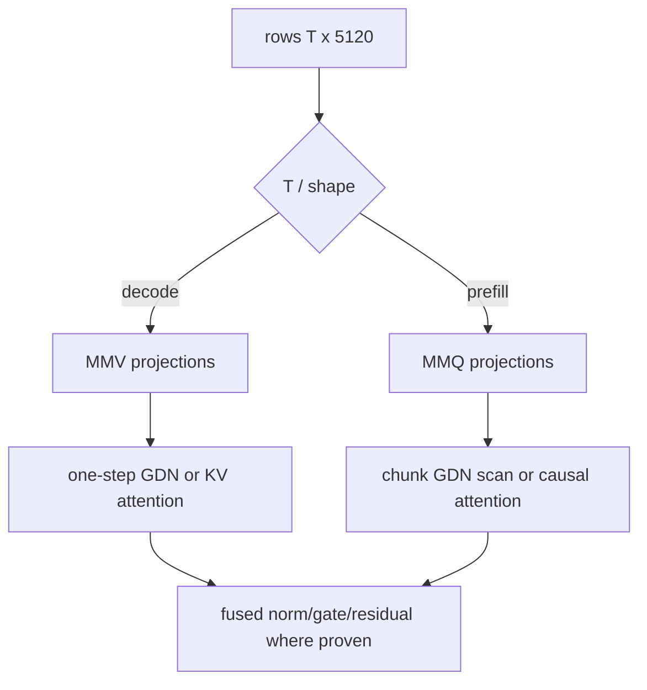

# 6. CUDA execution for decode and prefill

[Previous](05-gpu-implementation.md) · [Index](README.md) · [Next](07-engineering-method.md)

## Why this matters

One CPU loop translated into one kernel leaves decode launch-bound and prefill
compute-starved. Dispatch must reflect row count and the GDN dependency chain.

A GPU runs thousands of lightweight **threads**. Threads are grouped into
blocks, blocks are scheduled onto streaming multiprocessors (SMs), and nearby
threads ideally read adjacent memory so requests are **coalesced**. Global GPU
memory is large and high-bandwidth but has high latency; registers and shared
memory are much smaller and faster. Kernel design is the work of assigning
tensor elements to threads while reusing data in the fast levels without using
so many registers or shared bytes that too few blocks can run.

## Phase-specific dataflow

An **MMV** kernel computes a matrix times one (or a few) vectors. It minimizes
setup for a small row count but cannot reuse each weight tile across many rows.
An **MMQ** kernel computes a matrix times a matrix. It spends more effort
tiling, but a weight tile can serve many prompt rows and often maps to tensor
cores. The names describe the operation, not a promise that one is always
faster.

For a decode projection, all output threads need the same input vector but
different weight rows. A useful MMV kernel keeps pieces of the input available
while streaming quantized weights. For prefill, a tile of weights can multiply
several input rows before it is evicted. That reuse raises **arithmetic
intensity**—more math per byte fetched—and makes the extra MMQ setup worthwhile.

For decode (`T=1`), select quantized MMV kernels, fuse cheap elementwise work
where proven, and update state in place. For prefill (`T>1`), select MMQ/GEMM,
reuse weights across rows, and use chunked GDN scans. Dispatch keys include
format, input/output widths, row bucket, dtype, alignment, tails, GPU capability,
and graph compatibility; unsupported combinations fail explicitly.

A **dispatch key** is simply the set of facts needed to select a correct kernel.
“Tail” means a dimension not divisible by the tile width; for example, a kernel
processing 128 columns at a time needs guarded handling for a width that ends
with only 32 columns. A fast main path without a correct tail path is not a
supported operation.

## GDN kernels

The GDN decode kernel is a dependency chain, not just a large matrix multiply.
It first makes projection rows, then must read the old convolution ring and
recurrent matrix before writing the new state. A second request cannot safely
use the same state buffer until the first has committed. Decode needs: packed
QKV/Z/a/b projections; convolution-ring shift and depthwise
dot; Q/K normalization and 3x head mapping; FP32 decay/prediction/delta/outer
update; gated RMSNorm; output projection. Preserve exact update order. Prefill
may process chunks (the official reference uses 64) but the final recurrent and
convolution state must equal token-by-token execution for arbitrary chunk splits.

The `[48,128,128]` matrices expose parallel heads and tiles but each token
depends on the previous matrix. Avoid materializing repeated Q/K heads; map
value head `h` to QK head `h/3`. Test sequence tails and chunk sizes 1, 3, 4,
63, 64, 65, and nonmultiples of every kernel tile.

Chunked prefill does not remove recurrence. It reorganizes a sequence of
dependent updates so matrix work within a chunk can be parallelized. The chunk
algorithm must receive the state before the chunk and return exactly the state
that sequential token updates would have produced after it. Tests at 63, 64,
and 65 distinguish the ordinary path, an exact chunk, and a one-row tail.

## Attention and FFN kernels

Attention decode reads growing KV from 16 layers; use grouped-query mapping
without physical sixfold copies. Prefill must be causal and handle partial RoPE
on exactly 64 dimensions. Dense FFNs dominate weights: MMV for one/few rows,
MMQ for prompt or batched rows. Fusion is accepted only when the unfused path
remains a differential oracle and profiler data attributes a wall-time win.

**Fusion** combines operations that would otherwise be separate launches. For
example, a fused kernel might normalize a row, apply a gate, and add a residual
without writing each intermediate vector to global memory. The cost is more
complex code, longer-lived registers, and fewer reusable debugging boundaries.
Fusion is therefore a measured optimization after the component operations pass.

## DwarfStar transfer boundary

Reuse MMV/MMQ phase split, quant block tests, explicit unavailable paths, stable
scratch, tail tests, and graph-capture discipline. Adapt dispatch shapes and
fusion. Discard sparse attention and MoE kernels.

## Common failures and verification

Typical failures are selecting MMQ by prompt intent rather than actual row
count, missing tail columns, storing expanded heads, FP16 recurrence, updating
state twice during graph capture, and timing without synchronization.

Exercise: compare CUDA and scalar taps for single-token decode and 256-token
prefill, then for every boundary size above. Expected: declared numerical gates
pass; token-wise and chunked final state agree; the profiler shows MMV in decode
and MMQ in prefill. Speed is recorded, not an acceptance substitute.
