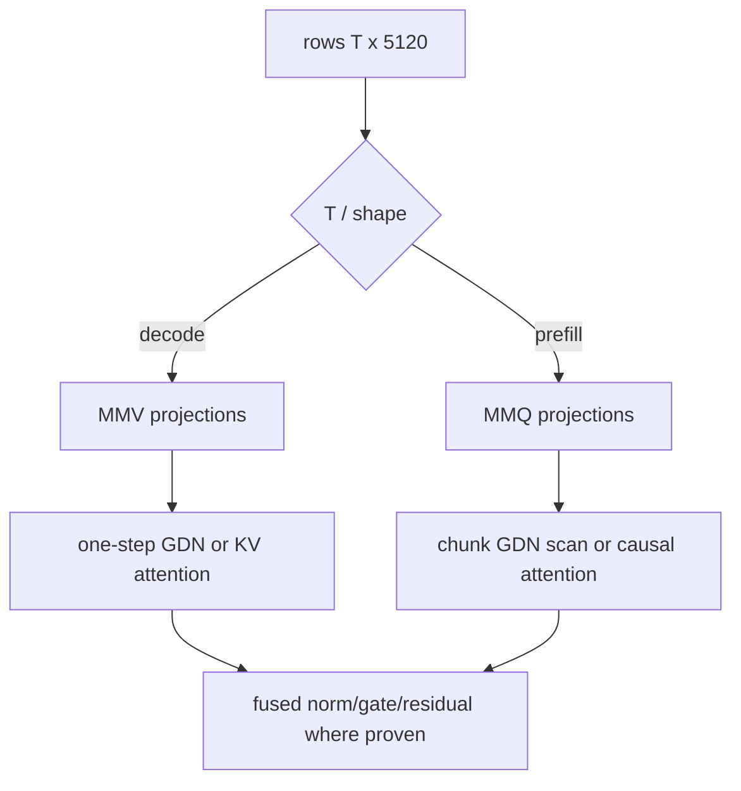

# 6. CUDA execution for decode and prefill

[Previous](05-gpu-implementation.md) · [Index](README.md) · [Next](07-engineering-method.md)

## Why this matters

One CPU loop translated into one kernel leaves decode launch-bound and prefill
compute-starved. Dispatch must reflect row count and the GDN dependency chain.

A GPU runs thousands of lightweight **threads**. Threads are grouped into
blocks, blocks are scheduled onto streaming multiprocessors (SMs), and nearby
threads ideally read adjacent memory so requests are **coalesced**. Global GPU
memory is large and high-bandwidth but has high latency; registers and shared
memory are much smaller and faster. Kernel design is the work of assigning
tensor elements to threads while reusing data in the fast levels without using
so many registers or shared bytes that too few blocks can run.

## Phase-specific dataflow

An **MMV** kernel computes a matrix times one (or a few) vectors. It minimizes
setup for a small row count but cannot reuse each weight tile across many rows.
An **MMQ** kernel computes a matrix times a matrix. It spends more effort
tiling, but a weight tile can serve many prompt rows and often maps to tensor
cores. The names describe the operation, not a promise that one is always
faster. Quartz production Q4_K/Q6_K prompt MMQ uses tensor-core MMA for
`prompt_rows >= 8`. Mixer Q8_0 prompt MMQ uses quality MMA (D4 Y, packed
load-tiles, `MMQ_ITER_K=256`) for `prompt_rows >= 8`, and mixer GEMMs that
share the residual activation share one D4 Y per layer (OPT-022). Mixer Q8_0
GEMMs with `output_rows < 128` (GDN α/β) dispatch the A/B-winning small-I
quality MMA path (OPT-023). Large mixer Q8_0 D2R was A/B'd and not
installed (OPT-024); those GEMMs stay I=128 quality MMA. Dense prompt FFN
Q4_K shares one DS4 Y for gate/up and writes down-leg Y from SwiGLU
(OPT-025). Production prompt attention uses Ada+ stream-K fattn after the
OPT-026 keep; persistent stream-K was A/B-lost and not installed
(OPT-027). Q4_K/Q6_K MMQ stream-K was A/B-lost and not installed
(OPT-028); production quality MMA stays 2D tiling. Fusing GDN conv and
gated-output into the warp-column token loop was A/B-lost and not
installed (OPT-029); production GDN core stays split parallel conv +
warp-column + gated-output. Decode stays MMV.
Tiny mixer prompts keep the
OPT-009 tiled `__fmul_rn`/`__fadd_rn` kernel.
Rank-1 fused MMA remains a non-production kernel. MMA here is Measured
component recovery plus a 4K keep versus the frozen oracle baseline, not the
OPT-016 2K llama.cpp parity gate. Production prompt GDN recurrence is the
warp-column fused quality path; sequential windows remain the unloosened
reference. Production prompt attention (`token_count >= 16`) is the fattn-mma
analog with Ada+ stream-K after the OPT-026 keep; persistent stream-K
was measured and rejected (OPT-027); tiled attention remains the
unloosened reference. Q4_K/Q6_K MMQ stream-K was measured and rejected
(OPT-028); production quality MMA remains 2D tiling. Fusing GDN conv and
gated-output into the warp-column token loop was measured and rejected
(OPT-029); production GDN core remains split conv + warp-column +
gated-output. Those core-quality
paths are also Measured component recovery plus a 4K keep versus the frozen
oracle baseline, not the 2K parity gate.

For a decode projection, all output threads need the same input vector but
different weight rows. A useful MMV kernel keeps pieces of the input available
while streaming quantized weights. For prefill, a tile of weights can multiply
several input rows before it is evicted. That reuse raises **arithmetic
intensity**—more math per byte fetched—and makes the extra MMQ setup worthwhile.

For decode (`T=1`), select quantized MMV kernels, fuse cheap elementwise work
where proven, and update state in place. For prefill (`T>1`), select MMQ/GEMM,
reuse weights across rows, and use chunked GDN scans. Dispatch keys include
format, input/output widths, row bucket, dtype, alignment, tails, GPU capability,
and graph compatibility; unsupported combinations fail explicitly.

A **dispatch key** is simply the set of facts needed to select a correct kernel.
“Tail” means a dimension not divisible by the tile width; for example, a kernel
processing 128 columns at a time needs guarded handling for a width that ends
with only 32 columns. A fast main path without a correct tail path is not a
supported operation.

## GDN kernels

The GDN decode kernel is a dependency chain, not just a large matrix multiply.
It first makes projection rows, then must read the old convolution ring and
recurrent matrix before writing the new state. A second request cannot safely
use the same state buffer until the first has committed. Decode needs: packed
QKV/Z/a/b projections; convolution-ring shift and depthwise
dot; Q/K normalization and 3x head mapping; FP32 decay/prediction/delta/outer
update; gated RMSNorm; output projection. Preserve exact update order. Prefill
may process chunks (the official reference uses 64) but the final recurrent and
convolution state must equal token-by-token execution for arbitrary chunk splits.
Production prompt recurrence (`kFusedTokenLoop`) is the warp-column fused quality
path; sequential 64-token windows remain the unloosened numeric reference.

The `[48,128,128]` matrices expose parallel heads and tiles but each token
depends on the previous matrix. Avoid materializing repeated Q/K heads; map
value head `h` to QK head `h/3`. Test sequence tails and chunk sizes 1, 3, 4,
63, 64, 65, and nonmultiples of every kernel tile.

Chunked prefill does not remove recurrence. It reorganizes a sequence of
dependent updates so matrix work within a chunk can be parallelized. The chunk
algorithm must receive the state before the chunk and return exactly the state
that sequential token updates would have produced after it. Tests at 63, 64,
and 65 distinguish the ordinary path, an exact chunk, and a one-row tail.

## Attention and FFN kernels

Attention decode reads growing KV from 16 layers; use grouped-query mapping
without physical sixfold copies. Prefill must be causal and handle partial RoPE
on exactly 64 dimensions. Production prompt attention (`token_count >= 16`) is
the fattn-mma analog with Ada+ stream-K for prompt tiles; persistent
stream-K was A/B-lost and not installed. The two-row tiled
path remains the unloosened numeric reference. Dense FFNs dominate weights: MMV for one/few rows,
MMQ for prompt or batched rows. Fusion is accepted only when the unfused path
remains a differential oracle and profiler data attributes a wall-time win.

**Fusion** combines operations that would otherwise be separate launches. For
example, a fused kernel might normalize a row, apply a gate, and add a residual
without writing each intermediate vector to global memory. The cost is more
complex code, longer-lived registers, and fewer reusable debugging boundaries.
Fusion is therefore a measured optimization after the component operations pass.

## 2K MMQ versus MMA (OPT-015)

**Measured, OPT-014:** `ffn_mmq` is 77.0% of cold exact-2048 wall (32294.9512 ms
of 41963.8828 ms, ~48.80 tok/s). At 2048 prompt rows, OPT-009 Q4_K selects
tile 4 because there is no 2048 bucket and `prompt_rows > 256` returns 4, so
each decoded weight serves only four rows.

**External:** pinned llama.cpp `cc83d7b` Q4_K MMQ is MMA with prompt-tile J up
to 128. **Estimated** FFN-only ceiling: `2048 / (32294.9512 / 1000) ≈ 63.4`
tok/s versus that revision's scaling `llama-bench` 2K mean 3114.049476 tok/s.

**Proposed** Rank 1 recovery is llama.cpp-style MMA MMQ under MIT file-level
provenance, keeping the CUD-002 reference and frozen envelope. That map is not
a 2K throughput gate and not llama.cpp parity:
[`evidence/optimization/opt015-2k-recovery/REPORT.md`](../evidence/optimization/opt015-2k-recovery/REPORT.md).

## Mixer Q8_0 MMA (OPT-017)

**Measured, RTX 5090:** production mixer Q8_0 prompt MMQ is MMA at J=128 when
`prompt_rows >= 8`. CUD-002 versus `launch_quant_mmq_variant` `kQ8_0` stays at
max abs `5e-4` / RMS `2.5e-4` with zero non-finites. OPT-009 tiled-versus-row-wise
byte equality is unloosened. Live exact-2048 remasurement mean 375.743988 tok/s
versus llama.cpp 3203.276277 tok/s is recorded and is **not** the OPT-016 gate.
**OPT-016 remains the parity gate owner.** OPT-022 later replaced this Rank-1
production body with quality MMA. Report:
[`evidence/optimization/opt017-mixer-q8-mma/REPORT.md`](../evidence/optimization/opt017-mixer-q8-mma/REPORT.md).

## Q4_K/Q6_K MMA quality (OPT-018)

**Measured, RTX 5090:** production Q4_K/Q6_K prompt MMQ is quality MMA
(`MMQ_ITER_K=256`, packed load-tiles, Q8_1 MMQ Y in the existing workspace,
J=128) when `prompt_rows >= 8`. Admission is against host CPU dequant-weight ×
BF16→float GEMM under the ds4 Q4_K association rule (option C; element fails
only when both `abs > 0.20*sqrt(K)` and `rel > 0.05`). Fixed abs/rms are retired
for Q4_K/Q6_K MMQ admission; the scalar variant remains with exact Q8 staging.
Live exact-2048 `ffn_mmq` is **399.287018** ms versus the before snapshot
**2524.67725** ms and live llama.cpp 2K wall **636.184782** ms (`avg_ts`
3219.6604); `llama_competitive` is true. Quartz mean **625.792114** tok/s
versus llama.cpp 3219.6604 tok/s is recorded and is **not** the OPT-016 gate.
**OPT-016 remains the parity gate owner.** Report:
[`evidence/optimization/opt018-ffn-mma-quality/REPORT.md`](../evidence/optimization/opt018-ffn-mma-quality/REPORT.md).

## GDN and attention core quality (OPT-019)

**Measured, RTX 5090:** production prompt GDN recurrence is warp-column fused
quality (`dim3(32, 4)`, grid z=32, `s_shard[4]`). Sequential windows remain the
unloosened reference (`5e-8` / `5e-9`). Production prompt attention
(`token_count >= 16`) is the fattn-mma analog with pinned ncols1=16 and
ncols2=2. Production prompt attention uses Ada+ stream-K after the OPT-026
keep; persistent stream-K was A/B-lost and not installed (OPT-027).
Tiled attention remains the unloosened OPT-005 reference
(`5e-5` / `5e-6`). Live exact-2048 `gdn` **1205.38806** ms and `attention`
**475.116028** ms versus locked befores **1643.46082** / **1148.47461** ms
meet the 85%/85%/70% addressed rule (`combined_after` **1680.504088** ms).
Quartz mean **978.151855** tok/s versus llama.cpp **3197.246224** tok/s is
recorded; `would_pass_opt016` is informational false. This is **not** the
OPT-016 gate. **OPT-016 remains the parity gate owner.** Report:
[`evidence/optimization/opt019-gdn-attention-core/REPORT.md`](../evidence/optimization/opt019-gdn-attention-core/REPORT.md).

**Measured, RTX 5090:** live cold exact-2048 attribution reports exclusive
`mixer_mmq` 1199.25122 ms, `gdn_core` 212.156006 ms, and `attention_core`
273.986725 ms of wall 2086.2561 ms in
[`fixtures/opt020_prefill_split.json`](../fixtures/opt020_prefill_split.json).
Nsight was not used. This is instrumentation, not a throughput gate.

## 4K keep/reject oracle (OPT-021)

**Measured protocol/baseline, RTX 5090:** one exclusive sitting records three
cold exact-4096 production `sync_tokens` tok/s (attribution null, graphs
created, production fused GDN and overlapped path) and same-sitting llama.cpp
`llama-bench -p 4096 -n 0 --no-warmup -r 3 -ngl 99` `avg_ts`. Live means from
that sitting are Quartz **966.039062** tok/s versus llama.cpp **3224.522433**
tok/s. Later production changes keep only when cold exact-4096 mean tok/s is
strictly greater than that retained Quartz baseline. This is **not** a
throughput gate versus llama.cpp and **does not substitute for the 2K
llama.cpp parity gate.** OPT-016 remains the 2K parity owner. Scout sitting
965.204895 / 3182.476587 tok/s is contract transparency only and is **not**
the retained fixture. Live numbers stay in the report; this chapter does not
replace them:
[`evidence/optimization/opt021-4k-oracle/REPORT.md`](../evidence/optimization/opt021-4k-oracle/REPORT.md).

## Mixer Q8_0 quality MMQ (OPT-022)

**Measured, RTX 5090:** production mixer Q8_0 prompt MMQ is the quality stack
(D4 `quantize_mmq_q8_1`, packed load-tiles, `MMQ_ITER_K=256`, block
`dim3(32, 8)`, J=128) when `prompt_rows >= 8`. Mixer GEMMs that share the
residual activation reuse one D4 Y in existing `prompt_q8_` per layer; GDN
output requantizes at K=6144 into the same workspace. No extra persistent
`cudaMalloc`. Admission versus host CPU dequant GEMM uses the Q8 association
rule (an element fails only when both `abs > 0.05*sqrt(K)` and `rel > 0.05`).
The tiled-versus-row-wise Q8_0 pair remains byte-exact. Rank-1 fused MMA is
retained and is not production. Live exclusive-RTX-5090 cold exact-4096
**keep:** Quartz mean **1680.38025** tok/s versus the frozen oracle baseline
**967.267761**. Production was not reverted. `quartz_meets_llama` is
informational and is not this gate. This is **not** the 2K llama.cpp parity
gate. Live numbers stay in the report; this chapter does not replace them:
[`evidence/optimization/opt022-mixer-q8-quality/REPORT.md`](../evidence/optimization/opt022-mixer-q8-quality/REPORT.md).

## Skinny-M mixer dispatch (OPT-023)

**Measured, RTX 5090:** mixer Q8_0 projections with `output_rows < 128`
(GDN α/β at 48) dispatch through the A/B-winning small-I quality MMA path
`mma_i32_j128` instead of I=128 Fallback. Large mixer Q8 GEMMs remain
I=128 / J=128 quality MMA with shared residual D4 Y. Decode `q8_mmv_bf16`
is unchanged. Paired CUDA-event A/B on `4096×48×5120` retained the winner
`mma_i32_j128`; raw samples stay in
[`evidence/optimization/opt023-skinny-mixer/skinny-ab-raw.txt`](../evidence/optimization/opt023-skinny-mixer/skinny-ab-raw.txt).
The tiled-versus-row-wise Q8_0 pair remains byte-exact. Live exclusive
RTX-5090 cold exact-4096 **keep:** Quartz mean strictly greater than the
frozen post-OPT-022 oracle baseline **1680.80627**. Production skinny
dispatch was not reverted. `quartz_meets_llama` is informational and is
not this gate. This is **not** the 2K llama.cpp parity gate. Live numbers
stay in the report; this chapter does not replace them:
[`evidence/optimization/opt023-skinny-mixer/REPORT.md`](../evidence/optimization/opt023-skinny-mixer/REPORT.md).

## Large-mixer aligned SoA D2R (OPT-024)

**Measured, RTX 5090:** large mixer Q8_0 GEMMs (`output_rows >= 128`) were
A/B'd against a ds4-inspired aligned-SoA D2R / int8 MMA path. The paired
CUDA-event A/B did not strictly beat quality MMA on every timed large shape.
Production large mixers remain I=128 / J=128
quality MMA with shared residual D4 Y. Skinny α/β stay `mma_i32_j128`. Decode
`q8_mmv_bf16` is unchanged. The tiled-versus-row-wise Q8_0 pair remains
byte-exact. Live exclusive RTX-5090 cold exact-4096 **reject:** Quartz mean
is not strictly greater than the frozen OPT-023 successor oracle
**1687.86169**. Production D2R was not installed. `quartz_meets_llama` is
informational and is not this gate. This is **not** the 2K llama.cpp parity
gate. Live numbers stay in the report; this chapter does not replace them:
[`evidence/optimization/opt024-mixer-q8-d2r/REPORT.md`](../evidence/optimization/opt024-mixer-q8-d2r/REPORT.md).

Dense prompt FFN Q4_K gate/up share one DS4 Q8_1 of the FFN-norm activation
and SwiGLU writes down-leg Y without a global BF16 mid store when that A/B
wins. **Measured, RTX 5090:** A/B winner `shared_y_swiglu_q8`. Mixer Q8
quality MMA, skinny `mma_i32_j128`, and the D2R reject stay. Decode FFN
stays MMV. The tiled-versus-row-wise Q8_0 pair remains byte-exact. Live
exclusive RTX-5090 cold exact-4096 **keep:** Quartz mean strictly greater
than the frozen OPT-023 successor oracle **1687.86169**. `quartz_meets_llama`
is informational and is not this gate. This is **not** the 2K llama.cpp
parity gate. Live numbers stay in the report; this chapter does not replace
them:
[`evidence/optimization/opt025-ffn-shared-y/REPORT.md`](../evidence/optimization/opt025-ffn-shared-y/REPORT.md).

## Post-OPT-026 4K attribution and second ladder

The OPT-022–OPT-026 4K idea ladder is exhausted. Successor oracle Quartz mean
**1746.71973** tok/s versus same-sitting llama.cpp **3253.993621** tok/s
(`fixtures/opt026_fattn_streamk.json`); Quartz still does not meet llama.cpp
at 4K. Live exclusive-RTX-5090 CUDA-event scout after OPT-026 (rebuilt
production objects, cold exact-4096, graphs=64) attributes wall **2348.33** ms
as `attention_core` **36.9%**, `ffn_mmq` **31.4%**, `gdn_core` **19.3%**,
`mixer_mmq` **12.2%**. Oracle-length next pick is attention. Second keep/reject
ladder: OPT-027–OPT-031 (persistent Ada+ fattn stream-K, MMQ stream-K, GDN
fuse, PDL, mixer/GDN graphs). OPT-027 retained a reject: persistent did
not strictly beat production `stream_k`, so production fattn stays
OPT-026 Ada+ stream-K (`grid.z=2`). OPT-028 retained a reject: Q4_K/Q6_K
MMQ stream-K did not strictly beat 2D tiling, so production quality MMA
stays 2D tiling (`kSelectedMmqStreamKPath` `off`). Remaining second-ladder
picks after the GDN-fuse reject are OPT-030–OPT-031. Evidence:
[`evidence/optimization/speedup-loop-post026/REPORT.md`](../evidence/optimization/speedup-loop-post026/REPORT.md);
method: [`speedup-loop.md`](../speedup-loop.md). This is instrumentation and
task admission, **not** the 2K llama.cpp parity gate.

## Persistent Ada+ fattn stream-K (OPT-027)

**Measured, RTX 5090:** persistent Ada+ fattn stream-K (`nsm × occupancy`
linearized tiles, 5% efficiency rounding, uniform/general fixup) was
A/B'd against production `stream_k` (`grid.z=2`). Persistent did not
strictly beat `stream_k`. Production prompt attention remains OPT-026
Ada+ stream-K. Persistent kernels remain as non-production symbols.
`kSelectedFattnPath` stays `"stream_k"`; `kSelectedPersistentFattnPath`
is `off`. Mixer Q8 quality, skinny `mma_i32_j128`, and FFN
`shared_y_swiglu_q8` stay. Decode attention is unchanged. ncols1 stays
16. Tiled attention remains the unloosened reference. Live exclusive
RTX-5090 cold exact-4096 **reject:** Quartz mean is not strictly greater
than the frozen successor-oracle baseline **1746.71973**. Production
persistent was not installed. `quartz_meets_llama` is informational and
is not this gate. This is **not** the 2K llama.cpp parity gate. Live
numbers stay in the report; this chapter does not replace them:
[`evidence/optimization/opt027-persistent-fattn/REPORT.md`](../evidence/optimization/opt027-persistent-fattn/REPORT.md).

## Q4_K/Q6_K MMQ stream-K (OPT-028)

**Measured, RTX 5090:** llama.cpp-style Q4_K/Q6_K MMQ stream-K (linearized
`kbc` tile walk plus optional fixup) was A/B'd against production 2D
tiling quality MMA. Neither `stream_k` nor `stream_k_nsm` strictly beat
`off`. Production Q4_K/Q6_K MMA remains 2D tiling. Stream-K kernels remain
as non-production symbols. `kSelectedMmqStreamKPath` is `off`.
`kSelectedFfnPath` stays `"shared_y_swiglu_q8"`. Mixer Q8 quality, skinny
`mma_i32_j128`, and fattn Ada+ stream-K stay. Decode FFN is unchanged. J
stays 128. No extra persistent `cudaMalloc`. Prompt FFN graphs were not
recaptured. Live exclusive RTX-5090 cold exact-4096 **reject:** Quartz mean
is not strictly greater than the frozen successor-oracle baseline
**1746.71973**, and the A/B lost. Production stream-K was not installed.
`quartz_meets_llama` is informational and is not this gate. This is **not**
the 2K llama.cpp parity gate. Live numbers stay in the report; this chapter
does not replace them:
[`evidence/optimization/opt028-mmq-streamk/REPORT.md`](../evidence/optimization/opt028-mmq-streamk/REPORT.md).

## Fuse GDN conv and gated output (OPT-029)

**Measured, RTX 5090:** collapsing tiled causal convolution and/or
gated-output into the warp-column GDN token loop was A/B'd against the
split sequence (`off`, `fuse_conv`, `fuse_gate`, `fuse_both`). No
optimized id strictly beat `off`. Production prompt GDN remains split
parallel conv + warp-column + `gdn_gated_output_rows`. Fused kernels
remain as non-production symbols. `kSelectedGdnFusePath` is `off`.
`GdnScanPath::kFusedTokenLoop` stays the production scan enum. Mixer Q8
quality, skinny `mma_i32_j128`, FFN `shared_y_swiglu_q8`, and fattn
Ada+ stream-K stay. Decode GDN is unchanged. Sequential windows remain
the unloosened reference. Live exclusive RTX-5090 cold exact-4096
**reject:** Quartz mean is not strictly greater than the frozen
successor-oracle baseline **1746.71973**, and the A/B lost. Production
fusion was not installed. `quartz_meets_llama` is informational and
is not this gate. This is **not** the 2K llama.cpp parity gate. Live
numbers stay in the report; this chapter does not replace them:
[`evidence/optimization/opt029-gdn-fuse/REPORT.md`](../evidence/optimization/opt029-gdn-fuse/REPORT.md).

## DwarfStar transfer boundary

Reuse MMV/MMQ phase split, quant block tests, explicit unavailable paths, stable
scratch, tail tests, and graph-capture discipline. Adapt dispatch shapes and
fusion. Discard sparse attention and MoE kernels. OPT-015 keeps that rejection:
compressed attention, sparse indexing, MoE streaming, mHC, and DSpark stay
non-transferable Qwen-policy boundaries, not 2K recovery levers.

## Common failures and verification

Typical failures are selecting MMQ by prompt intent rather than actual row
count, missing tail columns, storing expanded heads, FP16 recurrence, updating
state twice during graph capture, and timing without synchronization.

Exercise: compare CUDA and scalar taps for single-token decode and 256-token
prefill, then for every boundary size above. Expected: declared numerical gates
pass; token-wise and chunked final state agree; the profiler shows MMV in decode
and MMQ in prefill. Speed is recorded, not an acceptance substitute.
