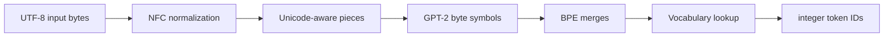

# 15. How text becomes model tokens

[Previous](14-artifact-validation.md) · [Index](README.md)

A language model does not receive words or characters. It receives a sequence of
integer **token IDs** such as `[14556, 1814]`. The tokenizer is the deterministic
program that turns the user's UTF-8 text into those integers. If one ID differs,
the model is executing a different prompt.

This chapter explains ledger tasks TOK-001 and EDU-001 from first principles and
links each concept to the implementation and frozen evidence.



## Three different units: bytes, characters, and tokens

A **byte** is an integer from 0 to 255 stored by the computer. UTF-8 represents a
Unicode character using one to four bytes. The letter `A` is byte `41` in
hexadecimal; `é` is normally the two bytes `c3 a9`; the clock emoji `🕰` is four
bytes `f0 9f 95 b0`.

A Unicode **code point** is the standard number assigned to a character, such as
`U+0041` for `A`. A displayed user-perceived character can contain multiple code
points: a base letter plus a combining accent is a common example.

A model **token** is neither necessarily a byte nor a character nor a word. It is
an entry in a learned vocabulary. One token may represent `hello`, the common
word-with-leading-space `Ġworld`, one byte of an unfamiliar character, or a
control marker such as `<|im_start|>`.

Keeping these units separate prevents errors such as slicing in the middle of a
UTF-8 character or assuming that one visible character always maps to one token.

## Stage 1: NFC normalization

Unicode sometimes offers more than one code-point sequence for the same visible
text. For example, `é` can be the single code point `U+00E9` (`c3 a9` in UTF-8),
or `e` followed by combining acute accent `U+0065 U+0301` (`65 cc 81`).

**NFC**, or *Normalization Form Canonical Composition*, rewrites canonically
equivalent sequences to a stable composed representation where Unicode defines
one. It does not translate languages, change case, or remove accents. Its purpose
is to prevent visually identical input from taking different token paths merely
because an editor stored it differently.

Quartz uses the pinned utf8proc `UTF8PROC_STABLE | UTF8PROC_COMPOSE` operation in
[`src/tokenizer.cpp`](../src/tokenizer.cpp). Invalid UTF-8 fails explicitly. The
fixtures named `nfc` and `nfd_input` begin with different bytes but must produce
the same IDs after normalization.

## Stage 2: Unicode-aware splitting

Running BPE across an entire document would allow merges across unrelated word
and line boundaries. The official tokenizer first divides normalized text into
smaller **pieces** using this ordered family of rules:

1. common English contractions such as `'s`, `'t`, `'re`, and `'ve`;
2. a run of Unicode letters/combining marks, optionally with one leading
   non-letter character (commonly a space);
3. one Unicode number at a time;
4. punctuation/symbol runs, optionally beginning with an ASCII space;
5. line-break and whitespace runs; and
6. remaining whitespace.

“Unicode-aware” means `量`, Arabic letters, and Latin letters are classified by
Unicode categories instead of an ASCII-only `A`–`Z` test. Combining marks remain
with their letter run. Quartz obtains categories from utf8proc but implements the
Qwen-specific ordered rules locally.

The ordering and lookahead matter. For two spaces before `leading`, the official
split leaves the final space attached to the word: `[" ", " leading"]`. The
regex rule `\s+(?!\S)` backtracks one space before following non-whitespace. Our
first native implementation consumed both spaces and failed two fixtures. The
failed IDs, diagnosis, and correction are preserved in the TOK-001 ledger log.

## Stage 3: GPT-2 byte mapping

BPE needs a finite alphabet that can represent every valid UTF-8 byte sequence.
GPT-2's **byte-level mapping** assigns each of the 256 possible byte values to a
printable Unicode symbol used only inside the tokenizer. This is a reversible
table, not text normalization.

Printable bytes mostly map to themselves. Bytes awkward in a vocabulary—space,
newline, control bytes, and some others—map to code points starting at 256:

| Input byte | Internal symbol | Meaning |
|---:|---|---|
| `20` | `Ġ` | ASCII space |
| `0a` | `Ċ` | line feed |
| `68` | `h` | printable ASCII `h` |

Thus the piece ` world` becomes the internal symbol sequence beginning
`Ġworld`. The visible `Ġ` is not inserted into the user's prompt; it is a
lossless name for byte `20`. Non-ASCII text uses the same mapping for each UTF-8
byte, guaranteeing a representation even before any larger merge exists.

Quartz builds all 256 mappings in `Tokenizer::build` and applies them in
`Tokenizer::encode_piece` in [`src/tokenizer.cpp`](../src/tokenizer.cpp).

## Stage 4: byte-pair encoding (BPE)

Starting with one symbol per byte, **byte-pair encoding** repeatedly combines
adjacent symbols according to a ranked merge table learned when the tokenizer
was created. Lower rank means higher priority. Consider toy ranks:

```text
rank 10: h + e -> he
rank 20: l + l -> ll
rank 30: he + ll -> hell
rank 40: hell + o -> hello
```

Starting from `[h,e,l,l,o]`, the algorithm selects the best currently adjacent
pair, merges every occurrence of that pair, and repeats until no listed pair
remains. Final symbols are looked up in the vocabulary to obtain IDs. Real Qwen
uses 247,587 ranked merges loaded from the admitted GGUF.

BPE is deterministic. Choosing the first textual pair instead of the lowest
rank, merging across pre-tokenizer boundaries, or stopping one round early can
produce valid vocabulary entries but the wrong prompt.

## Special tokens

Strings such as `<|im_start|>` and `<|im_end|>` are control markers understood by
the model. They must become their dedicated single IDs, not ordinary `<`, `|`,
and letter pieces. Quartz identifies control/user-defined entries from GGUF token
types, prefers the longest match at the earliest byte position, and runs ordinary
normalization/BPE only around them.

This is why arbitrary user text and rendered chat templates need a clear
boundary: later TOK-002 code decides when protocol markers may be introduced.

## Worked real example

For UTF-8 text `hello world`:

```text
input bytes       68 65 6c 6c 6f 20 77 6f 72 6c 64
NFC text          hello world
Unicode pieces    ["hello", " world"]
byte symbols      [h e l l o] [Ġ w o r l d]
BPE results       ["hello", "Ġworld"]
token IDs         [14556, 1814]
```

The exact result is **Measured** from both the official pinned tokenizer and the
native implementation and stored in
[`fixtures/tokenizer_authority.json`](../fixtures/tokenizer_authority.json).

## Fixtures and fixture equality

A **test fixture** is a checked-in input plus expected output captured from an
authority. It makes behavior reproducible without relying on memory or a moving
upstream service. The generator
[`tools/generate_tokenizer_fixtures.py`](../tools/generate_tokenizer_fixtures.py)
first verifies every official tokenizer asset's size and SHA-256, then uses
`tokenizers==0.22.1` to record exact input bytes, expected IDs/token strings, and
decoded output bytes.

**Fixture equality** means the native ID list is exactly equal—same integers,
order, and length—to the authority list. It is not a floating-point tolerance
and not “the decoded sentence looks similar.” `[14556,1814]` versus
`[14556,220,1814]` is a hard failure because the model receives different input.

[`tests/test_tokenizer_integration.py`](../tests/test_tokenizer_integration.py)
compares every case: empty input, contractions, spaces, CR/LF boundaries,
punctuation, composed/decomposed accents, CJK, Arabic, Indic text, emoji, code
indentation, and special markers.

## Pins, claims, and failure modes

Exact tokenizer identities live in
[`pins/artifacts.lock.json`](../pins/artifacts.lock.json). The GGUF contract
admits 248,320 tokens/token types and 247,587 merges. Authority copies under
`models/tokenizer/` are ignored by git.

The native path matching all frozen fixtures is a **Measured** milestone. TOK-001
is admitted only after clean host/container builds, malformed UTF-8 coverage, and
final ledger evidence. TOK-002—turning role-structured messages into template
text—is separate: correct BPE does not prove correct chat rendering.

Common failures include skipping NFC, using ASCII character classes, treating
bytes as signed indexes, merging by encounter order instead of rank, consuming
the whitespace belonging to the next word, recognizing a prefix instead of the
longest special token, or silently substituting an unknown token.
