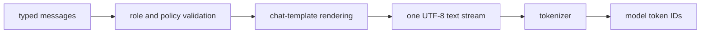

# 16. How chat messages become one prompt

[Previous](15-tokenizer-authority.md) · [Index](README.md)

Applications represent a conversation as structured records:

```json
[
  {"role": "system", "content": "Be concise."},
  {"role": "user", "content": "Why a watch?"}
]
```

The model does not receive JSON and does not inherently know which string came
from which speaker. A **chat template** deterministically serializes those
records into one text stream containing control markers. The tokenizer from the
previous chapter then converts that stream to integer IDs.



This chapter explains ledger tasks TOK-002 and EDU-002. The implementation is
[`src/template.cpp`](../src/template.cpp); frozen official behavior is in
[`fixtures/template_authority.json`](../fixtures/template_authority.json).

## Roles

A **role** says why a message exists and how it should influence the model:

- `system` supplies overall behavior or context;
- `developer` supplies application instructions (an OpenAI API role);
- `user` is an ordinary request;
- `assistant` is earlier model output; and
- `tool` is data returned by a function the assistant requested.

Qwen's official template directly understands system, user, assistant, and tool
messages. Quartz v1 maps leading developer instructions into the system block,
preserving their order and separating multiple instructions with blank lines.
System/developer messages appearing after conversation content fail: silently
moving them would change instruction priority.

## Control tokens and delimiters

The rendered stream uses special control tokens:

```text
<|im_start|>user
Hello<|im_end|>
<|im_start|>assistant
```

`<|im_start|>` begins a role block; `<|im_end|>` ends it. These strings become
dedicated tokenizer IDs rather than ordinary punctuation. Newlines are part of
the protocol. Removing one or adding a space can change token IDs, so formatting
is executable behavior rather than cosmetic presentation.

The final open assistant block is a **generation prompt**: it tells the model
that the next tokens should be an assistant reply. Historical assistant blocks
are closed because their contents already exist.

## Reasoning controls

Qwen can place private working text between `<think>` and `</think>` markers.
Quartz options choose whether a new response may think and select `low`,
`medium`, or `xhigh` reasoning effort. The official template turns low and xhigh
into explicit system instructions; medium adds no extra instruction.

With thinking disabled, the generation prompt contains an already-closed empty
thinking block:

```text
<|im_start|>assistant
<think>

</think>

```

With thinking enabled it leaves `<think>` open so generation begins in the
reasoning region. Historical assistant messages can retain their recorded
`reasoning_content`; the `preserve_thinking` option controls whether older
reasoning is kept. Sampling and API exposure of reasoning are later layers—the
template only defines model input bytes.

## Tools, calls, and results

A **tool definition** describes a function name, purpose, and JSON parameter
schema. The template places canonical JSON definitions inside a system `<tools>`
section and supplies the exact XML-like call syntax the model must emit.

An assistant call to `weather(city="Bern")` is rendered as:

```text
<tool_call>
<function=weather>
<parameter=city>
Bern
</parameter>
</function>
</tool_call>
```

The application executes that call; the model does not. Returned data is wrapped
as a user-side tool response:

```text
<tool_response>
{"temperature":18}
</tool_response>
```

Consecutive tool results share one user block, matching the official protocol.
Tool JSON must be canonical before it reaches the renderer; later server code
owns JSON parsing and canonicalization. The engine boundary never manipulates
HTTP request objects.

## Official behavior versus Quartz policy

Two different authorities are kept visible:

- **Official template behavior** is rendered from the pinned Qwen Jinja template.
  Examples include exact role blocks and errors such as a late system message.
- **Quartz v1 policy** narrows that behavior. The upstream multimodal template
  accepts image items and emits vision markers, but v1 rejects them before any
  marker is rendered. Leading developer messages are mapped to system content
  because the OpenAI APIs require that role even though Qwen does not name it.

Fixtures label policy-owned cases separately. This avoids claiming that upstream
rejects a feature it actually supports or that a Quartz mapping is official Qwen
behavior.

## Worked example

Input records:

```json
[
  {"role": "system", "content": "Be concise."},
  {"role": "user", "content": "Why a watch?"}
]
```

With low reasoning effort and a generation prompt, the rendered text is:

```text
<|im_start|>system
Reasoning effort is set to low. Keep your thinking brief and focused, moving directly to the conclusion without unnecessary elaboration.

Be concise.<|im_end|>
<|im_start|>user
Why a watch?<|im_end|>
<|im_start|>assistant
<think>
```

The frozen authority output is 249 UTF-8 bytes and tokenizes to 48 IDs. Native
rendered bytes and resulting IDs both match exactly; this is **Measured** by the
template and tokenizer integration tests.

## Template fixtures and equality

[`tools/generate_template_fixtures.py`](../tools/generate_template_fixtures.py)
loads the pinned official template and renders successful cases for basic user
input, reasoning modes, system instructions, assistant history, and a full tool
call/result sequence. It also records upstream errors and separately labeled v1
policy cases.

Template equality is byte-for-byte equality of the entire rendered UTF-8 stream.
Tokenizer equality then requires the complete ID list to match. Checking both
matters: two different strings might coincidentally tokenize the same under one
vocabulary, while matching text with a broken tokenizer is also insufficient.

Tests in [`tests/test_template.py`](../tests/test_template.py) compare rendering
and errors without requiring model weights. The installed-artifact integration
test in
[`tests/test_tokenizer_integration.py`](../tests/test_tokenizer_integration.py)
also checks every rendered prompt's IDs.

## Failure modes and remaining boundary

Common failures include treating JSON as the model prompt, omitting role markers,
placing a system message late, losing historical reasoning unexpectedly, leaving
an assistant history block open, serializing tools in unstable key order,
wrapping each tool result as an unrelated user turn, accepting vision in text-only
v1, or confusing template completion with API/server completion.

TOK-002 covers deterministic rendering only. HTTP validation, structured request
parsing, streaming, cancellation, `previous_response_id`, and response objects
belong to SRV-001–SRV-003 and remain unfinished.
