# Build a Qwen3.8-27B engine on one RTX 5090

This handbook has one outcome: help a systems programmer build a narrow,
text-first inference engine for Qwen3.8-27B on a 32 GiB RTX 5090. It is a design
and implementation guide, not Qwen support for DwarfStar and not a promise of a
particular speed. That is the primary optimization target; the architecture also
supports DGX Spark, Apple Silicon, and CPU-only hosts at lower support tiers.
DwarfStar is a worked systems case study.

## Authority and evidence

Pin all inputs before writing code. The model contract comes from the official
[configuration](https://huggingface.co/Qwen/Qwen3.8-27B/blob/main/config.json),
[checkpoint](https://huggingface.co/Qwen/Qwen3.8-27B), tokenizer/chat template,
and the Transformers `qwen3_5` implementation. The checkpoint is named Qwen3.8,
but its configuration declares `model_type: qwen3_5`; follow the declared
implementation, not a guessed module name. Use a pinned llama.cpp revision as
an independent execution oracle. [q27](https://github.com/signalnine/q27) is an
attributed specialization case study; its measurements do not describe
DwarfStar or the engine proposed here.

## Two reading tracks

The fundamentals track is Chapters 1, 3, 5, 6, 7, and 8. The implementation
track is Chapters 2, 4, 9, and 10. Both use Chapter 11 for review and Chapter 12
for language and host portability decisions.

1. [Inference fundamentals](01-foundations.md): shapes, bytes, rooflines.
2. [A complete DwarfStar request](02-execution-path.md): reusable mechanics and model-specific traps.
3. [The Qwen model contract](03-deepseek-v4.md): the forward pass and state.
4. [Scalar oracle](04-numerics.md): reference implementation and differential tests.
5. [Weights and the 32 GiB ledger](05-gpu-implementation.md): conversion and quantization.
6. [CUDA decode and prefill](06-system-optimization.md): MMV, MMQ, GDN, attention.
7. [Hybrid sessions](07-engineering-method.md): checkpointing, reuse, batching, graphs.
8. [RTX 5090 optimization](08-rtx-5090.md): profiler-led sequencing.
9. [Gated implementation roadmap](09-engine-comparison.md): twelve acceptance milestones.
10. [Deferred MTP and vision](10-qwen-transfer.md): extensions without text-core redesign.
11. [Glossary, worksheets, and exercises](11-glossary-worksheets.md).
12. [Language and platform strategy](12-language-and-platforms.md): C++ boundaries and tiered backends.
13. [V1 allocation ledger](13-allocation-ledger.md): explicit 128K budget and proof boundary.
14. [Artifact validation](14-artifact-validation.md): exact identity, tensor roles, and byte ranges.
15. [Tokenizer authority](15-tokenizer-authority.md): pinned Unicode/BPE fixtures and native admission boundary.
16. [Chat templates](16-chat-template.md): roles, reasoning, tools, policy ownership, and exact rendering.
17. [Quantization and scalar arithmetic](17-quantization.md): packed Q4_K/Q6_K weights, decoding, dot products, and numeric equality.
18. [Gated Delta Networks](18-gated-delta-network.md): recurrence, convolution warm-up, head mapping, persistent state, and chunks.
19. [Attention and feed-forward networks](19-attention-and-ffn.md): grouped causal lookup, partial RoPE, KV history, softmax, and SwiGLU.
20. [Q8_0 scalar rows](20-q8-scalar-rows.md): signed-byte blocks, mixed-format artifacts, and matrix-row preparation.
21. [Tensor rows and matvec](21-tensor-rows.md): GGUF dimension order, checked row binding, mixed-format multiplication, and admitted fixtures.
22. [GGUF parameter conversion](22-gguf-conversion.md): folded decay, direct norm scales, squeezed convolution, and grouped/tiled GDN heads.
23. [Typed model weights](23-typed-model-weights.md): non-owning vector/matrix views, common and variant layer fields, exact schema admission, and complete binding.
24. [Packed projection layouts](24-packed-projections.md): GDN Q/K/V ranges, per-head attention query/gate halves, aliasing, and downstream head conversion.
25. [Real mixer projections](25-real-mixer-projections.md): complete typed matvec execution, exact scalar workspaces, independently decoded taps, and measured cost.
26. [One real GDN mixer layer](26-real-gdn-layer.md): input norm, convolution and recurrent state, layout transitions, gated norm, output projection, and residual.
27. [One real SwiGLU FFN branch](27-real-ffn-layer.md): post-mixer norm, gate/up/down projections, SiLU, workspace, residual, and evidence limits.
28. [Real grouped-query attention and KV state](28-real-attention-layer.md): two-position partial RoPE, grouped causal lookup, cache mutation, output gating, and residual.
29. [Complete decoder-layer composition](29-complete-decoder-layer.md): mixer-to-FFN handoff, two residuals, layer variants, validation order, and scheduler boundary.
30. [Embeddings and logits](30-embeddings-and-logits.md): token-row lookup, hidden vectors, final norm, vocabulary scores, greedy choice, and proof limits.
31. [One full scalar token](31-full-scalar-token.md): exact 64-layer hybrid schedule, parameter/state/scratch ownership, ping-pong residuals, frontier, and structural evidence.
32. [Trace bundles and numeric comparison](32-trace-bundles-and-metrics.md): taps, manifest/blob layout, identities, checksums, session frontiers, tolerance metrics, and top-logit differences.
33. [Diagnostic trace isolation and filters](33-diagnostic-trace-isolation.md): separate builds, backend-neutral typed sinks, stable names, exact filters, and release-binary exclusion.
34. [Real scalar taps and bundle capture](34-real-scalar-traces.md): stage timing, raw versus RoPE attention values, state hashes, exact capture, and trace-v1 round trips.
35. [Multi-token scalar chunks](35-scalar-token-chunks.md): whole-chunk preflight, token positions, logit rows, exact state equivalence, and structural continuation evidence.
36. [Independent same-GGUF llama.cpp authority](36-independent-llama-authority.md): authority hierarchy, exact build/model/token identity, complete logit rows, and the tolerance-freeze boundary.
37. [Official-checkpoint Transformers authority](37-transformers-authority.md): original versus GGUF weights, Safetensors shards, eager offload, hooks/taps, real logits, and proof limits.
38. [Three-authority scalar tolerances](38-scalar-authority-tolerances.md): comparable boundaries, exact layout normalization, error metrics, greedy margins, and immutable pre-CUDA gates.
39. [The first CUDA matrix-vector kernel](39-cuda-quant-mmv.md): BF16-to-Q8 staging, packed Q4_K/Q6_K rows, warp ownership, FP32 reduction, device gates, and measured proof limits.
40. [Tiled CUDA multiplication for prompt rows](40-cuda-prompt-mmq.md): prompt matrices, token-major output, two-dimensional tiles, packed-weight reuse, tails, and scalar/device gates.
41. [One CUDA GDN step and atomic state staging](41-cuda-gdn-step.md): production recurrence, causal convolution, candidate state, cancellation, commit, and frontier publication.
42. [Chunked CUDA GDN prefill](42-cuda-gdn-chunks.md): token-major chunks, strict recurrence order, 64-token windows, candidate continuity, cancellation, and token-wise equivalence.
43. [CUDA grouped-query attention decode](43-cuda-attention-decode.md): heads and KV sharing, normalization, partial RoPE, BF16 cache rows, causal stable softmax, candidate commit, and frozen numeric gates.
44. [Memory-bounded CUDA attention prefill](44-cuda-attention-prefill.md): token-major chunks, candidate continuity, linear score workspaces, whole-chunk commit, exact token-wise equivalence, and the 131,072 boundary.
45. [CUDA scheduler prerequisites](45-cuda-scheduler-primitives.md): resident Q8_0 weights, embedding lookup, BF16/FP32 boundaries, pointwise layer glue, and packed GDN/attention layouts.
46. [The first complete CUDA token](46-cuda-full-scheduler.md): resident model remapping, the 48/16 hybrid schedule, FP32 residual accumulation, reusable state/scratch, full logits, frozen trace gates, and retained negative results.
47. [Exact token-prefix synchronization](47-cuda-prefix-sync.md): token histories, common prefixes, append/no-op reuse, divergent and shorter replay, preflight, and byte-exact fixture equality.
48. [Atomic CUDA evaluation and separate sampling](48-atomic-eval-and-sampling.md): committed versus candidate state, pointer publication, frontier-last visibility, cancellation/errors, and read-only token choice.
49. [Source and evidence ledger](sources.md).

Claims use four labels: **Measured** (this exact artifact and hardware),
**External** (a linked source), **Estimated** (reproducible arithmetic), and
**Proposed** (a design or experiment not yet demonstrated).

## Runtime architecture

The diagram summarizes the public request path, artifact admission, session
persistence, and the host/GPU trust boundary. The [interactive version](architecture/architecture.html)
supports focus and route exploration.

## Engine boundary

- `ModelSpec`: validated dimensions, layer kinds, tensor names, dtypes, and quantization policy.
- `ModelWeights`: immutable resident or repacked tensors.
- `SequenceInput`: token embeddings and position metadata; later visual embeddings.
- `SessionState`: 48 recurrent matrices and convolution rings, 16 KV caches, position frontier, and optional MTP state.
- `BackendOps`: coarse reference, CPU, CUDA, and Metal execution services, with
  semantic primitive operations retained for differential tests.

The text path is `template -> token IDs -> embeddings -> 64 hybrid layers ->
final norm -> logits -> sampler`. Weights belong to the engine; prefix-dependent
data belongs to the session. V1 excludes vision and MTP.

## Chapter contract

Each technical chapter covers motivation, concepts, worked shapes, a DwarfStar
example, transfer boundaries, concrete work, failure modes, and a verification
exercise with an expected result.
