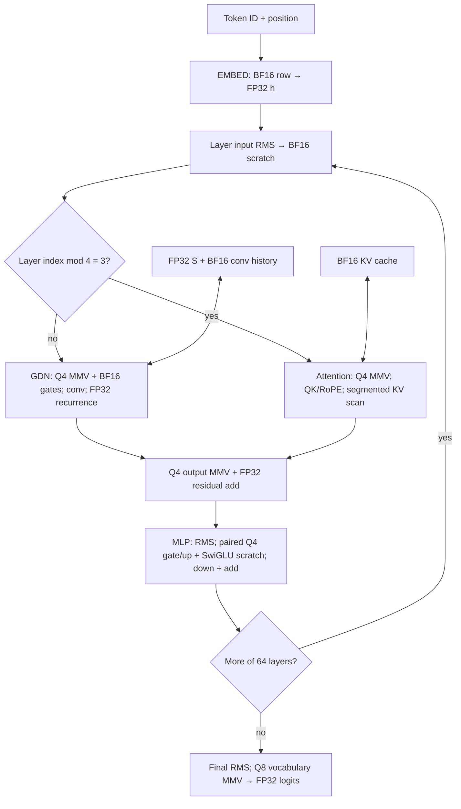
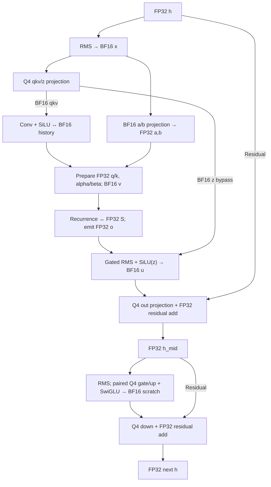

# Architecture thesis

- Build a single-GPU, single-sequence Qwen3.8-27B language inference engine, compiling the BF16 Transformers checkpoint in `.cache/authorities/qwen3.8-27b-transformers` offline. Preserve MTP weights and semantic descriptors, but enable its execution only after its unresolved forward semantics are established.
- Emit a versioned, **CUDA-oriented custom artifact**, with one physical weight view shared by decode and prefill. Keep equations, tensor identities, and semantic graph contracts independent of CUDA; specialize packed bytes and execution plans.
- Use three weight-storage classes: symmetric **INT4/G64** for large projections, symmetric **INT8/G32** for `lm_head`, and **BF16** for embeddings, norms, convolution weights, and GDN's small gate/time parameters. Start with deterministic absmax quantization, without outlier sidecars.
- Keep the residual stream in **FP32**, normalized projection inputs and ordinary projection staging in **BF16**, and dot-product accumulators, reductions, nonlinear evaluation, and recurrent arithmetic in **FP32**. Do not introduce activation quantization in V0.
- Store GDN recurrent state in **FP32**, with key coordinates contiguous in physical `[head, value, key]` order. Store convolution history and KV in **BF16**. Persistent state lives in VRAM and survives both kernel and token boundaries.
- Retain six model-native semantic families: `EMBED`, `GATED_ATTENTION`, `GATED_DELTA_NET`, `MLP`, `LM_HEAD`, and conditional `MTP_MIX`. Lower each into explicit, modest CUDA kernels; semantic nodes are not kernel boundaries.
- Make decode a sequence of packed-weight matrix-vector contractions, recurrent updates, and streamed attention. Optimize weight bytes per token first, while recognizing that long-context KV traffic can become dominant.
- Make prefill layer-wise in bounded input chunks: tensor-core matrix-matrix projections, tiled causal attention, and state-resident GDN recurrence kernels. Decode and prefill share semantics and packed weights, not their execution strategy.
- Materialize residuals and selected scratch buffers to keep V0 implementable. Keep unpacked weight tiles, reduction intermediates, attention scores, and recurrent update temporaries local; never expand the entire packed model into floating-point weights at runtime.

These are implementation decisions. Their quality and speed are **HYPOTHESIS**, not benchmark results. **OBSERVED** denotes checkpoint/config facts, **MEASURED** existing tensor statistics, **DERIVED** equations or arithmetic, and **UNKNOWN** a fact the dossier does not establish. Uncertainty changes a decision only through the experiments below; it does not leave the initial implementation unspecified.

# Architecture decision traceability

This register is normative. Every V0 decision that changes on-disk bytes, numerical behavior, persistent state, semantic or physical graph boundaries, or a kernel ABI appears here. A V1 change updates the named ID and its affected consumers rather than silently changing repeated prose. `T-*` entries are tuning defaults, not architecture contracts; their values may change after profiling without a new artifact or semantic version.

| ID | V0 decision | Evidence | Class | Why selected | Weakest assumption | Falsified by |
| --- | --- | --- | --- | --- | --- | --- |
| A-01 | CUDA-oriented `.qw38`, one packed view | Runtime-format and traffic studies | DERIVED + HYPOTHESIS | Removes runtime repacking and duplicate-view capacity | CUDA specialization harms prefill/workflow enough to outweigh it | EXP-G; later backend work |
| A-02 | Logical quantizer separate from physical layout ABI | Artifact/compiler design | DERIVED | Lets equivalent quantized values receive a new packing | Code/scale reordering cannot remain lossless/useful | Layout decoder tests |
| Q-01 | Main dense projections use Q4G64 | BF16 statistics, weight traffic, quantization study | MEASURED + DERIVED + HYPOTHESIS | Largest byte reduction with one simple decoder | G64 preserves behavior sufficiently | EXP-A |
| Q-02 | `lm_head` uses Q8G32 | Vocabulary traffic and output sensitivity | DERIVED + HYPOTHESIS | Conservative head compression | Q4 is equally acceptable | EXP-B |
| Q-03 | Embeddings and small/sensitive families remain BF16 | Gather access class, recurrence/sensitivity analysis | DERIVED + HYPOTHESIS | Avoids low-value numerical and implementation variables | Narrowing produces material capacity/latency gain without behavior loss | Future family-specific study |
| P-01 | FP32 residual, reductions, nonlinear/recurrent arithmetic | Numerical sensitivity analysis | DERIVED + HYPOTHESIS | Bounds accumulation and recurrence error | Narrower working paths are behaviorally sufficient | EXP-C, EXP-E |
| P-02 | BF16 normalized/projection transport and BF16 KV/C | Source dtype, tensor-core path, state schema | OBSERVED + HYPOTHESIS | Reduces scratch/cache traffic and feeds prefill operands | BF16 transport changes behavior materially | EXP-E |
| S-01 | FP32 GDN S | Recurrent equations and `mamba_ssm_dtype` intent | OBSERVED + DERIVED + HYPOTHESIS | Error crosses token boundaries; 144 MiB fixed state is affordable | BF16 state error remains bounded | EXP-C |
| S-02 | S ABI is `[head,value,key]`, warp per value row | GDN dimensions and CUDA layout analysis | DERIVED + HYPOTHESIS | Coalesced key reduction, one read/update/write ownership | Alternate ownership wins end to end | EXP-D |
| G-01 | Six Qwen-native semantic node families | Model semantics, dataflow, semantic graph | DERIVED | Preserves model-relevant state and boundaries | A node boundary prevents necessary optimization | EXP-F, profiling |
| G-02 | Decode and prefill have separate physical schedules | Decode/prefill work and reuse analysis | DERIVED + HYPOTHESIS | GEMV/state work differs from GEMM/token reuse | Common schedule is competitive | End-to-end mode comparison |
| L-01 | `cuda_q4g64_v0` / `cuda_q8g32_v0` packed dense layouts | Q4G64/Q8G32 consumer design | HYPOTHESIS | Matches initial warp-row MMV and local prefill decode | Another ownership/packing is materially better | Projection microbenchmarks + E2E |
| M-01 | Residual/state/output obligations plus selected scratch cuts | Lifetime and materialization analysis | DERIVED + HYPOTHESIS | Separates mandatory state from debuggable V0 stores | A chosen store is too costly | EXP-F |
| T-01 | Initial decode projection geometry: 8 warps/block, 256-input K tile | Consumer dimensions | HYPOTHESIS — tuning | Simple aligned first kernel | Resource/throughput profile is poor | Profiling |
| T-02 | Initial prefill geometry: 256-token input chunk, 32×64×64 projection tile, 64-token recurrence interval | Working-set reasoning | HYPOTHESIS — tuning | Bounds scratch and reuses operands/state | Another geometry is materially better | EXP-H; profiling |
| T-03 | Initial attention geometry: 128-thread blocks, 256-key decode segment / 32-key subtile, 32-query × 64-key prefill tile | Head dimensions and working-set reasoning | HYPOTHESIS — tuning | Supplies parallel segments with bounded staging | Register/shared-memory profile is poor | Profiling |

`Q4G64` and `Q8G32` are logical quantizer contracts: grouping, signed code range, scale computation, and logical matrix coordinates. `cuda_q4g64_v0` and `cuda_q8g32_v0` are separate physical-layout contracts: byte order, tile shape, alignment, and scale-array order. A future `cuda_q4g64_v1` may rearrange exactly the same quantized values, but needs its own manifest layout version and reader/kernel support. Changing Q4G64 itself requires a quantizer version and fresh behavior validation.

# Scope and evidence that drive the choices

The [inventory](model-inventory.md) and sitting config establish hidden width 5120, FFN width 17408, vocabulary 248320, and 64 language layers: three GDN layers followed by one full-attention layer, repeated 16 times. Full attention has 24 query heads, four KV heads, and head width 256. GDN has 16 key heads and 48 value heads, both width 128. These dimensions are OBSERVED; their consumer implications are DERIVED.

The [work and traffic analysis](work-and-traffic.md) makes the first optimization target clear: language MLP weights alone occupy 34,225,520,640 BF16 bytes. Their decode contractions perform approximately one FLOP per source-weight byte, before other traffic. Embeddings and `lm_head` each occupy 2,542,796,800 bytes, but an embedding lookup reads only one 10,240-byte row; the head reads its entire matrix. Equal shapes do not imply equal storage policies.

The [BF16 measurements](bf16-tensor-analysis.md#directional-scale-variation) show substantial directional variation: the maximum row absmax/median ratio reaches about 25.74 in MLP down projections. Convolution weights have a measured 6×-median outlier fraction of about 18.06%, and `dt_bias` reaches magnitude 19.25. These observations motivate local scales and preservation of small sensitive families. They do **not** establish INT4 quality. The [sensitivity analysis](numerical-sensitivity.md) further motivates FP32 recurrent state, residual additions, and reductions.

The semantic authority is [model-semantics.md](model-semantics.md), with the [dataflow](dataflow.md) and [semantic graph](semantic-graph.md) supplying contracts. The [clean-sheet review](clean-sheet-review.md) established mechanical consistency, not independent semantic proof. In particular, [MTP token alignment, concat order, decoder behavior, and independent KV semantics remain UNKNOWN](model-semantics.md#mtp). V0 therefore chooses primary language inference as its executable contract: 130 semantic instances. It retains the six-family vocabulary and the conditional 135-instance complete map without claiming that map is validated. This intentionally changes the dossier's complete-map reporting priority; language-only results must be labeled as such.

This design uses the existing dossier and checkpoint config. Quartz and llama.cpp/GGML implementation details are not design inputs. Vision encoding is outside V0. Initial hardware must support native BF16 tensor-core arithmetic and have room for the model, selected context capacity, and workspace; the actual GPU's resource limits and achievable rates remain UNKNOWN until measured.

# Artifact and offline compiler

## Selected artifact boundary

The primary artifact is a single little-endian `.qw38` container: versioned header, manifest/tensor directory, and aligned CUDA-oriented payload spans. V0 does not emit a portable duplicate of the weights. It does not load GGUF.

The header identifies the container version and manifest location. The directory records each tensor's logical identity and shape, storage class, **quantizer version**, physical layout version (`cuda_q4g64_v0`, `cuda_q8g32_v0`, or a BF16 layout), logical-to-physical mapping, payload/scale offsets and lengths, and shared bindings. It also records the source/config hashes, compiler revision, precision policy, supported semantic scope, and state allocation schema. Use 64-bit byte offsets and lengths, 256-byte-aligned payload and scale spans, and SHA-256 integrity records over the manifest and payload spans. Reader validation rejects unsupported layout versions and malformed spans before allocating device memory.

The artifact contains weights and state **schemas**, not live state, zero-filled state templates, CUDA binaries, activations, or tokenizer tables. Tokenizer assets remain external, with their hashes bound to the deployment manifest. Embeddings and `lm_head` remain untied; conditional MTP binds to those same two payloads rather than adding copies.

The portability boundary is the semantic graph plus logical tensor/quantization descriptors. Metal or CPU would get another offline packer and another physical lowering of those contracts, normally recompiling from BF16. A future packer could losslessly rearrange integer codes and scales when its quantizer agrees, but V0 does not promise that CUDA bytes are efficient on another backend. CUDA layout specialization is an explicit choice to reduce runtime transformations.

## Compiler pipeline and ownership

```text
BF16 HF config + safetensor index/shards
  → validate architecture, tensor identities, shapes, dtypes, sharing
  → classify language/MTP tensor families; exclude vision payloads
  → compute local scales; quantize from BF16, or preserve BF16
  → tile dense matrices; transpose convolution taps; pack codes/scales
  → emit graph bindings, precision/layout versions, state schema
  → verify pack/unpack round trips and checksums; publish .qw38
```

The compiler streams tensors through this pipeline; it need not hold the 54.64 GB language-plus-MTP BF16 source in memory at once. It implements one declared V0 policy and a BF16 identity control. The control uses the same logical bindings and kernel boundaries, with unquantized dense operands, to separate compiler/semantic errors from quantization loss. If that control does not fit in VRAM, its diagnostic runner uploads one layer at a time; this is a correctness path, not a production offload strategy or a comparable performance baseline.

Offline work includes all static tensor permutation, matrix tiling, code packing, scale placement, convolution conversion from `[channel, 1, tap]` to `[tap, channel]`, and generation of the 32 FP32 rotary inverse frequencies. Preserve stored norm weights and apply `1 + gamma` in the appropriate runtime norm; do not fold normalization into adjacent weights. Preserve `A_log` and `dt_bias` as BF16 parameters and evaluate their gate expression in FP32. Do not reorder model channels or introduce activation-dependent calibration transforms in V0.

The runtime validates and uploads ready-to-consume spans, creates session state and reusable scratch arenas, selects the precompiled schedule, and supplies positions and populated lengths. It performs neither whole-tensor weight transposition nor full-model dequantization. Kernel-local dequantization and tensor-core operand staging remain runtime work because those values are short-lived. This selects concrete implementations of the boundaries in the [compiler plan](model-compiler-plan.md) and [runtime-format study](runtime-format-design.md).

# Precision policy

Storage and arithmetic are separate decisions. The following table is the production-target V0 policy; the BF16 identity control is an evaluation path.

| Data class | Architecture V0 representation | Rationale | Confidence |
| --- | --- | --- | --- |
| Major projection weights | Q4G64: signed symmetric INT4, FP16 scales | Compress dominant streamed bytes; one consumer implementation across GDN, full attention, and MLP | HYPOTHESIS; EXP-A |
| Embeddings | Source BF16, contiguous vocabulary rows | Only one row is gathered per decode step; preserve lookup quality at a known capacity cost | HYPOTHESIS, conservative |
| Vocabulary / `lm_head` | Q8G32: signed symmetric INT8, FP16 scales | Halve most head traffic while initially protecting output-distribution quality | HYPOTHESIS; EXP-B |
| Small/sensitive weights | Source BF16: all norms, convolution, GDN `a/b` projection weights, `A_log`, `dt_bias` | Small byte savings do not justify another numerical variable | HYPOTHESIS, conservative |
| Residual stream | FP32, including embedding output after widening | Preserve small updates through 128 residual additions for little decode scratch cost | HYPOTHESIS, conservative |
| Normalized activation | BF16 output of FP32 RMS evaluation | Shared input for SIMT decode and BF16 tensor-core prefill | HYPOTHESIS; EXP-E |
| Projection staging | BF16 normally; FP32 for small `a/b` outputs and residual-producing epilogues | Preserve sensitive gates and avoid rounding immediately before residual addition | HYPOTHESIS; EXP-E |
| Dot-product accumulation | FP32 for all dense contractions, attention, convolution, and recurrence | Long reductions need a wider accumulator | HYPOTHESIS, conservative |
| Nonlinear/reduction intermediates | FP32 RMS/L2 sums, softmax max/sum, RoPE phase, gate arithmetic; round only at declared stores | Avoid accumulating narrow-format error in normalization and exponentials | HYPOTHESIS, conservative |
| GDN recurrent state | FP32, including persistent stores | Error feeds future tokens; total state is only 144 MiB | OBSERVED config intent; HYPOTHESIS policy |
| Convolution history | BF16 raw pre-convolution QKV, last three positions | Finite four-tap history; preserve the projection transport precision | HYPOTHESIS, conservative |
| KV cache | BF16 K after QK norm/RoPE and BF16 V; no repeated GQA copies | Growing storage already substantial; no low-bit state format yet | HYPOTHESIS, conservative |
| Logits | FP32, all 248320 entries per requested position | Direct NLL/distribution evaluation and deterministic readout | HYPOTHESIS, conservative |

GDN's normalized q/k and `alpha/beta` staging are FP32, as is recurrence output `o` before gated RMS. Convolved v and output gate z are BF16. The gated-RMS result returns to BF16 before `out_proj`. Full-attention Q after normalization/RoPE is BF16, matching cached K; scores, softmax, and value accumulation are FP32. SiLU and sigmoid evaluate in FP32 even when their inputs and stored outputs are BF16. Residual-producing projections add their FP32 accumulator directly to the FP32 residual and store FP32.

# Three weight-storage classes, designed for their consumers

## Quantizer definitions

V0 selects the grouped symmetric absmax recipes from the [quantization design space](quantization-design-space.md), with the concrete code ranges, scale rounding, family assignments, and byte order below.

| Class | Logical group | Encoding and scales | Assigned tensors | CUDA consumer |
| --- | --- | --- | --- | --- |
| `Q4G64` | 64 consecutive input-axis weights within one output row | 32 packed code bytes + one FP16 scale; signed two's-complement nibbles, symmetric range −7…7; −8 unused | GDN qkv/z/out; full-attention q/g, k, v, o; MLP gate/up/down; matching MTP matrices and `mtp.fc` | Warp-row SIMT matrix-vector decode; locally dequantized BF16 tensor-core prefill |
| `Q8G32` | 32 consecutive input-axis weights within one output row | 32 code bytes + one FP16 scale; signed two's-complement bytes, symmetric range −127…127; −128 unused | Untied shared `lm_head` only | Same row ownership for decode; same tiled prefill contraction with byte decoding |
| `BF16` | No quantization groups | Unmodified signed BF16 values; no scales or zero points | Embeddings and all remaining language/MTP tensors | Row gather, vector/conv kernels, or BF16 dense contractions |

For an integer group, compute `a = max(abs(w))` in FP32. If `a == 0`, emit zero codes and zero scale. Otherwise select the smallest positive finite FP16 scale at least `a / qmax`, then compute `q = clamp(round_to_nearest_even(w / scale), -qmax, qmax)`. Scale values below the normal FP16 range use the least positive normal FP16 value to avoid dependence on subnormal handling; reject a nonfinite source or an unrepresentable scale. Codes are generated against the **stored** scale. All weights, including outliers, participate in absmax; there is no percentile clipping, zero point, sparse sidecar, or mixed-width group map.

This is a deliberately simple initial quantizer, not a claim that round-to-nearest achieves the best quality. G64 costs 4.25 bits/weight including its scale: a 73.44% reduction from BF16. G32 for Q8 costs 8.5 bits/weight. G64 balances local adaptation against metadata, and each group maps to a fixed subset of a warp's vector loads. INT2/INT3 and learned codebooks are deferred; their additional packing/quality variables are unnecessary for the first engine. EXP-A can reject either the group size or a family's INT4 assignment.

## Physical packing and consumption

Dense matrices use logical `W[N, K]`. Physical layout `cuda_q4g64_v0` / `cuda_q8g32_v0` uses code order `[N/8, K/256, 8, packed_256]`: eight output rows by 256 consecutive input coordinates per tile. Q4 uses 128 code bytes per tile row; Q8 uses 256. The lower nibble represents the earlier coordinate in Q4. BF16 dense control/gate matrices use the corresponding eight-row, 256-input tile order without code packing. Embeddings are independently row-major; vector weights are contiguous; convolution weights are tap-major.

Scales occupy a **separate contiguous array**, ordered `[N/8, K/256, row_in_tile, group_in_tile]`: four scales per row for Q4 and eight for Q8. They are not interleaved as 34-byte records with codes, which would disrupt aligned code loads. Both arrays have 256-byte-aligned bases; code tile rows and tile strides have natural vector alignment. The actual projection dimensions divide eight output rows and 256 input coordinates exactly. The format still records logical extents; any padded coordinates are zero and excluded from outputs and scale estimation. This byte order belongs to `cuda_q4g64_v0` / `cuda_q8g32_v0`, not to Q4G64/Q8G32 themselves.

```text
global packed weight tile + matching scale tile
  → vector loads into registers
  → sign-extend nibbles/bytes; multiply by FP32-expanded FP16 scale
  → round decoded operands to BF16
  ├─ decode: widen operands + BF16 activation to FP32; FMA and warp reduction
  └─ prefill: stage BF16 operand tiles in shared memory; tensor-core MMA
  → FP32 accumulators → declared BF16 output or FP32 residual/logit epilogue
```

A decode warp owns one output row. In one 256-input tile, lane `l` reads eight successive weights: a 32-bit Q4 word or a 64-bit Q8 word. The warp covers a contiguous 128-byte or 256-byte code span. Eight lanes share a Q4 scale; four share a Q8 scale. A subgroup leader loads each scale and broadcasts it. Eight warps form a 256-thread block for one eight-row output tile; the block stages the common input vector in shared memory. Partial sums stay in registers, and each warp completes its K reduction without global atomics. For paired MLP gate/up, each warp owns the corresponding two rows and two accumulators.

Prefill assembles its larger matrix tiles from these same eight-row tiles and transposes/swizzles only the small decoded shared-memory operands needed by tensor cores. Matching the rounded BF16 weight operands across modes isolates accumulation-order differences from dequantization differences. V0 does not use integer tensor-core products or quantized activations.

## Capacity and the one-view decision

Using [inventory counts](model-inventory.md#semantic-family-inventory), including stored but disabled MTP weights, gives the following DERIVED payload estimates. They include scale bytes and exclude container metadata and span alignment.

| Class | Parameters | Bytes |
| --- | ---: | ---: |
| Q4G64 | 24,751,636,480 | 13,149,306,880 |
| Q8G32 | 1,271,398,400 | 1,350,860,800 |
| BF16 | 1,297,662,976 | 2,595,325,952 |
| Total | 27,320,697,856 | 17,095,493,632 ≈ 15.92 GiB |

The BF16 embedding accounts for about 2.37 GiB of capacity but is not streamed per token. Language MLP weights become 9,091,153,920 bytes. A second complete low-bit decode/prefill view would add about **13.50 GiB** for Q4 plus Q8 alone, before state and workspace. V0 therefore accepts local shared-memory rearrangement during prefill and stores **one view**. EXP-G is the only initial route to selected duplicate views; it must justify their capacity and end-to-end benefit.

# Semantic graph and physical boundaries

The six [model-native node contracts](semantic-graph.md#per-node-contracts) remain hardware-independent. They describe equations, residual liveness, and state transitions; none describes a warp or a packed layout. A fine-grained primitive graph would expose dozens of implementation intermediates as scheduling decisions and obscure which operations belong to one recurrent or gated map.

| Semantic node | V0 contract and physical lowering |
| --- | --- |
| `EMBED` | Gather one BF16 row, widen into FP32 residual storage in one kernel; prefill gathers multiple rows |
| `GATED_ATTENTION` | Input RMS, gated Q/K/V projections, QK norm/RoPE, causal GQA, sigmoid output gate, output projection, residual add; decomposition below |
| `GATED_DELTA_NET` | Input RMS, projections, causal convolution, q/k normalization and gates, recurrence, gated RMS, output projection, residual add; decomposition below |
| `MLP` | Post-mixer RMS, paired gate/up projection and SwiGLU, down projection plus residual add |
| `LM_HEAD` | Separate final RMS kernel, followed by Q8 vocabulary contraction producing FP32 logits |
| `MTP_MIX` | Conditional contract: two RMS operations, concat, FC projection; initially separate norm/concat kernel and contraction if enabled after semantic verification |

Residual adds are inside mixer and MLP semantics. The input residual remains available until its add. The important semantic invariants from [the equations](model-semantics.md) are: zero-centered `1 + gamma` residual/QK norms; multiplicative gamma for GDN's gated norm; full-attention q/g split **per head**; sigmoid full-attention gating versus SiLU GDN gating; QK norm before 64-coordinate partial RoPE; no RoPE on GDN; and GDN q scaling by `1/sqrt(128)` at the state readout.

## GDN: initial kernel sequence

Each numbered step is one kernel launch in decode, with no implicit inter-block synchronization inside a step.

1. **Input RMS:** FP32 residual reduction and zero-centered norm; write one BF16 normalized vector shared by the projection consumers.
2. **Large input projections:** one launch with separate output-tile ranges for Q4 qkv and z. Write BF16 `[10240]` qkv and `[48,128]` z. This combines launch scheduling, not contraction reductions.
3. **Small gate projections:** one BF16-weight launch for a and b; write FP32 `[48]` outputs for each. Keep this precision boundary separate from the Q4 launch.
4. **Convolution + SiLU:** each channel owner reads three BF16 history taps and current raw qkv, accumulates four taps in FP32, writes BF16 convolved qkv, and replaces the oldest raw-history slot. z bypasses convolution.
5. **Preparation:** normalize the 16 q/k heads in FP32, compute FP32 alpha/beta from a/b and time parameters, and write these small prepared arrays. v aliases the convolved v slice; q/k are indexed by `value_head / 3`, never physically triplicated.
6. **Recurrence:** update FP32 persistent S once and write FP32 o. The update and readout share register-held state elements.
7. **Output transform:** one block per value head reduces the 128-element o, applies multiplicative gamma and SiLU(z) in FP32, and writes BF16 u.
8. **Output projection + residual:** Q4 contraction, then FP32 add to the original h, producing h_mid.

Keep the recurrence separate from gated RMS because its ownership splits a head's values across blocks, whereas RMS needs all 128 outputs. Keep projections separate from recurrence because their weight and state working sets and parallelism differ. Whole-GDN fusion is deferred. Convolution preactivation, squared-norm terms, gate expression temporaries, and state prediction/error intermediates stay internal; convolved qkv, normalized q/k, gates, o, and u are intentional V0 scratch stores.

## Full attention: initial kernel sequence

1. Input RMS writes BF16 normalized h.
2. One Q4 projection launch computes q/g, k, v into separate scratch slices, preserving the per-head q/g association.
3. One preparation launch applies QK RMS in FP32, partial RoPE on the first 64 coordinates, writes BF16 Q, and appends BF16 rotated K and V to persistent cache. Positions remain integer until FP32 phase evaluation; the other 192 coordinates pass through RoPE unchanged.
4. Stream cached K/V with stable online FP32 softmax. Decode uses one 128-thread block per query head per 256-token key segment; it writes an FP32 partial maximum, sum, and 256-value numerator for that segment.
5. One block per query head merges segment statistics in a fixed order, normalizes the result, applies sigmoid(g), and writes BF16 gated attention output. Never store a full score/probability vector.
6. Q4 output projection adds directly to the FP32 residual.

Segmenting context avoids limiting decode to 24 blocks. A block scans its 256-key segment in 32-key subtiles, using at most 16 KiB for either BF16 K or V staging and reusing that shared buffer after score reduction. It does not stage the whole segment's K/V at once. K/V are stored once for four heads; six query heads address each KV head. Separate query-head blocks can reread those bytes, so the unique-cache byte count is a lower bound, not a bandwidth prediction. The merge uses the standard max-rescaled sum/numerator combination, with empty/tail segments masked. Prefill replaces steps 4–5 with a tiled causal attention kernel described below.

## MLP: initial kernel sequence

1. Post-mixer RMS writes BF16 normalized h_mid.
2. Paired Q4 gate/up contraction computes both outputs for each FFN coordinate, applies FP32 SiLU and multiplication, and writes only BF16 SwiGLU `[17408]`.
3. Q4 down contraction adds its FP32 result to h_mid and stores the next FP32 residual.

The paired epilogue is a selected small fusion: corresponding gate/up rows are independently reducible by the same owner. V0 does **not** materialize separate gate and up tensors, nor fuse the down contraction across its global FFN reduction. This is a manageable increase in accumulators, unlike keeping an entire FFN tile live through down projection.

# Materialization and memory hierarchy

`MUST MATERIALIZE` identifies state/output obligations across the engine interface. `V0 MATERIALIZES` identifies chosen kernel cuts rather than a mathematical requirement. `V0 TRIES TO KEEP INTERNAL` identifies local working values; spills count as a performance failure to investigate, not as a new persistent representation. This applies the distinctions in [materialization-and-fusion.md](materialization-and-fusion.md).

| Value | V0 physical treatment |
| --- | --- |
| GDN S, convolution history, K/V | **MUST MATERIALIZE:** persistent VRAM at decode steps and prefill chunk boundaries; intermediate GDN states can remain local within a chunk |
| Requested logits | **MUST MATERIALIZE:** FP32 output buffer; consume evaluation rows in bounded tiles |
| Residual h / h_mid | **V0 MATERIALIZES:** two reusable FP32 global buffers; keep input live through each residual add |
| Normalized residual / final hidden | **V0 MATERIALIZES:** reusable BF16 global scratch, 10,240 bytes per decode vector; normalization is a separate initial kernel |
| GDN qkv, z, convolved qkv, prepared q/k and gates, o, u | **V0 MATERIALIZES:** typed scratch between the eight selected kernels; no separate allocation per logical name |
| Attention projected q/g/k/v, prepared Q, gated output | **V0 MATERIALIZES:** scratch; K/V preparation writes directly to the cache without a second prepared K/V buffer |
| Q/K norm partial sums and pre-RoPE normalized attention vectors | **V0 TRIES TO KEEP INTERNAL:** registers/shared reduction within preparation |
| Attention scores, probabilities | **V0 TRIES TO KEEP INTERNAL:** online softmax tile; no global sequence-length score matrix |
| Decode attention segment statistics | **V0 MATERIALIZES:** FP32 partial max/sum/numerator for the merge kernel |
| MLP gate and up outputs | **V0 TRIES TO KEEP INTERNAL:** paired contraction epilogue |
| SwiGLU intermediate | **V0 MATERIALIZES:** BF16 global scratch; 34,816 bytes per decode vector |
| Mixer output / MLP down output before residual add | **V0 TRIES TO KEEP INTERNAL:** FP32 accumulator epilogue |
| Decoded weight tiles and recurrent prediction/error terms | **V0 TRIES TO KEEP INTERNAL:** registers/shared memory; no model-size dequantization buffer |

Registers hold warp partial sums, decoded code fragments, softmax statistics, and GDN state slices during an update. Shared memory holds a block's common projection input and prefill BF16 operand tiles, plus block reductions. Decode projection inputs range up to 34 KiB for the 17408-wide down contraction; stage that input once per block, not per warp. A prefill tile's resource budget is separate from the decode budget.

Global VRAM holds immutable packed weights, session state, two residual buffers, and one liveness-planned scratch arena. Scratch is reused after its last consumer on the ordered stream; gates g/z cannot be overwritten before their output transform. Only state survives the token boundary. Persistent global state is session-owned, initialized to zero, and never shared between unrelated requests. V0 uses one ordered CUDA stream, explicit kernel boundaries, and fixed buffer addresses; cross-stream overlap and a persistent whole-model kernel are deferred.

# GDN state and cache layout

## Chosen GDN ownership

Logical S is `[48 value_heads, 128 key, 128 value]` per GDN layer. Physically store its transpose as contiguous FP32 **`[value_head, value, key]`**. One warp owns one entire 128-key row for a single output-value coordinate; lane l owns key coordinates `l, l+32, l+64, l+96`. A 128-thread block owns four adjacent value coordinates of one head. There are `48 × 32 = 1536` blocks per layer, with no cross-block reduction in recurrence.

For a head's shared normalized k, q, scalar alpha/beta, and a value coordinate v_j, that warp performs:

```text
load 128 old state elements, coalesced across key coordinates
D[k] = alpha * S_old[k,j]                    # FP32, held in registers
p    = warp_sum(D[k] * k_hat[k])
e    = beta * (v[j] - p)
S_new[k,j] = D[k] + k_hat[k] * e
o[j] = warp_sum(S_new[k,j] * q_hat[k] / sqrt(128))
store S_new once; store o[j]
```

All arithmetic and both warp reductions are FP32. State elements are read once, reused for prediction, update, and readout, then written once. Four state floats per lane are the DERIVED state-only register requirement, **not** a prediction of the compiled kernel's total register count. q/k are reused within the block, and across three value heads through indexing; they are not duplicated in persistent storage.

This **HYPOTHESIS** chooses a regular coalesced key reduction and many small independent owners. It avoids a block-wide reduction over a whole 64 KiB head state. Its principal risk is redundant q/k loads and many small blocks. The **one strongest alternative** is `[head,key,value]` with one block owning a head and lanes spanning adjacent values; EXP-D compares its state traffic, occupancy, and end-to-end cost with V0. No other recurrence mappings are carried forward.

## Convolution and KV

Convolution history is a BF16 `[3,10240]` circular buffer per layer, channel-contiguous with a session cursor. Read oldest-to-newest taps against compiler-transposed `[4,10240]` weights and overwrite only the oldest raw qkv slot. The current raw projection, not SiLU output, enters history.

K and V each use BF16 `[kv_head, capacity, 256]` per full-attention layer; head coordinates are contiguous. Append one token without transposing, and scan token tiles for attention. V0 allocates a contiguous cache for an explicitly requested capacity and fails allocation if it does not fit. No paging, eviction, sliding-window substitution, or storage of six GQA copies. Capacity is distinct from populated length; masked unpopulated slots are never attended.

For primary language inference, persistent bytes are DERIVED as:

```text
GDN S:       48 layers × 48 × 128 × 128 × 4 = 150,994,944 bytes (144 MiB)
conv:        48 layers × 3 × 10240 × 2       =   2,949,120 bytes
KV:          16 layers × 2 × 4 × T × 256 × 2 =      65,536 × T bytes
total:       153,944,064 + 65,536 × T bytes
```

At populated length 4096, KV is 256 MiB and total state about 402.81 MiB. At the configured maximum 262144, KV alone is 16 GiB; that model limit is not a promise that every GPU can serve it. If MTP is later verified and enabled with the conditional independent cache, add 4096 bytes per stored MTP position; the dossier's 69,632-byte complete-map coefficient must not be substituted for the active language-only coefficient.

# Decode schedule

## Initial tuning defaults

The following geometry is `T-01`/`T-03` tuning, not an architecture contract: a decode projection uses eight warps per block and a 256-input K tile; decode attention uses a 128-thread block per query head and 256-key segment, scanned in 32-key subtiles. The artifact ABI, quantizer, state ABI, and semantic result do not depend on those values. Profiling may change them without creating Architecture V1.

**Central hypothesis:** for batch-one decode at short and moderate contexts, packed weight movement dominates the large contractions. V0 reduces those bytes and keeps unpacking adjacent to use, while providing enough parallelism for recurrent and attention state work.



All main matrices are consumed from the tile/scale arrays specified above. There is no runtime weight repack between tokens. Each layer commits its own recurrent/history or cache update before the next consumer, and scratch becomes reusable at known stream boundaries. The default readout selects deterministic argmax; logits remain available for evaluation. Sampling policy is outside the semantic graph.

Under the selected policy, unique active language non-embedding weights occupy about **14.33 GB / 13.34 GiB** (DERIVED), versus about 51.25 GB in BF16. This is an ideal one-pass weight-byte count, not measured HBM traffic. GDN adds 288 MiB of state read-plus-write per decode step across 48 layers. At T=4096, unique past-KV reads are about 256 MiB; query-head rereads may multiply physical traffic. At very long contexts, the growing KV scan can rival or exceed weight movement, so “weight-bound decode” is not a universal claim. Kernel launch and unpack instruction costs are additional unmeasured risks.

# Prefill is a different physical schedule

## Initial tuning defaults

The following values are `T-02`/`T-03` tuning defaults, not architecture contracts: 256-token input chunks, 32-token × 64-output projection tiles with K stepped by 64, 64-token GDN recurrence intervals, and 128-thread attention/projection blocks. They are selected to make the first working set explicit. Changing them requires continuation and correctness checks, but does not change the artifact ABI or semantic graph.

V0 processes a prompt in **256-token input chunks**, in order. Within each chunk it executes all tokens of a layer together, then the next layer; it does not invoke the full decode stack once per prompt token. The first chunk starts from zero state; later chunks continue exact incoming C/S/KV and absolute positions. This bounds scratch without replacing causal attention with a window.

| Work | Selected prefill strategy |
| --- | --- |
| Dense projections and MLP | BF16 tensor-core GEMM on locally decoded Q4/Q8 weights; FP32 accumulators. Initial block output tile is 32 tokens × 64 output coordinates, with K stepped by 64 and a 128-thread block |
| Weight reuse | Reuse each decoded operand tile across 32 token rows. Fetch the eight-row packed subtiles from the one common view; assemble BF16 shared operands. No global decoded-weight cache |
| Paired gate/up | Same 32×64 output ownership for both contractions; apply SwiGLU in the epilogue and write BF16 intermediate. Extra accumulator registers are an explicit occupancy risk |
| Full attention | One block per query head and 32-query tile, scan 64-key tiles with causal masking, FP32 online softmax and FP32 value accumulators; fuse sigmoid gate at output. Cache Q/K/V preparation is completed before attention reads |
| GDN convolution | Parallel FIR across chunk tokens/channels, reading projected qkv within the chunk and incoming history for its first three positions. A separate post-FIR commit kernel writes the last three vectors of incoming history concatenated with valid new raw qkv, avoiding races with readers of old history |
| GDN recurrence | Four ordered launches per 256-token chunk, each advancing up to 64 tokens with the same warp/value-row ownership; retain state slices in registers across those tokens and commit at each 64-token boundary |
| GDN output transform | Materialize FP32 o for the input chunk, then head-wise gated RMS and GEMM output projection. No full-head norm inside the recurrence owner |
| Output head | Generation mode computes only the final prompt position's logits. Evaluation mode computes every requested position in bounded tiles; these are distinct performance identities |

Final input/recurrence tiles may be shorter than 256/64 tokens. Mask padded rows from every state update and causal read, advance positions and history cursors only by valid tokens, and preserve incoming history when fewer than three tokens arrive. Global activation scratch is token-major `[valid_tokens, channels]`, with contiguous head coordinates; reductions and tensor-core staging consume this layout without a whole-chunk transpose.

The 32×64×64 projection tile has 4 KiB of BF16 activation operands and 8 KiB of BF16 weight operands before padding; paired gate/up needs two weight operands. Start with single-buffered shared staging and ordinary tensor-core MMA. Asynchronous double buffering is not required for V0. Actual register allocation, shared-memory bank behavior, and achievable occupancy must be measured on the chosen device; no claim depends on TMA or cluster support.

The initial attention kernel uses FP32 SIMT score/value arithmetic; tensor cores initially accelerate dense weight contractions. For its 32-query/64-key attention tile, keep Q and output accumulators in registers, reuse one 32 KiB shared buffer for K then V, and reserve up to 8 KiB for scores/reduction scratch. K and V tiles do not coexist in shared memory. Register pressure is still substantial, which is why attention remains separate from projection kernels.

Within a 64-token recurrent launch, each warp performs the same left-to-right FP32 update as decode and writes o for every token, but only loads/stores its persistent S at the launch boundaries. Thus S traffic is amortized over the chunk, not eliminated. This deliberately defers chunkwise/WY reformulation: the initial prefill recurrence is easy to compare against decode, and EXP-H can justify changing its algorithm if recurrence serialization dominates.

Prefill uses the same quantized values, residual semantics, GQA mapping, norms, and state schema as decode. Its physical priorities differ: reuse decoded weights, feed tensor cores, bound activation storage, and reuse attention tiles without materializing a quadratic score matrix. The common eight-row packing may limit prefill load efficiency; that is an accepted V0 risk tested by EXP-G. Input chunks also reread weights between chunks, so the dossier's once-per-prompt unique-weight bound is not a claim about this schedule's physical traffic.

# Initial CUDA ownership commitments

Ownership axes and persistence boundaries in this table are architecture commitments where they define an ABI, especially `S-02`. Thread counts, block dimensions, and tile extents are `T-*` tuning defaults even when shown to make the first kernel implementable.

All rows below are **HYPOTHESIS** mappings selected from the concerns in the [layout study](layout-strategy.md), [hardware model](cuda-hardware-model.md), and [CUDA design space](cuda-design-space.md). They are the kernels to implement first, not measured winners.

| Computation | V0 CUDA ownership and local storage | Strongest risk |
| --- | --- | --- |
| Quantized decode projection | Eight warps/block, one output row/warp; vectorized 256-input packed spans, shared BF16 input, FP32 register sums and warp reduction | Unpack instruction throughput or shared-input cost limits bandwidth |
| BF16 small a/b projection | Same row reduction pattern, grouped a/b launch; FP32 outputs | Small output grid and launch overhead |
| Prefill projection | 128-thread block owns 32 tokens × 64 outputs; shared BF16 tiles feed tensor-core fragments; FP32 accumulators | Common packing and paired epilogues reduce occupancy |
| GDN recurrence | Four warps/block, one value coordinate/warp; four FP32 state elements/lane plus arithmetic temporaries; q/k shared within block | Redundant vector loads and serial token loop during prefill |
| Hidden RMS/reduction | One 256-thread block per token; register partial sums and a small shared cross-warp reduction | Tiny decode grid is launch/latency dominated |
| GDN head norm / QK preparation | One block per head, lane-strided contiguous coordinates; FP32 reduction, only final prepared arrays stored | Preparation launches and scratch traffic |
| Attention decode | 128-thread block per query head/256-key segment; registers/shared tiles hold online FP32 statistics; separate deterministic merge | GQA rereads and segment partial traffic |
| Attention prefill | 128-thread block per query head/32-query tile scanning 64-key tiles; shared Q/K/V, FP32 accumulators | 256-wide heads create substantial register pressure |
| Convolution | Channel-parallel threads, FP32 four-tap sums; BF16 tap-major history access | Small kernel overhead; history commit ordering |
| MLP gating / residual add | Owning contraction's epilogue, per-coordinate arithmetic in registers | Extra paired gate/up accumulators hurt occupancy |

Kernel boundaries provide global ordering without cooperative grid barriers. V0 starts with eager launches on one stream so that every region is measurable; CUDA graph capture can follow once correctness and stable addresses are established. It must preserve these regions and state dependencies, not introduce a dynamic graph optimizer.

# Behavior and performance validation

The first validation target is **useful language-model behavior**, not equality with a quantized baseline or bitwise equality between schedules. Follow the identity and attribution principles in [quantization validation](quantization-validation.md) and [performance validation](performance-validation.md), with the explicitly narrower primary-language scope above.

First establish the BF16 identity compiler path against the source model's language forward behavior. Use focused semantic checks for norm roles, per-head q/g split, RoPE coordinates, convolution tap order, GDN update/readout, causal masks, and state continuation. Compare full prefill, chunked prefill, and repeated decode on the same token IDs; these checks detect semantic and chunk-boundary errors before evaluating compression. Tensor reconstruction and intermediate differences diagnose failures but are not the final quality gate.

Then evaluate the V0 artifact using teacher-forced target-token NLL relative to that BF16 control, FP32 log-softmax, output-distribution KL, deterministic greedy generation, and representative language, code, arithmetic/reasoning, and long-context retrieval tasks. Hash the tokenized evaluation inputs and loss masks; reset at document boundaries and count each scored target once. Any later calibration uses disjoint data. MTP metrics remain unavailable until its semantics are verified and must never be folded into an apparently comparable language-only average.

## Initial validation policy

The following are validation-policy defaults, not architecture contracts: **HYPOTHESIS** limits of +0.03 nats/token mean NLL and +0.06 on each declared domain/context slice relative to the BF16 control, with no capability-score regression greater than two percentage points beyond paired uncertainty. Deterministic outputs are inspected for failures and repetition, not required to match token-for-token. These are engineering acceptance budgets, not thresholds established by the dossier. Freeze the actual held-out suite and scoring rules before comparing quantizers; failure blocks a quality claim and drives targeted wider precision, rather than silently relaxing the gate.

Measure batch-one decode at populated lengths 512, 4096, and 32768; prefill at 256, 4096, and 32768 tokens; and a request that prefills then generates 128 tokens. Exercise the maximum supported context separately when memory permits, and report any untested long-context coverage. Record artifact/binary hashes, GPU and resource limits, capacity versus populated length, clocks, graph mode, warmups, repetitions, and token/output policy. Warm up five runs, collect at least twenty timed repetitions with restored identical incoming state, and report median, p99, and uncertainty. Setup, upload, warmup, and state restore are outside steady-state timing and reported separately; the first generated token belongs to TTFT, not subsequent decode throughput.

Use node/kernel profiles, actual memory traffic, spills, and occupancy to explain end-to-end measurements. Do not add parent graph durations to their child kernel times. A local speedup is insufficient if the matching end-to-end request regresses. The initial validation policy requests a reproducible benefit beyond noise, using 5% end-to-end improvement in the affected mode as an engineering threshold alongside the quality gate and explicit memory accounting. This threshold is not an architecture decision.

`models/Qwen3.8-27B-Q4_K_M.gguf` through llama.cpp is a **future black-box Pareto point** for quality, size, and performance under matching identities. It supplies neither compiler input nor numerical targets. Compiling directly from BF16 may produce better quality than Q4_K_M; V0 must neither inherit its errors nor reproduce its logits. No quality or throughput result is claimed by this document.

# Deliberate V0 non-goals

- INT2/INT3, sparse outlier sidecars, mixed-width groups, activation quantization, and activation-aware weight transforms.
- Quantized GDN state or KV cache; BF16 GDN state is only an experiment against the FP32 default.
- Whole-layer fusion, eliminating every scratch store, persistent whole-model kernels, and dynamic runtime graph optimization.
- Duplicate weight views by default, universal GGUF compatibility, Metal/CPU backends, multi-GPU execution, continuous batching, and paged KV.
- Vision encoding, speculative decoding, and executable MTP before its forward semantics are established.
- A guarantee of maximum configured context on any device, or support for every Qwen variant.

# Experiments that can change Architecture V0

Run these against the selected implementation, keeping unrelated choices fixed. Quality-affecting changes must pass the frozen behavioral gate; performance changes need both local evidence and matching end-to-end measurements. These eight experiments replace the broad backlog as V0's architecture decision queue.

| Experiment | Selected design and first comparison | Decision affected and falsification |
| --- | --- | --- |
| **EXP-A — Main weight policy** | Q4/G64 versus Q4/G32 and Q4/G128, with the same absmax quantizer and consumer. If quality fails, isolate one failing family at a time and promote it to the existing Q8/G32 class | **Main runtime weight format/family map.** Reject G64 if it fails the quality gate and G32 passes, or G128 passes and measurably improves end-to-end decode. If no INT4 grouping passes, retain wider precision for the implicated family; do not ship an unvalidated all-Q4 assignment |
| **EXP-B — Vocabulary precision** | Q8/G32 head versus Q4/G64 head; BF16 control diagnoses head-only error | **Head storage class.** Replace Q8 only if Q4 passes domain-wise NLL/distribution/capability checks and improves end-to-end decode. Head precision cannot be decided from parameter MSE |
| **EXP-C — Persistent-state precision** | FP32 S versus BF16 S, retaining FP32 recurrence arithmetic and all other precisions | **State representation.** Reject the conservative FP32 default only if BF16 survives long-horizon NLL, continuation, and capability checks and yields a meaningful measured benefit. One-step agreement cannot justify narrowing |
| **EXP-D — GDN layout/ownership** | V0 `[head,value,key]`, warp per value, versus `[head,key,value]`, block per head | **State layout and recurrence kernel ABI.** Replace V0 if the alternative wins after q/k reuse, spills, synchronization, and full-engine latency are included; measure decode and 64-token prefill recurrence separately |
| **EXP-E — Activation transport** | BF16 normalized/projection scratch versus FP32 scratch in a diagnostic SIMT path, with identical weight codes and FP32 accumulation | **Activation precision and tensor-core boundary.** Reject a BF16 boundary if widening it repairs a quality-gate failure. If widening is required, account for the changed prefill arithmetic path before retaining a tensor-core claim |
| **EXP-F — Normalization/projection boundary** | Separate RMS + BF16 normalized buffer versus block-local RMS recomputation fused into the grouped GDN qkv/z decode contraction; small a/b consumer recomputes its own norm | **Selected scratch store and fusion boundary.** Remove the store only if saved launches/traffic exceed redundant reductions, register use, and occupancy loss in end-to-end decode. Leave prefill's reused normalization buffer unchanged in this experiment |
| **EXP-G — Common weight view** | One common packing versus an additional prefill-oriented packed view of MLP weights only | **Artifact views and capacity policy.** Add the second view only for workloads where measured TTFT/request improvement justifies roughly 8.47 GiB of additional language-MLP Q4 payload and it fits alongside state/workspace. Repack/upload cost must be included in cold-request accounting |
| **EXP-H — Prefill recurrence algorithm** | Left-to-right register-resident 64-token recurrence versus a 64-token chunkwise/WY evaluation of the same map | **GDN prefill algorithm and workspace.** Replace the serial recurrence only if it materially improves full prefill and passes long-context behavior plus chunk-boundary continuation checks; finite-precision equivalence is not assumed |

# End-to-end architecture

```mermaid
flowchart TD
    source["HF BF16 checkpoint + config"] --> compiler["Offline QW38 compiler: validate, classify, quantize, tile, pack"]
    compiler --> artifact["Compiled .qw38: Q4G64 / Q8G32 / BF16; one CUDA weight view"]
    artifact --> graph["Qwen semantic graph: six families; primary language enabled"]
    graph --> decode["Decode: quantized MMV, state updates, segmented attention"]
    graph --> prefill["Prefill: tiled GEMM, causal attention, register-resident recurrence chunks"]
    decode --> plans["CUDA execution plans + reusable scratch"]
    prefill --> plans
    plans --> gpu["GPU: local unpacking, FP32 accumulation"]
    gpu <--> state["Persistent VRAM: FP32 GDN S; BF16 conv + KV"]
    gpu --> output["FP32 logits / language behavior"]
    output --> validation["NLL, distributions, generation, capabilities + end-to-end timing"]
    validation -.->|"EXP-A through EXP-H"| compiler
    validation -.->|"Revise measured execution choices"| plans
```

Representative GDN layer flow, showing the actual initial boundaries separately from the semantic graph:



# If implementation started tomorrow

1. Implement the versioned artifact writer/reader and BF16 identity compile path, including exact shape validation, shared bindings, layout round trips, and corruption checks. **First milestone:** a source-identified artifact whose tensors can be decoded back exactly on the identity path and whose state/scratch allocations are explicit.
2. Implement Q4G64 and Q8G32 offline quantization/packing plus decoder checks. Establish the selected bytes and scale accounting before optimizing kernels.
3. Implement embedding, FP32 residual/RMS, BF16 control contractions, and the Q4 warp-row decode projection, including paired SwiGLU and residual epilogues. Compare identical decoded operands through the control and packed paths.
4. Implement GDN convolution, preparation, FP32 recurrence, and gated output transform. Validate reset, one-step updates, and continuation, then build the first complete GDN-plus-MLP layer.
5. Implement full-attention preparation, BF16 cache append, segmented online attention/merge, and its residual projection. Validate per-head gating, causal masking, RoPE, and cache continuation.
6. Assemble the 64-layer primary-language decode schedule and Q8 head. Establish BF16 source agreement, then run teacher-forced NLL/distribution and capability gates on V0. Repeated decode can provide the initial correctness prefill path, explicitly labeled slow.
7. Implement the separate 256-token prefill schedule: tensor-core projections, tiled attention, parallel convolution with history commit, and 64-token register-resident recurrence. Validate arbitrary chunk boundaries and prefill-to-decode state continuity.
8. Measure complete requests and both steady-state modes; execute EXP-A through EXP-H where the observed quality/performance bottlenecks warrant a change. Add CUDA graph capture only after the eager schedule is correct and profiled.
9. Establish MTP's unresolved semantics from authoritative model behavior before enabling its retained nodes; then add separate complete-map validation and accounting. This does not block shipping a correctly labeled primary-language engine.
