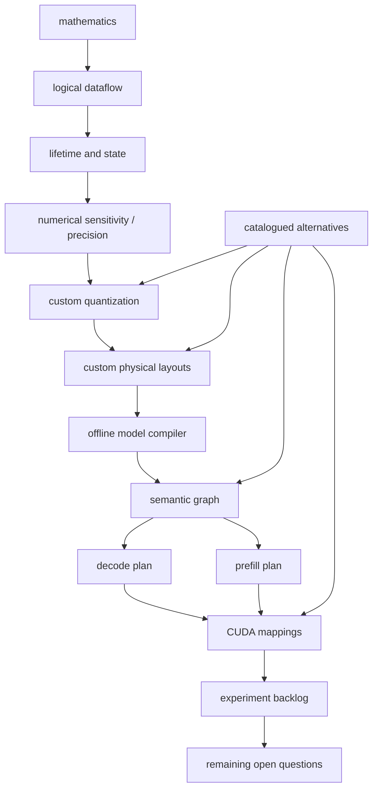

# Qwen3.8-27B clean-sheet architecture (TASK-20)

Complete-map MTP behavior cited here is conditional on TASK-02's unverified analysis model.

> **Draft status:** conclusions in this document are **unverified** until the verification stage completes.

Phase 1 **synthesis** of TASK-01 through TASK-19: locked structure
(equations, graph, contracts, bounds, methodologies) plus a catalogue of
unselected experiment spaces. This is not a selected runtime and not
measurements. Prefill and decode share **one** semantic graph (TASK-11) and
**one** compiled artifact (TASK-09 via TASK-17). They do **not** share one
performance metric identity (TASK-19). Quality methodology is shared
(TASK-18). The primary object is language+MTP **complete map** (135 node
instances). Language-only is a secondary row.

If any occupancy, MAC/byte, node type, stage kind, recipe, mapping, or id
would disagree with TASK-01–19 or sitting `text_config`, the earlier document
wins and this synthesis is wrong. Claims are labelled `OBSERVED` (sitting
`text_config` / inventory already established; TASK-16 \(N_w=32\),
\(N_{\text{bank}}=32\)), `MEASURED` (TASK-05 citations only), `DERIVED`
(chain membership, occupancy/MAC citations, experiment DAG), `HYPOTHESIS`
(every remaining alternative usefulness; every experiment hypothesis), or
`UNKNOWN` (sitting-SKU numeric limits; vision-encoder internals; unselected
corpora/hardware).

## Authority

| Item | Value | Label |
| --- | --- | --- |
| Dossier | [`docs/architecture/tasks/TASK-20.md`](tasks/TASK-20.md) | — |
| Study plan | [`docs/architecture/plan.md`](plan.md) | OBSERVED evidence vocabulary |
| TASK-01 | [`model-inventory.md`](model-inventory.md) | OBSERVED occupancy |
| TASK-02 | [`model-semantics.md`](model-semantics.md) | DERIVED equations |
| TASK-03 | [`dataflow.md`](dataflow.md) | DERIVED 52-ID DAG |
| TASK-04 | [`lifetime-and-state.md`](lifetime-and-state.md) | DERIVED state |
| TASK-05 | [`bf16-tensor-analysis.md`](bf16-tensor-analysis.md) | MEASURED distributions |
| TASK-06 | [`work-and-traffic.md`](work-and-traffic.md) | DERIVED MAC/byte |
| TASK-07 | [`numerical-sensitivity.md`](numerical-sensitivity.md) | DERIVED / HYPOTHESIS |
| TASK-08 | [`quantization-design-space.md`](quantization-design-space.md) | 22 recipes unselected |
| TASK-09 | [`runtime-format-design.md`](runtime-format-design.md) | artifact approaches unselected |
| TASK-10 | [`model-compiler-plan.md`](model-compiler-plan.md) | stages / profiles |
| TASK-11 | [`semantic-graph.md`](semantic-graph.md) | 6 types / 135 instances |
| TASK-12 | [`materialization-and-fusion.md`](materialization-and-fusion.md) | 22 fusion HYPOTHESIS |
| TASK-13 | [`decode-plan.md`](decode-plan.md) | nine stage kinds |
| TASK-14 | [`prefill-plan.md`](prefill-plan.md) | views unselected |
| TASK-15 | [`layout-strategy.md`](layout-strategy.md) | orderings / tiles |
| TASK-16 | [`cuda-hardware-model.md`](cuda-hardware-model.md) | SKU UNKNOWN |
| TASK-17 | [`cuda-design-space.md`](cuda-design-space.md) | 18 mappings unselected |
| TASK-18 | [`quantization-validation.md`](quantization-validation.md) | quality methodology |
| TASK-19 | [`performance-validation.md`](performance-validation.md) | performance methodology |
| Config | [`.cache/authorities/qwen3.8-27b-transformers/config.json`](../../.cache/authorities/qwen3.8-27b-transformers/config.json) `text_config` | OBSERVED |
| Checker | [`scripts/check_clean_sheet_architecture.py`](../../scripts/check_clean_sheet_architecture.py) | DERIVED |
| In scope | Language+MTP synthesis + alternative catalogue + unrun backlog | — |
| Deferred | Vision encoder; freeze; selected winners; executed experiments | — |
| Scope of this document | Synthesis — not a selected runtime and not measurements | — |

Numeric ranks instantiate sitting `text_config` OBSERVED: `hidden_size` 5120,
`intermediate_size` 17408, `vocab_size` 248320, 64 decoder layers, 48 linear +
16 full at indices `[3, 7, 11, 15, 19, 23, 27, 31, 35, 39, 43, 47, 51, 55, 59, 63]`,
`mtp_num_hidden_layers` 1, `dtype` `"bfloat16"`, `mamba_ssm_dtype` `"float32"`,
`max_position_embeddings` \(T_{\text{ctx max}}=262144\). Language+MTP occupancy
is 27320697856 parameters / 54641395712 BF16 bytes (OBSERVED). Unique non-embed
weight bytes are 52098598912 (TASK-06). Complete map: 135 node instances.
MAC citations (DERIVED, TASK-06): \(C_\text{complete}=27433238528\),
\(A_\text{complete}=208896\); T=1 decode = T=1 prefill MAC \(27433447424\);
T=4096 decode \(28288876544\); T=4096 prefill \(114119319486464\).

## Synthesis convention

Logical values in this document are graph nodes. They do not imply physical allocation, materialization, buffer reuse, or kernel fusion.

This document is a Phase 1 synthesis of TASK-01 through TASK-19, not a selected runtime and not measurements.

Unselected alternatives remain alternatives; listing them is not selecting a winner.

The experiment backlog is dependency-ordered and unrun; no implementation benchmarks or NLL are collected in this study task.

The required architecture chain and evidence classes are synthesized; an architecture diagram and alternatives are included; dependency-ordered experiment entries list all requested fields; no winners are selected and no experiments are run in this study task.

JSON: `canonical_sentence_logical` = sentence 1; `canonical_sentence_synthesis` = sentence 2; `canonical_sentence_alternatives` = sentence 3; `canonical_sentence_unrun` = sentence 4; `synthesis_question_sentence` = the synthesis sentence.

- The twelve `chain_ids` follow plan.md’s central path, not ledger execution order. TASK-16 ran beside TASK-01; TASK-11 preceded TASK-15. The diagram is the design path (`chain_follows_plan_path` true; `chain_is_not_ledger_order` true).
- Five evidence classes are complete: `DERIVED`, `OBSERVED`, `MEASURED`, `HYPOTHESIS`, `UNKNOWN` (`n_evidence_classes` 5), matching plan.md order.
- Fan-out ≠ must-store still holds; a synthesized box is not a CUDA allocation and not a selected kernel.
- TASK-20 catalogues remaining alternatives and unknowns; it does not close TASK-07–19 open questions (`n_remaining_open_questions_closed` 0).
- `FROZEN_FOR_COMPARATIVE_REVIEW` is TASK-21 (`frozen_for_comparative_review` false); freeze remain unselected.
- No MEASURED NLL or tok/s in this document (`experiments_run` false; `nll_measured_here` false; `toks_measured_here` false).
- Tok/s is not a quality axis (`toks_is_not_quality_axis` true). Reconstruction is not quality (`reconstruction_is_not_quality` true).
- Microbenchmarks cannot pass a mapping (`microbenchmark_cannot_pass_mapping` true). End-to-end is required alongside them (`e2e_required_alongside_microbenchmarks` true).
- Q4_K_M is a future black-box Pareto reference, not a requirement (`gguf_is_pareto_reference` true; `gguf_is_not_a_requirement` true).
- Primary coverage includes MTP (135 instances). Language-only is secondary.
- `example_T_values` `[1, 4096]` remain illustration horizons, not a selected prompt matrix.

## Architecture chain and evidence classes

JSON array `chain_ids` in this exact order (12 ids). JSON `n_chain_steps` = 12. JSON `synthesized_task_ids` = TASK-01 … TASK-19 (`n_synthesized_tasks` 19). JSON `satellite_task_ids` = TASK-05, TASK-06, TASK-09, TASK-12, TASK-16 (`n_satellite_tasks` 5). The experiment backlog is this increment’s output, cited as the `experimental_validation` leaf; `chain_source_task_groups` does not contain TASK-20.

| id | Plan.md step | Source tasks (cite, do not rewrite) |
| --- | --- | --- |
| `mathematics` | Qwen3.8 mathematics | TASK-01, TASK-02 |
| `logical_dataflow` | logical dataflow | TASK-03 |
| `lifetime_and_state` | tensor lifetime and state | TASK-04 |
| `numerical_sensitivity` | numerical sensitivity | TASK-07 |
| `precision_strategy` | precision strategy | TASK-07 |
| `custom_quantization` | custom quantization | TASK-08 |
| `custom_physical_layouts` | custom physical layouts | TASK-15 |
| `offline_model_compiler` | offline model compiler | TASK-09, TASK-10 |
| `semantic_graph` | Qwen-specific semantic graph | TASK-11, TASK-12 |
| `decode_prefill_plans` | decode/prefill execution plans | TASK-13, TASK-14 |
| `cuda_mappings` | CUDA mappings | TASK-16, TASK-17 |
| `experimental_validation` | future experimental validation | TASK-18, TASK-19 (backlog is this increment) |

JSON array `evidence_class_ids` in this exact order (5 ids): `DERIVED`, `OBSERVED`, `MEASURED`, `HYPOTHESIS`, `UNKNOWN`. TASK-20 itself adds no new MEASURED points. TASK-05 remains the only payload-MEASURED source (`pooled_language_mtp.absmax=19.25`). Hypotheses remain hypotheses. UNKNOWN is sitting SKU, vision encoder, and unselected corpora/hardware/prompt/repro values.

Satellite attachments (cite, do not re-derive): TASK-05 MEASURED distributions shape TASK-08 candidate sets and do not pick winners. TASK-06 MAC/byte identities are lower bounds, not measured traffic. TASK-09 artifact approaches remain unselected. TASK-12 fusion hypotheses remain HYPOTHESIS. TASK-16 SKU symbols remain UNKNOWN.

JSON `n_tasks_open_question_closed` = 9. JSON `n_tasks_open_question_open` = 10. Vision deferred is not a closed language-math question; TASK-02 language math is closed. TASK-05 measurements themselves are complete; quantization winners remain TASK-08 / `oq_pareto_frontier`.

| task | deliverable | primary_evidence_classes | open_question_status |
| --- | --- | --- | --- |
| TASK-01 | [`model-inventory.md`](model-inventory.md) | OBSERVED, DERIVED | closed |
| TASK-02 | [`model-semantics.md`](model-semantics.md) | DERIVED | closed |
| TASK-03 | [`dataflow.md`](dataflow.md) | DERIVED | closed |
| TASK-04 | [`lifetime-and-state.md`](lifetime-and-state.md) | DERIVED | closed |
| TASK-05 | [`bf16-tensor-analysis.md`](bf16-tensor-analysis.md) | MEASURED | closed |
| TASK-06 | [`work-and-traffic.md`](work-and-traffic.md) | DERIVED, HYPOTHESIS | closed |
| TASK-07 | [`numerical-sensitivity.md`](numerical-sensitivity.md) | DERIVED, HYPOTHESIS | open |
| TASK-08 | [`quantization-design-space.md`](quantization-design-space.md) | OBSERVED, MEASURED, DERIVED, HYPOTHESIS | open |
| TASK-09 | [`runtime-format-design.md`](runtime-format-design.md) | DERIVED, HYPOTHESIS | open |
| TASK-10 | [`model-compiler-plan.md`](model-compiler-plan.md) | DERIVED, HYPOTHESIS | open |
| TASK-11 | [`semantic-graph.md`](semantic-graph.md) | DERIVED | closed |
| TASK-12 | [`materialization-and-fusion.md`](materialization-and-fusion.md) | DERIVED, HYPOTHESIS | closed |
| TASK-13 | [`decode-plan.md`](decode-plan.md) | DERIVED, HYPOTHESIS | closed |
| TASK-14 | [`prefill-plan.md`](prefill-plan.md) | DERIVED, HYPOTHESIS | open |
| TASK-15 | [`layout-strategy.md`](layout-strategy.md) | DERIVED, HYPOTHESIS | open |
| TASK-16 | [`cuda-hardware-model.md`](cuda-hardware-model.md) | DERIVED, UNKNOWN | open |
| TASK-17 | [`cuda-design-space.md`](cuda-design-space.md) | DERIVED, HYPOTHESIS, UNKNOWN | open |
| TASK-18 | [`quantization-validation.md`](quantization-validation.md) | DERIVED, HYPOTHESIS | open |
| TASK-19 | [`performance-validation.md`](performance-validation.md) | DERIVED, HYPOTHESIS, UNKNOWN | open |

## Locked structure

Cite, do not retabulate as new studies. Occupancy OBSERVED/DERIVED from sitting `text_config` plus TASK-01/06:

| Field | Value | Label |
| --- | --- | --- |
| `hidden_size` | 5120 | OBSERVED |
| `intermediate_size` | 17408 | OBSERVED |
| `vocab_size` | 248320 | OBSERVED |
| `n_decoder_layers` | 64 | OBSERVED |
| `n_linear_layers` | 48 | OBSERVED |
| `n_full_layers` | 16 | OBSERVED |
| `n_mtp_blocks` | 1 | OBSERVED |
| `full_attention_indices` | `[3,7,11,15,19,23,27,31,35,39,43,47,51,55,59,63]` | OBSERVED |
| `dtype` | `"bfloat16"` | OBSERVED |
| `mamba_ssm_dtype` | `"float32"` | OBSERVED |
| `model_T_max` | 262144 | OBSERVED |
| `n_language_mtp_parameters` | 27320697856 | OBSERVED |
| `weight_bytes_language_mtp_excl_vision` | 54641395712 | OBSERVED |
| `weight_bytes_unique_non_embed` | 52098598912 | DERIVED (TASK-06) |
| `mac_C_complete` | 27433238528 | DERIVED (TASK-06) |
| `mac_A_complete` | 208896 | DERIVED (TASK-06) |
| `mac_decode_complete_T1` = `mac_prefill_complete_T1` | 27433447424 | DERIVED (TASK-06) |
| `mac_decode_complete_T4096` | 28288876544 | DERIVED (TASK-06) |
| `mac_prefill_complete_T4096` | 114119319486464 | DERIVED (TASK-06) |
| `example_T_values` | `[1, 4096]` | illustration only |
| `N_w` / `N_bank` | 32 / 32 | OBSERVED (TASK-16) |

Counts (locked; ids live in the JSON fence and TASK-01–19 documents): 6 node types / 135 instances (2 `embed`, 17 `gated_attn`, 48 `gated_delta_net`, 65 `mlp`, 2 `lm_head`, 1 `mtp_mix`); 9 stage kinds; 22 candidate recipes / 16 policy families; 6 compiler stages / 3 compiler profiles plus identity `control`; 4 artifact approaches / 7 consumer sequences / `none` vs `checksum` integrity; 22 fusion + 5 hoist hypotheses; 4 representation + 2 mode hypotheses; 14 orderings / 9 tile families / 9 parallel decompositions / 4 conversion hypotheses; 18 mappings; 17 SKU-UNKNOWN symbols; 20 sensitive ops.

Algebraic equivalents in TASK-02 remain the same real map. Chunkwise GDN is not zero \(S\) traffic. At \(T=1\), MAC prefill = decode; C/S physical reads still differ. Unique weight bytes are a TASK-06 lower bound, not measured HBM traffic.

What remain unselected (all false except catalogue/methodology flags): `pareto_frontier_selected`, `compiler_profile_selected`, `artifact_boundary_selected`, `ideal_byte_sequence_selected`, `integrity_algorithm_selected`, `fusion_winner_selected`, `decode_prefill_distinct_views_selected`, `layout_winner_selected`, `ordering_selected`, `tile_size_selected`, `mapping_winner_selected`, `hardware_selected`, `prompt_matrix_selected`, `reproducibility_protocol_selected`, `calibration_corpus_selected`, `eval_corpus_selected`, `acceptance_frontier_selected`, `sku_table_filled`, `hypothesis_survival_selected`. JSON `n_mappings_selected` 0; `n_fusion_hypotheses_selected` 0; `n_alternatives_selected` 0.

No new operators, node types, recipes, mappings, metrics, or stage kinds. Control `keep_source` / profile `control` is the identity compile, not a fourth intent axis and not a quality winner (`keep_source_is_not_quality_winner` true; `control_profile_is_keep_source` true).

## Architecture diagram and alternatives

Plan.md design path (not ledger execution order). Alternative usefulness is HYPOTHESIS; listing is unselected / not a selected winner. OPENQ is remaining TASK-07–19 unknowns, not a freeze. The chain is the plan.md design path. JSON `n_diagrams` 1.



JSON array `alternative_family_ids` in this exact order (14 ids). JSON `n_alternative_families` = 14. JSON `alternative_family_counts` = `[22,3,4,7,2,4,2,22,5,14,9,9,4,18]`. JSON `n_catalogued_alternatives` = 125. JSON `n_alternatives_selected` = 0. JSON `alternative_usefulness_label` exactly `HYPOTHESIS`. Control `keep_source` / profile `control` is the identity compile, not a fourth intent axis and not a quality winner. Q4_K_M is a Pareto **reference**, not an `alt_*` member.

| id | count | source list |
| --- | --- | --- |
| `alt_recipes` | 22 | `candidate_recipe_ids` |
| `alt_profiles` | 3 | `compiler_profile_ids` |
| `alt_artifact_approaches` | 4 | `artifact_approach_ids` |
| `alt_consumer_sequences` | 7 | `consumer_sequence_ids` |
| `alt_integrity` | 2 | `integrity_algorithm_candidates` |
| `alt_representation` | 4 | `representation_hypothesis_ids` |
| `alt_mode` | 2 | `mode_hypothesis_ids` |
| `alt_fusion` | 22 | `fusion_hypothesis_ids` |
| `alt_hoist` | 5 | `hoist_hypothesis_ids` |
| `alt_orderings` | 14 | `ordering_ids` |
| `alt_tiles` | 9 | `tile_family_ids` |
| `alt_decompositions` | 9 | `parallel_decomposition_ids` |
| `alt_conversions` | 4 | `conversion_hypothesis_ids` |
| `alt_mappings` | 18 | `mapping_ids` |

## Remaining unknowns

JSON array `remaining_open_question_ids` in this exact order (12 ids). JSON `n_remaining_open_questions` = 12. JSON `n_remaining_open_questions_closed` = 0. JSON `ledger_open_question_alternatives_catalogued` true. JSON `frozen_for_comparative_review` false.

Cataloguing these ids is the TASK-20 answer to “candidate alternatives and unknowns remaining.” It is not a selected architecture. TASK-21 may preserve them as true unknowns after consistency review.

| ID | Source | Still unselected |
| --- | --- | --- |
| `oq_risk_survival` | TASK-07 / TASK-18 | which sensitive-op hypotheses survive |
| `oq_pareto_frontier` | TASK-08 / TASK-18 | bit widths / grouping / scales / outliers / profile maps |
| `oq_artifact_boundary` | TASK-09 | portable vs backend-specialized vs dual-view |
| `oq_ideal_byte_sequence` | TASK-09 | which of seven consumer sequences |
| `oq_integrity_algorithm` | TASK-10 | `none` vs `checksum` |
| `oq_fusion_winner` | TASK-12 / TASK-13 | 22 fusion + 5 hoist |
| `oq_decode_prefill_views` | TASK-14 | four representation + two mode hypotheses |
| `oq_parallel_decomposition` | TASK-15 | which decompositions justify orderings/tiles |
| `oq_sku_limits` | TASK-16 | 17 sitting-SKU symbols |
| `oq_mapping_winner` | TASK-17 | 18 mappings after benchmarks |
| `oq_eval_corpora` | TASK-18 | four corpus classes, prompt suite, capability, acceptance frontier |
| `oq_hardware_protocol` | TASK-19 | hardware, prompt matrix, reproducibility protocol |

## Deferred vision

Vision-encoder internals remain `UNKNOWN` and out of the primary map. Residual-stream interface only (`out_hidden_size` 5120 OBSERVED). No vision experiments in the backlog. JSON `vision_eval_deferred` true.

## Machine-checkable summary JSON

Live object from sitting `text_config` plus locked constants. First fenced `json` block must equal a fresh checker `--json` run. The same object is copied into [`experiment-backlog.md`](experiment-backlog.md).

```json
{
  "authority": "docs/architecture/plan.md",
  "deliverable_architecture": "docs/architecture/clean-sheet-architecture.md",
  "deliverable_backlog": "docs/architecture/experiment-backlog.md",
  "hidden_size": 5120,
  "intermediate_size": 17408,
  "vocab_size": 248320,
  "n_decoder_layers": 64,
  "n_linear_layers": 48,
  "n_full_layers": 16,
  "n_mtp_blocks": 1,
  "full_attention_indices": [
    3,
    7,
    11,
    15,
    19,
    23,
    27,
    31,
    35,
    39,
    43,
    47,
    51,
    55,
    59,
    63
  ],
  "model_T_max": 262144,
  "dtype": "bfloat16",
  "mamba_ssm_dtype": "float32",
  "n_language_mtp_parameters": 27320697856,
  "weight_bytes_language_mtp_excl_vision": 54641395712,
  "weight_bytes_unique_non_embed": 52098598912,
  "mac_C_complete": 27433238528,
  "mac_A_complete": 208896,
  "mac_decode_complete_T1": 27433447424,
  "mac_prefill_complete_T1": 27433447424,
  "mac_decode_complete_T4096": 28288876544,
  "mac_prefill_complete_T4096": 114119319486464,
  "example_T_values": [
    1,
    4096
  ],
  "N_w": 32,
  "N_bank": 32,
  "n_node_types": 6,
  "node_type_ids": [
    "embed",
    "gated_attn",
    "gated_delta_net",
    "mlp",
    "lm_head",
    "mtp_mix"
  ],
  "n_embed_instances": 2,
  "n_gated_attn_instances": 17,
  "n_gated_delta_net_instances": 48,
  "n_mlp_instances": 65,
  "n_lm_head_instances": 2,
  "n_mtp_mix_instances": 1,
  "n_node_instances_complete": 135,
  "n_stage_kinds": 9,
  "stage_kind_ids": [
    "embed_current",
    "language_mixer",
    "language_mlp",
    "lm_head_primary",
    "embed_next",
    "mtp_mix",
    "mtp_mixer",
    "mtp_mlp",
    "lm_head_mtp"
  ],
  "n_candidate_recipes": 22,
  "candidate_recipe_ids": [
    "keep_source",
    "narrow_bf16",
    "fp8_tensor",
    "i8_tensor",
    "i8_row",
    "i8_row_asym",
    "i8_g32",
    "i6_row",
    "i4_row",
    "i4_col",
    "i4_g32",
    "i4_g64",
    "i4_g128",
    "i4_g128_p99",
    "i4_g128_rms",
    "i4_g128_extract",
    "i4_g32_mixed",
    "i4_row_extract",
    "i4_clip",
    "i3_g32",
    "i3_g32_extract",
    "i2_g32_extract"
  ],
  "n_policy_families": 16,
  "policy_families": [
    "norm_gamma",
    "gdn_time_param",
    "gdn_gate_proj",
    "conv1d",
    "linear_large_proj",
    "attn_qkv",
    "attn_out",
    "mlp_up_gate",
    "mlp_down",
    "embed_table",
    "lm_head",
    "mtp_fc",
    "vision_deferred",
    "state_kv",
    "state_c",
    "state_s"
  ],
  "n_compiler_stages": 6,
  "compiler_stage_ids": [
    "validation",
    "analysis",
    "quantization",
    "packing",
    "metadata",
    "integrity"
  ],
  "n_compiler_profiles": 3,
  "compiler_profile_ids": [
    "quality",
    "balanced",
    "compression"
  ],
  "control_profile_id": "control",
  "n_artifact_approaches": 4,
  "artifact_approach_ids": [
    "portable_only",
    "backend_specialized_only",
    "portable_plus_specialized_views",
    "manifest_plus_backend_blobs"
  ],
  "n_consumer_sequences": 7,
  "consumer_sequence_ids": [
    "seq_gemm_codes_then_scales",
    "seq_gemm_interleaved_group",
    "seq_gather_row",
    "seq_lm_head_full",
    "seq_outlier_extra",
    "seq_state_s_dense",
    "seq_specialized_tile"
  ],
  "integrity_algorithm_candidates": [
    "none",
    "checksum"
  ],
  "n_fusion_hypotheses": 22,
  "fusion_hypothesis_ids": [
    "fuse_gated_attn_internals",
    "fuse_gated_delta_net_internals",
    "fuse_mlp_internals",
    "fuse_lm_head_internals",
    "fuse_mtp_mix_internals",
    "split_g",
    "split_z",
    "split_h_tilde",
    "split_k_rope",
    "split_v_full",
    "split_qkv",
    "split_h_post",
    "split_swiglu",
    "split_h_final",
    "split_mtp_cat",
    "fuse_across_identity_e_h0",
    "fuse_across_residual_h",
    "fuse_across_residual_h_mid",
    "fuse_across_fanout_h64",
    "fuse_across_embed_e_next",
    "fuse_across_mtp_u_to_block",
    "fuse_across_h_mtp_to_logits"
  ],
  "n_hoist_hypotheses": 5,
  "hoist_hypothesis_ids": [
    "hoist_embed_next",
    "overlap_fanout_h64",
    "reuse_E",
    "reuse_W_lm",
    "reuse_h64"
  ],
  "n_representation_hypotheses": 4,
  "representation_hypothesis_ids": [
    "distinct_prefill_gemm_view",
    "distinct_decode_gemv_view",
    "shared_view_both_modes",
    "dual_view_binding"
  ],
  "n_mode_hypotheses": 2,
  "mode_hypothesis_ids": [
    "token_serial_prefill",
    "inference_last_logits"
  ],
  "n_orderings": 14,
  "ordering_ids": [
    "ord_gemm_out_major",
    "ord_gemm_in_major",
    "ord_embed_vocab_major",
    "ord_embed_hidden_major",
    "ord_conv_channel_tap",
    "ord_conv_tap_channel",
    "ord_vec_width",
    "ord_kv_n_t_dh",
    "ord_kv_n_dh_t",
    "ord_kv_t_n_dh",
    "ord_c_delay_channel",
    "ord_c_channel_delay",
    "ord_s_n_dk_dv",
    "ord_s_n_dv_dk"
  ],
  "n_tile_families": 9,
  "tile_family_ids": [
    "tile_none",
    "tile_2d_mn",
    "tile_1d_row",
    "tile_conv_channel",
    "tile_kv_t",
    "tile_kv_dh",
    "tile_s_head",
    "tile_s_block",
    "tile_mma_shaped"
  ],
  "n_parallel_decompositions": 9,
  "parallel_decomposition_ids": [
    "par_gemm_d_out",
    "par_gemm_d_in",
    "par_gemm_T",
    "par_attn_head",
    "par_attn_T",
    "par_gdn_head",
    "par_conv_channel",
    "par_kv_head",
    "par_embed_row"
  ],
  "n_conversion_hypotheses": 4,
  "conversion_hypothesis_ids": [
    "conv_compile_pack",
    "conv_load_repack",
    "conv_inkernel_unpack",
    "conv_dual_view"
  ],
  "n_mappings": 18,
  "mapping_ids": [
    "map_embed_thread_element",
    "map_embed_warp_row",
    "map_embed_cta_vector",
    "map_attn_cta_head",
    "map_attn_warp_t",
    "map_attn_cta_splitk",
    "map_gdn_cta_head",
    "map_gdn_warp_recurrent",
    "map_gdn_cta_chunk",
    "map_mlp_cta_dout",
    "map_mlp_cta_splitk",
    "map_mlp_grid_T",
    "map_lm_cta_vocab",
    "map_lm_cta_splitk",
    "map_lm_warp_gemv",
    "map_mtp_cta_fc",
    "map_mtp_cta_fused",
    "map_mtp_split_norm_gemm"
  ],
  "n_sku_unknown_symbols": 17,
  "sku_unknown_symbols": [
    "N_SM",
    "W_max",
    "S_reg",
    "C_smem",
    "T_max",
    "B_max",
    "N_bar",
    "N_sched",
    "G_reg",
    "G_smem",
    "Beta_HBM",
    "Pi_FMA",
    "Pi_TC",
    "L_issue",
    "async_copy_cap",
    "mma_shapes",
    "cluster_cap"
  ],
  "n_sensitive_ops": 21,
  "sensitive_ops": [
    "param_bf16",
    "residual_stream",
    "live_across_gates",
    "silu_sigmoid",
    "rms_hidden",
    "rms_head",
    "l2_gdn",
    "softmax_over_T",
    "attn_av_over_T",
    "gemm_k5120",
    "gemm_k6144",
    "gemm_k17408",
    "gemm_lm_head",
    "gdn_S_recurrent",
    "gdn_inner_d128",
    "gdn_alpha_beta",
    "rope_phase",
    "state_kv_bf16",
    "state_c_bf16",
    "s_below_f32",
    "conv_fir"
  ],
  "quality_high_ids": [
    "q_norm_gamma",
    "q_gdn_time",
    "q_gdn_gate",
    "q_attn_out",
    "q_mlp_down",
    "q_state_kv",
    "q_state_s",
    "q_int2_mass"
  ],
  "bottleneck_labels": [
    "weight_memory",
    "vocab_memory",
    "state_memory",
    "kv_memory",
    "quadratic_attn",
    "compute"
  ],
  "evaluation_criterion_ids": [
    "crit_occupancy",
    "crit_latency_hiding",
    "crit_wave_quant",
    "crit_intensity_roofline",
    "crit_sync_class",
    "crit_pipeline_mix",
    "crit_fusion_delta"
  ],
  "pareto_axis_ids": [
    "axis_quality",
    "axis_compression",
    "axis_reference_q4km"
  ],
  "corpus_class_ids": [
    "corpus_calibration",
    "corpus_eval_nll",
    "corpus_prompt",
    "corpus_capability"
  ],
  "reconstruction_diagnostic_ids": [
    "r_param_mse",
    "r_param_maxabs",
    "r_param_cosine",
    "r_clip_frac",
    "r_act_residual",
    "r_act_logits",
    "r_state_kv",
    "r_state_s"
  ],
  "teacher_forced_metric_ids": [
    "tf_nll_language",
    "tf_nll_mtp",
    "tf_nll_complete",
    "tf_delta_vs_control",
    "tf_kl_vs_control"
  ],
  "decode_metric_ids": [
    "dec_toks",
    "dec_step_ms",
    "dec_p50_step_ms",
    "dec_p99_step_ms"
  ],
  "prefill_metric_ids": [
    "pre_toks",
    "pre_ms",
    "pre_ttft_ms",
    "pre_mac_cite"
  ],
  "kernel_metric_ids": [
    "k_node_ms",
    "k_mapping_ms",
    "k_leaf_union_ms",
    "k_graph_envelope_ms",
    "k_occupancy_achieved"
  ],
  "memory_metric_ids": [
    "mem_hbm_gbps",
    "mem_weight_bytes",
    "mem_state_bytes",
    "mem_act_bytes",
    "mem_working_set"
  ],
  "e2e_metric_ids": [
    "e2e_latency_ms",
    "e2e_output_toks",
    "e2e_ttft_ms"
  ],
  "comparison_dimension_ids": [
    "compile_once",
    "load_convert",
    "byte_sequence",
    "tile_freedom",
    "store_amplification",
    "consumer_portability"
  ],
  "n_synthesized_tasks": 19,
  "synthesized_task_ids": [
    "TASK-01",
    "TASK-02",
    "TASK-03",
    "TASK-04",
    "TASK-05",
    "TASK-06",
    "TASK-07",
    "TASK-08",
    "TASK-09",
    "TASK-10",
    "TASK-11",
    "TASK-12",
    "TASK-13",
    "TASK-14",
    "TASK-15",
    "TASK-16",
    "TASK-17",
    "TASK-18",
    "TASK-19"
  ],
  "n_satellite_tasks": 5,
  "satellite_task_ids": [
    "TASK-05",
    "TASK-06",
    "TASK-09",
    "TASK-12",
    "TASK-16"
  ],
  "n_chain_steps": 12,
  "chain_ids": [
    "mathematics",
    "logical_dataflow",
    "lifetime_and_state",
    "numerical_sensitivity",
    "precision_strategy",
    "custom_quantization",
    "custom_physical_layouts",
    "offline_model_compiler",
    "semantic_graph",
    "decode_prefill_plans",
    "cuda_mappings",
    "experimental_validation"
  ],
  "chain_source_task_groups": {
    "mathematics": [
      "TASK-01",
      "TASK-02"
    ],
    "logical_dataflow": [
      "TASK-03"
    ],
    "lifetime_and_state": [
      "TASK-04"
    ],
    "numerical_sensitivity": [
      "TASK-07"
    ],
    "precision_strategy": [
      "TASK-07"
    ],
    "custom_quantization": [
      "TASK-08"
    ],
    "custom_physical_layouts": [
      "TASK-15"
    ],
    "offline_model_compiler": [
      "TASK-09",
      "TASK-10"
    ],
    "semantic_graph": [
      "TASK-11",
      "TASK-12"
    ],
    "decode_prefill_plans": [
      "TASK-13",
      "TASK-14"
    ],
    "cuda_mappings": [
      "TASK-16",
      "TASK-17"
    ],
    "experimental_validation": [
      "TASK-18",
      "TASK-19"
    ]
  },
  "n_evidence_classes": 5,
  "evidence_class_ids": [
    "DERIVED",
    "OBSERVED",
    "MEASURED",
    "HYPOTHESIS",
    "UNKNOWN"
  ],
  "task_evidence_classes": {
    "TASK-01": [
      "OBSERVED",
      "DERIVED"
    ],
    "TASK-02": [
      "DERIVED"
    ],
    "TASK-03": [
      "DERIVED"
    ],
    "TASK-04": [
      "DERIVED"
    ],
    "TASK-05": [
      "MEASURED"
    ],
    "TASK-06": [
      "DERIVED",
      "HYPOTHESIS"
    ],
    "TASK-07": [
      "DERIVED",
      "HYPOTHESIS"
    ],
    "TASK-08": [
      "OBSERVED",
      "MEASURED",
      "DERIVED",
      "HYPOTHESIS"
    ],
    "TASK-09": [
      "DERIVED",
      "HYPOTHESIS"
    ],
    "TASK-10": [
      "DERIVED",
      "HYPOTHESIS"
    ],
    "TASK-11": [
      "DERIVED"
    ],
    "TASK-12": [
      "DERIVED",
      "HYPOTHESIS"
    ],
    "TASK-13": [
      "DERIVED",
      "HYPOTHESIS"
    ],
    "TASK-14": [
      "DERIVED",
      "HYPOTHESIS"
    ],
    "TASK-15": [
      "DERIVED",
      "HYPOTHESIS"
    ],
    "TASK-16": [
      "DERIVED",
      "UNKNOWN"
    ],
    "TASK-17": [
      "DERIVED",
      "HYPOTHESIS",
      "UNKNOWN"
    ],
    "TASK-18": [
      "DERIVED",
      "HYPOTHESIS"
    ],
    "TASK-19": [
      "DERIVED",
      "HYPOTHESIS",
      "UNKNOWN"
    ]
  },
  "task_open_question_closed": {
    "TASK-01": true,
    "TASK-02": true,
    "TASK-03": true,
    "TASK-04": true,
    "TASK-05": true,
    "TASK-06": true,
    "TASK-07": false,
    "TASK-08": false,
    "TASK-09": false,
    "TASK-10": false,
    "TASK-11": true,
    "TASK-12": true,
    "TASK-13": true,
    "TASK-14": false,
    "TASK-15": false,
    "TASK-16": false,
    "TASK-17": false,
    "TASK-18": false,
    "TASK-19": false
  },
  "n_tasks_open_question_closed": 9,
  "n_tasks_open_question_open": 10,
  "n_alternative_families": 14,
  "alternative_family_ids": [
    "alt_recipes",
    "alt_profiles",
    "alt_artifact_approaches",
    "alt_consumer_sequences",
    "alt_integrity",
    "alt_representation",
    "alt_mode",
    "alt_fusion",
    "alt_hoist",
    "alt_orderings",
    "alt_tiles",
    "alt_decompositions",
    "alt_conversions",
    "alt_mappings"
  ],
  "alternative_family_counts": [
    22,
    3,
    4,
    7,
    2,
    4,
    2,
    22,
    5,
    14,
    9,
    9,
    4,
    18
  ],
  "n_catalogued_alternatives": 125,
  "n_alternatives_selected": 0,
  "alternative_usefulness_label": "HYPOTHESIS",
  "n_remaining_open_questions": 12,
  "remaining_open_question_ids": [
    "oq_risk_survival",
    "oq_pareto_frontier",
    "oq_artifact_boundary",
    "oq_ideal_byte_sequence",
    "oq_integrity_algorithm",
    "oq_fusion_winner",
    "oq_decode_prefill_views",
    "oq_parallel_decomposition",
    "oq_sku_limits",
    "oq_mapping_winner",
    "oq_eval_corpora",
    "oq_hardware_protocol"
  ],
  "n_remaining_open_questions_closed": 0,
  "n_experiment_fields": 12,
  "experiment_field_ids": [
    "id",
    "title",
    "depends_on",
    "source_tasks",
    "chain_step",
    "hypothesis",
    "alternatives",
    "eval_family",
    "metric_ids",
    "disconfirming_outcome",
    "blocking_unknowns",
    "status"
  ],
  "n_experiment_eval_families": 4,
  "experiment_eval_family_ids": [
    "infrastructure",
    "quality",
    "format",
    "performance"
  ],
  "experiment_status_unrun": "unrun",
  "n_experiments": 16,
  "experiment_ids": [
    "exp_sku_fill",
    "exp_identity_harness",
    "exp_control_keep_source",
    "exp_reconstruction_screen",
    "exp_family_nll",
    "exp_state_precision",
    "exp_risk_survival",
    "exp_pareto_profiles",
    "exp_artifact_boundary",
    "exp_consumer_sequence",
    "exp_integrity_algorithm",
    "exp_decode_prefill_views",
    "exp_fusion_hoist",
    "exp_layout_decomp",
    "exp_mapping_micro",
    "exp_mapping_e2e"
  ],
  "experiments": [
    {
      "id": "exp_sku_fill",
      "title": "Fill sitting SKU table",
      "depends_on": [],
      "source_tasks": [
        "TASK-16",
        "TASK-19"
      ],
      "chain_step": "cuda_mappings",
      "hypothesis": "Sitting-device capacity and peak symbols can be filled from a declared sitting identity; a datasheet is not a measurement.",
      "alternatives": [
        "N_SM",
        "W_max",
        "S_reg",
        "C_smem",
        "T_max",
        "B_max",
        "N_bar",
        "N_sched",
        "G_reg",
        "G_smem",
        "Beta_HBM",
        "Pi_FMA",
        "Pi_TC",
        "L_issue",
        "async_copy_cap",
        "mma_shapes",
        "cluster_cap"
      ],
      "eval_family": "infrastructure",
      "metric_ids": [],
      "disconfirming_outcome": "Filling sku_unknown_symbols from an unnamed datasheet or treating datasheet peaks as mem_hbm_gbps.",
      "blocking_unknowns": [
        "oq_hardware_protocol"
      ],
      "status": "unrun"
    },
    {
      "id": "exp_identity_harness",
      "title": "Identity coverage and NLL harness",
      "depends_on": [],
      "source_tasks": [
        "TASK-18",
        "TASK-19"
      ],
      "chain_step": "experimental_validation",
      "hypothesis": "Matching-identity capture is implementable without mixing decode-only, prefill, and complete-request windows.",
      "alternatives": [],
      "eval_family": "infrastructure",
      "metric_ids": [],
      "disconfirming_outcome": "Mixed (T+N)/t reported as decode-only, or missing coverage treated as zero excess.",
      "blocking_unknowns": [
        "oq_hardware_protocol",
        "oq_eval_corpora"
      ],
      "status": "unrun"
    },
    {
      "id": "exp_control_keep_source",
      "title": "Control keep_source baseline",
      "depends_on": [
        "exp_identity_harness"
      ],
      "source_tasks": [
        "TASK-08",
        "TASK-10",
        "TASK-18",
        "TASK-19"
      ],
      "chain_step": "experimental_validation",
      "hypothesis": "keep_source control compile reproduces the TASK-02 map at conceptual BF16 parameters and F32 S; it is an identity control, not a quality winner.",
      "alternatives": [
        "control"
      ],
      "eval_family": "quality",
      "metric_ids": [
        "tf_nll_complete",
        "tf_nll_language",
        "tf_nll_mtp",
        "e2e_latency_ms",
        "dec_toks",
        "pre_toks"
      ],
      "disconfirming_outcome": "Undefined control NLL, or ranking keep_source as a quality winner.",
      "blocking_unknowns": [
        "oq_eval_corpora",
        "oq_hardware_protocol"
      ],
      "status": "unrun"
    },
    {
      "id": "exp_reconstruction_screen",
      "title": "Reconstruction screens over candidate recipes",
      "depends_on": [
        "exp_control_keep_source"
      ],
      "source_tasks": [
        "TASK-08",
        "TASK-18"
      ],
      "chain_step": "custom_quantization",
      "hypothesis": "Local reconstruction can fail catastrophic recipes and cannot place a Pareto quality point.",
      "alternatives": [
        "keep_source",
        "narrow_bf16",
        "fp8_tensor",
        "i8_tensor",
        "i8_row",
        "i8_row_asym",
        "i8_g32",
        "i6_row",
        "i4_row",
        "i4_col",
        "i4_g32",
        "i4_g64",
        "i4_g128",
        "i4_g128_p99",
        "i4_g128_rms",
        "i4_g128_extract",
        "i4_g32_mixed",
        "i4_row_extract",
        "i4_clip",
        "i3_g32",
        "i3_g32_extract",
        "i2_g32_extract"
      ],
      "eval_family": "quality",
      "metric_ids": [
        "r_param_mse",
        "r_param_maxabs",
        "r_param_cosine",
        "r_clip_frac",
        "r_act_residual",
        "r_act_logits",
        "r_state_kv",
        "r_state_s"
      ],
      "disconfirming_outcome": "Placing a Pareto point from r_* diagnostics, or treating reconstruction as NLL.",
      "blocking_unknowns": [],
      "status": "unrun"
    },
    {
      "id": "exp_family_nll",
      "title": "Teacher-forced family NLL",
      "depends_on": [
        "exp_reconstruction_screen"
      ],
      "source_tasks": [
        "TASK-07",
        "TASK-08",
        "TASK-18"
      ],
      "chain_step": "custom_quantization",
      "hypothesis": "Family-specific candidate sets, especially quality_high_ids families, change complete-map NLL versus keep_source.",
      "alternatives": [
        "norm_gamma",
        "gdn_time_param",
        "gdn_gate_proj",
        "conv1d",
        "linear_large_proj",
        "attn_qkv",
        "attn_out",
        "mlp_up_gate",
        "mlp_down",
        "embed_table",
        "lm_head",
        "mtp_fc",
        "vision_deferred",
        "state_kv",
        "state_c",
        "state_s"
      ],
      "eval_family": "quality",
      "metric_ids": [
        "tf_nll_complete",
        "tf_delta_vs_control",
        "tf_kl_vs_control"
      ],
      "disconfirming_outcome": "Language-only NLL substituting for the complete map, or sampling used as NLL.",
      "blocking_unknowns": [
        "oq_eval_corpora"
      ],
      "status": "unrun"
    },
    {
      "id": "exp_state_precision",
      "title": "Persistent-state precision",
      "depends_on": [
        "exp_family_nll"
      ],
      "source_tasks": [
        "TASK-04",
        "TASK-07",
        "TASK-08",
        "TASK-18"
      ],
      "chain_step": "precision_strategy",
      "hypothesis": "Narrowing conceptual F32 S or BF16 K,V,C changes NLL and/or state reconstruction.",
      "alternatives": [
        "state_kv",
        "state_c",
        "state_s",
        "keep_source",
        "narrow_bf16"
      ],
      "eval_family": "quality",
      "metric_ids": [
        "r_state_kv",
        "r_state_s",
        "tf_nll_complete"
      ],
      "disconfirming_outcome": "Treating chunkwise GDN as zero S traffic, or dropping MTP from the complete map.",
      "blocking_unknowns": [],
      "status": "unrun"
    },
    {
      "id": "exp_risk_survival",
      "title": "Numerical-risk hypothesis survival",
      "depends_on": [
        "exp_family_nll",
        "exp_state_precision"
      ],
      "source_tasks": [
        "TASK-07",
        "TASK-18"
      ],
      "chain_step": "numerical_sensitivity",
      "hypothesis": "Some of the twenty sensitive-op HYPOTHESIS severities survive model-level validation.",
      "alternatives": [
        "param_bf16",
        "residual_stream",
        "live_across_gates",
        "silu_sigmoid",
        "rms_hidden",
        "rms_head",
        "l2_gdn",
        "softmax_over_T",
        "attn_av_over_T",
        "gemm_k5120",
        "gemm_k6144",
        "gemm_k17408",
        "gemm_lm_head",
        "gdn_S_recurrent",
        "gdn_inner_d128",
        "gdn_alpha_beta",
        "rope_phase",
        "state_kv_bf16",
        "state_c_bf16",
        "s_below_f32",
        "conv_fir"
      ],
      "eval_family": "quality",
      "metric_ids": [
        "tf_nll_complete",
        "r_act_residual",
        "r_act_logits"
      ],
      "disconfirming_outcome": "Declaring hypothesis_survival_selected without complete-map NLL.",
      "blocking_unknowns": [
        "oq_eval_corpora"
      ],
      "status": "unrun"
    },
    {
      "id": "exp_pareto_profiles",
      "title": "Profile Pareto versus Q4_K_M reference",
      "depends_on": [
        "exp_risk_survival"
      ],
      "source_tasks": [
        "TASK-08",
        "TASK-10",
        "TASK-18"
      ],
      "chain_step": "custom_quantization",
      "hypothesis": "Legal quality, balanced, and compression recipe maps form a Pareto surface on quality and compression with Q4_K_M as a reference point, not a requirement.",
      "alternatives": [
        "quality",
        "balanced",
        "compression",
        "control"
      ],
      "eval_family": "quality",
      "metric_ids": [
        "axis_quality",
        "axis_compression",
        "axis_reference_q4km",
        "tf_nll_complete"
      ],
      "disconfirming_outcome": "Requiring Q4_K_M to be beaten, or using tok/s as Pareto Y.",
      "blocking_unknowns": [
        "oq_eval_corpora"
      ],
      "status": "unrun"
    },
    {
      "id": "exp_artifact_boundary",
      "title": "Portable versus backend-specialized artifact",
      "depends_on": [
        "exp_reconstruction_screen"
      ],
      "source_tasks": [
        "TASK-09",
        "TASK-10"
      ],
      "chain_step": "offline_model_compiler",
      "hypothesis": "Artifact-boundary choice changes load/convert cost and consumer portability without changing the TASK-02 map.",
      "alternatives": [
        "portable_only",
        "backend_specialized_only",
        "portable_plus_specialized_views",
        "manifest_plus_backend_blobs"
      ],
      "eval_family": "format",
      "metric_ids": [
        "compile_once",
        "load_convert",
        "byte_sequence",
        "tile_freedom",
        "store_amplification",
        "consumer_portability"
      ],
      "disconfirming_outcome": "Selecting artifact_boundary without a six-dimension comparison.",
      "blocking_unknowns": [],
      "status": "unrun"
    },
    {
      "id": "exp_consumer_sequence",
      "title": "Ideal consumer byte sequences",
      "depends_on": [
        "exp_artifact_boundary"
      ],
      "source_tasks": [
        "TASK-09",
        "TASK-13",
        "TASK-14"
      ],
      "chain_step": "custom_physical_layouts",
      "hypothesis": "One of seven consumer sequences is ideal per access class after a boundary is chosen.",
      "alternatives": [
        "seq_gemm_codes_then_scales",
        "seq_gemm_interleaved_group",
        "seq_gather_row",
        "seq_lm_head_full",
        "seq_outlier_extra",
        "seq_state_s_dense",
        "seq_specialized_tile"
      ],
      "eval_family": "format",
      "metric_ids": [
        "mem_weight_bytes",
        "k_node_ms"
      ],
      "disconfirming_outcome": "Ranking sequences by wall time without coverage, or selecting seq_specialized_tile extents here.",
      "blocking_unknowns": [
        "oq_hardware_protocol"
      ],
      "status": "unrun"
    },
    {
      "id": "exp_integrity_algorithm",
      "title": "Integrity algorithm none versus checksum",
      "depends_on": [
        "exp_artifact_boundary"
      ],
      "source_tasks": [
        "TASK-09",
        "TASK-10"
      ],
      "chain_step": "offline_model_compiler",
      "hypothesis": "checksum versus none is an integrity and load-safety choice, not a quality or NLL decision.",
      "alternatives": [
        "none",
        "checksum"
      ],
      "eval_family": "format",
      "metric_ids": [],
      "disconfirming_outcome": "Treating checksum as a quality winner.",
      "blocking_unknowns": [],
      "status": "unrun"
    },
    {
      "id": "exp_decode_prefill_views",
      "title": "Decode/prefill representation views",
      "depends_on": [
        "exp_consumer_sequence"
      ],
      "source_tasks": [
        "TASK-13",
        "TASK-14"
      ],
      "chain_step": "decode_prefill_plans",
      "hypothesis": "Distinct GEMV/GEMM views, a shared view, or dual-view binding changes traffic versus a single sequence; mode hypotheses remain unselected until measured.",
      "alternatives": [
        "distinct_prefill_gemm_view",
        "distinct_decode_gemv_view",
        "shared_view_both_modes",
        "dual_view_binding",
        "token_serial_prefill",
        "inference_last_logits"
      ],
      "eval_family": "performance",
      "metric_ids": [
        "pre_toks",
        "dec_toks",
        "mem_act_bytes",
        "e2e_latency_ms"
      ],
      "disconfirming_outcome": "Reporting T=1 prefill as decode-only, or selecting views without end-to-end measurement.",
      "blocking_unknowns": [
        "oq_hardware_protocol"
      ],
      "status": "unrun"
    },
    {
      "id": "exp_fusion_hoist",
      "title": "Fusion and hoist hypotheses",
      "depends_on": [
        "exp_control_keep_source"
      ],
      "source_tasks": [
        "TASK-12",
        "TASK-13",
        "TASK-14",
        "TASK-16",
        "TASK-17"
      ],
      "chain_step": "semantic_graph",
      "hypothesis": "Some of twenty-two fusion and five hoist hypotheses improve end-to-end latency without violating TASK-16 occupancy algebra.",
      "alternatives": [
        "fuse_gated_attn_internals",
        "fuse_gated_delta_net_internals",
        "fuse_mlp_internals",
        "fuse_lm_head_internals",
        "fuse_mtp_mix_internals",
        "split_g",
        "split_z",
        "split_h_tilde",
        "split_k_rope",
        "split_v_full",
        "split_qkv",
        "split_h_post",
        "split_swiglu",
        "split_h_final",
        "split_mtp_cat",
        "fuse_across_identity_e_h0",
        "fuse_across_residual_h",
        "fuse_across_residual_h_mid",
        "fuse_across_fanout_h64",
        "fuse_across_embed_e_next",
        "fuse_across_mtp_u_to_block",
        "fuse_across_h_mtp_to_logits",
        "hoist_embed_next",
        "overlap_fanout_h64",
        "reuse_E",
        "reuse_W_lm",
        "reuse_h64"
      ],
      "eval_family": "performance",
      "metric_ids": [
        "e2e_latency_ms",
        "k_node_ms",
        "k_occupancy_achieved",
        "mem_working_set"
      ],
      "disconfirming_outcome": "Selecting fusion from microbenchmarks only, or occupancy-unaware fusion.",
      "blocking_unknowns": [
        "oq_hardware_protocol"
      ],
      "status": "unrun"
    },
    {
      "id": "exp_layout_decomp",
      "title": "Parallel decompositions justifying layouts",
      "depends_on": [
        "exp_decode_prefill_views",
        "exp_sku_fill"
      ],
      "source_tasks": [
        "TASK-15",
        "TASK-17"
      ],
      "chain_step": "custom_physical_layouts",
      "hypothesis": "A planned parallel decomposition justifies a candidate ordering and tile family per layout object.",
      "alternatives": [
        "par_gemm_d_out",
        "par_gemm_d_in",
        "par_gemm_T",
        "par_attn_head",
        "par_attn_T",
        "par_gdn_head",
        "par_conv_channel",
        "par_kv_head",
        "par_embed_row",
        "ord_gemm_out_major",
        "ord_gemm_in_major",
        "ord_embed_vocab_major",
        "ord_embed_hidden_major",
        "ord_conv_channel_tap",
        "ord_conv_tap_channel",
        "ord_vec_width",
        "ord_kv_n_t_dh",
        "ord_kv_n_dh_t",
        "ord_kv_t_n_dh",
        "ord_c_delay_channel",
        "ord_c_channel_delay",
        "ord_s_n_dk_dv",
        "ord_s_n_dv_dk",
        "tile_none",
        "tile_2d_mn",
        "tile_1d_row",
        "tile_conv_channel",
        "tile_kv_t",
        "tile_kv_dh",
        "tile_s_head",
        "tile_s_block",
        "tile_mma_shaped",
        "conv_compile_pack",
        "conv_load_repack",
        "conv_inkernel_unpack",
        "conv_dual_view"
      ],
      "eval_family": "performance",
      "metric_ids": [
        "k_mapping_ms",
        "mem_hbm_gbps",
        "k_occupancy_achieved"
      ],
      "disconfirming_outcome": "Claiming layout optimality before CUDA analysis, or selecting tiles without a decomposition.",
      "blocking_unknowns": [
        "oq_sku_limits"
      ],
      "status": "unrun"
    },
    {
      "id": "exp_mapping_micro",
      "title": "CUDA mapping microbenchmarks",
      "depends_on": [
        "exp_layout_decomp",
        "exp_fusion_hoist",
        "exp_sku_fill"
      ],
      "source_tasks": [
        "TASK-17",
        "TASK-19"
      ],
      "chain_step": "cuda_mappings",
      "hypothesis": "Eighteen ownership and reduction mappings differ on kernel and memory component metrics; none may be declared winner from this experiment alone.",
      "alternatives": [
        "map_embed_thread_element",
        "map_embed_warp_row",
        "map_embed_cta_vector",
        "map_attn_cta_head",
        "map_attn_warp_t",
        "map_attn_cta_splitk",
        "map_gdn_cta_head",
        "map_gdn_warp_recurrent",
        "map_gdn_cta_chunk",
        "map_mlp_cta_dout",
        "map_mlp_cta_splitk",
        "map_mlp_grid_T",
        "map_lm_cta_vocab",
        "map_lm_cta_splitk",
        "map_lm_warp_gemv",
        "map_mtp_cta_fc",
        "map_mtp_cta_fused",
        "map_mtp_split_norm_gemm"
      ],
      "eval_family": "performance",
      "metric_ids": [
        "k_node_ms",
        "k_mapping_ms",
        "k_leaf_union_ms",
        "k_graph_envelope_ms",
        "k_occupancy_achieved",
        "mem_hbm_gbps",
        "mem_weight_bytes",
        "mem_state_bytes",
        "mem_act_bytes",
        "mem_working_set"
      ],
      "disconfirming_outcome": "mapping_winner_selected from microbenchmarks, or ranking graph envelopes as leaf kernel time.",
      "blocking_unknowns": [
        "oq_hardware_protocol"
      ],
      "status": "unrun"
    },
    {
      "id": "exp_mapping_e2e",
      "title": "CUDA mapping end-to-end",
      "depends_on": [
        "exp_mapping_micro",
        "exp_control_keep_source"
      ],
      "source_tasks": [
        "TASK-17",
        "TASK-19",
        "TASK-18"
      ],
      "chain_step": "experimental_validation",
      "hypothesis": "Identity-matched end-to-end latency plus decode-only and prefill metrics, with complete-map NLL as a quality guard, can fail mappings; tok/s is not the quality axis.",
      "alternatives": [
        "map_embed_thread_element",
        "map_embed_warp_row",
        "map_embed_cta_vector",
        "map_attn_cta_head",
        "map_attn_warp_t",
        "map_attn_cta_splitk",
        "map_gdn_cta_head",
        "map_gdn_warp_recurrent",
        "map_gdn_cta_chunk",
        "map_mlp_cta_dout",
        "map_mlp_cta_splitk",
        "map_mlp_grid_T",
        "map_lm_cta_vocab",
        "map_lm_cta_splitk",
        "map_lm_warp_gemv",
        "map_mtp_cta_fc",
        "map_mtp_cta_fused",
        "map_mtp_split_norm_gemm"
      ],
      "eval_family": "performance",
      "metric_ids": [
        "e2e_latency_ms",
        "e2e_output_toks",
        "dec_toks",
        "pre_toks",
        "tf_nll_complete"
      ],
      "disconfirming_outcome": "Mixed (T+N)/t as decode-only, skipping e2e, or using tok/s as Pareto Y.",
      "blocking_unknowns": [
        "oq_hardware_protocol",
        "oq_eval_corpora"
      ],
      "status": "unrun"
    }
  ],
  "experiment_selected": {
    "exp_sku_fill": false,
    "exp_identity_harness": false,
    "exp_control_keep_source": false,
    "exp_reconstruction_screen": false,
    "exp_family_nll": false,
    "exp_state_precision": false,
    "exp_risk_survival": false,
    "exp_pareto_profiles": false,
    "exp_artifact_boundary": false,
    "exp_consumer_sequence": false,
    "exp_integrity_algorithm": false,
    "exp_decode_prefill_views": false,
    "exp_fusion_hoist": false,
    "exp_layout_decomp": false,
    "exp_mapping_micro": false,
    "exp_mapping_e2e": false
  },
  "n_experiments_run": 0,
  "n_empty_metric_experiments": 3,
  "n_empty_alternative_experiments": 1,
  "n_diagrams": 1,
  "diagram_ids": [
    "math",
    "dataflow",
    "lifetime",
    "sens",
    "quant",
    "layout",
    "compiler",
    "graph",
    "decode",
    "prefill",
    "cuda",
    "backlog",
    "alts",
    "openq"
  ],
  "n_architecture_headings": 8,
  "architecture_headings": [
    "Authority",
    "Synthesis convention",
    "Architecture chain and evidence classes",
    "Locked structure",
    "Architecture diagram and alternatives",
    "Remaining unknowns",
    "Deferred vision",
    "Machine-checkable summary JSON"
  ],
  "n_backlog_headings": 6,
  "backlog_headings": [
    "Authority",
    "Backlog convention",
    "Requested fields",
    "Dependency-ordered experiment entries",
    "Deferred vision",
    "Machine-checkable summary JSON"
  ],
  "n_headings": 14,
  "chain_follows_plan_path": true,
  "chain_is_not_ledger_order": true,
  "experiment_order_is_topological": true,
  "ledger_open_question_alternatives_catalogued": true,
  "frozen_for_comparative_review": false,
  "pareto_frontier_selected": false,
  "compiler_profile_selected": false,
  "artifact_boundary_selected": false,
  "ideal_byte_sequence_selected": false,
  "integrity_algorithm_selected": false,
  "fusion_winner_selected": false,
  "decode_prefill_distinct_views_selected": false,
  "layout_winner_selected": false,
  "ordering_selected": false,
  "tile_size_selected": false,
  "mapping_winner_selected": false,
  "winner_selected_without_measurements": false,
  "hardware_selected": false,
  "prompt_matrix_selected": false,
  "reproducibility_protocol_selected": false,
  "calibration_corpus_selected": false,
  "eval_corpus_selected": false,
  "acceptance_frontier_selected": false,
  "sku_table_filled": false,
  "hypothesis_survival_selected": false,
  "n_mappings_selected": 0,
  "n_fusion_hypotheses_selected": 0,
  "keep_source_is_not_quality_winner": true,
  "control_profile_is_keep_source": true,
  "reconstruction_is_not_quality": true,
  "toks_is_not_quality_axis": true,
  "microbenchmark_cannot_pass_mapping": true,
  "e2e_required_alongside_microbenchmarks": true,
  "decode_prefill_share_graph": true,
  "decode_prefill_share_artifact": true,
  "decode_prefill_share_metric_identity": false,
  "experiments_run": false,
  "nll_measured_here": false,
  "toks_measured_here": false,
  "benchmarks_run": false,
  "payloads_restreamed": false,
  "gguf_payload_inspected": false,
  "gguf_is_not_design_authority": true,
  "gguf_is_pareto_reference": true,
  "gguf_is_not_a_requirement": true,
  "quartz_inspected": false,
  "llama_inspected": false,
  "llama_is_not_design_authority": true,
  "device_query_run": false,
  "nsight_run": false,
  "vision_eval_deferred": true,
  "safetensors_is_source_not_runtime": true,
  "canonical_sentence_logical": "Logical values in this document are graph nodes. They do not imply physical allocation, materialization, buffer reuse, or kernel fusion.",
  "canonical_sentence_synthesis": "This document is a Phase 1 synthesis of TASK-01 through TASK-19, not a selected runtime and not measurements.",
  "canonical_sentence_alternatives": "Unselected alternatives remain alternatives; listing them is not selecting a winner.",
  "canonical_sentence_unrun": "The experiment backlog is dependency-ordered and unrun; no implementation benchmarks or NLL are collected in this study task.",
  "canonical_sentence_backlog": "Experiment entries in this document are a backlog, not results.",
  "canonical_sentence_depends": "Dependency order is required; an entry may not run before every id in depends_on has a measured status.",
  "canonical_sentence_eval_split": "Microbenchmarks cannot pass a CUDA mapping; reconstruction is not model-level quality; Q4_K_M is a future black-box Pareto reference, not a requirement.",
  "synthesis_question_sentence": "The required architecture chain and evidence classes are synthesized; an architecture diagram and alternatives are included; dependency-ordered experiment entries list all requested fields; no winners are selected and no experiments are run in this study task."
}
```
