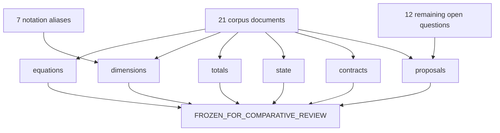

# Qwen3.8-27B clean-sheet review (TASK-21)

Complete-map MTP behavior cited here is conditional on TASK-02's unverified analysis model.

> **Final status:** verified for mechanical first-fence/schema/key/count/flag consistency only; this is not independent semantic proof.

Phase 1 **consistency review and freeze record** of TASK-01 through TASK-20.
This is a review, not a selected runtime and not measurements. Prefill and
decode share **one** semantic graph (TASK-11) and **one** compiled artifact
(TASK-09 via TASK-17). They do **not** share one performance metric identity
(TASK-19). Quality methodology is shared (TASK-18). The primary object is
language+MTP **complete map** (135 node instances). Language-only is a
secondary row. Freeze records that the locked structure plus the catalogue of
unselected alternatives was mechanically consistency-checked. It is not
independent semantic proof. It does not select a CUDA
mapping, recipe map, or layout.

If any occupancy, MAC/byte, catalog id, node type, stage kind, recipe, mapping,
or selected-flag would disagree with TASK-01–20 or sitting `text_config`, the
earlier document wins and this review is wrong. Claims are labelled `OBSERVED`
(sitting `text_config` / inventory already established; TASK-16 \(N_w=32\),
\(N_{\text{bank}}=32\)), `MEASURED` (TASK-05 citations only:
`pooled_all.absmax=25.5`, `pooled_language_mtp.absmax=19.25`,
`pooled_vision.absmax=25.5`; no new payload stats), `DERIVED` (cross-document
key agreement, equation-tag presence, alias classification, freeze membership),
`HYPOTHESIS` (every remaining alternative usefulness; every unrun experiment
hypothesis — cited, not re-opened), or `UNKNOWN` (sitting-SKU numeric limits;
vision-encoder internals; unselected corpora/hardware).

## Authority

| Item | Value | Label |
| --- | --- | --- |
| Dossier | [`docs/architecture/tasks/TASK-21.md`](tasks/TASK-21.md) | — |
| Study plan | [`docs/architecture/plan.md`](plan.md) | OBSERVED evidence vocabulary |
| TASK-01 | [`model-inventory.md`](model-inventory.md) | OBSERVED occupancy |
| TASK-02 | [`model-semantics.md`](model-semantics.md) | DERIVED equations `\tag{1}`–`\tag{24}` |
| TASK-03 | [`dataflow.md`](dataflow.md) | DERIVED 52-ID DAG |
| TASK-04 | [`lifetime-and-state.md`](lifetime-and-state.md) | DERIVED state |
| TASK-05 | [`bf16-tensor-analysis.md`](bf16-tensor-analysis.md) | MEASURED distributions |
| TASK-06 | [`work-and-traffic.md`](work-and-traffic.md) | DERIVED MAC/byte |
| TASK-07 | [`numerical-sensitivity.md`](numerical-sensitivity.md) | DERIVED / HYPOTHESIS |
| TASK-08 | [`quantization-design-space.md`](quantization-design-space.md) | 22 recipes remain unselected |
| TASK-09 | [`runtime-format-design.md`](runtime-format-design.md) | artifact approaches remain unselected |
| TASK-10 | [`model-compiler-plan.md`](model-compiler-plan.md) | stages / profiles |
| TASK-11 | [`semantic-graph.md`](semantic-graph.md) | 6 types / 135 instances |
| TASK-12 | [`materialization-and-fusion.md`](materialization-and-fusion.md) | 22 fusion HYPOTHESIS |
| TASK-13 | [`decode-plan.md`](decode-plan.md) | nine stage kinds |
| TASK-14 | [`prefill-plan.md`](prefill-plan.md) | views remain unselected |
| TASK-15 | [`layout-strategy.md`](layout-strategy.md) | orderings / tiles |
| TASK-16 | [`cuda-hardware-model.md`](cuda-hardware-model.md) | SKU UNKNOWN |
| TASK-17 | [`cuda-design-space.md`](cuda-design-space.md) | 18 mappings remain unselected |
| TASK-18 | [`quantization-validation.md`](quantization-validation.md) | quality methodology |
| TASK-19 | [`performance-validation.md`](performance-validation.md) | performance methodology |
| TASK-20 | [`clean-sheet-architecture.md`](clean-sheet-architecture.md) / [`experiment-backlog.md`](experiment-backlog.md) | synthesis; freeze flag false |
| Config | [`.cache/authorities/qwen3.8-27b-transformers/config.json`](../../.cache/authorities/qwen3.8-27b-transformers/config.json) `text_config` | OBSERVED |
| Checker | [`scripts/check_clean_sheet_review.py`](../../scripts/check_clean_sheet_review.py) | DERIVED |
| In scope | Language+MTP consistency review + freeze mark in this document | — |
| Deferred | Vision encoder; selected winners; executed experiments; executed comparative review | — |
| Scope of this document | Review and freeze record — not a selected runtime and not measurements | — |

Numeric ranks instantiate sitting `text_config` OBSERVED: `hidden_size` 5120,
`intermediate_size` 17408, `vocab_size` 248320, 64 decoder layers, 48 linear +
16 full at indices `[3, 7, 11, 15, 19, 23, 27, 31, 35, 39, 43, 47, 51, 55, 59, 63]`,
`mtp_num_hidden_layers` 1, `dtype` `"bfloat16"`, `mamba_ssm_dtype` `"float32"`,
`max_position_embeddings` \(T_{\text{ctx max}}=262144\). Inventory OBSERVED:
1199 tensors, 27781427952 parameters, 55562855904 bytes. Language+MTP occupancy
is 27320697856 parameters / 54641395712 BF16 bytes (OBSERVED). Unique non-embed
weight bytes are 52098598912 (TASK-06). Complete map: 135 node instances.
MAC citations (DERIVED, TASK-06): \(C_\text{complete}=27433238528\),
\(A_\text{complete}=208896\); T=1 decode = T=1 prefill MAC \(27433447424\);
T=4096 decode \(28288876544\); T=4096 prefill \(114119319486464\).

## Review convention

Logical values in this document are graph nodes. They do not imply physical allocation, materialization, buffer reuse, or kernel fusion.

This document is a Phase 1 consistency review of TASK-01 through TASK-20, not a selected runtime and not measurements.

True unknowns remain unknowns; consistency review does not select winners or close experiment questions.

The reviewed design is marked FROZEN_FOR_COMPARATIVE_REVIEW; existing runtimes are not thereby design authority.

Cross-document first-fence schemas, keys, counts, and flags are mechanically checked; this is not independent semantic proof; true unknowns are preserved; the reviewed design is marked FROZEN_FOR_COMPARATIVE_REVIEW.

JSON: `canonical_sentence_logical` = sentence 1; `canonical_sentence_review` = sentence 2; `canonical_sentence_unknowns` = sentence 3; `canonical_sentence_freeze` = sentence 4; `review_question_sentence` = the review sentence.

- Six check families are complete: `equations`, `dimensions`, `totals`, `state`, `contracts`, `proposals` (`n_check_families` 6).
- Twenty-one corpus documents (`n_corpus_documents` 21). Dossiers under `docs/architecture/tasks/` are process records, not correction corpus. `plan.md` is read-only authority, not corpus.
- Earlier-task authority wins on a locked fact (`earlier_task_wins` true).
- Notation aliases are not inconsistencies (`n_notation_aliases` 7; `n_inconsistencies_found` 0; `n_inconsistencies_corrected` 0).
- TASK-20 freeze flag stays false (`synthesis_frozen_flag` false; `freeze_recorded_in_review_only` true).
- Draft-status banners on TASK-01–20 deliverables stay (`draft_banners_left_in_place` true).
- `FROZEN_FOR_COMPARATIVE_REVIEW` is this document (`frozen_for_comparative_review` true).
- Freeze authorizes a **later** comparative review (`freeze_authorizes_later_comparative_review` true) and does **not** make existing runtimes design authority (`freeze_makes_existing_runtimes_design_authority` false). Comparative review is not executed here (`comparative_review_executed_here` false).
- No MEASURED NLL or tok/s in this document (`experiments_run` false; `nll_measured_here` false; `toks_measured_here` false).
- Tok/s is not a quality axis (`toks_is_not_quality_axis` true). Reconstruction is not quality (`reconstruction_is_not_quality` true).
- Microbenchmarks cannot pass a mapping (`microbenchmark_cannot_pass_mapping` true).
- Q4_K_M is a future black-box Pareto reference, not a requirement (`gguf_is_pareto_reference` true; `gguf_is_not_a_requirement` true).
- Primary coverage includes MTP (135 instances). Language-only is secondary.
- `example_T_values` `[1, 4096]` remain illustration horizons, not a selected prompt matrix.
- No payload re-stream (`payloads_restreamed` false). Do not run `scripts/analyze_bf16_tensors.py`.

## Corpus and check families

JSON array `corpus_paths` in this exact order (21 paths). JSON `n_corpus_documents` = 21. JSON object `corpus_task_ids` keyed by those paths. Completes ledger checkbox 1.

| path | task | check families |
| --- | --- | --- |
| `docs/architecture/model-inventory.md` | TASK-01 | dimensions, totals |
| `docs/architecture/model-semantics.md` | TASK-02 | equations, dimensions |
| `docs/architecture/dataflow.md` | TASK-03 | dimensions, state, contracts |
| `docs/architecture/lifetime-and-state.md` | TASK-04 | dimensions, state |
| `docs/architecture/bf16-tensor-analysis.md` | TASK-05 | dimensions, totals |
| `docs/architecture/work-and-traffic.md` | TASK-06 | equations, dimensions, totals, state |
| `docs/architecture/numerical-sensitivity.md` | TASK-07 | equations, dimensions, contracts |
| `docs/architecture/quantization-design-space.md` | TASK-08 | dimensions, totals, proposals |
| `docs/architecture/runtime-format-design.md` | TASK-09 | dimensions, totals, proposals |
| `docs/architecture/model-compiler-plan.md` | TASK-10 | dimensions, totals, proposals |
| `docs/architecture/semantic-graph.md` | TASK-11 | dimensions, state, contracts |
| `docs/architecture/materialization-and-fusion.md` | TASK-12 | dimensions, state, proposals |
| `docs/architecture/decode-plan.md` | TASK-13 | dimensions, totals, state, contracts, proposals |
| `docs/architecture/prefill-plan.md` | TASK-14 | dimensions, totals, state, contracts, proposals |
| `docs/architecture/layout-strategy.md` | TASK-15 | dimensions, state, proposals |
| `docs/architecture/cuda-hardware-model.md` | TASK-16 | contracts, proposals |
| `docs/architecture/cuda-design-space.md` | TASK-17 | dimensions, state, contracts, proposals |
| `docs/architecture/quantization-validation.md` | TASK-18 | dimensions, totals, proposals |
| `docs/architecture/performance-validation.md` | TASK-19 | dimensions, totals, contracts, proposals |
| `docs/architecture/clean-sheet-architecture.md` | TASK-20 | all six (synthesis citations) |
| `docs/architecture/experiment-backlog.md` | TASK-20 | contracts, proposals |

JSON array `check_family_ids` in this exact order (6 ids). JSON `n_check_families` = 6. Equation lock: JSON `n_equation_tags` = 24, `equation_tag_start` = 1, `equation_tag_end` = 24. `\tag{1}` through `\tag{24}` are present in `model-semantics.md`. TASK-06 and TASK-07 cite TASK-02.

| id | What is checked | Authority |
| --- | --- | --- |
| `equations` | `\tag{1}` … `\tag{24}` in `model-semantics.md`; TASK-06/07 cite TASK-02 | TASK-02 |
| `dimensions` | occupancy integers and `full_attention_indices` vs sitting `text_config` and across fences | TASK-01 / config |
| `totals` | parameter/byte/MAC/MEASURED absmax integers across fences | TASK-01 / TASK-05 / TASK-06 |
| `state` | catalog ids, KV/\(C\)/\(S\) bytes, \(B_\text{store}\) coefficients | TASK-03 / TASK-04 |
| `contracts` | node types, stage kinds, 135 instances, selected-flags false | TASK-11 / TASK-13 / TASK-14 |
| `proposals` | 22 recipes, 22 fusions, 18 mappings, 17 SKU symbols, 12 `oq_*` still open | TASK-08 / TASK-12 / TASK-16 / TASK-17 / TASK-20 |

Cited occupancy/state/contracts (not a new study): `n_catalog_nodes` 52; catalog ids `token_id`, `e`, `h`, `h_tilde`, `h_mid`, `h_post`, `h_64`, `h_final`, `logits_0`, `u_q`, `q_prime`, `g`, `k_raw`, `v_full`, `q_n`, `k_n`, `q_rope`, `k_rope`, `attn`, `y_gate`, `mix_full`, `K_state`, `V_state`, `qkv`, `z`, `a`, `b`, `c_tilde`, `c`, `q_lin`, `k_lin`, `v_lin`, `q_hat`, `k_hat`, `alpha`, `beta`, `S`, `o`, `u_gdn`, `mix_lin`, `C_state`, `g_mlp`, `up`, `swiglu`, `mlp_out`, `e_next`, `e_next_n`, `h64_n`, `mtp_cat`, `mtp_u`, `h_mtp`, `logits_1`; `n_full_layers_with_kv` 17; `kv_bytes_all_per_token` 69632; `storage_kv_bytes_coeff_T` 69632; `storage_fixed_bytes` 153944064; `s_bytes_all` 150994944; `c_bytes_all` 2949120; node types `embed`, `gated_attn`, `gated_delta_net`, `mlp`, `lm_head`, `mtp_mix`; stage kinds `embed_current`, `language_mixer`, `language_mlp`, `lm_head_primary`, `embed_next`, `mtp_mix`, `mtp_mixer`, `mtp_mlp`, `lm_head_mtp`; SKU UNKNOWN symbols `N_SM`, `W_max`, `S_reg`, `C_smem`, `T_max`, `B_max`, `N_bar`, `N_sched`, `G_reg`, `G_smem`, `Beta_HBM`, `Pi_FMA`, `Pi_TC`, `L_issue`, `async_copy_cap`, `mma_shapes`, `cluster_cap`. `N_w` / `N_bank` 32 / 32 (OBSERVED, TASK-16). 125 catalogued alternatives; 0 selected.

## Cross-document findings

Live first-JSON-fence comparison of all twenty-one corpus documents found **zero** documentation inconsistencies (`n_inconsistencies_found` 0; `n_inconsistencies_corrected` 0; `inconsistency_ids` `[]`). Completes ledger checkbox 2 (correct: none needed). Shared occupancy, MAC, catalog ids, node/stage/recipe/mapping/fusion lists, and named selected-flags agree. Seven notation aliases are preserved; listing an alias is not selecting a winner and not “correcting” TASK-01 `BF16` to `bfloat16`. Draft-status `unverified` banners on TASK-01–20 deliverables remain (`draft_banners_left_in_place` true); they are process artifacts, not scientific contradictions. [`clean-sheet-architecture.md`](clean-sheet-architecture.md) and [`experiment-backlog.md`](experiment-backlog.md) first fences are deep-equal and still have `frozen_for_comparative_review` false.

JSON array `notation_alias_ids` in this exact order (7 ids). JSON `n_notation_aliases` = 7. JSON `alternative_usefulness_label` exactly `HYPOTHESIS`.

| id | Surfaces | Disposition |
| --- | --- | --- |
| `alias_dtype_bf16_bfloat16` | TASK-01/05 fence `dtype` `BF16`; config / TASK-19/20 `dtype` `bfloat16` | preserve; safetensor header vs config string |
| `alias_tmax_model_vs_sku` | TASK-07 `T_max` 262144; TASK-16 SKU id `T_max` UNKNOWN; TASK-19/20 `model_T_max` 262144 | preserve; TASK-19 already documented the collision |
| `alias_authority_checkpoint_vs_plan` | most fences `authority` checkpoint path; TASK-16/19/20 `docs/architecture/plan.md` | preserve; occupancy vs study authority |
| `alias_n_decoder_layers_num_hidden_layers` | `n_decoder_layers` vs TASK-02 `num_hidden_layers`; both 64 | preserve |
| `alias_n_mtp_blocks_mtp_num_hidden_layers` | `n_mtp_blocks` vs TASK-02 `mtp_num_hidden_layers`; both 1 | preserve |
| `alias_n_kv_heads_num_key_value_heads` | `n_kv_heads` vs TASK-02 `num_key_value_heads`; both 4 | preserve |
| `alias_warp_n_w_n_bank` | TASK-16 `warp_size` / `n_bank` vs TASK-20 `N_w` / `N_bank`; all 32 | preserve |

Review coverage: 21 corpus documents, 6 check families, 7 notation aliases, 0 inconsistencies found, 12 remaining open questions (0 closed). OPENQ are preserved true unknowns. Freeze does not select winners or make existing runtimes design authority. Alternative usefulness remains HYPOTHESIS. The mark is FROZEN_FOR_COMPARATIVE_REVIEW in this review only.



JSON `n_diagrams` is 1. `diagram_ids` is `["corpus","eq","dim","tot","state","contract","prop","alias","openq","freeze"]`.

## Preserved unknowns

JSON array `remaining_open_question_ids` in this exact order (12 ids). JSON `n_remaining_open_questions` = 12. JSON `n_remaining_open_questions_closed` = 0. JSON `ledger_open_question_unknowns_preserved` true. Completes ledger checkbox 2 (preserve true unknowns).

Preserving these ids is the TASK-21 answer to “genuine unresolved architectural questions retained after consistency review.” Freeze does not close them.

| ID | Source | Still unselected |
| --- | --- | --- |
| `oq_risk_survival` | TASK-07 / TASK-18 | which sensitive-op hypotheses survive |
| `oq_pareto_frontier` | TASK-08 / TASK-18 | bit widths / grouping / scales / outliers / profile maps |
| `oq_artifact_boundary` | TASK-09 | portable vs backend-specialized vs dual-view |
| `oq_ideal_byte_sequence` | TASK-09 | which of seven consumer sequences |
| `oq_integrity_algorithm` | TASK-10 | `none` vs `checksum` |
| `oq_fusion_winner` | TASK-12 / TASK-13 | 22 fusion + 5 hoist |
| `oq_decode_prefill_views` | TASK-14 | four representation + two mode hypotheses |
| `oq_parallel_decomposition` | TASK-15 | which decompositions justify orderings/tiles |
| `oq_sku_limits` | TASK-16 | 17 sitting-SKU symbols |
| `oq_mapping_winner` | TASK-17 | 18 mappings after benchmarks |
| `oq_eval_corpora` | TASK-18 | four corpus classes, prompt suite, capability, acceptance frontier |
| `oq_hardware_protocol` | TASK-19 | hardware, prompt matrix, reproducibility protocol |

## Freeze

The reviewed design is marked **FROZEN_FOR_COMPARATIVE_REVIEW**. Completes ledger checkbox 3. JSON `frozen_for_comparative_review` true. JSON `freeze_authorizes_later_comparative_review` true. JSON `freeze_makes_existing_runtimes_design_authority` false. JSON `freeze_recorded_in_review_only` true. JSON `synthesis_frozen_flag` false. JSON `comparative_review_executed_here` false.

Existing Quartz and llama.cpp/GGML Qwen implementations are not design authority by this freeze; they may be compared later as black-box references with matching identities.

After this mark, a subsequent study may inspect those runtimes. This increment does not. `quartz_inspected` false; `llama_inspected` false. GGUF remains a named future black-box Pareto reference, not a requirement (`gguf_is_pareto_reference` true; `gguf_is_not_a_requirement` true; `gguf_payload_inspected` false). No NLL, tok/s, Nsight, `deviceQuery`, SKU fill, or payload re-stream was run (`experiments_run` false; `benchmarks_run` false; `sku_table_filled` false; `payloads_restreamed` false). Mapping / recipe / fusion winners remain unselected (`mapping_winner_selected` false; `pareto_frontier_selected` false; `fusion_winner_selected` false; `n_alternatives_selected` 0; `winner_selected_without_measurements` false). Reconstruction is not quality. Microbenchmarks cannot pass a mapping. Tok/s is not a quality axis.

## Deferred vision

Vision-encoder internals remain `UNKNOWN` and out of the primary map. Residual-stream interface only. JSON `vision_eval_deferred` true. No vision payload re-stream. Safetensors is the source checkpoint, not a runtime (`safetensors_is_source_not_runtime` true).

## Machine-checkable summary JSON

Live object from sitting `text_config`, locked constants, and first JSON fences of the twenty-one corpus documents. First fenced `json` block must equal a fresh checker `--json` run.

```json
{
  "authority": "docs/architecture/plan.md",
  "deliverable_review": "docs/architecture/clean-sheet-review.md",
  "hidden_size": 5120,
  "intermediate_size": 17408,
  "vocab_size": 248320,
  "n_decoder_layers": 64,
  "n_linear_layers": 48,
  "n_full_layers": 16,
  "n_mtp_blocks": 1,
  "full_attention_indices": [
    3,
    7,
    11,
    15,
    19,
    23,
    27,
    31,
    35,
    39,
    43,
    47,
    51,
    55,
    59,
    63
  ],
  "model_T_max": 262144,
  "dtype": "bfloat16",
  "mamba_ssm_dtype": "float32",
  "n_tensors": 1199,
  "n_shards": 18,
  "n_parameters": 27781427952,
  "n_bytes": 55562855904,
  "n_language_mtp_parameters": 27320697856,
  "n_vision_parameters": 460730096,
  "n_language_mtp_tensors": 866,
  "n_vision_tensors": 333,
  "weight_bytes_language_mtp_excl_vision": 54641395712,
  "weight_bytes_unique_non_embed": 52098598912,
  "mac_C_complete": 27433238528,
  "mac_A_complete": 208896,
  "mac_decode_complete_T1": 27433447424,
  "mac_prefill_complete_T1": 27433447424,
  "mac_decode_complete_T4096": 28288876544,
  "mac_prefill_complete_T4096": 114119319486464,
  "example_T_values": [
    1,
    4096
  ],
  "N_w": 32,
  "N_bank": 32,
  "n_catalog_nodes": 52,
  "catalog_ids": [
    "token_id",
    "e",
    "h",
    "h_tilde",
    "h_mid",
    "h_post",
    "h_64",
    "h_final",
    "logits_0",
    "u_q",
    "q_prime",
    "g",
    "k_raw",
    "v_full",
    "q_n",
    "k_n",
    "q_rope",
    "k_rope",
    "attn",
    "y_gate",
    "mix_full",
    "K_state",
    "V_state",
    "qkv",
    "z",
    "a",
    "b",
    "c_tilde",
    "c",
    "q_lin",
    "k_lin",
    "v_lin",
    "q_hat",
    "k_hat",
    "alpha",
    "beta",
    "S",
    "o",
    "u_gdn",
    "mix_lin",
    "C_state",
    "g_mlp",
    "up",
    "swiglu",
    "mlp_out",
    "e_next",
    "e_next_n",
    "h64_n",
    "mtp_cat",
    "mtp_u",
    "h_mtp",
    "logits_1"
  ],
  "n_full_layers_with_kv": 17,
  "kv_bytes_all_per_token": 69632,
  "storage_kv_bytes_coeff_T": 69632,
  "storage_fixed_bytes": 153944064,
  "s_bytes_all": 150994944,
  "c_bytes_all": 2949120,
  "n_equation_tags": 24,
  "equation_tag_start": 1,
  "equation_tag_end": 24,
  "n_node_types": 6,
  "node_type_ids": [
    "embed",
    "gated_attn",
    "gated_delta_net",
    "mlp",
    "lm_head",
    "mtp_mix"
  ],
  "n_node_instances_complete": 135,
  "n_stage_kinds": 9,
  "stage_kind_ids": [
    "embed_current",
    "language_mixer",
    "language_mlp",
    "lm_head_primary",
    "embed_next",
    "mtp_mix",
    "mtp_mixer",
    "mtp_mlp",
    "lm_head_mtp"
  ],
  "n_candidate_recipes": 22,
  "n_fusion_hypotheses": 22,
  "n_mappings": 18,
  "n_sku_unknown_symbols": 17,
  "sku_unknown_symbols": [
    "N_SM",
    "W_max",
    "S_reg",
    "C_smem",
    "T_max",
    "B_max",
    "N_bar",
    "N_sched",
    "G_reg",
    "G_smem",
    "Beta_HBM",
    "Pi_FMA",
    "Pi_TC",
    "L_issue",
    "async_copy_cap",
    "mma_shapes",
    "cluster_cap"
  ],
  "n_sensitive_ops": 21,
  "n_catalogued_alternatives": 125,
  "pooled_all_absmax": 25.5,
  "pooled_language_mtp_absmax": 19.25,
  "pooled_vision_absmax": 25.5,
  "n_corpus_documents": 21,
  "corpus_paths": [
    "docs/architecture/model-inventory.md",
    "docs/architecture/model-semantics.md",
    "docs/architecture/dataflow.md",
    "docs/architecture/lifetime-and-state.md",
    "docs/architecture/bf16-tensor-analysis.md",
    "docs/architecture/work-and-traffic.md",
    "docs/architecture/numerical-sensitivity.md",
    "docs/architecture/quantization-design-space.md",
    "docs/architecture/runtime-format-design.md",
    "docs/architecture/model-compiler-plan.md",
    "docs/architecture/semantic-graph.md",
    "docs/architecture/materialization-and-fusion.md",
    "docs/architecture/decode-plan.md",
    "docs/architecture/prefill-plan.md",
    "docs/architecture/layout-strategy.md",
    "docs/architecture/cuda-hardware-model.md",
    "docs/architecture/cuda-design-space.md",
    "docs/architecture/quantization-validation.md",
    "docs/architecture/performance-validation.md",
    "docs/architecture/clean-sheet-architecture.md",
    "docs/architecture/experiment-backlog.md"
  ],
  "corpus_task_ids": {
    "docs/architecture/model-inventory.md": "TASK-01",
    "docs/architecture/model-semantics.md": "TASK-02",
    "docs/architecture/dataflow.md": "TASK-03",
    "docs/architecture/lifetime-and-state.md": "TASK-04",
    "docs/architecture/bf16-tensor-analysis.md": "TASK-05",
    "docs/architecture/work-and-traffic.md": "TASK-06",
    "docs/architecture/numerical-sensitivity.md": "TASK-07",
    "docs/architecture/quantization-design-space.md": "TASK-08",
    "docs/architecture/runtime-format-design.md": "TASK-09",
    "docs/architecture/model-compiler-plan.md": "TASK-10",
    "docs/architecture/semantic-graph.md": "TASK-11",
    "docs/architecture/materialization-and-fusion.md": "TASK-12",
    "docs/architecture/decode-plan.md": "TASK-13",
    "docs/architecture/prefill-plan.md": "TASK-14",
    "docs/architecture/layout-strategy.md": "TASK-15",
    "docs/architecture/cuda-hardware-model.md": "TASK-16",
    "docs/architecture/cuda-design-space.md": "TASK-17",
    "docs/architecture/quantization-validation.md": "TASK-18",
    "docs/architecture/performance-validation.md": "TASK-19",
    "docs/architecture/clean-sheet-architecture.md": "TASK-20",
    "docs/architecture/experiment-backlog.md": "TASK-20"
  },
  "n_check_families": 6,
  "check_family_ids": [
    "equations",
    "dimensions",
    "totals",
    "state",
    "contracts",
    "proposals"
  ],
  "n_notation_aliases": 7,
  "notation_alias_ids": [
    "alias_dtype_bf16_bfloat16",
    "alias_tmax_model_vs_sku",
    "alias_authority_checkpoint_vs_plan",
    "alias_n_decoder_layers_num_hidden_layers",
    "alias_n_mtp_blocks_mtp_num_hidden_layers",
    "alias_n_kv_heads_num_key_value_heads",
    "alias_warp_n_w_n_bank"
  ],
  "n_inconsistencies_found": 0,
  "n_inconsistencies_corrected": 0,
  "inconsistency_ids": [],
  "n_remaining_open_questions": 12,
  "remaining_open_question_ids": [
    "oq_risk_survival",
    "oq_pareto_frontier",
    "oq_artifact_boundary",
    "oq_ideal_byte_sequence",
    "oq_integrity_algorithm",
    "oq_fusion_winner",
    "oq_decode_prefill_views",
    "oq_parallel_decomposition",
    "oq_sku_limits",
    "oq_mapping_winner",
    "oq_eval_corpora",
    "oq_hardware_protocol"
  ],
  "n_remaining_open_questions_closed": 0,
  "n_sibling_checkers": 19,
  "sibling_checker_scripts": [
    "scripts/inventory_bf16_checkpoint.py",
    "scripts/check_model_semantics.py",
    "scripts/check_dataflow.py",
    "scripts/check_lifetime_and_state.py",
    "scripts/check_work_and_traffic.py",
    "scripts/check_numerical_sensitivity.py",
    "scripts/check_quantization_design_space.py",
    "scripts/check_runtime_format_design.py",
    "scripts/check_model_compiler_plan.py",
    "scripts/check_semantic_graph.py",
    "scripts/check_materialization_and_fusion.py",
    "scripts/check_decode_plan.py",
    "scripts/check_prefill_plan.py",
    "scripts/check_layout_strategy.py",
    "scripts/check_cuda_hardware_model.py",
    "scripts/check_cuda_design_space.py",
    "scripts/check_quantization_validation.py",
    "scripts/check_performance_validation.py",
    "scripts/check_clean_sheet_architecture.py"
  ],
  "n_review_headings": 8,
  "review_headings": [
    "Authority",
    "Review convention",
    "Corpus and check families",
    "Cross-document findings",
    "Preserved unknowns",
    "Freeze",
    "Deferred vision",
    "Machine-checkable summary JSON"
  ],
  "n_headings": 8,
  "n_diagrams": 1,
  "diagram_ids": [
    "corpus",
    "eq",
    "dim",
    "tot",
    "state",
    "contract",
    "prop",
    "alias",
    "openq",
    "freeze"
  ],
  "earlier_task_wins": true,
  "ledger_open_question_unknowns_preserved": true,
  "frozen_for_comparative_review": true,
  "synthesis_frozen_flag": false,
  "freeze_recorded_in_review_only": true,
  "freeze_authorizes_later_comparative_review": true,
  "freeze_makes_existing_runtimes_design_authority": false,
  "comparative_review_executed_here": false,
  "draft_banners_left_in_place": true,
  "pareto_frontier_selected": false,
  "fusion_winner_selected": false,
  "mapping_winner_selected": false,
  "winner_selected_without_measurements": false,
  "n_alternatives_selected": 0,
  "sku_table_filled": false,
  "keep_source_is_not_quality_winner": true,
  "reconstruction_is_not_quality": true,
  "toks_is_not_quality_axis": true,
  "microbenchmark_cannot_pass_mapping": true,
  "experiments_run": false,
  "nll_measured_here": false,
  "toks_measured_here": false,
  "benchmarks_run": false,
  "payloads_restreamed": false,
  "gguf_payload_inspected": false,
  "gguf_is_not_design_authority": true,
  "gguf_is_pareto_reference": true,
  "gguf_is_not_a_requirement": true,
  "quartz_inspected": false,
  "llama_inspected": false,
  "llama_is_not_design_authority": true,
  "device_query_run": false,
  "nsight_run": false,
  "vision_eval_deferred": true,
  "safetensors_is_source_not_runtime": true,
  "alternative_usefulness_label": "HYPOTHESIS",
  "canonical_sentence_logical": "Logical values in this document are graph nodes. They do not imply physical allocation, materialization, buffer reuse, or kernel fusion.",
  "canonical_sentence_review": "This document is a Phase 1 consistency review of TASK-01 through TASK-20, not a selected runtime and not measurements.",
  "canonical_sentence_unknowns": "True unknowns remain unknowns; consistency review does not select winners or close experiment questions.",
  "canonical_sentence_freeze": "The reviewed design is marked FROZEN_FOR_COMPARATIVE_REVIEW; existing runtimes are not thereby design authority.",
  "review_question_sentence": "Cross-document first-fence schemas, keys, counts, and flags are mechanically checked; this is not independent semantic proof; true unknowns are preserved; the reviewed design is marked FROZEN_FOR_COMPARATIVE_REVIEW.",
  "freeze_non_authority_sentence": "Existing Quartz and llama.cpp/GGML Qwen implementations are not design authority by this freeze; they may be compared later as black-box references with matching identities."
}
```
