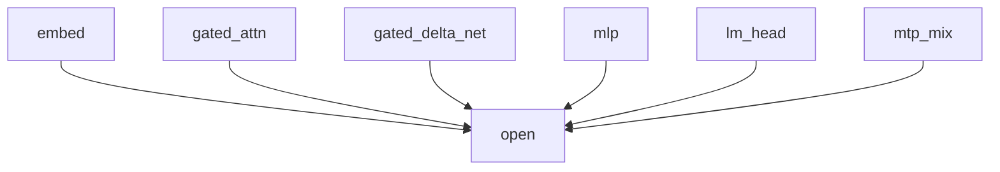

# CUDA design space

> **Draft status:** conclusions in this document are **unverified** until the verification stage completes.

Phase 1 **CUDA mapping experiment space** for Qwen3.8-27B language+MTP:
multiple plausible **ownership and reduction** alternatives for every
TASK-11 semantic node type, with TASK-16 evaluation algebra instantiated
symbolically and TASK-15 candidate layouts attached as unselected
experiment bindings. Prefill and decode share **one** semantic graph and
**one** compiled artifact; this document maps **both** schedule consumers.
Distinct views remain unselected. This document specifies a **CUDA mapping
experiment space**, not selected kernels and not measured winners.

If a node type, stage kind, layout object, parallel decomposition, MAC/byte,
formula, or SKU symbol would disagree with TASK-11/13/14/15/16 or sitting
`text_config`, the earlier document / config wins and this one is wrong.

Claims are labelled `OBSERVED` (sitting `text_config` / inventory already
established; TASK-16 published identities \(N_w=32\), \(N_{\text{bank}}=32\)),
`DERIVED` (MAC/byte citations and occupancy/intensity algebra instantiated
from locked ranks and F1–F14), `HYPOTHESIS` (every mapping **usefulness**,
every mode-fit, every coalescing/bank-conflict **usefulness**, every fusion
\(\Delta I\) vs \(\Delta O\) sign, every layout-decomposition
**justification**), or `UNKNOWN` (sitting-SKU numeric limits and optional
capabilities `async_copy_cap`, `mma_shapes`, `cluster_cap`; vision-encoder
internals). No `MEASURED` tok/s, occupancy, or NLL.

## Authority

| Item | Value | Label |
| --- | --- | --- |
| Dossier | [`docs/architecture/tasks/TASK-17.md`](tasks/TASK-17.md) | — |
| Semantic graph | [`docs/architecture/semantic-graph.md`](semantic-graph.md) (TASK-11) | six node types, 135 instances |
| Decode plan | [`docs/architecture/decode-plan.md`](decode-plan.md) (TASK-13) | GEMV consumers, nine `stage_kind_ids` |
| Prefill plan | [`docs/architecture/prefill-plan.md`](prefill-plan.md) (TASK-14) | GEMM consumers, five differences |
| Layout strategy | [`docs/architecture/layout-strategy.md`](layout-strategy.md) (TASK-15) | orderings, tiles, decompositions |
| CUDA hardware model | [`docs/architecture/cuda-hardware-model.md`](cuda-hardware-model.md) (TASK-16) | F1–F14, SKU-UNKNOWN, criteria |
| Inventory | [`docs/architecture/model-inventory.md`](model-inventory.md) (TASK-01) via those docs | OBSERVED |
| Config | [`.cache/authorities/qwen3.8-27b-transformers/config.json`](../../.cache/authorities/qwen3.8-27b-transformers/config.json) `text_config` | OBSERVED |
| Checker | [`scripts/check_cuda_design_space.py`](../../scripts/check_cuda_design_space.py) | DERIVED |
| Evidence policy | [`docs/architecture/plan.md`](plan.md) (OBSERVED / DERIVED / HYPOTHESIS / UNKNOWN) | OBSERVED |
| In scope | Language+MTP per-node CUDA ownership/reduction alternatives; six-way estimates; TASK-16 criteria instantiation; TASK-15 layout attachments | — |
| Deferred | Vision encoder; TASK-19 measurements; sitting SKU table | — |
| Scope of this document | CUDA mapping experiment space — not selected kernels and not measured winners | — |

Numeric ranks instantiate sitting `text_config` OBSERVED: `hidden_size`
5120, `intermediate_size` 17408, `vocab_size` 248320, 64 decoder layers,
48 linear + 16 full at \(\ell \bmod 4 = 3\), `mtp_num_hidden_layers` 1,
`head_dim` 256, `num_attention_heads` 24, `num_key_value_heads` 4, GQA
\(g_\text{qa}=6\), `linear_key_head_dim` / `linear_value_head_dim` 128,
`linear_num_value_heads` 48, `linear_conv_kernel_dim` 4,
\(d_\text{qkv}=10240\), `dtype` `"bfloat16"`, `mamba_ssm_dtype`
`"float32"`. Instance counts DERIVED: 2 `embed`, 17 `gated_attn`, 48
`gated_delta_net`, 65 `mlp`, 2 `lm_head`, 1 `mtp_mix` (135 complete).
Mapping **usefulness** remains HYPOTHESIS. Sitting SKU limits remain
UNKNOWN.

Quartz and llama.cpp inspection are deferred until freeze. GGUF is not
the runtime format. Safetensors is the source checkpoint, not the runtime
artifact.

## Mapping convention

Logical values in this document are graph nodes. They do not imply physical allocation, materialization, buffer reuse, or kernel fusion.

CUDA mappings in this document are ownership and reduction alternatives per semantic node, not selected kernels and not measured winners.

Occupancy, intensity, and roofline figures in this document instantiate TASK-16 algebra with symbolic SKU limits; they are not sitting-device measurements.

Which mappings win on target hardware and profiles remains open until TASK-19 measurements.

This document selects no CUDA mapping winner.

Instantiating a TASK-15 parallel decomposition as a CUDA ownership axis does not select a layout and does not justify an ordering or tile.

JSON: `canonical_sentence_logical` = sentence 1; `canonical_sentence_mappings`
= sentence 2; `canonical_sentence_symbolic` = sentence 3;
`canonical_sentence_open_question` = sentence 4;
`canonical_sentence_winner` = sentence 5; `canonical_sentence_layout` =
the layout sentence. Sentence 4 **keeps** the ledger open question
unresolved in checker-substring form. JSON
`ledger_open_question_mapping_winner_closed` false. Sentence 5 **closes**
the third completion criterion as a prohibition, not as a selected
mapping. JSON `parallel_decomposition_justifies_layout_selected` false.
JSON `mma_decomposition_named` true. JSON `mma_tile_extents_selected`
false.

- Six semantic node types are complete for this task (`n_node_types` 6).
  Eighteen mappings are complete (`n_mappings` 18); three per type
  (`n_mappings_per_node` 3).
- A mapping is a named ownership + reduction alternative of one node type
  with hypothesized \((R_t,C_{\text{cta}},T_{\text{cta}})\), sync class,
  pipeline mix, and six estimate dimensions. Listing a mapping is not
  selecting it (`n_mappings_selected` 0, `mapping_winner_selected` false).
- Estimate dimensions are complete: work, storage, access, synchronization,
  occupancy, `mode_suitability` (`n_estimate_dimensions` 6).
- TASK-16 evaluation criteria are instantiated (`n_evaluation_criteria` 7)
  and not measured (`evaluation_measured` false).
- Prefill and decode share one graph and one artifact; distinct views
  remain unselected (`decode_prefill_distinct_views_selected` false).
- Activations are out of layout scope (`activations_in_layout_scope`
  false). Register/shared footprints are occupancy symbols
  (`activation_live_is_occupancy_symbol` true).
- Unique weights are counted once (`weight_unique_counted_once` true).
- Fan-out ≠ must-store and logical ≠ physical still hold.
- Primary coverage includes MTP (135 instances). Fusion winners remain
  TASK-12/13/14 hypotheses. Ideal byte sequence remains TASK-09 open.
  TASK-15 orderings/tiles remain unselected. Sitting SKU limits remain
  UNKNOWN.
- Thread/warp/CTA/grid **ownership** is named (`thread_geometry_absent`
  false). No launch config is selected (`launch_config_selected` false).
- No mapping winner (`mapping_winner_selected` false).

A CUDA mapping is not a kernel binary, not a CUDA graph, and not a
selected launch. Hypothesized \(T_{\text{cta}}\) candidates are
warp-multiple thread counts, not a selected block size. Unique weight
bytes are counted **once** per complete decode/prefill. Mapping does not
restream the model (`payloads_restreamed` false). Algebraic equivalents
in TASK-02 remain the same real map: GQA-as-repeat does **not** store
repeated KV; paper \(S^\top\) (19) is the same map as (17)–(18);
chunkwise GDN is not zero \(S\) traffic; conv delay is 3 stored vectors.
\(T\) is stored length after append (`T_is_stored_length_after_append`
true); example lengths `[1, 4096]`.

## Mapping vocabulary

JSON array `ownership_ids` in this exact order (4 ids). JSON
`n_ownership_classes` = 4. These are TASK-16 concept ids. Do not add
`thread_block_cluster` as an ownership class (`cluster_cap` is `UNKNOWN`;
`cluster_assumed_present` false). `block` is an alias of `cta` (TASK-16);
ownership uses `cta` only.

| id | TASK-16 concept | Owns |
| --- | --- | --- |
| `thread` | `thread` | one output element or one inner-loop step |
| `warp` | `warp` | \(N_w=32\) lanes issued together |
| `cta` | `cta` | one thread block; domain of `syncthreads` |
| `grid` | `grid` | one kernel launch; no CTA barrier across blocks |

JSON array `reduction_ids` in this exact order (5 ids). JSON
`n_reduction_classes` = 5.

| id | Meaning | Sync implied |
| --- | --- | --- |
| `red_none` | owner writes complete outputs; no partial reduction | `sync_none` or local barrier only |
| `red_warp` | warp shuffle / `warp_sync` reduction of partials | `sync_warp` |
| `red_cta` | shared-memory reduction across the CTA | `sync_cta` |
| `red_splitk_cta` | split along a contraction axis; CTA reduces partials | `sync_cta` |
| `red_grid` | grid-wide reduction (atomics or cooperative groups) | `sync_grid`; capability `UNKNOWN` |

JSON `red_grid_requires_cooperative_or_atomics` true. JSON
`n_mappings_using_red_grid` = 0. JSON `red_grid_selected` false.
Grid-wide reduction is named as unselected variant hypothesis
`var_splitk_grid` (heading 9), not as a nineteenth mapping.

JSON array `estimate_dimension_ids` in this exact order (6 ids). JSON
`n_estimate_dimensions` = 6: `work`, `storage`, `access`,
`synchronization`, `occupancy`, `mode_suitability`.

JSON array `sync_class_ids` in this exact order (5 ids). JSON
`n_sync_classes` = 5. These instantiate TASK-16 evaluation criterion 5:

`sync_none`, `sync_warp`, `sync_cta`, `sync_grid`, `sync_stream_event`.

Map to TASK-16: none / `warp_sync` / `syncthreads` / grid-cooperative /
`stream`+`event`. JSON `sync_grid_requires_cooperative` true. No mapping
uses `sync_grid` as a selected class (`n_mappings_using_sync_grid` 0).
`map_mlp_grid_T` and `map_mtp_split_norm_gemm` use `sync_stream_event`
(independent CTAs joined by stream/event), not grid-cooperative.

JSON array `pipeline_ids` in this exact order (6 ids). JSON
`n_pipeline_ids` = 6. TASK-16 instruction families:

`fma`, `ffma`, `load_store`, `tensor_core_mma`, `async_gmem_to_smem`,
`tma`.

JSON `async_copy_optional` true. Do not assume TMA exists
(`tma_assumed_present` false). Do not pick `mma` vs `wgmma` vs later PTX
variants. `tensor_core_mma` is the hypothesized MMA family; legal shapes
stay `UNKNOWN` (`mma_shapes`).

JSON array `cta_T_candidates` `[32, 64, 128, 256]`. JSON
`n_cta_T_candidates` = 4. JSON `n_cta_T_selected` = 0. These are
hypothesized threads-per-CTA and **must** be multiples of \(N_w=32\)
(DERIVED from TASK-16 F7). They are not TASK-15 tile extents (those
remain layout candidates). Naming 256 is not selecting it. JSON
`cta_T_all_multiples_of_warp` true.

JSON array `mode_fit_ids` in this exact order (3 ids). JSON
`n_mode_fit_ids` = 3: `decode_primary`, `prefill_primary`, `both`. JSON
`mode_suitability_label` exactly `HYPOTHESIS`. JSON
`n_mode_winners_selected` = 0. A `decode_primary` label is hypothesized
fit, not a prohibition on prefill use.

JSON array `consumer_mode_ids` `["decode_gemv","prefill_gemm"]` (TASK-15).
JSON `n_consumer_modes` = 2. JSON `n_consumer_modes_selected` = 0.

JSON `N_w` = 32. JSON `N_bank` = 32. JSON `sku_unknown_symbols` exactly
the TASK-16 list of 17 ids. JSON `sku_policy` exactly
`parameterized_unknown_until_measured_table`. Do not instantiate any of
those 17 with a datasheet or sitting-GPU number.

| Symbol | JSON id | Status |
| --- | --- | --- |
| \(N_w\) | `N_w` | OBSERVED \(=32\) |
| \(N_{\text{bank}}\) | `N_bank` | OBSERVED \(=32\) |
| \(N_{\text{SM}}\) | `N_SM` | UNKNOWN |
| \(W_{\max}\) | `W_max` | UNKNOWN |
| \(S_{\text{reg}}\) | `S_reg` | UNKNOWN |
| \(C_{\text{smem}}\) | `C_smem` | UNKNOWN |
| \(T_{\max}\) | `T_max` | UNKNOWN |
| \(B_{\max}\) | `B_max` | UNKNOWN |
| \(N_{\text{bar}}\) | `N_bar` | UNKNOWN |
| \(N_{\text{sched}}\) | `N_sched` | UNKNOWN |
| \(G_{\text{reg}}\) | `G_reg` | UNKNOWN |
| \(G_{\text{smem}}\) | `G_smem` | UNKNOWN |
| \(\Beta\) | `Beta_HBM` | UNKNOWN |
| \(\Pi_{\text{FMA}}\) | `Pi_FMA` | UNKNOWN |
| \(\Pi_{\text{TC}}\) | `Pi_TC` | UNKNOWN |
| \(L_{\text{issue}}\) | `L_issue` | UNKNOWN |
| \(\texttt{async\_copy\_cap}\) | `async_copy_cap` | UNKNOWN |
| \(\texttt{mma\_shapes}\) | `mma_shapes` | UNKNOWN |
| \(\texttt{cluster\_cap}\) | `cluster_cap` | UNKNOWN |

## Per-node mapping alternatives

JSON array `node_type_ids` in TASK-11 order (6 ids): `embed`,
`gated_attn`, `gated_delta_net`, `mlp`, `lm_head`, `mtp_mix`. JSON
`n_node_types` = 6. JSON instance counts cited from TASK-11:
`n_embed_instances` 2, `n_gated_attn_instances` 17,
`n_gated_delta_net_instances` 48, `n_mlp_instances` 65,
`n_lm_head_instances` 2, `n_mtp_mix_instances` 1,
`n_node_instances_complete` 135.

JSON array `mapping_ids` in this exact order (18 ids). JSON `n_mappings`
= 18. JSON `n_mappings_per_node` = 3. JSON `n_mappings_selected` = 0.
JSON object `mapping_selected` keyed in that order with every value
`false`. JSON `mapping_usefulness_label` exactly `HYPOTHESIS`. Completes
ledger checkbox 1. Every usefulness cell below is HYPOTHESIS.

| id | Node | Ownership | Reduction | Sync | Primary pipeline | Mode fit |
| --- | --- | --- | --- | --- | --- | --- |
| `map_embed_thread_element` | `embed` | `thread` | `red_none` | `sync_none` | `load_store` | `both` |
| `map_embed_warp_row` | `embed` | `warp` | `red_none` | `sync_warp` | `load_store` | `both` |
| `map_embed_cta_vector` | `embed` | `cta` | `red_none` | `sync_cta` | `load_store` | `both` |
| `map_attn_cta_head` | `gated_attn` | `cta` | `red_none` | `sync_cta` | `fma` | `both` |
| `map_attn_warp_t` | `gated_attn` | `warp` | `red_warp` | `sync_warp` | `fma` | `decode_primary` |
| `map_attn_cta_splitk` | `gated_attn` | `cta` | `red_splitk_cta` | `sync_cta` | `fma` | `both` |
| `map_gdn_cta_head` | `gated_delta_net` | `cta` | `red_none` | `sync_cta` | `fma` | `both` |
| `map_gdn_warp_recurrent` | `gated_delta_net` | `warp` | `red_none` | `sync_warp` | `fma` | `decode_primary` |
| `map_gdn_cta_chunk` | `gated_delta_net` | `cta` | `red_cta` | `sync_cta` | `fma` | `prefill_primary` |
| `map_mlp_cta_dout` | `mlp` | `cta` | `red_none` | `sync_cta` | `fma` | `both` |
| `map_mlp_cta_splitk` | `mlp` | `cta` | `red_splitk_cta` | `sync_cta` | `fma` | `both` |
| `map_mlp_grid_T` | `mlp` | `grid` | `red_none` | `sync_none` | `tensor_core_mma` | `prefill_primary` |
| `map_lm_cta_vocab` | `lm_head` | `cta` | `red_none` | `sync_cta` | `fma` | `both` |
| `map_lm_cta_splitk` | `lm_head` | `cta` | `red_splitk_cta` | `sync_cta` | `fma` | `both` |
| `map_lm_warp_gemv` | `lm_head` | `warp` | `red_warp` | `sync_warp` | `fma` | `decode_primary` |
| `map_mtp_cta_fc` | `mtp_mix` | `cta` | `red_none` | `sync_cta` | `fma` | `both` |
| `map_mtp_cta_fused` | `mtp_mix` | `cta` | `red_none` | `sync_cta` | `fma` | `both` |
| `map_mtp_split_norm_gemm` | `mtp_mix` | `grid` | `red_none` | `sync_stream_event` | `load_store` | `both` |

JSON `n_decode_primary_mappings` = 3. JSON `n_prefill_primary_mappings` =
2. JSON `n_both_mode_mappings` = 13. Sum 18. Every node type has three
alternatives, at least two distinct `ownership_ids`, and at least two
distinct `reduction_ids` or `sync_class_ids`.

**`embed`.** Gather of shared \(E\); TASK-06 `mac_embed` 0;
`weight_gather_bytes_per_row` 10240. No RMS. No residual add. Three
alternatives differ by who issues the row copy (thread / warp / CTA).
Optional `async_gmem_to_smem` may attach to `map_embed_cta_vector` only
as HYPOTHESIS (`async_copy_cap` UNKNOWN). Hidden-major gather
(`ord_embed_hidden_major`) is an access hypothesis, not a fourth mapping.

**`gated_attn`.** Residual RMS `(2)`, projections `(6)`–`(7)`, QK-RMS +
mRoPE, causal GQA softmax `(9)`, sigmoid gate `(10)`, `W_o`, residual add
`(4)`, KV append. Decode: one query vs length \(T\). Prefill: causal
matrix-matrix with exact \(T(T+1)/2\). `map_attn_cta_head` owns a query
head (`par_attn_head`); `map_attn_warp_t` splits stored length
(`par_attn_T`) with warp reduction of scores; `map_attn_cta_splitk`
splits \(T\) or \(d_\text{in}\) then CTA-reduces. Prefill GEMM of
projections may hypothesize `tensor_core_mma` as a **secondary** pipeline
on `map_attn_cta_head` without changing the primary `fma` id (softmax/AV
stay scalar). Secondary pipeline usefulness is HYPOTHESIS. JSON
`attn_prefill_mma_is_secondary_hypothesis` true.

**`gated_delta_net`.** Residual RMS, projections `(13)`, depthwise conv
`(14)` on `C_state`, SiLU/QKV, \(\alpha/\beta\), L2, recurrence
`(17)`–`(18)` as definition, GatedRMSNorm `(3)`, `W_out`, residual add.
FIR channels use `par_conv_channel` **inside** these mappings (conv is
not a seventh node type). `map_gdn_cta_head` / `map_gdn_warp_recurrent`
keep left-to-right recurrence per head (`par_gdn_head`).
`map_gdn_cta_chunk` is the chunkwise/WY **algebraic equivalent** of the
same map (TASK-11 flexibility); it is not zero \(S\) traffic
(`chunkwise_not_zero_s_traffic` true) and is not a second node. JSON
`gdn_chunk_is_algebraic_equivalent` true.

**`mlp`.** Post-RMS `(2)`, SwiGLU `(21)`, residual add `(5)`. Decode GEMV;
prefill GEMM over \(T\). `map_mlp_cta_dout` splits \(d_\text{out}\)
(`par_gemm_d_out`); `map_mlp_cta_splitk` splits \(d_\text{in}\)
(`par_gemm_d_in`); `map_mlp_grid_T` splits sequence \(T\) (`par_gemm_T`)
and is `prefill_primary` because decode \(T_\text{new}=1\) makes that
split degenerate. `tile_mma_shaped` attaches to `map_mlp_cta_dout` /
`map_mlp_grid_T` as an unselected layout family with `mma_shapes`
UNKNOWN.

**`lm_head`.** Final RMS then \(W_\text{lm}\) `(22)`/`(24)`; \(V=248320\);
`mac_lm_head` 1271398400; `weight_bytes_lm_head` 2542796800. Sampling
softmax over \(V\) remains out of scope. `map_lm_cta_vocab` owns vocab-out
tiles; `map_lm_cta_splitk` splits \(H\); `map_lm_warp_gemv` is
decode-primary warp-owned GEMV. A second physical \(W_\text{lm}\) read
for MTP logits stays HYPOTHESIS extra, not unique bytes
(`weight_second_w_lm_read_is_hypothesis` true).

**`mtp_mix`.** RMS of `e_next` and `h_64`, concat, \(W_\text{fc}\) `(23)`;
`mac_mtp_fc` 52428800. `map_mtp_cta_fc` is the unfused-looking CTA GEMM
of \(W_\text{fc}\). `map_mtp_cta_fused` attaches unselected
`fuse_mtp_mix_internals`. `map_mtp_split_norm_gemm` attaches unselected
`split_mtp_cat` as four stages: embedding norm, hidden norm,
concat/materialize, and FC GEMM. Events order both norm producers before concat
and concat before GEMM. Attaching
a TASK-12/13/14 fusion id is not selecting it.

Secondary pipelines (optional; JSON object
`mapping_secondary_pipeline_ids`): `map_embed_cta_vector` →
`async_gmem_to_smem`; `map_attn_cta_head`, `map_mlp_cta_dout`,
`map_lm_cta_vocab`, `map_mtp_cta_fc` → `tensor_core_mma`; all others
`null`. JSON `n_secondary_pipeline_hypotheses` = 5. JSON
`n_secondary_pipelines_selected` = 0.

HYPOTHESIS CUDA mappings per node; winner unresolved.



## Work, storage, and access estimates

Cite TASK-06 MAC/bytes through TASK-11/13/14/15. Completes estimate
dimensions `work`, `storage`, `access`. MAC integers are DERIVED from
sitting `text_config` with the TASK-06/11 identities (full proj includes
Q+gate \(2\cdot 24\cdot 256\cdot H\), K+V \(2\cdot 4\cdot 256\cdot H\),
and \(W_o\) \(H\cdot 24\cdot 256\); linear token sum; MLP \(3IH\);
`lm_head` \(VH\); GDN \(3\cdot 48\cdot 128\cdot 128\); conv
\(d_\text{qkv}\cdot 4\); `mtp.fc` \(H\cdot 2H\)).

| id | Value | Label |
| --- | ---: | --- |
| `mac_embed` | 0 | DERIVED |
| `mac_full_proj_per_layer` | 104857600 | DERIVED |
| `mac_attn_coeff_per_full_layer` | 12288 | DERIVED |
| `mac_lin_token_per_layer` | 118235136 | DERIVED |
| `mac_lin_conv_per_layer` | 40960 | DERIVED |
| `mac_gdn_per_layer` | 2359296 | DERIVED |
| `mac_mlp_per_layer` | 267386880 | DERIVED |
| `mac_lm_head` | 1271398400 | DERIVED |
| `mac_mtp_fc` | 52428800 | DERIVED |
| `weight_gather_bytes_per_row` | 10240 | DERIVED |
| `kv_bytes_per_full_layer_per_token` | 4096 | DERIVED |
| `kv_bytes_all_per_token` | 69632 | DERIVED |
| `c_bytes_per_layer` | 61440 | DERIVED |
| `s_bytes_per_layer` | 3145728 | DERIVED |
| `s_f32_bytes` | 150994944 | DERIVED |
| `weight_bytes_lm_head` | 2542796800 | DERIVED |
| `weight_bytes_mtp_fc` | 104857600 | DERIVED \(2\cdot H\cdot 2H\) BF16 |

JSON intensities (node-level F13 identities, TASK-06 via TASK-11):
`i_mlp_weight_only` 1, `i_lm_head_weight_only` 1, `i_gdn_vs_s_rw` 0.75,
`i_attn_core_vs_kv` 6.

JSON `bottleneck_labels` copied from TASK-06 in TASK-06 order:
`weight_memory`, `vocab_memory`, `state_memory`, `kv_memory`,
`quadratic_attn`, `compute`. Restating a label is a **citation**, still
HYPOTHESIS. JSON `n_bottleneck_labels` = 6.

**Work partition (DERIVED, not a new work study).** For a mapping that
splits an axis of length \(L\) into hypothesized tiles of extent \(e\)
(unselected; \(e\) from TASK-15 `tile_extent_candidates` or head counts),
work per owner is \((e/L)\) of the cited MAC when `red_none`, and the
full cited MAC per reduction tree when `red_splitk_cta` / `red_warp`
(partials sum to the same MAC). Do not pick \(e\). Write the identity:

\[
F_{\text{owner}} = (e/L)\,F_{\text{node}}\quad\text{when reduction is }\texttt{red\_none.}
\]

JSON `work_partition_identity_present` true. Head counts used as \(L\)
when the split is heads: \(L=24\) for `par_attn_head`, \(L=48\) for
`par_gdn_head`, \(L=4\) for `par_kv_head`, \(L=10240\) for
`par_conv_channel`, \(L=V=248320\) for embed rows (independent rows, not
a split of one row).

Per-mapping work cite (JSON `mapping_work_mac_ids`): embed maps cite
`mac_embed`; `map_attn_cta_head` cites `mac_full_proj_per_layer` as the
large contraction and still names `mac_attn_coeff_per_full_layer`
\(T\)-scaled core; `map_attn_warp_t` / `map_attn_cta_splitk` cite
`mac_attn_coeff_per_full_layer`; `map_gdn_cta_head` cites
`mac_lin_token_per_layer` including conv `40960` and GDN `2359296`;
`map_gdn_warp_recurrent` / `map_gdn_cta_chunk` cite `mac_gdn_per_layer`
for the recurrence core and still name conv as `par_conv_channel`
sub-work; mlp maps cite `mac_mlp_per_layer`; lm_head maps cite
`mac_lm_head`; mtp maps cite `mac_mtp_fc`.

**Storage.** HBM backing is the cited unique-weight / state bytes (not a
live-set sum). Register and shared footprints stay symbols \(R_t\),
\(C_{\text{cta}}\) (TASK-16). Do not invent numeric register counts. JSON
`storage_rt_numeric` false. JSON `storage_hbm_cited` true. Embed maps
cite `weight_gather_bytes_per_row`; attn maps cite
`kv_bytes_per_full_layer_per_token`; GDN maps cite `s_bytes_per_layer`
and also name `c_bytes_per_layer`; mlp maps cite the weight-memory class
(bytes via \(3IH\times\) dtype; do not recopy a full weight table);
lm_head maps cite `weight_bytes_lm_head`; mtp maps cite `mac_mtp_fc` work
with unique \(W_\text{fc}\) identity DERIVED
\(2\cdot 5120\cdot 10240=104857600\) B if conceptual BF16 (`weight_bytes_mtp_fc`).
This is a citation identity, not a selected store dtype
(`activation_dtype_decided` false remains).

**Access.** Attach TASK-15 orderings/tiles as HYPOTHESIS bindings.
Coalescing usefulness is HYPOTHESIS (TASK-16 identity 5 is OBSERVED as a
hardware fact; whether a given ordering realizes it is not measured).
Bank-conflict usefulness is HYPOTHESIS. JSON `access_usefulness_label`
exactly `HYPOTHESIS`. JSON `coalescing_identity_observed` true. JSON
`n_access_winners_selected` = 0.

Layout-object attachments: embed maps `gather_row`; attn maps
`dense_gemm` + `state_kv`; GDN maps `dense_gemm`, `depthwise_conv`,
`vector_param`, `state_c`, `state_s`; mlp / lm_head / mtp maps
`dense_gemm`. Decomposition attachments instantiate all nine TASK-15
`parallel_decomposition_ids` as CUDA ownership axes without selecting
them (`n_parallel_decompositions_selected` 0).

Cited TASK-13/14 `stage_kind_ids` (9, unselected as CUDA launches):
`embed_current`, `language_mixer`, `language_mlp`, `lm_head_primary`,
`embed_next`, `mtp_mix`, `mtp_mixer`, `mtp_mlp`, `lm_head_mtp`.

## Synchronization, occupancy, and mode suitability

Completes estimate dimensions `synchronization`, `occupancy`,
`mode_suitability`. Completes ledger checkbox 2.

**Synchronization.** Use the `mapping_sync_class_ids` column. Independent T-row
CTAs in `map_mlp_grid_T` use `sync_none` because they have no
producer/consumer edge. What is
ordered (cite TASK-16): `sync_none` orders nothing beyond the issuing
thread; `sync_warp` orders one warp; `sync_cta` is `__syncthreads`
within one CTA; `sync_stream_event` orders kernels/memcopies on a stream
via events; `sync_grid` is named in vocabulary but unused
(`cooperative_groups` grid sync `UNKNOWN`). Do not assume cluster
barriers.

**Occupancy.** Instantiate TASK-16 F1–F10 with hypothesized
\((R_t,C_{\text{cta}},T_{\text{cta}})\) and UNKNOWN SKU symbols. A
hypothesized \(T_{\text{cta}}\in\{32,64,128,256\}\) is **not selected**.
\(R_t\) and \(C_{\text{cta}}\) remain symbols. Fusion may raise both
(F11, F12) and fail F9 even if intensity rises. JSON
`occupancy_sku_symbols_unknown` true. JSON `achieved_occupancy_reported`
false. Do not report a numeric occupancy fraction as if measured.
\(N_{\text{SM}}\), \(W_{\max}\), \(S_{\text{reg}}\), \(C_{\text{smem}}\),
\(T_{\max}\), \(B_{\max}\), \(N_{\text{sched}}\), \(L_{\text{issue}}\)
stay `UNKNOWN`.

Occupancy min (F1), `DERIVED`:

$$
O = \min(O_\text{reg}, O_\text{smem}, O_\text{threads}, O_\text{cta})
$$

(F1)

Warps per CTA (F7), `DERIVED`:

$$
W_\text{cta} = \lceil T_\text{cta} / N_w \rceil
$$

(F7)

Occupancy from resident warps (F8), `DERIVED`:

$$
O = W_\text{active} / W_\max
$$

(F8)

Companion identity (`DERIVED`): \(W_{\text{active}}=B_{\text{SM}}\cdot W_{\text{cta}}\).

Little’s-law hiding test (F9), `DERIVED`:

$$
W_\text{need} = N_\text{sched} \cdot L_\text{issue}
$$

(F9)

Hiding is complete only if \(W_{\text{active}}\ge W_{\text{need}}\).

Wave quantization (F10), `DERIVED`:

$$
N_\text{waves} = \lceil N_\text{grid} / (N_\text{SM} \cdot B_\text{SM}) \rceil
$$

(F10)

Last-wave efficiency (`DERIVED`): \(\eta_{\text{wave}}=N_{\text{grid}}/(N_{\text{waves}}\cdot N_{\text{SM}}\cdot B_{\text{SM}})\).

**Mode suitability.** Use `mapping_mode_fit_ids`. Completes decode vs
prefill (TASK-13 GEMV / TASK-14 GEMM; `diff_matrix_matrix`,
`diff_tiling`, `diff_reuse`). Usefulness of acting on a
`decode_primary` or `prefill_primary` label remains HYPOTHESIS. Do not
select distinct views. At \(T=1\), `map_mlp_grid_T` degenerates
(DERIVED); that identity does not select a decode mapping. JSON
`mode_fit_at_T1_grid_T_degenerates` true. TASK-14 `diff_state` and
`diff_temporary_storage` remain schedule facts, not mapping winners.

## Layout instantiations

JSON array `parallel_decomposition_ids` in TASK-15 order (9 ids). JSON
`n_parallel_decompositions` = 9. JSON
`n_parallel_decompositions_selected` = 0.

| id | Attached mappings |
| --- | --- |
| `par_gemm_d_out` | `map_mlp_cta_dout`, `map_lm_cta_vocab`, `map_lm_warp_gemv`, `map_mtp_cta_fc`, `map_mtp_cta_fused`, `map_mtp_split_norm_gemm` |
| `par_gemm_d_in` | `map_mlp_cta_splitk`, `map_lm_cta_splitk`, `map_attn_cta_splitk` |
| `par_gemm_T` | `map_mlp_grid_T` |
| `par_attn_head` | `map_attn_cta_head` |
| `par_attn_T` | `map_attn_warp_t`, `map_attn_cta_splitk` |
| `par_gdn_head` | `map_gdn_cta_head`, `map_gdn_warp_recurrent`, `map_gdn_cta_chunk` |
| `par_conv_channel` | `map_gdn_cta_head`, `map_gdn_warp_recurrent`, `map_gdn_cta_chunk` |
| `par_kv_head` | `map_attn_cta_head` |
| `par_embed_row` | `map_embed_thread_element`, `map_embed_warp_row`, `map_embed_cta_vector` |

JSON array `justification_hypothesis_ids` copied from TASK-15 (10 ids).
JSON `n_justification_hypotheses` = 10. JSON
`n_justification_hypotheses_selected` = 0. JSON
`justification_usefulness_label` exactly `HYPOTHESIS`.

`j_gemm_out_major_par_d_out`, `j_gemm_in_major_par_d_in`,
`j_gemm_tile_2d_par_T`, `j_embed_vocab_major_par_row`,
`j_conv_channel_tap_par_channel`, `j_kv_n_t_dh_par_head`,
`j_kv_n_dh_t_par_T`, `j_s_n_dk_dv_par_head`, `j_s_n_dv_dk_par_head`,
`j_mma_shaped_unselected_par`.

**MMA decomposition name.** TASK-15 `j_mma_shaped_unselected_par` left
the CUDA decomposition unspecified. This document **names** it:
CTA-owned \(d_\text{out}\) tiles (`par_gemm_d_out`) whose hypothesized
pipeline mix includes `tensor_core_mma`, consuming unselected layout
family `tile_mma_shaped`, with legal \((M,N,K)\) and dtypes equal to
TASK-16 `mma_shapes` (`UNKNOWN`). Mapped alternatives that may bind that
name: `map_mlp_cta_dout`, `map_mlp_grid_T`, `map_lm_cta_vocab`,
`map_mtp_cta_fc`. Naming is not selecting extents, not selecting MMA vs
wgmma, and not selecting a winner. JSON `mma_decomposition_named` true.
JSON `mma_decomposition_id` exactly `par_gemm_d_out`. JSON
`mma_pipeline_id` exactly `tensor_core_mma`. JSON `mma_tile_family_id`
exactly `tile_mma_shaped`.

JSON array `tile_family_ids` copied from TASK-15 (9 ids) as citations;
`tile_size_selected` false; `mma_tile_extents_selected` false:
`tile_none`, `tile_2d_mn`, `tile_1d_row`, `tile_conv_channel`,
`tile_kv_t`, `tile_kv_dh`, `tile_s_head`, `tile_s_block`,
`tile_mma_shaped`.

Instantiating a TASK-15 parallel decomposition as a CUDA ownership axis does not select a layout and does not justify an ordering or tile.

Do not rank attachments by wall time. Do not treat this pairing table as
measured CUDA evidence. JSON
`ledger_open_question_parallel_decomposition_closed` false.

## Evaluation instantiation

This document selects no CUDA mapping winner.

JSON array `evaluation_criterion_ids` in this exact order (7 ids). JSON
`n_evaluation_criteria` = 7. JSON `evaluation_usefulness_label` exactly
`HYPOTHESIS` for criterion outcomes; the algebra is `DERIVED`; SKU peaks
are `UNKNOWN`; nothing is `MEASURED`.

| id | TASK-16 item | Instantiation here |
| --- | ---: | --- |
| `crit_occupancy` | 1 | F1–F8 with hypothesized \(R_t,C_{\text{cta}},T_{\text{cta}}\); SKU UNKNOWN |
| `crit_latency_hiding` | 2 | F9; \(L_{\text{issue}}\) symbolic |
| `crit_wave_quant` | 3 | F10; \(N_{\text{SM}}\) UNKNOWN |
| `crit_intensity_roofline` | 4 | F13 vs F14; \(\Pi_{\text{FMA}}\) / \(\Pi_{\text{TC}}\) / \(\Beta\) UNKNOWN |
| `crit_sync_class` | 5 | `mapping_sync_class_ids` |
| `crit_pipeline_mix` | 6 | `mapping_primary_pipeline_ids` + secondary hypotheses |
| `crit_fusion_delta` | 7 | sign \(\Delta I\) vs sign \(\Delta O\); F9 still holds? HYPOTHESIS |

Arithmetic intensity (F13), `DERIVED`:

$$
I = F / B
$$

(F13)

Roofline upper bound (F14), `DERIVED`:

$$
\Pi \le \min(\Pi_\text{peak}, I \cdot \Beta)
$$

(F14)

Cite intensities `i_mlp_weight_only` 1, `i_lm_head_weight_only` 1,
`i_gdn_vs_s_rw` 0.75, `i_attn_core_vs_kv` 6 as **node-level** F13
identities (TASK-06 via TASK-11). Mapping-level \(I\) may differ when
split-K rereads weights or fusion drops intermediate bytes; the **sign**
of that change is HYPOTHESIS. \(\Pi_{\text{peak}}\) is \(\Pi_{\text{FMA}}\)
or \(\Pi_{\text{TC}}\) according to the hypothesized pipeline mix, both
`UNKNOWN`. F14 is an upper bound, not a measured point. JSON
`roofline_is_bound_not_measurement` true. JSON
`n_evaluation_winners_selected` = 0.

## Fusion versus occupancy

JSON array `fusion_hypothesis_ids` copied from TASK-13/14 (22 ids,
TASK-12 order). JSON `n_fusion_hypotheses` = 22. JSON
`n_fusion_hypotheses_selected` = 0. JSON `fusion_usefulness_label`
exactly `HYPOTHESIS`. JSON `fusion_winner_selected` false.

`fuse_gated_attn_internals`, `fuse_gated_delta_net_internals`,
`fuse_mlp_internals`, `fuse_lm_head_internals`,
`fuse_mtp_mix_internals`, `split_g`, `split_z`, `split_h_tilde`,
`split_k_rope`, `split_v_full`, `split_qkv`, `split_h_post`,
`split_swiglu`, `split_h_final`, `split_mtp_cat`,
`fuse_across_identity_e_h0`, `fuse_across_residual_h`,
`fuse_across_residual_h_mid`, `fuse_across_fanout_h64`,
`fuse_across_embed_e_next`, `fuse_across_mtp_u_to_block`,
`fuse_across_h_mtp_to_logits`.

Fused register footprint (F11), `DERIVED`:

$$
R_f \ge \max(R_1, R_2)
$$

(F11)

Fused shared-memory footprint (F12), `DERIVED`:

$$
C_f \ge \max(C_1, C_2)
$$

(F12)

Fused internals raise live ranges (F11, F12); \(O\) may fall; F9 may fail
even if \(I\) rises. That implication is `DERIVED` from TASK-16, not a
fusion winner. `map_mtp_cta_fused` and intra-node `fuse_*_internals`
attachments illustrate criterion 7; they do not select fusion.

JSON `var_splitk_grid_id` exactly `var_splitk_grid`. JSON
`n_reduction_variant_hypotheses` = 1. JSON
`n_reduction_variant_hypotheses_selected` = 0. `var_splitk_grid` is the
HYPOTHESIS that a `red_splitk_cta` mapping instead reduces with
`red_grid` if cooperative groups or atomics are available; gated by
UNKNOWN capabilities; not a nineteenth mapping.

Mapping-risk hypotheses (every severity is HYPOTHESIS). JSON array
`mapping_risk_ids` in this exact order (8 ids). JSON `n_mapping_risks` =
8.

| ID | Ties to | Severity | Claim (must remain HYPOTHESIS) |
| --- | --- | --- | --- |
| `m_occ_fusion` | F9/F11 | high | Fused internals may drop \(O\) so \(W_{\text{active}}<W_{\text{need}}\) |
| `m_splitk_sync` | `red_splitk_cta` | medium | Split-K adds reduction traffic and barriers |
| `m_mma_sku` | `mma_shapes` | medium | `tensor_core_mma` may be unavailable or shape-mismatched |
| `m_async_absent` | `async_copy_cap` | low | Async copy / TMA may be absent |
| `m_cluster_absent` | `cluster_cap` | low | Grid-cooperative / cluster may be absent |
| `m_decode_prefill_same_map` | TASK-14 views | medium | One mapping may not fit GEMV and GEMM equally; this does **not** select distinct views |
| `m_gdn_serial` | `(17)`–`(18)` | medium | Per-head serial recurrence limits \(T\)-parallelism |
| `m_lm_vocab_wave` | F10, \(V\) | medium | Vocab-out grids may wave-quantize |

JSON `mapping_high_ids`: `m_occ_fusion`. `mapping_medium_ids`:
`m_splitk_sync`, `m_mma_sku`, `m_decode_prefill_same_map`,
`m_gdn_serial`, `m_lm_vocab_wave`. `mapping_low_ids`: `m_async_absent`,
`m_cluster_absent`. JSON `n_mapping_high` = 1, `n_mapping_medium` = 5,
`n_mapping_low` = 2.

## Non-decisions

TASK-19 owns measurements and the sitting SKU table. TASK-15 still owns
layout **selection** and still leaves the parallel-decomposition
justification question unresolved. TASK-12/13/14 still own fusion
**winners**. TASK-09 still owns artifact-boundary, ideal-sequence,
scale-storage, scale-placement, alignment-grain, and code-bit-order
**selection**. TASK-14 still owns decode/prefill **view** selection.
TASK-08 still owns recipe **winners**. TASK-07 `activation_dtype_decided`
remains false; hypothesized `fma` vs `tensor_core_mma` is a pipeline mix,
not a dtype recipe. This mapping space does not change when a TASK-08
recipe is later applied. The ledger open question (which mappings win
after benchmarks) remains unresolved. State writes are not optional.
Chunkwise GDN is not zero \(S\) traffic. GQA repeat is not stored. RoPE
is baked into stored \(K\). \(z\) does not enter the convolution.

JSON `activation_dtype_decided` false.

## Deferred vision

Visual tokens may replace placeholders on the residual stream
(`out_hidden_size` 5120 OBSERVED). Encoder / patch embed / merger CUDA
mappings are **UNKNOWN**. Do not add a vision node type or vision
mapping. `vision_interface_is_not_a_node` true.

## Machine-checkable summary JSON

Live object from `scripts/check_cuda_design_space.py --json` against
sitting `text_config`.

```json
{
  "authority": ".cache/authorities/qwen3.8-27b-transformers",
  "hidden_size": 5120,
  "intermediate_size": 17408,
  "vocab_size": 248320,
  "n_decoder_layers": 64,
  "n_linear_layers": 48,
  "n_full_layers": 16,
  "n_mtp_blocks": 1,
  "n_full_layers_with_kv": 17,
  "full_attention_indices": [
    3,
    7,
    11,
    15,
    19,
    23,
    27,
    31,
    35,
    39,
    43,
    47,
    51,
    55,
    59,
    63
  ],
  "head_dim": 256,
  "num_attention_heads": 24,
  "num_key_value_heads": 4,
  "g_qa": 6,
  "linear_key_head_dim": 128,
  "linear_value_head_dim": 128,
  "linear_num_value_heads": 48,
  "linear_conv_kernel_dim": 4,
  "d_qkv": 10240,
  "bytes_bf16": 2,
  "bytes_f32": 4,
  "mac_embed": 0,
  "mac_full_proj_per_layer": 104857600,
  "mac_attn_coeff_per_full_layer": 12288,
  "mac_lin_token_per_layer": 118235136,
  "mac_lin_conv_per_layer": 40960,
  "mac_gdn_per_layer": 2359296,
  "mac_mlp_per_layer": 267386880,
  "mac_lm_head": 1271398400,
  "mac_mtp_fc": 52428800,
  "weight_gather_bytes_per_row": 10240,
  "kv_bytes_per_full_layer_per_token": 4096,
  "kv_bytes_all_per_token": 69632,
  "c_bytes_per_layer": 61440,
  "s_bytes_per_layer": 3145728,
  "s_f32_bytes": 150994944,
  "weight_bytes_lm_head": 2542796800,
  "weight_bytes_mtp_fc": 104857600,
  "i_mlp_weight_only": 1,
  "i_lm_head_weight_only": 1,
  "i_gdn_vs_s_rw": 0.75,
  "i_attn_core_vs_kv": 6,
  "bottleneck_labels": [
    "weight_memory",
    "vocab_memory",
    "state_memory",
    "kv_memory",
    "quadratic_attn",
    "compute"
  ],
  "n_bottleneck_labels": 6,
  "N_w": 32,
  "N_bank": 32,
  "sku_policy": "parameterized_unknown_until_measured_table",
  "sku_unknown_symbols": [
    "N_SM",
    "W_max",
    "S_reg",
    "C_smem",
    "T_max",
    "B_max",
    "N_bar",
    "N_sched",
    "G_reg",
    "G_smem",
    "Beta_HBM",
    "Pi_FMA",
    "Pi_TC",
    "L_issue",
    "async_copy_cap",
    "mma_shapes",
    "cluster_cap"
  ],
  "cta_T_candidates": [
    32,
    64,
    128,
    256
  ],
  "n_cta_T_candidates": 4,
  "n_cta_T_selected": 0,
  "cta_T_all_multiples_of_warp": true,
  "node_type_ids": [
    "embed",
    "gated_attn",
    "gated_delta_net",
    "mlp",
    "lm_head",
    "mtp_mix"
  ],
  "n_node_types": 6,
  "n_embed_instances": 2,
  "n_gated_attn_instances": 17,
  "n_gated_delta_net_instances": 48,
  "n_mlp_instances": 65,
  "n_lm_head_instances": 2,
  "n_mtp_mix_instances": 1,
  "n_node_instances_complete": 135,
  "ownership_ids": [
    "thread",
    "warp",
    "cta",
    "grid"
  ],
  "n_ownership_classes": 4,
  "reduction_ids": [
    "red_none",
    "red_warp",
    "red_cta",
    "red_splitk_cta",
    "red_grid"
  ],
  "n_reduction_classes": 5,
  "estimate_dimension_ids": [
    "work",
    "storage",
    "access",
    "synchronization",
    "occupancy",
    "mode_suitability"
  ],
  "n_estimate_dimensions": 6,
  "sync_class_ids": [
    "sync_stream_event",
    "sync_warp",
    "sync_cta",
    "sync_grid",
    "sync_none"
  ],
  "n_sync_classes": 5,
  "pipeline_ids": [
    "fma",
    "ffma",
    "load_store",
    "tensor_core_mma",
    "async_gmem_to_smem",
    "tma"
  ],
  "n_pipeline_ids": 6,
  "mode_fit_ids": [
    "decode_primary",
    "prefill_primary",
    "both"
  ],
  "n_mode_fit_ids": 3,
  "consumer_mode_ids": [
    "decode_gemv",
    "prefill_gemm"
  ],
  "n_consumer_modes": 2,
  "n_consumer_modes_selected": 0,
  "stage_kind_ids": [
    "embed_current",
    "language_mixer",
    "language_mlp",
    "lm_head_primary",
    "embed_next",
    "mtp_mix",
    "mtp_mixer",
    "mtp_mlp",
    "lm_head_mtp"
  ],
  "n_stage_kinds": 9,
  "mapping_ids": [
    "map_embed_thread_element",
    "map_embed_warp_row",
    "map_embed_cta_vector",
    "map_attn_cta_head",
    "map_attn_warp_t",
    "map_attn_cta_splitk",
    "map_gdn_cta_head",
    "map_gdn_warp_recurrent",
    "map_gdn_cta_chunk",
    "map_mlp_cta_dout",
    "map_mlp_cta_splitk",
    "map_mlp_grid_T",
    "map_lm_cta_vocab",
    "map_lm_cta_splitk",
    "map_lm_warp_gemv",
    "map_mtp_cta_fc",
    "map_mtp_cta_fused",
    "map_mtp_split_norm_gemm"
  ],
  "n_mappings": 18,
  "n_mappings_per_node": 3,
  "n_mappings_selected": 0,
  "mapping_selected": {
    "map_embed_thread_element": false,
    "map_embed_warp_row": false,
    "map_embed_cta_vector": false,
    "map_attn_cta_head": false,
    "map_attn_warp_t": false,
    "map_attn_cta_splitk": false,
    "map_gdn_cta_head": false,
    "map_gdn_warp_recurrent": false,
    "map_gdn_cta_chunk": false,
    "map_mlp_cta_dout": false,
    "map_mlp_cta_splitk": false,
    "map_mlp_grid_T": false,
    "map_lm_cta_vocab": false,
    "map_lm_cta_splitk": false,
    "map_lm_warp_gemv": false,
    "map_mtp_cta_fc": false,
    "map_mtp_cta_fused": false,
    "map_mtp_split_norm_gemm": false
  },
  "mapping_node_types": [
    "embed",
    "embed",
    "embed",
    "gated_attn",
    "gated_attn",
    "gated_attn",
    "gated_delta_net",
    "gated_delta_net",
    "gated_delta_net",
    "mlp",
    "mlp",
    "mlp",
    "lm_head",
    "lm_head",
    "lm_head",
    "mtp_mix",
    "mtp_mix",
    "mtp_mix"
  ],
  "mapping_ownership_ids": [
    "thread",
    "warp",
    "cta",
    "cta",
    "warp",
    "cta",
    "cta",
    "warp",
    "cta",
    "cta",
    "cta",
    "grid",
    "cta",
    "cta",
    "warp",
    "cta",
    "cta",
    "grid"
  ],
  "mapping_reduction_ids": [
    "red_none",
    "red_none",
    "red_none",
    "red_none",
    "red_warp",
    "red_splitk_cta",
    "red_none",
    "red_none",
    "red_cta",
    "red_none",
    "red_splitk_cta",
    "red_none",
    "red_none",
    "red_splitk_cta",
    "red_warp",
    "red_none",
    "red_none",
    "red_none"
  ],
  "mapping_sync_class_ids": [
    "sync_none",
    "sync_warp",
    "sync_cta",
    "sync_cta",
    "sync_warp",
    "sync_cta",
    "sync_cta",
    "sync_warp",
    "sync_cta",
    "sync_cta",
    "sync_cta",
    "sync_none",
    "sync_cta",
    "sync_cta",
    "sync_warp",
    "sync_cta",
    "sync_cta",
    "sync_stream_event"
  ],
  "mapping_primary_pipeline_ids": [
    "load_store",
    "load_store",
    "load_store",
    "fma",
    "fma",
    "fma",
    "fma",
    "fma",
    "fma",
    "fma",
    "fma",
    "tensor_core_mma",
    "fma",
    "fma",
    "fma",
    "fma",
    "fma",
    "load_store"
  ],
  "mapping_secondary_pipeline_ids": {
    "map_embed_thread_element": null,
    "map_embed_warp_row": null,
    "map_embed_cta_vector": "async_gmem_to_smem",
    "map_attn_cta_head": "tensor_core_mma",
    "map_attn_warp_t": null,
    "map_attn_cta_splitk": null,
    "map_gdn_cta_head": null,
    "map_gdn_warp_recurrent": null,
    "map_gdn_cta_chunk": null,
    "map_mlp_cta_dout": "tensor_core_mma",
    "map_mlp_cta_splitk": null,
    "map_mlp_grid_T": null,
    "map_lm_cta_vocab": "tensor_core_mma",
    "map_lm_cta_splitk": null,
    "map_lm_warp_gemv": null,
    "map_mtp_cta_fc": "tensor_core_mma",
    "map_mtp_cta_fused": null,
    "map_mtp_split_norm_gemm": null
  },
  "mapping_mode_fit_ids": [
    "both",
    "both",
    "both",
    "both",
    "decode_primary",
    "both",
    "both",
    "decode_primary",
    "prefill_primary",
    "both",
    "both",
    "prefill_primary",
    "both",
    "both",
    "decode_primary",
    "both",
    "both",
    "both"
  ],
  "mapping_work_mac_ids": [
    "mac_embed",
    "mac_embed",
    "mac_embed",
    "mac_full_proj_per_layer",
    "mac_attn_coeff_per_full_layer",
    "mac_attn_coeff_per_full_layer",
    "mac_lin_token_per_layer",
    "mac_gdn_per_layer",
    "mac_gdn_per_layer",
    "mac_mlp_per_layer",
    "mac_mlp_per_layer",
    "mac_mlp_per_layer",
    "mac_lm_head",
    "mac_lm_head",
    "mac_lm_head",
    "mac_mtp_fc",
    "mac_mtp_fc",
    "mac_mtp_fc"
  ],
  "mapping_layout_object_ids": {
    "map_embed_thread_element": [
      "gather_row"
    ],
    "map_embed_warp_row": [
      "gather_row"
    ],
    "map_embed_cta_vector": [
      "gather_row"
    ],
    "map_attn_cta_head": [
      "dense_gemm",
      "state_kv"
    ],
    "map_attn_warp_t": [
      "dense_gemm",
      "state_kv"
    ],
    "map_attn_cta_splitk": [
      "dense_gemm",
      "state_kv"
    ],
    "map_gdn_cta_head": [
      "dense_gemm",
      "depthwise_conv",
      "vector_param",
      "state_c",
      "state_s"
    ],
    "map_gdn_warp_recurrent": [
      "dense_gemm",
      "depthwise_conv",
      "vector_param",
      "state_c",
      "state_s"
    ],
    "map_gdn_cta_chunk": [
      "dense_gemm",
      "depthwise_conv",
      "vector_param",
      "state_c",
      "state_s"
    ],
    "map_mlp_cta_dout": [
      "dense_gemm"
    ],
    "map_mlp_cta_splitk": [
      "dense_gemm"
    ],
    "map_mlp_grid_T": [
      "dense_gemm"
    ],
    "map_lm_cta_vocab": [
      "dense_gemm"
    ],
    "map_lm_cta_splitk": [
      "dense_gemm"
    ],
    "map_lm_warp_gemv": [
      "dense_gemm"
    ],
    "map_mtp_cta_fc": [
      "dense_gemm"
    ],
    "map_mtp_cta_fused": [
      "dense_gemm"
    ],
    "map_mtp_split_norm_gemm": [
      "dense_gemm"
    ]
  },
  "mapping_decomposition_ids": {
    "map_embed_thread_element": [
      "par_embed_row"
    ],
    "map_embed_warp_row": [
      "par_embed_row"
    ],
    "map_embed_cta_vector": [
      "par_embed_row"
    ],
    "map_attn_cta_head": [
      "par_attn_head",
      "par_kv_head"
    ],
    "map_attn_warp_t": [
      "par_attn_T"
    ],
    "map_attn_cta_splitk": [
      "par_attn_T",
      "par_gemm_d_in"
    ],
    "map_gdn_cta_head": [
      "par_gdn_head",
      "par_conv_channel"
    ],
    "map_gdn_warp_recurrent": [
      "par_gdn_head",
      "par_conv_channel"
    ],
    "map_gdn_cta_chunk": [
      "par_gdn_head",
      "par_conv_channel"
    ],
    "map_mlp_cta_dout": [
      "par_gemm_d_out"
    ],
    "map_mlp_cta_splitk": [
      "par_gemm_d_in"
    ],
    "map_mlp_grid_T": [
      "par_gemm_T"
    ],
    "map_lm_cta_vocab": [
      "par_gemm_d_out"
    ],
    "map_lm_cta_splitk": [
      "par_gemm_d_in"
    ],
    "map_lm_warp_gemv": [
      "par_gemm_d_out"
    ],
    "map_mtp_cta_fc": [
      "par_gemm_d_out"
    ],
    "map_mtp_cta_fused": [
      "par_gemm_d_out"
    ],
    "map_mtp_split_norm_gemm": [
      "par_gemm_d_out"
    ]
  },
  "mapping_records": {
    "map_embed_thread_element": {
      "node_type": "embed",
      "work": {
        "citation": "TASK-06 mac_embed",
        "partition": "TASK-17 F_owner=(e/L)*F_node for red_none; otherwise cited reduction partials"
      },
      "hbm": {
        "citation": "TASK-06 weight_gather_bytes_per_row",
        "expression": "weight_gather_bytes_per_row"
      },
      "access": {
        "layout_objects": [
          "gather_row"
        ],
        "decompositions": [
          "par_embed_row"
        ],
        "owner_expression": "thread owns par_embed_row"
      },
      "synchronization": {
        "class": "sync_none",
        "scope": "thread",
        "dependency": "none"
      },
      "resources": {
        "R_t": "symbolic",
        "C_cta": "symbolic",
        "T_cta_candidates": [
          32,
          64,
          128,
          256
        ]
      },
      "occupancy": {
        "B_warp": "floor(W_max/W_cta)",
        "B_SM": "min(B_reg,B_smem,B_threads,B_cta,B_warp)",
        "O": "B_SM*W_cta/W_max",
        "W_need": "ceil(L_issue*N_sched)"
      },
      "waves": {
        "N_grid": "symbolic mapping-dependent grid size",
        "N_waves": "ceil(N_grid/(N_SM*B_SM))",
        "eta_wave": "N_grid/(N_waves*N_SM*B_SM)"
      },
      "mode_fit": "both"
    },
    "map_embed_warp_row": {
      "node_type": "embed",
      "work": {
        "citation": "TASK-06 mac_embed",
        "partition": "TASK-17 F_owner=(e/L)*F_node for red_none; otherwise cited reduction partials"
      },
      "hbm": {
        "citation": "TASK-06 weight_gather_bytes_per_row",
        "expression": "weight_gather_bytes_per_row"
      },
      "access": {
        "layout_objects": [
          "gather_row"
        ],
        "decompositions": [
          "par_embed_row"
        ],
        "owner_expression": "warp owns par_embed_row"
      },
      "synchronization": {
        "class": "sync_warp",
        "scope": "warp",
        "dependency": "sync_warp orders mapping-local dependences"
      },
      "resources": {
        "R_t": "symbolic",
        "C_cta": "symbolic",
        "T_cta_candidates": [
          32,
          64,
          128,
          256
        ]
      },
      "occupancy": {
        "B_warp": "floor(W_max/W_cta)",
        "B_SM": "min(B_reg,B_smem,B_threads,B_cta,B_warp)",
        "O": "B_SM*W_cta/W_max",
        "W_need": "ceil(L_issue*N_sched)"
      },
      "waves": {
        "N_grid": "symbolic mapping-dependent grid size",
        "N_waves": "ceil(N_grid/(N_SM*B_SM))",
        "eta_wave": "N_grid/(N_waves*N_SM*B_SM)"
      },
      "mode_fit": "both"
    },
    "map_embed_cta_vector": {
      "node_type": "embed",
      "work": {
        "citation": "TASK-06 mac_embed",
        "partition": "TASK-17 F_owner=(e/L)*F_node for red_none; otherwise cited reduction partials"
      },
      "hbm": {
        "citation": "TASK-06 weight_gather_bytes_per_row",
        "expression": "weight_gather_bytes_per_row"
      },
      "access": {
        "layout_objects": [
          "gather_row"
        ],
        "decompositions": [
          "par_embed_row"
        ],
        "owner_expression": "cta owns par_embed_row"
      },
      "synchronization": {
        "class": "sync_cta",
        "scope": "cta",
        "dependency": "sync_cta orders mapping-local dependences"
      },
      "resources": {
        "R_t": "symbolic",
        "C_cta": "symbolic",
        "T_cta_candidates": [
          32,
          64,
          128,
          256
        ]
      },
      "occupancy": {
        "B_warp": "floor(W_max/W_cta)",
        "B_SM": "min(B_reg,B_smem,B_threads,B_cta,B_warp)",
        "O": "B_SM*W_cta/W_max",
        "W_need": "ceil(L_issue*N_sched)"
      },
      "waves": {
        "N_grid": "symbolic mapping-dependent grid size",
        "N_waves": "ceil(N_grid/(N_SM*B_SM))",
        "eta_wave": "N_grid/(N_waves*N_SM*B_SM)"
      },
      "mode_fit": "both"
    },
    "map_attn_cta_head": {
      "node_type": "gated_attn",
      "work": {
        "citation": "TASK-06 mac_full_proj_per_layer",
        "partition": "TASK-17 F_owner=(e/L)*F_node for red_none; otherwise cited reduction partials"
      },
      "hbm": {
        "citation": "TASK-06 kv_bytes_per_full_layer_per_token",
        "expression": "kv_bytes_per_full_layer_per_token * sequence_length"
      },
      "access": {
        "layout_objects": [
          "dense_gemm",
          "state_kv"
        ],
        "decompositions": [
          "par_attn_head",
          "par_kv_head"
        ],
        "owner_expression": "cta owns par_attn_head,par_kv_head"
      },
      "synchronization": {
        "class": "sync_cta",
        "scope": "cta",
        "dependency": "sync_cta orders mapping-local dependences"
      },
      "resources": {
        "R_t": "symbolic",
        "C_cta": "symbolic",
        "T_cta_candidates": [
          32,
          64,
          128,
          256
        ]
      },
      "occupancy": {
        "B_warp": "floor(W_max/W_cta)",
        "B_SM": "min(B_reg,B_smem,B_threads,B_cta,B_warp)",
        "O": "B_SM*W_cta/W_max",
        "W_need": "ceil(L_issue*N_sched)"
      },
      "waves": {
        "N_grid": "symbolic mapping-dependent grid size",
        "N_waves": "ceil(N_grid/(N_SM*B_SM))",
        "eta_wave": "N_grid/(N_waves*N_SM*B_SM)"
      },
      "mode_fit": "both"
    },
    "map_attn_warp_t": {
      "node_type": "gated_attn",
      "work": {
        "citation": "TASK-06 mac_attn_coeff_per_full_layer",
        "partition": "TASK-17 F_owner=(e/L)*F_node for red_none; otherwise cited reduction partials"
      },
      "hbm": {
        "citation": "TASK-06 kv_bytes_per_full_layer_per_token",
        "expression": "kv_bytes_per_full_layer_per_token * sequence_length"
      },
      "access": {
        "layout_objects": [
          "dense_gemm",
          "state_kv"
        ],
        "decompositions": [
          "par_attn_T"
        ],
        "owner_expression": "warp owns par_attn_T"
      },
      "synchronization": {
        "class": "sync_warp",
        "scope": "warp",
        "dependency": "sync_warp orders mapping-local dependences"
      },
      "resources": {
        "R_t": "symbolic",
        "C_cta": "symbolic",
        "T_cta_candidates": [
          32,
          64,
          128,
          256
        ]
      },
      "occupancy": {
        "B_warp": "floor(W_max/W_cta)",
        "B_SM": "min(B_reg,B_smem,B_threads,B_cta,B_warp)",
        "O": "B_SM*W_cta/W_max",
        "W_need": "ceil(L_issue*N_sched)"
      },
      "waves": {
        "N_grid": "symbolic mapping-dependent grid size",
        "N_waves": "ceil(N_grid/(N_SM*B_SM))",
        "eta_wave": "N_grid/(N_waves*N_SM*B_SM)"
      },
      "mode_fit": "decode_primary"
    },
    "map_attn_cta_splitk": {
      "node_type": "gated_attn",
      "work": {
        "citation": "TASK-06 mac_attn_coeff_per_full_layer",
        "partition": "TASK-17 F_owner=(e/L)*F_node for red_none; otherwise cited reduction partials"
      },
      "hbm": {
        "citation": "TASK-06 kv_bytes_per_full_layer_per_token",
        "expression": "kv_bytes_per_full_layer_per_token * sequence_length"
      },
      "access": {
        "layout_objects": [
          "dense_gemm",
          "state_kv"
        ],
        "decompositions": [
          "par_attn_T",
          "par_gemm_d_in"
        ],
        "owner_expression": "cta owns par_attn_T,par_gemm_d_in"
      },
      "synchronization": {
        "class": "sync_cta",
        "scope": "cta",
        "dependency": "sync_cta orders mapping-local dependences"
      },
      "resources": {
        "R_t": "symbolic",
        "C_cta": "symbolic",
        "T_cta_candidates": [
          32,
          64,
          128,
          256
        ]
      },
      "occupancy": {
        "B_warp": "floor(W_max/W_cta)",
        "B_SM": "min(B_reg,B_smem,B_threads,B_cta,B_warp)",
        "O": "B_SM*W_cta/W_max",
        "W_need": "ceil(L_issue*N_sched)"
      },
      "waves": {
        "N_grid": "symbolic mapping-dependent grid size",
        "N_waves": "ceil(N_grid/(N_SM*B_SM))",
        "eta_wave": "N_grid/(N_waves*N_SM*B_SM)"
      },
      "mode_fit": "both"
    },
    "map_gdn_cta_head": {
      "node_type": "gated_delta_net",
      "work": {
        "citation": "TASK-06 mac_lin_token_per_layer",
        "partition": "TASK-17 F_owner=(e/L)*F_node for red_none; otherwise cited reduction partials"
      },
      "hbm": {
        "citation": "TASK-06 c_bytes_per_layer and s_bytes_per_layer",
        "expression": "c_bytes_per_layer + s_bytes_per_layer"
      },
      "access": {
        "layout_objects": [
          "dense_gemm",
          "depthwise_conv",
          "vector_param",
          "state_c",
          "state_s"
        ],
        "decompositions": [
          "par_gdn_head",
          "par_conv_channel"
        ],
        "owner_expression": "cta owns par_gdn_head,par_conv_channel"
      },
      "synchronization": {
        "class": "sync_cta",
        "scope": "cta",
        "dependency": "sync_cta orders mapping-local dependences"
      },
      "resources": {
        "R_t": "symbolic",
        "C_cta": "symbolic",
        "T_cta_candidates": [
          32,
          64,
          128,
          256
        ]
      },
      "occupancy": {
        "B_warp": "floor(W_max/W_cta)",
        "B_SM": "min(B_reg,B_smem,B_threads,B_cta,B_warp)",
        "O": "B_SM*W_cta/W_max",
        "W_need": "ceil(L_issue*N_sched)"
      },
      "waves": {
        "N_grid": "symbolic mapping-dependent grid size",
        "N_waves": "ceil(N_grid/(N_SM*B_SM))",
        "eta_wave": "N_grid/(N_waves*N_SM*B_SM)"
      },
      "mode_fit": "both"
    },
    "map_gdn_warp_recurrent": {
      "node_type": "gated_delta_net",
      "work": {
        "citation": "TASK-06 mac_gdn_per_layer",
        "partition": "TASK-17 F_owner=(e/L)*F_node for red_none; otherwise cited reduction partials"
      },
      "hbm": {
        "citation": "TASK-06 c_bytes_per_layer and s_bytes_per_layer",
        "expression": "c_bytes_per_layer + s_bytes_per_layer"
      },
      "access": {
        "layout_objects": [
          "dense_gemm",
          "depthwise_conv",
          "vector_param",
          "state_c",
          "state_s"
        ],
        "decompositions": [
          "par_gdn_head",
          "par_conv_channel"
        ],
        "owner_expression": "warp owns par_gdn_head,par_conv_channel"
      },
      "synchronization": {
        "class": "sync_warp",
        "scope": "warp",
        "dependency": "sync_warp orders mapping-local dependences"
      },
      "resources": {
        "R_t": "symbolic",
        "C_cta": "symbolic",
        "T_cta_candidates": [
          32,
          64,
          128,
          256
        ]
      },
      "occupancy": {
        "B_warp": "floor(W_max/W_cta)",
        "B_SM": "min(B_reg,B_smem,B_threads,B_cta,B_warp)",
        "O": "B_SM*W_cta/W_max",
        "W_need": "ceil(L_issue*N_sched)"
      },
      "waves": {
        "N_grid": "symbolic mapping-dependent grid size",
        "N_waves": "ceil(N_grid/(N_SM*B_SM))",
        "eta_wave": "N_grid/(N_waves*N_SM*B_SM)"
      },
      "mode_fit": "decode_primary"
    },
    "map_gdn_cta_chunk": {
      "node_type": "gated_delta_net",
      "work": {
        "citation": "TASK-06 mac_gdn_per_layer",
        "partition": "TASK-17 F_owner=(e/L)*F_node for red_none; otherwise cited reduction partials"
      },
      "hbm": {
        "citation": "TASK-06 c_bytes_per_layer and s_bytes_per_layer",
        "expression": "c_bytes_per_layer + s_bytes_per_layer"
      },
      "access": {
        "layout_objects": [
          "dense_gemm",
          "depthwise_conv",
          "vector_param",
          "state_c",
          "state_s"
        ],
        "decompositions": [
          "par_gdn_head",
          "par_conv_channel"
        ],
        "owner_expression": "cta owns par_gdn_head,par_conv_channel"
      },
      "synchronization": {
        "class": "sync_cta",
        "scope": "cta",
        "dependency": "sync_cta orders mapping-local dependences"
      },
      "resources": {
        "R_t": "symbolic",
        "C_cta": "symbolic",
        "T_cta_candidates": [
          32,
          64,
          128,
          256
        ]
      },
      "occupancy": {
        "B_warp": "floor(W_max/W_cta)",
        "B_SM": "min(B_reg,B_smem,B_threads,B_cta,B_warp)",
        "O": "B_SM*W_cta/W_max",
        "W_need": "ceil(L_issue*N_sched)"
      },
      "waves": {
        "N_grid": "symbolic mapping-dependent grid size",
        "N_waves": "ceil(N_grid/(N_SM*B_SM))",
        "eta_wave": "N_grid/(N_waves*N_SM*B_SM)"
      },
      "mode_fit": "prefill_primary"
    },
    "map_mlp_cta_dout": {
      "node_type": "mlp",
      "work": {
        "citation": "TASK-06 mac_mlp_per_layer",
        "partition": "TASK-17 F_owner=(e/L)*F_node for red_none; otherwise cited reduction partials"
      },
      "hbm": {
        "citation": "TASK-06 weight-memory class",
        "expression": "3 * intermediate_size * hidden_size * bytes_bf16"
      },
      "access": {
        "layout_objects": [
          "dense_gemm"
        ],
        "decompositions": [
          "par_gemm_d_out"
        ],
        "owner_expression": "cta owns par_gemm_d_out"
      },
      "synchronization": {
        "class": "sync_cta",
        "scope": "cta",
        "dependency": "sync_cta orders mapping-local dependences"
      },
      "resources": {
        "R_t": "symbolic",
        "C_cta": "symbolic",
        "T_cta_candidates": [
          32,
          64,
          128,
          256
        ]
      },
      "occupancy": {
        "B_warp": "floor(W_max/W_cta)",
        "B_SM": "min(B_reg,B_smem,B_threads,B_cta,B_warp)",
        "O": "B_SM*W_cta/W_max",
        "W_need": "ceil(L_issue*N_sched)"
      },
      "waves": {
        "N_grid": "symbolic mapping-dependent grid size",
        "N_waves": "ceil(N_grid/(N_SM*B_SM))",
        "eta_wave": "N_grid/(N_waves*N_SM*B_SM)"
      },
      "mode_fit": "both"
    },
    "map_mlp_cta_splitk": {
      "node_type": "mlp",
      "work": {
        "citation": "TASK-06 mac_mlp_per_layer",
        "partition": "TASK-17 F_owner=(e/L)*F_node for red_none; otherwise cited reduction partials"
      },
      "hbm": {
        "citation": "TASK-06 weight-memory class",
        "expression": "3 * intermediate_size * hidden_size * bytes_bf16"
      },
      "access": {
        "layout_objects": [
          "dense_gemm"
        ],
        "decompositions": [
          "par_gemm_d_in"
        ],
        "owner_expression": "cta owns par_gemm_d_in"
      },
      "synchronization": {
        "class": "sync_cta",
        "scope": "cta",
        "dependency": "sync_cta orders mapping-local dependences"
      },
      "resources": {
        "R_t": "symbolic",
        "C_cta": "symbolic",
        "T_cta_candidates": [
          32,
          64,
          128,
          256
        ]
      },
      "occupancy": {
        "B_warp": "floor(W_max/W_cta)",
        "B_SM": "min(B_reg,B_smem,B_threads,B_cta,B_warp)",
        "O": "B_SM*W_cta/W_max",
        "W_need": "ceil(L_issue*N_sched)"
      },
      "waves": {
        "N_grid": "symbolic mapping-dependent grid size",
        "N_waves": "ceil(N_grid/(N_SM*B_SM))",
        "eta_wave": "N_grid/(N_waves*N_SM*B_SM)"
      },
      "mode_fit": "both"
    },
    "map_mlp_grid_T": {
      "node_type": "mlp",
      "work": {
        "citation": "TASK-06 mac_mlp_per_layer",
        "partition": "TASK-17 F_owner=(e/L)*F_node for red_none; otherwise cited reduction partials"
      },
      "hbm": {
        "citation": "TASK-06 weight-memory class",
        "expression": "3 * intermediate_size * hidden_size * bytes_bf16"
      },
      "access": {
        "layout_objects": [
          "dense_gemm"
        ],
        "decompositions": [
          "par_gemm_T"
        ],
        "owner_expression": "grid owns par_gemm_T"
      },
      "synchronization": {
        "class": "sync_none",
        "scope": "grid",
        "dependency": "none"
      },
      "resources": {
        "R_t": "symbolic",
        "C_cta": "symbolic",
        "T_cta_candidates": [
          32,
          64,
          128,
          256
        ]
      },
      "occupancy": {
        "B_warp": "floor(W_max/W_cta)",
        "B_SM": "min(B_reg,B_smem,B_threads,B_cta,B_warp)",
        "O": "B_SM*W_cta/W_max",
        "W_need": "ceil(L_issue*N_sched)"
      },
      "waves": {
        "N_grid": "symbolic mapping-dependent grid size",
        "N_waves": "ceil(N_grid/(N_SM*B_SM))",
        "eta_wave": "N_grid/(N_waves*N_SM*B_SM)"
      },
      "mode_fit": "prefill_primary"
    },
    "map_lm_cta_vocab": {
      "node_type": "lm_head",
      "work": {
        "citation": "TASK-06 mac_lm_head",
        "partition": "TASK-17 F_owner=(e/L)*F_node for red_none; otherwise cited reduction partials"
      },
      "hbm": {
        "citation": "TASK-06 weight_bytes_lm_head",
        "expression": "weight_bytes_lm_head"
      },
      "access": {
        "layout_objects": [
          "dense_gemm"
        ],
        "decompositions": [
          "par_gemm_d_out"
        ],
        "owner_expression": "cta owns par_gemm_d_out"
      },
      "synchronization": {
        "class": "sync_cta",
        "scope": "cta",
        "dependency": "sync_cta orders mapping-local dependences"
      },
      "resources": {
        "R_t": "symbolic",
        "C_cta": "symbolic",
        "T_cta_candidates": [
          32,
          64,
          128,
          256
        ]
      },
      "occupancy": {
        "B_warp": "floor(W_max/W_cta)",
        "B_SM": "min(B_reg,B_smem,B_threads,B_cta,B_warp)",
        "O": "B_SM*W_cta/W_max",
        "W_need": "ceil(L_issue*N_sched)"
      },
      "waves": {
        "N_grid": "symbolic mapping-dependent grid size",
        "N_waves": "ceil(N_grid/(N_SM*B_SM))",
        "eta_wave": "N_grid/(N_waves*N_SM*B_SM)"
      },
      "mode_fit": "both"
    },
    "map_lm_cta_splitk": {
      "node_type": "lm_head",
      "work": {
        "citation": "TASK-06 mac_lm_head",
        "partition": "TASK-17 F_owner=(e/L)*F_node for red_none; otherwise cited reduction partials"
      },
      "hbm": {
        "citation": "TASK-06 weight_bytes_lm_head",
        "expression": "weight_bytes_lm_head"
      },
      "access": {
        "layout_objects": [
          "dense_gemm"
        ],
        "decompositions": [
          "par_gemm_d_in"
        ],
        "owner_expression": "cta owns par_gemm_d_in"
      },
      "synchronization": {
        "class": "sync_cta",
        "scope": "cta",
        "dependency": "sync_cta orders mapping-local dependences"
      },
      "resources": {
        "R_t": "symbolic",
        "C_cta": "symbolic",
        "T_cta_candidates": [
          32,
          64,
          128,
          256
        ]
      },
      "occupancy": {
        "B_warp": "floor(W_max/W_cta)",
        "B_SM": "min(B_reg,B_smem,B_threads,B_cta,B_warp)",
        "O": "B_SM*W_cta/W_max",
        "W_need": "ceil(L_issue*N_sched)"
      },
      "waves": {
        "N_grid": "symbolic mapping-dependent grid size",
        "N_waves": "ceil(N_grid/(N_SM*B_SM))",
        "eta_wave": "N_grid/(N_waves*N_SM*B_SM)"
      },
      "mode_fit": "both"
    },
    "map_lm_warp_gemv": {
      "node_type": "lm_head",
      "work": {
        "citation": "TASK-06 mac_lm_head",
        "partition": "TASK-17 F_owner=(e/L)*F_node for red_none; otherwise cited reduction partials"
      },
      "hbm": {
        "citation": "TASK-06 weight_bytes_lm_head",
        "expression": "weight_bytes_lm_head"
      },
      "access": {
        "layout_objects": [
          "dense_gemm"
        ],
        "decompositions": [
          "par_gemm_d_out"
        ],
        "owner_expression": "warp owns par_gemm_d_out"
      },
      "synchronization": {
        "class": "sync_warp",
        "scope": "warp",
        "dependency": "sync_warp orders mapping-local dependences"
      },
      "resources": {
        "R_t": "symbolic",
        "C_cta": "symbolic",
        "T_cta_candidates": [
          32,
          64,
          128,
          256
        ]
      },
      "occupancy": {
        "B_warp": "floor(W_max/W_cta)",
        "B_SM": "min(B_reg,B_smem,B_threads,B_cta,B_warp)",
        "O": "B_SM*W_cta/W_max",
        "W_need": "ceil(L_issue*N_sched)"
      },
      "waves": {
        "N_grid": "symbolic mapping-dependent grid size",
        "N_waves": "ceil(N_grid/(N_SM*B_SM))",
        "eta_wave": "N_grid/(N_waves*N_SM*B_SM)"
      },
      "mode_fit": "decode_primary"
    },
    "map_mtp_cta_fc": {
      "node_type": "mtp_mix",
      "work": {
        "citation": "TASK-06 mac_mtp_fc",
        "partition": "TASK-17 F_owner=(e/L)*F_node for red_none; otherwise cited reduction partials"
      },
      "hbm": {
        "citation": "TASK-06 weight_bytes_mtp_fc",
        "expression": "weight_bytes_mtp_fc"
      },
      "access": {
        "layout_objects": [
          "dense_gemm"
        ],
        "decompositions": [
          "par_gemm_d_out"
        ],
        "owner_expression": "cta owns par_gemm_d_out"
      },
      "synchronization": {
        "class": "sync_cta",
        "scope": "cta",
        "dependency": "sync_cta orders mapping-local dependences"
      },
      "resources": {
        "R_t": "symbolic",
        "C_cta": "symbolic",
        "T_cta_candidates": [
          32,
          64,
          128,
          256
        ]
      },
      "occupancy": {
        "B_warp": "floor(W_max/W_cta)",
        "B_SM": "min(B_reg,B_smem,B_threads,B_cta,B_warp)",
        "O": "B_SM*W_cta/W_max",
        "W_need": "ceil(L_issue*N_sched)"
      },
      "waves": {
        "N_grid": "symbolic mapping-dependent grid size",
        "N_waves": "ceil(N_grid/(N_SM*B_SM))",
        "eta_wave": "N_grid/(N_waves*N_SM*B_SM)"
      },
      "mode_fit": "both"
    },
    "map_mtp_cta_fused": {
      "node_type": "mtp_mix",
      "work": {
        "citation": "TASK-06 mac_mtp_fc",
        "partition": "TASK-17 F_owner=(e/L)*F_node for red_none; otherwise cited reduction partials"
      },
      "hbm": {
        "citation": "TASK-06 weight_bytes_mtp_fc",
        "expression": "weight_bytes_mtp_fc"
      },
      "access": {
        "layout_objects": [
          "dense_gemm"
        ],
        "decompositions": [
          "par_gemm_d_out"
        ],
        "owner_expression": "cta owns par_gemm_d_out"
      },
      "synchronization": {
        "class": "sync_cta",
        "scope": "cta",
        "dependency": "sync_cta orders mapping-local dependences"
      },
      "resources": {
        "R_t": "symbolic",
        "C_cta": "symbolic",
        "T_cta_candidates": [
          32,
          64,
          128,
          256
        ]
      },
      "occupancy": {
        "B_warp": "floor(W_max/W_cta)",
        "B_SM": "min(B_reg,B_smem,B_threads,B_cta,B_warp)",
        "O": "B_SM*W_cta/W_max",
        "W_need": "ceil(L_issue*N_sched)"
      },
      "waves": {
        "N_grid": "symbolic mapping-dependent grid size",
        "N_waves": "ceil(N_grid/(N_SM*B_SM))",
        "eta_wave": "N_grid/(N_waves*N_SM*B_SM)"
      },
      "mode_fit": "both"
    },
    "map_mtp_split_norm_gemm": {
      "node_type": "mtp_mix",
      "work": {
        "citation": "TASK-06 mac_mtp_fc",
        "partition": "TASK-17 F_owner=(e/L)*F_node for red_none; otherwise cited reduction partials"
      },
      "hbm": {
        "citation": "TASK-06 weight_bytes_mtp_fc",
        "expression": "weight_bytes_mtp_fc"
      },
      "access": {
        "layout_objects": [
          "dense_gemm"
        ],
        "decompositions": [
          "par_gemm_d_out"
        ],
        "owner_expression": "grid owns par_gemm_d_out"
      },
      "synchronization": {
        "class": "sync_stream_event",
        "scope": "grid",
        "dependency": {
          "stages": [
            "embedding_norm",
            "hidden_norm",
            "concat_materialize",
            "fc_gemm"
          ],
          "events": [
            "embedding_norm->concat_materialize",
            "hidden_norm->concat_materialize",
            "concat_materialize->fc_gemm"
          ]
        }
      },
      "resources": {
        "R_t": "symbolic",
        "C_cta": "symbolic",
        "T_cta_candidates": [
          32,
          64,
          128,
          256
        ]
      },
      "occupancy": {
        "B_warp": "floor(W_max/W_cta)",
        "B_SM": "min(B_reg,B_smem,B_threads,B_cta,B_warp)",
        "O": "B_SM*W_cta/W_max",
        "W_need": "ceil(L_issue*N_sched)"
      },
      "waves": {
        "N_grid": "symbolic mapping-dependent grid size",
        "N_waves": "ceil(N_grid/(N_SM*B_SM))",
        "eta_wave": "N_grid/(N_waves*N_SM*B_SM)"
      },
      "mode_fit": "both"
    }
  },
  "mapping_usefulness_label": "HYPOTHESIS",
  "n_decode_primary_mappings": 3,
  "n_prefill_primary_mappings": 2,
  "n_both_mode_mappings": 13,
  "n_mappings_using_red_grid": 0,
  "n_mappings_using_sync_grid": 0,
  "n_secondary_pipeline_hypotheses": 5,
  "n_secondary_pipelines_selected": 0,
  "attn_prefill_mma_is_secondary_hypothesis": true,
  "gdn_chunk_is_algebraic_equivalent": true,
  "work_partition_identity_present": true,
  "storage_rt_numeric": false,
  "storage_hbm_cited": true,
  "access_usefulness_label": "HYPOTHESIS",
  "coalescing_identity_observed": true,
  "n_access_winners_selected": 0,
  "mode_suitability_label": "HYPOTHESIS",
  "n_mode_winners_selected": 0,
  "mode_fit_at_T1_grid_T_degenerates": true,
  "evaluation_criterion_ids": [
    "crit_occupancy",
    "crit_latency_hiding",
    "crit_wave_quant",
    "crit_intensity_roofline",
    "crit_sync_class",
    "crit_pipeline_mix",
    "crit_fusion_delta"
  ],
  "n_evaluation_criteria": 7,
  "evaluation_usefulness_label": "HYPOTHESIS",
  "n_evaluation_winners_selected": 0,
  "roofline_is_bound_not_measurement": true,
  "occupancy_sku_symbols_unknown": true,
  "achieved_occupancy_reported": false,
  "parallel_decomposition_ids": [
    "par_gemm_d_out",
    "par_gemm_d_in",
    "par_gemm_T",
    "par_attn_head",
    "par_attn_T",
    "par_gdn_head",
    "par_conv_channel",
    "par_kv_head",
    "par_embed_row"
  ],
  "n_parallel_decompositions": 9,
  "n_parallel_decompositions_selected": 0,
  "decomposition_mapping_ids": {
    "par_gemm_d_out": [
      "map_mlp_cta_dout",
      "map_lm_cta_vocab",
      "map_lm_warp_gemv",
      "map_mtp_cta_fc",
      "map_mtp_cta_fused",
      "map_mtp_split_norm_gemm"
    ],
    "par_gemm_d_in": [
      "map_mlp_cta_splitk",
      "map_lm_cta_splitk",
      "map_attn_cta_splitk"
    ],
    "par_gemm_T": [
      "map_mlp_grid_T"
    ],
    "par_attn_head": [
      "map_attn_cta_head"
    ],
    "par_attn_T": [
      "map_attn_warp_t",
      "map_attn_cta_splitk"
    ],
    "par_gdn_head": [
      "map_gdn_cta_head",
      "map_gdn_warp_recurrent",
      "map_gdn_cta_chunk"
    ],
    "par_conv_channel": [
      "map_gdn_cta_head",
      "map_gdn_warp_recurrent",
      "map_gdn_cta_chunk"
    ],
    "par_kv_head": [
      "map_attn_cta_head"
    ],
    "par_embed_row": [
      "map_embed_thread_element",
      "map_embed_warp_row",
      "map_embed_cta_vector"
    ]
  },
  "justification_hypothesis_ids": [
    "j_gemm_out_major_par_d_out",
    "j_gemm_in_major_par_d_in",
    "j_gemm_tile_2d_par_T",
    "j_embed_vocab_major_par_row",
    "j_conv_channel_tap_par_channel",
    "j_kv_n_t_dh_par_head",
    "j_kv_n_dh_t_par_T",
    "j_s_n_dk_dv_par_head",
    "j_s_n_dv_dk_par_head",
    "j_mma_shaped_unselected_par"
  ],
  "n_justification_hypotheses": 10,
  "n_justification_hypotheses_selected": 0,
  "justification_usefulness_label": "HYPOTHESIS",
  "tile_family_ids": [
    "tile_none",
    "tile_2d_mn",
    "tile_1d_row",
    "tile_conv_channel",
    "tile_kv_t",
    "tile_kv_dh",
    "tile_s_head",
    "tile_s_block",
    "tile_mma_shaped"
  ],
  "n_tile_families": 9,
  "mma_decomposition_id": "par_gemm_d_out",
  "mma_pipeline_id": "tensor_core_mma",
  "mma_tile_family_id": "tile_mma_shaped",
  "fusion_hypothesis_ids": [
    "fuse_gated_attn_internals",
    "fuse_gated_delta_net_internals",
    "fuse_mlp_internals",
    "fuse_lm_head_internals",
    "fuse_mtp_mix_internals",
    "split_g",
    "split_z",
    "split_h_tilde",
    "split_k_rope",
    "split_v_full",
    "split_qkv",
    "split_h_post",
    "split_swiglu",
    "split_h_final",
    "split_mtp_cat",
    "fuse_across_identity_e_h0",
    "fuse_across_residual_h",
    "fuse_across_residual_h_mid",
    "fuse_across_fanout_h64",
    "fuse_across_embed_e_next",
    "fuse_across_mtp_u_to_block",
    "fuse_across_h_mtp_to_logits"
  ],
  "n_fusion_hypotheses": 22,
  "n_fusion_hypotheses_selected": 0,
  "fusion_usefulness_label": "HYPOTHESIS",
  "var_splitk_grid_id": "var_splitk_grid",
  "n_reduction_variant_hypotheses": 1,
  "n_reduction_variant_hypotheses_selected": 0,
  "red_grid_requires_cooperative_or_atomics": true,
  "sync_grid_requires_cooperative": true,
  "async_copy_optional": true,
  "mapping_risk_ids": [
    "m_occ_fusion",
    "m_splitk_sync",
    "m_mma_sku",
    "m_async_absent",
    "m_cluster_absent",
    "m_decode_prefill_same_map",
    "m_gdn_serial",
    "m_lm_vocab_wave"
  ],
  "mapping_risk_severities": [
    "high",
    "medium",
    "medium",
    "low",
    "low",
    "medium",
    "medium",
    "medium"
  ],
  "mapping_high_ids": [
    "m_occ_fusion"
  ],
  "mapping_medium_ids": [
    "m_splitk_sync",
    "m_mma_sku",
    "m_decode_prefill_same_map",
    "m_gdn_serial",
    "m_lm_vocab_wave"
  ],
  "mapping_low_ids": [
    "m_async_absent",
    "m_cluster_absent"
  ],
  "n_mapping_risks": 8,
  "n_mapping_high": 1,
  "n_mapping_medium": 5,
  "n_mapping_low": 2,
  "example_T": [
    1,
    4096
  ],
  "T_is_stored_length_after_append": true,
  "primary_includes_mtp": true,
  "decode_prefill_share_artifact": true,
  "decode_prefill_share_graph": true,
  "decode_prefill_distinct_views_selected": false,
  "activations_in_layout_scope": false,
  "activation_live_is_occupancy_symbol": true,
  "hardware_independent": false,
  "cuda_mapping_deferred": false,
  "thread_geometry_absent": false,
  "launch_config_selected": false,
  "mapping_winner_selected": false,
  "kernel_named": false,
  "layout_winner_selected": false,
  "ordering_selected": false,
  "tile_size_selected": false,
  "mma_tile_extents_selected": false,
  "mma_shapes_selected": false,
  "mma_decomposition_named": true,
  "alignment_grain_selected": false,
  "conversion_pipeline_selected": false,
  "parallel_decomposition_selected": false,
  "parallel_decomposition_justifies_layout_selected": false,
  "ideal_byte_sequence_selected": false,
  "artifact_boundary_selected": false,
  "fusion_winner_selected": false,
  "ledger_open_question_mapping_winner_closed": false,
  "ledger_open_question_parallel_decomposition_closed": false,
  "evaluation_measured": false,
  "sku_limits_unknown": true,
  "async_copy_cap_unknown": true,
  "mma_shapes_unknown": true,
  "cluster_cap_unknown": true,
  "occupancy_formulae_instantiated": true,
  "gdn_primary_is_recurrent_eq_17": true,
  "chunkwise_not_zero_s_traffic": true,
  "paper_s_transpose_same_map": true,
  "state_write_not_optional": true,
  "kv_rope_baked_into_k": true,
  "gqa_repeat_not_stored": true,
  "conv_z_does_not_enter_conv": true,
  "weight_unique_counted_once": true,
  "weight_second_w_lm_read_is_hypothesis": true,
  "gguf_is_not_the_runtime_format": true,
  "safetensors_is_source_not_runtime": true,
  "vision_interface_is_not_a_node": true,
  "payloads_restreamed": false,
  "analyzes_work": true,
  "analyzes_storage": true,
  "analyzes_access": true,
  "analyzes_synchronization": true,
  "analyzes_occupancy": true,
  "analyzes_mode_suitability": true,
  "multiple_alternatives_per_node": true,
  "winner_selected_without_measurements": false,
  "cluster_assumed_present": false,
  "tma_assumed_present": false,
  "red_grid_selected": false,
  "activation_dtype_decided": false,
  "diagram_ids": [
    "embed",
    "gated_attn",
    "gated_delta_net",
    "mlp",
    "lm_head",
    "mtp_mix",
    "open"
  ],
  "n_diagrams": 1,
  "canonical_sentence_logical": "Logical values in this document are graph nodes. They do not imply physical allocation, materialization, buffer reuse, or kernel fusion.",
  "canonical_sentence_mappings": "CUDA mappings in this document are ownership and reduction alternatives per semantic node, not selected kernels and not measured winners.",
  "canonical_sentence_symbolic": "Occupancy, intensity, and roofline figures in this document instantiate TASK-16 algebra with symbolic SKU limits; they are not sitting-device measurements.",
  "canonical_sentence_open_question": "Which mappings win on target hardware and profiles remains open until TASK-19 measurements.",
  "canonical_sentence_winner": "This document selects no CUDA mapping winner.",
  "canonical_sentence_layout": "Instantiating a TASK-15 parallel decomposition as a CUDA ownership axis does not select a layout and does not justify an ordering or tile."
}
```
