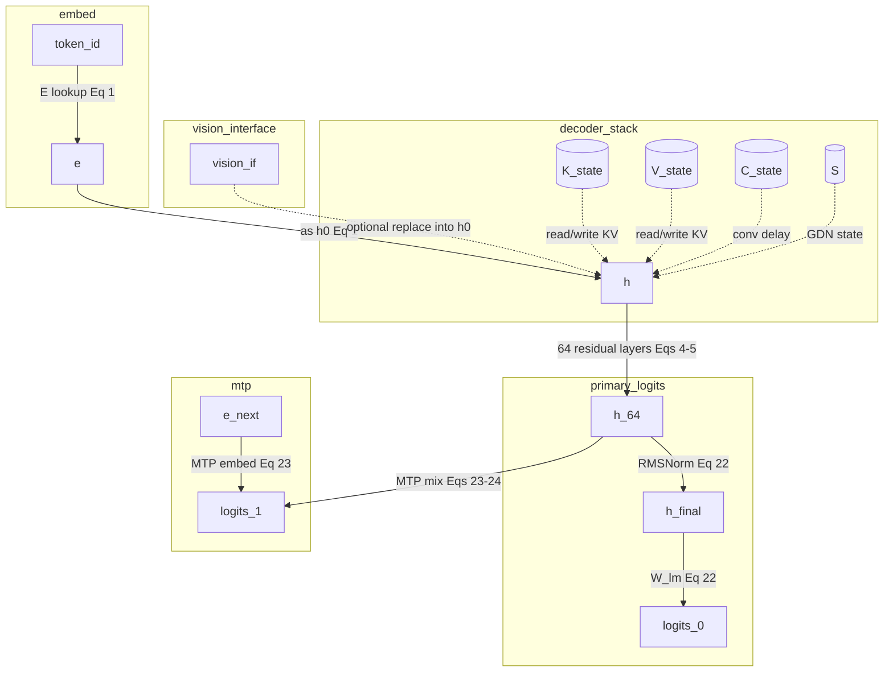
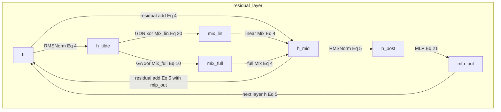
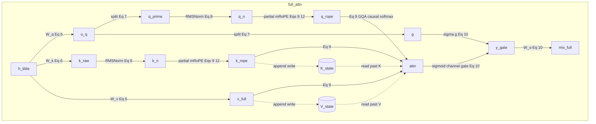
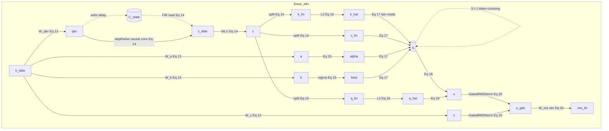
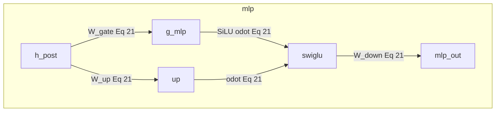
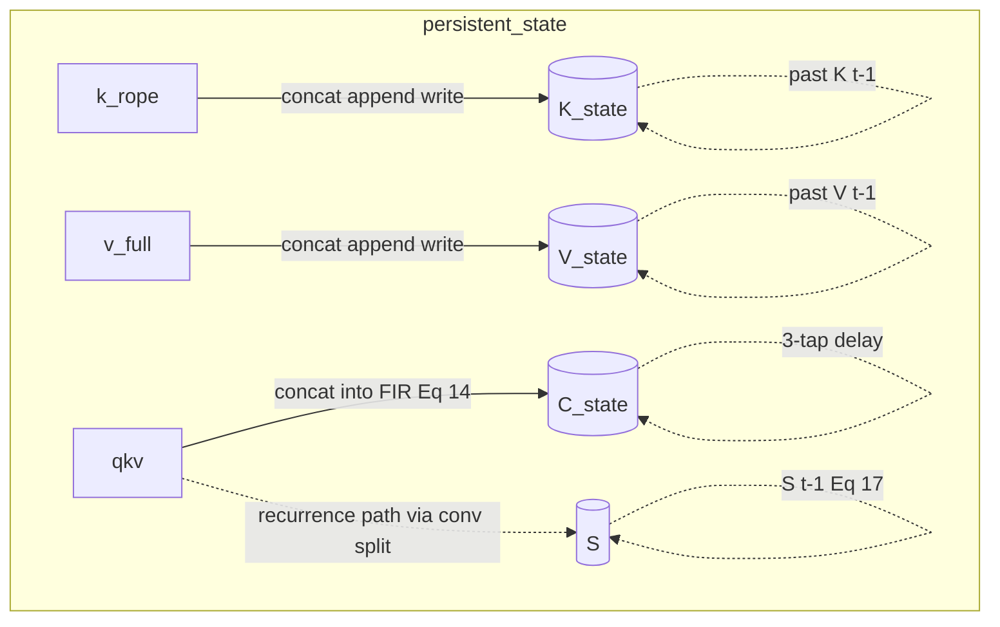
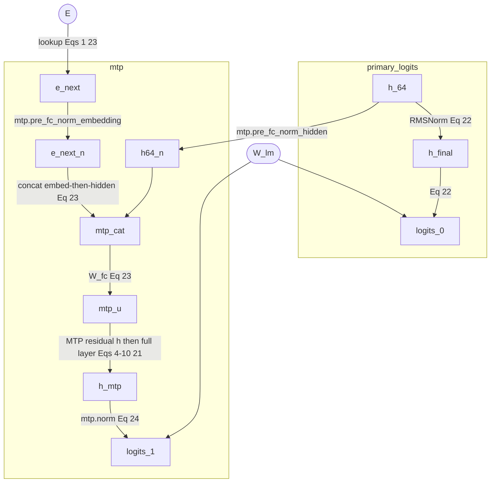
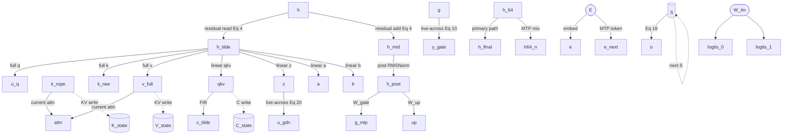

# Qwen3.8-27B logical dataflow (TASK-03)

> **Draft status:** conclusions in this document are **unverified** until the verification stage completes.

Phase 1 logical DAG for the Qwen3.8-27B language + MTP forward map: named
values, producers, consumers, fan-out, and token-to-token state. Equations,
ranks, and state kinds come from
[`docs/architecture/model-semantics.md`](model-semantics.md) (TASK-02). This
document draws that map; it does not invent operators or rewrite forward math.

Prefill and decode share one DAG. Incoming \((K,V,C,S)\) is zeros versus
populated; \(T>1\) versus \(T=1\). Algebraic equivalents in TASK-02 (chunkwise
GDN, SDPA, GQA-as-repeat, RoPE complex form, \(S\) versus \(S^\top\), omitting
MTP when only \(\ell^{(0)}\) is required) are the same map, not extra nodes.

## Authority

| Item | Value | Label |
| --- | --- | --- |
| Dossier | [`docs/architecture/tasks/TASK-03.md`](tasks/TASK-03.md) | — |
| Semantics | [`docs/architecture/model-semantics.md`](model-semantics.md) (TASK-02) | OBSERVED / DERIVED |
| Inventory | [`docs/architecture/model-inventory.md`](model-inventory.md) (TASK-01) | OBSERVED / DERIVED |
| Config | [`.cache/authorities/qwen3.8-27b-transformers/config.json`](../../.cache/authorities/qwen3.8-27b-transformers/config.json) `text_config` | OBSERVED |
| Checker | [`scripts/check_dataflow.py`](../../scripts/check_dataflow.py) | DERIVED |
| Evidence policy | [`docs/architecture/plan.md`](plan.md) (OBSERVED / DERIVED labels) | OBSERVED |
| In scope | Language stack + one MTP block as a logical producer/consumer DAG | — |
| Deferred | Vision encoder internals (residual-stream interface `vision_if` only) | — |
| Scope of this document | Producers, consumers, fan-out, and state edges — not kernels | — |

Numeric ranks instantiate sitting `text_config` OBSERVED: `hidden_size` 5120,
64 decoder layers, `full_attention_interval` 4, 48 linear + 16 full at
\(\ell \bmod 4 = 3\), `mtp_num_hidden_layers` 1. Producer/consumer/fan-out
structure is DERIVED from TASK-02 equations (1)–(24). Hugging Face / paper
identities for gates, RoPE, and GDN are already locked in TASK-02 and are not
reopened here.

If a drawing would disagree with a TASK-02 equation, the equation wins and the
drawing is wrong.

## Logical versus physical

Logical values in this document are graph nodes. They do not imply physical allocation, materialization, buffer reuse, or kernel fusion.

- Fan-out of a named value is not a requirement to store that value.
- Token-crossing edges name mathematical state \((K,V,C,S)\), not a cache layout.
- The DAG is not an execution schedule, fusion plan, or buffer-reuse plan. Prefill versus decode is the same graph with different \(T\) and incoming state.

## Graph vocabulary

| Kind | Mermaid shape | Meaning |
| --- | --- | --- |
| value | `id[label]` rectangle | Named logical tensor (catalog ID) |
| weight | `id([label])` stadium | Checkpoint parameter; not a catalog intermediate |
| state | `id[(label)]` cylinder | Token-persistent catalog node \(K,V,C,S\) |
| region | `subgraph` | Model region boundary, not a tensor |

Edge kinds: solid `-->` data; dashed `-.->` state read/write or token-crossing.
The producing operator sits on the edge label (for example `|W_q|`, `|RMSNorm|`,
`|Eq 17|`). There is no separate fan-out edge type.

**Fan-out** of a value = number of distinct catalog consumer IDs that read the
same value (including a state-write consumer). A disjoint partition produces
child nodes; it is not reuse of the parent. Split parents `u_q` and `c` are
excluded from `high_fanout_ids`.

**Live-across** = fan-out 1 but the unique consumer is not the immediate
successor operator (other catalog nodes are produced in between). Locked:
`g` (consumed after attention), `z` (consumed after recurrence).

**Internal uses** = times one equation reads a value to produce a single
consumer. Locked: `k_hat` is used twice in Eq. (17) to produce `S`.

**Token-crossing** = an edge into the next token’s map (`K_state`, `V_state`,
`C_state`, `S`).

| Region ID | What it contains | Drawn in |
| --- | --- | --- |
| `embed` | `token_id` → `e` | diagram 1 |
| `decoder_stack` | 64 residual layers, 3:1 GDN:GA | diagram 1 (collapsed) |
| `residual_layer` | Eqs. (4)–(5) template | diagram 2 |
| `full_attn` | Eqs. (6)–(10) + KV | diagram 3 |
| `linear_attn` | Eqs. (13)–(20) + \(C,S\) | diagram 4 |
| `mlp` | Eq. (21) | diagram 5 |
| `persistent_state` | \(K,V,C,S\) token update | diagram 6 |
| `primary_logits` | Eq. (22) | diagrams 1 and 7 |
| `mtp` | Eqs. (23)–(24) | diagram 7 |
| `vision_interface` | optional replace into \(h^{(0)}\) | diagram 1 as `vision_if` |

Weights \(E\) and \(W_\text{lm}\) are drawn where they clarify a producer. They
are not catalog intermediates; they appear in JSON `shared_weight_ids`.

## Top-level token map

Diagram 1. Token id to embeddings, optional vision interface into \(h^{(0)}\),
collapsed 64-layer decoder with persistent state, primary logits, and MTP
logits. Mixer pattern OBSERVED: three Gated DeltaNet layers then one Gated
Attention; full attention at \(\ell \bmod 4 = 3\)
(`full_attention_indices` \(=\{3,7,\ldots,63\}\), 16 full / 48 linear).



## Residual decoder layer

Diagram 2. Pre-norm residual template Eqs. (4)–(5). Mixer is GDN xor Gated
Attention by `layer_types`: one layer uses exactly one of `mix_lin` or
`mix_full`. Residual add of Mix into `h_mid` reads `h` a second time. MLP
residual add of `mlp_out` into the next layer’s `h` reads `h_mid` a second time.



## Full attention

Diagram 3. Gated Attention Eqs. (6)–(10) plus KV state. Last-axis split of
`u_q` into `q_prime` \(\|\) `g` is a partition, not reuse. GQA grouping is an
edge annotation on `attn`, not extra repeated-KV nodes. RoPE is baked into
stored `K_state` (TASK-02). Dashed edges are KV read/write.



## Linear attention

Diagram 4. Gated DeltaNet Eqs. (13)–(20) plus conv delay \(C\) and matrix \(S\).
Split of `c` into `q_lin` \(\|\) `k_lin` \(\|\) `v_lin` is a partition, not
reuse. `k_hat` is read twice inside Eq. (17) (internal uses = 2) to produce the
single consumer `S`. `z` is live-across: produced at `W_z`, consumed only in
GatedRMSNorm after the recurrence.



## MLP

Diagram 5. SwiGLU Eq. (21). `h_post` fans out to gate and up projections.



## Persistent state transitions

Diagram 6. Token \(t-1 \to t\) for the four state kinds. Ranks OBSERVED /
DERIVED from TASK-02: \(K,V\in\mathbb{R}^{4\times T\times 256}\) (grows with
\(T\)); \(C\) last 3 vectors in \(\mathbb{R}^{10240}\); \(S\in\mathbb{R}^{48\times 128\times 128}\).
RoPE is baked into stored \(K\). Prefill starts from zeros; decode is the same
edges with populated incoming state.



## Primary logits and MTP

Diagram 7. Primary head Eq. (22) and MTP Eqs. (23)–(24). Shared \(E\) and
\(W_\text{lm}\) are stadium weight nodes (not catalog intermediates). `e_next`
is the embedding of token \(t+1\), not a second consumer of `e` at time \(t\).
Sampling from `logits_0` is outside the forward DAG. MTP self-attention reuses
the full-attention template with its own `K_state`/`V_state` instance.



## Logical intermediates

Catalog of 52 named logical tensors. Columns: ID, symbol, rank (no batch; per
token unless \(T\) appears), producer, consumer IDs, fan-out, internal uses,
token-crossing, multiplicity (instance count in one forward map, not a byte
count), equation tag. Consumer IDs are catalog IDs or `output`. RMS scalars,
softmax scores \(P_{h,s}\), \(\omega_j\) / cos / sin tables, `A_log` / `dt_bias`
as activations, paper \(S^\top\) as a second state, GQA-repeated KV, vision
encoder activations, and the batch dimension are excluded.

### Residual stream / logits (9)

| ID | Symbol | Rank (no batch) | Producer | Consumer IDs | Fan-out | Internal uses | Token-crossing | Multiplicity | Eq |
| --- | --- | --- | --- | --- | ---: | ---: | --- | --- | --- |
| `token_id` | \(\mathrm{id}_t\) | scalar | input | `e` | 1 | 1 | no | \(T\) | (1) |
| `e` | \(e_t\) | \(H=5120\) | \(E_{:,\mathrm{id}_t}\) | `h` (as \(h^{(0)}\)) | 1 | 1 | no | \(T\) | (1) |
| `h` | \(h^{(\ell)}\) | \(H\) | `e` or previous layer residual | `h_tilde`, `h_mid` | 2 | 1 | no | 64 layer inputs | (4) |
| `h_tilde` | \(\tilde h^{(\ell)}\) | \(H\) | \(\operatorname{RMSNorm}_{1+\gamma_\text{in}}(h)\) | full: `u_q`,`k_raw`,`v_full`; linear: `qkv`,`z`,`a`,`b` | 3 or 4 | 1 | no | 64 | (4) |
| `h_mid` | \(h^{(\ell+1/2)}\) | \(H\) | \(h+\operatorname{Mix}\) | `h_post`, next `h` (with `mlp_out`) | 2 | 1 | no | 64 | (4)–(5) |
| `h_post` | post-attn RMSNorm | \(H\) | \(\operatorname{RMSNorm}_{1+\gamma_\text{post}}(h_\text{mid})\) | `g_mlp`, `up` | 2 | 1 | no | 64 | (5),(21) |
| `h_64` | \(h^{(64)}\) | \(H\) | layer 63 output | `h_final`, `h64_n` | 2 | 1 | no | 1 per token | (5),(22),(23) |
| `h_final` | \(h^{\text{final}}\) | \(H\) | \(\operatorname{RMSNorm}_{1+\gamma_\text{final}}(h_{64})\) | `logits_0` | 1 | 1 | no | 1 | (22) |
| `logits_0` | \(\ell^{(0)}_t\) | \(V=248320\) | \(W_\text{lm}\,h^{\text{final}}\) | `output` | 1 | 1 | no | 1 | (22) |

`e_next` is the embedding of token \(t+1\), not a second consumer of `e` at
time \(t\). Sampling from `logits_0` is outside the forward DAG.

### Full attention (14)

Template for each \(\ell\in\mathcal{L}_\text{full}\) and MTP self-attn (MTP
instances counted under MTP rows for mix I/O; this template is the 16 language
layers).

| ID | Symbol | Rank (no batch) | Producer | Consumer IDs | Fan-out | Internal uses | Token-crossing | Multiplicity | Eq |
| --- | --- | --- | --- | --- | ---: | ---: | --- | --- | --- |
| `u_q` | \(u=W_q x\) | \(12288\) | \(W_q\,\tilde h\) | `q_prime`, `g` (disjoint split) | 2 (split, not reuse) | 1 | no | 16 | (6)–(7) |
| `q_prime` | \(q'_h\) | \((24,256)\) | split last axis of `u_q` | `q_n` | 1 | 1 | no | 16 | (7) |
| `g` | \(g_h\) | \((24,256)\) | split last axis of `u_q` | `y_gate` | 1 | 1 | no | 16 | (7),(10) |
| `k_raw` | \(k^{\text{raw}}\) | \((4,256)\) | \(W_k\,\tilde h\) | `k_n` | 1 | 1 | no | 16 | (6) |
| `v_full` | \(v\) | \((4,256)\) | \(W_v\,\tilde h\) | `attn`, `V_state` | 2 | 1 | write | 16 | (6),(9) |
| `q_n` | Q after RMSNorm | \((24,256)\) | \(\operatorname{RMSNorm}_{1+\gamma_q}(q')\) | `q_rope` | 1 | 1 | no | 16 | (8) |
| `k_n` | K after RMSNorm | \((4,256)\) | \(\operatorname{RMSNorm}_{1+\gamma_k}(k^{\text{raw}})\) | `k_rope` | 1 | 1 | no | 16 | (8) |
| `q_rope` | Q after partial mRoPE | \((24,256)\) | RoPE on first 64 dims | `attn` | 1 | 1 | no | 16 | (9),(12) |
| `k_rope` | K after partial mRoPE | \((4,256)\) | RoPE on first 64 dims | `attn`, `K_state` | 2 | 1 | write | 16 | (9),(12) |
| `attn` | \(\operatorname{Attn}(Q,K,V)\) | \((24,256)\) | causal GQA softmax | `y_gate` | 1 | 1 | reads `K_state`,`V_state` | 16 | (9) |
| `y_gate` | \(\operatorname{Attn}\odot\sigma(g)\) | \(6144\) | sigmoid channel gate | `mix_full` | 1 | 1 | no | 16 | (10) |
| `mix_full` | \(\operatorname{Mix}_\text{full}\) | \(H\) | \(W_o y\) | `h_mid` | 1 | 1 | no | 16 | (10) |
| `K_state` | \(K^{(\ell)}\) | \((4,T,256)\) | append `k_rope` (RoPE baked in) | future `attn` | 1 | 1 | yes | 16 language + 1 MTP | state |
| `V_state` | \(V^{(\ell)}\) | \((4,T,256)\) | append `v_full` | future `attn` | 1 | 1 | yes | 16 language + 1 MTP | state |

### Linear attention (18)

Template for each \(\ell\in\mathcal{L}_\text{lin}\).

| ID | Symbol | Rank (no batch) | Producer | Consumer IDs | Fan-out | Internal uses | Token-crossing | Multiplicity | Eq |
| --- | --- | --- | --- | --- | ---: | ---: | --- | --- | --- |
| `qkv` | \(\mathrm{qkv}\) | \(10240\) | \(W_\text{qkv}\,\tilde h\) | `c_tilde`, `C_state` | 2 | 1 | write | 48 | (13)–(14) |
| `z` | \(z\) | \((48,128)\) | \(W_z\,\tilde h\) | `u_gdn` | 1 | 1 | no | 48 | (13),(20) |
| `a` | \(a\) | \(48\) | \(W_a\,\tilde h\) | `alpha` | 1 | 1 | no | 48 | (13),(15) |
| `b` | \(b\) | \(48\) | \(W_b\,\tilde h\) | `beta` | 1 | 1 | no | 48 | (13),(15) |
| `c_tilde` | \(\tilde c_t\) | \(10240\) | depthwise causal conv (reads `C_state`) | `c` | 1 | 1 | reads `C_state` | 48 | (14) |
| `c` | \(c_t=\operatorname{SiLU}(\tilde c)\) | \(10240\) | SiLU | `q_lin`, `k_lin`, `v_lin` (disjoint split) | 3 (split, not reuse) | 1 | no | 48 | (14) |
| `q_lin` | \(q\) | \((48,128)\) | split + repeat_interleave \(r^\ell=3\) | `q_hat` | 1 | 1 | no | 48 | (14),(16) |
| `k_lin` | \(k\) | \((48,128)\) | split + repeat_interleave | `k_hat` | 1 | 1 | no | 48 | (14),(16) |
| `v_lin` | \(v\) | \((48,128)\) | split (no L2) | `S` | 1 | 1 | no | 48 | (14),(17) |
| `q_hat` | \(\tilde q\) | \((48,128)\) | L2-normalize `q_lin` | `o` | 1 | 1 | no | 48 | (16),(18) |
| `k_hat` | \(\tilde k\) | \((48,128)\) | L2-normalize `k_lin` | `S` | 1 | 2 | no | 48 | (16),(17) |
| `alpha` | \(\alpha_t\) | \(48\) | Eq. (15) from `a`, `A_log`, `dt_bias` | `S` | 1 | 1 | no | 48 | (15) |
| `beta` | \(\beta_t\) | \(48\) | \(\sigma(b)\) | `S` | 1 | 1 | no | 48 | (15) |
| `S` | \(S_t\) | \((48,128,128)\) | Eq. (17) from `S`\(_{t-1}\), `k_hat`, `v_lin`, `alpha`, `beta` | `o`, next `S` | 2 | 1 | yes | 48 | (17)–(19) |
| `o` | \(o_t\) | \((48,128)\) | Eq. (18) | `u_gdn` | 1 | 1 | no | 48 | (18) |
| `u_gdn` | GatedRMSNorm\((o,z)\) | \((48,128)\) | Eq. (3)/(20) | `mix_lin` | 1 | 1 | no | 48 | (20) |
| `mix_lin` | \(\operatorname{Mix}_\text{lin}\) | \(H\) | \(W_\text{out}\operatorname{vec}(u)\) | `h_mid` | 1 | 1 | no | 48 | (20) |
| `C_state` | \(C^{(\ell)}\) | \(3\times 10240\) | delay of `qkv` | next `c_tilde` | 1 | 1 | yes | 48 | (14) |

### MLP (4)

64 language layers; MTP MLP is the same template inside the MTP block (no extra
IDs).

| ID | Symbol | Rank (no batch) | Producer | Consumer IDs | Fan-out | Internal uses | Token-crossing | Multiplicity | Eq |
| --- | --- | --- | --- | --- | ---: | ---: | --- | --- | --- |
| `g_mlp` | \(W_\text{gate}x\) | \(17408\) | \(W_\text{gate}\,h_\text{post}\) | `swiglu` | 1 | 1 | no | 64 (+1 MTP) | (21) |
| `up` | \(W_\text{up}x\) | \(17408\) | \(W_\text{up}\,h_\text{post}\) | `swiglu` | 1 | 1 | no | 64 (+1 MTP) | (21) |
| `swiglu` | \(\operatorname{SiLU}(g)\odot\text{up}\) | \(17408\) | elementwise | `mlp_out` | 1 | 1 | no | 64 (+1 MTP) | (21) |
| `mlp_out` | \(\operatorname{MLP}\) | \(H\) | \(W_\text{down}\) | next `h` (with `h_mid`) | 1 | 1 | no | 64 (+1 MTP) | (5),(21) |

### MTP (7)

| ID | Symbol | Rank (no batch) | Producer | Consumer IDs | Fan-out | Internal uses | Token-crossing | Multiplicity | Eq |
| --- | --- | --- | --- | --- | ---: | ---: | --- | --- | --- |
| `e_next` | \(e_{t+1}\) | \(H\) | shared \(E\) | `e_next_n` | 1 | 1 | no | 1 | (1),(23) |
| `e_next_n` | \(\operatorname{RMSNorm}(e_{t+1})\) | \(H\) | `mtp.pre_fc_norm_embedding` | `mtp_cat` | 1 | 1 | no | 1 | (23) |
| `h64_n` | \(\operatorname{RMSNorm}(h^{(64)})\) | \(H\) | `mtp.pre_fc_norm_hidden` | `mtp_cat` | 1 | 1 | no | 1 | (23) |
| `mtp_cat` | concat | \(10240\) | concat embed-then-hidden | `mtp_u` | 1 | 1 | no | 1 | (23) |
| `mtp_u` | \(u_t\) | \(H\) | \(W_\text{fc}\) | MTP residual `h` (block input) | 1 | 1 | no | 1 | (23) |
| `h_mtp` | \(h^{\text{mtp}}\) | \(H\) | MTP full layer (4)–(10),(21) | `logits_1` via `mtp.norm` | 1 | 1 | MTP KV yes | 1 | (24) |
| `logits_1` | \(\ell^{(1)}_t\) | \(V\) | shared \(W_\text{lm}\) after `mtp.norm` | `output` | 1 | 1 | no | 1 | (24) |

Shared parameters (not catalog intermediates; JSON `shared_weight_ids`):

| ID | Rank | Consumers | Fan-out |
| --- | --- | ---: | ---: |
| `E` | \((H,V)\) stored \((V,H)\) | `e`, `e_next` | 2 |
| `W_lm` | \((V,H)\) | `logits_0`, `logits_1` | 2 |

## Sharing and reuse

DERIVED from the catalog. Not a HYPOTHESIS about runtime, fusion, or bytes.
This closes the ledger open question: which logical results have the most
consequential sharing and reuse, as graph structure.

**High-fan-out IDs** (reuse of the same value; exclude disjoint splits `u_q`,
`c`): `h`, `h_tilde`, `h_mid`, `h_post`, `h_64`, `k_rope`, `v_full`, `qkv`, `S`.

**Live-across IDs:** `g`, `z`.

**Intra-equation reuse:** `k_hat` (Eq. 17).

**Shared weights:** `E`, `W_lm`.

Diagram 8. High-fan-out values, live-across `g`/`z`, and shared \(E\) /
\(W_\text{lm}\). Criterion for the ranked list: residual survival, then
projection fan-out, then token-crossing, then live-across, then shared weights.
Not ranked by parameter count, FLOPs, or predicted speedup. This section does
not say which values should be stored.



Ranked consequential sharing (DERIVED):

1. `h` / `h_mid` — residual stream: each mixer/MLP both reads the pre-op vector and adds to it, so the pre-op value has a second consumer besides the mixer/MLP body.
2. `h_tilde` — fans out to 3 (full: q/k/v) or 4 (linear: qkv/z/a/b) independent projections.
3. `h_post` — fans out to `g_mlp` and `up`.
4. `k_rope` and `v_full` — current `attn` plus persistent KV write.
5. `qkv` — FIR conv plus conv-delay `C_state`.
6. `S` — produces `o` and is the next-token GDN state.
7. `h_64` — primary logits path and MTP mix.
8. `E` and `W_lm` — embed/MTP token lookup and both logit heads.
9. `g` — produced at the `q_proj` split, consumed only in Eq. (10) after attention (live-across).
10. `z` — produced at `in_proj_z`, consumed only in GatedRMSNorm after the recurrence (live-across).
11. `k_hat` — two reads inside Eq. (17) (intra-equation; not a second catalog consumer).

## Deferred vision

Visual tokens may replace `image_token_id` / `video_token_id` placeholders in
the residual stream as vectors in \(\mathbb{R}^{H}\) (`out_hidden_size` 5120
OBSERVED) via the merger interface node `vision_if`. Encoder, patch embed, and
merger internals are **UNKNOWN** / out of scope (TASK-01 / TASK-02 deferred).
This DAG does not expand vision-encoder activations.

## Machine-checkable graph summary

Live object from `text_config` arithmetic plus locked graph constants (copied
from [`scripts/check_dataflow.py --json`](../../scripts/check_dataflow.py)):

```json
{
  "authority": ".cache/authorities/qwen3.8-27b-transformers",
  "hidden_size": 5120,
  "n_decoder_layers": 64,
  "n_linear_layers": 48,
  "n_full_layers": 16,
  "n_mtp_blocks": 1,
  "full_attention_indices": [
    3,
    7,
    11,
    15,
    19,
    23,
    27,
    31,
    35,
    39,
    43,
    47,
    51,
    55,
    59,
    63
  ],
  "n_diagrams": 8,
  "n_catalog_nodes": 52,
  "catalog_ids": [
    "token_id",
    "e",
    "h",
    "h_tilde",
    "h_mid",
    "h_post",
    "h_64",
    "h_final",
    "logits_0",
    "u_q",
    "q_prime",
    "g",
    "k_raw",
    "v_full",
    "q_n",
    "k_n",
    "q_rope",
    "k_rope",
    "attn",
    "y_gate",
    "mix_full",
    "K_state",
    "V_state",
    "qkv",
    "z",
    "a",
    "b",
    "c_tilde",
    "c",
    "q_lin",
    "k_lin",
    "v_lin",
    "q_hat",
    "k_hat",
    "alpha",
    "beta",
    "S",
    "o",
    "u_gdn",
    "mix_lin",
    "C_state",
    "g_mlp",
    "up",
    "swiglu",
    "mlp_out",
    "e_next",
    "e_next_n",
    "h64_n",
    "mtp_cat",
    "mtp_u",
    "h_mtp",
    "logits_1"
  ],
  "high_fanout_ids": [
    "h",
    "h_tilde",
    "h_mid",
    "h_post",
    "h_64",
    "k_rope",
    "v_full",
    "qkv",
    "S"
  ],
  "live_across_ids": [
    "g",
    "z"
  ],
  "intra_equation_reuse_ids": [
    "k_hat"
  ],
  "shared_weight_ids": [
    "E",
    "W_lm"
  ],
  "state_ids": [
    "K_state",
    "V_state",
    "C_state",
    "S"
  ],
  "regions": [
    "embed",
    "decoder_stack",
    "residual_layer",
    "full_attn",
    "linear_attn",
    "mlp",
    "persistent_state",
    "primary_logits",
    "mtp",
    "vision_interface"
  ],
  "canonical_sentence": "Logical values in this document are graph nodes. They do not imply physical allocation, materialization, buffer reuse, or kernel fusion."
}
```
