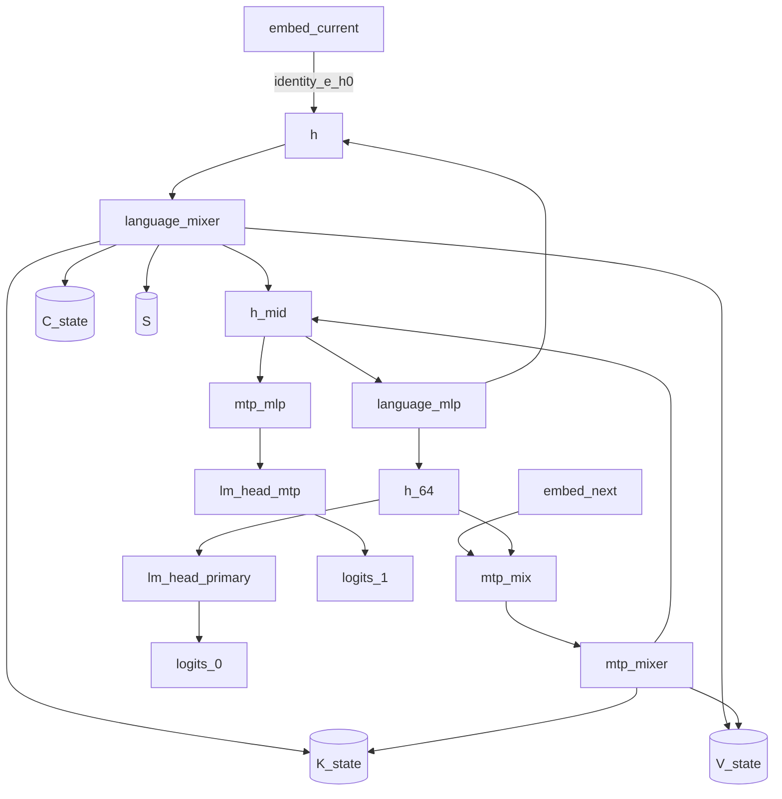

# Qwen3.8-27B decode execution plan (TASK-13)

> **Draft status:** conclusions in this document are **unverified** until the verification stage completes.

Phase 1 **hardware-independent** decode semantic schedule for one-token
inference on the Qwen3.8-27B language+MTP map. Select one serial order of the
existing TASK-11 node instances (135 complete). Per compact stage kind: name
weight loads, state reads/writes, visibility boundaries, and reuse. Separate
TASK-06 unavoidable unique-weight / state / forced-activation minima from this
schedule’s proposed-boundary stage-cut channel. Attach TASK-09 consumer
sequences and TASK-12 fusion hypotheses as unselected experiment attachments.
Close the ledger open question (boundary-added traffic relative to mathematical
minimum traffic) with DERIVED identities on matching channels, not by selecting
a fusion, packing sequence, layout, or CUDA mapping.

This document specifies a **hardware-independent semantic schedule**, not
kernels. Prefill and decode share one semantic graph. This document schedules
decode only: \(T_\text{new}=1\), stored KV length \(T\) after append, incoming
\((K,V,C,S)\) populated. Primary instance counts include MTP. If a node I/O,
state kind, catalog ID, layer count, or cited MAC/byte would disagree with
TASK-06/09/11/12 or sitting `text_config`, the earlier document / config wins
and this one is wrong.

Claims are labelled OBSERVED (sitting `text_config` / inventory already
established), DERIVED (serial order from the DAG, stage multiplicities,
stage-cut byte identities, cited TASK-06/04 integers), or HYPOTHESIS
(hoist/overlap usefulness, second \(W_\text{lm}\) read, extra `h_64` consumer
read, every packing/fusion usefulness). No MEASURED tok/s or NLL. No fusion,
packing winner, tile, or kernel is chosen here.

## Authority

| Item | Value | Label |
| --- | --- | --- |
| Dossier | [`docs/architecture/tasks/TASK-13.md`](tasks/TASK-13.md) | — |
| Work/traffic | [`docs/architecture/work-and-traffic.md`](work-and-traffic.md) (TASK-06) | citation of MAC/byte identities |
| Runtime format | [`docs/architecture/runtime-format-design.md`](runtime-format-design.md) (TASK-09) | seven sequences, unselected |
| Semantic graph | [`docs/architecture/semantic-graph.md`](semantic-graph.md) (TASK-11) | OBSERVED / DERIVED |
| Materialization/fusion | [`docs/architecture/materialization-and-fusion.md`](materialization-and-fusion.md) (TASK-12) | 22 hypotheses, unselected |
| Inventory | [`docs/architecture/model-inventory.md`](model-inventory.md) (TASK-01) via TASK-06/11 | OBSERVED |
| Config | [`.cache/authorities/qwen3.8-27b-transformers/config.json`](../../.cache/authorities/qwen3.8-27b-transformers/config.json) `text_config` | OBSERVED |
| Checker | [`scripts/check_decode_plan.py`](../../scripts/check_decode_plan.py) | DERIVED |
| Evidence policy | [`docs/architecture/plan.md`](plan.md) (OBSERVED / DERIVED / HYPOTHESIS) | OBSERVED |
| In scope | Language + MTP one-token serial schedule, traffic split, packing and fusion attachments left unselected | — |
| Deferred | Vision encoder; TASK-14 prefill; TASK-15 layouts; TASK-17 CUDA | — |
| Scope of this document | Hardware-independent semantic schedule — not kernels | — |

Numeric ranks instantiate sitting `text_config` OBSERVED: `hidden_size` 5120,
`intermediate_size` 17408, `vocab_size` 248320, 64 decoder layers, 48 linear +
16 full at \(\ell \bmod 4 = 3\), `mtp_num_hidden_layers` 1, `head_dim` 256,
`num_attention_heads` 24, `num_key_value_heads` 4, linear widths
\(d_\text{qkv}=10240\), `linear_key_head_dim` / `linear_value_head_dim` 128,
`dtype` `"bfloat16"`, `mamba_ssm_dtype` `"float32"`. Stage kinds, serial order,
and stage-cut bytes are DERIVED. Hoist/packing/fusion usefulness remains
HYPOTHESIS.

Quartz and llama.cpp inspection are deferred until freeze. GGUF does not
constrain this schedule.

## Decode schedule convention

Logical values in this document are graph nodes. They do not imply physical allocation, materialization, buffer reuse, or kernel fusion.

The decode schedule in this document is a hardware-independent order of TASK-11 nodes for one-token inference, not a CUDA graph, kernel launch sequence, or selected fusion.

Unavoidable traffic is the TASK-06 unique-weight, state, and forced-activation minimum; proposed-boundary traffic is this schedule's named stage-cut channel.

Boundary-added traffic relative to the mathematical minimum is the named stage-cut channel compared with TASK-06 unique-weight, state, and activation views; which packing or fusion hypotheses change that extra remains a HYPOTHESIS.

JSON: `canonical_sentence_logical` = sentence 1; `canonical_sentence_schedule`
= sentence 2; `canonical_sentence_traffic` = sentence 3;
`canonical_sentence_open_question` = sentence 4. Sentence 4 closes the ledger
open question in checker-substring form. JSON
`ledger_open_question_boundary_traffic_closed` true.

- Nine stage kinds are complete for this task; their multiplicities sum to 135
  complete node instances (`n_stage_kinds` 9, `n_stage_instances` 135).
- A stage is a named execution of one TASK-11 node type (or mixer xor) with
  loads, state R/W, visibility I/O, and reuse.
- This document selects one **serial** order (`schedule_serial_selected` true).
  Hoist and overlap remain HYPOTHESIS (`n_hoist_hypotheses_selected` 0).
- Prefill is not scheduled here (`prefill_schedule_deferred` true). Decode
  \(T_\text{new}=1\); incoming state is populated (`incoming_state_populated`
  true).
- Residual add stays inside mixer/`mlp`; `g`/`z` stay internal; RMS stays
  inside the consumer (TASK-11 locks).
- Unique weights are counted once per complete decode
  (`weight_unique_counted_once` true).
- Fan-out ≠ must-store and node I/O ≠ must-store still hold.
- Primary schedule includes MTP. Hardware mapping is TASK-17. Fusion winners
  remain TASK-12 hypotheses. Ideal byte sequence remains TASK-09 open.
- No thread geometry (`thread_geometry_absent` true).

## One-token setting

Let \(T\) be the stored KV length **after** appending the current token
(TASK-04/06). Decode of one new token has incoming KV length \(T-1\) and
attention contractions against **length \(T\)**. When \(T=1\), incoming KV is
empty but \(C,S\) are still populated on a continuing decode; the **first**
generated token after prefill has incoming KV length \(T-1\) from the prompt.
This document does not schedule that prefill.

JSON: `T_is_stored_length_after_append` true; `decode_T_new` 1; `example_T`
`[1, 4096]`; `incoming_state_populated` true; `primary_includes_mtp` true;
`mtp_omission_is_algebraic_equivalent` true (not the primary schedule).

JSON `n_token_presentations` = 2. Current `token_id` feeds `embed_current`;
next `token_id` feeds `embed_next`. Both are graph inputs to the complete map.
Do not add a catalog ID. Sampling over \(V\) is out of scope.

JSON `n_node_instances_complete` = 135; `n_node_instances_language` = 130
(citations of TASK-11). Mixer xor: language layer \(\ell\) uses `gated_attn`
iff \(\ell\in\mathcal{L}_\text{full}\) (`full_attention_indices`
\(\{3,7,\ldots,63\}\)), else `gated_delta_net`. Then `mlp`. Do not unroll 64
layers beyond this rule. JSON `mixer_xor_by_layer_types` true.

Prefill and decode share **one** semantic graph (`decode_prefill_share_graph`
true); **schedules** are independent. Residual add lives inside mixer and
`mlp` (`residual_add_inside_mixer`, `residual_add_inside_mlp` true). Inputs
`h` / `h_mid` remain mathematically available until that add
(`residual_input_live_until_add` true). Residual-stream RMSNorm lives inside
the consuming node (`rms_inside_consumer` true). Live-across `g` and `z` are
internal (`live_across_are_internal` true). GDN primary stays recurrent
`(17)`–`(18)` (`gdn_primary_is_recurrent_eq_17` true); chunkwise GDN is not
zero \(S\) traffic (`chunkwise_not_zero_s_traffic` true). State writes are
not optional (`state_write_not_optional` true). `h_64` cannot be hidden from
one of its two primary consumers (`fanout_h64_cannot_hide_from_one_consumer`
true). Unique weights are counted once; a second physical \(W_\text{lm}\)
read is HYPOTHESIS extra, not unique
(`weight_second_w_lm_read_is_hypothesis` true). Hardware mapping is TASK-17
(`cuda_mapping_deferred` true, `hardware_independent` true,
`thread_geometry_absent` true). Layout, fusion winner, ideal byte sequence,
and artifact boundary remain unselected (`layout_selected`,
`fusion_winner_selected`, `ideal_byte_sequence_selected`,
`artifact_boundary_selected` false). Activation dtype is not decided
(`activation_dtype_decided` false). The vision interface is not a node
(`vision_interface_is_not_a_node` true).

## Stage kinds and serial order

JSON array `stage_kind_ids` in this exact order (9 ids). JSON `n_stage_kinds`
= 9. Parallel `stage_multiplicities`, `stage_node_types`,
`stage_primary_sequence_ids`. `mixer_xor` is a schedule abbreviation, not a
seventh TASK-11 node type. Node types remain `embed`, `gated_attn`,
`gated_delta_net`, `mlp`, `lm_head`, `mtp_mix`.

| id | Multiplicity | Node type | Serial rank |
| --- | ---: | --- | ---: |
| `embed_current` | 1 | `embed` | 1 |
| `language_mixer` | 64 | `mixer_xor` (`gated_attn` iff \(\ell\in\mathcal{L}_\text{full}\), else `gated_delta_net`) | 2 (loop with next) |
| `language_mlp` | 64 | `mlp` | 2 (after matching mixer) |
| `lm_head_primary` | 1 | `lm_head` | 3 |
| `embed_next` | 1 | `embed` | 4 |
| `mtp_mix` | 1 | `mtp_mix` | 5 |
| `mtp_mixer` | 1 | `gated_attn` | 6 |
| `mtp_mlp` | 1 | `mlp` | 7 |
| `lm_head_mtp` | 1 | `lm_head` | 8 |

JSON `stage_multiplicities` `[1,64,64,1,1,1,1,1,1]`. Sum 135. JSON
`n_stage_instances` = 135. JSON `stage_node_types`
`["embed","mixer_xor","mlp","lm_head","embed","mtp_mix","gated_attn","mlp","lm_head"]`.

Instance-count cross-check: `language_mixer` contributes 16 `gated_attn` + 48
`gated_delta_net`; plus `mtp_mixer` → 17 `gated_attn`. `language_mlp` +
`mtp_mlp` → 65 `mlp`. Two `embed`, two `lm_head`, one `mtp_mix`. Matches
TASK-11 complete counts (\(2+17+48+65+2+1=135\)).

**Serial order** (selected; one complete decode):

1. `embed_current`
2. For \(\ell=0,\ldots,63\): `language_mixer`[\(\ell\)] then `language_mlp`[\(\ell\)]
3. `lm_head_primary`
4. `embed_next`
5. `mtp_mix`
6. `mtp_mixer`
7. `mtp_mlp`
8. `lm_head_mtp`

JSON `serial_stage_kind_order` equals `stage_kind_ids` (the loop is implied by
multiplicities; do not expand to 135 ids in JSON).

**Ready-set constraints** (DERIVED from TASK-11 edges; not CUDA overlap).
JSON array `ready_constraint_ids` in this exact order (10 ids). JSON
`n_ready_constraints` = 10.

| id | Stage | Ready after |
| --- | --- | --- |
| `ready_embed_current` | `embed_current` | current `token_id` present |
| `ready_language_mixer_0` | `language_mixer`[0] | `embed_current` (`identity_e_h0`) |
| `ready_language_mlp` | `language_mlp`[\(\ell\)] | matching `language_mixer`[\(\ell\)] (`residual_h_mid`) |
| `ready_language_mixer_next` | `language_mixer`[\(\ell>0\)] | `language_mlp`[\(\ell-1\)] (`residual_h`) |
| `ready_lm_head_primary` | `lm_head_primary` | `language_mlp`[63] (`fanout_h64`) |
| `ready_embed_next` | `embed_next` | next `token_id` present (no language-stack data edge) |
| `ready_mtp_mix` | `mtp_mix` | `language_mlp`[63] **and** `embed_next` |
| `ready_mtp_mixer` | `mtp_mixer` | `mtp_mix` (`mtp_u_to_block`) |
| `ready_mtp_mlp` | `mtp_mlp` | `mtp_mixer` (`residual_h_mid`) |
| `ready_lm_head_mtp` | `lm_head_mtp` | `mtp_mlp` (`h_mtp_to_logits`) |

Serial places `embed_next` after `lm_head_primary` to keep the MTP suffix
contiguous. `ready_embed_next` is earlier; hoisting is HYPOTHESIS, not a
second selected order. TASK-11 sync edges also include `embed_e_next`,
`output_logits_0`, `output_logits_1`, `state_kv`, `state_c`, `state_s`,
`shared_E`, and `shared_W_lm`.

## Per-stage loads, state, visibility, and reuse

One table covering all nine kinds. Completes the per-stage criterion.
Unique weight bytes are counted **once** per complete decode. Per-stage
“loads” name **which** unique bytes that stage consumes, not a 64× restream
of the model. Fan-out ≠ must-store and node I/O ≠ must-store still hold.
Access classes cite TASK-09; attaching a sequence is not selecting an ideal
byte sequence.

| Stage | Loads | State read | State write | Visibility in | Visibility out | Reuse |
| --- | --- | --- | --- | --- | --- | --- |
| `embed_current` | One row of shared \(E\) (10240 B gather; table not streamed) | none | none | current `token_id` | `e` identified as \(h^{(0)}\) | `shared_E`; gather vs full table |
| `language_mixer` | Mixer unique weights for that layer (self-attn **or** linear-attn family; counted once in the unique-weight total). Access `dense_gemm`; GDN also `depthwise_conv` | `gated_attn`: \(K,V\) of length \(T-1\) (4096 B/token/instance). `gated_delta_net`: \(C\) 61440 B and \(S\) 3145728 B per instance | `gated_attn`: append \(K,V\) 4096 B. `gated_delta_net`: write \(C\) and \(S_t\) | `h` (live until Mix add) | `h_mid` | Residual `h` until add; internals default inside (`g` live-across internal; `k_rope`/`v_full`/`qkv` reuse_or_recompute HYPOTHESIS; `k_hat` intra-equation) |
| `language_mlp` | MLP unique weights for that layer (counted once in the unique-weight total). Access `dense_gemm` | none | none | `h_mid` (live until MLP add) | next `h`, or `h_64` at \(\ell=63\) | Residual `h_mid` until add; `h_post`/`swiglu` fuse_or_recompute HYPOTHESIS |
| `lm_head_primary` | Shared \(W_\text{lm}\) 2542796800 B (`seq_lm_head_full`) plus final RMS gamma | none | none | `h_64` | `logits_0` | `shared_W_lm`; `h_64` also consumed by `mtp_mix` |
| `embed_next` | One row of shared \(E\) (10240 B gather) | none | none | next `token_id` | `e_next` | `shared_E` (same payload as `embed_current`) |
| `mtp_mix` | `mtp.fc` contraction weights. Access `dense_gemm` | none | none | `h_64`, `e_next` | `mtp_u` as residual `h` | `h_64` fan-out reuse; `mtp_cat` split HYPOTHESIS |
| `mtp_mixer` | MTP `gated_attn` unique weights. Access `dense_gemm` | MTP \(K,V\) of length \(T-1\) | MTP \(K,V\) append 4096 B | `mtp_u` as `h` | `h_mid` | Same gated-attn reuse as language full layers |
| `mtp_mlp` | MTP MLP unique weights. Access `dense_gemm` | none | none | `h_mid` | `h_mtp` | Same MLP reuse as language |
| `lm_head_mtp` | Shared \(W_\text{lm}\) (second physical read HYPOTHESIS, not unique bytes) | none | none | `h_mtp` | `logits_1` | `shared_W_lm` |

JSON `stage_visibility_in` / `stage_visibility_out` keyed in `stage_kind_ids`
order: `embed_current` in `["token_id"]` out `["e"]`; `language_mixer` in
`["h"]` out `["h_mid"]`; `language_mlp` in `["h_mid"]` out `["h"]` (last
instance identified as `h_64` in prose / `fanout_h64`); `lm_head_primary` in
`["h_64"]` out `["logits_0"]`; `embed_next` in `["token_id"]` out
`["e_next"]`; `mtp_mix` in `["h_64","e_next"]` out `["mtp_u"]`; `mtp_mixer`
in `["h"]` out `["h_mid"]`; `mtp_mlp` in `["h_mid"]` out `["h_mtp"]`;
`lm_head_mtp` in `["h_mtp"]` out `["logits_1"]`. `g` and `z` are not
stage-cut I/O.

JSON `stage_state_read` / `stage_state_write`: mixers as TASK-11.
`language_mixer` xor `["K_state","V_state"]` or `["C_state","S"]`; JSON
stores the union `["K_state","V_state","C_state","S"]` so both families are
named without duplicating 64 keys. `mtp_mixer` `["K_state","V_state"]`. All
other kinds empty arrays. JSON `language_mixer_state_is_xor` true.

JSON `stage_primary_sequence_ids` in this exact order (9 ids):
`seq_gather_row`, `seq_gemm_codes_then_scales`, `seq_gemm_codes_then_scales`,
`seq_lm_head_full`, `seq_gather_row`, `seq_gemm_codes_then_scales`,
`seq_gemm_codes_then_scales`, `seq_gemm_codes_then_scales`,
`seq_lm_head_full`. JSON `gated_delta_net_state_sequence_id` =
`seq_state_s_dense`.

State volume citations (do not re-derive; checker recomputes from the same
identities as TASK-06):

| JSON key | Value |
| --- | ---: |
| `kv_bytes_per_full_layer_per_token` | 4096 |
| `kv_bytes_all_per_token` | 69632 |
| `c_bytes_per_layer` | 61440 |
| `c_write_bytes_all` | 983040 |
| `c_read_bytes_all` | 2949120 |
| `s_bytes_per_layer` | 3145728 |
| `s_bytes_all` | 150994944 |
| `decode_write_bytes` | 152047616 |
| `decode_read_fixed_bytes` | 153944064 |
| `decode_read_kv_bytes_coeff_Tm1` | 69632 |

Omitting a KV/\(C\)/\(S\) write changes the map (`state_write_not_optional`).
Chunkwise GDN is not zero \(S\) traffic.

## Unavoidable versus proposed-boundary traffic

Three channels. **Unavoidable** = TASK-06 mathematical minimum for one
complete decode. **Proposed-boundary** = this serial schedule’s named
stage-cut transfers. Do not recopy TASK-06 family tables.

**Weight**

| Item | Bytes | Label |
| --- | ---: | --- |
| Unique non-embed language+MTP | 52098598912 | unavoidable (cite TASK-06) |
| Gather complete (`e_t` + `e_{t+1}`) | 20480 | unavoidable |
| Unique+gather decode complete | 52098619392 | unavoidable |
| Unique extra vs TASK-06 | 0 | DERIVED |
| Second physical \(W_\text{lm}\) read | 2542796800 | HYPOTHESIS extra, not unique |

JSON: `weight_bytes_unique_non_embed` 52098598912,
`weight_gather_bytes_decode_complete` 20480,
`weight_unique_plus_gather_decode_complete` 52098619392,
`weight_boundary_added_unique_bytes` 0, `weight_second_w_lm_read_bytes`
2542796800.

**State**

| Item | Bytes | Label |
| --- | --- | --- |
| Write all \(K,V,C,S\) | 152047616 | unavoidable |
| Read | \(69632(T-1)+153944064\) | unavoidable |
| Read at \(T=1\) | 153944064 | DERIVED |
| Read at \(T=4096\) | 439087104 | DERIVED |
| Extra vs TASK-06 | 0 | DERIVED |

JSON arrays `decode_read_bytes_at_example_T`, `storage_bytes_at_example_T`
follow `example_T`. Storage \(B_\text{store}(T)=69632T+153944064\) (154013696
at \(T=1\), 439156736 at \(T=4096\)). JSON `state_boundary_added_bytes` 0.

**Activation — three views plus this stage-cut**

Cite TASK-06: `act_forced_decode_complete_bytes` 3123200;
`act_region_cut_decode_complete_bytes` 5847040. Neither is a CUDA live-set.

Stage-cut unique bytes (this schedule; each named data edge once;
identification applied so `e` is the first mixer input and `mtp_u` is the MTP
mixer input; `h_64` counted once, not twice):

JSON `n_h_mid_crossings` = 65 (64 language + 1 MTP). JSON
`n_h_interlayer_crossings` = 63. JSON `n_identity_e_h0_crossings` = 1. JSON
`n_fanout_h64_crossings` = 1. JSON `n_embed_e_next_crossings` = 1. JSON
`n_mtp_u_crossings` = 1. JSON `n_h_mtp_crossings` = 1. JSON
`n_residual_stage_crossings` = 133. Sum: 1 (`e` as \(h^{(0)}\)) + 65
(`h_mid`) + 63 (inter-layer `h`) + 1 (`h_64`) + 1 (`e_next`) + 1 (`mtp_u`) +
1 (`h_mtp`). Do **not** add a second MTP `h_mid` line; it is already inside
`n_h_mid_crossings`.

JSON `residual_bytes` 10240. JSON `act_residual_stage_cut_bytes` =
\(133\times 10240\) = 1361920. JSON `logits_bytes` 496640. JSON
`n_logit_outputs` = 2. JSON `act_logits_stage_cut_bytes` = 993280. JSON
`act_stage_cut_decode_complete_bytes` = 2355200.

`g`/`z` stay inside mixers: JSON `act_gz_local_bytes` =
\(16\times 12288 + 48\times 12288 + 12288\) = 798720 (language `g` + language
`z` + MTP `g`). These are **not** stage-cut bytes.

JSON `act_boundary_added_vs_forced` = \(2355200-3123200\) = \(-768000\). JSON
`act_boundary_added_vs_region_cut` = \(2355200-5847040\) = \(-3491840\).

Negative values are DERIVED identities, not “the schedule is cheaper than
liveness.” Forced includes live-across `g`/`z` as mathematical must-survive;
region-cut includes intra-node internals (`h_tilde`, `mix_*`, `h_post`, …).
The schedule keeps those **inside** stages. Proposed-boundary traffic is the
**named stage-cut channel** 2355200 B, not a claim that `g`/`z` disappeared.

JSON `act_h64_second_consumer_bytes` 10240 — extra physical read of `h_64` by
the second of (`lm_head_primary`, `mtp_mix`) is HYPOTHESIS
(`act_h64_second_consumer_is_hypothesis` true). Unique stage-cut counts
`h_64` once.

JSON `act_h_mid_stage_cut_bytes` = \(65\times 10240\) = 665600.
`fuse_across_residual_h_mid` would remove this as **inter-stage** I/O
(TASK-12 extra_sync \(-1\)) while keeping the add in a local working set.
Usefulness HYPOTHESIS. Do not apply that fusion here.

This heading **closes** the ledger open question. Unavoidable unique-weight
extra is 0. Unavoidable state extra is 0. Proposed-boundary activation is the
stage-cut identity 2355200 B, compared with TASK-06 forced 3123200 B and
region-cut 5847040 B. A second \(W_\text{lm}\) read, an extra `h_64` consumer
read, hoist/overlap, and every TASK-12 fusion/split change to those extras
remain HYPOTHESIS. This document does not authorize a merge, a split, a
packing winner, or a CUDA mapping.

## Packing and fusion hypotheses

**Packing (TASK-09; none selected).** JSON `consumer_sequence_ids` copied
from TASK-09 in TASK-09 order (7 ids): `seq_gemm_codes_then_scales`,
`seq_gemm_interleaved_group`, `seq_gather_row`, `seq_lm_head_full`,
`seq_outlier_extra`, `seq_state_s_dense`, `seq_specialized_tile`. JSON
`n_consumer_sequences` = 7. JSON `ideal_byte_sequence_selected` false. None
is a selected winner.

Attach sequences to stages via `stage_primary_sequence_ids` plus
`gated_delta_net_state_sequence_id`. Also name `seq_gemm_interleaved_group`,
`seq_outlier_extra`, and `seq_specialized_tile` as **unselected
alternatives** that the format must be able to express. Do not rank by wall
time. Do not close `artifact_boundary`. Layout of `seq_specialized_tile`
remains TASK-15.

**Fusion (TASK-12; none selected).** JSON `fusion_hypothesis_ids` copied from
TASK-12 in TASK-12 order (22 ids): `fuse_gated_attn_internals`,
`fuse_gated_delta_net_internals`, `fuse_mlp_internals`,
`fuse_lm_head_internals`, `fuse_mtp_mix_internals`, `split_g`, `split_z`,
`split_h_tilde`, `split_k_rope`, `split_v_full`, `split_qkv`, `split_h_post`,
`split_swiglu`, `split_h_final`, `split_mtp_cat`,
`fuse_across_identity_e_h0`, `fuse_across_residual_h`,
`fuse_across_residual_h_mid`, `fuse_across_fanout_h64`,
`fuse_across_embed_e_next`, `fuse_across_mtp_u_to_block`,
`fuse_across_h_mtp_to_logits`. JSON `n_fusion_hypotheses` = 22. JSON
`n_fusion_hypotheses_selected` = 0. JSON object `fusion_selected` all false.
JSON `fusion_winner_selected` false. JSON `fusion_usefulness_label` exactly
`HYPOTHESIS`. None is a selected winner.

Default schedule **keeps TASK-11 node cuts** as stages. That is compatible
with internals staying inside a node; it is **not a selected fusion**.
`split_*` would add a hypothesized sub-stage. `fuse_across_*` would merge
adjacent stage kinds. `fuse_across_fanout_h64` cannot hide `h_64` from one of
its two primary consumers (TASK-12 lock). State and output edges have no
drop hypothesis.

**Hoist / overlap (this task; none selected as required).** JSON array
`hoist_hypothesis_ids` in this exact order (5 ids). JSON
`n_hoist_hypotheses` = 5. JSON `n_hoist_hypotheses_selected` = 0. JSON
object `hoist_selected` all false. Usefulness HYPOTHESIS. JSON
`hoist_usefulness_label` exactly `HYPOTHESIS`.

| id | Meaning |
| --- | --- |
| `hoist_embed_next` | Issue `embed_next` as soon as next `token_id` is present (serial places it after `lm_head_primary`) |
| `overlap_fanout_h64` | `lm_head_primary` and `mtp_mix` are both ready after `h_64` |
| `reuse_E` | Two gathers of one \(E\) payload |
| `reuse_W_lm` | Two `lm_head` instances of one \(W_\text{lm}\) payload; second physical read is HYPOTHESIS extra bytes |
| `reuse_h64` | Two consumers of one `h_64`; extra physical read is HYPOTHESIS 10240 B |

Diagram 1 of 1. Compact serial decode stages with residual-stream and state
I/O. Mixer xor is a label, not 64 subgraphs. Caption: HYPOTHESIS hoist,
overlap, and fusion attachments remain unselected around this serial order.



JSON `n_diagrams` is 1. `diagram_ids` is
`["embed_current","language_mixer","language_mlp","lm_head_primary","embed_next","mtp_mix","mtp_mixer","mtp_mlp","lm_head_mtp","h","h_mid","h_64","K_state","V_state","C_state","S","logits_0","logits_1"]`.

## Work citations and non-decisions

Cite; do not recopy TASK-06 symbolic tables. Checker **recomputes**
\(C,A,W(T)\) from `text_config` with the same identities as TASK-06.

JSON: `mac_C_complete` 27433238528, `mac_A_complete` 208896,
`mac_decode_complete_at_example_T` `[27433447424, 28288876544]`. Language
secondary: `mac_C_language` 25737166848, `mac_A_language` 196608. Identity
\(W=C+AT\). Per-region citations: `mac_full_proj_per_layer` 104857600,
`mac_lin_token_per_layer` 118235136, `mac_mlp_per_layer` 267386880,
`mac_lm_head` 1271398400, `mac_mtp_fc` 52428800, `mac_gdn_per_layer`
2359296. Intensities (DERIVED identities, not SKU rankings):
`i_mlp_weight_only` 1, `i_lm_head_weight_only` 1, `i_gdn_vs_s_rw` 0.75,
`i_attn_core_vs_kv` 6.

JSON `bottleneck_labels` copied from TASK-06: `weight_memory`,
`vocab_memory`, `state_memory`, `kv_memory`, `quadratic_attn`, `compute`.
Restating a label here is a **citation**, still HYPOTHESIS. JSON
`n_bottleneck_labels` = 6. Decode does not use `quadratic_attn` as a
one-token class (that label is prefill); still copy the six-id list, do not
rank.

Non-decisions: TASK-14 owns prefill order of the **same** nodes and
many-token differences. TASK-15 owns tiles. TASK-17 owns CUDA mappings per
node type. TASK-09 still owns artifact-boundary and ideal-sequence
**selection**. TASK-12 still owns fusion **winners**. This schedule does not
change when a TASK-08 recipe is later applied.

## Deferred vision

Visual tokens may replace placeholders on the `identity_e_h0` edge
(`out_hidden_size` 5120 OBSERVED). Encoder / patch embed / merger decode
schedules are **UNKNOWN**. Do not add a vision stage kind.
`vision_interface_is_not_a_node` true.

## Machine-checkable summary JSON

Live object from `scripts/check_decode_plan.py --json` against sitting
`text_config`.

```json
{
  "authority": ".cache/authorities/qwen3.8-27b-transformers",
  "hidden_size": 5120,
  "intermediate_size": 17408,
  "vocab_size": 248320,
  "n_decoder_layers": 64,
  "n_linear_layers": 48,
  "n_full_layers": 16,
  "n_mtp_blocks": 1,
  "n_full_layers_with_kv": 17,
  "full_attention_indices": [
    3,
    7,
    11,
    15,
    19,
    23,
    27,
    31,
    35,
    39,
    43,
    47,
    51,
    55,
    59,
    63
  ],
  "n_attn_heads": 24,
  "n_kv_heads": 4,
  "head_dim": 256,
  "linear_num_value_heads": 48,
  "linear_key_head_dim": 128,
  "linear_value_head_dim": 128,
  "bytes_bf16": 2,
  "bytes_f32": 4,
  "node_type_ids": [
    "embed",
    "gated_attn",
    "gated_delta_net",
    "mlp",
    "lm_head",
    "mtp_mix"
  ],
  "n_node_types": 6,
  "n_embed_instances": 2,
  "n_gated_attn_instances": 17,
  "n_gated_delta_net_instances": 48,
  "n_mlp_instances": 65,
  "n_lm_head_instances": 2,
  "n_mtp_mix_instances": 1,
  "n_node_instances_complete": 135,
  "n_node_instances_language": 130,
  "stage_kind_ids": [
    "embed_current",
    "language_mixer",
    "language_mlp",
    "lm_head_primary",
    "embed_next",
    "mtp_mix",
    "mtp_mixer",
    "mtp_mlp",
    "lm_head_mtp"
  ],
  "n_stage_kinds": 9,
  "stage_multiplicities": [
    1,
    64,
    64,
    1,
    1,
    1,
    1,
    1,
    1
  ],
  "stage_node_types": [
    "embed",
    "mixer_xor",
    "mlp",
    "lm_head",
    "embed",
    "mtp_mix",
    "gated_attn",
    "mlp",
    "lm_head"
  ],
  "n_stage_instances": 135,
  "serial_stage_kind_order": [
    "embed_current",
    "language_mixer",
    "language_mlp",
    "lm_head_primary",
    "embed_next",
    "mtp_mix",
    "mtp_mixer",
    "mtp_mlp",
    "lm_head_mtp"
  ],
  "stage_primary_sequence_ids": [
    "seq_gather_row",
    "seq_gemm_codes_then_scales",
    "seq_gemm_codes_then_scales",
    "seq_lm_head_full",
    "seq_gather_row",
    "seq_gemm_codes_then_scales",
    "seq_gemm_codes_then_scales",
    "seq_gemm_codes_then_scales",
    "seq_lm_head_full"
  ],
  "gated_delta_net_state_sequence_id": "seq_state_s_dense",
  "stage_visibility_in": {
    "embed_current": [
      "token_id"
    ],
    "language_mixer": [
      "h"
    ],
    "language_mlp": [
      "h_mid"
    ],
    "lm_head_primary": [
      "h_64"
    ],
    "embed_next": [
      "token_id"
    ],
    "mtp_mix": [
      "h_64",
      "e_next"
    ],
    "mtp_mixer": [
      "h"
    ],
    "mtp_mlp": [
      "h_mid"
    ],
    "lm_head_mtp": [
      "h_mtp"
    ]
  },
  "stage_visibility_out": {
    "embed_current": [
      "e"
    ],
    "language_mixer": [
      "h_mid"
    ],
    "language_mlp": [
      "h"
    ],
    "lm_head_primary": [
      "logits_0"
    ],
    "embed_next": [
      "e_next"
    ],
    "mtp_mix": [
      "mtp_u"
    ],
    "mtp_mixer": [
      "h_mid"
    ],
    "mtp_mlp": [
      "h_mtp"
    ],
    "lm_head_mtp": [
      "logits_1"
    ]
  },
  "stage_state_read": {
    "embed_current": [],
    "language_mixer": [
      "K_state",
      "V_state",
      "C_state",
      "S"
    ],
    "language_mlp": [],
    "lm_head_primary": [],
    "embed_next": [],
    "mtp_mix": [],
    "mtp_mixer": [
      "K_state",
      "V_state"
    ],
    "mtp_mlp": [],
    "lm_head_mtp": []
  },
  "stage_state_write": {
    "embed_current": [],
    "language_mixer": [
      "K_state",
      "V_state",
      "C_state",
      "S"
    ],
    "language_mlp": [],
    "lm_head_primary": [],
    "embed_next": [],
    "mtp_mix": [],
    "mtp_mixer": [
      "K_state",
      "V_state"
    ],
    "mtp_mlp": [],
    "lm_head_mtp": []
  },
  "language_mixer_state_is_xor": true,
  "ready_constraint_ids": [
    "ready_embed_current",
    "ready_language_mixer_0",
    "ready_language_mlp",
    "ready_language_mixer_next",
    "ready_lm_head_primary",
    "ready_embed_next",
    "ready_mtp_mix",
    "ready_mtp_mixer",
    "ready_mtp_mlp",
    "ready_lm_head_mtp"
  ],
  "n_ready_constraints": 10,
  "hoist_hypothesis_ids": [
    "hoist_embed_next",
    "overlap_fanout_h64",
    "reuse_E",
    "reuse_W_lm",
    "reuse_h64"
  ],
  "hoist_selected": {
    "hoist_embed_next": false,
    "overlap_fanout_h64": false,
    "reuse_E": false,
    "reuse_W_lm": false,
    "reuse_h64": false
  },
  "n_hoist_hypotheses": 5,
  "n_hoist_hypotheses_selected": 0,
  "hoist_usefulness_label": "HYPOTHESIS",
  "n_token_presentations": 2,
  "example_T": [
    1,
    4096
  ],
  "decode_T_new": 1,
  "T_is_stored_length_after_append": true,
  "incoming_state_populated": true,
  "primary_includes_mtp": true,
  "mac_C_language": 25737166848,
  "mac_C_complete": 27433238528,
  "mac_A_language": 196608,
  "mac_A_complete": 208896,
  "mac_decode_complete_at_example_T": [
    27433447424,
    28288876544
  ],
  "mac_full_proj_per_layer": 104857600,
  "mac_lin_token_per_layer": 118235136,
  "mac_mlp_per_layer": 267386880,
  "mac_lm_head": 1271398400,
  "mac_mtp_fc": 52428800,
  "mac_gdn_per_layer": 2359296,
  "i_mlp_weight_only": 1,
  "i_lm_head_weight_only": 1,
  "i_gdn_vs_s_rw": 0.75,
  "i_attn_core_vs_kv": 6,
  "bottleneck_labels": [
    "weight_memory",
    "vocab_memory",
    "state_memory",
    "kv_memory",
    "quadratic_attn",
    "compute"
  ],
  "n_bottleneck_labels": 6,
  "weight_bytes_unique_non_embed": 52098598912,
  "weight_gather_bytes_per_row": 10240,
  "weight_gather_bytes_decode_complete": 20480,
  "weight_unique_plus_gather_decode_complete": 52098619392,
  "weight_boundary_added_unique_bytes": 0,
  "weight_second_w_lm_read_bytes": 2542796800,
  "weight_bytes_lm_head": 2542796800,
  "kv_bytes_per_full_layer_per_token": 4096,
  "kv_bytes_all_per_token": 69632,
  "c_bytes_per_layer": 61440,
  "c_write_bytes_all": 983040,
  "c_read_bytes_all": 2949120,
  "s_bytes_per_layer": 3145728,
  "s_bytes_all": 150994944,
  "decode_write_bytes": 152047616,
  "decode_read_fixed_bytes": 153944064,
  "decode_read_kv_bytes_coeff_Tm1": 69632,
  "decode_read_bytes_at_example_T": [
    153944064,
    439087104
  ],
  "storage_kv_bytes_coeff_T": 69632,
  "storage_fixed_bytes": 153944064,
  "storage_bytes_at_example_T": [
    154013696,
    439156736
  ],
  "state_boundary_added_bytes": 0,
  "residual_bytes": 10240,
  "g_bytes": 12288,
  "z_bytes": 12288,
  "logits_bytes": 496640,
  "n_logit_outputs": 2,
  "n_identity_e_h0_crossings": 1,
  "n_h_mid_crossings": 65,
  "n_h_interlayer_crossings": 63,
  "n_fanout_h64_crossings": 1,
  "n_embed_e_next_crossings": 1,
  "n_mtp_u_crossings": 1,
  "n_h_mtp_crossings": 1,
  "n_residual_stage_crossings": 133,
  "act_residual_stage_cut_bytes": 1361920,
  "act_logits_stage_cut_bytes": 993280,
  "act_stage_cut_decode_complete_bytes": 2355200,
  "act_forced_decode_complete_bytes": 3123200,
  "act_region_cut_decode_complete_bytes": 5847040,
  "act_boundary_added_vs_forced": -768000,
  "act_boundary_added_vs_region_cut": -3491840,
  "act_gz_local_bytes": 798720,
  "act_h_mid_stage_cut_bytes": 665600,
  "act_h64_second_consumer_bytes": 10240,
  "act_h64_second_consumer_is_hypothesis": true,
  "consumer_sequence_ids": [
    "seq_gemm_codes_then_scales",
    "seq_gemm_interleaved_group",
    "seq_gather_row",
    "seq_lm_head_full",
    "seq_outlier_extra",
    "seq_state_s_dense",
    "seq_specialized_tile"
  ],
  "n_consumer_sequences": 7,
  "fusion_hypothesis_ids": [
    "fuse_gated_attn_internals",
    "fuse_gated_delta_net_internals",
    "fuse_mlp_internals",
    "fuse_lm_head_internals",
    "fuse_mtp_mix_internals",
    "split_g",
    "split_z",
    "split_h_tilde",
    "split_k_rope",
    "split_v_full",
    "split_qkv",
    "split_h_post",
    "split_swiglu",
    "split_h_final",
    "split_mtp_cat",
    "fuse_across_identity_e_h0",
    "fuse_across_residual_h",
    "fuse_across_residual_h_mid",
    "fuse_across_fanout_h64",
    "fuse_across_embed_e_next",
    "fuse_across_mtp_u_to_block",
    "fuse_across_h_mtp_to_logits"
  ],
  "n_fusion_hypotheses": 22,
  "fusion_selected": {
    "fuse_gated_attn_internals": false,
    "fuse_gated_delta_net_internals": false,
    "fuse_mlp_internals": false,
    "fuse_lm_head_internals": false,
    "fuse_mtp_mix_internals": false,
    "split_g": false,
    "split_z": false,
    "split_h_tilde": false,
    "split_k_rope": false,
    "split_v_full": false,
    "split_qkv": false,
    "split_h_post": false,
    "split_swiglu": false,
    "split_h_final": false,
    "split_mtp_cat": false,
    "fuse_across_identity_e_h0": false,
    "fuse_across_residual_h": false,
    "fuse_across_residual_h_mid": false,
    "fuse_across_fanout_h64": false,
    "fuse_across_embed_e_next": false,
    "fuse_across_mtp_u_to_block": false,
    "fuse_across_h_mtp_to_logits": false
  },
  "n_fusion_hypotheses_selected": 0,
  "fusion_usefulness_label": "HYPOTHESIS",
  "sync_edge_ids": [
    "identity_e_h0",
    "residual_h",
    "residual_h_mid",
    "fanout_h64",
    "embed_e_next",
    "mtp_u_to_block",
    "h_mtp_to_logits",
    "output_logits_0",
    "output_logits_1",
    "state_kv",
    "state_c",
    "state_s",
    "shared_E",
    "shared_W_lm"
  ],
  "n_sync_edges": 14,
  "decode_prefill_share_graph": true,
  "residual_add_inside_mixer": true,
  "residual_add_inside_mlp": true,
  "residual_input_live_until_add": true,
  "rms_inside_consumer": true,
  "live_across_are_internal": true,
  "hardware_independent": true,
  "cuda_mapping_deferred": true,
  "thread_geometry_absent": true,
  "prefill_schedule_deferred": true,
  "layout_selected": false,
  "fusion_winner_selected": false,
  "ideal_byte_sequence_selected": false,
  "artifact_boundary_selected": false,
  "schedule_serial_selected": true,
  "gdn_primary_is_recurrent_eq_17": true,
  "chunkwise_not_zero_s_traffic": true,
  "state_write_not_optional": true,
  "fanout_h64_cannot_hide_from_one_consumer": true,
  "weight_unique_counted_once": true,
  "weight_second_w_lm_read_is_hypothesis": true,
  "mixer_xor_by_layer_types": true,
  "activation_dtype_decided": false,
  "vision_interface_is_not_a_node": true,
  "mtp_omission_is_algebraic_equivalent": true,
  "ledger_open_question_boundary_traffic_closed": true,
  "diagram_ids": [
    "embed_current",
    "language_mixer",
    "language_mlp",
    "lm_head_primary",
    "embed_next",
    "mtp_mix",
    "mtp_mixer",
    "mtp_mlp",
    "lm_head_mtp",
    "h",
    "h_mid",
    "h_64",
    "K_state",
    "V_state",
    "C_state",
    "S",
    "logits_0",
    "logits_1"
  ],
  "n_diagrams": 1,
  "canonical_sentence_logical": "Logical values in this document are graph nodes. They do not imply physical allocation, materialization, buffer reuse, or kernel fusion.",
  "canonical_sentence_schedule": "The decode schedule in this document is a hardware-independent order of TASK-11 nodes for one-token inference, not a CUDA graph, kernel launch sequence, or selected fusion.",
  "canonical_sentence_traffic": "Unavoidable traffic is the TASK-06 unique-weight, state, and forced-activation minimum; proposed-boundary traffic is this schedule's named stage-cut channel.",
  "canonical_sentence_open_question": "Boundary-added traffic relative to the mathematical minimum is the named stage-cut channel compared with TASK-06 unique-weight, state, and activation views; which packing or fusion hypotheses change that extra remains a HYPOTHESIS."
}
```
