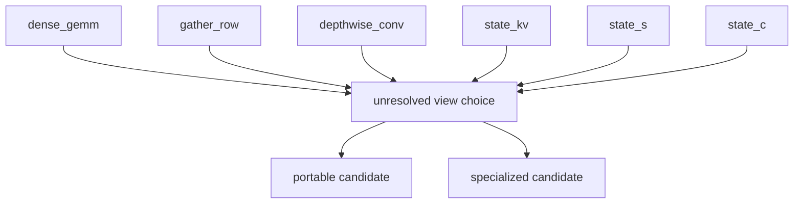

# Physical tensor layouts from consumers

> **Draft status:** conclusions in this document are **unverified** until the verification stage completes.

Phase 1 **hardware-independent candidate layout space** for Qwen3.8-27B
language+MTP **weights and persistent state**. Analyze logical dimensions,
consumers, access, tiling, alignment, and conversion for every layout
object. Include GDN \(S\), depthwise convolution \(W^{\text{conv}}\) /
\(C\), and KV \(K,V\) as first-class objects. Fill TASK-09
`seq_specialized_tile` with a **named candidate space** (orderings, tile
families, conversion hypotheses). Keep the ledger open question (which
planned parallel decompositions justify each candidate ordering and tile)
**unresolved**. This document specifies a **hardware-independent candidate
layout space**, not kernels and not a selected layout.

Prefill and decode share **one** compiled artifact (TASK-09) and **one**
semantic graph (TASK-11 via the schedules). This document names
**candidate layouts** of weights and persistent state for **both**
schedule consumers. Distinct **views** remain unselected
(`decode_prefill_distinct_views_selected` false). Listing a decode-GEMV
ordering and a prefill-GEMM ordering is not selecting dual views. If a
rank, access class, sequence id, stage kind, family mapping, or cited
byte would disagree with TASK-09/13/14 or sitting `text_config`, the
earlier document / config wins and this one is wrong.

Claims are labelled OBSERVED (sitting `text_config` / inventory already
established), DERIVED (axis names and ranks from TASK-02 via TASK-09/13/14,
byte identities cited from TASK-04/06, group-payload grains cited from
TASK-09, divisibility of locked widths by tile-extent candidates), or
HYPOTHESIS (every ordering/tile **usefulness**, every conversion-cost
**usefulness**, every parallel-decomposition **justification**, every
layout-risk severity). No MEASURED tok/s or NLL. No selected layout,
tile, view split, or kernel.

## Authority

| Item | Value | Label |
| --- | --- | --- |
| Dossier | [`docs/architecture/tasks/TASK-15.md`](tasks/TASK-15.md) | — |
| Runtime format | [`docs/architecture/runtime-format-design.md`](runtime-format-design.md) (TASK-09) | seven sequences, access classes, packing grains |
| Decode plan | [`docs/architecture/decode-plan.md`](decode-plan.md) (TASK-13) | GEMV consumers, populated incoming state |
| Prefill plan | [`docs/architecture/prefill-plan.md`](prefill-plan.md) (TASK-14) | GEMM consumers, tiling axes, unselected views |
| Inventory | [`docs/architecture/model-inventory.md`](model-inventory.md) (TASK-01) via TASK-09/13/14 | OBSERVED |
| Config | [`.cache/authorities/qwen3.8-27b-transformers/config.json`](../../.cache/authorities/qwen3.8-27b-transformers/config.json) `text_config` | OBSERVED |
| Checker | [`scripts/check_layout_strategy.py`](../../scripts/check_layout_strategy.py) | DERIVED |
| Evidence policy | [`docs/architecture/plan.md`](plan.md) (OBSERVED / DERIVED / HYPOTHESIS) | OBSERVED |
| In scope | Language+MTP weight and persistent-state candidate layouts; six-way analysis; GDN / conv / KV | — |
| Deferred | Vision encoder internals; TASK-17 CUDA mappings; activation working buffers | — |
| Scope of this document | Hardware-independent candidate layout space — not kernels and not a selected layout | — |

Numeric ranks instantiate sitting `text_config` OBSERVED: `hidden_size`
5120, `intermediate_size` 17408, `vocab_size` 248320, 64 decoder layers,
48 linear + 16 full at \(\ell \bmod 4 = 3\), `mtp_num_hidden_layers` 1,
`head_dim` 256, `num_attention_heads` 24, `num_key_value_heads` 4, GQA
\(g_\text{qa}=6\), `linear_key_head_dim` / `linear_value_head_dim` 128,
`linear_num_value_heads` 48, `linear_conv_kernel_dim` 4, delay 3,
\(d_\text{qkv}=10240\), `dtype` `"bfloat16"`, `mamba_ssm_dtype`
`"float32"`. Axis ranks and cited bytes are DERIVED. Ordering, tile,
conversion, and justification **usefulness** remains HYPOTHESIS.

Quartz and llama.cpp inspection are deferred until freeze. GGUF is not
the runtime format. Safetensors is the source checkpoint, not the runtime
artifact.

## Layout convention

Logical values in this document are graph nodes. They do not imply physical allocation, materialization, buffer reuse, or kernel fusion.

Candidate layouts in this document are consumer-driven orderings and tiles, not selected winners and not CUDA mappings.

Alignment and conversion in this document are named capabilities and hypotheses, not a selected pack-to-layout pipeline.

Which planned parallel decompositions justify each candidate ordering and tile remains open until CUDA analysis.

This document makes no optimality claim before CUDA analysis.

JSON: `canonical_sentence_logical` = sentence 1; `canonical_sentence_candidates`
= sentence 2; `canonical_sentence_conversion` = sentence 3;
`canonical_sentence_open_question` = sentence 4;
`canonical_sentence_optimality` = sentence 5. Sentence 4 **keeps** the
ledger open question unresolved in checker-substring form. JSON
`ledger_open_question_parallel_decomposition_closed` false. Sentence 5
**closes** the third completion criterion as a prohibition, not as a
selected layout.

- Seven layout objects are complete for this task and equal the seven
  TASK-09 `access_class_ids` (`n_layout_objects` 7).
- A layout object is a named rank + axis set with candidate orderings and
  tile families. Listing a candidate is not selecting it
  (`n_orderings_selected` 0, `tile_size_selected` false).
- Analysis dimensions are complete: logical dimensions, consumers, access,
  tiling, alignment, conversion (`n_analysis_dimensions` 6).
- GDN, convolution, and KV are included (`n_persistent_state_coverages` 3).
- Prefill and decode share one artifact; distinct views remain unselected
  (`decode_prefill_distinct_views_selected` false).
- Activations are out of layout scope (`activations_in_layout_scope`
  false). \(T\) on prefill GEMM is a consumer axis of weight layouts.
- Unique weights are counted once (`weight_unique_counted_once` true).
- Fan-out ≠ must-store and logical ≠ physical still hold.
- Primary coverage includes MTP KV (17 instances) and 48 GDN/conv
  instances. Hardware mapping is TASK-17. Fusion winners remain TASK-12
  hypotheses. Ideal byte sequence remains TASK-09 open.
  `seq_specialized_tile` candidates are named here without selecting that
  sequence.
- No thread geometry (`thread_geometry_absent` true). No optimality claim
  (`optimality_claim_absent` true).

A layout object is not a CUDA buffer. Checkpoint orientation
\((d_\text{out},d_\text{in})\) is the **source** rank, not a required
physical order. Unique weight bytes are counted **once** per complete
decode/prefill; layout does not restream the model
(`payloads_restreamed` false). Algebraic equivalents in TASK-02 are the
same real map: GQA-as-repeat does **not** store repeated KV; paper
\(S^\top\) (19) is the same map as (17)–(18); chunkwise GDN is not zero
\(S\) traffic; conv delay is 3 stored vectors, not a length-4 buffer with
a current-token slot as extra math.

## Logical dimensions

JSON array `layout_object_ids` in this exact order (7 ids) — **same as**
TASK-09 `access_class_ids`. JSON `n_layout_objects` = 7. Parallel
`layout_object_ranks`. JSON object `layout_object_axes` keyed in that
order. Completes analysis dimension `logical_dimensions`.

| id | Rank | Axes (logical, checkpoint-facing) | Source rank |
| --- | ---: | --- | --- |
| `gather_row` | 2 | `vocab`, `hidden` | \(E\in\mathbb{R}^{V\times H}=(248320,5120)\) |
| `dense_gemm` | 2 | `d_out`, `d_in` | \(W\in\mathbb{R}^{d_\text{out}\times d_\text{in}}\), \(y=Wx\) |
| `depthwise_conv` | 2 | `channel`, `tap` | squeezed \((10240,4)\); checkpoint \((10240,1,4)\) |
| `vector_param` | 1 | `width` | \(\gamma\in\mathbb{R}^{H}\) or \(A_\log,d_t\in\mathbb{R}^{48}\) or \(\gamma^z\in\mathbb{R}^{128}\) or \(\gamma_{q,k}\in\mathbb{R}^{256}\) |
| `state_kv` | 3 | `n_kv`, `T`, `d_h` | \(K,V\in\mathbb{R}^{4\times T\times 256}\) each |
| `state_c` | 2 | `delay`, `channel` | \(C\in\mathbb{R}^{3\times 10240}\) |
| `state_s` | 3 | `n_v`, `d_k`, `d_v` | \(S\in\mathbb{R}^{48\times 128\times 128}\) conceptual F32 |

JSON `layout_object_ranks` `[2,2,2,1,3,2,3]`. JSON `layout_object_axes`:

- `gather_row`: `["vocab","hidden"]`
- `dense_gemm`: `["d_out","d_in"]`
- `depthwise_conv`: `["channel","tap"]`
- `vector_param`: `["width"]`
- `state_kv`: `["n_kv","T","d_h"]`
- `state_c`: `["delay","channel"]`
- `state_s`: `["n_v","d_k","d_v"]`

JSON array `analysis_dimension_ids` in this exact order (6 ids). JSON
`n_analysis_dimensions` = 6: `logical_dimensions`, `consumers`, `access`,
`tiling`, `alignment`, `conversion`.

JSON array `persistent_state_coverage_ids` in this exact order (3 ids).
JSON `n_persistent_state_coverages` = 3: `gdn`, `convolution`, `kv`.

Family mapping copies TASK-09 `policy_families` and
`family_access_class` / `family_access_class_values` exactly. JSON
`family_layout_object` equals `family_access_class` (same 16 keys;
`vision_deferred` is JSON `null`). Every defined family remains packable
as `keep_source` and as that family’s TASK-08 candidates; this document
does not recopy the recipe grid.

| family | `family_access_class` / `family_layout_object` |
| --- | --- |
| `norm_gamma` | `vector_param` |
| `gdn_time_param` | `vector_param` |
| `gdn_gate_proj` | `dense_gemm` |
| `conv1d` | `depthwise_conv` |
| `linear_large_proj` | `dense_gemm` |
| `attn_qkv` | `dense_gemm` |
| `attn_out` | `dense_gemm` |
| `mlp_up_gate` | `dense_gemm` |
| `mlp_down` | `dense_gemm` |
| `embed_table` | `gather_row` |
| `lm_head` | `dense_gemm` |
| `mtp_fc` | `dense_gemm` |
| `vision_deferred` | `null` |
| `state_kv` | `state_kv` |
| `state_c` | `state_c` |
| `state_s` | `state_s` |

`lm_head` is `dense_gemm` despite matching embed shape
`(248320, 5120)` (`lm_head_uses_dense_gemm_object` true;
`embed_lm_head_tied` false). Embed is `gather_row`, not GEMM
(`embed_uses_gather_row_object` true). Conv1d uses squeezed rank-2.

Instantiated widths (OBSERVED / DERIVED from `text_config`):
`hidden_size` 5120, `intermediate_size` 17408, `vocab_size` 248320,
`head_dim` 256, `num_attention_heads` 24, `num_key_value_heads` 4,
`g_qa` 6, `linear_key_head_dim` / `linear_value_head_dim` 128,
`linear_num_value_heads` 48, `linear_conv_kernel_dim` 4,
`linear_conv_delay` 3, `d_qkv` 10240, `n_full_layers_with_kv` 17,
`n_linear_layers` 48. JSON `g_qa` =
`num_attention_heads // num_key_value_heads` = 6. JSON `d_qkv` = 10240.
JSON `linear_conv_delay` = `linear_conv_kernel_dim - 1` = 3.

Checkpoint orientation is the **logical** rank. Physical order is an
unselected candidate. GQA repeat is **not** a stored axis of `state_kv`.
Paper \(S^\top\) is not a second state object; it is an unselected
ordering of `state_s`.

## Consumers

JSON array `consumer_mode_ids` in this exact order (2 ids). JSON
`n_consumer_modes` = 2: `decode_gemv`, `prefill_gemm`. Neither mode
selects a layout. JSON `n_consumer_modes_selected` = 0. Completes
analysis dimension `consumers`.

JSON array `stage_kind_ids` copied from TASK-13/14 in TASK-13/14 order
(9 ids). JSON `n_stage_kinds` = 9. Cite; do not rewrite the serial order:
`embed_current`, `language_mixer`, `language_mlp`, `lm_head_primary`,
`embed_next`, `mtp_mix`, `mtp_mixer`, `mtp_mlp`, `lm_head_mtp`.

| Object | Decode consumer (TASK-13) | Prefill consumer (TASK-14) | Primary sequence attachment |
| --- | --- | --- | --- |
| `gather_row` | One (language) or two (complete) rows of shared \(E\); table not streamed | \(T\) or \(2T\) rows | `seq_gather_row` |
| `dense_gemm` | GEMV \(x\in\mathbb{R}^{H}\); unique weights once; `lm_head` streams 2542796800 B-class table (`seq_lm_head_full`) | GEMM with sequence axis \(T\); unique weights once per prompt, reused across \(T\) | `seq_gemm_codes_then_scales`; `lm_head` stages use `seq_lm_head_full` |
| `depthwise_conv` | FIR `(14)` on one token; 4 taps, delay 3 | FIR over the length-\(T\) stream; delay still 3 stored | none of the seven sequences is conv-specific; `seq_specialized_tile` is an unselected view |
| `vector_param` | Elementwise \(\gamma\), \(A_\log\), \(d_t\) | Same, rank \(T\) on the activation, not on the parameter | none |
| `state_kv` | Read length \(T-1\), write 1 token; GQA consume with 24 queries | Triangular read, write \(T\) tokens; causal MM | none dedicated |
| `state_c` | Read 3 taps, write 1 QKV vector | From zeros (0 physical on first token); write each step | none dedicated |
| `state_s` | Read/write full \(S\) 150994944 B/step conceptual F32 | From zeros; write \(S_t\) each step; surviving store is not \(T\times B_S\) | `seq_state_s_dense` |

JSON `layout_object_primary_sequence_ids` in `layout_object_ids` order:
`["seq_gather_row","seq_gemm_codes_then_scales",null,null,null,null,"seq_state_s_dense"]`.
JSON `lm_head_sequence_id` = `seq_lm_head_full`. JSON
`gated_delta_net_state_sequence_id` = `seq_state_s_dense`. Attaching a
sequence is **not** selecting an ideal byte sequence. JSON
`n_layout_object_primary_sequences` = 3 (the non-null attachments).

Mixer xor still holds: `language_mixer` consumes `state_kv` **xor**
`(state_c, state_s)` by layer type. MTP mixer consumes only `state_kv`.
Depthwise conv is a GDN-layer weight consumer, not a full-attention
consumer. JSON `example_T` `[1, 4096]`. JSON
`T_is_stored_length_after_append` true. JSON `primary_includes_mtp` true.

## Access

JSON array `access_class_ids` copied from TASK-09 in TASK-09 order (7
ids). JSON `n_access_classes` = 7. JSON `layout_object_ids` **equals**
`access_class_ids`. Completes analysis dimension `access`.

JSON array `consumer_sequence_ids` copied from TASK-09 in TASK-09 order
(7 ids). JSON `n_consumer_sequences` = 7: `seq_gemm_codes_then_scales`,
`seq_gemm_interleaved_group`, `seq_gather_row`, `seq_lm_head_full`,
`seq_outlier_extra`, `seq_state_s_dense`, `seq_specialized_tile`. JSON
`ideal_byte_sequence_selected` false.

Access identities (DERIVED citations, not a new traffic study):

- Embed gather is 0 MAC, 10240 B/row BF16 (TASK-06). `row_addressable`
  remains a required packing **capability**; stride/pad remain open
  (TASK-09).
- Decode GEMMs have TASK-06 \(I=1\) vs unique weights for MLP/`lm_head`
  (citation; bottleneck label `weight_memory` / `vocab_memory` remains
  HYPOTHESIS).
- Prefill reuses those unique bytes across \(T\)
  (`weight_unique_counted_once`; TASK-06 `compute` label remains
  HYPOTHESIS).
- GQA: 24 query heads read 4 stored KV heads with \(g_\text{qa}=6\).
  Stored rank stays \((4,T,256)\); repeated KV is not stored
  (`gqa_repeat_not_stored` true).
- RoPE is baked into stored \(K\) before the cache (`kv_rope_baked_into_k`
  true). Stored \(K\) has no extra rotary axis.
- GDN \(S\) access is the dense recurrent update (17) plus
  \(S^\top \tilde q\) (18). `seq_state_s_dense` names that dense
  read/write; it is not a selected layout.
- Conv access is per-channel FIR over 4 taps. \(z\) does not enter the
  convolution (`conv_z_does_not_enter_conv` true).

A packing convenient for `seq_gemm_interleaved_group` may break
`seq_gather_row` (HYPOTHESIS, cite TASK-09 `f_gather_stride`). Do not
rank sequences by wall time. Do not name CUDA kernels.
`seq_specialized_tile` is a **view** sequence, not an eighth access
class; this document names candidates it could store
(`seq_specialized_tile_candidates_named` true) without selecting it.
TASK-09 `view_binding` remains a capability, not a decode/prefill split.

## Candidate orderings and tiling

JSON array `ordering_ids` in this exact order (14 ids). JSON
`n_orderings` = 14. Parallel `ordering_object_ids`. JSON
`n_orderings_selected` = 0. JSON `ordering_selected` false. JSON
`ordering_usefulness_label` exactly `HYPOTHESIS`. Completes analysis
dimension `tiling` (and names orderings).

| id | Object | Axis order (fastest last) | Meaning |
| --- | --- | --- | --- |
| `ord_gemm_out_major` | `dense_gemm` | `d_out`, `d_in` | Checkpoint orientation; row of \(W\) contiguous |
| `ord_gemm_in_major` | `dense_gemm` | `d_in`, `d_out` | Transpose pack; \(d_\text{in}\) contiguous |
| `ord_embed_vocab_major` | `gather_row` | `vocab`, `hidden` | One vocab row contiguous (`row_addressable`-friendly) |
| `ord_embed_hidden_major` | `gather_row` | `hidden`, `vocab` | Hidden-major; gather may be strided (pairs with `f_gather_stride`) |
| `ord_conv_channel_tap` | `depthwise_conv` | `channel`, `tap` | 4 taps of one channel contiguous (FIR inner sum) |
| `ord_conv_tap_channel` | `depthwise_conv` | `tap`, `channel` | Tap-major across 10240 channels |
| `ord_vec_width` | `vector_param` | `width` | Sole rank-1 order |
| `ord_kv_n_t_dh` | `state_kv` | `n_kv`, `T`, `d_h` | TASK-02 rank |
| `ord_kv_n_dh_t` | `state_kv` | `n_kv`, `d_h`, `T` | Token index last |
| `ord_kv_t_n_dh` | `state_kv` | `T`, `n_kv`, `d_h` | Sequence-major |
| `ord_c_delay_channel` | `state_c` | `delay`, `channel` | TASK-02 \(3\times 10240\) |
| `ord_c_channel_delay` | `state_c` | `channel`, `delay` | 3 taps of one channel contiguous |
| `ord_s_n_dk_dv` | `state_s` | `n_v`, `d_k`, `d_v` | TASK-02 \(S\) (17)–(18) |
| `ord_s_n_dv_dk` | `state_s` | `n_v`, `d_v`, `d_k` | Paper \(S^\top\) store (19); same map |

JSON `ordering_object_ids`
`["dense_gemm","dense_gemm","gather_row","gather_row","depthwise_conv","depthwise_conv","vector_param","state_kv","state_kv","state_kv","state_c","state_c","state_s","state_s"]`.

Every object has at least one ordering. Do not mark any `selected`,
`required`, or `optimal`. Do not drop `ord_embed_hidden_major` because it
is gather-hostile; listing it is the candidate space.

JSON array `tile_family_ids` in this exact order (9 ids). JSON
`n_tile_families` = 9. JSON object `tile_family_objects`. JSON
`tile_size_selected` false. JSON `mma_tile_extents_selected` false. JSON
`tile_usefulness_label` exactly `HYPOTHESIS`.

| id | Objects | Meaning |
| --- | --- | --- |
| `tile_none` | all seven | No blocking beyond the ordering |
| `tile_2d_mn` | `dense_gemm` | 2D tiles on \((d_\text{out},d_\text{in})\) |
| `tile_1d_row` | `gather_row` | Tiles along `hidden` inside one vocab row |
| `tile_conv_channel` | `depthwise_conv`, `state_c` | Tiles along 10240 channels |
| `tile_kv_t` | `state_kv` | Tiles along stored length \(T\) |
| `tile_kv_dh` | `state_kv` | Tiles along `d_h` |
| `tile_s_head` | `state_s` | One \(128\times 128\) head as the tile |
| `tile_s_block` | `state_s` | Blocks inside a head matrix |
| `tile_mma_shaped` | `dense_gemm` | MMA-ready extents; **extents unselected** (SKU MMA shapes remain TASK-16 / TASK-17) |

`tile_mma_shaped` names an unselected family; naming it is not selecting
an MMA instruction.

JSON `tile_family_objects`:

- `tile_none`: `["gather_row","dense_gemm","depthwise_conv","vector_param","state_kv","state_c","state_s"]`
- `tile_2d_mn`: `["dense_gemm"]`
- `tile_1d_row`: `["gather_row"]`
- `tile_conv_channel`: `["depthwise_conv","state_c"]`
- `tile_kv_t`: `["state_kv"]`
- `tile_kv_dh`: `["state_kv"]`
- `tile_s_head`: `["state_s"]`
- `tile_s_block`: `["state_s"]`
- `tile_mma_shaped`: `["dense_gemm"]`

JSON array `tile_extent_candidates` `[16, 32, 64, 128, 256]`. These are
the TASK-09 `alignment_grain_candidates` excluding `1`. They are
**candidates**, not selected tiles. JSON `n_tile_extent_candidates` = 5.

Divisibility (DERIVED; checker recomputes from `text_config`; do not use
to pick a winner):

| Extent | \(H=5120\) | \(I=17408\) | \(d_\text{qkv}=10240\) | \(d_h=256\) | \(d_k=128\) |
| ---: | --- | --- | --- | --- | --- |
| 16 | yes | yes | yes | yes | yes |
| 32 | yes | yes | yes | yes | yes |
| 64 | yes | yes | yes | yes | yes |
| 128 | yes | yes | yes | yes | yes |
| 256 | yes | yes | yes | yes | **no** |

JSON `tile_extent_divides_hidden` all true. JSON
`tile_extent_divides_intermediate` all true. JSON
`tile_extent_divides_d_qkv` all true. JSON
`tile_extent_divides_head_dim` all true. JSON `tile_extent_divides_dk`
`[true,true,true,true,false]`. JSON
`n_v_divides_none_of_extents_as_head_count` true (48 is not
16/32/64/128/256); `tile_s_head` uses one head, not an extent from that
list.

Naming an extent that divides a width is not selecting it. Prefill’s
sequence axis \(T\) is a **tile axis** of activations and of `state_kv`;
it is not a weight-tensor axis. Decode GEMV has no sequence tile on
weights (`diff_tiling` citation). `tile_mma_shaped` must not instantiate
an MMA \((M,N,K)\) from a datasheet.

## Alignment and conversion

JSON `alignment_grain_candidates` copied from TASK-09:
`[1, 16, 32, 128, 256]`. JSON `alignment_grain_selected` false. JSON
`specialized_alignment_grain_selected` false. JSON
`specialized_view_may_constrain_alignment` true (TASK-09 already allowed
TASK-15 to constrain specialized views). This document **does not** close
TASK-09 `alignment_grain`. Completes analysis dimensions `alignment` and
`conversion`.

Cited group-payload grains (TASK-09; not a new packing study):

| JSON key | Value |
| --- | ---: |
| `int4_g32_group_payload_bytes` | 16 |
| `int3_g32_group_payload_bytes` | 12 |
| `int2_g32_group_payload_bytes` | 8 |
| `int4_row_hidden_payload_bytes` | 2560 |
| `int6_row_hidden_payload_bytes` | 3840 |
| `embed_gather_int4_row_bytes` | 2562 |
| `embed_gather_bf16_bytes` | 10240 |

JSON `scale_storage_bytes_candidates` `[2, 4]` unselected. JSON
`scale_placement_candidates` `["sidecar_array","interleaved_group"]`
unselected. JSON `code_bit_order_candidates`
`["lsb_first","msb_first"]` unselected. Portable view payloads remain
little-endian (`portable_payload_little_endian` true). Specialized views
may swizzle (candidates above); swizzle is not selected.

JSON array `conversion_hypothesis_ids` in this exact order (4 ids). JSON
`n_conversion_hypotheses` = 4. JSON `n_conversion_hypotheses_selected` =
0. JSON `conversion_pipeline_selected` false. JSON
`conversion_usefulness_label` exactly `HYPOTHESIS`.

| id | Meaning | Pairs with TASK-09 |
| --- | --- | --- |
| `conv_compile_pack` | Offline pack emits a specialized layout into the artifact | `backend_specialized_only` / specialized view of `portable_plus_specialized_views` |
| `conv_load_repack` | Portable view converted at load | `portable_only` `load_convert`; TASK-08 `d_weight_dequant` |
| `conv_inkernel_unpack` | Consumer unpacks/dequants in the contraction | `portable_only`; format risk `f_unpack_portable` |
| `conv_dual_view` | Store portable and specialized copies | Illustration F size DERIVED 26863340064 B if two full int4-g128 unique-non-embed copies; **impact** HYPOTHESIS |

Do not select a conversion pipeline. Dual-view **size** may be cited from
TASK-09 illustration F; do not recommend storing two views. JSON
`dual_view_int4_g128_unique_non_embed_bytes` 26863340064 (citation).

Align identity (citation of TASK-09, not a selected grain):

\[
B_{\text{aligned}}=\Bigl\lceil B_{\text{payload,pack}}/A\Bigr\rceil A.
\]

int3 g32 is 12 bytes, not a power of two (DERIVED). Whether that forbids
a specialized grain is HYPOTHESIS (`l_int3_grain`; pairs with TASK-09
`f_3bit_shift`). int4 g32 is 16 bytes (DERIVED). Whether specialized
views must pad to a multiple of 16 is HYPOTHESIS, not a close of
`alignment_grain`.

## GDN, convolution, and KV persistent state

Three required persistent-state coverages. Completes ledger checkbox 2.
JSON `includes_gdn` / `includes_convolution` / `includes_kv` true.

### GDN

Consumers: 48 `gated_delta_net` language mixers (TASK-13/14 xor).
Weights: \(W_\text{qkv}\in\mathbb{R}^{10240\times 5120}\) (`dense_gemm`),
\(W_z\in\mathbb{R}^{6144\times 5120}\) (`dense_gemm`),
\(W_a,W_b\in\mathbb{R}^{48\times 5120}\) (`dense_gemm`, family
`gdn_gate_proj`), \(A_\log,d_t\in\mathbb{R}^{48}\) (`vector_param`,
family `gdn_time_param`), \(W^{\text{conv}}\) (`depthwise_conv`),
\(W_\text{out}\in\mathbb{R}^{5120\times 6144}\) (`dense_gemm`). State
\(S\): rank \((48,128,128)\) F32, 3145728 B/layer, 150994944 B all-48
(`s_bytes_per_layer`, `s_f32_bytes`). Decode reads and writes the full
matrix each step; prefill starts from zeros (0 physical on the first
token) and writes \(S_t\) each step. Primary recurrence is (17)–(18)
(`gdn_primary_is_recurrent_eq_17`). Paper (19) \(S^\top\) is the same
map (`paper_s_transpose_same_map`). Chunkwise GDN is not zero \(S\)
traffic (`chunkwise_not_zero_s_traffic`). Candidate orderings
`ord_s_n_dk_dv`, `ord_s_n_dv_dk`. Candidate tiles `tile_s_head`,
`tile_s_block`. Sequence attachment `seq_state_s_dense`. TASK-06
`i_gdn_vs_s_rw` 0.75 and bottleneck label `state_memory` remain
HYPOTHESIS citations.

### Convolution

Weight \(W^{\text{conv}}\in\mathbb{R}^{10240\times 1\times 4}\) squeezed
\((10240,4)\), family `conv1d`, access `depthwise_conv`. FIR (14) over
\(k_\text{conv}=4\) taps; stored delay \(k_\text{conv}-1=3\). \(z\) does
not enter the convolution. State \(C\): rank \((3,10240)\) BF16, 61440
B/layer, 2949120 B all-48 (`c_bytes_per_layer`, `c_bytes_all`). Decode
reads 3 taps and writes one new QKV vector (do not count rewriting
retained taps as new writes). Prefill from zeros: first-token physical
read 0. Candidate orderings `ord_conv_channel_tap`,
`ord_conv_tap_channel`, `ord_c_delay_channel`, `ord_c_channel_delay`.
Candidate tile `tile_conv_channel`. No dedicated TASK-09 sequence.

### KV persistent state

\(K,V\) each \((4,T,256)\) BF16; 4096 B/token/instance; 69632 B/token
across 17 instances including MTP (`kv_bytes_per_full_layer_per_token`,
`kv_bytes_all_per_token`). Full-attention layers only; linear layers have
no KV. RoPE baked into stored \(K\). GQA repeat not stored. Decode: read
\(T-1\), write 1. Prefill: triangular read \(69632\cdot T(T-1)/2\), write
\(69632T\). Attention consumer is (9) with 24 queries against 4 KV heads.
Candidate orderings `ord_kv_n_t_dh`, `ord_kv_n_dh_t`, `ord_kv_t_n_dh`.
Candidate tiles `tile_kv_t`, `tile_kv_dh`. Writes are not optional
(`state_write_not_optional` true). Bottleneck label `kv_memory` /
`quadratic_attn` remain HYPOTHESIS citations.

Omitting a KV/\(C\)/\(S\) write changes the map. Surviving store after
prefill is TASK-04 \(B_\text{store}(T)=69632T+153944064\), not
\(T\times B_S\). Layout of state is independent of whether zero templates
live in the artifact (`state_payload_in_artifact_selected` false remains
TASK-09 open).

## Parallel decompositions

This heading enumerates planned parallel decompositions and **unselected**
pairing hypotheses. It does **not** close the ledger open question. JSON
`ledger_open_question_parallel_decomposition_closed` false. JSON
`parallel_decomposition_justifies_layout_selected` false. JSON
`justification_usefulness_label` exactly `HYPOTHESIS`. JSON
`n_parallel_decompositions_selected` = 0. JSON
`parallel_decomposition_selected` false.

JSON array `parallel_decomposition_ids` in this exact order (9 ids). JSON
`n_parallel_decompositions` = 9.

| id | Split axis | Consumer |
| --- | --- | --- |
| `par_gemm_d_out` | `d_out` | decode GEMV / prefill GEMM |
| `par_gemm_d_in` | `d_in` (partial reduction) | same |
| `par_gemm_T` | sequence \(T\) | prefill GEMM only |
| `par_attn_head` | 24 query heads | gated attention core |
| `par_attn_T` | stored length \(T\) | attention vs KV |
| `par_gdn_head` | 48 value heads | GDN (17)–(18) |
| `par_conv_channel` | 10240 channels | FIR (14) |
| `par_kv_head` | 4 KV heads | KV layout vs GQA consume |
| `par_embed_row` | independent vocab rows | gather; not a split of one row |

JSON array `justification_hypothesis_ids` in this exact order (10 ids).
JSON `n_justification_hypotheses` = 10. JSON
`n_justification_hypotheses_selected` = 0.

| id | Ordering or tile | Decomposition | Claim (must remain HYPOTHESIS) |
| --- | --- | --- | --- |
| `j_gemm_out_major_par_d_out` | `ord_gemm_out_major` | `par_gemm_d_out` | Out-major matches a \(d_\text{out}\) split |
| `j_gemm_in_major_par_d_in` | `ord_gemm_in_major` | `par_gemm_d_in` | In-major matches a \(K\)-split |
| `j_gemm_tile_2d_par_T` | `tile_2d_mn` | `par_gemm_T` | 2D weight tiles match a prefill \(T\) split |
| `j_embed_vocab_major_par_row` | `ord_embed_vocab_major` | `par_embed_row` | Vocab-major matches row gather |
| `j_conv_channel_tap_par_channel` | `ord_conv_channel_tap` | `par_conv_channel` | Channel-tap matches a channel split |
| `j_kv_n_t_dh_par_head` | `ord_kv_n_t_dh` | `par_kv_head` | TASK-02 KV order matches a KV-head split |
| `j_kv_n_dh_t_par_T` | `ord_kv_n_dh_t` | `par_attn_T` | Token-last KV matches a sequence split |
| `j_s_n_dk_dv_par_head` | `ord_s_n_dk_dv` | `par_gdn_head` | \(S\) as (17) matches a head split |
| `j_s_n_dv_dk_par_head` | `ord_s_n_dv_dk` | `par_gdn_head` | \(S^\top\) store matches a head split |
| `j_mma_shaped_unselected_par` | `tile_mma_shaped` | (unspecified CUDA) | MMA tiles need TASK-17 to name a decomposition |

Listing a justification hypothesis is not selecting a parallel decomposition and does not justify a candidate ordering or tile.

JSON `canonical_sentence_justification` equals that sentence.

Do not rank hypotheses by wall time. Do not treat a pairing table as CUDA
evidence. TASK-17 may instantiate these hypotheses; this task must not.

Candidate objects versus portable and specialized views, with the ledger
pairing question left as HYPOTHESIS and unresolved:



Layout-risk hypotheses (every severity is HYPOTHESIS). JSON array
`layout_risk_ids` in this exact order (8 ids). Parallel
`layout_risk_severities`. JSON `n_layout_risks` = 8.

| ID | Ties to | Severity | Claim (must remain HYPOTHESIS) |
| --- | --- | --- | --- |
| `l_gemm_vs_gather` | `f_gather_stride` | medium | A GEMM-friendly order may make embed-row gather non-contiguous |
| `l_decode_vs_prefill_view` | TASK-14 views | medium | One order may not serve GEMV and GEMM equally; this does **not** select distinct views |
| `l_s_transpose` | (17) vs (19) | medium | Storing \(S\) vs \(S^\top\) changes inner-loop axes |
| `l_kv_append` | KV orderings | medium | \(T\)-last vs \(T\)-middle changes append versus scan |
| `l_conv_fir_stride` | conv orderings | medium | Tap-major vs channel-major changes FIR stride |
| `l_convert_cost` | `f_unpack_portable` | high | Compile/load/in-kernel conversion may add decode traffic |
| `l_int3_grain` | `f_3bit_shift` | medium | int3 12-byte groups may not match power-of-two tiles |
| `l_mma_sku_unknown` | `tile_mma_shaped` | low | MMA-shaped tiles cannot be justified without TASK-16/17 |

JSON `layout_high_ids`: `l_convert_cost`. `layout_medium_ids`:
`l_gemm_vs_gather`, `l_decode_vs_prefill_view`, `l_s_transpose`,
`l_kv_append`, `l_conv_fir_stride`, `l_int3_grain`. `layout_low_ids`:
`l_mma_sku_unknown`. JSON `n_layout_high` = 1, `n_layout_medium` = 6,
`n_layout_low` = 1. JSON `layout_risk_severities`
`["medium","medium","medium","medium","medium","high","medium","low"]`.

## Work citations and non-decisions

Cite; do not recopy TASK-06 symbolic tables. Checker **recomputes** state
bytes from `text_config` with the same identities as TASK-04/06:

- `kv_bytes_per_full_layer_per_token` = \(2\cdot n_\text{kv}\cdot d_h\cdot 2=4096\)
- `kv_bytes_all_per_token` = \(4096\times 17=69632\)
- `c_bytes_per_layer` = \(3\cdot d_\text{qkv}\cdot 2=61440\)
- `c_bytes_all` = \(61440\times 48=2949120\)
- `s_bytes_per_layer` = \(n_v\cdot d_k\cdot d_v\cdot 4=3145728\)
- `s_f32_bytes` = \(3145728\times 48=150994944\)
- `s_bf16_bytes` = 75497472 (TASK-09 illustration D; **not** a selected store dtype)
- `weight_bytes_lm_head` = \(V\cdot H\cdot 2=2542796800\)
- `embed_gather_bf16_bytes` = \(H\cdot 2=10240\)
- `dual_view_int4_g128_unique_non_embed_bytes` = 26863340064 (TASK-09 illustration F citation)

JSON `bottleneck_labels` copied from TASK-06: `weight_memory`,
`vocab_memory`, `state_memory`, `kv_memory`, `quadratic_attn`, `compute`.
Restating a label here is a **citation**, still HYPOTHESIS. JSON
`n_bottleneck_labels` = 6. JSON `i_mlp_weight_only` 1,
`i_lm_head_weight_only` 1, `i_gdn_vs_s_rw` 0.75, `i_attn_core_vs_kv` 6
(decode identity cited; do not invent a layout-ridge winner).

Non-decisions: TASK-17 owns CUDA mappings per node type **and** which (if
any) candidate layout to instantiate. TASK-16 SKU limits are not filled
from a datasheet. TASK-09 still owns artifact-boundary,
ideal-sequence, scale-storage, scale-placement, alignment-grain, and
code-bit-order **selection**. TASK-12 still owns fusion **winners**
(`fusion_winner_selected` false). TASK-14 still owns decode/prefill
**view** selection (`decode_prefill_distinct_views_selected` false).
TASK-08 still owns recipe **winners**. This layout space does not change
when a TASK-08 recipe is later applied; packing grains stay citations.
The ledger open question remains unresolved.
`tile_layout_deferred_to_task15` is now false because this task owns the
candidate space without selecting a layout
(`layout_winner_selected` false; `ordering_selected` false).

## Deferred vision

Visual tokens may replace placeholders in the residual stream
(`out_hidden_size` 5120 OBSERVED). Encoder / patch embed / merger layouts
are **UNKNOWN**. `vision_deferred` has `family_access_class` null and no
layout object (`vision_interface_is_not_a_node` true). Do not add vision
payloads. The word `UNKNOWN` may appear only in this section of the
deliverable.

## Machine-checkable summary JSON

First fenced `json` object equals a fresh
`scripts/check_layout_strategy.py --json` run against sitting
`text_config`. JSON `n_diagrams` is 1. `diagram_ids` is
`["gemm","gather","conv","kv","gdn","c_state","portable","specialized","open"]`.

```json
{
  "authority": ".cache/authorities/qwen3.8-27b-transformers",
  "hidden_size": 5120,
  "intermediate_size": 17408,
  "vocab_size": 248320,
  "n_decoder_layers": 64,
  "n_linear_layers": 48,
  "n_full_layers": 16,
  "n_mtp_blocks": 1,
  "n_full_layers_with_kv": 17,
  "full_attention_indices": [
    3,
    7,
    11,
    15,
    19,
    23,
    27,
    31,
    35,
    39,
    43,
    47,
    51,
    55,
    59,
    63
  ],
  "head_dim": 256,
  "num_attention_heads": 24,
  "num_key_value_heads": 4,
  "g_qa": 6,
  "linear_key_head_dim": 128,
  "linear_value_head_dim": 128,
  "linear_num_value_heads": 48,
  "linear_conv_kernel_dim": 4,
  "linear_conv_delay": 3,
  "d_qkv": 10240,
  "bytes_bf16": 2,
  "bytes_f32": 4,
  "kv_bytes_per_full_layer_per_token": 4096,
  "kv_bytes_all_per_token": 69632,
  "c_bytes_per_layer": 61440,
  "c_bytes_all": 2949120,
  "s_bytes_per_layer": 3145728,
  "s_f32_bytes": 150994944,
  "s_bf16_bytes": 75497472,
  "embed_gather_bf16_bytes": 10240,
  "embed_gather_int4_row_bytes": 2562,
  "weight_bytes_lm_head": 2542796800,
  "int4_g32_group_payload_bytes": 16,
  "int3_g32_group_payload_bytes": 12,
  "int2_g32_group_payload_bytes": 8,
  "int4_row_hidden_payload_bytes": 2560,
  "int6_row_hidden_payload_bytes": 3840,
  "dual_view_int4_g128_unique_non_embed_bytes": 26863340064,
  "tile_extent_candidates": [
    16,
    32,
    64,
    128,
    256
  ],
  "n_tile_extent_candidates": 5,
  "alignment_grain_candidates": [
    1,
    16,
    32,
    128,
    256
  ],
  "scale_storage_bytes_candidates": [
    2,
    4
  ],
  "scale_placement_candidates": [
    "sidecar_array",
    "interleaved_group"
  ],
  "code_bit_order_candidates": [
    "lsb_first",
    "msb_first"
  ],
  "tile_extent_divides_hidden": [
    true,
    true,
    true,
    true,
    true
  ],
  "tile_extent_divides_intermediate": [
    true,
    true,
    true,
    true,
    true
  ],
  "tile_extent_divides_d_qkv": [
    true,
    true,
    true,
    true,
    true
  ],
  "tile_extent_divides_head_dim": [
    true,
    true,
    true,
    true,
    true
  ],
  "tile_extent_divides_dk": [
    true,
    true,
    true,
    true,
    false
  ],
  "n_v_divides_none_of_extents_as_head_count": true,
  "layout_object_ids": [
    "gather_row",
    "dense_gemm",
    "depthwise_conv",
    "vector_param",
    "state_kv",
    "state_c",
    "state_s"
  ],
  "n_layout_objects": 7,
  "layout_object_ranks": [
    2,
    2,
    2,
    1,
    3,
    2,
    3
  ],
  "layout_object_axes": {
    "gather_row": [
      "vocab",
      "hidden"
    ],
    "dense_gemm": [
      "d_out",
      "d_in"
    ],
    "depthwise_conv": [
      "channel",
      "tap"
    ],
    "vector_param": [
      "width"
    ],
    "state_kv": [
      "n_kv",
      "T",
      "d_h"
    ],
    "state_c": [
      "delay",
      "channel"
    ],
    "state_s": [
      "n_v",
      "d_k",
      "d_v"
    ]
  },
  "layout_object_primary_sequence_ids": [
    "seq_gather_row",
    "seq_gemm_codes_then_scales",
    null,
    null,
    null,
    null,
    "seq_state_s_dense"
  ],
  "n_layout_object_primary_sequences": 3,
  "lm_head_sequence_id": "seq_lm_head_full",
  "gated_delta_net_state_sequence_id": "seq_state_s_dense",
  "access_class_ids": [
    "gather_row",
    "dense_gemm",
    "depthwise_conv",
    "vector_param",
    "state_kv",
    "state_c",
    "state_s"
  ],
  "n_access_classes": 7,
  "policy_families": [
    "norm_gamma",
    "gdn_time_param",
    "gdn_gate_proj",
    "conv1d",
    "linear_large_proj",
    "attn_qkv",
    "attn_out",
    "mlp_up_gate",
    "mlp_down",
    "embed_table",
    "lm_head",
    "mtp_fc",
    "vision_deferred",
    "state_kv",
    "state_c",
    "state_s"
  ],
  "family_access_class": {
    "norm_gamma": "vector_param",
    "gdn_time_param": "vector_param",
    "gdn_gate_proj": "dense_gemm",
    "conv1d": "depthwise_conv",
    "linear_large_proj": "dense_gemm",
    "attn_qkv": "dense_gemm",
    "attn_out": "dense_gemm",
    "mlp_up_gate": "dense_gemm",
    "mlp_down": "dense_gemm",
    "embed_table": "gather_row",
    "lm_head": "dense_gemm",
    "mtp_fc": "dense_gemm",
    "vision_deferred": null,
    "state_kv": "state_kv",
    "state_c": "state_c",
    "state_s": "state_s"
  },
  "family_access_class_values": [
    "vector_param",
    "vector_param",
    "dense_gemm",
    "depthwise_conv",
    "dense_gemm",
    "dense_gemm",
    "dense_gemm",
    "dense_gemm",
    "dense_gemm",
    "gather_row",
    "dense_gemm",
    "dense_gemm",
    null,
    "state_kv",
    "state_c",
    "state_s"
  ],
  "family_layout_object": {
    "norm_gamma": "vector_param",
    "gdn_time_param": "vector_param",
    "gdn_gate_proj": "dense_gemm",
    "conv1d": "depthwise_conv",
    "linear_large_proj": "dense_gemm",
    "attn_qkv": "dense_gemm",
    "attn_out": "dense_gemm",
    "mlp_up_gate": "dense_gemm",
    "mlp_down": "dense_gemm",
    "embed_table": "gather_row",
    "lm_head": "dense_gemm",
    "mtp_fc": "dense_gemm",
    "vision_deferred": null,
    "state_kv": "state_kv",
    "state_c": "state_c",
    "state_s": "state_s"
  },
  "consumer_sequence_ids": [
    "seq_gemm_codes_then_scales",
    "seq_gemm_interleaved_group",
    "seq_gather_row",
    "seq_lm_head_full",
    "seq_outlier_extra",
    "seq_state_s_dense",
    "seq_specialized_tile"
  ],
  "n_consumer_sequences": 7,
  "analysis_dimension_ids": [
    "logical_dimensions",
    "consumers",
    "access",
    "tiling",
    "alignment",
    "conversion"
  ],
  "n_analysis_dimensions": 6,
  "persistent_state_coverage_ids": [
    "gdn",
    "convolution",
    "kv"
  ],
  "n_persistent_state_coverages": 3,
  "consumer_mode_ids": [
    "decode_gemv",
    "prefill_gemm"
  ],
  "n_consumer_modes": 2,
  "n_consumer_modes_selected": 0,
  "stage_kind_ids": [
    "embed_current",
    "language_mixer",
    "language_mlp",
    "lm_head_primary",
    "embed_next",
    "mtp_mix",
    "mtp_mixer",
    "mtp_mlp",
    "lm_head_mtp"
  ],
  "n_stage_kinds": 9,
  "bottleneck_labels": [
    "weight_memory",
    "vocab_memory",
    "state_memory",
    "kv_memory",
    "quadratic_attn",
    "compute"
  ],
  "n_bottleneck_labels": 6,
  "i_mlp_weight_only": 1,
  "i_lm_head_weight_only": 1,
  "i_gdn_vs_s_rw": 0.75,
  "i_attn_core_vs_kv": 6,
  "ordering_ids": [
    "ord_gemm_out_major",
    "ord_gemm_in_major",
    "ord_embed_vocab_major",
    "ord_embed_hidden_major",
    "ord_conv_channel_tap",
    "ord_conv_tap_channel",
    "ord_vec_width",
    "ord_kv_n_t_dh",
    "ord_kv_n_dh_t",
    "ord_kv_t_n_dh",
    "ord_c_delay_channel",
    "ord_c_channel_delay",
    "ord_s_n_dk_dv",
    "ord_s_n_dv_dk"
  ],
  "ordering_object_ids": [
    "dense_gemm",
    "dense_gemm",
    "gather_row",
    "gather_row",
    "depthwise_conv",
    "depthwise_conv",
    "vector_param",
    "state_kv",
    "state_kv",
    "state_kv",
    "state_c",
    "state_c",
    "state_s",
    "state_s"
  ],
  "n_orderings": 14,
  "n_orderings_selected": 0,
  "ordering_usefulness_label": "HYPOTHESIS",
  "tile_family_ids": [
    "tile_none",
    "tile_2d_mn",
    "tile_1d_row",
    "tile_conv_channel",
    "tile_kv_t",
    "tile_kv_dh",
    "tile_s_head",
    "tile_s_block",
    "tile_mma_shaped"
  ],
  "n_tile_families": 9,
  "tile_family_objects": {
    "tile_none": [
      "gather_row",
      "dense_gemm",
      "depthwise_conv",
      "vector_param",
      "state_kv",
      "state_c",
      "state_s"
    ],
    "tile_2d_mn": [
      "dense_gemm"
    ],
    "tile_1d_row": [
      "gather_row"
    ],
    "tile_conv_channel": [
      "depthwise_conv",
      "state_c"
    ],
    "tile_kv_t": [
      "state_kv"
    ],
    "tile_kv_dh": [
      "state_kv"
    ],
    "tile_s_head": [
      "state_s"
    ],
    "tile_s_block": [
      "state_s"
    ],
    "tile_mma_shaped": [
      "dense_gemm"
    ]
  },
  "tile_size_selected": false,
  "mma_tile_extents_selected": false,
  "tile_usefulness_label": "HYPOTHESIS",
  "parallel_decomposition_ids": [
    "par_gemm_d_out",
    "par_gemm_d_in",
    "par_gemm_T",
    "par_attn_head",
    "par_attn_T",
    "par_gdn_head",
    "par_conv_channel",
    "par_kv_head",
    "par_embed_row"
  ],
  "n_parallel_decompositions": 9,
  "n_parallel_decompositions_selected": 0,
  "conversion_hypothesis_ids": [
    "conv_compile_pack",
    "conv_load_repack",
    "conv_inkernel_unpack",
    "conv_dual_view"
  ],
  "n_conversion_hypotheses": 4,
  "n_conversion_hypotheses_selected": 0,
  "conversion_usefulness_label": "HYPOTHESIS",
  "justification_hypothesis_ids": [
    "j_gemm_out_major_par_d_out",
    "j_gemm_in_major_par_d_in",
    "j_gemm_tile_2d_par_T",
    "j_embed_vocab_major_par_row",
    "j_conv_channel_tap_par_channel",
    "j_kv_n_t_dh_par_head",
    "j_kv_n_dh_t_par_T",
    "j_s_n_dk_dv_par_head",
    "j_s_n_dv_dk_par_head",
    "j_mma_shaped_unselected_par"
  ],
  "n_justification_hypotheses": 10,
  "n_justification_hypotheses_selected": 0,
  "justification_usefulness_label": "HYPOTHESIS",
  "layout_risk_ids": [
    "l_gemm_vs_gather",
    "l_decode_vs_prefill_view",
    "l_s_transpose",
    "l_kv_append",
    "l_conv_fir_stride",
    "l_convert_cost",
    "l_int3_grain",
    "l_mma_sku_unknown"
  ],
  "layout_risk_severities": [
    "medium",
    "medium",
    "medium",
    "medium",
    "medium",
    "high",
    "medium",
    "low"
  ],
  "layout_high_ids": [
    "l_convert_cost"
  ],
  "layout_medium_ids": [
    "l_gemm_vs_gather",
    "l_decode_vs_prefill_view",
    "l_s_transpose",
    "l_kv_append",
    "l_conv_fir_stride",
    "l_int3_grain"
  ],
  "layout_low_ids": [
    "l_mma_sku_unknown"
  ],
  "n_layout_risks": 8,
  "n_layout_high": 1,
  "n_layout_medium": 6,
  "n_layout_low": 1,
  "example_T": [
    1,
    4096
  ],
  "T_is_stored_length_after_append": true,
  "primary_includes_mtp": true,
  "decode_prefill_share_artifact": true,
  "decode_prefill_share_graph": true,
  "decode_prefill_distinct_views_selected": false,
  "activations_in_layout_scope": false,
  "hardware_independent": true,
  "cuda_mapping_deferred": true,
  "thread_geometry_absent": true,
  "layout_winner_selected": false,
  "ordering_selected": false,
  "alignment_grain_selected": false,
  "specialized_alignment_grain_selected": false,
  "specialized_view_may_constrain_alignment": true,
  "conversion_pipeline_selected": false,
  "parallel_decomposition_selected": false,
  "ideal_byte_sequence_selected": false,
  "artifact_boundary_selected": false,
  "seq_specialized_tile_candidates_named": true,
  "tile_layout_deferred_to_task15": false,
  "ledger_open_question_parallel_decomposition_closed": false,
  "parallel_decomposition_justifies_layout_selected": false,
  "optimality_claim_absent": true,
  "gdn_primary_is_recurrent_eq_17": true,
  "chunkwise_not_zero_s_traffic": true,
  "paper_s_transpose_same_map": true,
  "state_write_not_optional": true,
  "kv_rope_baked_into_k": true,
  "gqa_repeat_not_stored": true,
  "conv_z_does_not_enter_conv": true,
  "portable_payload_little_endian": true,
  "gguf_is_not_the_runtime_format": true,
  "safetensors_is_source_not_runtime": true,
  "embed_lm_head_tied": false,
  "lm_head_uses_dense_gemm_object": true,
  "embed_uses_gather_row_object": true,
  "weight_unique_counted_once": true,
  "analyzes_logical_dimensions": true,
  "analyzes_consumers": true,
  "analyzes_access": true,
  "analyzes_tiling": true,
  "analyzes_alignment": true,
  "analyzes_conversion": true,
  "includes_gdn": true,
  "includes_convolution": true,
  "includes_kv": true,
  "vision_interface_is_not_a_node": true,
  "payloads_restreamed": false,
  "fusion_winner_selected": false,
  "state_payload_in_artifact_selected": false,
  "diagram_ids": [
    "gemm",
    "gather",
    "conv",
    "kv",
    "gdn",
    "c_state",
    "portable",
    "specialized",
    "choice"
  ],
  "n_diagrams": 1,
  "canonical_sentence_logical": "Logical values in this document are graph nodes. They do not imply physical allocation, materialization, buffer reuse, or kernel fusion.",
  "canonical_sentence_candidates": "Candidate layouts in this document are consumer-driven orderings and tiles, not selected winners and not CUDA mappings.",
  "canonical_sentence_conversion": "Alignment and conversion in this document are named capabilities and hypotheses, not a selected pack-to-layout pipeline.",
  "canonical_sentence_open_question": "Which planned parallel decompositions justify each candidate ordering and tile remains open until CUDA analysis.",
  "canonical_sentence_optimality": "This document makes no optimality claim before CUDA analysis.",
  "canonical_sentence_justification": "Listing a justification hypothesis is not selecting a parallel decomposition and does not justify a candidate ordering or tile."
}
```
