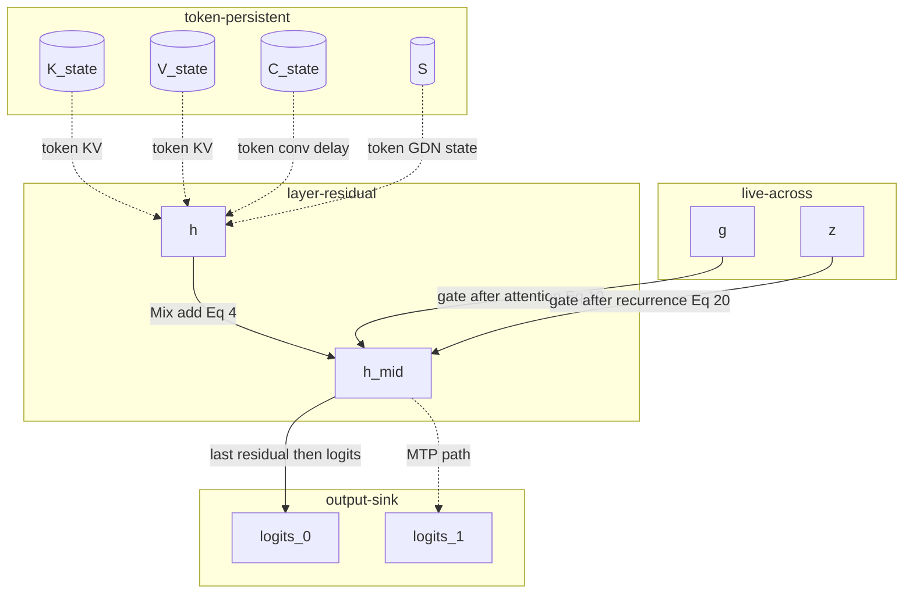

# Qwen3.8-27B lifetime and persistent state (TASK-04)

All MTP-only state and lifetime results are conditional on TASK-02's unverified analysis model.

> **Draft status:** conclusions in this document are **unverified** until the verification stage completes.

Phase 1 lifetime and persistent-state analysis for the Qwen3.8-27B language +
MTP forward map. Catalog IDs come from
[`docs/architecture/dataflow.md`](dataflow.md) (TASK-03). Equations, ranks, and
state kinds come from
[`docs/architecture/model-semantics.md`](model-semantics.md) (TASK-02).
Dimensions instantiate sitting `text_config` / TASK-01 inventory.

This document classifies every catalog value by lifetime and recomputability,
gives DERIVED element counts and byte volumes for \(K,V,C,S\), and names
semantic storage candidates. It specifies mathematical state sizes, not
kernels. Prefill and decode share one lifetime model; only \(T\) and whether
incoming state is zeros versus populated change.

If a class or byte total would disagree with a TASK-02 rank or TASK-03 catalog
ID, the earlier document wins and this one is wrong.

## Authority

| Item | Value | Label |
| --- | --- | --- |
| Dossier | [`docs/architecture/tasks/TASK-04.md`](tasks/TASK-04.md) | — |
| Semantics | [`docs/architecture/model-semantics.md`](model-semantics.md) (TASK-02) | OBSERVED / DERIVED |
| Dataflow | [`docs/architecture/dataflow.md`](dataflow.md) (TASK-03) | OBSERVED / DERIVED |
| Inventory | [`docs/architecture/model-inventory.md`](model-inventory.md) (TASK-01) | OBSERVED |
| Config | [`.cache/authorities/qwen3.8-27b-transformers/config.json`](../../.cache/authorities/qwen3.8-27b-transformers/config.json) `text_config` | OBSERVED |
| Checker | [`scripts/check_lifetime_and_state.py`](../../scripts/check_lifetime_and_state.py) | DERIVED |
| Evidence policy | [`docs/architecture/plan.md`](plan.md) (OBSERVED / DERIVED labels) | OBSERVED |
| In scope | Language stack + one MTP block: lifetime classes and persistent-state bytes | — |
| Deferred | Vision encoder internals (residual-stream interface only) | — |
| Scope of this document | Lifetimes and mathematical state sizes — not kernels | — |

Numeric ranks instantiate sitting `text_config` OBSERVED: `hidden_size` 5120,
64 decoder layers, `full_attention_interval` 4, 48 linear + 16 full at
\(\ell \bmod 4 = 3\), `mtp_num_hidden_layers` 1, `num_key_value_heads` 4,
`head_dim` 256, `linear_conv_kernel_dim` 4, `linear_num_value_heads` 48,
`linear_key_head_dim` / `linear_value_head_dim` 128, `dtype` `"bfloat16"`,
`mamba_ssm_dtype` `"float32"`. Lifetime class, recomputability, and byte
volumes are DERIVED from TASK-02 ranks × multiplicity × element size.

## Logical versus physical

> Logical values in this document are graph nodes. They do not imply physical allocation, materialization, buffer reuse, or kernel fusion.

> A value that must survive a named boundary is mathematical state for that boundary, not a cache layout or CUDA allocation.

- Fan-out of a named value is not a requirement to store that value.
- Token-crossing edges name mathematical state \((K,V,C,S)\), not a cache layout.
- Identifying a semantic storage candidate is not a CUDA buffer, fusion, or layout decision (TASK-12).

## Lifetime taxonomy

Five classes, complete and disjoint over the 52 catalog IDs.

| Class | JSON array | Meaning |
| --- | --- | --- |
| `ephemeral` | `ephemeral_ids` | Produced and consumed inside the current-token map; does not mathematically survive a named residual-add, live-across-mixer, token, or output boundary as the surviving object. |
| `live-across` | `live_across_ids` | Fan-out 1; unique consumer is not the immediate successor operator (TASK-03). Locked IDs: `g`, `z`. |
| `layer-residual` | `layer_residual_ids` | Residual stream that both the mixer/MLP **read** and **add into**. Locked IDs: `h`, `h_mid`. |
| `token-persistent` | `token_persistent_ids` | Mathematical state across the token boundary. Locked IDs: `K_state`, `V_state`, `C_state`, `S`. |
| `output-sink` | `output_sink_ids` | Forward-map outputs consumed as `output`. Locked IDs: `logits_0`, `logits_1`. |

`h_64` is the last residual-stream vector but is not `layer-residual`: it does
not live across a Mix/MLP add (it is the result of the last add). Class
`ephemeral`. `h_mtp` is the MTP block output, class `ephemeral`. Current-token
writes `k_rope` → `K_state`, `v_full` → `V_state`, `qkv` → `C_state` do not
make those activations token-persistent; the surviving objects are the state
IDs.

Recomputability (two labels, disjoint):

| Label | JSON | Meaning |
| --- | --- | --- |
| `recomputable` | every catalog ID except the four state IDs | If dropped, the value can be rebuilt from its current-token catalog parents (parents may include live persistent state). |
| `requires-prior-state` | `requires_prior_state_ids` = `state_ids` | The value **is** prior-token mathematical state. Reconstructing it without that state requires replaying tokens \(1\ldots t-1\). |

Boundary column (exactly one per catalog ID):

| Boundary | IDs |
| --- | --- |
| `none` | all IDs not listed below |
| `residual-add` | `h`, `h_mid` |
| `live-across-mixer` | `g`, `z` |
| `token` | `K_state`, `V_state`, `C_state`, `S` |
| `output` | `logits_0`, `logits_1` |

Prefill of length \(T\) and decode of one new token share this taxonomy. Only
\(T\) and whether incoming state is zeros versus populated change. There is no
sixth class. Intra-equation reuse of `k_hat` (TASK-03) is not a lifetime class.

Let \(T\) be the stored KV length **after** appending the current token
(TASK-02 rank \((4,T,256)\)). Decode of one new token has incoming KV length
\(T-1\). When \(T=1\), incoming KV is empty and KV read volume is 0. \(C\) and
\(S\) have \(T\)-independent stored ranks (initial zeros still occupy the full
\(C\) and \(S\) ranks). JSON: `T_is_stored_length_after_append` is `true`;
`decode_T_new` is `1`; `example_T` is `[1, 4096]`.

Element sizes are IEEE widths used as conceptual element sizes, not allocation
dtypes: BF16 = 2 bytes (OBSERVED `text_config.dtype` `"bfloat16"`; inventory
all checkpoint tensors BF16) for conceptual \(K,V,C\); F32 = 4 bytes (OBSERVED
`text_config.mamba_ssm_dtype` `"float32"`) for conceptual \(S\). Byte volume =
element count × element size (DERIVED).

## Catalog lifetime table

All 52 TASK-03 catalog IDs in locked order. Shared weights \(E\), \(W_\text{lm}\)
are parameters, not catalog intermediates, and are not classified here.

| ID | Lifetime class | Recomputability | Boundary | Eq |
| --- | --- | --- | --- | --- |
| `token_id` | ephemeral | recomputable | none | (1) |
| `e` | ephemeral | recomputable | none | (1) |
| `h` | layer-residual | recomputable | residual-add | (4) |
| `h_tilde` | ephemeral | recomputable | none | (4) |
| `h_mid` | layer-residual | recomputable | residual-add | (4)–(5) |
| `h_post` | ephemeral | recomputable | none | (5),(21) |
| `h_64` | ephemeral | recomputable | none | (5),(22),(23) |
| `h_final` | ephemeral | recomputable | none | (22) |
| `logits_0` | output-sink | recomputable | output | (22) |
| `u_q` | ephemeral | recomputable | none | (6)–(7) |
| `q_prime` | ephemeral | recomputable | none | (7) |
| `g` | live-across | recomputable | live-across-mixer | (7),(10) |
| `k_raw` | ephemeral | recomputable | none | (6) |
| `v_full` | ephemeral | recomputable | none | (6),(9) |
| `q_n` | ephemeral | recomputable | none | (8) |
| `k_n` | ephemeral | recomputable | none | (8) |
| `q_rope` | ephemeral | recomputable | none | (9),(12) |
| `k_rope` | ephemeral | recomputable | none | (9),(12) |
| `attn` | ephemeral | recomputable | none | (9) |
| `y_gate` | ephemeral | recomputable | none | (10) |
| `mix_full` | ephemeral | recomputable | none | (10) |
| `K_state` | token-persistent | requires-prior-state | token | state |
| `V_state` | token-persistent | requires-prior-state | token | state |
| `qkv` | ephemeral | recomputable | none | (13)–(14) |
| `z` | live-across | recomputable | live-across-mixer | (13),(20) |
| `a` | ephemeral | recomputable | none | (13),(15) |
| `b` | ephemeral | recomputable | none | (13),(15) |
| `c_tilde` | ephemeral | recomputable | none | (14) |
| `c` | ephemeral | recomputable | none | (14) |
| `q_lin` | ephemeral | recomputable | none | (14),(16) |
| `k_lin` | ephemeral | recomputable | none | (14),(16) |
| `v_lin` | ephemeral | recomputable | none | (14),(17) |
| `q_hat` | ephemeral | recomputable | none | (16),(18) |
| `k_hat` | ephemeral | recomputable | none | (16),(17) |
| `alpha` | ephemeral | recomputable | none | (15) |
| `beta` | ephemeral | recomputable | none | (15) |
| `S` | token-persistent | requires-prior-state | token | (17)–(19) |
| `o` | ephemeral | recomputable | none | (18) |
| `u_gdn` | ephemeral | recomputable | none | (20) |
| `mix_lin` | ephemeral | recomputable | none | (20) |
| `C_state` | token-persistent | requires-prior-state | token | (14) |
| `g_mlp` | ephemeral | recomputable | none | (21) |
| `up` | ephemeral | recomputable | none | (21) |
| `swiglu` | ephemeral | recomputable | none | (21) |
| `mlp_out` | ephemeral | recomputable | none | (5),(21) |
| `e_next` | ephemeral | recomputable | none | (1),(23) |
| `e_next_n` | ephemeral | recomputable | none | (23) |
| `h64_n` | ephemeral | recomputable | none | (23) |
| `mtp_cat` | ephemeral | recomputable | none | (23) |
| `mtp_u` | ephemeral | recomputable | none | (23) |
| `h_mtp` | ephemeral | recomputable | none | (24) |
| `logits_1` | output-sink | recomputable | output | (24) |

Locked class arrays (catalog order, disjoint union = `catalog_ids`):

- `ephemeral_ids`: `token_id`, `e`, `h_tilde`, `h_post`, `h_64`, `h_final`, `u_q`, `q_prime`, `k_raw`, `v_full`, `q_n`, `k_n`, `q_rope`, `k_rope`, `attn`, `y_gate`, `mix_full`, `qkv`, `a`, `b`, `c_tilde`, `c`, `q_lin`, `k_lin`, `v_lin`, `q_hat`, `k_hat`, `alpha`, `beta`, `o`, `u_gdn`, `mix_lin`, `g_mlp`, `up`, `swiglu`, `mlp_out`, `e_next`, `e_next_n`, `h64_n`, `mtp_cat`, `mtp_u`, `h_mtp` (42)
- `live_across_ids`: `g`, `z` (2)
- `layer_residual_ids`: `h`, `h_mid` (2)
- `token_persistent_ids` / `state_ids` / `requires_prior_state_ids`: `K_state`, `V_state`, `C_state`, `S` (4)
- `output_sink_ids`: `logits_0`, `logits_1` (2)

## Persistent state storage

Live config identities (OBSERVED / DERIVED):

- \(n_\text{kv}=\) `num_key_value_heads` = 4; \(d_h=\) `head_dim` = 256
- \(n_\text{full}=\) 16 from `layer_types`; \(n_\text{mtp}=\) `mtp_num_hidden_layers` = 1; \(n_\text{full}^\text{KV}=n_\text{full}+n_\text{mtp}=17\)
- \(n_\text{lin}=\) 48 from `layer_types`
- \(d_\text{qkv}=(2\cdot\texttt{linear_num_key_heads}+\texttt{linear_num_value_heads})\cdot\texttt{linear_key_head_dim}=10240\)
- \(d_C=\texttt{linear_conv_kernel_dim}-1=3\)
- \(S\) rank \((n_v,d_k,d_v)=(\texttt{linear_num_value_heads},\texttt{linear_key_head_dim},\texttt{linear_value_head_dim})=(48,128,128)\)

**KV** (grows with \(T\); RoPE baked into stored \(K\)):

\[
N_{KV}^{(\ell)}/\text{token}=2\cdot n_\text{kv}\cdot d_h=2048,\qquad
B_{KV}^{(\ell)}/\text{token}=4096
\]

\[
N_{KV}^{\text{all}}/\text{token}=17\cdot 2048=34816,\qquad
B_{KV}^{\text{all}}/\text{token}=69632
\]

Language-only (secondary): \(16\cdot 2048=32768\) elements/token, \(65536\)
bytes/token.

Storage: \(N_{KV}^{\text{all}}(T)=34816\,T\) elements, \(B_{KV}^{\text{all}}(T)=69632\,T\) bytes.

**C** (does not grow with \(T\); last 3 QKV vectors):

\[
N_C^{(\ell)}=3\cdot 10240=30720,\qquad B_C^{(\ell)}=61440
\]

\[
N_C^{\text{all}}=48\cdot 30720=1474560,\qquad B_C^{\text{all}}=2949120
\]

**S** (does not grow with \(T\); conceptual F32):

\[
N_S^{(\ell)}=48\cdot 128\cdot 128=786432,\qquad B_S^{(\ell)}=3145728
\]

\[
N_S^{\text{all}}=48\cdot 786432=37748736,\qquad B_S^{\text{all}}=150994944
\]

\(B_S^{\text{all}}=144\times 2^{20}\) exactly (144 MiB). That identity is exact,
not an approximation.

**Primary storage** (includes MTP KV):

\[
N_\text{store}(T)=34816\,T+39223296,\qquad
B_\text{store}(T)=69632\,T+153944064
\]

Fixed part \(39223296=1474560+37748736\) elements,
\(153944064=2949120+150994944\) bytes.

| \(T\) | KV elems | KV bytes | Store elems | Store bytes |
| ---: | ---: | ---: | ---: | ---: |
| 1 | 34816 | 69632 | 39258112 | 154013696 |
| 4096 | 142606336 | 285212672 | 181829632 | 439156736 |

Language-only storage (secondary; exclude MTP KV, still include all \(C\) and
\(S\)): \(N=32768\,T+39223296\), \(B=65536\,T+153944064\).

Per-layer and all-layers table. Primary totals include MTP KV (17 full-attention
KV instances = 16 language + 1 MTP). Language-only KV is the secondary row
above, not the primary total. BF16=2 for \(K,V,C\); F32=4 for \(S\).

| State | Instances | Elems / instance | Bytes / instance | All-instances elems | All-instances bytes | vs \(T\) |
| --- | ---: | --- | --- | ---: | ---: | --- |
| \(K\) | 17 | \(1024\,T\) | \(2048\,T\) | \(17408\,T\) | \(34816\,T\) | grows |
| \(V\) | 17 | \(1024\,T\) | \(2048\,T\) | \(17408\,T\) | \(34816\,T\) | grows |
| \(K{+}V\) | 17 | \(2048\,T\) | \(4096\,T\) | \(34816\,T\) | \(69632\,T\) | grows |
| \(C\) | 48 | 30720 | 61440 | 1474560 | 2949120 | fixed |
| \(S\) | 48 | 786432 | 3145728 | 37748736 | 150994944 | fixed |
| Primary total | — | — | — | \(34816\,T+39223296\) | \(69632\,T+153944064\) | mixed |

One residual vector is \(H=5120\) BF16 elements = 10240 bytes (DERIVED rank ×
dtype). That figure is not a physical working-set peak.

## Per-token read/write volumes

Decode \(T_\text{new}=1\). Write volume is new mathematical state produced this
token. Read volume is prior-token state consumed this token. KV read uses
\(T-1\).

| Channel | Write elems | Write bytes | Read elems | Read bytes |
| --- | ---: | ---: | --- | ---: |
| KV (17 layers, incl. MTP) | 34816 | 69632 | \(34816(T-1)\) | \(69632(T-1)\) |
| \(C\) (48 layers) | 491520 | 983040 | 1474560 | 2949120 |
| \(S\) (48 layers) | 37748736 | 150994944 | 37748736 | 150994944 |
| Primary total | 38275072 | 152047616 | \(34816(T-1)+39223296\) | \(69632(T-1)+153944064\) |

Conventions:

- **KV write:** append current `k_rope` and `v_full` (one token) per full layer including MTP. Current `k_rope`/`v_full` are produced this step; they are not a state read.
- **KV read:** past \(T-1\) tokens of stored \(K\) and \(V\). At \(T=1\), KV read is 0.
- **C write:** one new QKV vector of width 10240 per linear layer (the delay drops the oldest tap). Do **not** count rewriting the two retained taps as new writes. Stored \(C\) remains 3 vectors. \(48\times 10240=491520\) elements, \(983040\) bytes.
- **C read:** all 3 stored taps per linear layer (\(1474560\) elements, \(2949120\) bytes), including when they are zeros.
- **S read and write:** the full matrix \(S_{t-1}\) and \(S_t\) (\(37748736\) elements, \(150994944\) bytes), including when \(S_0=0\).

Instantiated decode reads:

| \(T\) | Read elems | Read bytes |
| ---: | ---: | ---: |
| 1 | 39223296 | 153944064 |
| 4096 | 181794816 | 439087104 |

Prefill of length \(T\) from zeros writes the same per-token KV/C/S as the
table, \(T\) times for KV and once-per-token for C/S, and ends at storage
\(B_\text{store}(T)\). A triangular KV-read schedule is out of scope.

## Semantic storage candidates

This ranking is DERIVED from the taxonomy. It is not a claim about runtime,
fusion, or speed. “Require materialization across boundaries” means
mathematical survival, not a buffer. This list closes the ledger open question
on exact state sizes and which values require materialization across named
boundaries.

Ranked must-survive list:

1. **Token boundary** — `K_state`, `V_state`, `C_state`, `S`. Not recomputable without prior-token state or prefix replay. Exact sizes in Persistent state storage. Primary totals include MTP KV.
2. **Residual-add boundary** — `h` (must still exist when Mix is added, Eq. (4)); `h_mid` (must still exist when MLP is added, Eq. (5)).
3. **Live-across-mixer boundary** — `g` (produced at the `q_proj` split, consumed only in Eq. (10) after attention); `z` (produced at `W_z`, consumed only in GatedRMSNorm after the recurrence, Eq. (20)).

High-fan-out `h_tilde`, `h_post`, `k_rope`, `v_full`, `qkv`, `h_64` remain
recomputable from current-token parents; physical materialization is not
decided here. Shared \(E\) / \(W_\text{lm}\) are parameters, not activation
lifetime.

Diagram 1 of 1. Lifetime-class summary of catalog values that must survive a
named boundary. Not a redraw of the TASK-03 DAG.



## Deferred vision

Visual tokens may replace placeholders in the residual stream as vectors in
\(\mathbb{R}^{H}\) (`out_hidden_size` 5120 OBSERVED). Encoder, patch embed, and
merger internals are **UNKNOWN** / out of scope. This document does not
classify vision-encoder activations and does not assign vision KV/C/S.

## Machine-checkable summary JSON

Live object from `text_config` arithmetic plus locked constants (copied from
[`scripts/check_lifetime_and_state.py --json`](../../scripts/check_lifetime_and_state.py)):

```json
{
  "authority": ".cache/authorities/qwen3.8-27b-transformers",
  "hidden_size": 5120,
  "n_decoder_layers": 64,
  "n_linear_layers": 48,
  "n_full_layers": 16,
  "n_mtp_blocks": 1,
  "n_full_layers_with_kv": 17,
  "full_attention_indices": [
    3,
    7,
    11,
    15,
    19,
    23,
    27,
    31,
    35,
    39,
    43,
    47,
    51,
    55,
    59,
    63
  ],
  "n_kv_heads": 4,
  "head_dim": 256,
  "linear_qkv_width": 10240,
  "linear_conv_delay": 3,
  "linear_state_heads": 48,
  "linear_state_dk": 128,
  "linear_state_dv": 128,
  "bytes_bf16": 2,
  "bytes_f32": 4,
  "n_catalog_nodes": 52,
  "catalog_ids": [
    "token_id",
    "e",
    "h",
    "h_tilde",
    "h_mid",
    "h_post",
    "h_64",
    "h_final",
    "logits_0",
    "u_q",
    "q_prime",
    "g",
    "k_raw",
    "v_full",
    "q_n",
    "k_n",
    "q_rope",
    "k_rope",
    "attn",
    "y_gate",
    "mix_full",
    "K_state",
    "V_state",
    "qkv",
    "z",
    "a",
    "b",
    "c_tilde",
    "c",
    "q_lin",
    "k_lin",
    "v_lin",
    "q_hat",
    "k_hat",
    "alpha",
    "beta",
    "S",
    "o",
    "u_gdn",
    "mix_lin",
    "C_state",
    "g_mlp",
    "up",
    "swiglu",
    "mlp_out",
    "e_next",
    "e_next_n",
    "h64_n",
    "mtp_cat",
    "mtp_u",
    "h_mtp",
    "logits_1"
  ],
  "lifetime_classes": [
    "ephemeral",
    "live-across",
    "layer-residual",
    "token-persistent",
    "output-sink"
  ],
  "ephemeral_ids": [
    "token_id",
    "e",
    "h_tilde",
    "h_post",
    "h_64",
    "h_final",
    "u_q",
    "q_prime",
    "k_raw",
    "v_full",
    "q_n",
    "k_n",
    "q_rope",
    "k_rope",
    "attn",
    "y_gate",
    "mix_full",
    "qkv",
    "a",
    "b",
    "c_tilde",
    "c",
    "q_lin",
    "k_lin",
    "v_lin",
    "q_hat",
    "k_hat",
    "alpha",
    "beta",
    "o",
    "u_gdn",
    "mix_lin",
    "g_mlp",
    "up",
    "swiglu",
    "mlp_out",
    "e_next",
    "e_next_n",
    "h64_n",
    "mtp_cat",
    "mtp_u",
    "h_mtp"
  ],
  "live_across_ids": [
    "g",
    "z"
  ],
  "layer_residual_ids": [
    "h",
    "h_mid"
  ],
  "token_persistent_ids": [
    "K_state",
    "V_state",
    "C_state",
    "S"
  ],
  "output_sink_ids": [
    "logits_0",
    "logits_1"
  ],
  "state_ids": [
    "K_state",
    "V_state",
    "C_state",
    "S"
  ],
  "requires_prior_state_ids": [
    "K_state",
    "V_state",
    "C_state",
    "S"
  ],
  "boundary_token_ids": [
    "K_state",
    "V_state",
    "C_state",
    "S"
  ],
  "boundary_residual_add_ids": [
    "h",
    "h_mid"
  ],
  "boundary_live_across_ids": [
    "g",
    "z"
  ],
  "boundary_output_ids": [
    "logits_0",
    "logits_1"
  ],
  "primary_includes_mtp_kv": true,
  "T_is_stored_length_after_append": true,
  "decode_T_new": 1,
  "kv_elems_per_full_layer_per_token": 2048,
  "kv_bytes_per_full_layer_per_token": 4096,
  "kv_elems_all_per_token": 34816,
  "kv_bytes_all_per_token": 69632,
  "kv_elems_language_per_token": 32768,
  "kv_bytes_language_per_token": 65536,
  "c_elems_per_layer": 30720,
  "c_bytes_per_layer": 61440,
  "c_elems_all": 1474560,
  "c_bytes_all": 2949120,
  "c_write_elems_per_token_all": 491520,
  "c_write_bytes_per_token_all": 983040,
  "s_elems_per_layer": 786432,
  "s_bytes_per_layer": 3145728,
  "s_elems_all": 37748736,
  "s_bytes_all": 150994944,
  "storage_kv_elems_coeff_T": 34816,
  "storage_kv_bytes_coeff_T": 69632,
  "storage_fixed_elems": 39223296,
  "storage_fixed_bytes": 153944064,
  "decode_write_elems": 38275072,
  "decode_write_bytes": 152047616,
  "decode_read_kv_elems_coeff_Tm1": 34816,
  "decode_read_kv_bytes_coeff_Tm1": 69632,
  "decode_read_fixed_elems": 39223296,
  "decode_read_fixed_bytes": 153944064,
  "example_T": [
    1,
    4096
  ],
  "storage_elems_at_example_T": [
    39258112,
    181829632
  ],
  "storage_bytes_at_example_T": [
    154013696,
    439156736
  ],
  "decode_read_elems_at_example_T": [
    39223296,
    181794816
  ],
  "decode_read_bytes_at_example_T": [
    153944064,
    439087104
  ],
  "n_diagrams": 1,
  "canonical_sentence": "A value that must survive a named boundary is mathematical state for that boundary, not a cache layout or CUDA allocation.",
  "canonical_sentence_logical": "Logical values in this document are graph nodes. They do not imply physical allocation, materialization, buffer reuse, or kernel fusion."
}
```
