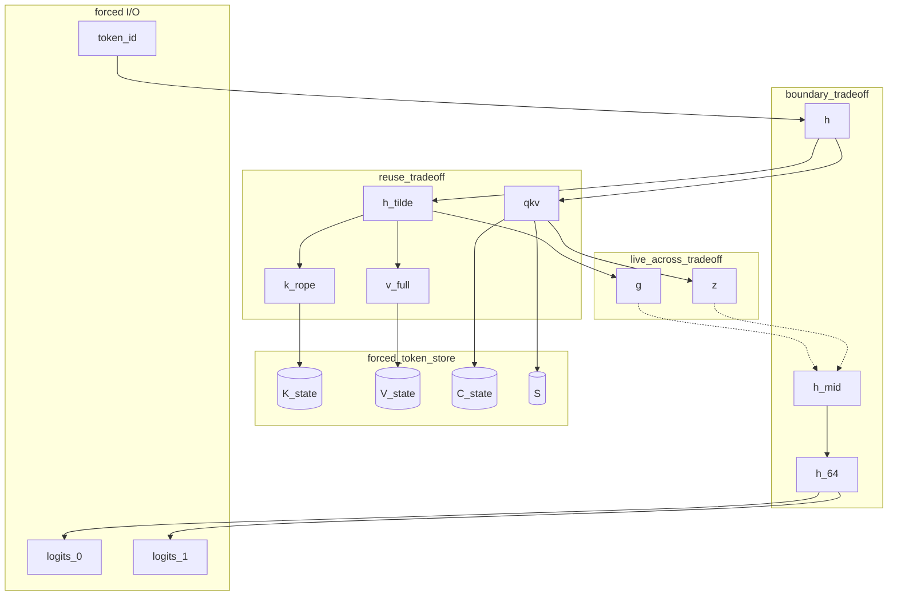

# Qwen3.8-27B materialization and fusion (TASK-12)

> **Draft status:** conclusions in this document are **unverified** until the verification stage completes.

Phase 1 **hardware-independent** physical-materialization need and
fusion-hypothesis analysis for the Qwen3.8-27B language + MTP map. Catalog IDs,
fan-out, live-across, and high-fan-out ranking come from
[`docs/architecture/dataflow.md`](dataflow.md) (TASK-03). Lifetime classes,
must-survive boundaries, recomputability, and $K,V,C,S$ bytes come from
[`docs/architecture/lifetime-and-state.md`](lifetime-and-state.md) (TASK-04).
Node types, internals, 14 sync edges, ten split candidates, and five
flexibility kinds come from
[`docs/architecture/semantic-graph.md`](semantic-graph.md) (TASK-11).

This document specifies mathematical physical-need classes and experiment
hypotheses, not kernels. Prefill and decode share one physical-need taxonomy
and one hypothesis list. Only $T$ (stored KV length after append) and whether
incoming $(K,V,C,S)$ is zeros versus populated change. Primary classification
includes MTP. If a class, catalog ID, rank, byte identity, node type, or
sync-edge id would disagree with TASK-03/04/11 or sitting `text_config`, the
earlier document / config wins and this one is wrong.

Claims are labelled OBSERVED (sitting `text_config` / inventory already
established), DERIVED (physical-need class, byte identities from ranks ×
TASK-04 element size, extra-sync-edge counts), or HYPOTHESIS (every
fusion/split/reuse/recompute usefulness, every claim that a fusion improves
total behavior). No MEASURED tok/s or NLL. No fusion, schedule, layout, or
kernel is chosen here.

## Authority

| Item | Value | Label |
| --- | --- | --- |
| Dossier | [`docs/architecture/tasks/TASK-12.md`](tasks/TASK-12.md) | — |
| Dataflow | [`docs/architecture/dataflow.md`](dataflow.md) (TASK-03) | OBSERVED / DERIVED |
| Lifetime | [`docs/architecture/lifetime-and-state.md`](lifetime-and-state.md) (TASK-04) | OBSERVED / DERIVED |
| Semantic graph | [`docs/architecture/semantic-graph.md`](semantic-graph.md) (TASK-11) | OBSERVED / DERIVED |
| Inventory | [`docs/architecture/model-inventory.md`](model-inventory.md) (TASK-01) via those docs | OBSERVED |
| Config | [`.cache/authorities/qwen3.8-27b-transformers/config.json`](../../.cache/authorities/qwen3.8-27b-transformers/config.json) `text_config` | OBSERVED |
| Checker | [`scripts/check_materialization_and_fusion.py`](../../scripts/check_materialization_and_fusion.py) | DERIVED |
| Evidence policy | [`docs/architecture/plan.md`](plan.md) (OBSERVED / DERIVED / HYPOTHESIS) | OBSERVED |
| In scope | Language + MTP physical-need classes and fusion hypotheses | — |
| Deferred | Vision encoder; TASK-13/14 schedules; TASK-15 layouts; TASK-17 CUDA | — |
| Scope of this document | Mathematical physical-need and experiment hypotheses — not kernels | — |

Numeric ranks instantiate sitting `text_config` OBSERVED: `hidden_size` 5120,
`intermediate_size` 17408, `vocab_size` 248320, 64 decoder layers, 48 linear +
16 full at $\ell \bmod 4 = 3$, `mtp_num_hidden_layers` 1, `head_dim` 256,
`num_attention_heads` 24, `num_key_value_heads` 4, linear widths
$d_\text{qkv}=10240$, `linear_key_head_dim` / `linear_value_head_dim` 128,
`dtype` `"bfloat16"`, `mamba_ssm_dtype` `"float32"`. Physical-need classes and
byte identities are DERIVED. Every fusion/split/reuse usefulness remains
HYPOTHESIS.

Quartz and llama.cpp inspection are deferred until freeze. GGUF does not
constrain these contracts.

## Physical versus mathematical

Logical values in this document are graph nodes. They do not imply physical allocation, materialization, buffer reuse, or kernel fusion.

Physical-materialization need in this document is a mathematical survival class for evaluating the map, not a CUDA allocation, cache layout, or selected fusion.

Every fusion, split, reuse, and recomputation proposal in this document is a HYPOTHESIS; none is a selected winner.

Apparent fusions are enumerated with working-set and synchronization tradeoffs; which of them improve total behavior remains a HYPOTHESIS.

- Fan-out of a named value is not a requirement to store that value (`fanout_neq_must_store` true).
- Node I/O is not a requirement to allocate a CUDA buffer (`node_io_neq_must_store` true).
- TASK-04 “must survive a named boundary” is mathematical liveness, not physical malloc (`must_survive_neq_cuda_malloc` true).
- Prefill and decode share this taxonomy (`decode_prefill_share_taxonomy` true).
- Primary classification includes MTP (`primary_includes_mtp` true).
- Live-across `g`/`z` remain internal unless a split hypothesis is tried (`live_across_are_internal` true).
- Hardware mapping is TASK-17. Schedules are TASK-13/14. No fusion winner is selected (`fusion_winner_selected` false).

## Physical-need taxonomy

Seven disjoint classes over the 52 catalog IDs. JSON array
`physical_need_class_ids` in this exact order (7 ids). JSON
`n_physical_need_classes` = 7. This heading starts the ledger completion
“classify with required justification.”

Assign **exactly one** class per catalog ID by applying these rules **in this
order**. JSON `physical_need_rule_ids` in this exact order (7 ids). JSON
`n_physical_need_rules` = 7.

| Rule id | If | Class | Default tactic |
| --- | --- | --- | --- |
| `rule_token_store` | TASK-04 `token-persistent` / `requires-prior-state` | `forced_token_store` | `must_store` |
| `rule_output` | TASK-04 `output-sink` | `forced_output` | `must_expose` |
| `rule_input` | catalog ID `token_id` | `forced_input` | `must_present` |
| `rule_boundary` | remaining TASK-11 `boundary_ids` | `boundary_tradeoff` | `keep_live_or_fuse` |
| `rule_live_across` | TASK-03/04/11 live-across `g`, `z` | `live_across_tradeoff` | `keep_inside_or_split` |
| `rule_reuse` | remaining TASK-03 high-fan-out activations (`h_tilde`, `h_post`, `k_rope`, `v_full`, `qkv`) | `reuse_tradeoff` | `reuse_or_recompute` |
| `rule_fuse_default` | all remaining catalog IDs | `fuse_default` | `fuse_or_recompute` |

JSON array `default_tactic_ids` in this exact order (7 ids), parallel to
`physical_need_class_ids`: `must_store`, `must_expose`, `must_present`,
`keep_live_or_fuse`, `keep_inside_or_split`, `reuse_or_recompute`,
`fuse_or_recompute`. JSON `n_default_tactics` = 7.

| Class | Meaning | Forced physical object? |
| --- | --- | --- |
| `forced_token_store` | Next-token evaluation without prefix replay requires a physical representation of this state. Omitting the store changes the map. | yes — the state IDs |
| `forced_output` | Forward-map outputs consumed as `output`. Dropping them drops the result. | yes — expose logits |
| `forced_input` | Graph input that must be presented. | yes — present `token_id` |
| `boundary_tradeoff` | TASK-11 node I/O that must remain mathematically available at a sync edge. A named CUDA buffer is not forced. Fuse-across, reuse, or recompute are HYPOTHESIS tactics that must still preserve residual-add / fan-out consumers. | no |
| `live_across_tradeoff` | Live-across internals. Physical inter-node buffer exists only if a split hypothesis is tried. Default: keep inside the owning node as a local working set. | no (unsplit) |
| `reuse_tradeoff` | High-fan-out ephemerals. Reuse of one copy vs recompute vs streaming into a forced state write is HYPOTHESIS. Not a token store. | no |
| `fuse_default` | Intra-node ephemerals whose unique consumer is the immediate successor (or a disjoint split). Default is fuse inside the node or recompute. Split candidates in this class remain unselected hypotheses. | no |

`S` is high-fan-out **and** token-persistent: rule 1 wins → `forced_token_store`,
not `reuse_tradeoff`. `h` / `h_mid` / `h_64` are high-fan-out **and** TASK-11
boundary: rule 4 wins → `boundary_tradeoff`. `k_rope` / `v_full` / `qkv` write
into forced state; the **activation** is `reuse_tradeoff` and the **surviving
store** is the state ID.

JSON `n_forced_token_store` = 4, `n_forced_output` = 2, `n_forced_input` = 1,
`n_boundary_tradeoff` = 7, `n_live_across_tradeoff` = 2, `n_reuse_tradeoff` = 5,
`n_fuse_default` = 31. Sum 52. `physical_need_partition_complete` true.

JSON `important_ids` = forced + boundary + live-across + reuse_tradeoff, this
exact catalog-relative order (21 ids). JSON `n_important_ids` = 21. These 21
are the “important intermediates” named by the ledger; the other 31 still
appear in the catalog table as `fuse_default` with justification.

JSON `high_fanout_boundary_ids` `["h","h_mid","h_64"]`. JSON
`n_high_fanout_boundary_ids` = 3.

Prefill and decode share this taxonomy. Only $T$ and incoming
$(K,V,C,S)$ occupancy change.

## Catalog physical-need table

All 52 catalog IDs in TASK-03 order. Completes classification coverage.

| ID | Physical need | Default tactic | Justification |
| --- | --- | --- | --- |
| `token_id` | `forced_input` | `must_present` | Graph input. |
| `e` | `boundary_tradeoff` | `keep_live_or_fuse` | TASK-11 `identity_e_h0`; identified as $h^{(0)}$. |
| `h` | `boundary_tradeoff` | `keep_live_or_fuse` | TASK-04 residual-add; TASK-11 `residual_h`; fan-out 2. |
| `h_tilde` | `reuse_tradeoff` | `reuse_or_recompute` | TASK-03 high-fan-out 3 or 4; TASK-04 ephemeral. |
| `h_mid` | `boundary_tradeoff` | `keep_live_or_fuse` | TASK-04 residual-add Mix→MLP; TASK-11 `residual_h_mid`. |
| `h_post` | `reuse_tradeoff` | `reuse_or_recompute` | Fan-out to `g_mlp` and `up`. |
| `h_64` | `boundary_tradeoff` | `keep_live_or_fuse` | Fan-out to `lm_head` and `mtp_mix`; TASK-04 ephemeral. |
| `h_final` | `fuse_default` | `fuse_or_recompute` | `lm_head` internal; `split_h_final` HYPOTHESIS. |
| `logits_0` | `forced_output` | `must_expose` | Primary output sink. |
| `u_q` | `fuse_default` | `fuse_or_recompute` | Disjoint split parent, not reuse. |
| `q_prime` | `fuse_default` | `fuse_or_recompute` | Immediate successor `q_n`. |
| `g` | `live_across_tradeoff` | `keep_inside_or_split` | Live-across internal; `split_g` HYPOTHESIS. |
| `k_raw` | `fuse_default` | `fuse_or_recompute` | Immediate successor `k_n`. |
| `v_full` | `reuse_tradeoff` | `reuse_or_recompute` | Attn + `V_state` write; store is `V_state`. |
| `q_n` | `fuse_default` | `fuse_or_recompute` | Immediate successor `q_rope`. |
| `k_n` | `fuse_default` | `fuse_or_recompute` | Immediate successor `k_rope`. |
| `q_rope` | `fuse_default` | `fuse_or_recompute` | Immediate successor `attn`. |
| `k_rope` | `reuse_tradeoff` | `reuse_or_recompute` | Attn + `K_state` write; store is `K_state`. |
| `attn` | `fuse_default` | `fuse_or_recompute` | Immediate successor `y_gate`. |
| `y_gate` | `fuse_default` | `fuse_or_recompute` | Immediate successor `mix_full`. |
| `mix_full` | `fuse_default` | `fuse_or_recompute` | Residual add lives inside `gated_attn`. |
| `K_state` | `forced_token_store` | `must_store` | Requires prior-token state. |
| `V_state` | `forced_token_store` | `must_store` | Requires prior-token state. |
| `qkv` | `reuse_tradeoff` | `reuse_or_recompute` | FIR + `C_state` write; store is `C_state`. |
| `z` | `live_across_tradeoff` | `keep_inside_or_split` | Live-across internal; `split_z` HYPOTHESIS. |
| `a` | `fuse_default` | `fuse_or_recompute` | Immediate successor `alpha`. |
| `b` | `fuse_default` | `fuse_or_recompute` | Immediate successor `beta`. |
| `c_tilde` | `fuse_default` | `fuse_or_recompute` | Immediate successor `c`. |
| `c` | `fuse_default` | `fuse_or_recompute` | Disjoint QKV split parent, not reuse. |
| `q_lin` | `fuse_default` | `fuse_or_recompute` | Immediate successor `q_hat`. |
| `k_lin` | `fuse_default` | `fuse_or_recompute` | Immediate successor `k_hat`. |
| `v_lin` | `fuse_default` | `fuse_or_recompute` | Immediate successor `S`. |
| `q_hat` | `fuse_default` | `fuse_or_recompute` | Immediate successor `o`. |
| `k_hat` | `fuse_default` | `fuse_or_recompute` | Intra-equation two reads; not a split candidate. |
| `alpha` | `fuse_default` | `fuse_or_recompute` | Immediate successor `S`. |
| `beta` | `fuse_default` | `fuse_or_recompute` | Immediate successor `S`. |
| `S` | `forced_token_store` | `must_store` | Token-persistent F32 state; also high-fan-out. |
| `o` | `fuse_default` | `fuse_or_recompute` | Immediate successor `u_gdn`. |
| `u_gdn` | `fuse_default` | `fuse_or_recompute` | Immediate successor `mix_lin`. |
| `mix_lin` | `fuse_default` | `fuse_or_recompute` | Residual add lives inside `gated_delta_net`. |
| `C_state` | `forced_token_store` | `must_store` | Requires prior-token conv delay. |
| `g_mlp` | `fuse_default` | `fuse_or_recompute` | Immediate successor `swiglu`. |
| `up` | `fuse_default` | `fuse_or_recompute` | Immediate successor `swiglu`. |
| `swiglu` | `fuse_default` | `fuse_or_recompute` | `mlp` internal; `split_swiglu` HYPOTHESIS. |
| `mlp_out` | `fuse_default` | `fuse_or_recompute` | Residual add lives inside `mlp`. |
| `e_next` | `boundary_tradeoff` | `keep_live_or_fuse` | TASK-11 `embed_e_next`. |
| `e_next_n` | `fuse_default` | `fuse_or_recompute` | Immediate successor `mtp_cat`. |
| `h64_n` | `fuse_default` | `fuse_or_recompute` | Immediate successor `mtp_cat`. |
| `mtp_cat` | `fuse_default` | `fuse_or_recompute` | `mtp_mix` internal; `split_mtp_cat` HYPOTHESIS. |
| `mtp_u` | `boundary_tradeoff` | `keep_live_or_fuse` | TASK-11 `mtp_u_to_block` as residual `h`. |
| `h_mtp` | `boundary_tradeoff` | `keep_live_or_fuse` | TASK-11 `h_mtp_to_logits`. |
| `logits_1` | `forced_output` | `must_expose` | MTP output sink. |

JSON object `physical_need_by_id` keyed in `catalog_ids` order. JSON object
`default_tactic_by_id` keyed in the same order.

## Forced stores and forbidden drops

JSON array `forbidden_drop_ids` in this exact order (9 ids). JSON
`n_forbidden_drops` = 9.

`K_state`, `V_state`, `C_state`, `S`, `token_id`, `logits_0`, `logits_1`,
`residual_add_mix`, `residual_add_mlp`

`residual_add_mix` and `residual_add_mlp` are **operations**, not catalog IDs.
They appear in this list and in prose so a fuse-across-`h`/`h_mid` hypothesis
cannot be read as deleting Eq. `(4)` / `(5)`. They are **not** catalog IDs and
**not** in `catalog_ids`. JSON `forbidden_drop_ops`
`["residual_add_mix","residual_add_mlp"]`. JSON `n_forbidden_drop_ops` = 2.
JSON `forbidden_drop_catalog_ids` = the first 7 catalog IDs. JSON
`n_forbidden_drop_catalog_ids` = 7.

Nonfusible TASK-11 sync edges (cannot be removed even as a hypothesis that
drops the write). JSON `nonfusible_sync_edge_ids` in this exact order (5 ids).
JSON `n_nonfusible_sync_edges` = 5.

`state_kv`, `state_c`, `state_s`, `output_logits_0`, `output_logits_1`

Fusible-across data edges (HYPOTHESIS node-type merge only; does not delete
liveness). JSON `fusible_sync_edge_ids` in this exact order (7 ids). JSON
`n_fusible_sync_edges` = 7.

`identity_e_h0`, `residual_h`, `residual_h_mid`, `fanout_h64`, `embed_e_next`,
`mtp_u_to_block`, `h_mtp_to_logits`

Shared-weight edges (required payload sharing, not a node-type merge). JSON
`shared_weight_sync_edge_ids` in this exact order (2 ids). JSON
`n_shared_weight_sync_edges` = 2.

`shared_E`, `shared_W_lm`

Checker: `n_nonfusible_sync_edges + n_fusible_sync_edges + n_shared_weight_sync_edges == 14`.
JSON `n_sync_edges` = 14. JSON `sync_edge_ids` copied from TASK-11 in TASK-11
order.

Additional forbidden collapses (booleans, lock true):

- `rms_roles_not_collapsed` true (TASK-11; two residual-stream RMS roles plus GatedRMSNorm `(3)`).
- `residual_add_inside_mixer` true; `residual_add_inside_mlp` true; `residual_input_live_until_add` true.
- `gdn_primary_is_recurrent_eq_17` true; `chunkwise_not_zero_s_traffic` true.
- `fanout_h64_cannot_hide_from_one_consumer` true — fusing last `mlp` into `lm_head` still must expose `h_64` to `mtp_mix` unless MTP is omitted as an algebraic equivalent (not the primary map).
- `state_write_not_optional` true.

Fusing Mix and MLP across `residual_h_mid` keeps `h_mid` in a **local working
set** until the MLP add; it does not authorize deleting the add. Splitting
`gated_attn` at `g` **adds** a hypothesized sync edge; it does not make `g`
token-persistent.

## Reuse, recompute, local-working-set, and synchronization tradeoffs

JSON array `tradeoff_tactic_ids` in this exact order (4 ids). JSON
`n_tradeoff_tactics` = 4. Availability is DERIVED. Usefulness of choosing a
tactic is HYPOTHESIS.

| id | Meaning | Availability (DERIVED) | Usefulness |
| --- | --- | --- | --- |
| `reuse` | One physical copy, several consumers | high-fan-out catalog IDs and shared $E$/`W_\text{lm}` | HYPOTHESIS |
| `recompute` | Drop and rebuild from current-token parents (parents may include live state) | every catalog ID except `K_state`,`V_state`,`C_state`,`S` | HYPOTHESIS |
| `local_working_set` | Keep the value only for the duration of the owning node; not a named inter-node buffer | all TASK-11 internals, including live-across `g`/`z` | HYPOTHESIS |
| `synchronize` | Promote a value to a named sync edge (existing 14, or a split candidate) | 14 TASK-11 edges; 10 split candidates | HYPOTHESIS |

JSON `n_recomputable_ids` = 48. JSON `recomputable_ids` = `catalog_ids` minus
the four state IDs, catalog order. JSON `requires_prior_state_ids`
`["K_state","V_state","C_state","S"]`.

JSON `reuse_opportunity_ids` in this exact order (11 ids). JSON
`n_reuse_opportunity_ids` = 11.

`h`, `h_tilde`, `h_mid`, `h_post`, `h_64`, `k_rope`, `v_full`, `qkv`, `S`, `E`,
`W_lm`

`S` is forced store **and** a reuse opportunity of that stored object: it
produces `o` and the next-token `S`. `E`/`W_lm` are shared weights, not
catalog IDs.

JSON `intra_equation_reuse_ids` `["k_hat"]`. Two reads inside Eq. `(17)` to
produce one consumer `S`. Not a split candidate. Tactic: `local_working_set`.
Usefulness of keeping `k_hat` vs recomputing the second read is HYPOTHESIS.

JSON `shared_weight_ids` `["E","W_lm"]`. `shared_weight_reuse` is required
sharing of one payload (TASK-11), not a layout and not a selected fusion. A
second physical read of `W_lm` for `logits_1` remains HYPOTHESIS traffic
(citation of TASK-11), not DERIVED unique bytes.

Important intermediates (21 ids). Available-tactics cells list a subset of the
four tactic ids. Every usefulness cell is HYPOTHESIS. Forced token-store rows
offer `synchronize` of the existing state edge plus `reuse` of the stored
object; not `recompute` of the state itself.

| ID | Physical need | Available tactics | Usefulness |
| --- | --- | --- | --- |
| `token_id` | `forced_input` | `synchronize` | HYPOTHESIS |
| `e` | `boundary_tradeoff` | `recompute`, `local_working_set`, `synchronize` | HYPOTHESIS |
| `h` | `boundary_tradeoff` | `reuse`, `recompute`, `local_working_set`, `synchronize` | HYPOTHESIS |
| `h_tilde` | `reuse_tradeoff` | `reuse`, `recompute`, `local_working_set`, `synchronize` | HYPOTHESIS |
| `h_mid` | `boundary_tradeoff` | `reuse`, `recompute`, `local_working_set`, `synchronize` | HYPOTHESIS |
| `h_post` | `reuse_tradeoff` | `reuse`, `recompute`, `local_working_set`, `synchronize` | HYPOTHESIS |
| `h_64` | `boundary_tradeoff` | `reuse`, `recompute`, `local_working_set`, `synchronize` | HYPOTHESIS |
| `logits_0` | `forced_output` | `synchronize` | HYPOTHESIS |
| `g` | `live_across_tradeoff` | `recompute`, `local_working_set`, `synchronize` | HYPOTHESIS |
| `v_full` | `reuse_tradeoff` | `reuse`, `recompute`, `local_working_set`, `synchronize` | HYPOTHESIS |
| `k_rope` | `reuse_tradeoff` | `reuse`, `recompute`, `local_working_set`, `synchronize` | HYPOTHESIS |
| `K_state` | `forced_token_store` | `synchronize`, `reuse` | HYPOTHESIS |
| `V_state` | `forced_token_store` | `synchronize`, `reuse` | HYPOTHESIS |
| `qkv` | `reuse_tradeoff` | `reuse`, `recompute`, `local_working_set`, `synchronize` | HYPOTHESIS |
| `z` | `live_across_tradeoff` | `recompute`, `local_working_set`, `synchronize` | HYPOTHESIS |
| `S` | `forced_token_store` | `synchronize`, `reuse` | HYPOTHESIS |
| `C_state` | `forced_token_store` | `synchronize`, `reuse` | HYPOTHESIS |
| `e_next` | `boundary_tradeoff` | `recompute`, `local_working_set`, `synchronize` | HYPOTHESIS |
| `mtp_u` | `boundary_tradeoff` | `recompute`, `local_working_set`, `synchronize` | HYPOTHESIS |
| `h_mtp` | `boundary_tradeoff` | `recompute`, `local_working_set`, `synchronize` | HYPOTHESIS |
| `logits_1` | `forced_output` | `synchronize` | HYPOTHESIS |

## Fusion hypotheses

JSON array `fusion_kind_ids` in this exact order (3 ids). JSON `n_fusion_kinds`
= 3.

`fuse_internals`, `split_at_internal`, `fuse_across_edge`

JSON array `fusion_hypothesis_ids` in this exact order (22 ids). JSON
`n_fusion_hypotheses` = 22. Parallel `fusion_hypothesis_kinds`. JSON
`n_fusion_hypotheses_selected` = 0. JSON object `fusion_selected` keyed in
`fusion_hypothesis_ids` order with every value `false`. JSON
`fusion_winner_selected` false.

Working-set bytes and extra-sync-edge counts are DERIVED identities. Usefulness
is always HYPOTHESIS. Selected is always `false`. Target is the node type,
catalog ID, or sync-edge id.

| id | kind | target | extra_sync_edges | working_set_bytes | usefulness | selected |
| --- | --- | --- | ---: | ---: | --- | --- |
| `fuse_gated_attn_internals` | `fuse_internals` | `gated_attn` | 0 | 0 | HYPOTHESIS | false |
| `fuse_gated_delta_net_internals` | `fuse_internals` | `gated_delta_net` | 0 | 0 | HYPOTHESIS | false |
| `fuse_mlp_internals` | `fuse_internals` | `mlp` | 0 | 0 | HYPOTHESIS | false |
| `fuse_lm_head_internals` | `fuse_internals` | `lm_head` | 0 | 0 | HYPOTHESIS | false |
| `fuse_mtp_mix_internals` | `fuse_internals` | `mtp_mix` | 0 | 0 | HYPOTHESIS | false |
| `split_g` | `split_at_internal` | `g` | 1 | 12288 | HYPOTHESIS | false |
| `split_z` | `split_at_internal` | `z` | 1 | 12288 | HYPOTHESIS | false |
| `split_h_tilde` | `split_at_internal` | `h_tilde` | 1 | 10240 | HYPOTHESIS | false |
| `split_k_rope` | `split_at_internal` | `k_rope` | 1 | 2048 | HYPOTHESIS | false |
| `split_v_full` | `split_at_internal` | `v_full` | 1 | 2048 | HYPOTHESIS | false |
| `split_qkv` | `split_at_internal` | `qkv` | 1 | 20480 | HYPOTHESIS | false |
| `split_h_post` | `split_at_internal` | `h_post` | 1 | 10240 | HYPOTHESIS | false |
| `split_swiglu` | `split_at_internal` | `swiglu` | 1 | 34816 | HYPOTHESIS | false |
| `split_h_final` | `split_at_internal` | `h_final` | 1 | 10240 | HYPOTHESIS | false |
| `split_mtp_cat` | `split_at_internal` | `mtp_cat` | 1 | 20480 | HYPOTHESIS | false |
| `fuse_across_identity_e_h0` | `fuse_across_edge` | `identity_e_h0` | −1 | 10240 | HYPOTHESIS | false |
| `fuse_across_residual_h` | `fuse_across_edge` | `residual_h` | −1 | 10240 | HYPOTHESIS | false |
| `fuse_across_residual_h_mid` | `fuse_across_edge` | `residual_h_mid` | −1 | 10240 | HYPOTHESIS | false |
| `fuse_across_fanout_h64` | `fuse_across_edge` | `fanout_h64` | −1 | 10240 | HYPOTHESIS | false |
| `fuse_across_embed_e_next` | `fuse_across_edge` | `embed_e_next` | −1 | 10240 | HYPOTHESIS | false |
| `fuse_across_mtp_u_to_block` | `fuse_across_edge` | `mtp_u_to_block` | −1 | 10240 | HYPOTHESIS | false |
| `fuse_across_h_mtp_to_logits` | `fuse_across_edge` | `h_mtp_to_logits` | −1 | 10240 | HYPOTHESIS | false |

Intra-node `fuse_internals` (5): one hypothesis per node type that owns
internals. `embed` has no internals; there is no `fuse_embed`. Extra sync
edges 0. Working-set bytes 0 (no new named buffer; no dropped forced store).
KV/$C$/$S$ writes still occur inside the fused node.

`split_at_internal` (10): exact TASK-11 `split_candidate_ids` order. Each split
**adds** one hypothesized sync edge and names the working-set bytes of that
internal if materialized at the new edge. Does not add a required node type.
`split_h_tilde` covers both mixer xor instances of the same catalog ID; do not
emit two hypothesis ids. JSON `split_candidate_ids`: `g`, `z`, `h_tilde`,
`k_rope`, `v_full`, `qkv`, `h_post`, `swiglu`, `h_final`, `mtp_cat`. JSON
`n_split_candidates` = 10. JSON `n_split_candidates_selected` = 0. JSON
`split_selected` object, all false. Every `split_*` hypothesis id is `split_`
+ the candidate id.

`fuse_across_edge` (7): one hypothesis per fusible TASK-11 data edge. Each
**removes** that edge as inter-node I/O (`extra_sync_edges` = −1). Residual-add
/ fan-out liveness still holds as a local working set. State and output edges
have **no** hypothesis that drops them.

JSON arrays parallel to `fusion_hypothesis_ids`: `fusion_hypothesis_kinds`,
`fusion_extra_sync_edges` (JSON ints 0, 1, or −1), `fusion_working_set_bytes`
(JSON ints). JSON `fusion_usefulness_label` exactly `HYPOTHESIS`.

This heading closes the ledger open question. The 22 proposals are the
apparent fusions. Working-set bytes and extra-sync-edge counts are DERIVED
identities. Which proposals improve total behavior after those costs remains a
HYPOTHESIS. TASK-13/14 may consume this list when scheduling; TASK-17 may
consume it when mapping. This document does not authorize a merge, a split, or
a store winner.

Diagram 1 of 1. Physical-need classes of the required IDs. Dashed edges
annotate hypothesized splits of `g`/`z`; they are not winners. Caption:
HYPOTHESIS cuts of live-across `g`/`z` versus forced token stores and residual
boundaries.



JSON `n_diagrams` is 1. `diagram_ids` is
`["token_id","h","h_mid","h_64","h_tilde","g","z","k_rope","v_full","qkv","K_state","V_state","C_state","S","logits_0","logits_1"]`.

## Working-set and synchronization cost identities

Conceptual element sizes from TASK-04: BF16 = 2 B (`bytes_bf16`), F32 = 4 B
(`bytes_f32`). Not CUDA allocation dtypes. Checker recomputes from sitting
`text_config`. Rank × dtype bytes are DERIVED. Extra-sync-edge arithmetic is
DERIVED. This heading is not a ranking and does not recopy TASK-06 GEMM-IO or
region-cut tables.

| JSON key | Formula | Value |
| --- | --- | ---: |
| `residual_elems` | `hidden_size` | 5120 |
| `residual_bytes` | $5120\times 2$ | 10240 |
| `g_elems` | `num_attention_heads * head_dim` | 6144 |
| `g_bytes` | $6144\times 2$ | 12288 |
| `z_elems` | `linear_num_value_heads * linear_value_head_dim` | 6144 |
| `z_bytes` | $6144\times 2$ | 12288 |
| `k_rope_elems` | `num_key_value_heads * head_dim` | 1024 |
| `k_rope_bytes` | $1024\times 2$ | 2048 |
| `v_full_elems` | same as `k_rope_elems` | 1024 |
| `v_full_bytes` | 2048 | 2048 |
| `qkv_elems` | $(2\cdot\texttt{linear_num_key_heads}+\texttt{linear_num_value_heads})\cdot\texttt{linear_key_head_dim}$ | 10240 |
| `qkv_bytes` | $10240\times 2$ | 20480 |
| `swiglu_elems` | `intermediate_size` | 17408 |
| `swiglu_bytes` | $17408\times 2$ | 34816 |
| `mtp_cat_elems` | $2\cdot\texttt{hidden_size}$ | 10240 |
| `mtp_cat_bytes` | $10240\times 2$ | 20480 |
| `logits_elems` | `vocab_size` | 248320 |
| `logits_bytes` | $248320\times 2$ | 496640 |
| `kv_bytes_per_full_layer_per_token` | TASK-04 citation | 4096 |
| `kv_bytes_all_per_token` | TASK-04 citation | 69632 |
| `c_bytes_per_layer` | TASK-04 citation | 61440 |
| `s_bytes_per_layer` | TASK-04 citation | 3145728 |
| `s_bytes_all` | TASK-04 citation | 150994944 |
| `storage_fixed_bytes` | TASK-04 $B_\text{store}$ fixed part | 153944064 |
| `storage_kv_bytes_coeff_T` | TASK-04 | 69632 |

Cite TASK-04 $B_\text{store}(T)=69632T+153944064$. Do not re-derive the
persistent-state table as a new study.

Synchronization-cost identity (DERIVED, not MEASURED):
`net_sync_edges_under_hypothesis = 14 + extra_sync_edges` for a single
hypothesis applied in isolation. JSON `n_baseline_sync_edges` = 14. Applying
two hypotheses together is **out of scope** (no pairwise table). Usefulness of
any net-sync change is HYPOTHESIS.

JSON `hardware_independent` true; `cuda_mapping_deferred` true;
`schedule_selected` false; `layout_selected` false;
`activation_dtype_decided` false.

## Deferred vision

Visual tokens may replace placeholders on the `identity_e_h0` edge
(`out_hidden_size` 5120 OBSERVED). Encoder / patch embed / merger
materialization is **UNKNOWN**. Do not classify vision-encoder activations. Do
not add a vision fusion hypothesis. `vision_interface_is_not_a_node` true.

## Machine-checkable summary JSON

Live object from `scripts/check_materialization_and_fusion.py --json` against
sitting `text_config`.

```json
{
  "authority": ".cache/authorities/qwen3.8-27b-transformers",
  "hidden_size": 5120,
  "intermediate_size": 17408,
  "vocab_size": 248320,
  "n_decoder_layers": 64,
  "n_linear_layers": 48,
  "n_full_layers": 16,
  "n_mtp_blocks": 1,
  "n_full_layers_with_kv": 17,
  "full_attention_indices": [
    3,
    7,
    11,
    15,
    19,
    23,
    27,
    31,
    35,
    39,
    43,
    47,
    51,
    55,
    59,
    63
  ],
  "n_attn_heads": 24,
  "n_kv_heads": 4,
  "head_dim": 256,
  "linear_num_value_heads": 48,
  "linear_key_head_dim": 128,
  "linear_value_head_dim": 128,
  "bytes_bf16": 2,
  "bytes_f32": 4,
  "n_catalog_nodes": 52,
  "catalog_ids": [
    "token_id",
    "e",
    "h",
    "h_tilde",
    "h_mid",
    "h_post",
    "h_64",
    "h_final",
    "logits_0",
    "u_q",
    "q_prime",
    "g",
    "k_raw",
    "v_full",
    "q_n",
    "k_n",
    "q_rope",
    "k_rope",
    "attn",
    "y_gate",
    "mix_full",
    "K_state",
    "V_state",
    "qkv",
    "z",
    "a",
    "b",
    "c_tilde",
    "c",
    "q_lin",
    "k_lin",
    "v_lin",
    "q_hat",
    "k_hat",
    "alpha",
    "beta",
    "S",
    "o",
    "u_gdn",
    "mix_lin",
    "C_state",
    "g_mlp",
    "up",
    "swiglu",
    "mlp_out",
    "e_next",
    "e_next_n",
    "h64_n",
    "mtp_cat",
    "mtp_u",
    "h_mtp",
    "logits_1"
  ],
  "physical_need_class_ids": [
    "forced_token_store",
    "forced_output",
    "forced_input",
    "boundary_tradeoff",
    "live_across_tradeoff",
    "reuse_tradeoff",
    "fuse_default"
  ],
  "n_physical_need_classes": 7,
  "physical_need_rule_ids": [
    "rule_token_store",
    "rule_output",
    "rule_input",
    "rule_boundary",
    "rule_live_across",
    "rule_reuse",
    "rule_fuse_default"
  ],
  "n_physical_need_rules": 7,
  "default_tactic_ids": [
    "must_store",
    "must_expose",
    "must_present",
    "keep_live_or_fuse",
    "keep_inside_or_split",
    "reuse_or_recompute",
    "fuse_or_recompute"
  ],
  "n_default_tactics": 7,
  "forced_token_store_ids": [
    "K_state",
    "V_state",
    "C_state",
    "S"
  ],
  "forced_output_ids": [
    "logits_0",
    "logits_1"
  ],
  "forced_input_ids": [
    "token_id"
  ],
  "boundary_tradeoff_ids": [
    "e",
    "h",
    "h_mid",
    "h_64",
    "e_next",
    "mtp_u",
    "h_mtp"
  ],
  "live_across_tradeoff_ids": [
    "g",
    "z"
  ],
  "reuse_tradeoff_ids": [
    "h_tilde",
    "h_post",
    "k_rope",
    "v_full",
    "qkv"
  ],
  "fuse_default_ids": [
    "h_final",
    "u_q",
    "q_prime",
    "k_raw",
    "q_n",
    "k_n",
    "q_rope",
    "attn",
    "y_gate",
    "mix_full",
    "a",
    "b",
    "c_tilde",
    "c",
    "q_lin",
    "k_lin",
    "v_lin",
    "q_hat",
    "k_hat",
    "alpha",
    "beta",
    "o",
    "u_gdn",
    "mix_lin",
    "g_mlp",
    "up",
    "swiglu",
    "mlp_out",
    "e_next_n",
    "h64_n",
    "mtp_cat"
  ],
  "n_forced_token_store": 4,
  "n_forced_output": 2,
  "n_forced_input": 1,
  "n_boundary_tradeoff": 7,
  "n_live_across_tradeoff": 2,
  "n_reuse_tradeoff": 5,
  "n_fuse_default": 31,
  "physical_need_partition_complete": true,
  "physical_need_by_id": {
    "token_id": "forced_input",
    "e": "boundary_tradeoff",
    "h": "boundary_tradeoff",
    "h_tilde": "reuse_tradeoff",
    "h_mid": "boundary_tradeoff",
    "h_post": "reuse_tradeoff",
    "h_64": "boundary_tradeoff",
    "h_final": "fuse_default",
    "logits_0": "forced_output",
    "u_q": "fuse_default",
    "q_prime": "fuse_default",
    "g": "live_across_tradeoff",
    "k_raw": "fuse_default",
    "v_full": "reuse_tradeoff",
    "q_n": "fuse_default",
    "k_n": "fuse_default",
    "q_rope": "fuse_default",
    "k_rope": "reuse_tradeoff",
    "attn": "fuse_default",
    "y_gate": "fuse_default",
    "mix_full": "fuse_default",
    "K_state": "forced_token_store",
    "V_state": "forced_token_store",
    "qkv": "reuse_tradeoff",
    "z": "live_across_tradeoff",
    "a": "fuse_default",
    "b": "fuse_default",
    "c_tilde": "fuse_default",
    "c": "fuse_default",
    "q_lin": "fuse_default",
    "k_lin": "fuse_default",
    "v_lin": "fuse_default",
    "q_hat": "fuse_default",
    "k_hat": "fuse_default",
    "alpha": "fuse_default",
    "beta": "fuse_default",
    "S": "forced_token_store",
    "o": "fuse_default",
    "u_gdn": "fuse_default",
    "mix_lin": "fuse_default",
    "C_state": "forced_token_store",
    "g_mlp": "fuse_default",
    "up": "fuse_default",
    "swiglu": "fuse_default",
    "mlp_out": "fuse_default",
    "e_next": "boundary_tradeoff",
    "e_next_n": "fuse_default",
    "h64_n": "fuse_default",
    "mtp_cat": "fuse_default",
    "mtp_u": "boundary_tradeoff",
    "h_mtp": "boundary_tradeoff",
    "logits_1": "forced_output"
  },
  "default_tactic_by_id": {
    "token_id": "must_present",
    "e": "keep_live_or_fuse",
    "h": "keep_live_or_fuse",
    "h_tilde": "reuse_or_recompute",
    "h_mid": "keep_live_or_fuse",
    "h_post": "reuse_or_recompute",
    "h_64": "keep_live_or_fuse",
    "h_final": "fuse_or_recompute",
    "logits_0": "must_expose",
    "u_q": "fuse_or_recompute",
    "q_prime": "fuse_or_recompute",
    "g": "keep_inside_or_split",
    "k_raw": "fuse_or_recompute",
    "v_full": "reuse_or_recompute",
    "q_n": "fuse_or_recompute",
    "k_n": "fuse_or_recompute",
    "q_rope": "fuse_or_recompute",
    "k_rope": "reuse_or_recompute",
    "attn": "fuse_or_recompute",
    "y_gate": "fuse_or_recompute",
    "mix_full": "fuse_or_recompute",
    "K_state": "must_store",
    "V_state": "must_store",
    "qkv": "reuse_or_recompute",
    "z": "keep_inside_or_split",
    "a": "fuse_or_recompute",
    "b": "fuse_or_recompute",
    "c_tilde": "fuse_or_recompute",
    "c": "fuse_or_recompute",
    "q_lin": "fuse_or_recompute",
    "k_lin": "fuse_or_recompute",
    "v_lin": "fuse_or_recompute",
    "q_hat": "fuse_or_recompute",
    "k_hat": "fuse_or_recompute",
    "alpha": "fuse_or_recompute",
    "beta": "fuse_or_recompute",
    "S": "must_store",
    "o": "fuse_or_recompute",
    "u_gdn": "fuse_or_recompute",
    "mix_lin": "fuse_or_recompute",
    "C_state": "must_store",
    "g_mlp": "fuse_or_recompute",
    "up": "fuse_or_recompute",
    "swiglu": "fuse_or_recompute",
    "mlp_out": "fuse_or_recompute",
    "e_next": "keep_live_or_fuse",
    "e_next_n": "fuse_or_recompute",
    "h64_n": "fuse_or_recompute",
    "mtp_cat": "fuse_or_recompute",
    "mtp_u": "keep_live_or_fuse",
    "h_mtp": "keep_live_or_fuse",
    "logits_1": "must_expose"
  },
  "important_ids": [
    "token_id",
    "e",
    "h",
    "h_tilde",
    "h_mid",
    "h_post",
    "h_64",
    "logits_0",
    "g",
    "v_full",
    "k_rope",
    "K_state",
    "V_state",
    "qkv",
    "z",
    "S",
    "C_state",
    "e_next",
    "mtp_u",
    "h_mtp",
    "logits_1"
  ],
  "n_important_ids": 21,
  "high_fanout_boundary_ids": [
    "h",
    "h_mid",
    "h_64"
  ],
  "n_high_fanout_boundary_ids": 3,
  "tradeoff_tactic_ids": [
    "reuse",
    "recompute",
    "local_working_set",
    "synchronize"
  ],
  "n_tradeoff_tactics": 4,
  "recomputable_ids": [
    "token_id",
    "e",
    "h",
    "h_tilde",
    "h_mid",
    "h_post",
    "h_64",
    "h_final",
    "logits_0",
    "u_q",
    "q_prime",
    "g",
    "k_raw",
    "v_full",
    "q_n",
    "k_n",
    "q_rope",
    "k_rope",
    "attn",
    "y_gate",
    "mix_full",
    "qkv",
    "z",
    "a",
    "b",
    "c_tilde",
    "c",
    "q_lin",
    "k_lin",
    "v_lin",
    "q_hat",
    "k_hat",
    "alpha",
    "beta",
    "o",
    "u_gdn",
    "mix_lin",
    "g_mlp",
    "up",
    "swiglu",
    "mlp_out",
    "e_next",
    "e_next_n",
    "h64_n",
    "mtp_cat",
    "mtp_u",
    "h_mtp",
    "logits_1"
  ],
  "n_recomputable_ids": 48,
  "requires_prior_state_ids": [
    "K_state",
    "V_state",
    "C_state",
    "S"
  ],
  "reuse_opportunity_ids": [
    "h",
    "h_tilde",
    "h_mid",
    "h_post",
    "h_64",
    "k_rope",
    "v_full",
    "qkv",
    "S",
    "E",
    "W_lm"
  ],
  "n_reuse_opportunity_ids": 11,
  "intra_equation_reuse_ids": [
    "k_hat"
  ],
  "shared_weight_ids": [
    "E",
    "W_lm"
  ],
  "forbidden_drop_catalog_ids": [
    "K_state",
    "V_state",
    "C_state",
    "S",
    "token_id",
    "logits_0",
    "logits_1"
  ],
  "n_forbidden_drop_catalog_ids": 7,
  "forbidden_drop_ops": [
    "residual_add_mix",
    "residual_add_mlp"
  ],
  "n_forbidden_drop_ops": 2,
  "forbidden_drop_ids": [
    "K_state",
    "V_state",
    "C_state",
    "S",
    "token_id",
    "logits_0",
    "logits_1",
    "residual_add_mix",
    "residual_add_mlp"
  ],
  "n_forbidden_drops": 9,
  "sync_edge_ids": [
    "identity_e_h0",
    "residual_h",
    "residual_h_mid",
    "fanout_h64",
    "embed_e_next",
    "mtp_u_to_block",
    "h_mtp_to_logits",
    "output_logits_0",
    "output_logits_1",
    "state_kv",
    "state_c",
    "state_s",
    "shared_E",
    "shared_W_lm"
  ],
  "n_sync_edges": 14,
  "fusible_sync_edge_ids": [
    "identity_e_h0",
    "residual_h",
    "residual_h_mid",
    "fanout_h64",
    "embed_e_next",
    "mtp_u_to_block",
    "h_mtp_to_logits"
  ],
  "n_fusible_sync_edges": 7,
  "nonfusible_sync_edge_ids": [
    "state_kv",
    "state_c",
    "state_s",
    "output_logits_0",
    "output_logits_1"
  ],
  "n_nonfusible_sync_edges": 5,
  "shared_weight_sync_edge_ids": [
    "shared_E",
    "shared_W_lm"
  ],
  "n_shared_weight_sync_edges": 2,
  "n_baseline_sync_edges": 14,
  "fusion_kind_ids": [
    "fuse_internals",
    "split_at_internal",
    "fuse_across_edge"
  ],
  "n_fusion_kinds": 3,
  "fusion_hypothesis_ids": [
    "fuse_gated_attn_internals",
    "fuse_gated_delta_net_internals",
    "fuse_mlp_internals",
    "fuse_lm_head_internals",
    "fuse_mtp_mix_internals",
    "split_g",
    "split_z",
    "split_h_tilde",
    "split_k_rope",
    "split_v_full",
    "split_qkv",
    "split_h_post",
    "split_swiglu",
    "split_h_final",
    "split_mtp_cat",
    "fuse_across_identity_e_h0",
    "fuse_across_residual_h",
    "fuse_across_residual_h_mid",
    "fuse_across_fanout_h64",
    "fuse_across_embed_e_next",
    "fuse_across_mtp_u_to_block",
    "fuse_across_h_mtp_to_logits"
  ],
  "fusion_hypothesis_kinds": [
    "fuse_internals",
    "fuse_internals",
    "fuse_internals",
    "fuse_internals",
    "fuse_internals",
    "split_at_internal",
    "split_at_internal",
    "split_at_internal",
    "split_at_internal",
    "split_at_internal",
    "split_at_internal",
    "split_at_internal",
    "split_at_internal",
    "split_at_internal",
    "split_at_internal",
    "fuse_across_edge",
    "fuse_across_edge",
    "fuse_across_edge",
    "fuse_across_edge",
    "fuse_across_edge",
    "fuse_across_edge",
    "fuse_across_edge"
  ],
  "fusion_extra_sync_edges": [
    0,
    0,
    0,
    0,
    0,
    1,
    1,
    1,
    1,
    1,
    1,
    1,
    1,
    1,
    1,
    -1,
    -1,
    -1,
    -1,
    -1,
    -1,
    -1
  ],
  "fusion_working_set_bytes": [
    0,
    0,
    0,
    0,
    0,
    12288,
    12288,
    10240,
    2048,
    2048,
    20480,
    10240,
    34816,
    10240,
    20480,
    10240,
    10240,
    10240,
    10240,
    10240,
    10240,
    10240
  ],
  "n_fusion_hypotheses": 22,
  "fusion_selected": {
    "fuse_gated_attn_internals": false,
    "fuse_gated_delta_net_internals": false,
    "fuse_mlp_internals": false,
    "fuse_lm_head_internals": false,
    "fuse_mtp_mix_internals": false,
    "split_g": false,
    "split_z": false,
    "split_h_tilde": false,
    "split_k_rope": false,
    "split_v_full": false,
    "split_qkv": false,
    "split_h_post": false,
    "split_swiglu": false,
    "split_h_final": false,
    "split_mtp_cat": false,
    "fuse_across_identity_e_h0": false,
    "fuse_across_residual_h": false,
    "fuse_across_residual_h_mid": false,
    "fuse_across_fanout_h64": false,
    "fuse_across_embed_e_next": false,
    "fuse_across_mtp_u_to_block": false,
    "fuse_across_h_mtp_to_logits": false
  },
  "n_fusion_hypotheses_selected": 0,
  "fusion_usefulness_label": "HYPOTHESIS",
  "fusion_winner_selected": false,
  "split_candidate_ids": [
    "g",
    "z",
    "h_tilde",
    "k_rope",
    "v_full",
    "qkv",
    "h_post",
    "swiglu",
    "h_final",
    "mtp_cat"
  ],
  "n_split_candidates": 10,
  "split_selected": {
    "g": false,
    "z": false,
    "h_tilde": false,
    "k_rope": false,
    "v_full": false,
    "qkv": false,
    "h_post": false,
    "swiglu": false,
    "h_final": false,
    "mtp_cat": false
  },
  "n_split_candidates_selected": 0,
  "residual_elems": 5120,
  "residual_bytes": 10240,
  "g_elems": 6144,
  "g_bytes": 12288,
  "z_elems": 6144,
  "z_bytes": 12288,
  "k_rope_elems": 1024,
  "k_rope_bytes": 2048,
  "v_full_elems": 1024,
  "v_full_bytes": 2048,
  "qkv_elems": 10240,
  "qkv_bytes": 20480,
  "swiglu_elems": 17408,
  "swiglu_bytes": 34816,
  "mtp_cat_elems": 10240,
  "mtp_cat_bytes": 20480,
  "logits_elems": 248320,
  "logits_bytes": 496640,
  "kv_bytes_per_full_layer_per_token": 4096,
  "kv_bytes_all_per_token": 69632,
  "c_bytes_per_layer": 61440,
  "s_bytes_per_layer": 3145728,
  "s_bytes_all": 150994944,
  "storage_fixed_bytes": 153944064,
  "storage_kv_bytes_coeff_T": 69632,
  "decode_prefill_share_taxonomy": true,
  "fanout_neq_must_store": true,
  "node_io_neq_must_store": true,
  "must_survive_neq_cuda_malloc": true,
  "live_across_are_internal": true,
  "residual_add_inside_mixer": true,
  "residual_add_inside_mlp": true,
  "residual_input_live_until_add": true,
  "rms_roles_not_collapsed": true,
  "gdn_primary_is_recurrent_eq_17": true,
  "chunkwise_not_zero_s_traffic": true,
  "fanout_h64_cannot_hide_from_one_consumer": true,
  "state_write_not_optional": true,
  "hardware_independent": true,
  "cuda_mapping_deferred": true,
  "schedule_selected": false,
  "layout_selected": false,
  "activation_dtype_decided": false,
  "primary_includes_mtp": true,
  "vision_interface_is_not_a_node": true,
  "ledger_open_question_fusions_remain_hypothesis": true,
  "diagram_ids": [
    "token_id",
    "h",
    "h_mid",
    "h_64",
    "h_tilde",
    "g",
    "z",
    "k_rope",
    "v_full",
    "qkv",
    "K_state",
    "V_state",
    "C_state",
    "S",
    "logits_0",
    "logits_1"
  ],
  "n_diagrams": 1,
  "canonical_sentence_logical": "Logical values in this document are graph nodes. They do not imply physical allocation, materialization, buffer reuse, or kernel fusion.",
  "canonical_sentence_physical": "Physical-materialization need in this document is a mathematical survival class for evaluating the map, not a CUDA allocation, cache layout, or selected fusion.",
  "canonical_sentence_hypothesis": "Every fusion, split, reuse, and recomputation proposal in this document is a HYPOTHESIS; none is a selected winner.",
  "canonical_sentence_open_question": "Apparent fusions are enumerated with working-set and synchronization tradeoffs; which of them improve total behavior remains a HYPOTHESIS."
}
```
