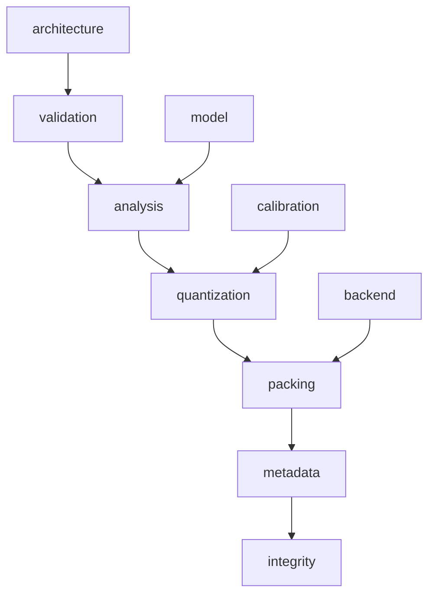

# Qwen3.8-27B model compiler plan (TASK-10)

> **Draft status:** conclusions in this document are **unverified** until the verification stage completes.

Phase 1 **conceptual offline compiler pipeline** from the BF16 Transformers
checkpoint to a TASK-09 runtime-model artifact for Qwen3.8-27B
language+MTP. Family taxonomy and occupancy come from
[`docs/architecture/model-inventory.md`](model-inventory.md) (TASK-01).
Source-weight distributions are **cited** from
[`docs/architecture/bf16-tensor-analysis.md`](bf16-tensor-analysis.md)
(TASK-05), not recomputed. Element formats, 22 recipes, 16 policy families,
and metadata lower bounds come from
[`docs/architecture/quantization-design-space.md`](quantization-design-space.md)
(TASK-08). Artifact kinds, representation/packing capabilities, integrity
slots, and open packing decisions come from
[`docs/architecture/runtime-format-design.md`](runtime-format-design.md)
(TASK-09). Sitting `text_config` instantiates occupancy products.

This document specifies a **conceptual compiler pipeline**, not a selected
profile, quantizer, file format, kernel, or layout. Prefill and decode share
**one** compiled artifact. The primary object is language+MTP checkpoint
parameters after a TASK-08 recipe (role `param`). The secondary object is
token-persistent **state schema** for \(K,V,C,S\) (role `state`). Activations
and accumulators are not compiler payloads. Algebraic equivalents in TASK-02
are the same real map; quantization and packing act on stored elements. If an
occupancy product would disagree with TASK-01 / sitting `text_config`, or a
cited absmax/zero count would disagree with TASK-05, or a recipe/family/metadata
lower bound would disagree with TASK-08, or a capability/open-decision id would
disagree with TASK-09, the earlier document wins and this one is wrong.

Claims are labelled OBSERVED (inventory/config occupancy), MEASURED (TASK-05
numbers cited, not recomputed from payloads), DERIVED (occupancy products,
packed-byte illustrations cited from TASK-08/09), or HYPOTHESIS (every
profile-intent rationale, every compiler-risk severity, every calibration-hook
usefulness claim). Vision-encoder internals are deferred and isolated in
Deferred vision. No new MEASURED payload statistics. No MEASURED quality or
tok/s. This is not a selected profile. Closing ownership classification does
not close Pareto, artifact boundary, or integrity algorithm value.

## Authority

| Item | Value | Label |
| --- | --- | --- |
| Dossier | [`docs/architecture/tasks/TASK-10.md`](tasks/TASK-10.md) | — |
| Inventory | [`docs/architecture/model-inventory.md`](model-inventory.md) (TASK-01) | OBSERVED |
| BF16 analysis | [`docs/architecture/bf16-tensor-analysis.md`](bf16-tensor-analysis.md) (TASK-05) | MEASURED citations |
| Quantization space | [`docs/architecture/quantization-design-space.md`](quantization-design-space.md) (TASK-08) | OBSERVED / DERIVED / HYPOTHESIS citations |
| Runtime format | [`docs/architecture/runtime-format-design.md`](runtime-format-design.md) (TASK-09) | OBSERVED / DERIVED / HYPOTHESIS citations |
| Config | [`.cache/authorities/qwen3.8-27b-transformers/config.json`](../../.cache/authorities/qwen3.8-27b-transformers/config.json) `text_config` | OBSERVED |
| Checker | [`scripts/check_model_compiler_plan.py`](../../scripts/check_model_compiler_plan.py) | DERIVED |
| Evidence policy | [`docs/architecture/plan.md`](plan.md) (OBSERVED / MEASURED / DERIVED / HYPOTHESIS) | OBSERVED |
| In scope | Language+MTP compile pipeline + ownership classification + conceptual profiles | — |
| Deferred | Vision encoder internals; TASK-15 tiles; TASK-18 corpora | — |
| Scope of this document | Conceptual compiler pipeline — not a selected profile, quantizer, file format, kernel, or layout | — |

Numeric ranks instantiate sitting `text_config` OBSERVED: `hidden_size`
5120, `intermediate_size` 17408, `vocab_size` 248320, 64 decoder layers,
48 linear + 16 full at indices 3,7,…,63, `mtp_num_hidden_layers` 1, `dtype`
`"bfloat16"`, `mamba_ssm_dtype` `"float32"`. Language+MTP occupancy is 866
tensors / 27320697856 parameters / 54641395712 BF16 bytes (OBSERVED). Unique
non-embed weight bytes are 52098598912. Embeddings and `lm_head` are untied
`(248320, 5120)` (`embed_lm_head_tied` false). Embed/`lm_head` unique bytes
are 2542796800 each.

## Compiler convention

Logical values in this document are graph nodes. They do not imply physical allocation, materialization, buffer reuse, or kernel fusion.

Compiler stages in this document are a conceptual pipeline, not a selected runtime implementation.

Quality, balanced, and compression profiles in this document are conceptual intent axes, not selected winners.

Profile-decision ownership is classified; recipe maps, packing winners, and calibration corpora remain unselected.

A stage is a named transform from checkpoint/profile inputs toward a TASK-09
artifact; listing it does not implement it. A compiler **profile** is a named
declaration the pipeline can apply. Listing quality/balanced/compression does
not assign a recipe to any family. Ownership is classified; winners stay
unselected. GGUF is not an input or output.

- Six compiler stages are complete for this task: `validation`, `analysis`, `quantization`, `packing`, `metadata`, `integrity`.
- A stage is a named transform from checkpoint/profile inputs toward a TASK-09 artifact; listing it does not implement it.
- Three conceptual profiles plus control emission are complete; listing them does not select a recipe map.
- Four ownership classes are complete: `architecture`, `model`, `calibration`, `backend`.
- The ledger open question (which profile decisions are architecture-, calibration-, model-, or backend-driven) is **closed by classification**.
- `models/Qwen3.8-27B-Q4_K_M.gguf` is not a compiler input, not the runtime format, and not a packing authority.
- The BF16 safetensors checkpoint is the source, not the compiled artifact.
- Fan-out ≠ must-store still holds; a compiled family is not a CUDA allocation.
- Pareto frontier remains open for TASK-18 (`pareto_frontier_selected` false).
- `compiler_profile_selected` false.

GGUF is not a compiler input (`gguf_is_not_compiler_input` true) and is not
the runtime format (`gguf_is_not_the_runtime_format` true); it remains a
future black-box Pareto reference (TASK-18). Safetensors under
`.cache/authorities/qwen3.8-27b-transformers` is the source checkpoint, not
the runtime bytes (`safetensors_is_source_not_runtime` true). Payloads are
not restreamed (`payloads_restreamed` false). Control emission is all defined
families `keep_source` (`vision_deferred` skipped): an identity compile, not
a quality winner (`control_profile_is_keep_source` true).

## Stage pipeline

JSON array `compiler_stage_ids` in this exact order (6 ids). JSON
`n_compiler_stages` = 6. JSON `stage_order_strict` true. Producer: this
compiler (conceptual). Consumers: TASK-13/14 schedules, TASK-15 layouts,
TASK-17 kernels (not specified here). Source: safetensors (not copied through
as the runtime bytes).

| id | Consumes | Produces | Does not do |
| --- | --- | --- | --- |
| `validation` | `config.json`, safetensor index, shard **headers** | Validated tensor directory matching TASK-01 occupancy | Payload histograms; recipe choice |
| `analysis` | Validated directory; TASK-05 citations; optional calibration hook | Per-family / per-tensor stats records | Recipe choice; packing |
| `quantization` | Analysis records; a **declared** profile (unselected here) | Element codes, group scales/zero-points, optional sidecars (logical) | Packing layout; TASK-15 tiles |
| `packing` | Quantized logical tensors; TASK-09 packing capabilities | Packed `payload` bytes and optional specialized `view` bytes | Selecting scale-storage/placement/align/bit-order |
| `metadata` | Identities, recipes, access classes, views, schema | `manifest`, `metadata_blob`, `view` bindings, `schema_state` | Kernels, tokenizer, activations |
| `integrity` | Packed payloads and manifest slots | `integrity_record` entries (`none` or `checksum` **unselected**) | Quality scores; NLL |

JSON array `compiler_input_ids` in this order: `config`,
`safetensor_headers`, `safetensor_payloads`, `profile_declaration`. JSON
`n_compiler_inputs` = 4. A future compiler may consume
`safetensor_payloads` at quantization time; this Phase 1 document does not
restream them. JSON array `compiler_output_kinds` equals TASK-09
`artifact_kinds` in the same order: `manifest`, `payload`, `metadata_blob`,
`sidecar`, `view`, `schema_state`. JSON `n_compiler_output_kinds` = 6.

After header `validation`, a future implementation **may** run analysis →
quantization → packing → metadata → integrity **per tensor**
(`per_tensor_streaming_allowed` true). That is the same six-stage pipeline,
not a selected engine and not a seventh stage.

JSON booleans (lock): `activations_in_artifact` false,
`kernels_in_artifact` false, `tokenizer_in_artifact` false,
`gguf_is_not_the_runtime_format` true, `gguf_is_not_compiler_input` true,
`safetensors_is_source_not_runtime` true, `embed_lm_head_tied` false,
`decode_prefill_share_artifact` true, `tile_layout_deferred_to_task15` true,
`artifact_boundary_selected` false, `ideal_byte_sequence_selected` false,
`state_payload_in_artifact_selected` false, `state_schema_required` true,
`learned_codebooks_required` false, `payloads_restreamed` false,
`compiler_profile_selected` false, `pareto_frontier_selected` false,
`integrity_algorithm_selected` false, `calibration_corpus_selected` false,
`gptq_is_not_a_scale_id` true, `activation_aware_scale_id_added` false,
`ownership_classified` true, `ledger_open_question_ownership_closed` true,
`vision_compile_deferred` true, `control_profile_is_keep_source` true,
`keep_source_packable_on_all_defined_families` true,
`per_tensor_streaming_allowed` true, `validation_reads_payloads` false.

Shared binding: catalog consumers `e` and `e_next` share one `E` payload;
`logits_0` and `logits_1` share one `W_lm` payload. Untied embed versus
`lm_head` remains two payloads. JSON `shared_weight_ids` = `["E","W_lm"]`.
Prefill and decode share one compiled artifact
(`decode_prefill_share_artifact` true).

## Validation and analysis

JSON array `validation_check_ids` in this exact order (7 ids). JSON
`n_validation_checks` = 7. Validation reads **headers**, not payload
histograms (`validation_reads_payloads` false). Non-finite payload detection
(`n_nonfinite == 0`) is a TASK-05 MEASURED fact the analysis stage **cites**;
a future compiler may re-assert it while streaming, but this document does
not restream.

| id | Check | Authority |
| --- | --- | --- |
| `occupancy_partition` | 1199 tensors, 18 shards; language+MTP 866 tensors / 27320697856 parameters / 54641395712 BF16 bytes | TASK-01 |
| `dtype_bf16` | Every checkpoint tensor `BF16`; `text_config.dtype == "bfloat16"`; `mamba_ssm_dtype == "float32"` | TASK-01/04 |
| `shard_map` | Index `weight_map` covers every tensor; all 18 shards present | TASK-01 |
| `family_taxonomy` | Every language+MTP tensor maps to a TASK-01 level-2 id and a TASK-08 policy family | TASK-01/08 |
| `config_ranks` | `hidden_size` 5120, `intermediate_size` 17408, `vocab_size` 248320, 64 layers, 48 linear + 16 full at indices 3,7,…,63, `mtp_num_hidden_layers` 1 | sitting `text_config` |
| `missing_checkpoint_blocked` | Missing directory, `config.json`, index, or shard → blocked (exit 2), not a content fail | TASK-01/05 |
| `gguf_not_input` | GGUF is not read | plan.md / TASK-09 |

JSON array `analysis_output_ids` in this exact order (5 ids). JSON
`n_analysis_outputs` = 5. JSON `analysis_cites_task05` true. JSON
`analysis_group_local_at_compile` true (conceptual). JSON
`calibration_hook_without_corpus` true. A conceptual calibration **hook** is
in scope; a corpus and an acceptance frontier are not
(`calibration_corpus_selected` false). Usefulness of the hook is HYPOTHESIS.

| id | Meaning | Owner class |
| --- | --- | --- |
| `family_absmax` | Cited TASK-05 pooled family absmax / rms / percentiles | `model` |
| `directional_ratios` | Cited TASK-05 row/col absmax ratios | `model` |
| `outlier_fractions` | Cited TASK-05 `frac_out_6x` / `frac_out_10x` | `model` |
| `group_local_stats` | Conceptual compile-time group absmax/rms/min/max/\(p_{99}\) / \(p_{50}\) for the declared recipe’s grouping | `model` |
| `optional_calibration_hook` | Optional activation / Hessian-like records; **no corpus selected** | `calibration` |

MEASURED citations that shape analysis records and profile **intent**
hypotheses, not winners:

| JSON key | Value | What it informs (HYPOTHESIS rationale, not a winner) |
| --- | --- | --- |
| `cit_language_mtp_absmax` | 19.25 | `gdn_time_param` stays near `keep_source` on the quality axis |
| `cit_dt_bias_absmax` | 19.25 | same |
| `cit_embed_n_zero` | 7528 | embed is the only pooled-zero location; gather packing still `row_addressable` |
| `cit_conv1d_frac_out_6x` | 0.1805953979492 | `conv1d` outlier recipes remain **candidates** on compression, not assignments |

MLP occupancy DERIVED: `mlp_n` 17112760320, `mlp_bf16_bytes` 34225520640.
Canonical TASK-05 non-conclusion: measurements are not bit/grouping/quality
recommendations.

## Quantization

The quantization stage applies **one** TASK-08 recipe per defined policy
family. The recipe **must** be a member of that family’s `family_candidates`.
`vision_deferred` is skipped (empty list). The 22 TASK-08 recipes remain the
only valid combinations: `keep_source`, `narrow_bf16`, `fp8_tensor`,
`i8_tensor`, `i8_row`, `i8_row_asym`, `i8_g32`, `i6_row`, `i4_row`,
`i4_col`, `i4_g32`, `i4_g64`, `i4_g128`, `i4_g128_p99`, `i4_g128_rms`,
`i4_g128_extract`, `i4_g32_mixed`, `i4_row_extract`, `i4_clip`, `i3_g32`,
`i3_g32_extract`, `i2_g32_extract`. Do not add `int5`, `fp8_e5m2`, GGUF
types, or learned codebooks (`learned_codebooks_required` false). JSON
`n_candidate_recipes` = 22. JSON `n_policy_families` = 16:
`norm_gamma`, `gdn_time_param`, `gdn_gate_proj`, `conv1d`,
`linear_large_proj`, `attn_qkv`, `attn_out`, `mlp_up_gate`, `mlp_down`,
`embed_table`, `lm_head`, `mtp_fc`, `vision_deferred`, `state_kv`,
`state_c`, `state_s`.

JSON array `quantization_output_ids` in this exact order (5 ids). JSON
`n_quantization_outputs` = 5: `element_codes`, `group_scales`,
`optional_zero_points`, `outlier_sidecar`, `mixed_width_map`.

Scale **values** for TASK-08 scale ids (`symmetric_absmax`, `symmetric_rms`,
`asymmetric_minmax`, `percentile_p99`) are computed from **source weights**
at compile time (ownership `model`). GPTQ / AWQ / Hessian / learned scales
are **not** a fifth TASK-08 scale id (`gptq_is_not_a_scale_id` true,
`activation_aware_scale_id_added` false). They may enter only through
`optional_calibration_hook`, producing scale **values** that still attach to
an existing integer recipe. Using that hook is ownership `calibration`. The
corpus is TASK-18 (`calibration_corpus_selected` false).

Control emission: every defined family `keep_source`
(`keep_source_packable_on_all_defined_families` true). Do not call control
a baseline quality winner. Rank-1 families must not receive `per_row` /
`per_col` recipes (TASK-08 validity). MTP rank-2 weights **mirror** the
matching language family. `mtp.fc` is its own family (`mtp_fc`).

An example assignment of `mlp_up_gate` × `i4_g128` is not a selected winner.
Packed-size illustrations (MLP int4 \(g=128\) ratio 0.2578125, total
8823767040 B; unique-non-embed 13431670032 B) are DERIVED citations from
TASK-08/09; these size illustrations are not a selected profile output.

## Packing, metadata, and integrity

**Packing** must be able to express all eight TASK-09
`packing_capability_ids` in TASK-09 order: `bit_pack`, `scale_storage`,
`scale_placement`, `alignment_pad`, `endian_le`, `row_addressable`,
`integrity_record`, `view_binding`. JSON `n_packing_capabilities` = 8. Do
not select among `scale_storage_bytes_candidates` `[2, 4]`,
`scale_placement_candidates` `["sidecar_array","interleaved_group"]`,
`alignment_grain_candidates` `[1, 16, 32, 128, 256]`, or
`code_bit_order_candidates` `["lsb_first","msb_first"]`. Portable-view
payloads remain little-endian (TASK-09 requirement, ownership
`architecture`). Specialized-view tiles remain TASK-15 (ownership
`backend`). Illustration packing may cite \(A=1\), \(s=2\), sidecar scales
so tight totals match TASK-08 lower bounds; those constants are
illustrations, not selected packing. TASK-09 format-risk ids
(`f_unpack_portable`, `f_repack_specialized`, `f_dual_view_size`,
`f_gather_stride`, `f_3bit_shift`, `f_outlier_index`) remain **related**,
not closed packing winners.

Embed gather remains `row_addressable` (access class `gather_row`, 10240 B
BF16 / 2562 B int4-row illustration). `lm_head` remains `dense_gemm` despite
matching embed shape.

**Metadata** writes TASK-09 kinds: `manifest` (tensor identity, TASK-08
family, recipe id, shape, access class, view list, integrity records,
**declared profile name**), `metadata_blob` (per-group scales and optional
zero-points), `sidecar` (`extract_high` sparse BF16 + indices; `mixed_group`
width map), `view` (portable and/or specialized projections),
`schema_state` (\(K,V\) rank \((4,T,256)\) BF16 conceptual; \(C\)
\(3\times 10240\) BF16; \(S\) \((48,128,128)\) F32 conceptual, `s_f32_bytes`
150994944; 17 KV instances including MTP; 48 C/S instances). State
**schema** is required; state **payload** inclusion remains unselected
(TASK-09). JSON `state_schema_required` true. JSON
`state_payload_in_artifact_selected` false.

**Integrity** is the stage that **owns** TASK-09 open decision
`integrity_algorithm` as a **slot-writing procedure**. JSON
`integrity_algorithm_candidates` = `["none","checksum"]`. JSON
`integrity_algorithm_selected` false. JSON `integrity_stage_emits_record`
true. When a future close picks `checksum`, the record is per-payload over
packed bytes and the algorithm identity is stored in the manifest; this
document does **not** pick CRC versus SHA versus another digest. Integrity
is not a quality metric (`c_integrity_as_quality`).

## Decision ownership

This heading **closes** the ledger open question: which profile decisions
are architecture-, calibration-, model-, or backend-driven. Classification
is the result. Recipe maps and packing values stay unselected.
`ownership_classified` true. `ledger_open_question_ownership_closed` true.

JSON array `ownership_class_ids` in this exact order (4 ids). JSON
`n_ownership_classes` = 4.

| id | Meaning |
| --- | --- |
| `architecture` | Follows Qwen3.8 structure, TASK-01–04/06–09 contracts, recipe validity, stage order, portable-view LE, schema, shared bindings |
| `model` | Follows this checkpoint’s TASK-05 source-weight distributions and compile-time group-local weight statistics |
| `calibration` | Requires activation / Hessian-like information, a corpus, or TASK-18 quality/Pareto evidence |
| `backend` | Requires TASK-15/16/17 layout, tile, specialized view, or artifact-approach choice |

JSON array `decision_ids` in this exact order (16 ids). JSON `n_decisions` =
16. JSON object `decision_ownership` maps each id to one ownership class.
JSON array `locked_structure_ids` = the first 8. JSON array
`unselected_winner_ids` = the last 8. JSON `n_locked_structure` = 8. JSON
`n_unselected_winners` = 8. JSON object `decision_selected` maps every
`unselected_winner_ids` id to `false`. JSON `n_unselected_winners_selected`
= 0.

| id | Kind | Owner | What is classified |
| --- | --- | --- | --- |
| `stage_pipeline` | locked structure | `architecture` | Six-stage order |
| `legal_recipe_set` | locked structure | `architecture` | 22 recipes and 16 `family_candidates` lists |
| `family_access_class` | locked structure | `architecture` | TASK-09 access-class map (gather vs GEMM vs conv vs state) |
| `shared_weight_binding` | locked structure | `architecture` | `E` and `W_lm` shared payloads; untied embed/`lm_head` |
| `state_schema` | locked structure | `architecture` | \(K,V,C,S\) schema required |
| `profile_intent_axes` | locked structure | `architecture` | Names `quality`, `balanced`, `compression` exist |
| `portable_encoding` | locked structure | `architecture` | Portable view little-endian when a portable view exists |
| `source_weight_statistics` | locked structure | `model` | TASK-05 absmax/rms/outliers/zeros as analysis inputs |
| `profile_recipe_map` | `unselected_winner` | `calibration` | Which recipe per family; closed later by TASK-18 Pareto with architecture legality and model-informed candidate sets |
| `activation_aware_scales` | `unselected_winner` | `calibration` | GPTQ/AWQ/Hessian **values** on an existing recipe; not a new scale id |
| `calibration_corpus` | `unselected_winner` | `calibration` | TASK-18 open question |
| `specialized_tile_view` | `unselected_winner` | `backend` | TASK-15 tile/swizzle/MMA in a specialized view |
| `artifact_boundary` | `unselected_winner` | `backend` | Which of the four TASK-09 artifact approaches |
| `packing_layout` | `unselected_winner` | `architecture` | Scale storage 2 vs 4, placement, portable bit-order |
| `alignment_grain` | `unselected_winner` | `backend` | Specialized-view alignment; portable illustration grain is not a winner |
| `integrity_algorithm` | `unselected_winner` | `architecture` | `none` vs `checksum` (and which digest); stage exists here, value unselected |

JSON `decision_ownership_values` parallel to `decision_ids`:
`["architecture","architecture","architecture","architecture","architecture","architecture","architecture","model","calibration","calibration","calibration","backend","backend","architecture","backend","architecture"]`.
JSON `n_architecture_decisions` = 9, `n_model_decisions` = 1,
`n_calibration_decisions` = 3, `n_backend_decisions` = 3.

- Architecture-driven: stage pipeline, legal recipe set, access classes, shared bindings, state schema, profile **names**, portable LE, packing-layout **capability** (value unselected), integrity **stage** (algorithm unselected).
- Model-driven: source-weight statistics and weight-derived scale **values** given a declared recipe.
- Calibration-driven: profile **recipe maps**, activation-aware scales, calibration corpus, and TASK-18 quality acceptance / Pareto.
- Backend-driven: specialized tile views, artifact-boundary approach, specialized alignment grain.

Profile-decision ownership is architecture for legal sets and intent-axis names, model for source-weight statistics, calibration for recipe maps and corpora, and backend for specialized views and artifact boundary.

Six-stage pipeline with four ownership classes (diagram 1 of 1). Stage order
is architecture; later `unselected_winner` values remain open.



## Conceptual profiles

JSON array `compiler_profile_ids` in this exact order (3 ids). JSON
`n_compiler_profiles` = 3. JSON `compiler_profile_selected` false. JSON
`control_profile_id` = `"control"`. Control is **not** a fourth intent axis;
it is the required identity emission. This is not a selected profile.

| id | Intent (HYPOTHESIS, not a recipe map) | Must remain true |
| --- | --- | --- |
| `quality` | Prefer `keep_source` or wider integer candidates on TASK-08 `quality_high_ids` families (`q_norm_gamma`, `q_gdn_time`, `q_gdn_gate`, `q_attn_out`, `q_mlp_down`, `q_state_kv`, `q_state_s`, `q_int2_mass`) | Every assigned recipe, if/when TASK-18 selects a map, stays inside `family_candidates`; this document assigns none |
| `balanced` | Mid-width integer **candidates** on mass GEMM families; size illustrations (int4 \(g=128\) ratio 0.2578125, unique-non-embed 13431670032 B) are DERIVED, not assignments | Same legality; no family column of recipes |
| `compression` | Include narrower **candidates** (`i3_g32`, and `i2_g32_extract` only where TASK-08 already lists them — `mlp_up_gate` mass) and accept higher quality/decode-risk **hypotheses** | Same legality; `q_int2_mass` remains HYPOTHESIS, not a selected compression recipe |

JSON `quality_high_ids` copied from TASK-08 in TASK-08 order:
`q_norm_gamma`, `q_gdn_time`, `q_gdn_gate`, `q_attn_out`, `q_mlp_down`,
`q_state_kv`, `q_state_s`, `q_int2_mass`. JSON `n_quality_high` = 8.

Compiler-risk hypotheses (every severity is HYPOTHESIS). JSON array
`compiler_risk_ids` in this exact order (6 ids). JSON `n_compiler_risks` =
6. JSON `compiler_high_ids`: `c_profile_as_winner`, `c_skip_validation`.
`compiler_medium_ids`: `c_calibration_as_scale_id`,
`c_bake_specialized_only`, `c_restream_in_study`. `compiler_low_ids`:
`c_integrity_as_quality`. JSON `n_compiler_high` = 2, `n_compiler_medium` =
3, `n_compiler_low` = 1.

| ID | Ties to | Severity | Claim (must remain HYPOTHESIS) |
| --- | --- | --- | --- |
| `c_profile_as_winner` | `compiler_profile_ids` | high | Treating quality/balanced/compression as selected recipe maps would freeze Pareto before TASK-18 |
| `c_skip_validation` | `validation_check_ids` | high | Emitting without occupancy/dtype/shard checks can desynchronize the artifact from TASK-01 |
| `c_calibration_as_scale_id` | `activation_aware_scales` | medium | Treating GPTQ/AWQ as a TASK-08 scale id would expand the recipe space without new evidence |
| `c_bake_specialized_only` | `artifact_boundary`, TASK-09 `f_repack_specialized` | medium | Dropping the portable view forces a new packed artifact per backend |
| `c_restream_in_study` | `payloads_restreamed` | medium | Restreaming payloads in this Phase 1 document would duplicate TASK-05 without changing ownership |
| `c_integrity_as_quality` | `integrity_algorithm` | low | Choosing `none` vs `checksum` is not a quality/NLL decision |

## Deferred vision

Visual tokens may replace placeholders in the residual stream
(`out_hidden_size` 5120 OBSERVED). Encoder / patch embed / merger compile
stages are **UNKNOWN**. `vision_deferred` has an empty candidate list and is
skipped by every profile including control. Do not add vision payloads.
`vision_compile_deferred` true.

## Machine-checkable summary JSON

Live object from `text_config` arithmetic plus locked constants (copied
from
[`scripts/check_model_compiler_plan.py --json`](../../scripts/check_model_compiler_plan.py)):

```json
{
  "authority": ".cache/authorities/qwen3.8-27b-transformers",
  "hidden_size": 5120,
  "intermediate_size": 17408,
  "vocab_size": 248320,
  "n_decoder_layers": 64,
  "n_linear_layers": 48,
  "n_full_layers": 16,
  "n_mtp_blocks": 1,
  "full_attention_indices": [
    3,
    7,
    11,
    15,
    19,
    23,
    27,
    31,
    35,
    39,
    43,
    47,
    51,
    55,
    59,
    63
  ],
  "bytes_bf16": 2,
  "bytes_f32": 4,
  "n_language_mtp_tensors": 866,
  "n_language_mtp_parameters": 27320697856,
  "mlp_n": 17112760320,
  "embed_n": 1271398400,
  "mlp_bf16_bytes": 34225520640,
  "mlp_int4_g128_total_bytes": 8823767040,
  "mlp_int4_g128_over_bf16": 0.2578125,
  "weight_bytes_language_mlp": 34225520640,
  "weight_bytes_lm_head": 2542796800,
  "weight_bytes_embed_table": 2542796800,
  "weight_bytes_language_mtp_excl_vision": 54641395712,
  "weight_bytes_unique_non_embed": 52098598912,
  "unique_non_embed_int4_g128_total_bytes": 13431670032,
  "embed_gather_bf16_bytes": 10240,
  "embed_gather_int4_row_bytes": 2562,
  "s_f32_bytes": 150994944,
  "cit_language_mtp_absmax": 19.25,
  "cit_dt_bias_absmax": 19.25,
  "cit_embed_n_zero": 7528,
  "cit_conv1d_frac_out_6x": 0.1805953979492,
  "compiler_stage_ids": [
    "validation",
    "analysis",
    "quantization",
    "packing",
    "metadata",
    "integrity"
  ],
  "n_compiler_stages": 6,
  "stage_order_strict": true,
  "compiler_input_ids": [
    "config",
    "safetensor_headers",
    "safetensor_payloads",
    "profile_declaration"
  ],
  "n_compiler_inputs": 4,
  "compiler_output_kinds": [
    "manifest",
    "payload",
    "metadata_blob",
    "sidecar",
    "view",
    "schema_state"
  ],
  "n_compiler_output_kinds": 6,
  "per_tensor_streaming_allowed": true,
  "validation_check_ids": [
    "occupancy_partition",
    "dtype_bf16",
    "shard_map",
    "family_taxonomy",
    "config_ranks",
    "missing_checkpoint_blocked",
    "gguf_not_input"
  ],
  "n_validation_checks": 7,
  "validation_reads_payloads": false,
  "analysis_output_ids": [
    "family_absmax",
    "directional_ratios",
    "outlier_fractions",
    "group_local_stats",
    "optional_calibration_hook"
  ],
  "n_analysis_outputs": 5,
  "analysis_cites_task05": true,
  "analysis_group_local_at_compile": true,
  "calibration_hook_without_corpus": true,
  "quantization_output_ids": [
    "element_codes",
    "group_scales",
    "optional_zero_points",
    "outlier_sidecar",
    "mixed_width_map"
  ],
  "n_quantization_outputs": 5,
  "packing_capability_ids": [
    "bit_pack",
    "scale_storage",
    "scale_placement",
    "alignment_pad",
    "endian_le",
    "row_addressable",
    "integrity_record",
    "view_binding"
  ],
  "n_packing_capabilities": 8,
  "integrity_algorithm_candidates": [
    "none",
    "checksum"
  ],
  "integrity_algorithm_selected": false,
  "integrity_stage_emits_record": true,
  "ownership_class_ids": [
    "architecture",
    "model",
    "calibration",
    "backend"
  ],
  "n_ownership_classes": 4,
  "decision_ids": [
    "stage_pipeline",
    "legal_recipe_set",
    "family_access_class",
    "shared_weight_binding",
    "state_schema",
    "profile_intent_axes",
    "portable_encoding",
    "source_weight_statistics",
    "profile_recipe_map",
    "activation_aware_scales",
    "calibration_corpus",
    "specialized_tile_view",
    "artifact_boundary",
    "packing_layout",
    "alignment_grain",
    "integrity_algorithm"
  ],
  "decision_ownership": {
    "stage_pipeline": "architecture",
    "legal_recipe_set": "architecture",
    "family_access_class": "architecture",
    "shared_weight_binding": "architecture",
    "state_schema": "architecture",
    "profile_intent_axes": "architecture",
    "portable_encoding": "architecture",
    "source_weight_statistics": "model",
    "profile_recipe_map": "calibration",
    "activation_aware_scales": "calibration",
    "calibration_corpus": "calibration",
    "specialized_tile_view": "backend",
    "artifact_boundary": "backend",
    "packing_layout": "architecture",
    "alignment_grain": "backend",
    "integrity_algorithm": "architecture"
  },
  "decision_ownership_values": [
    "architecture",
    "architecture",
    "architecture",
    "architecture",
    "architecture",
    "architecture",
    "architecture",
    "model",
    "calibration",
    "calibration",
    "calibration",
    "backend",
    "backend",
    "architecture",
    "backend",
    "architecture"
  ],
  "locked_structure_ids": [
    "stage_pipeline",
    "legal_recipe_set",
    "family_access_class",
    "shared_weight_binding",
    "state_schema",
    "profile_intent_axes",
    "portable_encoding",
    "source_weight_statistics"
  ],
  "unselected_winner_ids": [
    "profile_recipe_map",
    "activation_aware_scales",
    "calibration_corpus",
    "specialized_tile_view",
    "artifact_boundary",
    "packing_layout",
    "alignment_grain",
    "integrity_algorithm"
  ],
  "n_decisions": 16,
  "n_locked_structure": 8,
  "n_unselected_winners": 8,
  "decision_selected": {
    "profile_recipe_map": false,
    "activation_aware_scales": false,
    "calibration_corpus": false,
    "specialized_tile_view": false,
    "artifact_boundary": false,
    "packing_layout": false,
    "alignment_grain": false,
    "integrity_algorithm": false
  },
  "n_unselected_winners_selected": 0,
  "n_architecture_decisions": 9,
  "n_model_decisions": 1,
  "n_calibration_decisions": 3,
  "n_backend_decisions": 3,
  "ownership_classified": true,
  "ledger_open_question_ownership_closed": true,
  "ownership_question_sentence": "Profile-decision ownership is architecture for legal sets and intent-axis names, model for source-weight statistics, calibration for recipe maps and corpora, and backend for specialized views and artifact boundary.",
  "compiler_profile_ids": [
    "quality",
    "balanced",
    "compression"
  ],
  "n_compiler_profiles": 3,
  "control_profile_id": "control",
  "control_profile_is_keep_source": true,
  "compiler_profile_selected": false,
  "quality_high_ids": [
    "q_norm_gamma",
    "q_gdn_time",
    "q_gdn_gate",
    "q_attn_out",
    "q_mlp_down",
    "q_state_kv",
    "q_state_s",
    "q_int2_mass"
  ],
  "n_quality_high": 8,
  "compiler_risk_ids": [
    "c_profile_as_winner",
    "c_skip_validation",
    "c_calibration_as_scale_id",
    "c_bake_specialized_only",
    "c_restream_in_study",
    "c_integrity_as_quality"
  ],
  "compiler_risk_severities": [
    "high",
    "high",
    "medium",
    "medium",
    "medium",
    "low"
  ],
  "compiler_high_ids": [
    "c_profile_as_winner",
    "c_skip_validation"
  ],
  "compiler_medium_ids": [
    "c_calibration_as_scale_id",
    "c_bake_specialized_only",
    "c_restream_in_study"
  ],
  "compiler_low_ids": [
    "c_integrity_as_quality"
  ],
  "n_compiler_risks": 6,
  "n_compiler_high": 2,
  "n_compiler_medium": 3,
  "n_compiler_low": 1,
  "policy_families": [
    "norm_gamma",
    "gdn_time_param",
    "gdn_gate_proj",
    "conv1d",
    "linear_large_proj",
    "attn_qkv",
    "attn_out",
    "mlp_up_gate",
    "mlp_down",
    "embed_table",
    "lm_head",
    "mtp_fc",
    "vision_deferred",
    "state_kv",
    "state_c",
    "state_s"
  ],
  "candidate_recipe_ids": [
    "keep_source",
    "narrow_bf16",
    "fp8_tensor",
    "i8_tensor",
    "i8_row",
    "i8_row_asym",
    "i8_g32",
    "i6_row",
    "i4_row",
    "i4_col",
    "i4_g32",
    "i4_g64",
    "i4_g128",
    "i4_g128_p99",
    "i4_g128_rms",
    "i4_g128_extract",
    "i4_g32_mixed",
    "i4_row_extract",
    "i4_clip",
    "i3_g32",
    "i3_g32_extract",
    "i2_g32_extract"
  ],
  "n_policy_families": 16,
  "n_candidate_recipes": 22,
  "keep_source_packable_on_all_defined_families": true,
  "shared_weight_ids": [
    "E",
    "W_lm"
  ],
  "activations_in_artifact": false,
  "kernels_in_artifact": false,
  "tokenizer_in_artifact": false,
  "gguf_is_not_the_runtime_format": true,
  "gguf_is_not_compiler_input": true,
  "safetensors_is_source_not_runtime": true,
  "embed_lm_head_tied": false,
  "decode_prefill_share_artifact": true,
  "tile_layout_deferred_to_task15": true,
  "artifact_boundary_selected": false,
  "ideal_byte_sequence_selected": false,
  "state_payload_in_artifact_selected": false,
  "state_schema_required": true,
  "learned_codebooks_required": false,
  "pareto_frontier_selected": false,
  "payloads_restreamed": false,
  "calibration_corpus_selected": false,
  "gptq_is_not_a_scale_id": true,
  "activation_aware_scale_id_added": false,
  "vision_compile_deferred": true,
  "diagram_ids": [
    "validation",
    "analysis",
    "quantization",
    "packing",
    "metadata",
    "integrity",
    "architecture",
    "model",
    "calibration",
    "backend"
  ],
  "n_diagrams": 1,
  "canonical_sentence_logical": "Logical values in this document are graph nodes. They do not imply physical allocation, materialization, buffer reuse, or kernel fusion.",
  "canonical_sentence_stages": "Compiler stages in this document are a conceptual pipeline, not a selected runtime implementation.",
  "canonical_sentence_profiles": "Quality, balanced, and compression profiles in this document are conceptual intent axes, not selected winners.",
  "canonical_sentence_ownership": "Profile-decision ownership is classified; recipe maps, packing winners, and calibration corpora remain unselected."
}
```
