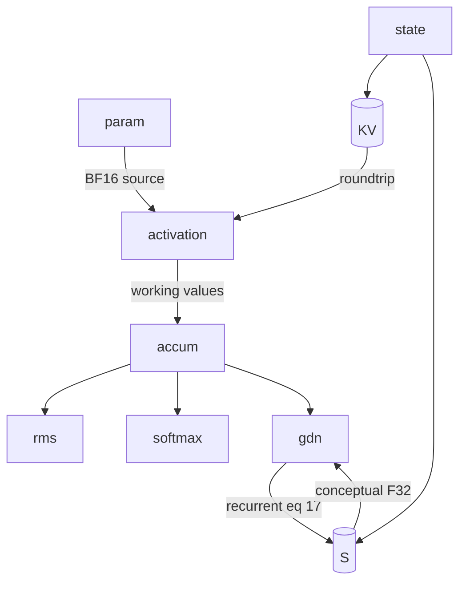

# Qwen3.8-27B numerical sensitivity (TASK-07)

All MTP-only counts are conditional on TASK-02's unverified analysis model.

> **Draft status:** conclusions in this document are **unverified** until the verification stage completes.

Phase 1 mathematical precision-risk analysis for the Qwen3.8-27B language +
MTP forward map. Equations, ranks, and operator definitions come from
[`docs/architecture/model-semantics.md`](model-semantics.md) (TASK-02).
Persistent-state conceptual dtypes and token-boundary survival come from
[`docs/architecture/lifetime-and-state.md`](lifetime-and-state.md) (TASK-04).
Contraction \(K\)-dimensions may be cited from
[`docs/architecture/work-and-traffic.md`](work-and-traffic.md) (TASK-06) as the
same \(d_\text{in}\) already in TASK-02; this document does not recopy MAC or
byte tables.

This document specifies mathematical precision risks, not kernels or a
mixed-precision recipe. Prefill and decode share one sensitivity model. Only
\(T\) (softmax/AV/GDN horizon, RoPE phase) and whether incoming
\((K,V,C,S)\) is zeros versus populated change. Primary op-counts include MTP.
If a reduction length, layer count, or state dtype would disagree with a
TASK-02 operator, TASK-04 conceptual dtype, or sitting `text_config` key, the
earlier document / config wins and this one is wrong.

Claims are labelled OBSERVED (config/inventory dtypes and constants), DERIVED
(reduction lengths, layer counts, IEEE widths, comparisons such as
\(\varepsilon <\) BF16 ulp at 1), or HYPOTHESIS (every risk class, severity,
and quality-visible-error claim). No MEASURED claims. Validation survival of
these hypotheses is not decided here (TASK-18).

## Authority

| Item | Value | Label |
| --- | --- | --- |
| Dossier | [`docs/architecture/tasks/TASK-07.md`](tasks/TASK-07.md) | — |
| Semantics | [`docs/architecture/model-semantics.md`](model-semantics.md) (TASK-02) | OBSERVED / DERIVED |
| Lifetime | [`docs/architecture/lifetime-and-state.md`](lifetime-and-state.md) (TASK-04) | OBSERVED / DERIVED |
| Inventory | [`docs/architecture/model-inventory.md`](model-inventory.md) (TASK-01) | OBSERVED |
| Work/traffic | [`docs/architecture/work-and-traffic.md`](work-and-traffic.md) (TASK-06) | citation of contraction \(d_\text{in}\) only |
| Config | [`.cache/authorities/qwen3.8-27b-transformers/config.json`](../../.cache/authorities/qwen3.8-27b-transformers/config.json) `text_config` | OBSERVED |
| Checker | [`scripts/check_numerical_sensitivity.py`](../../scripts/check_numerical_sensitivity.py) | DERIVED |
| Evidence policy | [`docs/architecture/plan.md`](plan.md) (OBSERVED / DERIVED / HYPOTHESIS) | OBSERVED |
| In scope | Language + MTP precision roles, sensitive ops, and accumulation paths | — |
| Deferred | Vision encoder internals (residual-stream interface only) | — |
| Scope of this document | Mathematical precision risks — not kernels or a mixed-precision recipe | — |

Numeric ranks instantiate sitting `text_config` OBSERVED: `hidden_size` 5120,
`intermediate_size` 17408, `vocab_size` 248320, 64 decoder layers, 48 linear +
16 full, `mtp_num_hidden_layers` 1, `head_dim` 256, linear widths
\(d_\text{qkv}=10240\), `linear_key_head_dim` / `linear_value_head_dim` 128,
`dtype` `"bfloat16"`, `mamba_ssm_dtype` `"float32"`, `rms_norm_eps` \(10^{-6}\),
`max_position_embeddings` 262144, `rope_theta` 10000000. Reduction lengths and
op counts are DERIVED. Risk **labels** are HYPOTHESIS.

## Precision roles

Logical values in this document are graph nodes. They do not imply physical allocation, materialization, buffer reuse, or kernel fusion.

Risk classifications in this document are hypotheses, not measurements.

Config dtypes name conceptual element types for parameters and persistent state; they are not CUDA accumulation or kernel dtypes.

- Four precision roles are complete for this task: `param`, `activation`, `accum`, `state`.
- A config dtype is not an activation working-precision or GEMM-accumulator decision.
- Fan-out ≠ must-store still holds; naming a sensitive catalog ID is not a CUDA store.

| Role | JSON | Meaning |
| --- | --- | --- |
| `param` | `precision_roles[0]` | Source parameter element type. OBSERVED: every checkpoint tensor is BF16, including `A_log`, `dt_bias`, and all RMSNorm \(\gamma\). |
| `activation` | `precision_roles[1]` | Working/transport values of the TASK-03 catalog except token-persistent state. No OBSERVED CUDA/activation dtype; `text_config.dtype` does **not** decide this role. |
| `accum` | `precision_roles[2]` | Inner sums and normalizers of multi-term maps (GEMM K-reduction, RMS/L2, softmax/AV over \(T\), GDN recurrence and \(d_k\) inner products, conv taps). No config accumulator dtype. |
| `state` | `precision_roles[3]` | Token-persistent \(K,V,C,S\). Conceptual dtypes from TASK-02/04: BF16 for \(K,V,C\); F32 for \(S\). |

Do not add a fifth role. RoPE frequencies, softmax scale, and \(\alpha/\beta\)
sit under `activation` / `accum` via mechanism `exp_range`. Mixed-precision
recipes are TASK-17/08, not a role.

Risk mechanisms (JSON `risk_mechanisms`, this order). Each `sensitive_ops` row
names one primary mechanism.

| Mechanism | Meaning |
| --- | --- |
| `long_sum` | Combining \(N>1\) addends (GEMM K, AV over \(T\), conv taps, GDN inner \(d_k\)). |
| `normalize` | Divide by RMS or L2 (possibly after a long sum of squares). |
| `exp_range` | `exp` / `softplus` / `sigmoid` / `SiLU` / softmax / \(\cos,\sin\) of a large phase. |
| `recurrent` | \(S_t\) depends on \(S_{t-1}\) with multiplicative \(\alpha_t\in(0,1]\); horizon scales with \(T\). |
| `roundtrip` | Write then read token-persistent state. |
| `residual_add` | \(h \leftarrow h + \mathrm{Mix}\) or \(h \leftarrow h + \mathrm{MLP}\). |
| `narrow_element` | Carrying a value in a 7-bit-mantissa format (BF16), or hypothesizing a store narrower than the conceptual state dtype. |

## IEEE widths and config dtypes

General numerical-analysis facts (DERIVED from IEEE 754 binary32 and the de
facto BF16 layout; not measured). These are IEEE widths, not CUDA allocation
dtypes and not GGUF sizes.

| Format | Sign | Exp | Trailing significand | ULP at 1 | JSON |
| --- | ---: | ---: | ---: | ---: | --- |
| BF16 | 1 | 8 | 7 | \(2^{-7}=0.0078125\) | `bf16_mantissa_bits` 7, `bf16_exp_bits` 8, `bf16_ulp_at_1` 0.0078125 |
| F32 | 1 | 8 | 23 | \(2^{-23}\) | `f32_mantissa_bits` 23, `f32_exp_bits` 8 |

JSON: `bytes_bf16` = 2, `bytes_f32` = 4 (same conceptual sizes as TASK-04).

Config (OBSERVED):

| Key | Value | Applies to |
| --- | --- | --- |
| `text_config.dtype` | `"bfloat16"` | `param`; conceptual \(K,V,C\) |
| `text_config.mamba_ssm_dtype` | `"float32"` | conceptual \(S\) and the \(\alpha/\beta\) parameterization (TASK-02); **not** activations |
| `rms_norm_eps` | \(10^{-6}\) | \(\varepsilon\) in `(2)`, `(3)`, `(16)` |
| `max_position_embeddings` | 262144 | \(T\) horizon ceiling for softmax/AV/RoPE/GDN hypotheses |
| `rope_theta` | 10000000 | \(\theta\) in `(11)` |
| `head_dim` | 256 | softmax scale \(d_h^{-1/2}=1/16=0.0625\) |

JSON booleans: `mamba_ssm_dtype_is_not_activation_dtype` true;
`activation_dtype_decided` false; `eps_lt_bf16_ulp_at_1` true
(\(10^{-6} < 0.0078125\), DERIVED). Config `dtype` and `mamba_ssm_dtype` name
conceptual element types for parameters and persistent state. They are not
CUDA accumulation dtypes, kernel dtypes, or an activation working-precision
decision. This document does not claim that RMS, softmax, or GEMM run in BF16;
that would be a HYPOTHESIS about the `accum` role, and the risk table already
encodes it without asserting a kernel dtype.

## Weights

Role `param`. Inventory OBSERVED: all checkpoint tensors are BF16, including
RMSNorm \(\gamma\), `A_log`, and `dt_bias`. Embed `(1)` is a gather: no
reduction, so it does not appear as an `accum` row. `A_log` / `dt_bias` remain
BF16 **parameters** used in the F32-conceptual \(\alpha/\beta\) path `(15)`;
`mamba_ssm_dtype` does not retype those tensors. Further narrowing, grouping,
or outlier policy is TASK-08. Weight **role** is the OBSERVED BF16 source
format plus DERIVED contraction widths (`gemm_k5120` \(K=5120\),
`gemm_k17408` \(K=17408\), `gemm_lm_head` \(K=5120\) into \(V=248320\) outputs).
TASK-06 cites the same \(d_\text{in}\). `param_bf16` medium (HYPOTHESIS) means
the BF16 checkpoint is the study’s high-precision **source**, not that BF16
weights are an experimental defect.

## Activations

Role `activation`. Working/transport values of the TASK-03 catalog except
token-persistent `K_state`, `V_state`, `C_state`, `S`. No OBSERVED activation
working dtype.

| ID | Catalog / map | Mechanism | Notes |
| --- | --- | --- | --- |
| `residual_stream` | `h`, `h_mid` | `residual_add` | `(4)` Mix add and `(5)` MLP add; 128 language / 130 complete residual adds (DERIVED) |
| `live_across_gates` | `g`, `z` | `narrow_element` | `g`: \(24\times256\); `z`: \(48\times128\); live-across TASK-04 |
| `silu_sigmoid` | SiLU / \(\sigma\) | `exp_range` | elementwise `(3)` `(10)` `(14)` `(21)` |
| `rope_phase` | RoPE `(11)`–`(12)` | `exp_range` | \(p\cdot\omega_0=T\) with \(\omega_0=1\); \(T\le 262144\) |

These name existing catalog IDs, not a new catalog. Fan-out ≠ must-store still
holds.

## Reductions and accumulation paths

Role `accum`. Inner sums and normalizers. No config accumulator dtype. Primary
GDN numerical definition is the recurrent left-to-right map `(17)`–`(18)`
(JSON `gdn_primary_is_recurrent_eq_17` true). Chunkwise / WY evaluation of the
same real map may disagree in finite precision (HYPOTHESIS;
`chunkwise_fp_gap_is_hypothesis` true). That gap is not a second model and is
not an extra `sensitive_ops` row.

Softmax over \(V\) (sampling) is out of scope; logits are the forward-map
output. `gemm_lm_head` is the \(H\)-reduction into logits `(22)` `(24)`.

| ID | Mechanism | Width / horizon (DERIVED) | Eqs |
| --- | --- | --- | --- |
| `rms_hidden` | `normalize` | \(N=5120\); 129 language / 134 complete maps | `(2)` `(4)` `(5)` `(22)` `(23)` `(24)` |
| `rms_head` | `normalize` | 256 (QK) or 128 (GDN gated) | `(3)` `(8)` |
| `l2_gdn` | `normalize` | 128 per Q/K head | `(16)` |
| `softmax_over_T` | `exp_range` | \(T\in\{1,4096\}\) examples; \(T\le 262144\) | `(9)` |
| `attn_av_over_T` | `long_sum` | same \(T\) | `(9)` |
| `gemm_k5120` | `long_sum` | \(K=5120\) | `(6)` `(10)` `(13)` `(21)` up/gate `(22)` `(23)` |
| `gemm_k6144` | `long_sum` | \(K=6144\) | GDN `W_out` `(20)` |
| `gemm_k17408` | `long_sum` | \(K=17408\) | `(21)` down |
| `gemm_lm_head` | `long_sum` | \(K=5120\), \(V=248320\) outputs | `(22)` `(24)` |
| `gdn_S_recurrent` | `recurrent` | \(T\) steps, \(48\times128\times128\) per layer | `(17)` `(18)` |
| `gdn_inner_d128` | `long_sum` | 128 | `(17)` `(18)` |
| `gdn_alpha_beta` | `exp_range` | nested exp / softplus / sigmoid; 48 heads | `(15)` |
| `conv_fir` | `long_sum` | 4 taps | `(14)` |

Op counts (DERIVED from `text_config`; primary includes MTP):
`n_residual_adds_language` 128, `n_residual_adds_complete` 130,
`n_rms_hidden_language` 129, `n_rms_hidden_complete` 134 (`pre_fc` \(\times 2\),
layer in+post, `mtp.norm`), `n_rms_qk` 34, `n_rms_gdn` 48. Attention softmax/AV
length at stored \(T\) includes the current token (TASK-04). `example_T` is
`[1, 4096]`; `T_max` is 262144; `T_is_stored_length_after_append` true;
`decode_T_new` 1. Softmax scale \(d_h^{-1/2}=0.0625\). RoPE phase at
the maximum zero-based position \(T_\max-1\) for \(j=0\) is
\((T_\max-1)\omega_0=262143\).

## Persistent state

Role `state`. TASK-02/04 conceptual dtypes: BF16 for \(K,V,C\); F32 for \(S\).
State IDs: `K_state`, `V_state`, `C_state`, `S`. Roundtrip is write then read
across the token boundary. Primary includes MTP KV (17 full-attention
instances). Citations recomputed as TASK-04 (DERIVED ranks \(\times\) 2 or 4):
`kv_bytes_all_per_token` 69632, `c_bytes_all` 2949120, `s_bytes_all`
150994944, `s_elems_per_layer` 786432, `linear_qkv_width` 10240,
`linear_conv_delay` 3.

| ID | Mechanism | Width / horizon (DERIVED) | Notes |
| --- | --- | --- | --- |
| `state_kv_bf16` | `roundtrip` | 17 KV instances; RoPE baked into \(K\) | conceptual BF16 |
| `state_c_bf16` | `roundtrip` | 3 delay vectors \(\times\) 10240 | `(14)`; conceptual BF16 |
| `s_below_f32` | `narrow_element` | \(48\times128\times128\) F32 per linear layer | hypothesized narrowing of \(S\) |

`s_below_f32` is the hypothesized risk of storing \(S\) narrower than
conceptual F32. Conceptual F32 \(S\) is the TASK-02/04 reference, not a
measured requirement, and not a claim that F32 \(S\) is itself risky.

## Risk classification

Complete 20-row table. Every severity cell is HYPOTHESIS. Locked partitions:
`high_risk_ids` (9), `medium_risk_ids` (9), `low_risk_ids` (3). This table does
not claim experimental proof or validation survival.

| ID | Role | Mechanism | Width / horizon (DERIVED) | Eqs | Severity |
| --- | --- | --- | --- | --- | --- |
| `param_bf16` | param | narrow_element | all checkpoint tensors BF16 | weights | medium (HYPOTHESIS) |
| `residual_stream` | activation | residual_add | 128 language adds / 130 complete | (4)(5) | high (HYPOTHESIS) |
| `live_across_gates` | activation | narrow_element | `g`: \(24\times256\); `z`: \(48\times128\) | (7)(10)(13)(20) | medium (HYPOTHESIS) |
| `silu_sigmoid` | activation | exp_range | elementwise | (3)(10)(14)(21) | low (HYPOTHESIS) |
| `rms_hidden` | accum | normalize | \(N=5120\), 129 language / 134 complete maps | (2)(4)(5)(22)(23)(24) | high (HYPOTHESIS) |
| `rms_head` | accum | normalize | 256 (QK) or 128 (GDN gated) | (3)(8) | medium (HYPOTHESIS) |
| `l2_gdn` | accum | normalize | 128 per Q/K head | (16) | medium (HYPOTHESIS) |
| `softmax_over_T` | accum | exp_range | \(T\in\{1,4096\}\); \(T\le 262144\) | (9) | high (HYPOTHESIS) |
| `attn_av_over_T` | accum | long_sum | same \(T\) | (9) | high (HYPOTHESIS) |
| `gemm_k5120` | accum | long_sum | \(K=5120\) | (6)(10)(13)(21-up/gate)(22)(23) | medium (HYPOTHESIS) |
| `gemm_k6144` | accum | long_sum | \(K=6144\) | GDN `W_out` (20) | medium (HYPOTHESIS) |
| `gemm_k17408` | accum | long_sum | \(K=17408\) | (21) down | medium (HYPOTHESIS) |
| `gemm_lm_head` | accum | long_sum | \(K=5120\), \(V=248320\) outputs | (22)(24) | medium (HYPOTHESIS) |
| `gdn_S_recurrent` | accum | recurrent | \(T\) steps, \(48\times128\times128\) per layer | (17)(18) | high (HYPOTHESIS) |
| `gdn_inner_d128` | accum | long_sum | 128 | (17)(18) | medium (HYPOTHESIS) |
| `gdn_alpha_beta` | accum | exp_range | nested exp / softplus / sigmoid; 48 heads | (15) | high (HYPOTHESIS) |
| `rope_phase` | activation | exp_range | \(p\cdot\omega_0=T\) with \(\omega_0=1\); \(T\le 262144\) | (11)(12) | high (HYPOTHESIS) |
| `state_kv_bf16` | state | roundtrip | 17 KV instances; RoPE baked into \(K\) | state | high (HYPOTHESIS) |
| `state_c_bf16` | state | roundtrip | 3 delay vectors \(\times\) 10240 | (14) | low (HYPOTHESIS) |
| `s_below_f32` | state | narrow_element | conceptual \(S\) is F32; narrowing is the risk | (17) | high (HYPOTHESIS) |
| `conv_fir` | accum | long_sum | 4 taps | (14) | low (HYPOTHESIS) |

Diagram 1 of 1. Precision-role summary of hypothesized numerical-risk paths.
Not a kernel recipe and not an unrolling of 64 layers.



## Deferred vision

Visual tokens may replace placeholders in the residual stream
(`out_hidden_size` 5120 OBSERVED). Encoder / patch embed / merger numerical
sensitivity is **UNKNOWN**. Do not add vision-sensitive ops to `sensitive_ops`.

## Machine-checkable summary JSON

Live object from `text_config` arithmetic plus locked constants (copied from
[`scripts/check_numerical_sensitivity.py --json`](../../scripts/check_numerical_sensitivity.py)):

```json
{
  "authority": ".cache/authorities/qwen3.8-27b-transformers",
  "hidden_size": 5120,
  "intermediate_size": 17408,
  "vocab_size": 248320,
  "n_decoder_layers": 64,
  "n_linear_layers": 48,
  "n_full_layers": 16,
  "n_mtp_blocks": 1,
  "n_full_layers_with_kv": 17,
  "full_attention_indices": [
    3,
    7,
    11,
    15,
    19,
    23,
    27,
    31,
    35,
    39,
    43,
    47,
    51,
    55,
    59,
    63
  ],
  "n_attn_heads": 24,
  "n_kv_heads": 4,
  "head_dim": 256,
  "linear_num_value_heads": 48,
  "linear_key_head_dim": 128,
  "linear_value_head_dim": 128,
  "linear_qkv_width": 10240,
  "linear_conv_kernel_dim": 4,
  "linear_conv_delay": 3,
  "bytes_bf16": 2,
  "bytes_f32": 4,
  "bf16_mantissa_bits": 7,
  "bf16_exp_bits": 8,
  "f32_mantissa_bits": 23,
  "f32_exp_bits": 8,
  "bf16_ulp_at_1": 0.0078125,
  "eps": 1e-06,
  "eps_lt_bf16_ulp_at_1": true,
  "softmax_scale": 0.0625,
  "rope_theta": 10000000,
  "T_max": 262144,
  "rope_phase_at_T_max_j0": 262143,
  "T_is_stored_length_after_append": true,
  "decode_T_new": 1,
  "primary_includes_mtp": true,
  "example_T": [
    1,
    4096
  ],
  "param_dtype": "bfloat16",
  "kv_conceptual_dtype": "bfloat16",
  "c_conceptual_dtype": "bfloat16",
  "s_conceptual_dtype": "float32",
  "mamba_ssm_dtype_is_not_activation_dtype": true,
  "activation_dtype_decided": false,
  "gdn_primary_is_recurrent_eq_17": true,
  "chunkwise_fp_gap_is_hypothesis": true,
  "reduction_rms_hidden": 5120,
  "reduction_rms_qk": 256,
  "reduction_rms_gdn": 128,
  "reduction_l2_gdn": 128,
  "reduction_gemm_hidden": 5120,
  "reduction_gemm_gdn_out": 6144,
  "reduction_gemm_mlp_down": 17408,
  "reduction_lm_head_k": 5120,
  "reduction_lm_head_outputs": 248320,
  "reduction_conv": 4,
  "reduction_gdn_inner": 128,
  "reduction_attn_over_T_max": 262144,
  "reduction_attn_over_T_at_example_T": [
    1,
    4096
  ],
  "n_residual_adds_language": 128,
  "n_residual_adds_complete": 130,
  "n_rms_hidden_language": 129,
  "n_rms_hidden_complete": 134,
  "n_rms_qk": 34,
  "n_rms_gdn": 48,
  "kv_bytes_all_per_token": 69632,
  "c_bytes_all": 2949120,
  "s_bytes_all": 150994944,
  "s_elems_per_layer": 786432,
  "precision_roles": [
    "param",
    "activation",
    "accum",
    "state"
  ],
  "risk_mechanisms": [
    "long_sum",
    "normalize",
    "exp_range",
    "recurrent",
    "roundtrip",
    "residual_add",
    "narrow_element"
  ],
  "sensitive_ops": [
    "param_bf16",
    "residual_stream",
    "live_across_gates",
    "silu_sigmoid",
    "rms_hidden",
    "rms_head",
    "l2_gdn",
    "softmax_over_T",
    "attn_av_over_T",
    "gemm_k5120",
    "gemm_k6144",
    "gemm_k17408",
    "gemm_lm_head",
    "gdn_S_recurrent",
    "gdn_inner_d128",
    "gdn_alpha_beta",
    "rope_phase",
    "state_kv_bf16",
    "state_c_bf16",
    "s_below_f32",
    "conv_fir"
  ],
  "sensitive_op_roles": [
    "param",
    "activation",
    "activation",
    "activation",
    "accum",
    "accum",
    "accum",
    "accum",
    "accum",
    "accum",
    "accum",
    "accum",
    "accum",
    "accum",
    "accum",
    "accum",
    "activation",
    "state",
    "state",
    "state",
    "accum"
  ],
  "sensitive_op_mechanisms": [
    "narrow_element",
    "residual_add",
    "narrow_element",
    "exp_range",
    "normalize",
    "normalize",
    "normalize",
    "exp_range",
    "long_sum",
    "long_sum",
    "long_sum",
    "long_sum",
    "long_sum",
    "recurrent",
    "long_sum",
    "exp_range",
    "exp_range",
    "roundtrip",
    "roundtrip",
    "narrow_element",
    "long_sum"
  ],
  "sensitive_op_severities": [
    "medium",
    "high",
    "medium",
    "low",
    "high",
    "medium",
    "medium",
    "high",
    "high",
    "medium",
    "medium",
    "medium",
    "medium",
    "high",
    "medium",
    "high",
    "high",
    "high",
    "low",
    "high",
    "low"
  ],
  "high_risk_ids": [
    "residual_stream",
    "rms_hidden",
    "softmax_over_T",
    "attn_av_over_T",
    "gdn_S_recurrent",
    "gdn_alpha_beta",
    "rope_phase",
    "state_kv_bf16",
    "s_below_f32"
  ],
  "medium_risk_ids": [
    "param_bf16",
    "live_across_gates",
    "rms_head",
    "l2_gdn",
    "gemm_k5120",
    "gemm_k6144",
    "gemm_k17408",
    "gemm_lm_head",
    "gdn_inner_d128"
  ],
  "low_risk_ids": [
    "silu_sigmoid",
    "state_c_bf16",
    "conv_fir"
  ],
  "n_sensitive_ops": 21,
  "n_high_risk": 9,
  "n_medium_risk": 9,
  "n_low_risk": 3,
  "state_ids": [
    "K_state",
    "V_state",
    "C_state",
    "S"
  ],
  "diagram_ids": [
    "param",
    "activation",
    "accum",
    "state",
    "S",
    "KV",
    "rms",
    "softmax",
    "gdn"
  ],
  "n_diagrams": 1,
  "canonical_sentence_logical": "Logical values in this document are graph nodes. They do not imply physical allocation, materialization, buffer reuse, or kernel fusion.",
  "canonical_sentence_hypothesis": "Risk classifications in this document are hypotheses, not measurements.",
  "canonical_sentence_dtype": "Config dtypes name conceptual element types for parameters and persistent state; they are not CUDA accumulation or kernel dtypes."
}
```
