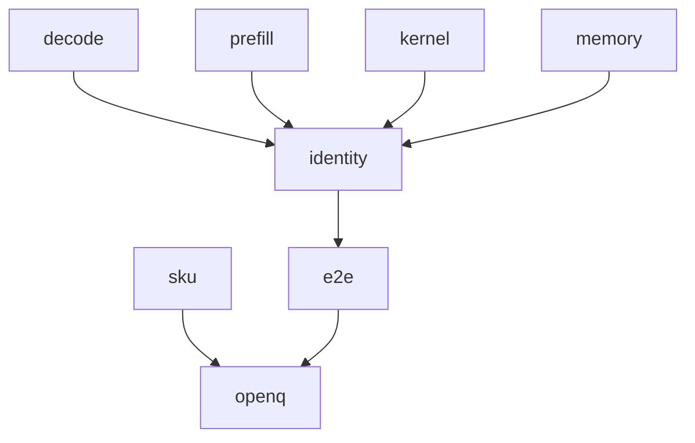

# Qwen3.8-27B performance methodology (TASK-19)

> **V0 implementation authority:** [EVAL-01 / PERF-01](evaluation-policy-v0.md)
> selects matching QW38/llama.cpp workloads, measurement boundaries and the
> performance parity target. Together with Architecture V0, it supersedes the
> historical unselected protocol and optional comparator below. The generated
> Phase 1 JSON remains historical methodology, not the current task contract.

Complete-map MTP behavior cited here is conditional on TASK-02's unverified analysis model.

> **Draft status:** conclusions in this document are **unverified** until the verification stage completes.

Phase 1 **performance evaluation methodology** for Qwen3.8-27B language+MTP.
Work and traffic identities come from
[`docs/architecture/work-and-traffic.md`](work-and-traffic.md) (TASK-06).
Decode one-token schedule and GEMV consumers come from
[`docs/architecture/decode-plan.md`](decode-plan.md) (TASK-13). Prefill
many-token schedule and GEMM consumers come from
[`docs/architecture/prefill-plan.md`](prefill-plan.md) (TASK-14). Eighteen
unselected mappings, six node types, and seven evaluation criteria come from
[`docs/architecture/cuda-design-space.md`](cuda-design-space.md) (TASK-17).
TASK-16 SKU symbols and $N_w=32$, $N_{\text{bank}}=32$ are cited through
TASK-17 / [`docs/architecture/cuda-hardware-model.md`](cuda-hardware-model.md).
TASK-18 tok/s-is-not-quality is cited from
[`docs/architecture/quantization-validation.md`](quantization-validation.md);
this document does not rewrite NLL methodology.

This document specifies an **evaluation methodology**, not measurements, and
not a selected mapping. Prefill and decode share **one** semantic graph
(TASK-11) and **one** compiled artifact (TASK-09 via TASK-17). They do **not**
share one performance metric identity (`decode_prefill_share_metric_identity`
false). The primary object is language+MTP **complete map** (135 node
instances). Language-only is a secondary row, not a substitute identity.

If a MAC or byte total would disagree with TASK-06 / sitting `text_config`, or
a stage kind / $T$ convention would disagree with TASK-13/14, or a node type
/ mapping id / evaluation criterion / SKU symbol would disagree with
TASK-17/16, the earlier document wins and this one is wrong.

Claims are labelled `OBSERVED` (sitting `text_config` / inventory already
established; TASK-16 $N_w=32$, $N_{\text{bank}}=32$), `DERIVED` (MAC/byte
citations, tok/s and latency **formulas**, identity/coverage contracts),
`HYPOTHESIS` (every methodology-risk severity), or `UNKNOWN` (sitting-SKU
numeric limits; vision-encoder internals). No new `MEASURED` tok/s, occupancy,
bandwidth, latency, or NLL. Protocol limits are **methodology contracts**, not
measured tables. A named metric is not a measured table.

## Authority

| Item | Value | Label |
| --- | --- | --- |
| Dossier | [`docs/architecture/tasks/TASK-19.md`](tasks/TASK-19.md) | — |
| Work and traffic | [`docs/architecture/work-and-traffic.md`](work-and-traffic.md) (TASK-06) | $W=C+AT$; $W=TC+AT(T+1)/2$; MAC/byte citations |
| Decode plan | [`docs/architecture/decode-plan.md`](decode-plan.md) (TASK-13) | one-token GEMV; populated $(K,V,C,S)$ |
| Prefill plan | [`docs/architecture/prefill-plan.md`](prefill-plan.md) (TASK-14) | many-token GEMM; incoming zeros |
| CUDA design space | [`docs/architecture/cuda-design-space.md`](cuda-design-space.md) (TASK-17) | 18 mappings unselected; six node types |
| CUDA hardware model | [`docs/architecture/cuda-hardware-model.md`](cuda-hardware-model.md) (TASK-16) via TASK-17 | SKU-UNKNOWN; $N_w=32$, $N_{\text{bank}}=32$ |
| Config | [`.cache/authorities/qwen3.8-27b-transformers/config.json`](../../.cache/authorities/qwen3.8-27b-transformers/config.json) `text_config` | OBSERVED |
| Checker | [`scripts/check_performance_validation.py`](../../scripts/check_performance_validation.py) | DERIVED |
| Evidence policy | [`docs/architecture/plan.md`](plan.md) (OBSERVED / DERIVED / HYPOTHESIS / UNKNOWN) | OBSERVED |
| In scope | Language+MTP decode/prefill/kernel/memory/end-to-end methodology + identity/coverage/SKU-fill protocol | — |
| Deferred | Vision encoder; sitting SKU numbers; hardware/prompts/repro; mapping winner | — |
| Scope of this document | Evaluation methodology — not measurements, not a selected mapping | — |

Numeric ranks instantiate sitting `text_config` OBSERVED: `hidden_size` 5120,
`intermediate_size` 17408, `vocab_size` 248320, 64 decoder layers, 48 linear +
16 full at indices `[3, 7, 11, 15, 19, 23, 27, 31, 35, 39, 43, 47, 51, 55, 59, 63]`,
`mtp_num_hidden_layers` 1, `dtype` `"bfloat16"`, `mamba_ssm_dtype` `"float32"`,
`max_position_embeddings` $T_{\text{ctx max}}=262144$. Language+MTP occupancy
is 27320697856 parameters / 54641395712 BF16 bytes (OBSERVED). Unique non-embed
weight bytes are 52098598912 (TASK-06). Complete map: 135 node instances
(2 `embed`, 17 `gated_attn`, 48 `gated_delta_net`, 65 `mlp`, 2 `lm_head`,
1 `mtp_mix`). MAC citations (DERIVED, TASK-06): $C_\text{complete}=27433238528$,
$A_\text{complete}=208896$; T=1 decode = T=1 prefill MAC $27433447424$;
T=4096 decode $28288876544$; T=4096 prefill $114119319486464$.

## Measurement convention

Logical values in this document are graph nodes. They do not imply physical allocation, materialization, buffer reuse, or kernel fusion.

Decode, prefill, kernel, memory, and end-to-end metrics in this document are a methodology, not measurements.

Microbenchmarks cannot pass a CUDA mapping; end-to-end measurement on a matching identity is required alongside them.

Exact hardware, prompt matrix, and reproducibility protocol for the implementation phase remain unselected.

This document fills no sitting SKU numbers and selects no mapping winner.

Decode, prefill, and kernel metrics are specified; end-to-end measurement is required alongside microbenchmarks; no implementation benchmarks are run in this study task; exact hardware, prompt matrix, and reproducibility protocol remain unselected.

JSON: `canonical_sentence_logical` = sentence 1; `canonical_sentence_methodology` = sentence 2; `canonical_sentence_e2e` = sentence 3; `canonical_sentence_open_question` = sentence 4; `canonical_sentence_winner` = sentence 5; `methodology_question_sentence` = the methodology sentence. Sentence 4 **keeps** the ledger open question unresolved (`ledger_open_question_hardware_closed` false). Sentence 5 **closes** the third completion criterion as a prohibition, not as a selected mapping, and keeps SKU unfilled. Sentence 5 does **not** close TASK-17’s mapping-winner question (`ledger_open_question_mapping_winner_closed` false).

- Five metric families are complete for this task: `decode`, `prefill`, `kernel`, `memory`, `end_to_end` (`n_metric_families` 5).
- Five metric classes are complete: `prefill`, `decode_only`, `complete_request`, `component`, `memory` (`n_metric_classes` 5). A ratio requires matching classes and windows on both arms (`ratio_requires_matching_identity` true).
- First-token convention is `ttft_in_prefill`: the first generated token belongs to the prefill / TTFT window, not to the decode-only numerator (`first_token_in_prefill` true; `decode_only_excludes_first_token` true).
- Decode-only tok/s is not prefill tok/s and not complete-request latency (`decode_is_not_prefill` true; `decode_is_not_complete_request` true).
- Microbenchmarks (kernel + memory component windows) cannot pass a mapping (`microbenchmark_cannot_pass_mapping` true). End-to-end measurement is required alongside them (`e2e_required_alongside_microbenchmarks` true).
- `example_T_values` `[1, 4096]` are illustration horizons for MAC/byte citations, not a prompt matrix (`example_T_is_not_prompt_matrix` true).
- Model context horizon is `max_position_embeddings` $T_{\text{ctx max}}=262144$. Do not confuse it with TASK-16 SKU `T_max` (max threads per SM). JSON `model_T_max` = 262144. JSON SKU id `T_max` remains a `sku_unknown_symbols` entry.
- Primary coverage includes MTP (135 instances). Language-only is secondary.
- Fan-out ≠ must-store still holds; naming a metric is not a CUDA timer and not a measured table.
- No MEASURED tok/s, occupancy, or bandwidth in this document (`toks_measured_here` false; `benchmarks_run` false; `experiments_run` false).
- Tok/s is not a quality axis (`toks_is_not_quality_axis` true). Public sample-eval output is a TASK-18 quality class (`public_sample_eval_output_is_quality` true).
- Hardware, prompt matrix, and reproducibility protocol remain unselected. SKU table remains unfilled. Mapping winner remains unselected.

JSON array `metric_family_ids` in this exact order (5 ids). JSON `n_metric_families` = 5.

| id | Role | Can fail a mapping | Can declare a mapping winner |
| --- | --- | --- | --- |
| `decode` | Decode-only rate and per-step latency | yes (identity-matched regression) | no, not alone |
| `prefill` | Prefill rate and window latency | yes | no, not alone |
| `kernel` | Component / leaf / envelope / occupancy | yes (local) | no (`microbenchmark_cannot_pass_mapping`) |
| `memory` | HBM / weight / state / activation / working-set | yes (local) | no |
| `end_to_end` | Complete-request latency (primary) plus declared output rate | yes | required alongside kernel/memory; still not a winner by itself in this document |

JSON: `microbenchmark_cannot_pass_mapping` true; `e2e_required_alongside_microbenchmarks` true; `kernel_cannot_pass_mapping` true.

JSON array `metric_class_ids` in this exact order (5 ids). JSON `n_metric_classes` = 5: `prefill`, `decode_only`, `complete_request`, `component`, `memory`.

## Decode metrics

JSON array `decode_metric_ids` in this exact order (4 ids). JSON `n_decode_metrics` = 4. Parallel `decode_metric_classes` all `decode_only`.

| ID | Class | Meaning |
| --- | --- | --- |
| `dec_toks` | decode_only | $(N_{\mathrm{gen}}-1)/t_{\mathrm{decode}}$ with $N_{\mathrm{gen}}\ge 2$; $t_{\mathrm{decode}}$ excludes setup, graph creation, warmup, prefill/TTFT, and checkpoint restore |
| `dec_step_ms` | decode_only | Mean GPU time per subsequent generated token in the decode-only window |
| `dec_p50_step_ms` | decode_only | Median per-step GPU time in that window |
| `dec_p99_step_ms` | decode_only | 99th-percentile per-step GPU time in that window |

Decode-only formula (DERIVED methodology; not measured here). After a length-$T$ prompt with incoming $(K,V,C,S)$ **populated** (TASK-13), $T_{\text{new}}=1$ per step:

$$
\mathrm{tok/s}_{\mathrm{dec}}=\frac{N_{\mathrm{gen}}-1}{t_{\mathrm{decode}}},\qquad N_{\mathrm{gen}}\ge 2.
$$

Cite TASK-06 decode work as the **bound identity**, not a timer:

$$
W_{\mathrm{decode}}=C+AT,
$$

with $C_\text{complete}=27433238528$, $A_\text{complete}=208896$ (DERIVED citation). JSON `mac_C_complete` = 27433238528. JSON `mac_A_complete` = 208896. JSON `decode_work_identity` = `"C+AT"`. JSON `decode_T_new` = 1. JSON `decode_incoming_state` = `"populated"`.

Setup, graph creation, warmup, and checkpoint restore stay outside the decode-only denominator (`ta_setup_outside_rate`). TTFT is not decode-only. Do not report a single-token “decode” as `dec_toks`.

## Prefill metrics

JSON array `prefill_metric_ids` in this exact order (4 ids). JSON `n_prefill_metrics` = 4. Parallel `prefill_metric_classes`: `prefill`, `prefill`, `prefill`, `prefill`.

| ID | Class | Meaning |
| --- | --- | --- |
| `pre_toks` | prefill | $T/t_{\mathrm{prefill}}$ for a length-$T$ prompt with incoming $(K,V,C,S)$ **zeros** (TASK-14) |
| `pre_ms` | prefill | Prefill-window wall (same exclusions as decode-only: setup, graph create, warmup, restore) |
| `pre_ttft_ms` | prefill | Time to first generated token; equals the prefill window under `ttft_in_prefill` |
| `pre_mac_cite` | prefill | TASK-06 $W=TC+AT(T+1)/2$ citation for the same $T$; not a timer |

Prefill formula (DERIVED methodology; not measured here):

$$
\mathrm{tok/s}_{\mathrm{pre}}=\frac{T}{t_{\mathrm{prefill}}}.
$$

Prefill work identity:

$$
W_{\mathrm{prefill}}=TC+\frac{AT(T+1)}{2}.
$$

JSON `prefill_work_identity` = `"TC+AT(T+1)/2"`. JSON `prefill_incoming_state` = `"zeros"`. JSON `t1_mac_equal_does_not_imply_equal_traffic` true. JSON `mac_decode_complete_T1` = 27433447424. JSON `mac_prefill_complete_T1` = 27433447424 (TASK-06; T=1 MAC equality). JSON `mac_decode_complete_T4096` = 28288876544. JSON `mac_prefill_complete_T4096` = 114119319486464.

At $T=1$, MAC prefill equals MAC decode; C/S physical reads still differ (zeros vs populated). Do not report T=1 `pre_toks` as `dec_toks`. Prefill numerator is prompt length $T$, not $T+1$ first-token padding. Algebraic equivalents in TASK-02 remain the same real map. Chunkwise GDN is not zero $S$ traffic.

## Kernel metrics

JSON array `kernel_metric_ids` in this exact order (5 ids). JSON `n_kernel_metrics` = 5. Parallel `kernel_metric_classes` all `component`.

| ID | Class | Meaning |
| --- | --- | --- |
| `k_node_ms` | component | GPU time attributed to one TASK-11 node type in a covered window |
| `k_mapping_ms` | component | GPU time for one TASK-17 mapping alternative under test; listing is not selecting |
| `k_leaf_union_ms` | component | Disjoint union of **leaf** kernel intervals in the window |
| `k_graph_envelope_ms` | component | CUDA-graph / parent envelope duration; **not** leaf kernel time |
| `k_occupancy_achieved` | component | Achieved occupancy; theoretical occupancy remains TASK-16 F8 and is not this metric |

JSON `graph_envelope_is_not_leaf` true. JSON `missing_coverage_is_not_zero` true. JSON `kernel_cannot_pass_mapping` true. JSON `achieved_occupancy_measured_here` false. JSON `n_node_types` = 6. JSON `node_type_ids` in TASK-11 order: `embed`, `gated_attn`, `gated_delta_net`, `mlp`, `lm_head`, `mtp_mix`. JSON `n_mappings` = 18. JSON `n_mappings_selected` = 0. JSON `mapping_winner_selected` false. JSON `n_stage_kinds` = 9. JSON `stage_kind_ids`: `embed_current`, `language_mixer`, `language_mlp`, `lm_head_primary`, `embed_next`, `mtp_mix`, `mtp_mixer`, `mtp_mlp`, `lm_head_mtp`.

JSON array `mapping_ids` equals the TASK-17 18-id list (citation completeness; do not retabulate ownership/reduction as a new design space): `map_embed_thread_element`, `map_embed_warp_row`, `map_embed_cta_vector`, `map_attn_cta_head`, `map_attn_warp_t`, `map_attn_cta_splitk`, `map_gdn_cta_head`, `map_gdn_warp_recurrent`, `map_gdn_cta_chunk`, `map_mlp_cta_dout`, `map_mlp_cta_splitk`, `map_mlp_grid_T`, `map_lm_cta_vocab`, `map_lm_cta_splitk`, `map_lm_warp_gemv`, `map_mtp_cta_fc`, `map_mtp_cta_fused`, `map_mtp_split_norm_gemm`.

Graph envelopes are not leaf kernel time. Missing node tracing forbids graph-internal idle and component-completeness claims. Unclassified work is not zero excess. A kernel microbenchmark may **fail** a mapping locally; it must not **pass** a mapping onto a winner without matching-identity end-to-end measurement. Do not rank TASK-17 mappings in this document.

Cite TASK-17 evaluation criterion ids as substrings (7): `crit_occupancy`, `crit_latency_hiding`, `crit_wave_quant`, `crit_intensity_roofline`, `crit_sync_class`, `crit_pipeline_mix`, `crit_fusion_delta`. JSON `n_evaluation_criteria` = 7. JSON `evaluation_measured` false.

## Memory metrics

JSON array `memory_metric_ids` in this exact order (5 ids). JSON `n_memory_metrics` = 5. Parallel `memory_metric_classes` all `memory`.

| ID | Class | Meaning |
| --- | --- | --- |
| `mem_hbm_gbps` | memory | Achieved device-global bandwidth in a covered window; compare later to SKU $\Beta$ only after SKU fill |
| `mem_weight_bytes` | memory | Unique weight bytes moved in the window; TASK-06 unique non-embed `52098598912` is the lower-bound **identity**, not measured traffic |
| `mem_state_bytes` | memory | $K,V,C,S$ traffic versus TASK-04/06 decode-read / triangular-prefill identities |
| `mem_act_bytes` | memory | Activation traffic versus TASK-06 forced / region-cut / GEMM-IO views |
| `mem_working_set` | memory | Allocated high-water with an explicit identity; not a proven live-set without coverage |

JSON `weight_bytes_unique_non_embed` = 52098598912. JSON `weight_bytes_language_mtp_excl_vision` = 54641395712. JSON `lower_bound_is_not_measured_bandwidth` true. JSON `peak_memory_is_not_live_set` true. JSON `n_traffic_channels` = 3. JSON `traffic_channel_ids` = `["weight","state","activation"]`.

TASK-06 bytes are DERIVED minima on the three traffic channels `weight`, `state`, and `activation`. Bottleneck **labels** that name those channels remain TASK-06 HYPOTHESIS citations; this document does not retabulate the six bottleneck classes as new measurements. Unique weight bytes are counted **once** per complete decode/prefill as a TASK-06 lower-bound **identity**, not as measured HBM traffic. Bytes divided by assumed $\Beta$ is a conditional estimate, not measured `mem_hbm_gbps`. Do not fill $\Beta$ (`Beta_HBM`) here. A working-set high-water is a named metric identity, not a number in this document.

## End-to-end metrics

JSON array `e2e_metric_ids` in this exact order (3 ids). JSON `n_e2e_metrics` = 3.

| ID | Class | Primary? | Meaning |
| --- | --- | --- | --- |
| `e2e_latency_ms` | complete_request | **primary** | Wall from first in-window prompt ingest to last generated token; setup/graph-create/warmup/restore excluded |
| `e2e_output_toks` | complete_request | secondary | $N_{\mathrm{gen}}/t_{\mathrm{e2e}}$; **not** decode-only; **not** $(T+N_{\mathrm{gen}})/t_{\mathrm{e2e}}$ unless that mixed identity is declared separately and never compared to `dec_toks` |
| `e2e_ttft_ms` | complete_request | diagnostic | Same window as `pre_ttft_ms` under `ttft_in_prefill`; still complete-request family when reported beside `e2e_latency_ms` |

JSON `e2e_primary_id` = `"e2e_latency_ms"`. JSON `e2e_mixed_toks_is_not_decode_only` true. JSON `e2e_required_alongside_microbenchmarks` true. JSON `complete_request_vs_decode_only_forbidden` true.

Refuse a complete-request versus decode-only comparison. Mixed $(T+N_{\mathrm{gen}})/t_{\mathrm{e2e}}$ is not `dec_toks` and is not `pre_toks`. End-to-end measurement is **required alongside** kernel and memory microbenchmarks; it is not optional colour. This document still selects no mapping winner (`mapping_winner_selected` false).

## Identity, coverage, and time accounting

JSON array `identity_field_ids` in this exact order (15 ids). JSON `n_identity_fields` = 15.

| ID | Must record |
| --- | --- |
| `engine_commit` | Engine / study commit |
| `loaded_binary_hash` | Actual loaded binary hash |
| `build_flags` | Build flags / image / tool versions |
| `artifact_selectors` | Compiled artifact or future black-box selectors (GGUF not opened here) |
| `input_token_hash` | Input token hash |
| `prefix` | Prefix identity |
| `output_eval_counts` | Output / eval counts |
| `first_token_convention` | Must equal `ttft_in_prefill` unless a later task records a different declared convention |
| `allocated_capacity` | Allocated KV/state capacity |
| `populated_length` | Populated length $T$ |
| `sampling_output_policy` | Sampling / output policy (unselected here) |
| `graph_mode` | Graph / eager mode |
| `clocks_residents` | Clock and residency policy |
| `warmups_samples` | Warmup count and sample count |
| `numerator_start_end_events` | Exact numerator and start/end events |

JSON `identity_protocol_defined` true. JSON `identity_values_selected` false. JSON `sampling_policy_selected` false. JSON `warmup_count_selected` false. JSON `clock_policy_selected` false.

JSON array `coverage_field_ids` in this exact order (9 ids). JSON `n_coverage_fields` = 9: `captured_tables`, `units`, `clock_domain`, `capture_bounds`, `streams`, `expected_graph_node_counts`, `observed_graph_node_counts`, `family_mapping`, `unclassified_work`.

JSON `coverage_protocol_defined` true. JSON `coverage_values_selected` false. JSON `graph_envelope_is_not_leaf` true. JSON `missing_coverage_is_not_zero` true.

JSON array `time_accounting_rule_ids` in this exact order (5 ids). JSON `n_time_accounting_rules` = 5.

| ID | Contract |
| --- | --- |
| `ta_disjoint_union` | Union overlapping intervals before summing; reconstruct a disjoint union if a leaf sum exceeds its envelope |
| `ta_no_parent_child` | Do not sum graph parents and children, or nested NVTX and kernels, into one total |
| `ta_no_cpu_gpu_double` | Do not add overlapping CPU waits and GPU work |
| `ta_sync_is_wait` | CPU `cudaEventSynchronize` duration is wait duration, not removable GPU idle |
| `ta_setup_outside_rate` | Setup, graph creation, warmup, and checkpoint restore stay outside rate denominators |

JSON `time_accounting_protocol_defined` true.

A ratio requires matching metric identities. Unmapped families stay `null`/`unknown`. Missing hardware later is `incomplete`/`blocked`, not a measured rejection. Historical numbers are references, not current denominators. After freeze, Quartz and llama.cpp may be future black-box **performance** references with matching identities; they are not design authorities here (`quartz_inspected` false, `llama_inspected` false, `gguf_payload_inspected` false, `gguf_is_not_design_authority` true, `llama_is_not_design_authority` true). Safetensors is the source checkpoint, not the runtime artifact (`safetensors_is_source_not_runtime` true).

## SKU-fill protocol and unselected hardware

JSON array `sku_unknown_symbols` equals the TASK-16 17-id list. JSON `n_sku_unknown_symbols` = 17.

| Symbol | Role | Fill source (future) | Status here |
| --- | --- | --- | --- |
| `N_SM` | SM count | declared sitting device | UNKNOWN |
| `W_max` | max warps / SM | declared sitting device | UNKNOWN |
| `S_reg` | register file | declared sitting device | UNKNOWN |
| `C_smem` | shared memory | declared sitting device | UNKNOWN |
| `T_max` | max threads / SM (not model $T_{\text{ctx max}}$) | declared sitting device | UNKNOWN |
| `B_max` | max CTAs / SM | declared sitting device | UNKNOWN |
| `N_bar` | barrier capacity | declared sitting device | UNKNOWN |
| `N_sched` | scheduler capacity | declared sitting device | UNKNOWN |
| `G_reg` | register granularity | declared sitting device | UNKNOWN |
| `G_smem` | smem granularity | declared sitting device | UNKNOWN |
| `Beta_HBM` | peak HBM $\Beta$ | identity-matched microbenchmark | UNKNOWN |
| `Pi_FMA` | FMA peak | identity-matched microbenchmark | UNKNOWN |
| `Pi_TC` | tensor-core peak | identity-matched microbenchmark | UNKNOWN |
| `L_issue` | issue latency | identity-matched microbenchmark | UNKNOWN |
| `async_copy_cap` | async copy | declared sitting device | UNKNOWN |
| `mma_shapes` | MMA shapes | declared sitting device | UNKNOWN |
| `cluster_cap` | cluster | declared sitting device | UNKNOWN |

JSON `N_w` = 32. JSON `N_bank` = 32. JSON `sku_table_filled` false. JSON `sku_fill_protocol_defined` true. JSON `sku_from_datasheet_is_not_measurement` true. JSON `hardware_selected` false. JSON `prompt_matrix_selected` false. JSON `reproducibility_protocol_selected` false. JSON `ledger_open_question_hardware_closed` false.

SKU-fill protocol (future; not executed here):

- Capacity symbols (`N_SM`, `W_max`, `S_reg`, `C_smem`, `T_max` threads-per-SM, `B_max`, `N_bar`, `N_sched`, `G_reg`, `G_smem`, `cluster_cap`, `async_copy_cap`, `mma_shapes`) are filled from a **declared sitting device** with recorded identity, not from an unnamed datasheet.
- Peak symbols (`Beta_HBM`, `Pi_FMA`, `Pi_TC`, `L_issue`) are filled from identity-matched microbenchmarks on that same sitting, not from a marketing peak.
- Filling the table is a later measured increment. This document only names the protocol.

`example_T_values` `[1, 4096]` remain illustration horizons. Do not name WikiText, ShareGPT, or any other corpus as **the** prompt matrix. Do not name a GPU SKU as **the** hardware. Do not lock warmup counts or clock locks. JSON `example_T_values` = `[1, 4096]`. JSON `example_T_is_not_prompt_matrix` true.

TASK-19 owns the **methodology** for measurements and for filling the sitting SKU table; it does not own a filled table in this increment. TASK-17 still owns mapping **selection** after future measurements (`ledger_open_question_mapping_winner_closed` false). TASK-15 still owns layout selection. TASK-12/13/14 still own fusion winners. TASK-14 still owns decode/prefill view selection. TASK-09 still owns artifact-boundary and ideal-sequence selection. TASK-08 still owns recipe winners. TASK-18 still owns quality/NLL. TASK-16 published identities $N_w=32$, $N_{\text{bank}}=32$ remain the only numeric SKU constants. State writes are not optional. Chunkwise GDN is not zero $S$ traffic. Activations remain out of layout scope here (`activations_in_layout_scope` false). `device_query_run` false; `nsight_run` false.

Diagram 1 of 1: decode, prefill, kernel, and memory families feed the identity protocol, then end-to-end; SKU-fill and e2e both leave OPENQ — the unselected hardware / prompt matrix / reproducibility protocol, not a selected winner. JSON `n_diagrams` is 1. `diagram_ids` is `["decode","prefill","kernel","memory","identity","e2e","sku","openq"]`.



## Methodology risks

JSON array `methodology_risk_ids` in this exact order (8 ids). JSON `n_methodology_risks` = 8. Parallel `methodology_risk_severities` (`high`/`medium`/`low`). All usefulness claims beyond the locked contracts are `HYPOTHESIS`. JSON `methodology_risk_usefulness_label` exactly `HYPOTHESIS`.

| ID | Deferred or pair | Severity | Why it can mislead |
| --- | --- | --- | --- |
| `v_mixed_identity` | class mismatch | high | Comparing decode-only tok/s to complete-request latency (or mixed $(T+N)/t$) |
| `v_envelope_as_leaf` | `k_graph_envelope_ms` | high | Ranking sinks from graph envelopes without leaf / node tracing |
| `v_micro_as_winner` | kernel/memory only | high | Declaring a TASK-17 mapping winner from microbenchmarks without e2e |
| `v_missing_coverage_zero` | coverage | high | Treating unclassified work as zero excess |
| `v_bound_as_measured` | TASK-06 | medium | Treating MAC/byte lower bounds as measured traffic or tok/s |
| `v_datasheet_sku` | SKU table | medium | Filling `sku_unknown_symbols` from a datasheet without sitting identity |
| `v_t1_prefill_as_decode` | $T=1$ | medium | Equating T=1 prefill with decode because MAC matches |
| `v_toks_as_quality` | TASK-18 | low | Using tok/s as Pareto $Y$ |

JSON `n_methodology_high` = 4. JSON `n_methodology_medium` = 3. JSON `n_methodology_low` = 1. JSON `methodology_risk_severities` = `["high","high","high","high","medium","medium","medium","low"]`.

These risks do not claim experimental proof. They do not select hardware or a mapping. `v_toks_as_quality` restates TASK-18; it does not add a quality metric here. `nll_measured_here` false.

## Deferred vision

Vision-encoder internals remain `UNKNOWN` and out of the primary map. Residual-stream interface only (`out_hidden_size` 5120 OBSERVED). No vision tok/s, encoder kernel metrics, or encoder working-set. JSON `vision_eval_deferred` true.

## Machine-checkable summary JSON

Live object from sitting `text_config` plus locked constants. First fenced `json` block must equal a fresh checker `--json` run.

```json
{
  "authority": "docs/architecture/plan.md",
  "deliverable": "docs/architecture/performance-validation.md",
  "hidden_size": 5120,
  "intermediate_size": 17408,
  "vocab_size": 248320,
  "n_decoder_layers": 64,
  "n_linear_layers": 48,
  "n_full_layers": 16,
  "n_mtp_blocks": 1,
  "full_attention_indices": [
    3,
    7,
    11,
    15,
    19,
    23,
    27,
    31,
    35,
    39,
    43,
    47,
    51,
    55,
    59,
    63
  ],
  "model_T_max": 262144,
  "dtype": "bfloat16",
  "mamba_ssm_dtype": "float32",
  "n_language_mtp_parameters": 27320697856,
  "weight_bytes_language_mtp_excl_vision": 54641395712,
  "weight_bytes_unique_non_embed": 52098598912,
  "mac_C_complete": 27433238528,
  "mac_A_complete": 208896,
  "mac_decode_complete_T1": 27433447424,
  "mac_prefill_complete_T1": 27433447424,
  "mac_decode_complete_T4096": 28288876544,
  "mac_prefill_complete_T4096": 114119319486464,
  "example_T_values": [
    1,
    4096
  ],
  "example_T_is_not_prompt_matrix": true,
  "N_w": 32,
  "N_bank": 32,
  "n_node_types": 6,
  "node_type_ids": [
    "embed",
    "gated_attn",
    "gated_delta_net",
    "mlp",
    "lm_head",
    "mtp_mix"
  ],
  "n_embed_instances": 2,
  "n_gated_attn_instances": 17,
  "n_gated_delta_net_instances": 48,
  "n_mlp_instances": 65,
  "n_lm_head_instances": 2,
  "n_mtp_mix_instances": 1,
  "n_node_instances_complete": 135,
  "n_stage_kinds": 9,
  "stage_kind_ids": [
    "embed_current",
    "language_mixer",
    "language_mlp",
    "lm_head_primary",
    "embed_next",
    "mtp_mix",
    "mtp_mixer",
    "mtp_mlp",
    "lm_head_mtp"
  ],
  "n_mappings": 18,
  "mapping_ids": [
    "map_embed_thread_element",
    "map_embed_warp_row",
    "map_embed_cta_vector",
    "map_attn_cta_head",
    "map_attn_warp_t",
    "map_attn_cta_splitk",
    "map_gdn_cta_head",
    "map_gdn_warp_recurrent",
    "map_gdn_cta_chunk",
    "map_mlp_cta_dout",
    "map_mlp_cta_splitk",
    "map_mlp_grid_T",
    "map_lm_cta_vocab",
    "map_lm_cta_splitk",
    "map_lm_warp_gemv",
    "map_mtp_cta_fc",
    "map_mtp_cta_fused",
    "map_mtp_split_norm_gemm"
  ],
  "n_mappings_selected": 0,
  "n_evaluation_criteria": 7,
  "evaluation_criterion_ids": [
    "crit_occupancy",
    "crit_latency_hiding",
    "crit_wave_quant",
    "crit_intensity_roofline",
    "crit_sync_class",
    "crit_pipeline_mix",
    "crit_fusion_delta"
  ],
  "evaluation_measured": false,
  "n_metric_families": 5,
  "metric_family_ids": [
    "decode",
    "prefill",
    "kernel",
    "memory",
    "end_to_end"
  ],
  "n_metric_classes": 5,
  "metric_class_ids": [
    "prefill",
    "decode_only",
    "complete_request",
    "component",
    "memory"
  ],
  "n_decode_metrics": 4,
  "decode_metric_ids": [
    "dec_toks",
    "dec_step_ms",
    "dec_p50_step_ms",
    "dec_p99_step_ms"
  ],
  "decode_metric_classes": [
    "decode_only",
    "decode_only",
    "decode_only",
    "decode_only"
  ],
  "n_prefill_metrics": 4,
  "prefill_metric_ids": [
    "pre_toks",
    "pre_ms",
    "pre_ttft_ms",
    "pre_mac_cite"
  ],
  "n_kernel_metrics": 5,
  "kernel_metric_ids": [
    "k_node_ms",
    "k_mapping_ms",
    "k_leaf_union_ms",
    "k_graph_envelope_ms",
    "k_occupancy_achieved"
  ],
  "n_memory_metrics": 5,
  "memory_metric_ids": [
    "mem_hbm_gbps",
    "mem_weight_bytes",
    "mem_state_bytes",
    "mem_act_bytes",
    "mem_working_set"
  ],
  "n_e2e_metrics": 3,
  "e2e_metric_ids": [
    "e2e_latency_ms",
    "e2e_output_toks",
    "e2e_ttft_ms"
  ],
  "e2e_primary_id": "e2e_latency_ms",
  "n_identity_fields": 15,
  "identity_field_ids": [
    "engine_commit",
    "loaded_binary_hash",
    "build_flags",
    "artifact_selectors",
    "input_token_hash",
    "prefix",
    "output_eval_counts",
    "first_token_convention",
    "allocated_capacity",
    "populated_length",
    "sampling_output_policy",
    "graph_mode",
    "clocks_residents",
    "warmups_samples",
    "numerator_start_end_events"
  ],
  "n_coverage_fields": 9,
  "coverage_field_ids": [
    "captured_tables",
    "units",
    "clock_domain",
    "capture_bounds",
    "streams",
    "expected_graph_node_counts",
    "observed_graph_node_counts",
    "family_mapping",
    "unclassified_work"
  ],
  "n_time_accounting_rules": 5,
  "time_accounting_rule_ids": [
    "ta_disjoint_union",
    "ta_no_parent_child",
    "ta_no_cpu_gpu_double",
    "ta_sync_is_wait",
    "ta_setup_outside_rate"
  ],
  "n_sku_unknown_symbols": 17,
  "sku_unknown_symbols": [
    "N_SM",
    "W_max",
    "S_reg",
    "C_smem",
    "T_max",
    "B_max",
    "N_bar",
    "N_sched",
    "G_reg",
    "G_smem",
    "Beta_HBM",
    "Pi_FMA",
    "Pi_TC",
    "L_issue",
    "async_copy_cap",
    "mma_shapes",
    "cluster_cap"
  ],
  "n_traffic_channels": 3,
  "traffic_channel_ids": [
    "weight",
    "state",
    "activation"
  ],
  "n_methodology_risks": 8,
  "methodology_risk_ids": [
    "v_mixed_identity",
    "v_envelope_as_leaf",
    "v_micro_as_winner",
    "v_missing_coverage_zero",
    "v_bound_as_measured",
    "v_datasheet_sku",
    "v_t1_prefill_as_decode",
    "v_toks_as_quality"
  ],
  "methodology_risk_severities": [
    "high",
    "high",
    "high",
    "high",
    "medium",
    "medium",
    "medium",
    "low"
  ],
  "methodology_risk_usefulness_label": "HYPOTHESIS",
  "n_methodology_high": 4,
  "n_methodology_medium": 3,
  "n_methodology_low": 1,
  "n_diagrams": 1,
  "diagram_ids": [
    "decode",
    "prefill",
    "kernel",
    "memory",
    "identity",
    "e2e",
    "sku",
    "openq"
  ],
  "n_headings": 12,
  "headings": [
    "Authority",
    "Measurement convention",
    "Decode metrics",
    "Prefill metrics",
    "Kernel metrics",
    "Memory metrics",
    "End-to-end metrics",
    "Identity, coverage, and time accounting",
    "SKU-fill protocol and unselected hardware",
    "Methodology risks",
    "Deferred vision",
    "Machine-checkable summary JSON"
  ],
  "decode_work_identity": "C+AT",
  "prefill_work_identity": "TC+AT(T+1)/2",
  "decode_T_new": 1,
  "decode_incoming_state": "populated",
  "prefill_incoming_state": "zeros",
  "first_token_in_prefill": true,
  "decode_only_excludes_first_token": true,
  "first_token_convention_id": "ttft_in_prefill",
  "ratio_requires_matching_identity": true,
  "decode_is_not_prefill": true,
  "decode_is_not_complete_request": true,
  "t1_mac_equal_does_not_imply_equal_traffic": true,
  "graph_envelope_is_not_leaf": true,
  "missing_coverage_is_not_zero": true,
  "kernel_cannot_pass_mapping": true,
  "microbenchmark_cannot_pass_mapping": true,
  "e2e_required_alongside_microbenchmarks": true,
  "e2e_mixed_toks_is_not_decode_only": true,
  "complete_request_vs_decode_only_forbidden": true,
  "lower_bound_is_not_measured_bandwidth": true,
  "peak_memory_is_not_live_set": true,
  "public_sample_eval_output_is_quality": true,
  "toks_is_not_quality_axis": true,
  "identity_protocol_defined": true,
  "identity_values_selected": false,
  "coverage_protocol_defined": true,
  "coverage_values_selected": false,
  "time_accounting_protocol_defined": true,
  "sampling_policy_selected": false,
  "warmup_count_selected": false,
  "clock_policy_selected": false,
  "sku_table_filled": false,
  "sku_fill_protocol_defined": true,
  "sku_from_datasheet_is_not_measurement": true,
  "hardware_selected": false,
  "prompt_matrix_selected": false,
  "reproducibility_protocol_selected": false,
  "ledger_open_question_hardware_closed": false,
  "mapping_winner_selected": false,
  "winner_selected_without_measurements": false,
  "ledger_open_question_mapping_winner_closed": false,
  "n_mappings_per_node": 3,
  "decode_prefill_share_graph": true,
  "decode_prefill_share_artifact": true,
  "decode_prefill_share_metric_identity": false,
  "activations_in_layout_scope": false,
  "benchmarks_run": false,
  "toks_measured_here": false,
  "experiments_run": false,
  "methodology_defined": true,
  "nll_measured_here": false,
  "payloads_restreamed": false,
  "gguf_payload_inspected": false,
  "gguf_is_not_design_authority": true,
  "quartz_inspected": false,
  "llama_inspected": false,
  "llama_is_not_design_authority": true,
  "device_query_run": false,
  "nsight_run": false,
  "achieved_occupancy_measured_here": false,
  "vision_eval_deferred": true,
  "safetensors_is_source_not_runtime": true,
  "canonical_sentence_logical": "Logical values in this document are graph nodes. They do not imply physical allocation, materialization, buffer reuse, or kernel fusion.",
  "canonical_sentence_methodology": "Decode, prefill, kernel, memory, and end-to-end metrics in this document are a methodology, not measurements.",
  "canonical_sentence_e2e": "Microbenchmarks cannot pass a CUDA mapping; end-to-end measurement on a matching identity is required alongside them.",
  "canonical_sentence_open_question": "Exact hardware, prompt matrix, and reproducibility protocol for the implementation phase remain unselected.",
  "canonical_sentence_winner": "This document fills no sitting SKU numbers and selects no mapping winner.",
  "methodology_question_sentence": "Decode, prefill, and kernel metrics are specified; end-to-end measurement is required alongside microbenchmarks; no implementation benchmarks are run in this study task; exact hardware, prompt matrix, and reproducibility protocol remain unselected."
}
```
