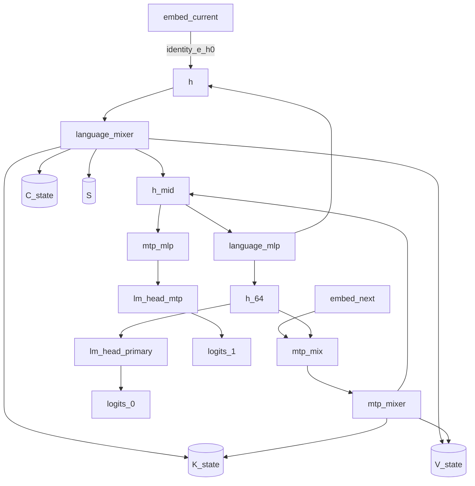

# Qwen3.8-27B prefill execution plan (TASK-14)

> **Draft status:** conclusions in this document are **unverified** until the verification stage completes.

Phase 1 **hardware-independent** prefill semantic schedule for many-token
inference on the Qwen3.8-27B language+MTP map, independent of decode. Select
one serial order of the existing TASK-11 node instances (135 complete) as
layer-serial over a length-\(T\) prompt. Per compact stage kind: name weight
loads, state reads/writes, visibility boundaries, and reuse. Explain the five
fundamental differences versus decode (matrix-matrix, reuse, tiling, state,
temporary storage). Compare every TASK-11 semantic node type (6) and every
stage kind (9) with decode. Separate TASK-06 unavoidable unique-weight /
triangular-KV / T-scaled activation minima from this schedule’s
proposed-boundary stage-cut channel. Attach TASK-09 consumer sequences and
TASK-12 fusion hypotheses as unselected experiment attachments. Keep the
ledger open question (decode/prefill representation tradeoffs and potential
need for multiple views) unresolved: enumerate view hypotheses, select none,
leave `decode_prefill_distinct_views_selected` false.

This document specifies a **hardware-independent semantic schedule**, not
kernels. Prefill and decode share one semantic graph. This document
independently schedules prefill: prompt length \(T\), \(T_\text{new}=T\),
stored KV length \(T\) after the prompt, incoming \((K,V,C,S)\) zeros.
Primary instance counts include MTP at all \(T\) positions. If a node I/O,
state kind, catalog ID, layer count, or cited MAC/byte would disagree with
TASK-06/09/11/12 or sitting `text_config`, the earlier document / config wins
and this one is wrong. If a comparison cell would disagree with TASK-13
decode-plan stage kinds or TASK-06 decode identities, the earlier document
wins and the comparison cell is wrong.

Claims are labelled OBSERVED (sitting `text_config` / inventory already
established), DERIVED (serial order from the DAG, stage multiplicities,
T-scaled stage-cut byte identities, cited TASK-06/04 integers, MAC identity
at \(T=1\)), or HYPOTHESIS (hoist/overlap/mode/view usefulness, second
\(W_\text{lm}\) read, extra `h_64` consumer read, every packing/fusion
usefulness, every “prefill needs a distinct view”). No MEASURED tok/s or NLL.
No fusion, packing winner, tile, view split, or kernel is chosen here.

## Authority

| Item | Value | Label |
| --- | --- | --- |
| Dossier | [`docs/architecture/tasks/TASK-14.md`](tasks/TASK-14.md) | — |
| Work/traffic | [`docs/architecture/work-and-traffic.md`](work-and-traffic.md) (TASK-06) | citation of MAC/byte identities |
| Runtime format | [`docs/architecture/runtime-format-design.md`](runtime-format-design.md) (TASK-09) | seven sequences, unselected |
| Semantic graph | [`docs/architecture/semantic-graph.md`](semantic-graph.md) (TASK-11) | OBSERVED / DERIVED |
| Materialization/fusion | [`docs/architecture/materialization-and-fusion.md`](materialization-and-fusion.md) (TASK-12) | 22 hypotheses, unselected |
| Decode plan | [`docs/architecture/decode-plan.md`](decode-plan.md) (TASK-13) | comparison only, not a dependency |
| Inventory | [`docs/architecture/model-inventory.md`](model-inventory.md) (TASK-01) via TASK-06/11 | OBSERVED |
| Config | [`.cache/authorities/qwen3.8-27b-transformers/config.json`](../../.cache/authorities/qwen3.8-27b-transformers/config.json) `text_config` | OBSERVED |
| Checker | [`scripts/check_prefill_plan.py`](../../scripts/check_prefill_plan.py) | DERIVED |
| Evidence policy | [`docs/architecture/plan.md`](plan.md) (OBSERVED / DERIVED / HYPOTHESIS) | OBSERVED |
| In scope | Language + MTP many-token layer-serial schedule, five differences, 6/6 node comparison, traffic split, packing/fusion/view attachments left unselected | — |
| Deferred | Vision encoder; TASK-15 layouts; TASK-17 CUDA | — |
| Scope of this document | Hardware-independent semantic schedule — not kernels | — |

Numeric ranks instantiate sitting `text_config` OBSERVED: `hidden_size` 5120,
`intermediate_size` 17408, `vocab_size` 248320, 64 decoder layers, 48 linear +
16 full at \(\ell \bmod 4 = 3\), `mtp_num_hidden_layers` 1, `head_dim` 256,
`num_attention_heads` 24, `num_key_value_heads` 4, linear widths
\(d_\text{qkv}=10240\), `linear_key_head_dim` / `linear_value_head_dim` 128,
`dtype` `"bfloat16"`, `mamba_ssm_dtype` `"float32"`. Stage kinds, serial
layer-serial order, and T-scaled stage-cut bytes are DERIVED.
Hoist/packing/fusion/mode/view usefulness remains HYPOTHESIS.

Quartz and llama.cpp inspection are deferred until freeze. GGUF does not
constrain this schedule.

## Prefill schedule convention

Logical values in this document are graph nodes. They do not imply physical allocation, materialization, buffer reuse, or kernel fusion.

The prefill schedule in this document is a hardware-independent order of TASK-11 nodes for many-token inference from zero state, not a CUDA graph, kernel launch sequence, or selected fusion.

Unavoidable traffic is the TASK-06 unique-weight, triangular-KV/state, and T-scaled activation minimum; proposed-boundary traffic is this schedule's named stage-cut channel.

Decode/prefill representation tradeoffs and the potential need for multiple views remain unresolved without evidence; view_binding stays a capability, not a selected split.

JSON: `canonical_sentence_logical` = sentence 1; `canonical_sentence_schedule`
= sentence 2; `canonical_sentence_traffic` = sentence 3;
`canonical_sentence_open_question` = sentence 4. Sentence 4 keeps the ledger
open question open in checker-substring form. JSON
`ledger_open_question_representation_tradeoffs_closed` false. JSON
`decode_prefill_distinct_views_selected` false.

- Nine stage kinds are complete for this task; their multiplicities sum to 135
  complete node instances (`n_stage_kinds` 9, `n_stage_instances` 135).
- A stage is a named execution of one TASK-11 node type (or mixer xor) over
  the length-\(T\) sequence, with loads, state R/W, visibility I/O, and reuse.
- This document selects one **serial** **layer-serial** order
  (`schedule_serial_selected` true, `schedule_layer_serial_selected` true).
  Token-serial decode replay remains a mode HYPOTHESIS
  (`n_mode_hypotheses_selected` 0). Hoist and overlap remain HYPOTHESIS
  (`n_hoist_hypotheses_selected` 0).
- Decode is not scheduled here (`decode_schedule_deferred` true). Prefill
  \(T_\text{new}=T\); incoming state is zeros (`incoming_state_zeros` true,
  `incoming_state_populated` false).
- Residual add stays inside mixer/`mlp`; `g`/`z` stay internal; RMS stays
  inside the consumer (TASK-11 locks).
- Unique weights are counted once per complete prefill
  (`weight_unique_counted_once` true).
- Fan-out ≠ must-store and node I/O ≠ must-store still hold.
- Primary schedule includes MTP at all \(T\) positions. Hardware mapping is
  TASK-17. Fusion winners remain TASK-12 hypotheses. Ideal byte sequence
  remains TASK-09 open. Distinct decode/prefill views remain unselected.
- No thread geometry (`thread_geometry_absent` true).
- Every TASK-11 node type is compared with decode
  (`every_semantic_node_compared` true). Representation tradeoffs stay
  unresolved (`representation_tradeoffs_unresolved` true).

## Many-token setting

Let \(T\) be both the **prompt length** and the stored KV length **after**
prefill (TASK-04/06). Prefill of length \(T\) is the same map at
\(t=1,\ldots,T\) from **zero** state. Causal full attention at step \(t\)
contracts against length \(t\). Prefill causal attention uses exact
\(T(T+1)/2\), not \(T^2/2\). Incoming KV length is 0; after prefill, stored
KV length is \(T\).

JSON: `T_is_stored_length_after_prefill` true; `prefill_T_new_equals_T` true;
`example_T` `[1, 4096]`; `incoming_state_zeros` true;
`incoming_state_populated` false; `primary_includes_mtp` true;
`mtp_omission_is_algebraic_equivalent` true (not the primary schedule);
`mtp_runs_all_T_positions` true.

JSON `n_token_presentation_streams` = 2. Current `token_id` sequence of
length \(T\) feeds `embed_current`; next `token_id` sequence of length \(T\)
(teacher-forced ids \(2,\ldots,T+1\)) feeds `embed_next`. Both are graph
inputs to the complete map. Do not add a catalog ID. Sampling over \(V\) is
out of scope.

MAC identity (TASK-06, DERIVED): at \(T=1\),
\(W_\text{prefill}=C+A=W_\text{decode}\). JSON
`mac_prefill_equals_decode_at_T1` true. This is **not** a state-read
identity: prefill \(T=1\) physical \(C,S\) read is 0 (zeros); a continuing
decode at stored length \(T=1\) still reads populated \(C,S\)
(`decode_read_fixed_bytes` 153944064). JSON
`state_read_prefill_equals_decode_at_T1` false. Incoming KV is empty at
\(T=1\) for both (`kv_incoming_empty_at_T1_both` true).

JSON `n_node_instances_complete` = 135; `n_node_instances_language` = 130
(citations of TASK-11). Mixer xor: language layer \(\ell\) uses `gated_attn`
iff \(\ell\in\mathcal{L}_\text{full}\) (`full_attention_indices`
\(\{3,7,\ldots,63\}\)), else `gated_delta_net`. Then `mlp`. Do not unroll 64
layers or \(T\) positions beyond this rule. JSON `mixer_xor_by_layer_types`
true.

Prefill and decode share **one** semantic graph (`decode_prefill_share_graph`
true) and **one** compiled artifact (`decode_prefill_share_artifact` true);
**schedules** are independent. Residual add lives inside mixer and `mlp`
(`residual_add_inside_mixer`, `residual_add_inside_mlp` true). Inputs `h` /
`h_mid` remain mathematically available until that add
(`residual_input_live_until_add` true). Residual-stream RMSNorm lives inside
the consuming node (`rms_inside_consumer` true). Live-across `g` and `z` are
internal (`live_across_are_internal` true). GDN primary stays recurrent
`(17)`–`(18)` (`gdn_primary_is_recurrent_eq_17` true); chunkwise GDN is not
zero \(S\) traffic (`chunkwise_not_zero_s_traffic` true). State writes are
not optional (`state_write_not_optional` true). `h_64` cannot be hidden from
one of its two primary consumers (`fanout_h64_cannot_hide_from_one_consumer`
true). Unique weights are counted once; a second physical \(W_\text{lm}\)
read is HYPOTHESIS extra, not unique
(`weight_second_w_lm_read_is_hypothesis` true). Hardware mapping is TASK-17
(`cuda_mapping_deferred` true, `hardware_independent` true,
`thread_geometry_absent` true). Layout, tile size, fusion winner, ideal byte
sequence, and artifact boundary remain unselected (`layout_selected`,
`tile_size_selected`, `fusion_winner_selected`,
`ideal_byte_sequence_selected`, `artifact_boundary_selected` false).
Activation dtype is not decided (`activation_dtype_decided` false). The
vision interface is not a node (`vision_interface_is_not_a_node` true).

## Fundamental differences versus decode

JSON array `fundamental_difference_ids` in this exact order (5 ids). JSON
`n_fundamental_differences` = 5. Completes the ledger’s first checkbox. Do
not rank these by wall time. Usefulness of acting on them (distinct views,
chunkwise GDN, last-logits, CUDA tiles) remains HYPOTHESIS. JSON
`fundamental_difference_usefulness_label` exactly `HYPOTHESIS`.

| id | Decode (\(T_\text{new}=1\), populated) | Prefill (length \(T\), zeros) |
| --- | --- | --- |
| `diff_matrix_matrix` | Projections and MLP are GEMV (\(x\in\mathbb{R}^{H}\)). Full-attn core is one query against stored length \(T\). | Projections and MLP are GEMM with sequence axis \(T\) (\(X\in\mathbb{R}^{H\times T}\)). Full-attn core is causal matrix-matrix \(Q_{\le t}K_{\le t}^\top\) with exact \(T(T+1)/2\) contractions. GDN stays a length-\(T\) recurrence (linear in \(T\)), not quadratic. |
| `diff_reuse` | Unique weights counted once per token. Embed gathers 1 (language) or 2 (complete) rows. | Unique weights counted **once per prompt** and reused across \(T\) tokens (`weight_unique_counted_once`). Embed gathers \(T\) or \(2T\) rows. TASK-06 `compute` label: large-\(T\) GEMMs may be compute-bound if \(T>I_\text{ridge}\) (HYPOTHESIS vs ridge not instantiated here). |
| `diff_tiling` | Attention’s \(T\) is **stored length** against one query. GEMV has no sequence tile. Physical tiles are TASK-15. | Attention’s \(T\) is a **causal sequence axis**. GEMM’s \(T\) is a batch/sequence axis. Physical tile extents remain unselected (`tile_size_selected` false). Naming the axis is not selecting a layout. |
| `diff_state` | Incoming \((K,V,C,S)\) populated. KV read \(69632(T-1)\). C/S read `decode_read_fixed_bytes`. Write one token of KV plus C/S. | Incoming zeros. KV read triangular \(69632\cdot T(T-1)/2\); KV write \(69632T\). C/S mathematical volumes scale as TASK-04 \(\times T\); initial-zero reads 0 physical. Surviving store after prefill is \(B_\text{store}(T)\), not \(T\times B_S\). Writes not optional. |
| `diff_temporary_storage` | Named residual stage-cut 10240 B per edge; `g`/`z` local 798720 B inside mixers; logits 496640 B × 2. Softmax scores are not catalog IDs. | Same **named edges**; ranks scale by \(T\). Residual stage-cut \(133\times T\times 10240\); `g`/`z` local \(T\times 798720\) still inside mixers; primary logits \(2\times T\times 496640\). Softmax score matrices still are not catalog IDs (traffic stays the KV channel). No CUDA live-set / peak-memory claim. |

At \(T=1\), matrix-matrix collapses to GEMV and triangular KV read is 0,
matching decode **work and KV**, but C/S physical read stays 0 on prefill vs
153944064 on a continuing decode.

## Stage kinds and serial order

JSON array `stage_kind_ids` in this exact order (9 ids). JSON `n_stage_kinds`
= 9. Parallel `stage_multiplicities`, `stage_node_types`,
`stage_primary_sequence_ids`. Same ids as TASK-13 so the required comparison
is 1:1; independently selected because they are the TASK-11 instance
partition, not because decode-plan is a dependency. `mixer_xor` is a
schedule abbreviation, not a seventh TASK-11 node type. Node types remain
`embed`, `gated_attn`, `gated_delta_net`, `mlp`, `lm_head`, `mtp_mix`.

| id | Multiplicity | Node type | Serial rank |
| --- | ---: | --- | ---: |
| `embed_current` | 1 | `embed` | 1 |
| `language_mixer` | 64 | `mixer_xor` (`gated_attn` iff \(\ell\in\mathcal{L}_\text{full}\), else `gated_delta_net`) | 2 (loop with next) |
| `language_mlp` | 64 | `mlp` | 2 (after matching mixer) |
| `lm_head_primary` | 1 | `lm_head` | 3 |
| `embed_next` | 1 | `embed` | 4 |
| `mtp_mix` | 1 | `mtp_mix` | 5 |
| `mtp_mixer` | 1 | `gated_attn` | 6 |
| `mtp_mlp` | 1 | `mlp` | 7 |
| `lm_head_mtp` | 1 | `lm_head` | 8 |

JSON `stage_multiplicities` `[1,64,64,1,1,1,1,1,1]`. Sum 135. JSON
`n_stage_instances` = 135. JSON `stage_node_types`
`["embed","mixer_xor","mlp","lm_head","embed","mtp_mix","gated_attn","mlp","lm_head"]`.

Instance-count cross-check: `language_mixer` contributes 16 `gated_attn` + 48
`gated_delta_net`; plus `mtp_mixer` → 17 `gated_attn`. `language_mlp` +
`mtp_mlp` → 65 `mlp`. Two `embed`, two `lm_head`, one `mtp_mix`. Matches
TASK-11 complete counts (\(2+17+48+65+2+1=135\)). Each instance runs over
the length-\(T\) sequence (not \(T\) extra instances).

**Serial order** (selected; one complete prefill, **layer-serial** over \(T\)):

1. `embed_current` (gather all \(T\) prompt rows)
2. For \(\ell=0,\ldots,63\): `language_mixer`[\(\ell\)] then `language_mlp`[\(\ell\)] over the \(T\)-sequence
3. `lm_head_primary` over all \(T\) positions (primary complete map)
4. `embed_next` (gather all \(T\) teacher-forced next-ids)
5. `mtp_mix` over the \(T\)-sequence
6. `mtp_mixer`
7. `mtp_mlp`
8. `lm_head_mtp` over all \(T\) positions

JSON `serial_stage_kind_order` equals `stage_kind_ids` (the loop is implied by
multiplicities; do not expand to 135 ids or \(T\) positions in JSON).

**Ready-set constraints** (DERIVED from TASK-11 edges; not CUDA overlap).
JSON array `ready_constraint_ids` in this exact order (10 ids). JSON
`n_ready_constraints` = 10. Same ids as decode; “ready” means the
**sequence** producer has completed, not one token.

| id | Stage | Ready after |
| --- | --- | --- |
| `ready_embed_current` | `embed_current` | current `token_id` **sequence** of length \(T\) present |
| `ready_language_mixer_0` | `language_mixer`[0] | `embed_current` (`identity_e_h0`) |
| `ready_language_mlp` | `language_mlp`[\(\ell\)] | matching `language_mixer`[\(\ell\)] (`residual_h_mid`) |
| `ready_language_mixer_next` | `language_mixer`[\(\ell>0\)] | `language_mlp`[\(\ell-1\)] (`residual_h`) |
| `ready_lm_head_primary` | `lm_head_primary` | `language_mlp`[63] (`fanout_h64`) |
| `ready_embed_next` | `embed_next` | next `token_id` **sequence** present (no language-stack data edge) |
| `ready_mtp_mix` | `mtp_mix` | `language_mlp`[63] **and** `embed_next` |
| `ready_mtp_mixer` | `mtp_mixer` | `mtp_mix` (`mtp_u_to_block`) |
| `ready_mtp_mlp` | `mtp_mlp` | `mtp_mixer` (`residual_h_mid`) |
| `ready_lm_head_mtp` | `lm_head_mtp` | `mtp_mlp` (`h_mtp_to_logits`) |

Serial places `embed_next` after `lm_head_primary` to keep the MTP suffix
contiguous. `ready_embed_next` is earlier; hoisting is HYPOTHESIS, not a
second selected order. Token-serial (`for t in 1..T: entire stack`) is
`token_serial_prefill`, unselected. TASK-11 sync edges also include
`embed_e_next`, `output_logits_0`, `output_logits_1`, `state_kv`, `state_c`,
`state_s`, `shared_E`, and `shared_W_lm`.

## Per-stage loads, state, visibility, and reuse

One table covering all nine kinds. Completes the per-stage schedule. Unique
weight bytes are counted **once** per complete prefill. Per-stage “loads”
name **which** unique bytes that stage consumes, reused across the \(T\)
sequence, not a \(T\times\) restream of the model. Visibility **names** match
decode; **ranks** are length \(T\). Fan-out ≠ must-store and node I/O ≠
must-store still hold. Access classes cite TASK-09; attaching a sequence is
not selecting an ideal byte sequence.

| Stage | Loads | State read | State write | Visibility in | Visibility out | Reuse |
| --- | --- | --- | --- | --- | --- | --- |
| `embed_current` | \(T\) rows of shared \(E\) (\(T\times 10240\) B gather; table not streamed) | none | none | current `token_id` sequence | `e` identified as \(h^{(0)}\) sequence | `shared_E`; gather vs full table |
| `language_mixer` | Mixer unique weights for that layer (self-attn **or** linear-attn family; counted once). Access `dense_gemm` (now GEMM over \(T\)); GDN also `depthwise_conv` over \(T\) | `gated_attn`: triangular prefix \(K,V\) (0 at \(t=1\)). `gated_delta_net`: \(C\) and \(S\) from zeros (0 physical on first token) | `gated_attn`: write \(K,V\) for all \(T\) tokens (4096 B × \(T\) per instance). `gated_delta_net`: write \(C\) and \(S_t\) each step | `h` sequence (live until Mix add) | `h_mid` sequence | Residual `h` until add; internals default inside (`g` live-across internal, rank \(T\); `k_rope`/`v_full`/`qkv` reuse_or_recompute HYPOTHESIS) |
| `language_mlp` | MLP unique weights for that layer (counted once). Access `dense_gemm` as GEMM over \(T\) | none | none | `h_mid` sequence | next `h` sequence, or `h_64` sequence at \(\ell=63\) | Residual `h_mid` until add; `h_post`/`swiglu` fuse_or_recompute HYPOTHESIS |
| `lm_head_primary` | Shared \(W_\text{lm}\) 2542796800 B (`seq_lm_head_full`) plus final RMS gamma, reused across \(T\) | none | none | `h_64` sequence | `logits_0` sequence (primary: all \(T\) positions) | `shared_W_lm`; `h_64` also consumed by `mtp_mix`; last-logits omission is unselected mode |
| `embed_next` | \(T\) rows of shared \(E\) (\(T\times 10240\) B gather) | none | none | next `token_id` sequence | `e_next` sequence | `shared_E` (same payload as `embed_current`) |
| `mtp_mix` | `mtp.fc` contraction weights. Access `dense_gemm` over \(T\) | none | none | `h_64`, `e_next` sequences | `mtp_u` as residual `h` sequence | `h_64` fan-out reuse; `mtp_cat` split HYPOTHESIS |
| `mtp_mixer` | MTP `gated_attn` unique weights. Access `dense_gemm` over \(T\) | MTP \(K,V\) triangular from zeros | MTP \(K,V\) write \(T\) tokens | `mtp_u` as `h` | `h_mid` sequence | Same gated-attn reuse as language full layers |
| `mtp_mlp` | MTP MLP unique weights. Access `dense_gemm` over \(T\) | none | none | `h_mid` | `h_mtp` sequence | Same MLP reuse as language |
| `lm_head_mtp` | Shared \(W_\text{lm}\) (second physical read HYPOTHESIS, not unique bytes) | none | none | `h_mtp` sequence | `logits_1` sequence | `shared_W_lm` |

JSON `stage_visibility_in` / `stage_visibility_out` keyed in `stage_kind_ids`
order: `embed_current` in `["token_id"]` out `["e"]`; `language_mixer` in
`["h"]` out `["h_mid"]`; `language_mlp` in `["h_mid"]` out `["h"]`;
`lm_head_primary` in `["h_64"]` out `["logits_0"]`; `embed_next` in
`["token_id"]` out `["e_next"]`; `mtp_mix` in `["h_64","e_next"]` out
`["mtp_u"]`; `mtp_mixer` in `["h"]` out `["h_mid"]`; `mtp_mlp` in `["h_mid"]`
out `["h_mtp"]`; `lm_head_mtp` in `["h_mtp"]` out `["logits_1"]`. `g` and
`z` are not stage-cut I/O. JSON `activation_sequence_length_is_T` true.

JSON `stage_state_read` / `stage_state_write`: mixers as TASK-11.
`language_mixer` xor `["K_state","V_state"]` or `["C_state","S"]`; JSON
stores the union `["K_state","V_state","C_state","S"]` so both families are
named without duplicating 64 keys. `mtp_mixer` `["K_state","V_state"]`. All
other kinds empty arrays. JSON `language_mixer_state_is_xor` true. Physical
first-token C/S/KV reads are 0.

JSON `stage_primary_sequence_ids` in this exact order (9 ids) — the same
attachments as decode, not a prefill-specific packing winner:
`seq_gather_row`, `seq_gemm_codes_then_scales`, `seq_gemm_codes_then_scales`,
`seq_lm_head_full`, `seq_gather_row`, `seq_gemm_codes_then_scales`,
`seq_gemm_codes_then_scales`, `seq_gemm_codes_then_scales`,
`seq_lm_head_full`. JSON `gated_delta_net_state_sequence_id` =
`seq_state_s_dense`. Attaching a sequence is **not** selecting an ideal byte
sequence and is **not** selecting a distinct prefill view.

State volume citations (do not re-derive KV identities; checker recomputes
from the same identities as TASK-06):

| JSON key | Value |
| --- | ---: |
| `kv_bytes_per_full_layer_per_token` | 4096 |
| `kv_bytes_all_per_token` | 69632 |
| `c_bytes_per_layer` | 61440 |
| `c_write_bytes_all` | 983040 |
| `c_read_bytes_all` | 2949120 |
| `s_bytes_per_layer` | 3145728 |
| `s_bytes_all` | 150994944 |
| `decode_write_bytes` | 152047616 |
| `decode_read_fixed_bytes` | 153944064 |
| `prefill_kv_read_coeff` | 69632 (times \(T(T-1)/2\)) |
| `prefill_kv_write_coeff` | 69632 (times \(T\)) |

JSON arrays at `example_T` (DERIVED from the identities below; \(S\) channel
is `s_bytes_all` \(\times T\) or \(\times(T-1)\)):

- `prefill_kv_read_bytes_at_example_T` `[0, 583972945920]`
- `prefill_kv_write_bytes_at_example_T` `[69632, 285212672]`
- `prefill_c_write_bytes_at_example_T` `[983040, 4026531840]`
- `prefill_s_write_bytes_at_example_T` `[150994944, 618475290624]`
- `prefill_write_bytes_at_example_T` `[152047616, 622787035136]`
- `prefill_c_read_math_at_example_T` `[2949120, 12079595520]`
- `prefill_s_read_math_at_example_T` `[150994944, 618475290624]`
- `prefill_c_read_physical_at_example_T` `[0, 12076646400]`
- `prefill_s_read_physical_at_example_T` `[0, 618324295680]`
- `prefill_read_physical_at_example_T` `[0, 1214373888000]`
- `storage_bytes_at_example_T` `[154013696, 439156736]`

Identities: `prefill_kv_read = kv_bytes_all_per_token * T * (T-1) / 2`;
`prefill_kv_write = kv_bytes_all_per_token * T`; C/S write = decode
per-token write \(\times T\); C/S math read = decode per-token read
\(\times T\); C/S physical read = decode per-token read \(\times (T-1)\)
(initial zeros); `prefill_write = kv_write + c_write + s_write`;
`prefill_read_physical = kv_read + c_read_physical + s_read_physical`;
`storage = 69632T + 153944064`.

Omitting a KV/\(C\)/\(S\) write changes the map (`state_write_not_optional`).
Chunkwise GDN is not zero \(S\) traffic. Surviving store is
\(B_\text{store}(T)\), not \(T\times B_S\).

## Semantic-node comparison with decode

JSON `node_compare_ids` equals `node_type_ids` (6 ids, TASK-11 order). JSON
`n_nodes_compared_with_decode` = 6. JSON `every_semantic_node_compared` true.
JSON `n_stage_kinds_compared_with_decode` = 9.

| Node | Decode | Prefill | Graph |
| --- | --- | --- | --- |
| `embed` | Gather 1 row (10240 B); 0 MAC; no state | Gather \(T\) rows (\(T\times 10240\)); 0 MAC; no state; complete also gathers \(T\) next-ids | same type, two instances |
| `gated_attn` | GEMV projs; one query against stored length \(T\); read KV \(T-1\); write 1 token; incoming populated | GEMM projs over \(T\); causal MM with \(T(T+1)/2\); triangular KV; write \(T\) tokens; incoming zeros; \(A=12288\) per instance | same type, 17 instances |
| `gated_delta_net` | One recurrent step `(17)`–`(18)`; read populated \(C,S\); write \(C,S\) | \(T\) recurrent steps from zeros; C/S \(\times T\) writes; first-token physical read 0; chunkwise algebraic equivalent **inside** the node | same type, 48 instances |
| `mlp` | GEMV \(3IH\); no state | GEMM with sequence \(T\); unique weights once; no state | same type, 65 instances |
| `lm_head` | GEMV \(VH\); 1×\(V\) logits | GEMM \(T\times V\) (primary); `inference_last_logits` omits \(T-1\) (unselected mode) | same type, 2 instances |
| `mtp_mix` | GEMV `mtp.fc` on one token | GEMM `mtp.fc` on \(T\); teacher-forced `e_next` length \(T\) | same type, 1 instance |

JSON object `node_vs_decode_work_class` keyed in `node_type_ids` order:
`embed` → `gather_T_vs_1`; `gated_attn` → `gemm_causal_mm_vs_gemv`;
`gated_delta_net` → `recurrence_T_vs_1`; `mlp` → `gemm_T_vs_gemv`; `lm_head`
→ `gemm_T_vs_gemv`; `mtp_mix` → `gemm_T_vs_gemv`.

JSON object `node_vs_decode_state_class`: `embed`/`mlp`/`lm_head`/`mtp_mix`
→ `none`; `gated_attn` → `kv_triangular_from_zeros`; `gated_delta_net` →
`cs_from_zeros`.

JSON object `node_vs_decode_tiling_axis`: `embed` → `gather_rows`;
`gated_attn` → `causal_sequence`; `gated_delta_net` → `recurrent_steps`;
`mlp`/`lm_head`/`mtp_mix` → `gemm_sequence`.

Companion stage-kind comparison: the nine kinds and I/O **names** match
decode; sequence rank is \(T\) versus 1 (`stage_vs_decode_rank` all
`T_vs_1` in prose). JSON `stage_kinds_match_decode` true. The nine
`stage_kind_ids` equal the decode-plan list.

Every semantic node is the **same** TASK-11 type with a **different**
sequence rank, work class, and incoming-state convention; no extra node type
is introduced for prefill.

## Unavoidable versus proposed-boundary traffic

Three channels. **Unavoidable** = TASK-06 mathematical minimum for one
complete prefill of length \(T\). **Proposed-boundary** = this layer-serial
schedule’s named stage-cut transfers (T-scaled). Do not recopy TASK-06 family
tables.

**Weight**

| Item | Bytes | Label |
| --- | ---: | --- |
| Unique non-embed language+MTP | 52098598912 | unavoidable (cite TASK-06); counted once, reused across \(T\) |
| Gather complete | \(2T\cdot 10240\) | unavoidable |
| Gather at \(T=1\) / \(T=4096\) | 20480 / 83886080 | DERIVED |
| Unique+gather at \(T=1\) / \(T=4096\) | 52098619392 / 52182484992 | DERIVED |
| Unique extra vs TASK-06 | 0 | DERIVED |
| Second physical \(W_\text{lm}\) read | 2542796800 | HYPOTHESIS extra, not unique |

JSON: `weight_bytes_unique_non_embed` 52098598912,
`weight_gather_bytes_prefill_complete_at_example_T` `[20480, 83886080]`,
`weight_gather_bytes_prefill_language_at_example_T` `[10240, 41943040]`,
`weight_unique_plus_gather_prefill_complete_at_example_T`
`[52098619392, 52182484992]`, `weight_boundary_added_unique_bytes` 0,
`weight_second_w_lm_read_bytes` 2542796800.

**State**

| Item | Bytes | Label |
| --- | --- | --- |
| KV write \(69632T\) | 69632 / 285212672 | unavoidable |
| KV read triangular | 0 / 583972945920 | unavoidable |
| C/S write \(\times T\) | 152047616 / 622787035136 including KV | unavoidable (mathematical per-step) |
| C/S physical read \(\times(T-1)\) | 0 / see arrays | DERIVED from zeros |
| Extra vs TASK-06 identities | 0 | DERIVED |

JSON `state_boundary_added_bytes` 0. C write at `example_T` is
`[983040, 4026531840]`. S write is `[150994944, 618475290624]`. S physical
read is `[0, 618324295680]`. Physical read total is
`[0, 1214373888000]`. C physical read is `[0, 12076646400]`.

**Activation — T-scaled views plus this stage-cut**

Cite TASK-06: `act_region_cut_prefill_complete_at_example_T`
`[5847040, 23949475840]`; language `[5245952, 21487419392]`. Prefill
region-cut = \(T\times\) decode region-cut. Neither is a CUDA live-set.

Forced view is **not** a TASK-06 JSON key for prefill; DERIVE analogously as
\(T\times\) decode forced (per-position map): JSON
`act_forced_prefill_complete_at_example_T` `[3123200, 12792627200]`;
language `[2593792, 10624172032]`.

Stage-cut unique bytes (this schedule; each named data edge once;
identification applied; `h_64` counted once; **ranks \(\times T\)**):

JSON crossing **counts** match decode (edges, not bytes): `n_h_mid_crossings`
65, `n_h_interlayer_crossings` 63, `n_identity_e_h0_crossings` 1,
`n_fanout_h64_crossings` 1, `n_embed_e_next_crossings` 1, `n_mtp_u_crossings`
1, `n_h_mtp_crossings` 1, `n_residual_stage_crossings` 133.

JSON `residual_bytes` 10240. JSON `act_residual_stage_cut_prefill_at_example_T`
= \(133\times T\times 10240\) = `[1361920, 5578424320]`. JSON `logits_bytes`
496640. JSON `n_logit_outputs` = 2. JSON
`act_logits_stage_cut_prefill_at_example_T` = \(2\times T\times 496640\) =
`[993280, 4068474880]`. JSON `act_stage_cut_prefill_complete_at_example_T` =
`[2355200, 9646899200]`.

`g`/`z` stay inside mixers: JSON `act_gz_local_prefill_at_example_T` =
\(T\times 798720\) = `[798720, 3271557120]`. These are **not** stage-cut
bytes.

JSON `act_boundary_added_vs_forced_at_example_T` `[−768000, −3145728000]`.
JSON `act_boundary_added_vs_region_cut_at_example_T`
`[−3491840, −14302576640]`.

Negative values are DERIVED identities, not “the schedule is cheaper than
liveness.” Same interpretation as TASK-13, T-scaled. Forced includes
live-across `g`/`z` as mathematical must-survive; region-cut includes
intra-node internals. The schedule keeps those **inside** stages.

JSON `act_h64_second_consumer_bytes_at_example_T` `[10240, 41943040]` —
extra physical read of the `h_64` **sequence** by the second consumer is
HYPOTHESIS. Unique stage-cut counts `h_64` once.

JSON `act_h_mid_stage_cut_prefill_at_example_T` = \(65\times T\times 10240\)
= `[665600, 2726297600]`. `fuse_across_residual_h_mid` would remove this as
inter-stage I/O. Usefulness HYPOTHESIS (and may differ at large \(T\)); do
not apply that fusion here.

Last-logits secondary (not primary stage-cut): logits channel would be
\(2\times 496640\) not \(\times T\). JSON
`act_logits_stage_cut_last_logits_at_example_T` `[993280, 993280]`. Do not
use this as the primary proposed-boundary number.

This heading reports DERIVED extras of 0 on unique-weight and state channels
versus TASK-06. It does **not** close the ledger open question.
Representation/view tradeoffs remain unresolved in heading 9.

## Packing, fusion, and representation tradeoffs

**Packing (TASK-09; none selected).** JSON `consumer_sequence_ids` copied
from TASK-09 in TASK-09 order (7 ids): `seq_gemm_codes_then_scales`,
`seq_gemm_interleaved_group`, `seq_gather_row`, `seq_lm_head_full`,
`seq_outlier_extra`, `seq_state_s_dense`, `seq_specialized_tile`. JSON
`n_consumer_sequences` = 7. JSON `ideal_byte_sequence_selected` false. None
is a selected winner.

Attach sequences via `stage_primary_sequence_ids` plus
`gated_delta_net_state_sequence_id` — **the same attachments as decode**.
Prefill GEMMs do not get a different selected sequence. Name
`seq_gemm_interleaved_group`, `seq_outlier_extra`, and
`seq_specialized_tile` as unselected alternatives. Do not rank by wall time.
Do not close `artifact_boundary`. Layout of `seq_specialized_tile` remains
TASK-15.

**Fusion (TASK-12; none selected).** JSON `fusion_hypothesis_ids` copied from
TASK-12 in TASK-12 order (22 ids): `fuse_gated_attn_internals`,
`fuse_gated_delta_net_internals`, `fuse_mlp_internals`,
`fuse_lm_head_internals`, `fuse_mtp_mix_internals`, `split_g`, `split_z`,
`split_h_tilde`, `split_k_rope`, `split_v_full`, `split_qkv`, `split_h_post`,
`split_swiglu`, `split_h_final`, `split_mtp_cat`,
`fuse_across_identity_e_h0`, `fuse_across_residual_h`,
`fuse_across_residual_h_mid`, `fuse_across_fanout_h64`,
`fuse_across_embed_e_next`, `fuse_across_mtp_u_to_block`,
`fuse_across_h_mtp_to_logits`. JSON `n_fusion_hypotheses` = 22. JSON
`n_fusion_hypotheses_selected` = 0. JSON object `fusion_selected` all false.
JSON `fusion_winner_selected` false. JSON `fusion_usefulness_label` exactly
`HYPOTHESIS`. Prefill working-set scales with \(T\), so usefulness **may
differ** from decode; that difference is still HYPOTHESIS, not a selected
winner. None is a selected winner.

Default schedule **keeps TASK-11 node cuts** as stages. That is compatible
with internals staying inside a node; it is **not a selected fusion**.
`split_*` would add a hypothesized sub-stage. `fuse_across_*` would merge
adjacent stage kinds. `fuse_across_fanout_h64` cannot hide `h_64` from one of
its two primary consumers (TASK-12 lock). State and output edges have no
drop hypothesis.

**Hoist / overlap (this task; none selected).** JSON array
`hoist_hypothesis_ids` in this exact order (5 ids, **same as decode**). JSON
`n_hoist_hypotheses` = 5. JSON `n_hoist_hypotheses_selected` = 0. JSON
object `hoist_selected` all false. JSON `hoist_usefulness_label` exactly
`HYPOTHESIS`.

| id | Meaning |
| --- | --- |
| `hoist_embed_next` | Issue `embed_next` as soon as the next-id sequence is present |
| `overlap_fanout_h64` | `lm_head_primary` and `mtp_mix` are both ready after the `h_64` sequence |
| `reuse_E` | \(T+T\) gathers of one \(E\) payload |
| `reuse_W_lm` | Two `lm_head` instances of one \(W_\text{lm}\) payload reused across \(T\); second physical read is HYPOTHESIS extra bytes |
| `reuse_h64` | Two consumers of one `h_64` sequence; extra physical read is HYPOTHESIS \(T\times 10240\) B |

**Mode hypotheses (this task; none selected as required).** JSON array
`mode_hypothesis_ids` in this exact order (2 ids). JSON `n_mode_hypotheses`
= 2. JSON `n_mode_hypotheses_selected` = 0. JSON object `mode_selected` all
false. JSON `mode_usefulness_label` exactly `HYPOTHESIS`.

| id | Meaning |
| --- | --- |
| `token_serial_prefill` | Replay the decode schedule for \(t=1,\ldots,T\) (TASK-06 work sum). Algebraic equivalent; **not** the primary layer-serial GEMM schedule |
| `inference_last_logits` | Omit \(T-1\) vocabulary projections (TASK-06 secondary). Mixers/MLP/MTP still scale with \(T\) |

**Representation / view hypotheses (this task; none selected — open question
stays open).** JSON array `representation_hypothesis_ids` in this exact
order (4 ids). JSON `n_representation_hypotheses` = 4. JSON
`n_representation_hypotheses_selected` = 0. JSON object
`representation_selected` all false. JSON `representation_usefulness_label`
exactly `HYPOTHESIS`. JSON `decode_prefill_distinct_views_selected` false.
JSON `ledger_open_question_representation_tradeoffs_closed` false. JSON
`representation_tradeoffs_unresolved` true.

| id | Meaning |
| --- | --- |
| `distinct_prefill_gemm_view` | A specialized packed view optimized for prefill GEMM / causal MM |
| `distinct_decode_gemv_view` | A specialized packed view optimized for decode GEMV / one-query attention |
| `shared_view_both_modes` | One packed view consumed by both schedules |
| `dual_view_binding` | `view_binding` holds both a prefill-oriented and a decode-oriented specialized view in the **one** shared artifact |

TASK-09 already locked **one artifact** (`decode_prefill_share_artifact`
true) and the `view_binding` **capability**. This heading enumerates whether
the two schedules need distinct **views**. There is no MEASURED evidence that
GEMM-vs-GEMV packing, causal-vs-one-query KV layout, or gather-vs-GEMM embed
layout must split. Therefore **no** representation hypothesis is selected.
Closing the question by baking two artifacts is already rejected by TASK-09.
Closing it by selecting `shared_view_both_modes` or `dual_view_binding` would
also be a close without evidence — do not. TASK-15/17 may later inform a
close; this task must not.

Diagram 1 of 1. Compact layer-serial prefill stages over sequence rank \(T\),
with residual-stream and state I/O. Mixer xor is a label, not 64 subgraphs.
Caption: HYPOTHESIS hoist, overlap, fusion, and view attachments remain
unselected; representation tradeoffs remain unresolved.



JSON `n_diagrams` is 1. `diagram_ids` is
`["embed_current","language_mixer","language_mlp","lm_head_primary","embed_next","mtp_mix","mtp_mixer","mtp_mlp","lm_head_mtp","h","h_mid","h_64","K_state","V_state","C_state","S","logits_0","logits_1"]`.

## Work citations and non-decisions

Cite; do not recopy TASK-06 symbolic tables. Checker **recomputes**
\(C,A,W_\text{prefill}(T)=TC+AT(T+1)/2\) from `text_config` with the same
identities as TASK-06.

JSON: `mac_C_complete` 27433238528, `mac_A_complete` 208896,
`mac_prefill_complete_at_example_T` `[27433447424, 114119319486464]`,
`mac_prefill_language_at_example_T` `[25737363456, 107069105504256]`,
`mac_prefill_inference_last_logits_complete_at_example_T`
`[27433447424, 103706566590464]`,
`mac_prefill_inference_last_logits_language_at_example_T`
`[25737363456, 101862729056256]`. Language secondary: `mac_C_language`
25737166848, `mac_A_language` 196608. Identity
\(W_\text{prefill}=TC+AT(T+1)/2\). Last-logits complete \(W-2(T-1)C_\text{lm}\).

JSON `bottleneck_labels` copied from TASK-06: `weight_memory`,
`vocab_memory`, `state_memory`, `kv_memory`, `quadratic_attn`, `compute`.
Restating a label here is a **citation**, still HYPOTHESIS. JSON
`n_bottleneck_labels` = 6. Prefill **does** use `quadratic_attn` and
`compute` as the many-token classes; still copy the six-id list, do not rank.

JSON: `mac_full_proj_per_layer` 104857600, `mac_lin_token_per_layer`
118235136, `mac_mlp_per_layer` 267386880, `mac_lm_head` 1271398400,
`mac_mtp_fc` 52428800, `mac_gdn_per_layer` 2359296, `i_mlp_weight_only` 1,
`i_lm_head_weight_only` 1, `i_gdn_vs_s_rw` 0.75, `i_attn_core_vs_kv` 6
(decode identity cited; do not invent a prefill-ridge winner).

Non-decisions: TASK-15 owns tiles. TASK-17 owns CUDA mappings per node type.
TASK-09 still owns artifact-boundary and ideal-sequence **selection**.
TASK-12 still owns fusion **winners**. Decode/prefill **view** selection
stays open (`ledger_open_question_representation_tradeoffs_closed` false).
This schedule does not change when a TASK-08 recipe is later applied.

## Deferred vision

Visual tokens may replace placeholders on the `identity_e_h0` edge
(`out_hidden_size` 5120 OBSERVED). Encoder / patch embed / merger prefill
schedules and visual **sequence length** are **UNKNOWN**. Do not add a vision
stage kind. `vision_interface_is_not_a_node` true.

## Machine-checkable summary JSON

Live object from `scripts/check_prefill_plan.py --json` against sitting
`text_config`.

```json
{
  "authority": ".cache/authorities/qwen3.8-27b-transformers",
  "hidden_size": 5120,
  "intermediate_size": 17408,
  "vocab_size": 248320,
  "n_decoder_layers": 64,
  "n_linear_layers": 48,
  "n_full_layers": 16,
  "n_mtp_blocks": 1,
  "n_full_layers_with_kv": 17,
  "full_attention_indices": [
    3,
    7,
    11,
    15,
    19,
    23,
    27,
    31,
    35,
    39,
    43,
    47,
    51,
    55,
    59,
    63
  ],
  "n_attn_heads": 24,
  "n_kv_heads": 4,
  "head_dim": 256,
  "linear_num_value_heads": 48,
  "linear_key_head_dim": 128,
  "linear_value_head_dim": 128,
  "bytes_bf16": 2,
  "bytes_f32": 4,
  "node_type_ids": [
    "embed",
    "gated_attn",
    "gated_delta_net",
    "mlp",
    "lm_head",
    "mtp_mix"
  ],
  "n_node_types": 6,
  "n_embed_instances": 2,
  "n_gated_attn_instances": 17,
  "n_gated_delta_net_instances": 48,
  "n_mlp_instances": 65,
  "n_lm_head_instances": 2,
  "n_mtp_mix_instances": 1,
  "n_node_instances_complete": 135,
  "n_node_instances_language": 130,
  "stage_kind_ids": [
    "embed_current",
    "language_mixer",
    "language_mlp",
    "lm_head_primary",
    "embed_next",
    "mtp_mix",
    "mtp_mixer",
    "mtp_mlp",
    "lm_head_mtp"
  ],
  "n_stage_kinds": 9,
  "stage_multiplicities": [
    1,
    64,
    64,
    1,
    1,
    1,
    1,
    1,
    1
  ],
  "stage_node_types": [
    "embed",
    "mixer_xor",
    "mlp",
    "lm_head",
    "embed",
    "mtp_mix",
    "gated_attn",
    "mlp",
    "lm_head"
  ],
  "n_stage_instances": 135,
  "serial_stage_kind_order": [
    "embed_current",
    "language_mixer",
    "language_mlp",
    "lm_head_primary",
    "embed_next",
    "mtp_mix",
    "mtp_mixer",
    "mtp_mlp",
    "lm_head_mtp"
  ],
  "stage_primary_sequence_ids": [
    "seq_gather_row",
    "seq_gemm_codes_then_scales",
    "seq_gemm_codes_then_scales",
    "seq_lm_head_full",
    "seq_gather_row",
    "seq_gemm_codes_then_scales",
    "seq_gemm_codes_then_scales",
    "seq_gemm_codes_then_scales",
    "seq_lm_head_full"
  ],
  "gated_delta_net_state_sequence_id": "seq_state_s_dense",
  "stage_visibility_in": {
    "embed_current": [
      "token_id"
    ],
    "language_mixer": [
      "h"
    ],
    "language_mlp": [
      "h_mid"
    ],
    "lm_head_primary": [
      "h_64"
    ],
    "embed_next": [
      "token_id"
    ],
    "mtp_mix": [
      "h_64",
      "e_next"
    ],
    "mtp_mixer": [
      "h"
    ],
    "mtp_mlp": [
      "h_mid"
    ],
    "lm_head_mtp": [
      "h_mtp"
    ]
  },
  "stage_visibility_out": {
    "embed_current": [
      "e"
    ],
    "language_mixer": [
      "h_mid"
    ],
    "language_mlp": [
      "h"
    ],
    "lm_head_primary": [
      "logits_0"
    ],
    "embed_next": [
      "e_next"
    ],
    "mtp_mix": [
      "mtp_u"
    ],
    "mtp_mixer": [
      "h_mid"
    ],
    "mtp_mlp": [
      "h_mtp"
    ],
    "lm_head_mtp": [
      "logits_1"
    ]
  },
  "stage_state_read": {
    "embed_current": [],
    "language_mixer": [
      "K_state",
      "V_state",
      "C_state",
      "S"
    ],
    "language_mlp": [],
    "lm_head_primary": [],
    "embed_next": [],
    "mtp_mix": [],
    "mtp_mixer": [
      "K_state",
      "V_state"
    ],
    "mtp_mlp": [],
    "lm_head_mtp": []
  },
  "stage_state_write": {
    "embed_current": [],
    "language_mixer": [
      "K_state",
      "V_state",
      "C_state",
      "S"
    ],
    "language_mlp": [],
    "lm_head_primary": [],
    "embed_next": [],
    "mtp_mix": [],
    "mtp_mixer": [
      "K_state",
      "V_state"
    ],
    "mtp_mlp": [],
    "lm_head_mtp": []
  },
  "language_mixer_state_is_xor": true,
  "activation_sequence_length_is_T": true,
  "stage_kinds_match_decode": true,
  "ready_constraint_ids": [
    "ready_embed_current",
    "ready_language_mixer_0",
    "ready_language_mlp",
    "ready_language_mixer_next",
    "ready_lm_head_primary",
    "ready_embed_next",
    "ready_mtp_mix",
    "ready_mtp_mixer",
    "ready_mtp_mlp",
    "ready_lm_head_mtp"
  ],
  "n_ready_constraints": 10,
  "hoist_hypothesis_ids": [
    "hoist_embed_next",
    "overlap_fanout_h64",
    "reuse_E",
    "reuse_W_lm",
    "reuse_h64"
  ],
  "hoist_selected": {
    "hoist_embed_next": false,
    "overlap_fanout_h64": false,
    "reuse_E": false,
    "reuse_W_lm": false,
    "reuse_h64": false
  },
  "n_hoist_hypotheses": 5,
  "n_hoist_hypotheses_selected": 0,
  "hoist_usefulness_label": "HYPOTHESIS",
  "mode_hypothesis_ids": [
    "token_serial_prefill",
    "inference_last_logits"
  ],
  "mode_selected": {
    "token_serial_prefill": false,
    "inference_last_logits": false
  },
  "n_mode_hypotheses": 2,
  "n_mode_hypotheses_selected": 0,
  "mode_usefulness_label": "HYPOTHESIS",
  "representation_hypothesis_ids": [
    "distinct_prefill_gemm_view",
    "distinct_decode_gemv_view",
    "shared_view_both_modes",
    "dual_view_binding"
  ],
  "representation_selected": {
    "distinct_prefill_gemm_view": false,
    "distinct_decode_gemv_view": false,
    "shared_view_both_modes": false,
    "dual_view_binding": false
  },
  "n_representation_hypotheses": 4,
  "n_representation_hypotheses_selected": 0,
  "representation_usefulness_label": "HYPOTHESIS",
  "fundamental_difference_ids": [
    "diff_matrix_matrix",
    "diff_reuse",
    "diff_tiling",
    "diff_state",
    "diff_temporary_storage"
  ],
  "n_fundamental_differences": 5,
  "fundamental_difference_usefulness_label": "HYPOTHESIS",
  "node_compare_ids": [
    "embed",
    "gated_attn",
    "gated_delta_net",
    "mlp",
    "lm_head",
    "mtp_mix"
  ],
  "n_nodes_compared_with_decode": 6,
  "n_stage_kinds_compared_with_decode": 9,
  "node_vs_decode_work_class": {
    "embed": "gather_T_vs_1",
    "gated_attn": "gemm_causal_mm_vs_gemv",
    "gated_delta_net": "recurrence_T_vs_1",
    "mlp": "gemm_T_vs_gemv",
    "lm_head": "gemm_T_vs_gemv",
    "mtp_mix": "gemm_T_vs_gemv"
  },
  "node_vs_decode_state_class": {
    "embed": "none",
    "gated_attn": "kv_triangular_from_zeros",
    "gated_delta_net": "cs_from_zeros",
    "mlp": "none",
    "lm_head": "none",
    "mtp_mix": "none"
  },
  "node_vs_decode_tiling_axis": {
    "embed": "gather_rows",
    "gated_attn": "causal_sequence",
    "gated_delta_net": "recurrent_steps",
    "mlp": "gemm_sequence",
    "lm_head": "gemm_sequence",
    "mtp_mix": "gemm_sequence"
  },
  "n_token_presentation_streams": 2,
  "example_T": [
    1,
    4096
  ],
  "prefill_T_new_equals_T": true,
  "T_is_stored_length_after_prefill": true,
  "incoming_state_zeros": true,
  "incoming_state_populated": false,
  "primary_includes_mtp": true,
  "mtp_runs_all_T_positions": true,
  "mac_C_language": 25737166848,
  "mac_C_complete": 27433238528,
  "mac_A_language": 196608,
  "mac_A_complete": 208896,
  "mac_prefill_language_at_example_T": [
    25737363456,
    107069105504256
  ],
  "mac_prefill_complete_at_example_T": [
    27433447424,
    114119319486464
  ],
  "mac_prefill_inference_last_logits_language_at_example_T": [
    25737363456,
    101862729056256
  ],
  "mac_prefill_inference_last_logits_complete_at_example_T": [
    27433447424,
    103706566590464
  ],
  "mac_full_proj_per_layer": 104857600,
  "mac_lin_token_per_layer": 118235136,
  "mac_mlp_per_layer": 267386880,
  "mac_lm_head": 1271398400,
  "mac_mtp_fc": 52428800,
  "mac_gdn_per_layer": 2359296,
  "i_mlp_weight_only": 1,
  "i_lm_head_weight_only": 1,
  "i_gdn_vs_s_rw": 0.75,
  "i_attn_core_vs_kv": 6,
  "bottleneck_labels": [
    "weight_memory",
    "vocab_memory",
    "state_memory",
    "kv_memory",
    "quadratic_attn",
    "compute"
  ],
  "n_bottleneck_labels": 6,
  "weight_bytes_unique_non_embed": 52098598912,
  "weight_gather_bytes_per_row": 10240,
  "weight_gather_bytes_prefill_language_at_example_T": [
    10240,
    41943040
  ],
  "weight_gather_bytes_prefill_complete_at_example_T": [
    20480,
    83886080
  ],
  "weight_unique_plus_gather_prefill_complete_at_example_T": [
    52098619392,
    52182484992
  ],
  "weight_boundary_added_unique_bytes": 0,
  "weight_second_w_lm_read_bytes": 2542796800,
  "weight_bytes_lm_head": 2542796800,
  "kv_bytes_per_full_layer_per_token": 4096,
  "kv_bytes_all_per_token": 69632,
  "c_bytes_per_layer": 61440,
  "c_write_bytes_all": 983040,
  "c_read_bytes_all": 2949120,
  "s_bytes_per_layer": 3145728,
  "s_bytes_all": 150994944,
  "decode_write_bytes": 152047616,
  "decode_read_fixed_bytes": 153944064,
  "prefill_kv_read_bytes_at_example_T": [
    0,
    583972945920
  ],
  "prefill_kv_write_bytes_at_example_T": [
    69632,
    285212672
  ],
  "prefill_c_write_bytes_at_example_T": [
    983040,
    4026531840
  ],
  "prefill_s_write_bytes_at_example_T": [
    150994944,
    618475290624
  ],
  "prefill_write_bytes_at_example_T": [
    152047616,
    622787035136
  ],
  "prefill_c_read_math_at_example_T": [
    2949120,
    12079595520
  ],
  "prefill_s_read_math_at_example_T": [
    150994944,
    618475290624
  ],
  "prefill_c_read_physical_at_example_T": [
    0,
    12076646400
  ],
  "prefill_s_read_physical_at_example_T": [
    0,
    618324295680
  ],
  "prefill_read_physical_at_example_T": [
    0,
    1214373888000
  ],
  "storage_kv_bytes_coeff_T": 69632,
  "storage_fixed_bytes": 153944064,
  "storage_bytes_at_example_T": [
    154013696,
    439156736
  ],
  "state_boundary_added_bytes": 0,
  "residual_bytes": 10240,
  "g_bytes": 12288,
  "z_bytes": 12288,
  "logits_bytes": 496640,
  "n_logit_outputs": 2,
  "n_identity_e_h0_crossings": 1,
  "n_h_mid_crossings": 65,
  "n_h_interlayer_crossings": 63,
  "n_fanout_h64_crossings": 1,
  "n_embed_e_next_crossings": 1,
  "n_mtp_u_crossings": 1,
  "n_h_mtp_crossings": 1,
  "n_residual_stage_crossings": 133,
  "act_residual_stage_cut_prefill_at_example_T": [
    1361920,
    5578424320
  ],
  "act_logits_stage_cut_prefill_at_example_T": [
    993280,
    4068474880
  ],
  "act_stage_cut_prefill_complete_at_example_T": [
    2355200,
    9646899200
  ],
  "act_forced_prefill_complete_at_example_T": [
    3123200,
    12792627200
  ],
  "act_forced_prefill_language_at_example_T": [
    2593792,
    10624172032
  ],
  "act_region_cut_prefill_complete_at_example_T": [
    5847040,
    23949475840
  ],
  "act_region_cut_prefill_language_at_example_T": [
    5245952,
    21487419392
  ],
  "act_boundary_added_vs_forced_at_example_T": [
    -768000,
    -3145728000
  ],
  "act_boundary_added_vs_region_cut_at_example_T": [
    -3491840,
    -14302576640
  ],
  "act_gz_local_prefill_at_example_T": [
    798720,
    3271557120
  ],
  "act_h_mid_stage_cut_prefill_at_example_T": [
    665600,
    2726297600
  ],
  "act_h64_second_consumer_bytes_at_example_T": [
    10240,
    41943040
  ],
  "act_h64_second_consumer_is_hypothesis": true,
  "act_logits_stage_cut_last_logits_at_example_T": [
    993280,
    993280
  ],
  "consumer_sequence_ids": [
    "seq_gemm_codes_then_scales",
    "seq_gemm_interleaved_group",
    "seq_gather_row",
    "seq_lm_head_full",
    "seq_outlier_extra",
    "seq_state_s_dense",
    "seq_specialized_tile"
  ],
  "n_consumer_sequences": 7,
  "fusion_hypothesis_ids": [
    "fuse_gated_attn_internals",
    "fuse_gated_delta_net_internals",
    "fuse_mlp_internals",
    "fuse_lm_head_internals",
    "fuse_mtp_mix_internals",
    "split_g",
    "split_z",
    "split_h_tilde",
    "split_k_rope",
    "split_v_full",
    "split_qkv",
    "split_h_post",
    "split_swiglu",
    "split_h_final",
    "split_mtp_cat",
    "fuse_across_identity_e_h0",
    "fuse_across_residual_h",
    "fuse_across_residual_h_mid",
    "fuse_across_fanout_h64",
    "fuse_across_embed_e_next",
    "fuse_across_mtp_u_to_block",
    "fuse_across_h_mtp_to_logits"
  ],
  "n_fusion_hypotheses": 22,
  "fusion_selected": {
    "fuse_gated_attn_internals": false,
    "fuse_gated_delta_net_internals": false,
    "fuse_mlp_internals": false,
    "fuse_lm_head_internals": false,
    "fuse_mtp_mix_internals": false,
    "split_g": false,
    "split_z": false,
    "split_h_tilde": false,
    "split_k_rope": false,
    "split_v_full": false,
    "split_qkv": false,
    "split_h_post": false,
    "split_swiglu": false,
    "split_h_final": false,
    "split_mtp_cat": false,
    "fuse_across_identity_e_h0": false,
    "fuse_across_residual_h": false,
    "fuse_across_residual_h_mid": false,
    "fuse_across_fanout_h64": false,
    "fuse_across_embed_e_next": false,
    "fuse_across_mtp_u_to_block": false,
    "fuse_across_h_mtp_to_logits": false
  },
  "n_fusion_hypotheses_selected": 0,
  "fusion_usefulness_label": "HYPOTHESIS",
  "sync_edge_ids": [
    "identity_e_h0",
    "residual_h",
    "residual_h_mid",
    "fanout_h64",
    "embed_e_next",
    "mtp_u_to_block",
    "h_mtp_to_logits",
    "output_logits_0",
    "output_logits_1",
    "state_kv",
    "state_c",
    "state_s",
    "shared_E",
    "shared_W_lm"
  ],
  "n_sync_edges": 14,
  "decode_prefill_share_graph": true,
  "decode_prefill_share_artifact": true,
  "decode_prefill_distinct_views_selected": false,
  "residual_add_inside_mixer": true,
  "residual_add_inside_mlp": true,
  "residual_input_live_until_add": true,
  "rms_inside_consumer": true,
  "live_across_are_internal": true,
  "hardware_independent": true,
  "cuda_mapping_deferred": true,
  "thread_geometry_absent": true,
  "decode_schedule_deferred": true,
  "layout_selected": false,
  "tile_size_selected": false,
  "fusion_winner_selected": false,
  "ideal_byte_sequence_selected": false,
  "artifact_boundary_selected": false,
  "schedule_serial_selected": true,
  "schedule_layer_serial_selected": true,
  "gdn_primary_is_recurrent_eq_17": true,
  "chunkwise_not_zero_s_traffic": true,
  "state_write_not_optional": true,
  "fanout_h64_cannot_hide_from_one_consumer": true,
  "weight_unique_counted_once": true,
  "weight_second_w_lm_read_is_hypothesis": true,
  "mixer_xor_by_layer_types": true,
  "activation_dtype_decided": false,
  "vision_interface_is_not_a_node": true,
  "mtp_omission_is_algebraic_equivalent": true,
  "every_semantic_node_compared": true,
  "representation_tradeoffs_unresolved": true,
  "ledger_open_question_representation_tradeoffs_closed": false,
  "mac_prefill_equals_decode_at_T1": true,
  "state_read_prefill_equals_decode_at_T1": false,
  "kv_incoming_empty_at_T1_both": true,
  "diagram_ids": [
    "embed_current",
    "language_mixer",
    "language_mlp",
    "lm_head_primary",
    "embed_next",
    "mtp_mix",
    "mtp_mixer",
    "mtp_mlp",
    "lm_head_mtp",
    "h",
    "h_mid",
    "h_64",
    "K_state",
    "V_state",
    "C_state",
    "S",
    "logits_0",
    "logits_1"
  ],
  "n_diagrams": 1,
  "canonical_sentence_logical": "Logical values in this document are graph nodes. They do not imply physical allocation, materialization, buffer reuse, or kernel fusion.",
  "canonical_sentence_schedule": "The prefill schedule in this document is a hardware-independent order of TASK-11 nodes for many-token inference from zero state, not a CUDA graph, kernel launch sequence, or selected fusion.",
  "canonical_sentence_traffic": "Unavoidable traffic is the TASK-06 unique-weight, triangular-KV/state, and T-scaled activation minimum; proposed-boundary traffic is this schedule's named stage-cut channel.",
  "canonical_sentence_open_question": "Decode/prefill representation tradeoffs and the potential need for multiple views remain unresolved without evidence; view_binding stays a capability, not a selected split."
}
```
