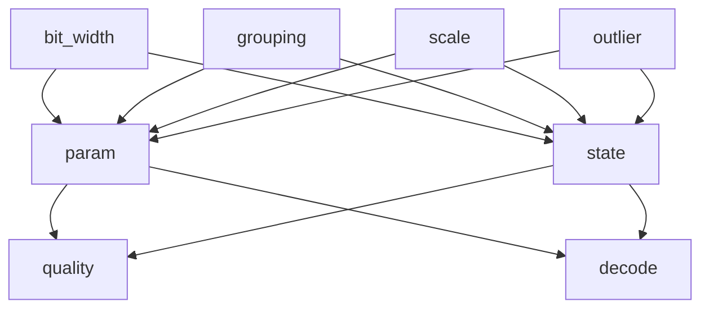

# Qwen3.8-27B quantization design space (TASK-08)

> **Draft status:** conclusions in this document are **unverified** until the verification stage completes.

Phase 1 tensor-specific custom quantization **research space** for Qwen3.8-27B
language + MTP. Family taxonomy and occupancy come from
[`docs/architecture/model-inventory.md`](model-inventory.md) (TASK-01). Source
weight distributions are **cited** from
[`docs/architecture/bf16-tensor-analysis.md`](bf16-tensor-analysis.md)
(TASK-05), not recomputed. Weight and state traffic identities come from
[`docs/architecture/work-and-traffic.md`](work-and-traffic.md) (TASK-06).
Precision roles and sensitive-op hypotheses come from
[`docs/architecture/numerical-sensitivity.md`](numerical-sensitivity.md)
(TASK-07). Sitting `text_config` instantiates occupancy products.

This document specifies a research space, not a selected quantizer, kernel, or
runtime format. Prefill and decode share one research space. Only access
pattern (gather versus full GEMM; unique weight read versus \(T\)-reuse)
changes decode-complexity hypotheses, not the candidate recipe lists. The
primary object is language+MTP checkpoint parameters (role `param`). The
secondary object is token-persistent state \(K,V,C,S\) (role `state`).
Activations and accumulators are not family policies here. Algebraic
equivalents in TASK-02 are the same real map; quantization acts on stored
elements. If an occupancy product would disagree with TASK-01 / sitting
`text_config`, or a cited absmax/ratio/outlier fraction would disagree with
TASK-05, or a weight/state byte would disagree with TASK-06, or a sensitive-op
id would disagree with TASK-07, the earlier document wins and this one is
wrong.

Claims are labelled OBSERVED (inventory/config/family occupancy), MEASURED
(TASK-05 numbers cited, not recomputed from payloads), DERIVED (metadata byte
formulas, occupancy products, illustration ratios), or HYPOTHESIS (every
candidate-set rationale, every quality risk, every decode-complexity risk).
No new MEASURED payload statistics. No MEASURED quality or tok/s. The ledger
open question (which bit widths, grouping, scales, and outlier policies form
the Pareto frontier) remains open for TASK-18.

## Authority

| Item | Value | Label |
| --- | --- | --- |
| Dossier | [`docs/architecture/tasks/TASK-08.md`](tasks/TASK-08.md) | — |
| Inventory | [`docs/architecture/model-inventory.md`](model-inventory.md) (TASK-01) | OBSERVED |
| Semantics | [`docs/architecture/model-semantics.md`](model-semantics.md) (TASK-02 equation tags) | citation |
| BF16 analysis | [`docs/architecture/bf16-tensor-analysis.md`](bf16-tensor-analysis.md) (TASK-05) | MEASURED citations |
| Work/traffic | [`docs/architecture/work-and-traffic.md`](work-and-traffic.md) (TASK-06) | DERIVED occupancy / \(I=F/B\) |
| Numerical sensitivity | [`docs/architecture/numerical-sensitivity.md`](numerical-sensitivity.md) (TASK-07) | HYPOTHESIS sensitive-op ids |
| Config | [`.cache/authorities/qwen3.8-27b-transformers/config.json`](../../.cache/authorities/qwen3.8-27b-transformers/config.json) `text_config` | OBSERVED |
| Checker | [`scripts/check_quantization_design_space.py`](../../scripts/check_quantization_design_space.py) | DERIVED |
| Evidence policy | [`docs/architecture/plan.md`](plan.md) (OBSERVED / MEASURED / DERIVED / HYPOTHESIS) | OBSERVED |
| In scope | Language+MTP `param` family policies plus \(K,V,C,S\) state experiments | — |
| Deferred | Vision encoder internals; activation working-dtype; packing (TASK-09) | — |
| Scope of this document | Research space — not a selected quantizer, kernel, or runtime format | — |

Numeric ranks instantiate sitting `text_config` OBSERVED: `hidden_size` 5120,
`intermediate_size` 17408, `vocab_size` 248320, 64 decoder layers, 48 linear +
16 full, `mtp_num_hidden_layers` 1, `dtype` `"bfloat16"`, `mamba_ssm_dtype`
`"float32"`. Language+MTP occupancy is 866 tensors / 27320697856 parameters /
54641395712 BF16 bytes (OBSERVED). Unique non-embed weight bytes are
52098598912 (TASK-06). Embeddings and `lm_head` are untied `(248320, 5120)`.

## Research-space convention

Logical values in this document are graph nodes. They do not imply physical allocation, materialization, buffer reuse, or kernel fusion.

Candidate policies in this document are a research space, not selected winners.

Quality and decode-complexity risks in this document are hypotheses, not measurements.

Metadata byte counts in this document are DERIVED lower bounds on scale and code storage, not a packed runtime layout.

- Four design dimensions are complete for this task: `bit_width`, `grouping`, `scale`, `outlier_policy`.
- A candidate recipe is one valid 4-tuple from those dimensions; listing it does not select it.
- Fan-out ≠ must-store still holds; a quantized family is not a CUDA allocation.
- The ledger open question (Pareto frontier) remains open for TASK-18.
- `models/Qwen3.8-27B-Q4_K_M.gguf` is not a candidate recipe and not a grouping authority.

Prefill and decode share this space. Layer absmax variation (TASK-05) is
absorbed by `per_tensor` / finer grouping recipes, not by per-layer format
winners. Do not inspect Quartz or llama.cpp to confirm GGUF groupings. GGUF
Q4_K_M remains a future black-box Pareto reference (TASK-18), not a recipe.

## Design dimensions

JSON array `design_dimensions` in this order: `bit_width`, `grouping`,
`scale`, `outlier_policy`. JSON `n_design_dimensions` = 4. The Cartesian
product of the vocabularies is **not** the experiment grid; the 22 named
recipes below are the only valid combinations this document enumerates.

**`bit_width` / element formats** (JSON `formats`):

| JSON | Kind | Meaning |
| --- | --- | --- |
| `source` | control | Family conceptual source: BF16 for every checkpoint tensor and for \(K,V,C\); F32 for \(S\). Recipe `keep_source`. |
| `bf16` | IEEE-like | Explicit BF16 store. Used only by recipe `narrow_bf16` on `state_s` (F32 conceptual → BF16). |
| `fp8_e4m3` | IEEE-like | 8-bit float with 4-bit exponent / 3-bit trailing significand (de facto E4M3). Not a CUDA dtype decision. |
| `int8` | integer | Signed 8-bit codes with a scale. |
| `int6` | integer | Signed 6-bit codes with a scale. |
| `int4` | integer | Signed 4-bit codes with a scale. |
| `int3` | integer | Signed 3-bit codes with a scale. |
| `int2` | integer | Signed 2-bit codes with a scale. |

JSON `ieee_like_formats` = `["source", "bf16", "fp8_e4m3"]`. JSON
`integer_formats` = `["int8", "int6", "int4", "int3", "int2"]`. Integer codes
are two’s-complement around zero for symmetric scales; asymmetric recipes add
a zero-point. Do not add `int5`, `fp8_e5m2`, or GGUF type names.

**`grouping`** (JSON `grouping_ids`):

| JSON | Meaning |
| --- | --- |
| `none` | No groups; IEEE-like / `keep_source` only. |
| `per_tensor` | One scale (and optional zero-point) for the whole tensor. |
| `per_row` | One scale per row of \(W\in\mathbb{R}^{d_\text{out}\times d_\text{in}}\) (TASK-05 axis 0 = \(d_\text{out}\), \(y=Wx\)). Rank-1: not used. |
| `per_col` | One scale per column (axis 1 = \(d_\text{in}\)). Rank-1: not used. |
| `block_g32` | Contiguous groups of 32 elements in **row-major** storage order. |
| `block_g64` | Groups of 64, same order. |
| `block_g128` | Groups of 128, same order. |

Last group may be shorter (`ragged_last_group` true). If \(g\) exceeds the
spanned axis length, that span is one group (`group_clips_to_axis` true).
`linear_attn.conv1d` uses the TASK-05 squeezed rank-2 `(10240, 4)`: `per_row`
= one scale per output channel. JSON `block_group_sizes` = `[32, 64, 128]`.

**`scale`** (JSON `scale_ids`):

| JSON | Meaning |
| --- | --- |
| `none` | No extra scale; IEEE-like formats only. |
| `symmetric_absmax` | \(s = \mathrm{absmax}/q_{\max}\) on the group; signed symmetric. |
| `symmetric_rms` | \(s=\mathrm{rms}/q_{\max}\) as the named candidate (no locked RMS×3 constant). |
| `asymmetric_minmax` | Affine scale + zero-point from group min and max. |
| `percentile_p99` | \(s = p_{99}(|w|)/q_{\max}\) using the TASK-05 nearest-rank definition on that group at experiment time. |

JSON `scale_storage_bytes_candidates` = `[2, 4]` (F16 vs F32 scale storage).
Illustrations below use 2-byte scales. Choosing 2 vs 4 is TASK-09 packing, not
a winner here. Calibration / GPTQ / AWQ / learned scales are not scale ids.

**`outlier_policy`** (JSON `outlier_ids`):

| JSON | Meaning |
| --- | --- |
| `none` | All elements use the group code. |
| `clip` | Clamp \(\lvert w\rvert\) to the representable range (destroys the tail). |
| `extract_high` | Store elements with \(\lvert w\rvert > 6\times p_{50}\) (TASK-05 6× definition, group-local at experiment time) in a sparse BF16 sidecar. |
| `mixed_group` | Groups whose absmax exceeds \(10\times\) the tensor-median group absmax use the next wider integer format (`int4`→`int8`, `int3`→`int4`); others stay narrow. |

**Validity rules.** IEEE-like format ⇒ `grouping` ∈ {`none`, `per_tensor`},
`scale` = `none`, `outlier` = `none`. Exception: `fp8_e4m3` uses `per_tensor`
+ `none` + `none` (recipe `fp8_tensor`). `keep_source` and `narrow_bf16` use
`none` + `none` + `none`. Integer format ⇒ `grouping` ≠ `none`, `scale` ≠
`none`. `clip`, `extract_high`, and `mixed_group` apply only to integer
recipes. Rank-1 families must not use `per_row` or `per_col`.

**Candidate recipes** (JSON `candidate_recipe_ids`, 22 ids, this order).
Parallel arrays `recipe_formats`, `recipe_groupings`, `recipe_scales`,
`recipe_outliers`. JSON `n_candidate_recipes` = 22.

| id | format | grouping | scale | outlier |
| --- | --- | --- | --- | --- |
| `keep_source` | `source` | `none` | `none` | `none` |
| `narrow_bf16` | `bf16` | `none` | `none` | `none` |
| `fp8_tensor` | `fp8_e4m3` | `per_tensor` | `none` | `none` |
| `i8_tensor` | `int8` | `per_tensor` | `symmetric_absmax` | `none` |
| `i8_row` | `int8` | `per_row` | `symmetric_absmax` | `none` |
| `i8_row_asym` | `int8` | `per_row` | `asymmetric_minmax` | `none` |
| `i8_g32` | `int8` | `block_g32` | `symmetric_absmax` | `none` |
| `i6_row` | `int6` | `per_row` | `symmetric_absmax` | `none` |
| `i4_row` | `int4` | `per_row` | `symmetric_absmax` | `none` |
| `i4_col` | `int4` | `per_col` | `symmetric_absmax` | `none` |
| `i4_g32` | `int4` | `block_g32` | `symmetric_absmax` | `none` |
| `i4_g64` | `int4` | `block_g64` | `symmetric_absmax` | `none` |
| `i4_g128` | `int4` | `block_g128` | `symmetric_absmax` | `none` |
| `i4_g128_p99` | `int4` | `block_g128` | `percentile_p99` | `none` |
| `i4_g128_rms` | `int4` | `block_g128` | `symmetric_rms` | `none` |
| `i4_g128_extract` | `int4` | `block_g128` | `symmetric_absmax` | `extract_high` |
| `i4_g32_mixed` | `int4` | `block_g32` | `symmetric_absmax` | `mixed_group` |
| `i4_row_extract` | `int4` | `per_row` | `symmetric_absmax` | `extract_high` |
| `i4_clip` | `int4` | `block_g128` | `symmetric_absmax` | `clip` |
| `i3_g32` | `int3` | `block_g32` | `symmetric_absmax` | `none` |
| `i3_g32_extract` | `int3` | `block_g32` | `symmetric_absmax` | `extract_high` |
| `i2_g32_extract` | `int2` | `block_g32` | `symmetric_absmax` | `extract_high` |

Shared list `C_GEMM_LARGE` (15 ids, this order) reused by `linear_large_proj`,
`attn_qkv`, `attn_out`, `mlp_down`: `keep_source`, `fp8_tensor`, `i8_row`,
`i8_row_asym`, `i6_row`, `i4_row`, `i4_col`, `i4_g32`, `i4_g64`, `i4_g128`,
`i4_g128_p99`, `i4_g128_rms`, `i4_g128_extract`, `i4_g32_mixed`, `i3_g32`.
JSON `c_gemm_large` equals that list.

## Metadata and compute implications

Let \(n\) be the element count, \(b\) the integer code width in bits, \(g\)
the group size, \(s\) the scale storage bytes, \(z\) the zero-point bytes
(\(z=0\) for symmetric, \(z=1\) for asymmetric illustrations).

\[
B_\text{payload}=\frac{n\,b}{8},\qquad
n_g=\Bigl\lceil\frac{n}{g}\Bigr\rceil,\qquad
B_\text{meta}=n_g(s+z),\qquad
B=B_\text{payload}+B_\text{meta}.
\]

IEEE-like recipes: \(B = n \times\) element bytes (`bytes_bf16` = 2,
`bytes_f32` = 4, `bytes_fp8` = 1). No \(B_\text{meta}\). These are **storage
lower bounds**, not packed layouts (TASK-09). 3-bit and 6-bit payloads use
exact \(nb/8\) in the formula even when that is not an integer byte per
element; `d_3bit_pack` records the HYPOTHESIS unpack cost. JSON
`payload_formula_allows_fractional_bytes` true.

Dequant arithmetic **count** if dequant-then-MAC (DERIVED): one multiply per
element (\(n\)) plus \(n_g\) scale loads. Fused-dequant-in-contraction extra
MAC is not claimed; that is a TASK-17 mapping. Decode impact of those counts
is HYPOTHESIS (`d_weight_dequant`). JSON `scale_storage_illustration_bytes` =
2.

**Illustration A — language MLP.** \(n=17112760320\) (DERIVED:
\(3\times 64\times 17408\times 5120\)), int4, \(s=2\), \(z=0\), vs BF16
\(B_\text{bf16}=34225520640\):

| \(g\) | \(n_g\) | \(B_\text{payload}\) | \(B_\text{meta}\) | \(B\) | \(B/B_\text{bf16}\) |
| ---: | ---: | ---: | ---: | ---: | ---: |
| 32 | 534773760 | 8556380160 | 1069547520 | 9625927680 | 0.28125 |
| 128 | 133693440 | 8556380160 | 267386880 | 8823767040 | 0.2578125 |

Exactness: \(B_\text{payload}=B_\text{bf16}/4\); \(B_\text{meta}/B_\text{bf16}=1/g\)
when \(s=2\) and BF16 is 2 bytes/element; \(g=32\) ⇒ \(0.25+1/32=0.28125\);
\(g=128\) ⇒ \(0.25+1/128=0.2578125\).

**Illustration B — unique non-embed language+MTP.** \(n=26049299456\),
\(B_\text{bf16}=52098598912\) (TASK-06), int4 \(g=128\) \(s=2\):
\(B_\text{payload}=13024649728\), \(n_g=203510152\), \(B_\text{meta}=407020304\),
\(B=13431670032\), ratio \(0.2578125\). This is an illustration of metadata
arithmetic, **not** a selected profile.

**Illustration C — embed gather.** TASK-06: decode reads one row, 10240 B
BF16 (equation `(1)`, 0 MAC). int4 `per_row`: payload \(5120\times 0.5=2560\)
plus one 2-byte scale ⇒ 2562 B. Access pattern differs from `lm_head` full
GEMM (HYPOTHESIS `d_embed_gather` vs `d_lm_head_unpack`).

**Illustration D — \(S\).** TASK-04/06: conceptual F32 150994944 B/step. BF16
store 75497472 B; FP8 37748736 B; int8+per_tensor 2-byte scale 37748738 B.
Not a winner; pairs with `q_state_s` / `d_state_s_narrow`.

## Source evidence

Compact TASK-05/06/07 citations used to **shape** family candidate sets, not
to pick winners. TASK-05 measurements are not bit/grouping/quality
recommendations.

MEASURED (from `docs/architecture/bf16-tensor-analysis.md`):

| JSON key | Value | What it shapes (HYPOTHESIS rationale, not a winner) |
| --- | --- | --- |
| `cit_language_mtp_absmax` | 19.25 | `gdn_time_param` keeps `keep_source` and only `i8_tensor` |
| `cit_dt_bias_absmax` | 19.25 | same (`linear_attn.dt_bias`) |
| `cit_a_log_absmax` | 5.5625 | same (`linear_attn.A_log`) |
| `cit_conv1d_frac_out_6x` | 0.1805953979492 | `conv1d` includes `i4_clip` and `extract_high` |
| `cit_embed_row_ratio` | 11.74384236453 | `embed_table` includes `per_row` / `extract_high` |
| `cit_lm_head_row_ratio` | 5.223880597015 | `lm_head` includes `per_row` |
| `cit_out_proj_mean_row_ratio` | 15.3244687679 | `linear_large_proj` includes `per_row` and `per_col` |
| `cit_o_proj_mean_row_ratio` | 13.59971022497 | `attn_out` uses `C_GEMM_LARGE` |
| `cit_down_proj_max_row_ratio` | 25.73544973545 | `mlp_down` keeps `per_row`/`per_col`; omits `int2` |
| `cit_mlp_gate_frac_out_6x` | 0.0003818664480658 | `mlp_up_gate` may include `int2` extract (mass, not tail) |
| `cit_embed_n_zero` | 7528 | embed is the only pooled-zero location (TASK-05) |

OBSERVED/DERIVED occupancy and traffic (must match TASK-01/06 / `text_config`):

| JSON key | Value |
| --- | ---: |
| `weight_bytes_language_mlp` | 34225520640 |
| `weight_bytes_lm_head` | 2542796800 |
| `weight_bytes_embed_table` | 2542796800 |
| `weight_bytes_language_linear_attn` | 11124102144 |
| `weight_bytes_language_self_attn` | 3355459584 |
| `weight_bytes_language_mtp_excl_vision` | 54641395712 |
| `weight_bytes_unique_non_embed` | 52098598912 |
| `s_f32_bytes` | 150994944 |
| `kv_bytes_all_per_token` | 69632 |
| `c_bytes_all` | 2949120 |
| `mlp_n` | 17112760320 |
| `embed_n` | 1271398400 |
| `n_language_mtp_parameters` | 27320697856 |

JSON booleans: `gguf_is_not_a_recipe` true; `pareto_frontier_selected` false;
`activation_quant_in_family_policies` false; `payloads_restreamed` false.

TASK-06 intensity: MLP vs unique weights \(I=1\); `lm_head` is
`vocab_memory` 2542796800 B; GDN vs \(S\) \(I=0.75\). TASK-07 roles
`param`/`activation`/`accum`/`state`; further `param_bf16` narrowing is this
task; `gdn_alpha_beta` / `residual_stream` / `s_below_f32` / `state_kv_bf16`
are high (HYPOTHESIS). `mamba_ssm_dtype` is not an activation dtype.

## Policy families

JSON array `policy_families` in this exact order (16 ids). JSON
`n_policy_families` = 16. JSON object `policy_family_members` maps each family
id to that member list. Union of param members = all 42 `LEVEL2_IDS`. Union
of state members = `["K_state", "V_state", "C_state", "S"]`. JSON
`n_level2_mapped` = 42, `n_state_mapped` = 4.

MTP rank-2 weights **mirror** the matching language family (same candidate
list), because occupancy is 1 and TASK-05 did not show a separate
policy-shape. `mtp.fc` is its own family (unique \(5120\times 10240\)
contraction `(23)`).

| id | role | Members (level-2 or state ids) |
| --- | --- | --- |
| `norm_gamma` | param | `input_layernorm`, `post_attention_layernorm`, `final_norm`, `linear_attn.norm`, `self_attn.q_norm`, `self_attn.k_norm`, `mtp.norm`, `mtp.pre_fc_norm_embedding`, `mtp.pre_fc_norm_hidden`, `mtp.input_layernorm`, `mtp.post_attention_layernorm`, `mtp.self_attn.q_norm`, `mtp.self_attn.k_norm` |
| `gdn_time_param` | param | `linear_attn.A_log`, `linear_attn.dt_bias` |
| `gdn_gate_proj` | param | `linear_attn.in_proj_a`, `linear_attn.in_proj_b` |
| `conv1d` | param | `linear_attn.conv1d` |
| `linear_large_proj` | param | `linear_attn.in_proj_qkv`, `linear_attn.in_proj_z`, `linear_attn.out_proj` |
| `attn_qkv` | param | `self_attn.q_proj`, `self_attn.k_proj`, `self_attn.v_proj`, `mtp.self_attn.q_proj`, `mtp.self_attn.k_proj`, `mtp.self_attn.v_proj` |
| `attn_out` | param | `self_attn.o_proj`, `mtp.self_attn.o_proj` |
| `mlp_up_gate` | param | `mlp.gate_proj`, `mlp.up_proj`, `mtp.mlp.gate_proj`, `mtp.mlp.up_proj` |
| `mlp_down` | param | `mlp.down_proj`, `mtp.mlp.down_proj` |
| `embed_table` | param | `embed` |
| `lm_head` | param | `lm_head` |
| `mtp_fc` | param | `mtp.fc` |
| `vision_deferred` | param | `vision.patch_embed`, `vision.pos_embed`, `vision.blocks`, `vision.merger` |
| `state_kv` | state | `K_state`, `V_state` |
| `state_c` | state | `C_state` |
| `state_s` | state | `S` |

## Family-specific candidate policies

JSON object `family_candidates` maps each policy family to a JSON array of
recipe ids. These arrays are the research space. There is **no**
preferred/default/winner field. Rationale is labelled HYPOTHESIS. JSON
`family_candidate_counts` = `[3, 2, 7, 6, 15, 15, 15, 17, 15, 5, 7, 5, 0, 3, 2, 4]`.
Every family except `vision_deferred` contains `keep_source`. JSON
`keep_source_on_all_defined_families` true.

An example grid cell is `mlp_up_gate` × `i4_g128`; that pairing is an
example, not a selected winner. Control profile = all `keep_source` (and
`vision_deferred` skipped). Do not call the control a baseline quality
winner.

| family | `family_candidates` (this order) | \(n\) | HYPOTHESIS rationale (not a selection) |
| --- | --- | ---: | --- |
| `norm_gamma` | `keep_source`, `i8_tensor`, `i8_g32` | 3 | Rank-1 \(\gamma\) on RMS `(2)`–`(3)`; TASK-07 `rms_hidden` high; small \(n\); many families have MEASURED `frac_out_6x=0`. Omit `per_row`/`int4`. |
| `gdn_time_param` | `keep_source`, `i8_tensor` | 2 | \(n=2304\) each; MEASURED absmax 19.25 / 5.5625; TASK-07 `gdn_alpha_beta` high; feeds \(\alpha/\beta\) `(15)`. No grouping finer than tensor: vectors length 48. |
| `gdn_gate_proj` | `keep_source`, `i8_tensor`, `i8_row`, `i6_row`, `i4_row`, `i4_g128`, `i4_g128_extract` | 7 | Feeds \(\alpha/\beta\); modest 11796480 params each; TASK-05 col ratios ~6. Include extract; omit `int2`. |
| `conv1d` | `keep_source`, `i8_row`, `i4_row`, `i4_g32`, `i4_g128_extract`, `i4_clip` | 6 | MEASURED `frac_out_6x` 0.1805953979492 on squeezed `(10240, 4)`; FIR `(14)`. Clip is a **candidate**, not a recommendation. |
| `linear_large_proj` | `C_GEMM_LARGE` | 15 | Dominant linear-attn bytes 11124102144; `out_proj` mean row ratio 15.3244687679. |
| `attn_qkv` | `C_GEMM_LARGE` | 15 | Same GEMM-shaped space; K also feeds `state_kv` (quality risk, not a different recipe list). Attention `(9)`. |
| `attn_out` | `C_GEMM_LARGE` | 15 | Residual path `(4)`–`(5)` (TASK-07 `residual_stream` high) plus high directional ratios; still the same GEMM grid, **without** `int2`. |
| `mlp_up_gate` | `C_GEMM_LARGE` + `i3_g32_extract` + `i2_g32_extract` | 17 | 11.4 GiB each; TASK-06 \(I=1\); low MEASURED 6× fractions. `int2` is an extreme **candidate** on this mass only. |
| `mlp_down` | `C_GEMM_LARGE` | 15 | Residual + \(K=17408\) + max row ratio 25.73544973545; omit `int2`. |
| `embed_table` | `keep_source`, `i8_row`, `i4_row`, `i4_g128`, `i4_row_extract` | 5 | Gather `(1)`, not GEMM (0 MAC). Row ratio 11.74384236453; `n_zero` 7528. |
| `lm_head` | `keep_source`, `i8_row`, `i8_row_asym`, `i6_row`, `i4_row`, `i4_g128`, `i4_g128_extract` | 7 | Full GEMM; TASK-06 `vocab_memory` 2542796800 B. Not a gather recipe set. |
| `mtp_fc` | `keep_source`, `i8_row`, `i4_row`, `i4_col`, `i4_g128` | 5 | Unique shape; MEASURED row ratio 1.225 vs col 4.95, so `per_col` stays in the set. |
| `vision_deferred` | `[]` | 0 | Internals are not expanded here; no experiments defined. |
| `state_kv` | `keep_source`, `fp8_tensor`, `i8_tensor` | 3 | Conceptual BF16; TASK-07 `state_kv_bf16` high; TASK-06 69632 B/token. |
| `state_c` | `keep_source`, `i8_tensor` | 2 | TASK-07 `state_c_bf16` low; 2949120 B. |
| `state_s` | `keep_source`, `narrow_bf16`, `fp8_tensor`, `i8_tensor` | 4 | Conceptual F32; `keep_source` = F32; `narrow_bf16` **is** the `s_below_f32` experiment on recurrence `(17)`–`(18)`. |

## Quality and decode-complexity risks

Every severity is HYPOTHESIS. Survival of any row is TASK-18. Do not rank
decode rows by wall time. Do not name CUDA kernels. Do not convert TASK-06
bottleneck labels into measurements.

JSON array `quality_risk_ids` (17 ids). Parallel `quality_risk_families`,
`quality_risk_sensitive_ops` (primary TASK-07 id), `quality_risk_severities`.
JSON `n_quality_risks` = 17, `n_quality_high` = 8, `n_quality_medium` = 7,
`n_quality_low` = 2.

| ID | Family / scope | Primary TASK-07 op | Severity |
| --- | --- | --- | --- |
| `q_norm_gamma` | `norm_gamma` | `rms_hidden` | high |
| `q_gdn_time` | `gdn_time_param` | `gdn_alpha_beta` | high |
| `q_gdn_gate` | `gdn_gate_proj` | `gdn_alpha_beta` | high |
| `q_conv` | `conv1d` | `conv_fir` | low |
| `q_linear_proj` | `linear_large_proj` | `gemm_k5120` | medium |
| `q_attn_qkv` | `attn_qkv` | `gemm_k5120` | medium |
| `q_attn_out` | `attn_out` | `residual_stream` | high |
| `q_mlp_up` | `mlp_up_gate` | `gemm_k5120` | medium |
| `q_mlp_down` | `mlp_down` | `residual_stream` | high |
| `q_embed` | `embed_table` | `param_bf16` | medium |
| `q_lm_head` | `lm_head` | `gemm_lm_head` | medium |
| `q_mtp_fc` | `mtp_fc` | `gemm_k5120` | medium |
| `q_state_kv` | `state_kv` | `state_kv_bf16` | high |
| `q_state_c` | `state_c` | `state_c_bf16` | low |
| `q_state_s` | `state_s` | `s_below_f32` | high |
| `q_clip_tail` | any `clip` recipe | `param_bf16` | medium |
| `q_int2_mass` | `mlp_up_gate` × `i2_g32_extract` | `param_bf16` | high |

Locked partitions: `quality_high_ids` = `q_norm_gamma`, `q_gdn_time`,
`q_gdn_gate`, `q_attn_out`, `q_mlp_down`, `q_state_kv`, `q_state_s`,
`q_int2_mass`. `quality_medium_ids` = `q_linear_proj`, `q_attn_qkv`,
`q_mlp_up`, `q_embed`, `q_lm_head`, `q_mtp_fc`, `q_clip_tail`.
`quality_low_ids` = `q_conv`, `q_state_c`.

`q_attn_qkv` primary is `gemm_k5120`; RoPE-baked \(K\) also feeds
`state_kv_bf16`. `q_mlp_down` primary is `residual_stream`; `gemm_k17408` is
the matching accum path.

JSON array `decode_risk_ids` (9 ids). Parallel `decode_risk_severities`. Every
severity is HYPOTHESIS versus the TASK-06 unfilled SKU ridge. JSON `n_decode_risks`
= 9, `n_decode_high` = 3, `n_decode_medium` = 5, `n_decode_low` = 1.

| ID | Ties to | Severity | Claim (HYPOTHESIS) |
| --- | --- | --- | --- |
| `d_weight_dequant` | TASK-06 `weight_memory`, \(I=1\) | high | Extra dequant ALU on decode GEMMs may compete with a memory-bound region |
| `d_fine_group_meta` | Illustration A \(g=32\) vs \(g=128\) | medium | Fine-group scale traffic is a material decode bandwidth term |
| `d_outlier_gather` | `extract_high` | medium | Sparse BF16 sidecar is irregular extra traffic |
| `d_mixed_width` | `mixed_group` | low | Width switching prevents uniform unpack |
| `d_embed_gather` | Illustration C | medium | Per-row dequant of one vocab row differs from table-wide unpack |
| `d_lm_head_unpack` | TASK-06 `vocab_memory` | high | 2542796800 B unique; unpack every decode |
| `d_3bit_pack` | `int3` / `int6` | medium | Non-byte-aligned codes add shift/mask work (layout is TASK-09) |
| `d_state_s_narrow` | Illustration D, TASK-06 `state_memory` | high | Narrowing \(S\) cuts 150994944 B/step but pairs with `q_state_s` |
| `d_kv_narrow` | TASK-06 `kv_memory` | medium | Narrowing KV scales with \(T\) via 69632 B/token |

JSON `decode_high_ids`: `d_weight_dequant`, `d_lm_head_unpack`,
`d_state_s_narrow`. `decode_medium_ids`: `d_fine_group_meta`,
`d_outlier_gather`, `d_embed_gather`, `d_3bit_pack`, `d_kv_narrow`.
`decode_low_ids`: `d_mixed_width`.

Diagram 1 of 1: four design dimensions feed `param` and `state` experiment
surfaces; those surfaces feed HYPOTHESIS `quality` and `decode` risk classes.
JSON `n_diagrams` is 1. `diagram_ids` is
`["bit_width","grouping","scale","outlier","param","state","quality","decode"]`.



## Deferred vision

Visual tokens may replace placeholders in the residual stream
(`out_hidden_size` 5120 OBSERVED). Encoder / patch embed / merger quantization
experiments are **UNKNOWN**. `vision_deferred` has an empty candidate list.
Do not add vision recipes.

## Machine-checkable summary JSON

Live object from `text_config` arithmetic plus locked constants and TASK-05
citations (copied from
[`scripts/check_quantization_design_space.py --json`](../../scripts/check_quantization_design_space.py)):

```json
{
  "authority": ".cache/authorities/qwen3.8-27b-transformers",
  "hidden_size": 5120,
  "intermediate_size": 17408,
  "vocab_size": 248320,
  "n_decoder_layers": 64,
  "n_linear_layers": 48,
  "n_full_layers": 16,
  "n_mtp_blocks": 1,
  "full_attention_indices": [
    3,
    7,
    11,
    15,
    19,
    23,
    27,
    31,
    35,
    39,
    43,
    47,
    51,
    55,
    59,
    63
  ],
  "bytes_bf16": 2,
  "bytes_f32": 4,
  "bytes_fp8": 1,
  "mlp_n": 17112760320,
  "embed_n": 1271398400,
  "n_language_mtp_parameters": 27320697856,
  "mlp_bf16_bytes": 34225520640,
  "mlp_int4_payload_bytes": 8556380160,
  "mlp_int4_g32_meta_bytes": 1069547520,
  "mlp_int4_g32_total_bytes": 9625927680,
  "mlp_int4_g32_over_bf16": 0.28125,
  "mlp_int4_g128_meta_bytes": 267386880,
  "mlp_int4_g128_total_bytes": 8823767040,
  "mlp_int4_g128_over_bf16": 0.2578125,
  "weight_bytes_language_mlp": 34225520640,
  "weight_bytes_lm_head": 2542796800,
  "weight_bytes_embed_table": 2542796800,
  "weight_bytes_language_linear_attn": 11124102144,
  "weight_bytes_language_self_attn": 3355459584,
  "weight_bytes_language_mtp_excl_vision": 54641395712,
  "weight_bytes_unique_non_embed": 52098598912,
  "unique_non_embed_n": 26049299456,
  "unique_non_embed_bf16_bytes": 52098598912,
  "unique_non_embed_int4_g128_total_bytes": 13431670032,
  "unique_non_embed_int4_g128_over_bf16": 0.2578125,
  "embed_gather_bf16_bytes": 10240,
  "embed_gather_int4_row_bytes": 2562,
  "s_f32_bytes": 150994944,
  "s_bf16_bytes": 75497472,
  "s_fp8_bytes": 37748736,
  "kv_bytes_all_per_token": 69632,
  "c_bytes_all": 2949120,
  "scale_storage_illustration_bytes": 2,
  "scale_storage_bytes_candidates": [
    2,
    4
  ],
  "ragged_last_group": true,
  "group_clips_to_axis": true,
  "payload_formula_allows_fractional_bytes": true,
  "cit_language_mtp_absmax": 19.25,
  "cit_dt_bias_absmax": 19.25,
  "cit_a_log_absmax": 5.5625,
  "cit_conv1d_frac_out_6x": 0.1805953979492,
  "cit_embed_row_ratio": 11.74384236453,
  "cit_lm_head_row_ratio": 5.223880597015,
  "cit_out_proj_mean_row_ratio": 15.3244687679,
  "cit_o_proj_mean_row_ratio": 13.59971022497,
  "cit_down_proj_max_row_ratio": 25.73544973545,
  "cit_mlp_gate_frac_out_6x": 0.0003818664480658,
  "cit_embed_n_zero": 7528,
  "design_dimensions": [
    "bit_width",
    "grouping",
    "scale",
    "outlier_policy"
  ],
  "formats": [
    "source",
    "bf16",
    "fp8_e4m3",
    "int8",
    "int6",
    "int4",
    "int3",
    "int2"
  ],
  "ieee_like_formats": [
    "source",
    "bf16",
    "fp8_e4m3"
  ],
  "integer_formats": [
    "int8",
    "int6",
    "int4",
    "int3",
    "int2"
  ],
  "grouping_ids": [
    "none",
    "per_tensor",
    "per_row",
    "per_col",
    "block_g32",
    "block_g64",
    "block_g128"
  ],
  "block_group_sizes": [
    32,
    64,
    128
  ],
  "scale_ids": [
    "none",
    "symmetric_absmax",
    "symmetric_rms",
    "asymmetric_minmax",
    "percentile_p99"
  ],
  "outlier_ids": [
    "none",
    "clip",
    "extract_high",
    "mixed_group"
  ],
  "candidate_recipe_ids": [
    "keep_source",
    "narrow_bf16",
    "fp8_tensor",
    "i8_tensor",
    "i8_row",
    "i8_row_asym",
    "i8_g32",
    "i6_row",
    "i4_row",
    "i4_col",
    "i4_g32",
    "i4_g64",
    "i4_g128",
    "i4_g128_p99",
    "i4_g128_rms",
    "i4_g128_extract",
    "i4_g32_mixed",
    "i4_row_extract",
    "i4_clip",
    "i3_g32",
    "i3_g32_extract",
    "i2_g32_extract"
  ],
  "recipe_formats": [
    "source",
    "bf16",
    "fp8_e4m3",
    "int8",
    "int8",
    "int8",
    "int8",
    "int6",
    "int4",
    "int4",
    "int4",
    "int4",
    "int4",
    "int4",
    "int4",
    "int4",
    "int4",
    "int4",
    "int4",
    "int3",
    "int3",
    "int2"
  ],
  "recipe_groupings": [
    "none",
    "none",
    "per_tensor",
    "per_tensor",
    "per_row",
    "per_row",
    "block_g32",
    "per_row",
    "per_row",
    "per_col",
    "block_g32",
    "block_g64",
    "block_g128",
    "block_g128",
    "block_g128",
    "block_g128",
    "block_g32",
    "per_row",
    "block_g128",
    "block_g32",
    "block_g32",
    "block_g32"
  ],
  "recipe_scales": [
    "none",
    "none",
    "none",
    "symmetric_absmax",
    "symmetric_absmax",
    "asymmetric_minmax",
    "symmetric_absmax",
    "symmetric_absmax",
    "symmetric_absmax",
    "symmetric_absmax",
    "symmetric_absmax",
    "symmetric_absmax",
    "symmetric_absmax",
    "percentile_p99",
    "symmetric_rms",
    "symmetric_absmax",
    "symmetric_absmax",
    "symmetric_absmax",
    "symmetric_absmax",
    "symmetric_absmax",
    "symmetric_absmax",
    "symmetric_absmax"
  ],
  "recipe_outliers": [
    "none",
    "none",
    "none",
    "none",
    "none",
    "none",
    "none",
    "none",
    "none",
    "none",
    "none",
    "none",
    "none",
    "none",
    "none",
    "extract_high",
    "mixed_group",
    "extract_high",
    "clip",
    "none",
    "extract_high",
    "extract_high"
  ],
  "c_gemm_large": [
    "keep_source",
    "fp8_tensor",
    "i8_row",
    "i8_row_asym",
    "i6_row",
    "i4_row",
    "i4_col",
    "i4_g32",
    "i4_g64",
    "i4_g128",
    "i4_g128_p99",
    "i4_g128_rms",
    "i4_g128_extract",
    "i4_g32_mixed",
    "i3_g32"
  ],
  "n_candidate_recipes": 22,
  "n_design_dimensions": 4,
  "policy_families": [
    "norm_gamma",
    "gdn_time_param",
    "gdn_gate_proj",
    "conv1d",
    "linear_large_proj",
    "attn_qkv",
    "attn_out",
    "mlp_up_gate",
    "mlp_down",
    "embed_table",
    "lm_head",
    "mtp_fc",
    "vision_deferred",
    "state_kv",
    "state_c",
    "state_s"
  ],
  "policy_family_members": {
    "norm_gamma": [
      "input_layernorm",
      "post_attention_layernorm",
      "final_norm",
      "linear_attn.norm",
      "self_attn.q_norm",
      "self_attn.k_norm",
      "mtp.norm",
      "mtp.pre_fc_norm_embedding",
      "mtp.pre_fc_norm_hidden",
      "mtp.input_layernorm",
      "mtp.post_attention_layernorm",
      "mtp.self_attn.q_norm",
      "mtp.self_attn.k_norm"
    ],
    "gdn_time_param": [
      "linear_attn.A_log",
      "linear_attn.dt_bias"
    ],
    "gdn_gate_proj": [
      "linear_attn.in_proj_a",
      "linear_attn.in_proj_b"
    ],
    "conv1d": [
      "linear_attn.conv1d"
    ],
    "linear_large_proj": [
      "linear_attn.in_proj_qkv",
      "linear_attn.in_proj_z",
      "linear_attn.out_proj"
    ],
    "attn_qkv": [
      "self_attn.q_proj",
      "self_attn.k_proj",
      "self_attn.v_proj",
      "mtp.self_attn.q_proj",
      "mtp.self_attn.k_proj",
      "mtp.self_attn.v_proj"
    ],
    "attn_out": [
      "self_attn.o_proj",
      "mtp.self_attn.o_proj"
    ],
    "mlp_up_gate": [
      "mlp.gate_proj",
      "mlp.up_proj",
      "mtp.mlp.gate_proj",
      "mtp.mlp.up_proj"
    ],
    "mlp_down": [
      "mlp.down_proj",
      "mtp.mlp.down_proj"
    ],
    "embed_table": [
      "embed"
    ],
    "lm_head": [
      "lm_head"
    ],
    "mtp_fc": [
      "mtp.fc"
    ],
    "vision_deferred": [
      "vision.patch_embed",
      "vision.pos_embed",
      "vision.blocks",
      "vision.merger"
    ],
    "state_kv": [
      "K_state",
      "V_state"
    ],
    "state_c": [
      "C_state"
    ],
    "state_s": [
      "S"
    ]
  },
  "family_candidates": {
    "norm_gamma": [
      "keep_source",
      "i8_tensor",
      "i8_g32"
    ],
    "gdn_time_param": [
      "keep_source",
      "i8_tensor"
    ],
    "gdn_gate_proj": [
      "keep_source",
      "i8_tensor",
      "i8_row",
      "i6_row",
      "i4_row",
      "i4_g128",
      "i4_g128_extract"
    ],
    "conv1d": [
      "keep_source",
      "i8_row",
      "i4_row",
      "i4_g32",
      "i4_g128_extract",
      "i4_clip"
    ],
    "linear_large_proj": [
      "keep_source",
      "fp8_tensor",
      "i8_row",
      "i8_row_asym",
      "i6_row",
      "i4_row",
      "i4_col",
      "i4_g32",
      "i4_g64",
      "i4_g128",
      "i4_g128_p99",
      "i4_g128_rms",
      "i4_g128_extract",
      "i4_g32_mixed",
      "i3_g32"
    ],
    "attn_qkv": [
      "keep_source",
      "fp8_tensor",
      "i8_row",
      "i8_row_asym",
      "i6_row",
      "i4_row",
      "i4_col",
      "i4_g32",
      "i4_g64",
      "i4_g128",
      "i4_g128_p99",
      "i4_g128_rms",
      "i4_g128_extract",
      "i4_g32_mixed",
      "i3_g32"
    ],
    "attn_out": [
      "keep_source",
      "fp8_tensor",
      "i8_row",
      "i8_row_asym",
      "i6_row",
      "i4_row",
      "i4_col",
      "i4_g32",
      "i4_g64",
      "i4_g128",
      "i4_g128_p99",
      "i4_g128_rms",
      "i4_g128_extract",
      "i4_g32_mixed",
      "i3_g32"
    ],
    "mlp_up_gate": [
      "keep_source",
      "fp8_tensor",
      "i8_row",
      "i8_row_asym",
      "i6_row",
      "i4_row",
      "i4_col",
      "i4_g32",
      "i4_g64",
      "i4_g128",
      "i4_g128_p99",
      "i4_g128_rms",
      "i4_g128_extract",
      "i4_g32_mixed",
      "i3_g32",
      "i3_g32_extract",
      "i2_g32_extract"
    ],
    "mlp_down": [
      "keep_source",
      "fp8_tensor",
      "i8_row",
      "i8_row_asym",
      "i6_row",
      "i4_row",
      "i4_col",
      "i4_g32",
      "i4_g64",
      "i4_g128",
      "i4_g128_p99",
      "i4_g128_rms",
      "i4_g128_extract",
      "i4_g32_mixed",
      "i3_g32"
    ],
    "embed_table": [
      "keep_source",
      "i8_row",
      "i4_row",
      "i4_g128",
      "i4_row_extract"
    ],
    "lm_head": [
      "keep_source",
      "i8_row",
      "i8_row_asym",
      "i6_row",
      "i4_row",
      "i4_g128",
      "i4_g128_extract"
    ],
    "mtp_fc": [
      "keep_source",
      "i8_row",
      "i4_row",
      "i4_col",
      "i4_g128"
    ],
    "vision_deferred": [],
    "state_kv": [
      "keep_source",
      "fp8_tensor",
      "i8_tensor"
    ],
    "state_c": [
      "keep_source",
      "i8_tensor"
    ],
    "state_s": [
      "keep_source",
      "narrow_bf16",
      "fp8_tensor",
      "i8_tensor"
    ]
  },
  "family_candidate_counts": [
    3,
    2,
    7,
    6,
    15,
    15,
    15,
    17,
    15,
    5,
    7,
    5,
    0,
    3,
    2,
    4
  ],
  "n_policy_families": 16,
  "n_level2_mapped": 42,
  "n_state_mapped": 4,
  "keep_source_on_all_defined_families": true,
  "quality_risk_ids": [
    "q_norm_gamma",
    "q_gdn_time",
    "q_gdn_gate",
    "q_conv",
    "q_linear_proj",
    "q_attn_qkv",
    "q_attn_out",
    "q_mlp_up",
    "q_mlp_down",
    "q_embed",
    "q_lm_head",
    "q_mtp_fc",
    "q_state_kv",
    "q_state_c",
    "q_state_s",
    "q_clip_tail",
    "q_int2_mass"
  ],
  "quality_risk_families": [
    "norm_gamma",
    "gdn_time_param",
    "gdn_gate_proj",
    "conv1d",
    "linear_large_proj",
    "attn_qkv",
    "attn_out",
    "mlp_up_gate",
    "mlp_down",
    "embed_table",
    "lm_head",
    "mtp_fc",
    "state_kv",
    "state_c",
    "state_s",
    "clip",
    "mlp_up_gate"
  ],
  "quality_risk_sensitive_ops": [
    "rms_hidden",
    "gdn_alpha_beta",
    "gdn_alpha_beta",
    "conv_fir",
    "gemm_k5120",
    "gemm_k5120",
    "residual_stream",
    "gemm_k5120",
    "residual_stream",
    "param_bf16",
    "gemm_lm_head",
    "gemm_k5120",
    "state_kv_bf16",
    "state_c_bf16",
    "s_below_f32",
    "param_bf16",
    "param_bf16"
  ],
  "quality_risk_severities": [
    "high",
    "high",
    "high",
    "low",
    "medium",
    "medium",
    "high",
    "medium",
    "high",
    "medium",
    "medium",
    "medium",
    "high",
    "low",
    "high",
    "medium",
    "high"
  ],
  "quality_high_ids": [
    "q_norm_gamma",
    "q_gdn_time",
    "q_gdn_gate",
    "q_attn_out",
    "q_mlp_down",
    "q_state_kv",
    "q_state_s",
    "q_int2_mass"
  ],
  "quality_medium_ids": [
    "q_linear_proj",
    "q_attn_qkv",
    "q_mlp_up",
    "q_embed",
    "q_lm_head",
    "q_mtp_fc",
    "q_clip_tail"
  ],
  "quality_low_ids": [
    "q_conv",
    "q_state_c"
  ],
  "n_quality_risks": 17,
  "n_quality_high": 8,
  "n_quality_medium": 7,
  "n_quality_low": 2,
  "decode_risk_ids": [
    "d_weight_dequant",
    "d_fine_group_meta",
    "d_outlier_gather",
    "d_mixed_width",
    "d_embed_gather",
    "d_lm_head_unpack",
    "d_3bit_pack",
    "d_state_s_narrow",
    "d_kv_narrow"
  ],
  "decode_risk_severities": [
    "high",
    "medium",
    "medium",
    "low",
    "medium",
    "high",
    "medium",
    "high",
    "medium"
  ],
  "decode_high_ids": [
    "d_weight_dequant",
    "d_lm_head_unpack",
    "d_state_s_narrow"
  ],
  "decode_medium_ids": [
    "d_fine_group_meta",
    "d_outlier_gather",
    "d_embed_gather",
    "d_3bit_pack",
    "d_kv_narrow"
  ],
  "decode_low_ids": [
    "d_mixed_width"
  ],
  "n_decode_risks": 9,
  "n_decode_high": 3,
  "n_decode_medium": 5,
  "n_decode_low": 1,
  "gguf_is_not_a_recipe": true,
  "pareto_frontier_selected": false,
  "activation_quant_in_family_policies": false,
  "payloads_restreamed": false,
  "diagram_ids": [
    "bit_width",
    "grouping",
    "scale",
    "outlier",
    "param",
    "state",
    "quality",
    "decode"
  ],
  "n_diagrams": 1,
  "canonical_sentence_logical": "Logical values in this document are graph nodes. They do not imply physical allocation, materialization, buffer reuse, or kernel fusion.",
  "canonical_sentence_candidates": "Candidate policies in this document are a research space, not selected winners.",
  "canonical_sentence_hypothesis": "Quality and decode-complexity risks in this document are hypotheses, not measurements.",
  "canonical_sentence_metadata": "Metadata byte counts in this document are DERIVED lower bounds on scale and code storage, not a packed runtime layout."
}
```
