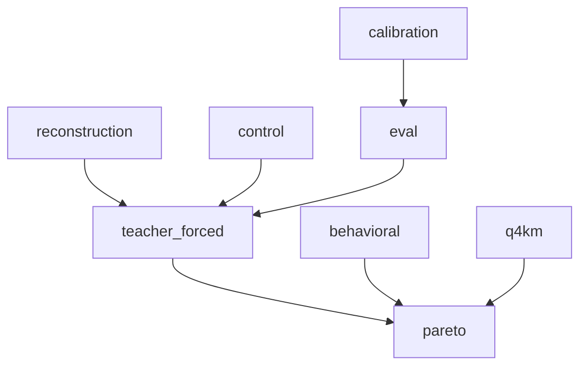

# Qwen3.8-27B quantization evaluation methodology (TASK-18)

> **V0 implementation authority:** [EVAL-01 / PERF-01](evaluation-policy-v0.md)
> selects the unchanged language evaluation inputs, scoring rules and acceptance
> policy. OVERALL-01 remaps candidate core acceptance to TASK-022, production
> prefill and 32768 acceptance to TASK-026, and matched performance to TASK-027.
> This Phase 1 methodology and its generated JSON remain historical research
> context; their obsolete task order and unselected-corpus flags do not override
> the implementation ledger or the EVAL-01 protocol freeze recorded by TASK-018.
> TASK-018 freezes disjoint calibration/development sources and sampling;
> TASK-020 materializes their exact token identities before any fitting or
> screening. Both remain disjoint from final EVAL-01 inputs.

> **Draft status:** conclusions in this document are **unverified** until the verification stage completes.

Phase 1 **quantization evaluation methodology** for Qwen3.8-27B language+MTP.
Precision roles and sensitive-op hypotheses come from
[`docs/architecture/numerical-sensitivity.md`](numerical-sensitivity.md)
(TASK-07). Element formats, 22 recipes, 16 policy families, quality-risk ids,
and metadata lower bounds come from
[`docs/architecture/quantization-design-space.md`](quantization-design-space.md)
(TASK-08). Compiler stages, conceptual profiles, calibration hook, and
ownership of recipe maps / corpora come from
[`docs/architecture/model-compiler-plan.md`](model-compiler-plan.md)
(TASK-10). Sitting `text_config` instantiates occupancy products.

This document specifies an **evaluation methodology**, not measurements, not a
selected quantizer, and not a selected Pareto hull. Prefill and decode share
**one** quality methodology. Only $T$ (context horizon) and whether incoming
$(K,V,C,S)$ is zeros versus populated change. The primary object is
language+MTP checkpoint parameters after a TASK-08 recipe (still unselected)
versus control `keep_source`. The secondary object is token-persistent state
$K,V,C,S$ when a state recipe is under test. Activations are reconstruction
**probes**, not family policies. Algebraic equivalents in TASK-02 are the same
real map; quantization acts on stored elements. Log-softmax over $V$ is an
**evaluation readout** of $\ell^{(0)}$ / $\ell^{(1)}$, not a new graph node
and not a sampling policy. If an occupancy product would disagree with
TASK-01 / sitting `text_config`, or a sensitive-op / residual-add / $T$
citation would disagree with TASK-07, or a recipe/family/quality-risk /
metadata lower bound would disagree with TASK-08, or a profile/calibration /
ownership flag would disagree with TASK-10, the earlier document wins and this
one is wrong.

Claims are labelled OBSERVED (inventory/config occupancy cited), MEASURED
(TASK-05 numbers cited only if needed to refuse quality conclusions; none
required as new measurements), DERIVED (NLL event counts from sequence length,
occupancy/byte illustrations cited from TASK-08, residual-add counts cited
from TASK-07), or HYPOTHESIS (every methodology-risk severity, every
"reconstruction will miss NLL" usefulness claim that is not a locked protocol
limit). Protocol limits in Reconstruction diagnostics and limits are
**methodology contracts** (DERIVED from the nonlinear map from local error to
NLL, plus TASK-07 residual/GDN structure), not measured error. No new MEASURED
payload statistics. No MEASURED NLL, reconstruction error, or tok/s
(`nll_measured_here` false, `experiments_run` false). Closing the three ledger
completion criteria does not close Pareto selection, corpora, prompt suite,
capability benchmarks, or acceptance numbers.

## Authority

| Item | Value | Label |
| --- | --- | --- |
| Dossier | [`docs/architecture/tasks/TASK-18.md`](tasks/TASK-18.md) | — |
| Numerical sensitivity | [`docs/architecture/numerical-sensitivity.md`](numerical-sensitivity.md) (TASK-07) | HYPOTHESIS sensitive-op ids; DERIVED residual-add / $T$ |
| Quantization space | [`docs/architecture/quantization-design-space.md`](quantization-design-space.md) (TASK-08) | 22 recipes / 16 families / quality-risk ids / byte illustrations |
| Compiler plan | [`docs/architecture/model-compiler-plan.md`](model-compiler-plan.md) (TASK-10) | control `keep_source`; calibration ownership; profiles unselected |
| Config | [`.cache/authorities/qwen3.8-27b-transformers/config.json`](../../.cache/authorities/qwen3.8-27b-transformers/config.json) `text_config` | OBSERVED |
| Checker | [`scripts/check_quantization_validation.py`](../../scripts/check_quantization_validation.py) | DERIVED |
| Evidence policy | [`docs/architecture/plan.md`](plan.md) (OBSERVED / MEASURED / DERIVED / HYPOTHESIS) | OBSERVED |
| In scope | Language+MTP reconstruction screens + teacher-forced/behavioral methodology + Q4_K_M reference positioning | — |
| Deferred | Vision encoder internals; TASK-19 tok/s; selected corpora/frontier | — |
| Scope of this document | Evaluation methodology — not measurements, not a selected quantizer, and not a selected Pareto hull | — |

Numeric ranks instantiate sitting `text_config` OBSERVED: `hidden_size` 5120,
`intermediate_size` 17408, `vocab_size` 248320, 64 decoder layers, 48 linear +
16 full at indices `[3, 7, 11, 15, 19, 23, 27, 31, 35, 39, 43, 47, 51, 55, 59, 63]`,
`mtp_num_hidden_layers` 1, `dtype` `"bfloat16"`, `mamba_ssm_dtype` `"float32"`,
`max_position_embeddings` $T_{\max}=$ 262144. Language+MTP occupancy is 866
tensors / 27320697856 parameters / 54641395712 BF16 bytes (OBSERVED). Unique
non-embed weight bytes are 52098598912 (TASK-06/08). Embeddings are
$248320\times 5120$ (`embed_n` 1271398400). MLP occupancy is
$3\times 64\times 17408\times 5120=$ 17112760320 elements /
34225520640 BF16 bytes (DERIVED). Conceptual $S$ F32 bytes are 150994944
(TASK-04/06/07). Authority path is
`.cache/authorities/qwen3.8-27b-transformers`.

## Evaluation convention

Logical values in this document are graph nodes. They do not imply physical allocation, materialization, buffer reuse, or kernel fusion.

Reconstruction diagnostics in this document are local screens, not model-level quality.

Teacher-forced and behavioral comparisons in this document are a methodology, not measurements.

Q4_K_M is a future black-box Pareto reference, not a requirement.

Reconstruction is a local screen with named limits; teacher-forced complete-map NLL versus keep_source is the primary quality comparison; Q4_K_M is a future black-box Pareto reference, not a requirement; final corpora, prompt suite, capability benchmarks, and acceptance frontier remain unselected.

- Three evaluation layers are complete for this task: `reconstruction`, `teacher_forced`, `behavioral`.
- Reconstruction is a local screen; it cannot place a point on the quality axis.
- Teacher-forced complete-map NLL versus `keep_source` is the primary quality comparison.
- Behavioral classes are secondary; their suites remain unselected.
- Control emission is all `keep_source`; control is an identity, not a quality winner.
- `models/Qwen3.8-27B-Q4_K_M.gguf` is not a candidate recipe, not a grouping authority, not a compiler input, not the runtime format, and not a requirement that custom profiles match or beat it.
- The ledger open question (final calibration corpora, prompt suite, capability benchmarks, and acceptance frontier) remains open (`calibration_corpus_selected` false, `eval_corpus_selected` false, `prompt_suite_selected` false, `capability_benchmark_selected` false, `acceptance_frontier_selected` false).
- Pareto hull remains unselected (`pareto_frontier_selected` false). Hypothesis survival remains unselected (`hypothesis_survival_selected` false).
- Fan-out ≠ must-store still holds; naming a diagnostic is not a CUDA store and not a measured table.
- No MEASURED NLL or reconstruction error in this document (`nll_measured_here` false).

JSON array `eval_layer_ids` in this exact order (3 ids). JSON `n_eval_layers` = 3.

| id | Role | Can fail a candidate | Can place a Pareto quality point |
| --- | --- | --- | --- |
| `reconstruction` | Local param/activation/state screens versus source or control | yes (catastrophic local error) | no |
| `teacher_forced` | Complete-map NLL / ΔNLL / KL versus `keep_source` on teacher tokens | yes | yes (primary) |
| `behavioral` | Greedy/prompt/capability classes | yes (suite unselected) | secondary only, after a suite is selected later |

JSON: `reconstruction_is_not_quality` true; `teacher_forced_is_primary_quality` true; `behavioral_is_secondary_quality` true.

JSON `control_profile_id` = `"control"`. JSON `control_profile_is_keep_source` true. JSON `keep_source_is_identity_control` true. JSON `keep_source_is_not_quality_winner` true. Control is the identity compile for ΔNLL, not a quality ranking. A candidate under test is a **declared** TASK-10 profile recipe map whose every assignment stays inside TASK-08 `family_candidates`. This document assigns none (`compiler_profile_selected` false). Prefill and decode share this methodology; do not duplicate metric ids per mode. Safetensors is the **source** checkpoint, not the eval artifact (`safetensors_is_source_not_runtime` true). Do not inspect Quartz, llama.cpp, or GGUF byte layouts.

## Reconstruction diagnostics and limits

JSON array `reconstruction_diagnostic_ids` in this exact order (8 ids). JSON `n_reconstruction_diagnostics` = 8. Parallel `reconstruction_diagnostic_roles` (one of `param`, `activation`, `state`).

| ID | Role | Target | Meaning |
| --- | --- | --- | --- |
| `r_param_mse` | param | source BF16 (F32 for `state_s` `keep_source`) | Mean squared error of dequantized family elements versus source |
| `r_param_maxabs` | param | source | Max-abs dequant versus source, per defined policy family |
| `r_param_cosine` | param | source | Cosine of flattened dequant versus source, per family |
| `r_clip_frac` | param | source | Fraction of elements/groups saturating under a `clip` recipe |
| `r_act_residual` | activation | control forward | MSE at residual-add catalog points versus `keep_source` |
| `r_act_logits` | activation | control forward | MSE / max-abs of $\ell^{(0)}$ (and $\ell^{(1)}$ when MTP is in the map) versus control; **not** NLL |
| `r_state_kv` | state | conceptual BF16 $K,V$ | Store/load versus control conceptual KV (RoPE-baked $K$) |
| `r_state_s` | state | conceptual F32 $S$ | Store/load versus control conceptual $S$ (`s_below_f32` screen) |

JSON `reconstruction_diagnostic_roles` = `["param","param","param","param","activation","activation","state","state"]`.

Do not add a ninth diagnostic that is NLL. `r_act_logits` is a local output screen. Per-family reconstruction covers every TASK-08 defined policy family except `vision_deferred`. JSON `n_policy_families` = 16. JSON `vision_eval_deferred` true. Policy families in TASK-08 order: `norm_gamma`, `gdn_time_param`, `gdn_gate_proj`, `conv1d`, `linear_large_proj`, `attn_qkv`, `attn_out`, `mlp_up_gate`, `mlp_down`, `embed_table`, `lm_head`, `mtp_fc`, `vision_deferred`, `state_kv`, `state_c`, `state_s`. Candidate recipes remain the locked 22-id list: `keep_source`, `narrow_bf16`, `fp8_tensor`, `i8_tensor`, `i8_row`, `i8_row_asym`, `i8_g32`, `i6_row`, `i4_row`, `i4_col`, `i4_g32`, `i4_g64`, `i4_g128`, `i4_g128_p99`, `i4_g128_rms`, `i4_g128_extract`, `i4_g32_mixed`, `i4_row_extract`, `i4_clip`, `i3_g32`, `i3_g32_extract`, `i2_g32_extract`. JSON `n_candidate_recipes` 22. `keep_source_packable_on_all_defined_families` true.

JSON array `reconstruction_limit_ids` in this exact order (6 ids). JSON `n_reconstruction_limits` = 6. These are methodology contracts, not measured tables.

| ID | Contract |
| --- | --- |
| `lim_local_not_nll` | Family MSE / cosine / max-abs does not determine teacher-forced NLL; the forward map from local error to logits is nonlinear |
| `lim_residual_accum` | Residual-path families (`attn_out`, `mlp_down`) can accumulate across `n_residual_adds_language` 128 language adds (130 complete); a small per-layer MSE can be large at logits |
| `lim_gdn_horizon` | GDN $S$ error can grow with $T$; pairs TASK-07 `gdn_S_recurrent` / `s_below_f32` |
| `lim_identity_control` | `keep_source` reconstruction is identity (error ~0 up to exact dequant of source); that is not a ranking |
| `lim_gguf_not_target` | Reconstruction target is the BF16 (F32 $S$) **source**, never Q4_K_M codes or GGUF grouping |
| `lim_single_family` | Screening one family in isolation can miss interactions with other families on the same residual stream |

Reconstruction **may** reject a candidate that is catastrophically wrong (non-finite codes, near-zero cosine, huge max-abs). Reconstruction **must not** accept a candidate onto `axis_quality`. Survival of TASK-07/08 rows is not decided by these screens alone. TASK-07 integers cited here: `n_residual_adds_language` 128, `n_residual_adds_complete` 130, `example_T_values` `[1, 4096]`, `T_max` 262144.

## Teacher-forced comparisons

JSON array `teacher_forced_metric_ids` in this exact order (5 ids). JSON `n_teacher_forced_metrics` = 5.

| ID | Primary? | Meaning |
| --- | --- | --- |
| `tf_nll_language` | secondary | Mean NLL of $\ell^{(0)}$ versus teacher token $x_{t+1}$ |
| `tf_nll_mtp` | secondary | Mean NLL of $\ell^{(1)}$ versus teacher token $x_{t+2}$ |
| `tf_nll_complete` | **primary absolute** | Event-count mixture of language and MTP NLL |
| `tf_delta_vs_control` | **primary quality axis** | Candidate `tf_nll_complete` minus `keep_source` `tf_nll_complete` on the **same** token sequence |
| `tf_kl_vs_control` | diagnostic | Mean $\mathrm{KL}(p_{\text{control}}\Vert p_{\text{candidate}})$ over teacher positions; does not replace ΔNLL |

NLL (DERIVED methodology; not measured here). For a teacher token sequence $x_{1:T}$ with $T\ge 3$:

$$
\mathrm{NLL}_{\mathrm{lang}}=\frac{1}{T-1}\sum_{t=1}^{T-1}-\log p_{\theta}(x_{t+1}\mid x_{1:t})
\quad\text{from }\ell^{(0)},
$$

$$
\mathrm{NLL}_{\mathrm{mtp}}=\frac{1}{T-2}\sum_{t=1}^{T-2}-\log p_{\theta}^{(1)}(x_{t+2}\mid \ldots)
\quad\text{from }\ell^{(1)},
$$

$$
\mathrm{NLL}_{\mathrm{complete}}=\frac{(T-1)\,\mathrm{NLL}_{\mathrm{lang}}+(T-2)\,\mathrm{NLL}_{\mathrm{mtp}}}{(T-1)+(T-2)}.
$$

JSON: `n_language_nll_events_offset` 1 (events = $T-1$); `n_mtp_nll_events_offset` 2 (events = $T-2$); `min_eval_tokens_language` 2; `min_eval_tokens_mtp` 3; `min_eval_tokens_complete` 3; `mtp_in_primary_nll` true; `sampling_out_of_nll` true; `log_softmax_is_eval_readout` true.

JSON `example_T_values` = `[1, 4096]` matching TASK-07 context horizons (decode-style $T=1$ means one new token with populated state **and** a teacher target, not a 1-token corpus). JSON `T_max` = 262144. JSON `example_T_is_not_prompt_matrix` true.

Identity for `tf_delta_vs_control` (protocol, not executed):

- Same tokenizer and same teacher token ids (including MTP next-ids $t+1$ as graph inputs).
- Same $T$ horizon class and same empty-versus-populated incoming state convention.
- Control = TASK-10 control emission (`keep_source` on every defined family).
- Candidate = a legal TASK-08 recipe per family; this document assigns none.
- Prefill and decode share the metric; do not report decode-only tok/s as NLL.

The corpus-agnostic identity artifact records tokenizer implementation and
version, hashes of every tokenizer asset, exact input IDs, explicit special-token
IDs, and an explicit boolean loss mask. Artificial context-only tokens have mask
0; a target is scored exactly when its mask is 1. Aggregate events by summing
language and MTP negative-log-likelihood numerators and dividing by their scored
event counts; document/window means are never averaged. Scored targets form
non-overlapping ranges and have exactly one owner window; overlap is left context
only. Reset at every document boundary and never continue state across documents.
Every window starts reset and reconstructs its declared left context. Complete-map
MTP behavior inherited here remains conditional on TASK-02's unverified analysis
model.

Omitting MTP from the primary number is methodology risk `v_nll_without_mtp`. Language-only NLL may be tabulated as a **secondary** row, not the Pareto $Y$ value.

Softmax over $V$ for sampling remains out of the TASK-02 forward map. Log-softmax used here is an evaluation readout of logits already specified by TASK-02 `(22)`/`(24)` and MTP $\ell^{(1)}$. Language logits $\ell^{(0)}_t$ predict token $t+1$; MTP $\ell^{(1)}_t$ consumes the embedding of $t+1$ and predicts token $t+2$. The complete map includes MTP.

## Behavioral comparisons

JSON array `behavioral_class_ids` in this exact order (3 ids). JSON `n_behavioral_classes` = 3.

| ID | Meaning | Suite selected? |
| --- | --- | --- |
| `beh_greedy_prefix` | Greedy argmax continuation match versus control on a prompt prefix (readout of the same logits; not sampling) | no |
| `beh_prompt_suite` | Named prompt-suite family for qualitative / long-form checks | no (`prompt_suite_selected` false) |
| `beh_capability` | Capability-benchmark family | no (`capability_benchmark_selected` false) |

Behavioral classes are **secondary**. They must not replace `tf_delta_vs_control` on `axis_quality`. Do not name a specific suite as **the** suite (that would close the open question). Candidate **classes** above are the research space. JSON `prompt_suite_selected` false; `capability_benchmark_selected` false.

## Black-box Pareto reference

JSON array `pareto_axis_ids` in this exact order (3 ids). JSON `n_pareto_axes` = 3.

| ID | Axis | What is plotted | Selected? |
| --- | --- | --- | --- |
| `axis_quality` | $Y$ | `tf_delta_vs_control` (primary); behavioral only as a later secondary overlay | method locked; values unmeasured |
| `axis_compression` | $X$ | TASK-08 payload+metadata **lower bound** bytes for a **declared** legal recipe map, not a packed TASK-09 layout | method locked; no map declared |
| `axis_reference_q4km` | reference point | Future black-box Q4_K_M (file size + quality metric with explicit identity) | not a recipe; not required |

JSON booleans (lock): `gguf_is_not_a_recipe` true; `gguf_is_not_a_requirement` true; `gguf_is_pareto_reference` true; `gguf_is_not_the_runtime_format` true; `gguf_is_not_compiler_input` true; `gguf_payload_inspected` false; `q4km_must_be_beaten` false; `q4km_must_be_matched` false; `q4km_file_required_now` false; `q4km_nll_required` false; `q4km_nll_identity_matched_when_logits_available` true; `pareto_frontier_selected` false; `compiler_profile_selected` false.

JSON `q4km_named_path` exactly `models/Qwen3.8-27B-Q4_K_M.gguf`.

Q4_K_M protocol (future, after freeze; not run here):

- Treat the GGUF runtime as a **black box**. Do not copy K-quant grouping into TASK-08 recipes.
- If that runtime can emit teacher-forced logits on the **same** eval token sequences, plot NLL with a matching identity and label the point `axis_reference_q4km`.
- If logits are unavailable, NLL for that point stays unmeasured for this identity; a behavioral black-box metric may still be plotted and must be labelled a different identity (do not ratio it against `tf_delta_vs_control`).
- Custom profiles are **not** required to beat or match Q4_K_M quality or size.
- Control point: `keep_source` at unique-non-embed BF16 bytes `52098598912`, `tf_delta_vs_control` = 0 by definition.

Compression-axis **illustration** (DERIVED citation from TASK-08, **not** a selected map): unique-non-embed int4 $g=128$ total `13431670032` B, ratio `0.2578125`; MLP $n=17112760320$, MLP BF16 `34225520640`. This is an **example**, not a selected winner.

Do not rank decode-complexity risks on this plot. Tok/s is TASK-19 (`toks_is_not_quality_axis` true).

## Corpora, splits, and unselected acceptance

JSON array `corpus_class_ids` in this exact order (4 ids). JSON `n_corpus_classes` = 4.

| ID | Use | Owner (TASK-10 class) | Selected? |
| --- | --- | --- | --- |
| `corpus_calibration` | TASK-10 `optional_calibration_hook` (activation-aware scale **values** on an existing recipe) | `calibration` | false |
| `corpus_eval_nll` | Teacher-forced NLL / KL | `calibration` (eval split) | false |
| `corpus_prompt` | `beh_prompt_suite` | `calibration` | false |
| `corpus_capability` | `beh_capability` | `calibration` | false |

JSON: `calibration_corpus_selected` false; `eval_corpus_selected` false; `prompt_suite_selected` false; `capability_benchmark_selected` false; `acceptance_frontier_selected` false; `ledger_open_question_corpora_closed` false.

Protocol (lock, no datasets named as winners):

- Calibration ∩ eval = empty. Using eval tokens in `optional_calibration_hook` is `v_calib_eval_leak`.
- GPTQ/AWQ/Hessian remain **not** a TASK-08 scale id. They may only produce scale **values** attached to an existing integer recipe via the hook (`gptq_is_not_a_scale_id` true, `activation_aware_scale_id_added` false, `gptq_required` false).
- Do not name a numeric ΔNLL / perplexity / match-rate threshold. The acceptance frontier remains unselected.
- Candidate corpus **shapes** may be described as `held_out_text` and `long_context_text` in prose (horizon $T$ up to `T_max`) without selecting a named dataset.

JSON `calibration_eval_must_be_disjoint` true.

## Hypothesis-survival protocol and methodology risks

A TASK-07 sensitive-op or TASK-08 quality-risk hypothesis **survives** only after a future measured `tf_delta_vs_control` (and the attached reconstruction screen) shows a quality-visible effect relative to an acceptance frontier that is **not** selected here. This document declares **no** survivor. JSON `hypothesis_survival_selected` false.

JSON array `quality_high_ids` copied from TASK-08 in TASK-08 order (8 ids). JSON `n_quality_high` = 8:

`q_norm_gamma`, `q_gdn_time`, `q_gdn_gate`, `q_attn_out`, `q_mlp_down`, `q_state_kv`, `q_state_s`, `q_int2_mass`.

JSON array `survival_reconstruction_ids` parallel to `quality_high_ids`:

`r_param_mse`, `r_state_s`, `r_state_s`, `r_act_residual`, `r_act_residual`, `r_state_kv`, `r_state_s`, `r_param_mse`.

JSON `survival_requires_teacher_forced` true (every high-risk screen still needs `tf_nll_complete` / `tf_delta_vs_control`).

JSON array `quality_risk_ids` equals the TASK-08 17-id list (citation completeness; do not retabulate severities as new measurements). JSON `n_quality_risks` 17: `q_norm_gamma`, `q_gdn_time`, `q_gdn_gate`, `q_conv`, `q_linear_proj`, `q_attn_qkv`, `q_attn_out`, `q_mlp_up`, `q_mlp_down`, `q_embed`, `q_lm_head`, `q_mtp_fc`, `q_state_kv`, `q_state_c`, `q_state_s`, `q_clip_tail`, `q_int2_mass`.

JSON array `sensitive_high_ids` copied from TASK-07 in TASK-07 order (9 ids) as citations, not as extra eval metrics:

`residual_stream`, `rms_hidden`, `softmax_over_T`, `attn_av_over_T`, `gdn_S_recurrent`, `gdn_alpha_beta`, `rope_phase`, `state_kv_bf16`, `s_below_f32`.

JSON `n_sensitive_high` = 9. Do not claim any of these survive.

JSON array `methodology_risk_ids` in this exact order (6 ids). Parallel `methodology_risk_severities`. Every severity is HYPOTHESIS. JSON `n_methodology_risks` = 6.

| ID | Ties to | Severity | Claim (must remain HYPOTHESIS) |
| --- | --- | --- | --- |
| `v_recon_as_quality` | `reconstruction` layer | high | Treating reconstruction MSE/cosine as sufficient for Pareto $Y$ would freeze selection without model-level evidence |
| `v_gguf_as_requirement` | `axis_reference_q4km` | high | Requiring custom profiles to match or beat Q4_K_M would turn a black-box reference into a design constraint |
| `v_calib_eval_leak` | `corpus_calibration` / `corpus_eval_nll` | high | Calibrating on eval tokens would inflate teacher-forced comparisons |
| `v_control_as_winner` | `keep_source` | medium | Treating identity control as a quality ranking would confuse ΔNLL with a selected profile |
| `v_nll_without_mtp` | `tf_nll_complete` | medium | Omitting MTP from the primary NLL would drop the complete map |
| `v_toks_as_quality` | TASK-19 | low | Using tok/s as a quality axis would mix TASK-19 performance into TASK-18 Pareto $Y$ |

JSON `methodology_risk_severities` = `["high","high","high","medium","medium","low"]`. JSON `methodology_high_ids`: `v_recon_as_quality`, `v_gguf_as_requirement`, `v_calib_eval_leak`. `methodology_medium_ids`: `v_control_as_winner`, `v_nll_without_mtp`. `methodology_low_ids`: `v_toks_as_quality`. JSON `n_methodology_high` = 3, `n_methodology_medium` = 2, `n_methodology_low` = 1.

Do not rank these by wall time. Do not convert TASK-06 bottleneck labels into measurements. Do not convert TASK-07/08 HYPOTHESIS rows into MEASURED survivors. Activations are probes (`activation_quant_in_family_policies` false).

Diagram 1 of 1: reconstruction screens feed teacher-forced complete-map NLL versus `keep_source` control; behavioral classes overlay later; Q4_K_M is a reference point on an unselected Pareto plot; calibration and eval remain disjoint. JSON `n_diagrams` is 1. `diagram_ids` is `["reconstruction","teacher_forced","behavioral","q4km","control","pareto","calibration","eval"]`.



## Deferred vision

Visual tokens may replace placeholders in the residual stream (`out_hidden_size` 5120 OBSERVED). Encoder / patch embed / merger reconstruction and NLL are **UNKNOWN**. `vision_deferred` has an empty TASK-08 candidate list and is skipped by control and by every eval layer here. Do not add vision diagnostics.

## Machine-checkable summary JSON

Live object from sitting `text_config` plus locked constants. First fenced `json` block must equal a fresh checker `--json` run.

```json
{
  "authority": ".cache/authorities/qwen3.8-27b-transformers",
  "hidden_size": 5120,
  "intermediate_size": 17408,
  "vocab_size": 248320,
  "n_decoder_layers": 64,
  "n_linear_layers": 48,
  "n_full_layers": 16,
  "n_mtp_blocks": 1,
  "full_attention_indices": [
    3,
    7,
    11,
    15,
    19,
    23,
    27,
    31,
    35,
    39,
    43,
    47,
    51,
    55,
    59,
    63
  ],
  "bytes_bf16": 2,
  "bytes_f32": 4,
  "T_max": 262144,
  "n_language_mtp_tensors": 866,
  "n_language_mtp_parameters": 27320697856,
  "mlp_n": 17112760320,
  "embed_n": 1271398400,
  "mlp_bf16_bytes": 34225520640,
  "mlp_int4_g128_over_bf16": 0.2578125,
  "weight_bytes_language_mtp_excl_vision": 54641395712,
  "weight_bytes_unique_non_embed": 52098598912,
  "unique_non_embed_int4_g128_total_bytes": 13431670032,
  "s_f32_bytes": 150994944,
  "n_residual_adds_language": 128,
  "n_residual_adds_complete": 130,
  "example_T_values": [
    1,
    4096
  ],
  "example_T_is_not_prompt_matrix": true,
  "eval_layer_ids": [
    "reconstruction",
    "teacher_forced",
    "behavioral"
  ],
  "n_eval_layers": 3,
  "reconstruction_diagnostic_ids": [
    "r_param_mse",
    "r_param_maxabs",
    "r_param_cosine",
    "r_clip_frac",
    "r_act_residual",
    "r_act_logits",
    "r_state_kv",
    "r_state_s"
  ],
  "reconstruction_diagnostic_roles": [
    "param",
    "param",
    "param",
    "param",
    "activation",
    "activation",
    "state",
    "state"
  ],
  "n_reconstruction_diagnostics": 8,
  "reconstruction_limit_ids": [
    "lim_local_not_nll",
    "lim_residual_accum",
    "lim_gdn_horizon",
    "lim_identity_control",
    "lim_gguf_not_target",
    "lim_single_family"
  ],
  "n_reconstruction_limits": 6,
  "teacher_forced_metric_ids": [
    "tf_nll_language",
    "tf_nll_mtp",
    "tf_nll_complete",
    "tf_delta_vs_control",
    "tf_kl_vs_control"
  ],
  "n_teacher_forced_metrics": 5,
  "n_language_nll_events_offset": 1,
  "n_mtp_nll_events_offset": 2,
  "min_eval_tokens_language": 2,
  "min_eval_tokens_mtp": 3,
  "min_eval_tokens_complete": 3,
  "mtp_in_primary_nll": true,
  "sampling_out_of_nll": true,
  "log_softmax_is_eval_readout": true,
  "measurement_identity": {
    "tokenizer_implementation": "required_with_version",
    "tokenizer_asset_hashes": "required",
    "exact_input_ids": "required",
    "special_token_ids": "required",
    "loss_mask": "explicit_boolean_per_target",
    "artificial_context_tokens_scored": false,
    "aggregation": "sum_nll_numerators_divide_by_scored_event_counts",
    "target_partition": "nonoverlapping_exactly_one_owner_window",
    "window_overlap": "left_context_only",
    "document_boundary_reset": true,
    "cross_document_state": false,
    "window_start": "reset_then_reconstruct_declared_left_context"
  },
  "behavioral_class_ids": [
    "beh_greedy_prefix",
    "beh_prompt_suite",
    "beh_capability"
  ],
  "n_behavioral_classes": 3,
  "pareto_axis_ids": [
    "axis_quality",
    "axis_compression",
    "axis_reference_q4km"
  ],
  "n_pareto_axes": 3,
  "q4km_named_path": "models/Qwen3.8-27B-Q4_K_M.gguf",
  "corpus_class_ids": [
    "corpus_calibration",
    "corpus_eval_nll",
    "corpus_prompt",
    "corpus_capability"
  ],
  "n_corpus_classes": 4,
  "calibration_eval_must_be_disjoint": true,
  "quality_high_ids": [
    "q_norm_gamma",
    "q_gdn_time",
    "q_gdn_gate",
    "q_attn_out",
    "q_mlp_down",
    "q_state_kv",
    "q_state_s",
    "q_int2_mass"
  ],
  "n_quality_high": 8,
  "survival_reconstruction_ids": [
    "r_param_mse",
    "r_state_s",
    "r_state_s",
    "r_act_residual",
    "r_act_residual",
    "r_state_kv",
    "r_state_s",
    "r_param_mse"
  ],
  "survival_requires_teacher_forced": true,
  "quality_risk_ids": [
    "q_norm_gamma",
    "q_gdn_time",
    "q_gdn_gate",
    "q_conv",
    "q_linear_proj",
    "q_attn_qkv",
    "q_attn_out",
    "q_mlp_up",
    "q_mlp_down",
    "q_embed",
    "q_lm_head",
    "q_mtp_fc",
    "q_state_kv",
    "q_state_c",
    "q_state_s",
    "q_clip_tail",
    "q_int2_mass"
  ],
  "n_quality_risks": 17,
  "sensitive_high_ids": [
    "residual_stream",
    "rms_hidden",
    "softmax_over_T",
    "attn_av_over_T",
    "gdn_S_recurrent",
    "gdn_alpha_beta",
    "rope_phase",
    "state_kv_bf16",
    "s_below_f32"
  ],
  "n_sensitive_high": 9,
  "methodology_risk_ids": [
    "v_recon_as_quality",
    "v_gguf_as_requirement",
    "v_calib_eval_leak",
    "v_control_as_winner",
    "v_nll_without_mtp",
    "v_toks_as_quality"
  ],
  "methodology_risk_severities": [
    "high",
    "high",
    "high",
    "medium",
    "medium",
    "low"
  ],
  "methodology_high_ids": [
    "v_recon_as_quality",
    "v_gguf_as_requirement",
    "v_calib_eval_leak"
  ],
  "methodology_medium_ids": [
    "v_control_as_winner",
    "v_nll_without_mtp"
  ],
  "methodology_low_ids": [
    "v_toks_as_quality"
  ],
  "n_methodology_risks": 6,
  "n_methodology_high": 3,
  "n_methodology_medium": 2,
  "n_methodology_low": 1,
  "policy_families": [
    "norm_gamma",
    "gdn_time_param",
    "gdn_gate_proj",
    "conv1d",
    "linear_large_proj",
    "attn_qkv",
    "attn_out",
    "mlp_up_gate",
    "mlp_down",
    "embed_table",
    "lm_head",
    "mtp_fc",
    "vision_deferred",
    "state_kv",
    "state_c",
    "state_s"
  ],
  "candidate_recipe_ids": [
    "keep_source",
    "narrow_bf16",
    "fp8_tensor",
    "i8_tensor",
    "i8_row",
    "i8_row_asym",
    "i8_g32",
    "i6_row",
    "i4_row",
    "i4_col",
    "i4_g32",
    "i4_g64",
    "i4_g128",
    "i4_g128_p99",
    "i4_g128_rms",
    "i4_g128_extract",
    "i4_g32_mixed",
    "i4_row_extract",
    "i4_clip",
    "i3_g32",
    "i3_g32_extract",
    "i2_g32_extract"
  ],
  "compiler_profile_ids": [
    "quality",
    "balanced",
    "compression"
  ],
  "n_policy_families": 16,
  "n_candidate_recipes": 22,
  "keep_source_packable_on_all_defined_families": true,
  "control_profile_id": "control",
  "control_profile_is_keep_source": true,
  "reconstruction_is_not_quality": true,
  "teacher_forced_is_primary_quality": true,
  "behavioral_is_secondary_quality": true,
  "keep_source_is_identity_control": true,
  "keep_source_is_not_quality_winner": true,
  "gguf_is_not_a_recipe": true,
  "gguf_is_not_a_requirement": true,
  "gguf_is_pareto_reference": true,
  "gguf_is_not_the_runtime_format": true,
  "gguf_is_not_compiler_input": true,
  "gguf_payload_inspected": false,
  "q4km_must_be_beaten": false,
  "q4km_must_be_matched": false,
  "q4km_file_required_now": false,
  "q4km_nll_required": false,
  "q4km_nll_identity_matched_when_logits_available": true,
  "pareto_frontier_selected": false,
  "compiler_profile_selected": false,
  "calibration_corpus_selected": false,
  "eval_corpus_selected": false,
  "prompt_suite_selected": false,
  "capability_benchmark_selected": false,
  "acceptance_frontier_selected": false,
  "hypothesis_survival_selected": false,
  "ledger_open_question_corpora_closed": false,
  "nll_measured_here": false,
  "payloads_restreamed": false,
  "experiments_run": false,
  "methodology_defined": true,
  "toks_is_not_quality_axis": true,
  "gptq_is_not_a_scale_id": true,
  "gptq_required": false,
  "activation_aware_scale_id_added": false,
  "activation_quant_in_family_policies": false,
  "vision_eval_deferred": true,
  "safetensors_is_source_not_runtime": true,
  "diagram_ids": [
    "reconstruction",
    "teacher_forced",
    "behavioral",
    "q4km",
    "control",
    "pareto",
    "calibration",
    "eval"
  ],
  "n_diagrams": 1,
  "canonical_sentence_logical": "Logical values in this document are graph nodes. They do not imply physical allocation, materialization, buffer reuse, or kernel fusion.",
  "canonical_sentence_reconstruction": "Reconstruction diagnostics in this document are local screens, not model-level quality.",
  "canonical_sentence_comparisons": "Teacher-forced and behavioral comparisons in this document are a methodology, not measurements.",
  "canonical_sentence_q4km": "Q4_K_M is a future black-box Pareto reference, not a requirement.",
  "methodology_question_sentence": "Reconstruction is a local screen with named limits; teacher-forced complete-map NLL versus keep_source is the primary quality comparison; Q4_K_M is a future black-box Pareto reference, not a requirement; final corpora, prompt suite, capability benchmarks, and acceptance frontier remain unselected."
}
```
