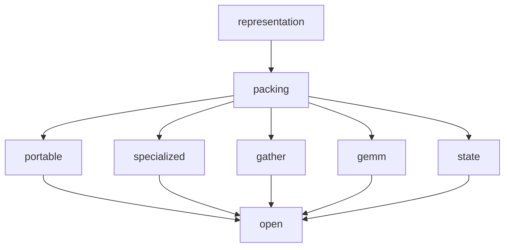

# Qwen3.8-27B runtime format design (TASK-09)

> **Draft status:** conclusions in this document are **unverified** until the verification stage completes.

Phase 1 **compiler-produced, consumer-oriented runtime model artifact**
requirements and capability space for Qwen3.8-27B language+MTP. Family
occupancy comes from
[`docs/architecture/model-inventory.md`](model-inventory.md) (TASK-01).
Logical producers/consumers and the logical-≠-physical rule come from
[`docs/architecture/dataflow.md`](dataflow.md) (TASK-03). Weight/state
traffic and access identities come from
[`docs/architecture/work-and-traffic.md`](work-and-traffic.md) (TASK-06).
Element formats, grouping, scales, outlier policies, 22 recipes, 16
policy families, and metadata **lower bounds** come from
[`docs/architecture/quantization-design-space.md`](quantization-design-space.md)
(TASK-08). Sitting `text_config` instantiates occupancy products.

This document specifies artifact **requirements and a capability space**,
not a selected file format, kernel, or layout. Prefill and decode share
**one** compiled artifact. Distinct **views** of the same logical tensor
are a `view_binding` capability, not a decode/prefill split (TASK-14).
The primary object is language+MTP checkpoint parameters after a TASK-08
recipe (role `param`). The secondary object is token-persistent **state
schema** for \(K,V,C,S\) (role `state`). Activations and accumulators are
not artifact payloads. Algebraic equivalents in TASK-02 are the same real
map; packing acts on stored elements. If an occupancy product would
disagree with TASK-01 / sitting `text_config`, or a cited weight/state
byte would disagree with TASK-06, or a recipe/family/metadata lower bound
would disagree with TASK-08, or a catalog/region id would disagree with
TASK-03, the earlier document wins and this one is wrong.

Claims are labelled OBSERVED (inventory/config occupancy), DERIVED
(packed-byte ceilings, header illustrations, occupancy products,
dual-view size products), or HYPOTHESIS (every portable-versus-specialized
tradeoff cell, every format-risk severity, every sequence rationale).
Vision-encoder internals are deferred and isolated in Deferred vision.
No new MEASURED payload statistics. No MEASURED quality or tok/s. The
ledger open question (portable versus backend-specialized artifact
boundaries and ideal consumer byte sequences) remains open.

## Authority

| Item | Value | Label |
| --- | --- | --- |
| Dossier | [`docs/architecture/tasks/TASK-09.md`](tasks/TASK-09.md) | — |
| Inventory | [`docs/architecture/model-inventory.md`](model-inventory.md) (TASK-01) | OBSERVED |
| Dataflow | [`docs/architecture/dataflow.md`](dataflow.md) (TASK-03 catalog / region IDs) | OBSERVED / DERIVED |
| Work/traffic | [`docs/architecture/work-and-traffic.md`](work-and-traffic.md) (TASK-06) | DERIVED occupancy / access |
| Quantization space | [`docs/architecture/quantization-design-space.md`](quantization-design-space.md) (TASK-08) | OBSERVED / DERIVED / HYPOTHESIS citations |
| Config | [`.cache/authorities/qwen3.8-27b-transformers/config.json`](../../.cache/authorities/qwen3.8-27b-transformers/config.json) `text_config` | OBSERVED |
| Checker | [`scripts/check_runtime_format_design.py`](../../scripts/check_runtime_format_design.py) | DERIVED |
| Evidence policy | [`docs/architecture/plan.md`](plan.md) (OBSERVED / DERIVED / HYPOTHESIS) | OBSERVED |
| In scope | Language+MTP compiled params + state schema + packing capabilities | — |
| Deferred | Vision encoder internals; TASK-15 tiles; TASK-10 compiler stages | — |
| Scope of this document | Artifact requirements and a capability space — not a selected file format, kernel, or layout | — |

Numeric ranks instantiate sitting `text_config` OBSERVED: `hidden_size`
5120, `intermediate_size` 17408, `vocab_size` 248320, 64 decoder layers,
48 linear + 16 full, `mtp_num_hidden_layers` 1, `dtype` `"bfloat16"`,
`mamba_ssm_dtype` `"float32"`. Language+MTP occupancy is 866 tensors /
27320697856 parameters / 54641395712 BF16 bytes (OBSERVED). Unique
non-embed weight bytes are 52098598912 (TASK-06). Embeddings and
`lm_head` are untied `(248320, 5120)`.

## Format convention

Logical values in this document are graph nodes. They do not imply physical allocation, materialization, buffer reuse, or kernel fusion.

Representation and packing capabilities in this document are a research space, not selected winners.

Portable versus backend-specialized artifact boundaries remain open absent compelling evidence.

Packed byte counts in this document are DERIVED illustrations, not selected consumer layouts.

Ideal consumer byte sequences remain an open question.

A capability is a named requirement the compiled artifact **must be able
to express**. Listing a capability does not choose an on-disk winner, a
scale-storage width, a specialized tile, or an ideal consumer byte
sequence.

- Eight representation capabilities and eight packing capabilities are complete for this task.
- Listing a capability, sequence, or artifact approach does not select it.
- Fan-out ≠ must-store still holds; a packed family is not a CUDA allocation.
- The ledger open question (portable versus backend-specialized boundaries and ideal consumer byte sequences) remains open.
- `models/Qwen3.8-27B-Q4_K_M.gguf` is not the runtime format and not a packing authority.
- The BF16 safetensors checkpoint is the source, not the compiled artifact.

GGUF is not the runtime format; it remains a future black-box Pareto
reference (TASK-18). Safetensors under
`.cache/authorities/qwen3.8-27b-transformers` is the source checkpoint,
not the runtime bytes. Do not inspect Quartz, llama.cpp, or GGUF byte
layouts to confirm packing. Payloads are not restreamed
(`payloads_restreamed` false).

## Artifact object model

Producer: future TASK-10 compiler (not specified here). Consumers:
TASK-13/14 schedules, TASK-15 layouts, TASK-17 kernels (not specified
here). Source: safetensors (not copied through as the runtime bytes).
JSON array `artifact_kinds` in this order; JSON `n_artifact_kinds` = 6.

| Kind | Meaning |
| --- | --- |
| `manifest` | Tensor directory: identity, TASK-08 family, recipe id, shape, access class, view list, integrity records. |
| `payload` | Packed element codes (or IEEE bytes for `keep_source` / `narrow_bf16` / `fp8_tensor`). |
| `metadata_blob` | Per-group scales and optional zero-points. |
| `sidecar` | `extract_high` sparse BF16 values plus indices; `mixed_group` width map. |
| `view` | One portable and/or one-or-more specialized projections of the same logical tensor. |
| `schema_state` | Ranks and conceptual dtypes for \(K,V,C,S\) allocation; not a cache layout. |

JSON booleans (lock): `activations_in_artifact` false,
`kernels_in_artifact` false, `tokenizer_in_artifact` false,
`gguf_is_not_the_runtime_format` true, `safetensors_is_source_not_runtime`
true, `embed_lm_head_tied` false, `decode_prefill_share_artifact` true,
`decode_prefill_distinct_views_selected` false,
`tile_layout_deferred_to_task15` true, `artifact_boundary_selected` false,
`ideal_byte_sequence_selected` false,
`state_payload_in_artifact_selected` false, `state_schema_required` true,
`learned_codebooks_required` false, `payloads_restreamed` false.

In the artifact: packed `param` payloads after a TASK-08 recipe, plus
required `schema_state` for \(K,V,C,S\). Out of the artifact: activation
working-dtype payloads, CUDA kernels, tokenizer tables, vision-encoder
internals, and TASK-15 physical tiles. Whether zero-filled state
**payloads** live in the artifact stays unselected; the **schema** is
required.

Shared binding: catalog consumers `e` and `e_next` share one `E` payload;
`logits_0` and `logits_1` share one `W_lm` payload (TASK-03 stadium
nodes, fan-out 2 each). Untied embed versus `lm_head` remains two
payloads. JSON `shared_weight_ids` = `["E","W_lm"]`. One compiled
artifact is shared by prefill and decode.

## Representation capabilities

JSON array `representation_capability_ids` in this exact order (8 ids).
JSON `n_representation_capabilities` = 8. Do not add a ninth
representation capability (`codebook`, `kernel`, `activation_payload`,
`gguf_type`). Learned vector-quant codebooks are not required. The 22
TASK-08 recipes are the **only** packable combinations this document must
support: `keep_source`, `narrow_bf16`, `fp8_tensor`, `i8_tensor`,
`i8_row`, `i8_row_asym`, `i8_g32`, `i6_row`, `i4_row`, `i4_col`,
`i4_g32`, `i4_g64`, `i4_g128`, `i4_g128_p99`, `i4_g128_rms`,
`i4_g128_extract`, `i4_g32_mixed`, `i4_row_extract`, `i4_clip`, `i3_g32`,
`i3_g32_extract`, `i2_g32_extract`. Families list subsets in TASK-08;
this document does not add recipes. JSON `keep_source_packable_on_all_defined_families`
true: every defined family except `vision_deferred` must be packable as
`keep_source` (BF16 LE elements, no scale) **and** as every recipe in
that family's TASK-08 `family_candidates`.

| id | Must express | Authority |
| --- | --- | --- |
| `tensor_identity` | Name, rank, TASK-08 policy family, recipe id, source level-2 id | TASK-01/08 |
| `element_encoding` | All eight TASK-08 formats: `source`, `bf16`, `fp8_e4m3`, `int8`, `int6`, `int4`, `int3`, `int2` | TASK-08 `formats` |
| `group_metadata` | Grouping `none` / `per_tensor` / `per_row` / `per_col` / `block_g32` / `block_g64` / `block_g128`; ragged last group; group-clips-to-axis; scales; optional zero-point | TASK-08 |
| `outlier_sidecar` | `extract_high` sparse BF16 + index; `clip` stores no extra elements | TASK-08 `outlier_ids` |
| `mixed_width_map` | Per-group wider/narrower integer width for `mixed_group` | TASK-08 |
| `shared_binding` | Single payload with multiple catalog consumers (`E`, `W_lm`) | TASK-03 |
| `access_class` | Consumer access class per family (table below) | TASK-03/06 |
| `state_schema` | \(K,V\) rank \((4,T,256)\) BF16 conceptual; \(C\) \(3\times 10240\) BF16; \(S\) \((48,128,128)\) F32 conceptual; 17 KV instances including MTP; 48 C/S instances | TASK-03/04/06 |

The first JSON fence contains parseable `logical_descriptors` for
`i8_row_asym`, `extract_high`, and `mixed_group`, plus `view_descriptor`.
Offsets and lengths are spans; ordering and tile references are nullable and
remain unselected. Alignment, view presence, and packed-code bit order remain
unselected. Complete-map MTP counts inherit TASK-02's conditional model.

JSON array `access_class_ids` in this order: `gather_row`, `dense_gemm`,
`depthwise_conv`, `vector_param`, `state_kv`, `state_c`, `state_s`. JSON
`n_access_classes` = 7. JSON object `family_access_class` maps each of
the 16 TASK-08 `policy_families` to one access class or `null` for
`vision_deferred`.

| family | `family_access_class` |
| --- | --- |
| `norm_gamma` | `vector_param` |
| `gdn_time_param` | `vector_param` |
| `gdn_gate_proj` | `dense_gemm` |
| `conv1d` | `depthwise_conv` |
| `linear_large_proj` | `dense_gemm` |
| `attn_qkv` | `dense_gemm` |
| `attn_out` | `dense_gemm` |
| `mlp_up_gate` | `dense_gemm` |
| `mlp_down` | `dense_gemm` |
| `embed_table` | `gather_row` |
| `lm_head` | `dense_gemm` |
| `mtp_fc` | `dense_gemm` |
| `vision_deferred` | `null` |
| `state_kv` | `state_kv` |
| `state_c` | `state_c` |
| `state_s` | `state_s` |

Embed gather is **not** a GEMM packing class (TASK-06: 0 MAC, 10240 B/row
BF16). `lm_head` **is** `dense_gemm` despite matching embed shape
`(248320, 5120)` (TASK-06 `vocab_memory`, unique 2542796800 B). Conv1d
uses TASK-05 squeezed rank-2 `(10240, 4)`. Region IDs that consume packed
weights or state: `embed`, `full_attn`, `linear_attn`, `mlp`,
`primary_logits`, `mtp`.

## Packing capabilities

JSON array `packing_capability_ids` in this exact order (8 ids). JSON
`n_packing_capabilities` = 8. Scale-storage/placement/align/bit-order
remain unselected. Illustration packing uses \(A=1\), \(s=2\), \(z=0\),
sidecar scales (`scale_storage_illustration_bytes` 2,
`alignment_illustration_grain` 1, `scale_placement_illustration`
`"sidecar_array"`), so **tight packed totals equal TASK-08 lower bounds**
for the named MLP / unique-non-embed / embed-gather illustrations. JSON
`packing_illustration_matches_task08_lower_bound` true. JSON
`payload_formula_uses_ceil` true. Portable view payloads are little-endian
(`portable_payload_little_endian` true); specialized views may swizzle
(TASK-15). JSON `outlier_sidecar_bytes_instantiated` false: sidecar
`extract_high` packed size is data-dependent
(\(n_{\text{out}}\times(2+\text{index bytes})\)); TASK-05 fractions
shaped TASK-08 candidates, not packed layouts.

| id | Must express | Selected here? |
| --- | --- | --- |
| `bit_pack` | Integer codes packed into bytes at the group grain (tensor grain if `per_tensor` / IEEE-like). Formula below. | No winner among `code_bit_order_candidates` `["lsb_first","msb_first"]` |
| `scale_storage` | Scale (and zp) widths from TASK-08 `scale_storage_bytes_candidates` `[2, 4]` | No (2 vs 4 open) |
| `scale_placement` | `sidecar_array` versus `interleaved_group` | No |
| `alignment_pad` | Payload padded to a grain in `alignment_grain_candidates` `[1, 16, 32, 128, 256]` | No |
| `endian_le` | Portable view payloads are little-endian bytes (source BF16 and TASK-05 decode are LE). Specialized views may swizzle (TASK-15). | Portable LE is a **requirement** for the portable view only, not a specialized-layout winner |
| `row_addressable` | A consumer can address one embed row without unpacking the whole table | Capability required; stride/pad open |
| `integrity_record` | Per-payload checksum/version slots in the manifest | Algorithm open (`integrity_algorithm_candidates` `["none","checksum"]`) |
| `view_binding` | Same logical tensor may have a portable view and zero or more specialized views | Which views exist is open |

Packed payload at integer bit-width \(b\) on \(n\) elements:

\[
B_{\text{payload,pack}}=\Bigl\lceil\frac{n\,b}{8}\Bigr\rceil.
\]

Group grain: for grouping size \(g\), pack each group with
\(\lceil g_{\text{eff}} b/8\rceil\) then concatenate; last group may be
ragged (`ragged_last_group` true, inherited from TASK-08). IEEE-like:
\(B_{\text{payload,pack}}=n\times\) element bytes (`bytes_bf16` = 2,
`bytes_f32` = 4, `bytes_fp8` = 1).

Align:

\[
B_{\text{aligned}}=\Bigl\lceil B_{\text{payload,pack}}/A\Bigr\rceil A.
\]

Metadata lower bound unchanged from TASK-08: \(n_g=\lceil n/g\rceil\),
\(B_{\text{meta}}=n_g(s+z)\).

**Grain identities** (DERIVED):

| JSON key | Value | Meaning |
| --- | ---: | --- |
| `int3_g32_group_payload_bytes` | 12 | \(32\times 3/8=12\) exact; TASK-08 `d_3bit_pack` layout grain |
| `int2_g32_group_payload_bytes` | 8 | \(32\times 2/8=8\) |
| `int6_row_hidden_payload_bytes` | 3840 | \(5120\times 6/8=3840\) one hidden-width row |
| `int4_row_hidden_payload_bytes` | 2560 | \(5120\times 4/8=2560\) |
| `embed_gather_int4_row_bytes` | 2562 | 2560 + one 2-byte scale (TASK-08 illustration C) |
| `embed_gather_bf16_bytes` | 10240 | TASK-06 gather row |

**Illustration A — language MLP** (same as TASK-08, now labelled
packed-tight; DERIVED): \(n=17112760320\), int4, \(s=2\), \(A=1\),
\(B_{\text{bf16}}=34225520640\). Payload \(B_{\text{payload,pack}}=8556380160\).

| \(g\) | \(B_{\text{payload,pack}}\) | \(B_{\text{meta}}\) | \(B\) | \(B/B_{\text{bf16}}\) |
| ---: | ---: | ---: | ---: | ---: |
| 32 | 8556380160 | 1069547520 | 9625927680 | 0.28125 |
| 128 | 8556380160 | 267386880 | 8823767040 | 0.2578125 |

JSON keys match TASK-08: `mlp_n`, `mlp_bf16_bytes`,
`mlp_int4_payload_bytes`, `mlp_int4_g32_total_bytes`,
`mlp_int4_g32_over_bf16`, `mlp_int4_g128_total_bytes`,
`mlp_int4_g128_over_bf16`.

**Illustration B — unique non-embed language+MTP** (DERIVED, not a
selected profile): \(n=26049299456\), \(B_{\text{bf16}}=52098598912\),
int4 \(g=128\) \(s=2\) \(A=1\): \(B=13431670032\), ratio \(0.2578125\).
JSON keys `unique_non_embed_n`, `unique_non_embed_bf16_bytes`,
`unique_non_embed_int4_g128_total_bytes`,
`unique_non_embed_int4_g128_over_bf16`.

**Illustration C — embed gather:** as TASK-08 / table above. Access class
`gather_row` requires `row_addressable` packing so decode need not stream
2542796800 B.

**Illustration D — \(S\):** conceptual F32 150994944 B/step; BF16 store
75497472 B; FP8 37748736 B. JSON `s_f32_bytes`, `s_bf16_bytes`,
`s_fp8_bytes`. Schema required; payload-in-artifact unselected. Related
TASK-06 `state_memory` identity; KV 69632 B/token across 17 instances;
\(C\) 2949120 B across 48 instances.

**Illustration E — manifest header overhead:** 64 bytes/tensor × 866
language+MTP tensors = 55424 B. JSON `n_language_mtp_tensors` 866,
`container_header_illustration_bytes_per_tensor` 64,
`container_header_illustration_total_bytes` 55424. 64 is an illustration
constant, not a selected header size.

**Illustration F — dual-view store amplification:** two copies of
illustration B = \(2\times 13431670032=26863340064\) B, still below BF16
unique-non-embed 52098598912. JSON
`dual_view_int4_g128_unique_non_embed_bytes` 26863340064. DERIVED size
only; **not** a recommendation to store two views.

## Consumer access and byte sequences

JSON array `consumer_sequence_ids` in this exact order (7 ids). JSON
`n_consumer_sequences` = 7. Parallel `consumer_sequence_access_classes`.
None is selected as ideal. JSON `ideal_byte_sequence_selected` false.
Do not rank sequences by wall time. Do not name CUDA kernels. A packing
that is convenient for `seq_gemm_interleaved_group` may break
`seq_gather_row` (HYPOTHESIS `f_gather_stride`). `seq_specialized_tile`
is a **view** sequence, not a new access class; the last parallel access
class remains `dense_gemm` meaning “specialized view of a dense family”.

| id | Access | Sequence (capability, not a winner) |
| --- | --- | --- |
| `seq_gemm_codes_then_scales` | `dense_gemm` | Read packed codes for a contraction, then sidecar scales (TASK-06 \(I=1\) MLP/`lm_head` vs weights) |
| `seq_gemm_interleaved_group` | `dense_gemm` | For each group: scale then codes |
| `seq_gather_row` | `gather_row` | One vocab row of codes + one scale (10240 B BF16 or 2562 B int4-row illustration) |
| `seq_lm_head_full` | `dense_gemm` | Entire `lm_head` unique 2542796800 B-class table every decode (TASK-06 `vocab_memory`; TASK-08 `d_lm_head_unpack`) |
| `seq_outlier_extra` | any `extract_high` | Additional irregular BF16 sidecar gathers (TASK-08 `d_outlier_gather`) |
| `seq_state_s_dense` | `state_s` | Dense \(S\) 150994944 B/step conceptual F32 (TASK-06 `state_memory`) |
| `seq_specialized_tile` | specialized view | Backend tile/swizzle order; **layout is TASK-15**; named only as a sequence the format must be able to store |

## Portable versus backend-specific artifacts

JSON array `artifact_approach_ids` in this exact order (4 ids). JSON
`n_artifact_approaches` = 4. JSON `artifact_boundary_selected` false.
JSON array `comparison_dimension_ids` in this order (6 ids). JSON
`n_comparison_dimensions` = 6. Every portable/specialized tradeoff cell
is HYPOTHESIS except illustration-F size, which is DERIVED. Do not treat
GGUF as `portable_only`. Safetensors is source, not an approach id.

| id | Meaning |
| --- | --- |
| `portable_only` | One backend-neutral packed view per logical tensor; a backend unpacks or converts at load or in-kernel |
| `backend_specialized_only` | Only a backend-specific packed view; recompile/repack per backend |
| `portable_plus_specialized_views` | Portable view plus optional specialized views in the same artifact (`view_binding`) |
| `manifest_plus_backend_blobs` | Portable manifest; payloads may be backend blobs referenced by the manifest without duplicating a portable payload |

| id | Portable-only (HYPOTHESIS) | Specialized-only (HYPOTHESIS) | Dual-view / manifest+blobs (HYPOTHESIS except size DERIVED) |
| --- | --- | --- | --- |
| `compile_once` | One compiler emission serves every backend after convert | Emission is per backend | Manifest once; blobs may be per backend |
| `load_convert` | May pay unpack/convert (pairs with TASK-08 `d_weight_dequant`) | Map/load may skip convert | Convert only if the needed view is absent |
| `byte_sequence` | Codes+meta in a backend-neutral order | Tile/swizzle/MMA-ready (TASK-15 fills) | Both sequences may coexist |
| `tile_freedom` | TASK-15 layouts applied at load or by a view builder | Layout baked into payload | Specialized view bakes a layout; portable view does not |
| `store_amplification` | One copy | One copy per backend | Illustration F DERIVED 26863340064 B if two full int4-g128 unique-non-embed copies |
| `consumer_portability` | Any consumer that understands the portable view | One kernel/layout family | Portable consumers ignore specialized blobs |

## Open decisions

JSON array `open_decision_ids` in this exact order (8 ids). JSON
`n_open_decisions` = 8. JSON object `open_decision_selected` maps each
id to `false`. JSON `n_open_decisions_selected` = 0. JSON
`pareto_frontier_selected` false (TASK-08/18). JSON
`compiler_profile_selected` false (TASK-10).

| id | What stays unselected | Owner of a future close |
| --- | --- | --- |
| `artifact_boundary` | Which of the four `artifact_approach_ids` | This ledger open question; not TASK-18 quality |
| `ideal_byte_sequence` | Which of the seven `consumer_sequence_ids` | This ledger open question; TASK-13/14/15 may inform |
| `scale_storage_bytes` | 2 vs 4 | Packing; TASK-08 left it here |
| `scale_placement` | sidecar vs interleaved | Packing |
| `alignment_grain` | 1 / 16 / 32 / 128 / 256 | Packing; TASK-15 may constrain specialized views |
| `code_bit_order` | `lsb_first` vs `msb_first` | Packing |
| `integrity_algorithm` | `none` vs `checksum` (and which checksum) | TASK-10 integrity stage |
| `state_payload_inclusion` | Schema-only vs storing zero templates | TASK-04/13; schema remains required |

Format-risk hypotheses (every severity is HYPOTHESIS). JSON array
`format_risk_ids` in this exact order (6 ids). JSON `n_format_risks` = 6.
JSON `format_high_ids`: `f_unpack_portable`. `format_medium_ids`:
`f_repack_specialized`, `f_gather_stride`, `f_3bit_shift`,
`f_outlier_index`. `format_low_ids`: `f_dual_view_size`. JSON
`n_format_high` = 1, `n_format_medium` = 4, `n_format_low` = 1. Do not
rank these by wall time. Do not convert TASK-06 bottleneck labels into
measurements. Cite TASK-08 decode-risk ids as **related**, not as closed
packing winners.

| ID | Ties to | Severity | Claim (must remain HYPOTHESIS) |
| --- | --- | --- | --- |
| `f_unpack_portable` | `portable_only`, TASK-08 `d_weight_dequant` | high (HYPOTHESIS) | A portable-only artifact may add unpack/convert work on decode GEMMs |
| `f_repack_specialized` | `backend_specialized_only` | medium (HYPOTHESIS) | Specialized-only forces a new packed artifact per backend |
| `f_dual_view_size` | Illustration F | low (HYPOTHESIS) | Storing portable+specialized copies amplifies store (size is DERIVED; **impact** is HYPOTHESIS) |
| `f_gather_stride` | `row_addressable` vs GEMM sequences | medium (HYPOTHESIS) | A GEMM-friendly pack may make embed-row gather non-contiguous |
| `f_3bit_shift` | TASK-08 `d_3bit_pack`, grain 12 B | medium (HYPOTHESIS) | int3/int6 still need shift/mask even when the g32 grain is an integer number of bytes |
| `f_outlier_index` | `outlier_sidecar` | medium (HYPOTHESIS) | Sparse sidecar indices are irregular extra traffic (pairs with `d_outlier_gather`) |

Diagram 1 of 1: representation and packing capabilities feed portable
and specialized views plus gather / gemm / state consumer sequences;
those surfaces feed the still-open ledger decisions. JSON `n_diagrams`
is 1. `diagram_ids` is
`["representation","packing","portable","specialized","gather","gemm","state","open"]`.



## Deferred vision

Visual tokens may replace placeholders in the residual stream
(`out_hidden_size` 5120 OBSERVED). Encoder / patch embed / merger packing
is **UNKNOWN**. `vision_deferred` has `family_access_class` null and no
packing recipes. Do not add vision payloads.

## Machine-checkable summary JSON

Live object from `text_config` arithmetic plus locked constants (copied
from
[`scripts/check_runtime_format_design.py --json`](../../scripts/check_runtime_format_design.py)):

```json
{
  "authority": ".cache/authorities/qwen3.8-27b-transformers",
  "hidden_size": 5120,
  "intermediate_size": 17408,
  "vocab_size": 248320,
  "n_decoder_layers": 64,
  "n_linear_layers": 48,
  "n_full_layers": 16,
  "n_mtp_blocks": 1,
  "full_attention_indices": [
    3,
    7,
    11,
    15,
    19,
    23,
    27,
    31,
    35,
    39,
    43,
    47,
    51,
    55,
    59,
    63
  ],
  "bytes_bf16": 2,
  "bytes_f32": 4,
  "bytes_fp8": 1,
  "n_language_mtp_tensors": 866,
  "n_language_mtp_parameters": 27320697856,
  "mlp_n": 17112760320,
  "embed_n": 1271398400,
  "mlp_bf16_bytes": 34225520640,
  "mlp_int4_payload_bytes": 8556380160,
  "mlp_int4_g32_meta_bytes": 1069547520,
  "mlp_int4_g32_total_bytes": 9625927680,
  "mlp_int4_g32_over_bf16": 0.28125,
  "mlp_int4_g128_meta_bytes": 267386880,
  "mlp_int4_g128_total_bytes": 8823767040,
  "mlp_int4_g128_over_bf16": 0.2578125,
  "weight_bytes_language_mlp": 34225520640,
  "weight_bytes_lm_head": 2542796800,
  "weight_bytes_embed_table": 2542796800,
  "weight_bytes_language_linear_attn": 11124102144,
  "weight_bytes_language_self_attn": 3355459584,
  "weight_bytes_language_mtp_excl_vision": 54641395712,
  "weight_bytes_unique_non_embed": 52098598912,
  "unique_non_embed_n": 26049299456,
  "unique_non_embed_bf16_bytes": 52098598912,
  "unique_non_embed_int4_g128_total_bytes": 13431670032,
  "unique_non_embed_int4_g128_over_bf16": 0.2578125,
  "embed_gather_bf16_bytes": 10240,
  "embed_gather_int4_row_bytes": 2562,
  "int4_row_hidden_payload_bytes": 2560,
  "int6_row_hidden_payload_bytes": 3840,
  "int3_g32_group_payload_bytes": 12,
  "int2_g32_group_payload_bytes": 8,
  "s_f32_bytes": 150994944,
  "s_bf16_bytes": 75497472,
  "s_fp8_bytes": 37748736,
  "kv_bytes_all_per_token": 69632,
  "c_bytes_all": 2949120,
  "scale_storage_illustration_bytes": 2,
  "scale_storage_bytes_candidates": [
    2,
    4
  ],
  "alignment_illustration_grain": 1,
  "alignment_grain_candidates": [
    1,
    16,
    32,
    128,
    256
  ],
  "scale_placement_illustration": "sidecar_array",
  "scale_placement_candidates": [
    "sidecar_array",
    "interleaved_group"
  ],
  "code_bit_order_candidates": [
    "lsb_first",
    "msb_first"
  ],
  "integrity_algorithm_candidates": [
    "none",
    "checksum"
  ],
  "container_header_illustration_bytes_per_tensor": 64,
  "container_header_illustration_total_bytes": 55424,
  "dual_view_int4_g128_unique_non_embed_bytes": 26863340064,
  "ragged_last_group": true,
  "group_clips_to_axis": true,
  "payload_formula_uses_ceil": true,
  "packing_illustration_matches_task08_lower_bound": true,
  "portable_payload_little_endian": true,
  "outlier_sidecar_bytes_instantiated": false,
  "artifact_kinds": [
    "manifest",
    "payload",
    "metadata_blob",
    "sidecar",
    "view",
    "schema_state"
  ],
  "n_artifact_kinds": 6,
  "representation_capability_ids": [
    "tensor_identity",
    "element_encoding",
    "group_metadata",
    "outlier_sidecar",
    "mixed_width_map",
    "shared_binding",
    "access_class",
    "state_schema"
  ],
  "n_representation_capabilities": 8,
  "logical_descriptors": {
    "i8_row_asym": {
      "zero_point_encoding": "signed_int8",
      "count": "d_out",
      "range": [
        -128,
        127
      ],
      "binding": "logical_output_row_ordinal",
      "storage": "metadata_blob_span",
      "scale_field": "separate_per_row"
    },
    "extract_high": {
      "count": "explicit",
      "value_encoding": "bf16_le",
      "index_encoding_candidates": [
        "flat_u32",
        "flat_u64"
      ],
      "selected_index_encoding_per_view": true,
      "binding": "logical_flat_index",
      "index_range": "0 <= index < numel",
      "value_span": "sidecar_payload_span",
      "index_span": "sidecar_index_span"
    },
    "mixed_group": {
      "width_code_encoding": "u8",
      "count": "group_count",
      "binding": "logical_group_ordinal",
      "allowed_values": "recipe_narrow_and_wide_formats",
      "storage": "sidecar_span"
    }
  },
  "view_descriptor": {
    "logical_tensor_id": "required",
    "view_id": "required",
    "view_role": "required",
    "backend_tag": "required",
    "payload_span": [
      "offset",
      "length"
    ],
    "metadata_span": [
      "offset",
      "length"
    ],
    "sidecar_span": [
      "offset",
      "length"
    ],
    "access_consumer_binding": "required",
    "ordering_ref": null,
    "tile_ref": null,
    "integrity_ref": "required"
  },
  "packing_capability_ids": [
    "bit_pack",
    "scale_storage",
    "scale_placement",
    "alignment_pad",
    "endian_le",
    "row_addressable",
    "integrity_record",
    "view_binding"
  ],
  "n_packing_capabilities": 8,
  "access_class_ids": [
    "gather_row",
    "dense_gemm",
    "depthwise_conv",
    "vector_param",
    "state_kv",
    "state_c",
    "state_s"
  ],
  "n_access_classes": 7,
  "policy_families": [
    "norm_gamma",
    "gdn_time_param",
    "gdn_gate_proj",
    "conv1d",
    "linear_large_proj",
    "attn_qkv",
    "attn_out",
    "mlp_up_gate",
    "mlp_down",
    "embed_table",
    "lm_head",
    "mtp_fc",
    "vision_deferred",
    "state_kv",
    "state_c",
    "state_s"
  ],
  "family_access_class": {
    "norm_gamma": "vector_param",
    "gdn_time_param": "vector_param",
    "gdn_gate_proj": "dense_gemm",
    "conv1d": "depthwise_conv",
    "linear_large_proj": "dense_gemm",
    "attn_qkv": "dense_gemm",
    "attn_out": "dense_gemm",
    "mlp_up_gate": "dense_gemm",
    "mlp_down": "dense_gemm",
    "embed_table": "gather_row",
    "lm_head": "dense_gemm",
    "mtp_fc": "dense_gemm",
    "vision_deferred": null,
    "state_kv": "state_kv",
    "state_c": "state_c",
    "state_s": "state_s"
  },
  "family_access_class_values": [
    "vector_param",
    "vector_param",
    "dense_gemm",
    "depthwise_conv",
    "dense_gemm",
    "dense_gemm",
    "dense_gemm",
    "dense_gemm",
    "dense_gemm",
    "gather_row",
    "dense_gemm",
    "dense_gemm",
    null,
    "state_kv",
    "state_c",
    "state_s"
  ],
  "candidate_recipe_ids": [
    "keep_source",
    "narrow_bf16",
    "fp8_tensor",
    "i8_tensor",
    "i8_row",
    "i8_row_asym",
    "i8_g32",
    "i6_row",
    "i4_row",
    "i4_col",
    "i4_g32",
    "i4_g64",
    "i4_g128",
    "i4_g128_p99",
    "i4_g128_rms",
    "i4_g128_extract",
    "i4_g32_mixed",
    "i4_row_extract",
    "i4_clip",
    "i3_g32",
    "i3_g32_extract",
    "i2_g32_extract"
  ],
  "n_candidate_recipes": 22,
  "keep_source_packable_on_all_defined_families": true,
  "shared_weight_ids": [
    "E",
    "W_lm"
  ],
  "consumer_sequence_ids": [
    "seq_gemm_codes_then_scales",
    "seq_gemm_interleaved_group",
    "seq_gather_row",
    "seq_lm_head_full",
    "seq_outlier_extra",
    "seq_state_s_dense",
    "seq_specialized_tile"
  ],
  "consumer_sequence_access_classes": [
    "dense_gemm",
    "dense_gemm",
    "gather_row",
    "dense_gemm",
    "dense_gemm",
    "state_s",
    "dense_gemm"
  ],
  "n_consumer_sequences": 7,
  "artifact_approach_ids": [
    "portable_only",
    "backend_specialized_only",
    "portable_plus_specialized_views",
    "manifest_plus_backend_blobs"
  ],
  "n_artifact_approaches": 4,
  "comparison_dimension_ids": [
    "compile_once",
    "load_convert",
    "byte_sequence",
    "tile_freedom",
    "store_amplification",
    "consumer_portability"
  ],
  "n_comparison_dimensions": 6,
  "open_decision_ids": [
    "artifact_boundary",
    "ideal_byte_sequence",
    "scale_storage_bytes",
    "scale_placement",
    "alignment_grain",
    "code_bit_order",
    "integrity_algorithm",
    "state_payload_inclusion"
  ],
  "open_decision_selected": {
    "artifact_boundary": false,
    "ideal_byte_sequence": false,
    "scale_storage_bytes": false,
    "scale_placement": false,
    "alignment_grain": false,
    "code_bit_order": false,
    "integrity_algorithm": false,
    "state_payload_inclusion": false
  },
  "n_open_decisions": 8,
  "n_open_decisions_selected": 0,
  "format_risk_ids": [
    "f_unpack_portable",
    "f_repack_specialized",
    "f_dual_view_size",
    "f_gather_stride",
    "f_3bit_shift",
    "f_outlier_index"
  ],
  "format_risk_severities": [
    "high",
    "medium",
    "low",
    "medium",
    "medium",
    "medium"
  ],
  "format_high_ids": [
    "f_unpack_portable"
  ],
  "format_medium_ids": [
    "f_repack_specialized",
    "f_gather_stride",
    "f_3bit_shift",
    "f_outlier_index"
  ],
  "format_low_ids": [
    "f_dual_view_size"
  ],
  "n_format_risks": 6,
  "n_format_high": 1,
  "n_format_medium": 4,
  "n_format_low": 1,
  "activations_in_artifact": false,
  "kernels_in_artifact": false,
  "tokenizer_in_artifact": false,
  "gguf_is_not_the_runtime_format": true,
  "safetensors_is_source_not_runtime": true,
  "embed_lm_head_tied": false,
  "decode_prefill_share_artifact": true,
  "decode_prefill_distinct_views_selected": false,
  "tile_layout_deferred_to_task15": true,
  "artifact_boundary_selected": false,
  "ideal_byte_sequence_selected": false,
  "state_payload_in_artifact_selected": false,
  "state_schema_required": true,
  "learned_codebooks_required": false,
  "compiler_profile_selected": false,
  "pareto_frontier_selected": false,
  "payloads_restreamed": false,
  "diagram_ids": [
    "representation",
    "packing",
    "portable",
    "specialized",
    "gather",
    "gemm",
    "state",
    "open"
  ],
  "n_diagrams": 1,
  "canonical_sentence_logical": "Logical values in this document are graph nodes. They do not imply physical allocation, materialization, buffer reuse, or kernel fusion.",
  "canonical_sentence_capabilities": "Representation and packing capabilities in this document are a research space, not selected winners.",
  "canonical_sentence_portable": "Portable versus backend-specialized artifact boundaries remain open absent compelling evidence.",
  "canonical_sentence_packed": "Packed byte counts in this document are DERIVED illustrations, not selected consumer layouts.",
  "canonical_sentence_sequences": "Ideal consumer byte sequences remain an open question."
}
```
