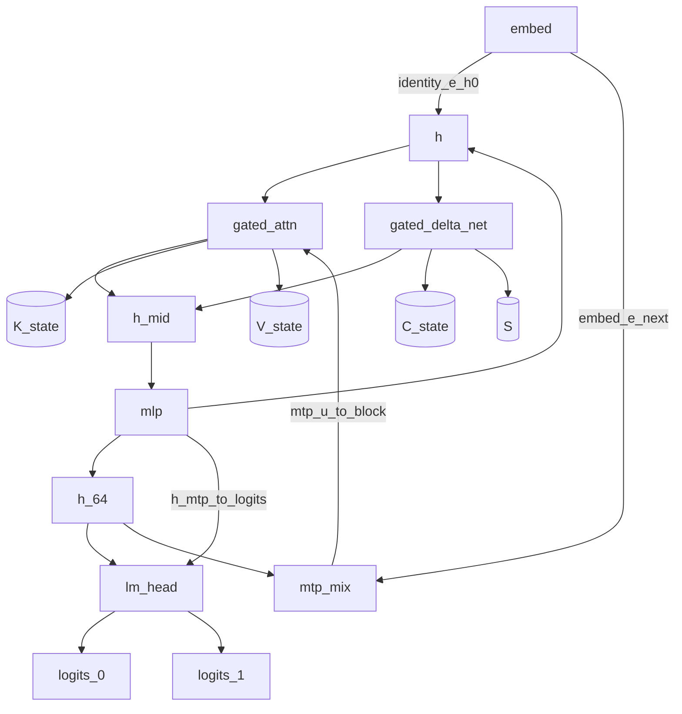

# Qwen3.8-27B semantic graph (TASK-11)

All MTP-only graph counts are conditional on TASK-02's unverified analysis model.

> **Draft status:** conclusions in this document are **unverified** until the verification stage completes.

Phase 1 **hardware-independent** Qwen-specific semantic graph: execution-region
contracts for language + MTP. Equations, ranks, and algebraic equivalents come
from [`docs/architecture/model-semantics.md`](model-semantics.md) (TASK-02).
Catalog IDs, fan-out, live-across, and model-region names come from
[`docs/architecture/dataflow.md`](dataflow.md) (TASK-03). Lifetime classes,
must-survive boundaries, and $K,V,C,S$ bytes come from
[`docs/architecture/lifetime-and-state.md`](lifetime-and-state.md) (TASK-04).
Region MAC and traffic identities are **cited** from
[`docs/architecture/work-and-traffic.md`](work-and-traffic.md) (TASK-06), not
recopied as a new work study. Sensitive-op ids and precision roles are **cited**
from [`docs/architecture/numerical-sensitivity.md`](numerical-sensitivity.md)
(TASK-07), not re-ranked.

This document specifies hardware-independent execution contracts, not kernels.
Prefill and decode share one semantic graph. Only $T$ (stored KV length after
append) and whether incoming $(K,V,C,S)$ is zeros versus populated change.
Primary instance counts include MTP. If a node I/O, state kind, catalog ID,
layer count, or cited MAC/byte would disagree with TASK-02/03/04/06/07 or
sitting `text_config`, the earlier document / config wins and this one is wrong.

Claims are labelled OBSERVED (config/inventory already established), DERIVED
(node cuts, I/O, instance counts, catalog partition, MAC citations from ranks),
or HYPOTHESIS (every fusion/split usefulness, every TASK-06 bottleneck class
restated as a citation). No MEASURED tok/s or NLL. No fusion, schedule, layout,
or CUDA mapping is chosen here.

## Authority

| Item | Value | Label |
| --- | --- | --- |
| Dossier | [`docs/architecture/tasks/TASK-11.md`](tasks/TASK-11.md) | — |
| Semantics | [`docs/architecture/model-semantics.md`](model-semantics.md) (TASK-02) | OBSERVED / DERIVED |
| Dataflow | [`docs/architecture/dataflow.md`](dataflow.md) (TASK-03) | OBSERVED / DERIVED |
| Lifetime | [`docs/architecture/lifetime-and-state.md`](lifetime-and-state.md) (TASK-04) | OBSERVED / DERIVED |
| Work/traffic | [`docs/architecture/work-and-traffic.md`](work-and-traffic.md) (TASK-06) | citation of MAC/byte identities |
| Numerical sensitivity | [`docs/architecture/numerical-sensitivity.md`](numerical-sensitivity.md) (TASK-07) | citation of sensitive-op ids |
| Inventory | [`docs/architecture/model-inventory.md`](model-inventory.md) (TASK-01) | OBSERVED |
| Config | [`.cache/authorities/qwen3.8-27b-transformers/config.json`](../../.cache/authorities/qwen3.8-27b-transformers/config.json) `text_config` | OBSERVED |
| Checker | [`scripts/check_semantic_graph.py`](../../scripts/check_semantic_graph.py) | DERIVED |
| Evidence policy | [`docs/architecture/plan.md`](plan.md) (OBSERVED / DERIVED / HYPOTHESIS) | OBSERVED |
| In scope | Language + MTP semantic contracts (six node types, 14 sync edges) | — |
| Deferred | Vision encoder internals; TASK-12 fusion winners; TASK-13/14 schedules; TASK-17 CUDA | — |
| Scope of this document | Hardware-independent execution contracts — not kernels | — |

Numeric ranks instantiate sitting `text_config` OBSERVED: `hidden_size` 5120,
`intermediate_size` 17408, `vocab_size` 248320, 64 decoder layers, 48 linear +
16 full at $\ell \bmod 4 = 3$, `mtp_num_hidden_layers` 1, `head_dim` 256,
`num_attention_heads` 24, `num_key_value_heads` 4, linear widths
$d_\text{qkv}=10240$, `linear_key_head_dim` / `linear_value_head_dim` 128,
`dtype` `"bfloat16"`, `mamba_ssm_dtype` `"float32"`. Node cuts, instance counts,
and catalog partition are DERIVED. Fusion/split usefulness and bottleneck
**class** labels remain HYPOTHESIS.

Quartz and llama.cpp inspection are deferred until freeze. GGUF does not
constrain these contracts.

## Semantic contract convention

Logical values in this document are graph nodes. They do not imply physical allocation, materialization, buffer reuse, or kernel fusion.

Semantic nodes in this document are hardware-independent execution contracts, not kernels, CUDA graphs, or framework modules.

Internal values and flexible splits are TASK-12 materialization and fusion candidates; listing them is not a fusion or schedule decision.

Natural node boundaries follow mixer kind and state, residual-add I/O, embed gather, vocabulary projection, and MTP mix; internal values stay inside nodes; synchronization edges are the declared node I/O, state, and shared weights.

- Six semantic node types are complete for this task: `embed`, `gated_attn`, `gated_delta_net`, `mlp`, `lm_head`, `mtp_mix`.
- A node is a named execution contract: operations (equation tags), I/O (catalog IDs), state read/write, internal catalog IDs, and flexibilities.
- Prefill and decode share one graph; `decode_prefill_share_graph` true.
- Residual add of Mix lives **inside** mixer nodes; residual add of MLP lives **inside** `mlp`. Inputs `h` / `h_mid` must remain mathematically available until that add (`residual_input_live_until_add` true).
- Residual-stream RMSNorm `(2)` lives **inside** the consuming node. The two RMSNorm roles and GatedRMSNorm `(3)` must not be collapsed (`rms_inside_consumer` true, `rms_roles_not_collapsed` true).
- Live-across `g` and `z` are **internal** to `gated_attn` and `gated_delta_net` (`live_across_are_internal` true). They become hypothesized sync edges only if TASK-12 splits the node.
- Fan-out ≠ must-store and node I/O ≠ must-store still hold.
- Primary graph includes MTP. Hardware mapping is TASK-17. Fusion winners are TASK-12.

## Boundary derivation

Cuts are **DERIVED** from prior evidence, not from framework modules or CUDA
kernels. Apply these rules in this order. JSON `boundary_rule_ids` in this
exact order (6 ids). JSON `n_boundary_rules` = 6. JSON
`framework_primitives_rejected` true. This heading **closes** the ledger open
question (natural boundaries, internal values, and synchronization /
materialization edges) by DERIVED cuts, not by picking a fusion.

| id | Cut | Evidence | Why it is a node type |
| --- | --- | --- | --- |
| `cut_mixer_kind` | Gated Attention vs Gated DeltaNet | TASK-02 `(6)`–`(12)` vs `(13)`–`(20)`; state KV vs $C,S$; TASK-06 $A T$ vs $T$-free GDN; TASK-07 softmax/RoPE/KV vs recurrent $S$ | Different equations, state, work class, and precision risks. One “attention” node would hide Qwen’s hybrid contract. |
| `cut_mixer_mlp` | Mixer vs MLP | TASK-02 `(4)` vs `(5)`; TASK-04 `h_mid` residual-add; TASK-06 distinct MAC | `h_mid` must survive between Mix add and MLP add. Different work (attn/GDN vs SwiGLU). |
| `cut_embed_gather` | Embed vs contractions | TASK-02 `(1)`; TASK-06 0 MAC gather 10240 B | Gather is not a GEMM. Distinct traffic class. |
| `cut_vocab` | `lm_head` vs hidden GEMMs | TASK-02 `(22)` `(24)`; TASK-06 `1271398400` MAC and `vocab_memory` | Vocabulary projection is a distinct contraction and traffic outlier. |
| `cut_mtp_mix` | MTP concat+`fc` vs a decoder layer | TASK-02 `(23)`; TASK-03 `h_64` fan-out | Mix of `e_next` and `h_64` is not mixer or MLP. |
| `cut_not_module` | Do **not** cut on RMS modules, `nn.Linear`, qkv/core/out kernels, or per-catalog-ID | TASK-03 live-across `g`/`z`; TASK-02 two RMS roles; plan.md anti-anchoring | Framework primitives and CUDA-shaped splits are not semantic evidence. |

**Not node types** (explicit): Hugging Face / paper class names, GGML ops, CUDA
kernels, GEMM/softmax/RMS as generic ops; one node per catalog ID (that is the
TASK-03 DAG); one node per decoder layer wrapping mixer+MLP (would hide
`h_mid`); required split of `gated_attn` into proj / core / `o_proj` (would
promote live-across `g` to a required sync edge without TASK-12 evidence);
required split of `gated_delta_net` into conv / recurrence / `out_proj` (would
promote `z` / `qkv` the same way); residual-add as its own type (the add is the
TASK-04 boundary **inside** mixer/`mlp`; I/O already exposes `h` / `h_mid`);
`vision_if` (deferred; not a node).

Closing the open question:

- **Natural boundaries** = the six types from the six rules.
- **Internal values** = the 38 ephemeral/live-across catalog IDs owned inside nodes (including `g`, `z`, `mix_full`, `mix_lin`, `mlp_out`, RMS outputs `h_tilde`/`h_post`/`h_final`).
- **Synchronization/materialization edges** = the 14 declared inter-node edges (residual stream, MTP fan-out, outputs, token state, shared weights). Intra-node live-across is **not** an inter-node edge until a TASK-12 split.

Closing the question does **not** select fusion, materialization, or a schedule.
JSON `ledger_open_question_boundaries_closed` true.

## Node types

JSON array `node_type_ids` in this exact order (6 ids). JSON `n_node_types` = 6.
Complete primary = language + MTP: 135 instances. Language-only: 130.
`primary_includes_mtp` true. Omitting MTP when only $\ell^{(0)}$ is required
is a TASK-02 algebraic equivalent (`mtp_omission_is_algebraic_equivalent`
true), not a second graph and not the primary contract.

| id | Multiplicity (complete) | Eqs | Consumes | Produces | State |
| --- | ---: | --- | --- | --- | --- |
| `embed` | 2 | `(1)` | `token_id` | `e` or `e_next` | none |
| `gated_attn` | 17 | `(2)` in-RMS, `(4)` Mix+add, `(6)`–`(12)` | `h` (MTP: `mtp_u` as `h`) | `h_mid` | `K_state`, `V_state` RW |
| `gated_delta_net` | 48 | `(2)` in-RMS, `(4)` Mix+add, `(3)`, `(13)`–`(20)` | `h` | `h_mid` | `C_state`, `S` RW |
| `mlp` | 65 | `(2)` post-RMS, `(5)` add, `(21)` | `h_mid` | next `h` / `h_64` / `h_mtp` | none |
| `lm_head` | 2 | `(2)` final or `mtp.norm`, `(22)` or `(24)` | `h_64` or `h_mtp` | `logits_0` or `logits_1` | none |
| `mtp_mix` | 1 | `(23)` mix | `h_64`, `e_next` | `mtp_u` | none |

JSON instance counts: `n_embed_instances` 2, `n_gated_attn_instances` 17,
`n_gated_delta_net_instances` 48, `n_mlp_instances` 65, `n_lm_head_instances` 2,
`n_mtp_mix_instances` 1, `n_node_instances_complete` 135
($2+17+48+65+2+1$), `n_node_instances_language` 130 ($1+16+48+64+1+0$).

Layer mixer xor: language layer $\ell$ uses `gated_attn` iff
$\ell\in\mathcal{L}_\text{full}$ (`full_attention_indices`
$\{3,7,\ldots,63\}$), else `gated_delta_net`. Then `mlp`. Do not unroll 64
layers beyond this rule. JSON `mixer_xor_by_layer_types` true.

Locks: `decode_prefill_share_graph`, `residual_add_inside_mixer`,
`residual_add_inside_mlp`, `residual_input_live_until_add`,
`rms_inside_consumer`, `rms_roles_not_collapsed`, `live_across_are_internal`,
`hardware_independent`, `cuda_mapping_deferred` true.
`fusion_selected`, `schedule_selected`, `layout_selected` false.
`framework_primitives_rejected`, `fanout_neq_must_store`,
`node_io_neq_must_store` true. `gdn_primary_is_recurrent_eq_17` true;
`chunkwise_fp_gap_is_hypothesis` true. `activation_dtype_decided` false.
`vision_interface_is_not_a_node` true. `catalog_partition_complete` true.

## Per-node contracts

Each type specifies operations (equation tags), I/O, state, internals, and
flexibilities. Catalog IDs are not added. CUDA kernels are not named.
`h_tilde` appears in **both** mixer internal lists (xor instances).
`mix_full`, `mix_lin`, and `mlp_out` are **internal** because residual add is
inside the producing node.

### `embed`

- Ops: gather row of shared $E$; 0 MAC (TASK-06). No RMS. No residual add.
- Inputs: `token_id`. Outputs: `e` (language) or `e_next` (MTP instance).
- State: none. Internals: none (`embed` internal list empty).
- Weights: shared `E` (`shared_weight_ids` includes `E`).
- Flexibilities: `shared_weight_reuse` (same payload for `e` and `e_next`); `recompute_ephemeral` of `e` from `token_id`. No algebraic mixer equivalent. No split candidate.
- TASK-06 cite: `mac_embed` 0; `weight_gather_bytes_per_row` 10240. Complete decode gather 20480 B (`e_t` and `e_{t+1}`).
- TASK-07 cite: `param_bf16` only (table gather; no reduction).

### `gated_attn`

- Ops: residual-stream RMSNorm `(2)` of `h` → `h_tilde`; projections `(6)`–`(7)` including `q\|g` split; QK-RMSNorm `(8)` then partial mRoPE `(11)`–`(12)` (order required); causal GQA softmax `(9)` against stored $K,V$ plus current `k_rope`/`v_full`; sigmoid gate `(10)` (**not** SiLU); `W_o`; residual add `(4)` into `h_mid`.
- Inputs: `h` (MTP block: `mtp_u` identified as residual `h`). Outputs: `h_mid`.
- State RW: `K_state`, `V_state` (append `k_rope`, `v_full`; RoPE baked into stored $K$; 17 instances including MTP). Reads past $T-1$ then attends length $T$ (TASK-04).
- Internals (`gated_attn_internal_ids`, this order): `h_tilde`, `u_q`, `q_prime`, `g`, `k_raw`, `v_full`, `q_n`, `k_n`, `q_rope`, `k_rope`, `attn`, `y_gate`, `mix_full`. Live-across internal: `g`. High-fan-out internals: `k_rope`, `v_full` (attn + KV write).
- Contract: `h` remains available until the residual add. `g` remains available from the `q_proj` split until `(10)`.
- Flexibilities: `algebraic_equivalent` (exact SDPA; GQA-as-repeat; RoPE complex form; text mRoPE vs ordinary RoPE when $p^T=p^H=p^W$); `fuse_internals`; `split_at_internal` candidates `g`, `h_tilde`, `k_rope`, `v_full` (TASK-12 HYPOTHESIS cuts, not extra types); `recompute_ephemeral` of all internals and of output `h_mid` from `h` plus state.
- TASK-06 cite: T-free proj MAC `104857600` per instance; T-coefficient `12288`; KV 4096 B/token/instance.
- TASK-07 cite: `param_bf16`, `residual_stream`, `live_across_gates`, `silu_sigmoid` (sigmoid gate), `rms_hidden`, `rms_head`, `softmax_over_T`, `attn_av_over_T`, `gemm_k5120`, `rope_phase`, `state_kv_bf16`.

### `gated_delta_net`

- Ops: residual-stream RMSNorm `(2)` of `h` → `h_tilde`; projections `(13)` (`W_qkv`, `W_z`, `W_a`, `W_b`); depthwise causal conv `(14)` reading `C_state`; SiLU and QKV split; $\alpha/\beta$ `(15)`; L2 `(16)`; recurrence `(17)`–`(18)` as **definition** (not dense `(19)` as extra work); GatedRMSNorm `(3)` with `z`; `W_out`; residual add `(4)` into `h_mid`. Write `qkv` into `C_state`; write `S_t`.
- Inputs: `h`. Outputs: `h_mid`.
- State RW: `C_state` (3×10240), `S` (48×128×128 conceptual F32).
- Internals (`gated_delta_net_internal_ids`, this order): `h_tilde`, `qkv`, `z`, `a`, `b`, `c_tilde`, `c`, `q_lin`, `k_lin`, `v_lin`, `q_hat`, `k_hat`, `alpha`, `beta`, `o`, `u_gdn`, `mix_lin`. Live-across internal: `z`. Intra-equation reuse: `k_hat` (not a second catalog consumer; not a split candidate).
- Contract: `h` live until residual add; `z` live from `W_z` until `(20)`; GDN eval primary is left-to-right `(17)`–`(18)`.
- Flexibilities: `algebraic_equivalent` (chunkwise/WY of the **same** map; FIR vs delay-line conv; $S$ vs $S^\top$); `fuse_internals`; `split_at_internal` candidates `z`, `h_tilde`, `qkv`; `recompute_ephemeral`. Chunkwise FP gap stays HYPOTHESIS; do not treat chunkwise as a second node or as zero $S$ traffic (TASK-06).
- TASK-06 cite: `mac_lin_token_per_layer` `118235136` (includes conv `40960`, GDN `2359296`, projs, `out_proj`); $S$ 3145728 B/instance F32; $C$ 61440 B/instance; GDN vs $S$ $I=0.75$ identity cited, class `state_memory` remains HYPOTHESIS.
- TASK-07 cite: `param_bf16`, `residual_stream`, `live_across_gates`, `silu_sigmoid`, `rms_hidden`, `rms_head`, `l2_gdn`, `gemm_k5120`, `gdn_S_recurrent`, `gdn_inner_d128`, `gdn_alpha_beta`, `state_c_bf16`, `s_below_f32`, `conv_fir`.

### `mlp`

- Ops: post-attn RMSNorm `(2)` of `h_mid` → `h_post`; SwiGLU `(21)` (`W_gate`, `W_up`, SiLU, `W_down`); residual add `(5)` of `mlp_out` into next residual (`h` / `h_64` / `h_mtp`).
- Inputs: `h_mid`. Outputs: next `h` (hidden layers), `h_64` (last language layer), or `h_mtp` (MTP instance).
- State: none. Internals (`mlp_internal_ids`, this order): `h_post`, `g_mlp`, `up`, `swiglu`, `mlp_out`.
- Contract: `h_mid` live until the residual add.
- Flexibilities: `fuse_internals`; `split_at_internal` candidates `h_post`, `swiglu`; `recompute_ephemeral`. No GDN/SDPA equivalent.
- TASK-06 cite: `mac_mlp_per_layer` `267386880`; $I=1$ vs weights (DERIVED identity); class `weight_memory` remains HYPOTHESIS.
- TASK-07 cite: `param_bf16`, `residual_stream`, `silu_sigmoid`, `rms_hidden`, `gemm_k5120`, `gemm_k17408`.

### `lm_head`

- Ops: residual-stream RMSNorm `(2)` (`model.language_model.norm` or `mtp.norm`) then $W_\text{lm}$ `(22)` or `(24)`. Shared weight `W_lm`. Sampling softmax over $V$ is **out of scope**.
- Inputs: `h_64` (primary) or `h_mtp` (MTP). Outputs: `logits_0` or `logits_1`.
- State: none. Internals (`lm_head_internal_ids`): `h_final` for the primary instance. The MTP instance’s post-`mtp.norm` vector has **no extra catalog ID**; do not invent one. JSON `mtp_norm_has_no_extra_catalog_id` true.
- Flexibilities: `shared_weight_reuse` (one `W_lm` payload; a second physical read for `logits_1` is TASK-06 HYPOTHESIS traffic, not DERIVED unique bytes); `fuse_internals`; `split_at_internal` candidate `h_final`; `recompute_ephemeral`.
- TASK-06 cite: `mac_lm_head` `1271398400`; weight bytes `2542796800`; $I=1$ vs weights.
- TASK-07 cite: `param_bf16`, `rms_hidden`, `gemm_lm_head`.

### `mtp_mix`

- Ops: RMSNorm of `e_next` and of `h_64`; concat embed-then-hidden; $W_\text{fc}$ `(23)` → `mtp_u` (MTP block residual input).
- Inputs: `h_64`, `e_next`. Outputs: `mtp_u`.
- State: none. Internals (`mtp_mix_internal_ids`, this order): `e_next_n`, `h64_n`, `mtp_cat`.
- Flexibilities: `fuse_internals`; `split_at_internal` candidate `mtp_cat`; `recompute_ephemeral`.
- TASK-06 cite: `mac_mtp_fc` `52428800`.
- TASK-07 cite: `param_bf16`, `rms_hidden`, `gemm_k5120`.

JSON `node_inputs` / `node_outputs` / `node_state` / `node_internals` keyed in
`node_type_ids` order. `node_state`: embed/`mlp`/`lm_head`/`mtp_mix` empty;
`gated_attn` `["K_state","V_state"]`; `gated_delta_net` `["C_state","S"]`.
MTP `lm_head` input `h_mtp` and MTP `gated_attn` input `mtp_u` are instance
identifications stated here and on `mtp_u_to_block` / `h_mtp_to_logits`.

## Inter-node edges

JSON `n_catalog_nodes` = 52. Three disjoint classes whose union is
`catalog_ids`: `boundary_ids` 10, `internal_ids` 38, `state_ids` 4.
`catalog_partition_complete` true. `live_across_ids` `["g","z"]` subset of
internals. `intra_equation_reuse_ids` `["k_hat"]` subset of internals.
`shared_weight_ids` `["E","W_lm"]` (not catalog IDs).

| Class | JSON | Count | IDs |
| --- | --- | ---: | --- |
| `boundary` | `boundary_ids` | 10 | `token_id`, `e`, `h`, `h_mid`, `h_64`, `logits_0`, `e_next`, `mtp_u`, `h_mtp`, `logits_1` |
| `state` | `state_ids` | 4 | `K_state`, `V_state`, `C_state`, `S` |
| `internal` | `internal_ids` | 38 | `h_tilde`, `h_post`, `h_final`, `u_q`, `q_prime`, `g`, `k_raw`, `v_full`, `q_n`, `k_n`, `q_rope`, `k_rope`, `attn`, `y_gate`, `mix_full`, `qkv`, `z`, `a`, `b`, `c_tilde`, `c`, `q_lin`, `k_lin`, `v_lin`, `q_hat`, `k_hat`, `alpha`, `beta`, `o`, `u_gdn`, `mix_lin`, `g_mlp`, `up`, `swiglu`, `mlp_out`, `e_next_n`, `h64_n`, `mtp_cat` |

`h_64` is **boundary** because of fan-out to `lm_head` and `mtp_mix`, even
though TASK-04 classifies it ephemeral (I/O ≠ must-store).

JSON array `sync_edge_ids` in this exact order (14 ids). JSON `n_sync_edges` =
14. Parallel `sync_edge_classes`. JSON `sync_edge_class_ids` in this order
(7 ids): `identity`, `residual`, `fanout`, `mtp`, `output`, `state`,
`shared_weight`. JSON `n_sync_edge_classes` = 7.

| id | Class | From → to | Catalog IDs |
| --- | --- | --- | --- |
| `identity_e_h0` | `identity` | `embed` → first mixer | `e` identified as $h^{(0)}$ |
| `residual_h` | `residual` | `mlp` → next mixer or `h_64` | `h` / `h_64` |
| `residual_h_mid` | `residual` | mixer → `mlp` | `h_mid` |
| `fanout_h64` | `fanout` | last language `mlp` → `lm_head` and `mtp_mix` | `h_64` |
| `embed_e_next` | `mtp` | MTP `embed` → `mtp_mix` | `e_next` |
| `mtp_u_to_block` | `mtp` | `mtp_mix` → MTP `gated_attn` | `mtp_u` as `h` |
| `h_mtp_to_logits` | `mtp` | MTP `mlp` → MTP `lm_head` | `h_mtp` |
| `output_logits_0` | `output` | primary `lm_head` → `output` | `logits_0` |
| `output_logits_1` | `output` | MTP `lm_head` → `output` | `logits_1` |
| `state_kv` | `state` | `gated_attn` token-crossing | `K_state`, `V_state` |
| `state_c` | `state` | `gated_delta_net` token-crossing | `C_state` |
| `state_s` | `state` | `gated_delta_net` token-crossing | `S` |
| `shared_E` | `shared_weight` | both `embed` instances | `E` |
| `shared_W_lm` | `shared_weight` | both `lm_head` instances | `W_lm` |

These 14 edges **are** the synchronization/materialization edges named by the
ledger. TASK-12 may fuse **across** a non-state, non-output edge only as a
HYPOTHESIS that merges or bypasses node types; this document does not authorize
that merge. State edges cannot be dropped: omitting a KV/$C$/$S$ write
changes the map.

Optional vision replace into $h^{(0)}$ annotates `identity_e_h0`; it is not a
15th edge type and not a node (`vision_interface_is_not_a_node` true).

Diagram 1 of 1. Six semantic node types, residual / MTP / output edges, and
token-persistent state. Mixer xor is 3:1 by layer type, not 64 unrolled
subgraphs.



## Work, traffic, and precision citations

Cite; do not recopy TASK-06 tables or TASK-07’s 20-row severity table. MAC
integers are TASK-06 identities recomputed from `text_config` (full proj
$12288\cdot5120+2\cdot1024\cdot5120+5120\cdot6144$; linear token sum; MLP
$3IH$; `lm_head` $VH$; GDN $3\cdot48\cdot128\cdot128$; `mtp.fc`
$H\cdot 2H$).

| JSON key | Value | Cite |
| --- | ---: | --- |
| `mac_embed` | 0 | gather, not a contraction |
| `mac_full_proj_per_layer` | 104857600 | T-free full proj including `q\|g` |
| `mac_attn_coeff_per_full_layer` | 12288 | $A$ per full layer |
| `mac_lin_token_per_layer` | 118235136 | projs + conv 40960 + GDN 2359296 + `out_proj` |
| `mac_mlp_per_layer` | 267386880 | $3IH$ |
| `mac_lm_head` | 1271398400 | $VH$ |
| `mac_mtp_fc` | 52428800 | $H\cdot 2H$ |
| `weight_gather_bytes_per_row` | 10240 | BF16 row of $E$ |
| `kv_bytes_per_full_layer_per_token` | 4096 | one full/MTP KV instance |
| `kv_bytes_all_per_token` | 69632 | 17 instances |
| `c_bytes_per_layer` | 61440 | $C$ delay line |
| `s_bytes_per_layer` | 3145728 | conceptual F32 $S$ |
| `s_bytes_all` | 150994944 | 48 linear layers |
| `weight_bytes_lm_head` | 2542796800 | shared $W_\text{lm}$ |

Intensities (DERIVED identities, not SKU rankings): `i_mlp_weight_only` 1,
`i_lm_head_weight_only` 1, `i_gdn_vs_s_rw` 0.75, `i_attn_core_vs_kv` 6.

JSON `bottleneck_labels` copied from TASK-06 in TASK-06 order:
`weight_memory`, `vocab_memory`, `state_memory`, `kv_memory`,
`quadratic_attn`, `compute`. Restating a label here is a **citation**, still
HYPOTHESIS, not a new ranking. JSON `n_bottleneck_labels` = 6.

JSON `precision_roles` `["param","activation","accum","state"]`. Config dtypes
remain conceptual (`param_dtype` `"bfloat16"`, `s_conceptual_dtype`
`"float32"`, `kv_conceptual_dtype` `"bfloat16"`). `activation_dtype_decided`
false. Do not add sensitive-op ids. Do not claim validation survival (TASK-18).

| Node | TASK-07 sensitive-op ids |
| --- | --- |
| `embed` | `param_bf16` |
| `gated_attn` | `param_bf16`, `residual_stream`, `live_across_gates`, `silu_sigmoid`, `rms_hidden`, `rms_head`, `softmax_over_T`, `attn_av_over_T`, `gemm_k5120`, `rope_phase`, `state_kv_bf16` |
| `gated_delta_net` | `param_bf16`, `residual_stream`, `live_across_gates`, `silu_sigmoid`, `rms_hidden`, `rms_head`, `l2_gdn`, `gemm_k5120`, `gdn_S_recurrent`, `gdn_inner_d128`, `gdn_alpha_beta`, `state_c_bf16`, `s_below_f32`, `conv_fir` |
| `mlp` | `param_bf16`, `residual_stream`, `silu_sigmoid`, `rms_hidden`, `gemm_k5120`, `gemm_k17408` |
| `lm_head` | `param_bf16`, `rms_hidden`, `gemm_lm_head` |
| `mtp_mix` | `param_bf16`, `rms_hidden`, `gemm_k5120` |

## Flexibilities and non-decisions

JSON array `flexibility_kind_ids` in this exact order (5 ids). JSON
`n_flexibility_kinds` = 5.

| id | Meaning | Selected here? |
| --- | --- | --- |
| `algebraic_equivalent` | TASK-02 same real map inside the node | allowed, not a new node |
| `fuse_internals` | TASK-12 may fuse listed internals (HYPOTHESIS usefulness) | not selected |
| `split_at_internal` | TASK-12 may cut at a named internal (HYPOTHESIS) | not selected |
| `recompute_ephemeral` | TASK-04 recomputable values may be dropped and rebuilt | not a store winner |
| `shared_weight_reuse` | one payload for `E` / `W_lm` | required sharing, not a layout |

JSON array `split_candidate_ids` in this exact order (10 ids). JSON
`n_split_candidates` = 10. Every id is an **internal** catalog ID. Usefulness
of each split is HYPOTHESIS.

`g`, `z`, `h_tilde`, `k_rope`, `v_full`, `qkv`, `h_post`, `swiglu`, `h_final`,
`mtp_cat`

JSON `split_selected` is an object keyed in that order with every value
`false`. JSON `n_split_candidates_selected` = 0. JSON `fusion_selected` false.
JSON `schedule_selected` false. Listing these internals is not a selected fusion.

TASK-12 owns which internals materialize and which split/fuse hypotheses to
try. TASK-13/14 own decode vs prefill **order of the same nodes** and extra
boundary traffic. TASK-15 owns tiles. TASK-17 owns CUDA mappings **per node
type**. TASK-08–10 own element codes. This graph does not change when a
TASK-08 recipe is later applied.

## Deferred vision

Visual tokens may replace placeholders on the `identity_e_h0` edge
(`out_hidden_size` 5120 OBSERVED). Encoder / patch embed / merger execution
contracts are **UNKNOWN**. Do not add a vision node type.
`vision_interface_is_not_a_node` true.

## Machine-checkable summary JSON

Live object from `text_config` arithmetic plus locked constants (copied from
[`scripts/check_semantic_graph.py --json`](../../scripts/check_semantic_graph.py)):

```json
{
  "authority": ".cache/authorities/qwen3.8-27b-transformers",
  "hidden_size": 5120,
  "intermediate_size": 17408,
  "vocab_size": 248320,
  "n_decoder_layers": 64,
  "n_linear_layers": 48,
  "n_full_layers": 16,
  "n_mtp_blocks": 1,
  "n_full_layers_with_kv": 17,
  "full_attention_indices": [
    3,
    7,
    11,
    15,
    19,
    23,
    27,
    31,
    35,
    39,
    43,
    47,
    51,
    55,
    59,
    63
  ],
  "n_attn_heads": 24,
  "n_kv_heads": 4,
  "head_dim": 256,
  "linear_num_value_heads": 48,
  "linear_key_head_dim": 128,
  "linear_value_head_dim": 128,
  "bytes_bf16": 2,
  "bytes_f32": 4,
  "node_type_ids": [
    "embed",
    "gated_attn",
    "gated_delta_net",
    "mlp",
    "lm_head",
    "mtp_mix"
  ],
  "n_node_types": 6,
  "n_embed_instances": 2,
  "n_gated_attn_instances": 17,
  "n_gated_delta_net_instances": 48,
  "n_mlp_instances": 65,
  "n_lm_head_instances": 2,
  "n_mtp_mix_instances": 1,
  "n_node_instances_complete": 135,
  "n_node_instances_language": 130,
  "boundary_rule_ids": [
    "cut_mixer_kind",
    "cut_mixer_mlp",
    "cut_embed_gather",
    "cut_vocab",
    "cut_mtp_mix",
    "cut_not_module"
  ],
  "n_boundary_rules": 6,
  "n_catalog_nodes": 52,
  "catalog_ids": [
    "token_id",
    "e",
    "h",
    "h_tilde",
    "h_mid",
    "h_post",
    "h_64",
    "h_final",
    "logits_0",
    "u_q",
    "q_prime",
    "g",
    "k_raw",
    "v_full",
    "q_n",
    "k_n",
    "q_rope",
    "k_rope",
    "attn",
    "y_gate",
    "mix_full",
    "K_state",
    "V_state",
    "qkv",
    "z",
    "a",
    "b",
    "c_tilde",
    "c",
    "q_lin",
    "k_lin",
    "v_lin",
    "q_hat",
    "k_hat",
    "alpha",
    "beta",
    "S",
    "o",
    "u_gdn",
    "mix_lin",
    "C_state",
    "g_mlp",
    "up",
    "swiglu",
    "mlp_out",
    "e_next",
    "e_next_n",
    "h64_n",
    "mtp_cat",
    "mtp_u",
    "h_mtp",
    "logits_1"
  ],
  "boundary_ids": [
    "token_id",
    "e",
    "h",
    "h_mid",
    "h_64",
    "logits_0",
    "e_next",
    "mtp_u",
    "h_mtp",
    "logits_1"
  ],
  "internal_ids": [
    "h_tilde",
    "h_post",
    "h_final",
    "u_q",
    "q_prime",
    "g",
    "k_raw",
    "v_full",
    "q_n",
    "k_n",
    "q_rope",
    "k_rope",
    "attn",
    "y_gate",
    "mix_full",
    "qkv",
    "z",
    "a",
    "b",
    "c_tilde",
    "c",
    "q_lin",
    "k_lin",
    "v_lin",
    "q_hat",
    "k_hat",
    "alpha",
    "beta",
    "o",
    "u_gdn",
    "mix_lin",
    "g_mlp",
    "up",
    "swiglu",
    "mlp_out",
    "e_next_n",
    "h64_n",
    "mtp_cat"
  ],
  "state_ids": [
    "K_state",
    "V_state",
    "C_state",
    "S"
  ],
  "n_boundary_ids": 10,
  "n_internal_ids": 38,
  "n_state_ids": 4,
  "live_across_ids": [
    "g",
    "z"
  ],
  "intra_equation_reuse_ids": [
    "k_hat"
  ],
  "shared_weight_ids": [
    "E",
    "W_lm"
  ],
  "catalog_partition_complete": true,
  "node_inputs": {
    "embed": [
      "token_id"
    ],
    "gated_attn": [
      "h"
    ],
    "gated_delta_net": [
      "h"
    ],
    "mlp": [
      "h_mid"
    ],
    "lm_head": [
      "h_64"
    ],
    "mtp_mix": [
      "h_64",
      "e_next"
    ]
  },
  "node_outputs": {
    "embed": [
      "e"
    ],
    "gated_attn": [
      "h_mid"
    ],
    "gated_delta_net": [
      "h_mid"
    ],
    "mlp": [
      "h"
    ],
    "lm_head": [
      "logits_0"
    ],
    "mtp_mix": [
      "mtp_u"
    ]
  },
  "node_state": {
    "embed": [],
    "gated_attn": [
      "K_state",
      "V_state"
    ],
    "gated_delta_net": [
      "C_state",
      "S"
    ],
    "mlp": [],
    "lm_head": [],
    "mtp_mix": []
  },
  "node_internals": {
    "embed": [],
    "gated_attn": [
      "h_tilde",
      "u_q",
      "q_prime",
      "g",
      "k_raw",
      "v_full",
      "q_n",
      "k_n",
      "q_rope",
      "k_rope",
      "attn",
      "y_gate",
      "mix_full"
    ],
    "gated_delta_net": [
      "h_tilde",
      "qkv",
      "z",
      "a",
      "b",
      "c_tilde",
      "c",
      "q_lin",
      "k_lin",
      "v_lin",
      "q_hat",
      "k_hat",
      "alpha",
      "beta",
      "o",
      "u_gdn",
      "mix_lin"
    ],
    "mlp": [
      "h_post",
      "g_mlp",
      "up",
      "swiglu",
      "mlp_out"
    ],
    "lm_head": [
      "h_final"
    ],
    "mtp_mix": [
      "e_next_n",
      "h64_n",
      "mtp_cat"
    ]
  },
  "sync_edge_ids": [
    "identity_e_h0",
    "residual_h",
    "residual_h_mid",
    "fanout_h64",
    "embed_e_next",
    "mtp_u_to_block",
    "h_mtp_to_logits",
    "output_logits_0",
    "output_logits_1",
    "state_kv",
    "state_c",
    "state_s",
    "shared_E",
    "shared_W_lm"
  ],
  "sync_edge_classes": [
    "identity",
    "residual",
    "residual",
    "fanout",
    "mtp",
    "mtp",
    "mtp",
    "output",
    "output",
    "state",
    "state",
    "state",
    "shared_weight",
    "shared_weight"
  ],
  "sync_edge_class_ids": [
    "identity",
    "residual",
    "fanout",
    "mtp",
    "output",
    "state",
    "shared_weight"
  ],
  "n_sync_edges": 14,
  "n_sync_edge_classes": 7,
  "mac_embed": 0,
  "mac_full_proj_per_layer": 104857600,
  "mac_attn_coeff_per_full_layer": 12288,
  "mac_lin_token_per_layer": 118235136,
  "mac_lin_conv_per_layer": 40960,
  "mac_gdn_per_layer": 2359296,
  "mac_mlp_per_layer": 267386880,
  "mac_lm_head": 1271398400,
  "mac_mtp_fc": 52428800,
  "weight_gather_bytes_per_row": 10240,
  "kv_bytes_per_full_layer_per_token": 4096,
  "kv_bytes_all_per_token": 69632,
  "c_bytes_per_layer": 61440,
  "s_bytes_per_layer": 3145728,
  "s_bytes_all": 150994944,
  "weight_bytes_lm_head": 2542796800,
  "i_mlp_weight_only": 1,
  "i_lm_head_weight_only": 1,
  "i_gdn_vs_s_rw": 0.75,
  "i_attn_core_vs_kv": 6,
  "bottleneck_labels": [
    "weight_memory",
    "vocab_memory",
    "state_memory",
    "kv_memory",
    "quadratic_attn",
    "compute"
  ],
  "n_bottleneck_labels": 6,
  "precision_roles": [
    "param",
    "activation",
    "accum",
    "state"
  ],
  "node_sensitive_ops": {
    "embed": [
      "param_bf16"
    ],
    "gated_attn": [
      "param_bf16",
      "residual_stream",
      "live_across_gates",
      "silu_sigmoid",
      "rms_hidden",
      "rms_head",
      "softmax_over_T",
      "attn_av_over_T",
      "gemm_k5120",
      "rope_phase",
      "state_kv_bf16"
    ],
    "gated_delta_net": [
      "param_bf16",
      "residual_stream",
      "live_across_gates",
      "silu_sigmoid",
      "rms_hidden",
      "rms_head",
      "l2_gdn",
      "gemm_k5120",
      "gdn_S_recurrent",
      "gdn_inner_d128",
      "gdn_alpha_beta",
      "state_c_bf16",
      "s_below_f32",
      "conv_fir"
    ],
    "mlp": [
      "param_bf16",
      "residual_stream",
      "silu_sigmoid",
      "rms_hidden",
      "gemm_k5120",
      "gemm_k17408"
    ],
    "lm_head": [
      "param_bf16",
      "rms_hidden",
      "gemm_lm_head"
    ],
    "mtp_mix": [
      "param_bf16",
      "rms_hidden",
      "gemm_k5120"
    ]
  },
  "param_dtype": "bfloat16",
  "kv_conceptual_dtype": "bfloat16",
  "s_conceptual_dtype": "float32",
  "flexibility_kind_ids": [
    "algebraic_equivalent",
    "fuse_internals",
    "split_at_internal",
    "recompute_ephemeral",
    "shared_weight_reuse"
  ],
  "n_flexibility_kinds": 5,
  "split_candidate_ids": [
    "g",
    "z",
    "h_tilde",
    "k_rope",
    "v_full",
    "qkv",
    "h_post",
    "swiglu",
    "h_final",
    "mtp_cat"
  ],
  "n_split_candidates": 10,
  "split_selected": {
    "g": false,
    "z": false,
    "h_tilde": false,
    "k_rope": false,
    "v_full": false,
    "qkv": false,
    "h_post": false,
    "swiglu": false,
    "h_final": false,
    "mtp_cat": false
  },
  "n_split_candidates_selected": 0,
  "decode_prefill_share_graph": true,
  "residual_add_inside_mixer": true,
  "residual_add_inside_mlp": true,
  "residual_input_live_until_add": true,
  "rms_inside_consumer": true,
  "rms_roles_not_collapsed": true,
  "live_across_are_internal": true,
  "hardware_independent": true,
  "cuda_mapping_deferred": true,
  "fusion_selected": false,
  "schedule_selected": false,
  "layout_selected": false,
  "framework_primitives_rejected": true,
  "fanout_neq_must_store": true,
  "node_io_neq_must_store": true,
  "gdn_primary_is_recurrent_eq_17": true,
  "chunkwise_fp_gap_is_hypothesis": true,
  "activation_dtype_decided": false,
  "vision_interface_is_not_a_node": true,
  "primary_includes_mtp": true,
  "mtp_omission_is_algebraic_equivalent": true,
  "mtp_norm_has_no_extra_catalog_id": true,
  "mixer_xor_by_layer_types": true,
  "ledger_open_question_boundaries_closed": true,
  "diagram_ids": [
    "embed",
    "gated_attn",
    "gated_delta_net",
    "mlp",
    "lm_head",
    "mtp_mix",
    "h",
    "h_mid",
    "h_64",
    "K_state",
    "V_state",
    "C_state",
    "S",
    "logits_0",
    "logits_1"
  ],
  "n_diagrams": 1,
  "canonical_sentence_logical": "Logical values in this document are graph nodes. They do not imply physical allocation, materialization, buffer reuse, or kernel fusion.",
  "canonical_sentence_contracts": "Semantic nodes in this document are hardware-independent execution contracts, not kernels, CUDA graphs, or framework modules.",
  "canonical_sentence_internals": "Internal values and flexible splits are TASK-12 materialization and fusion candidates; listing them is not a fusion or schedule decision.",
  "boundary_question_sentence": "Natural node boundaries follow mixer kind and state, residual-add I/O, embed gather, vocabulary projection, and MTP mix; internal values stay inside nodes; synchronization edges are the declared node I/O, state, and shared weights."
}
```
