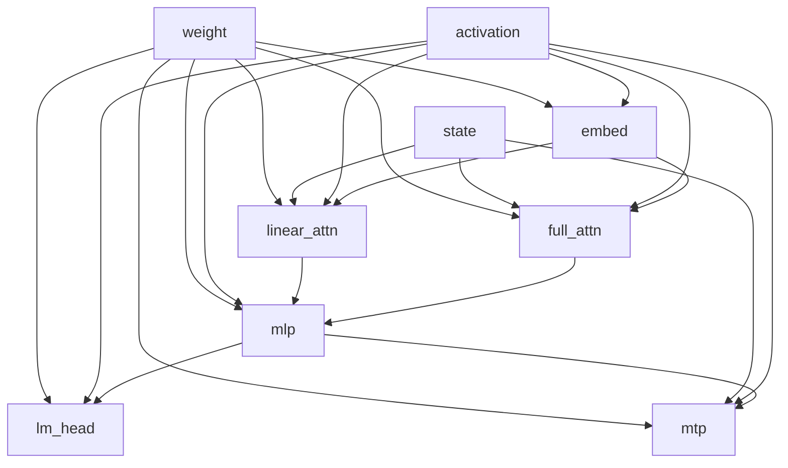

# Qwen3.8-27B work and traffic bounds (TASK-06)

All MTP-only work and traffic totals are conditional on TASK-02's unverified analysis model.

> **Draft status:** conclusions in this document are **unverified** until the verification stage completes.

Phase 1 decode/prefill **mathematical work** and **irreducible traffic** analysis
for the Qwen3.8-27B language + MTP forward map. Equations, ranks, and operator
definitions come from
[`docs/architecture/model-semantics.md`](model-semantics.md) (TASK-02). Catalog
IDs and region cuts come from
[`docs/architecture/dataflow.md`](dataflow.md) (TASK-03). Persistent-state bytes
come from
[`docs/architecture/lifetime-and-state.md`](lifetime-and-state.md) (TASK-04).
Weight byte totals instantiate TASK-01 inventory / sitting `text_config` shapes
\(\times\) BF16.

This document specifies mathematical work counts and byte lower bounds, not
kernels. Prefill and decode share one operator set. Only \(T\) and whether
incoming \((K,V,C,S)\) is zeros versus populated change. Primary totals include
MTP. If a MAC or byte total would disagree with a TASK-02 operator, TASK-03
catalog rank, TASK-04 state byte, or TASK-01 BF16 family total, the earlier
document wins and this one is wrong.

## Authority

| Item | Value | Label |
| --- | --- | --- |
| Dossier | [`docs/architecture/tasks/TASK-06.md`](tasks/TASK-06.md) | — |
| Semantics | [`docs/architecture/model-semantics.md`](model-semantics.md) (TASK-02) | OBSERVED / DERIVED |
| Dataflow | [`docs/architecture/dataflow.md`](dataflow.md) (TASK-03) | OBSERVED / DERIVED |
| Lifetime | [`docs/architecture/lifetime-and-state.md`](lifetime-and-state.md) (TASK-04) | OBSERVED / DERIVED |
| Inventory | [`docs/architecture/model-inventory.md`](model-inventory.md) (TASK-01) | OBSERVED |
| Config | [`.cache/authorities/qwen3.8-27b-transformers/config.json`](../../.cache/authorities/qwen3.8-27b-transformers/config.json) `text_config` | OBSERVED |
| Checker | [`scripts/check_work_and_traffic.py`](../../scripts/check_work_and_traffic.py) | DERIVED |
| Intensity identity | [`docs/architecture/cuda-hardware-model.md`](cuda-hardware-model.md) F13 \(I=F/B\) | formula citation only |
| Evidence policy | [`docs/architecture/plan.md`](plan.md) (OBSERVED / DERIVED / HYPOTHESIS) | OBSERVED |
| In scope | Language + MTP contraction MAC, \(F=2\times\text{MAC}\), and three traffic channels (weight, state, activation) | — |
| Deferred | Vision encoder internals (residual-stream interface only) | — |
| Scope of this document | Mathematical work and byte lower bounds — not kernels | — |

Numeric ranks instantiate sitting `text_config` OBSERVED: `hidden_size` 5120,
`intermediate_size` 17408, `vocab_size` 248320, 64 decoder layers, 48 linear +
16 full at \(\ell \bmod 4 = 3\), `mtp_num_hidden_layers` 1, `num_attention_heads`
24, `num_key_value_heads` 4, `head_dim` 256, linear widths
\(d_\text{qkv}=10240\), \(d_z=6144\), `linear_conv_kernel_dim` 4,
`dtype` `"bfloat16"`. MAC, \(C\), \(A\), and byte products are DERIVED from
those ranks. Bottleneck **class** labels are HYPOTHESIS versus an unfilled SKU
ridge. SKU \(\Pi_\text{peak}\) and \(\Beta\) are not filled here.

## Work convention

Logical values in this document are graph nodes. They do not imply physical allocation, materialization, buffer reuse, or kernel fusion.

Bottleneck classifications in this document are hypotheses, not measurements.

Activation traffic is a DERIVED minimum materialization from catalog ranks, not a CUDA fusion or buffer-reuse claim.

- Mathematical work uses TASK-02 operator definitions; chunkwise GDN `(19)` as a dense \(128^3\) multiply is rejected as a work count.
- Weight traffic uses TASK-01 BF16 inventory bytes (not a quantized checkpoint size).
- State traffic uses TASK-04 persistent-state bytes.
- Fan-out \(\neq\) must-store still holds; activation lower bounds are named catalog cuts, not a peak working set.

| Symbol | Meaning |
| --- | --- |
| MAC | One multiply-add in a **contraction**: GEMM / matvec \(y=Wx\), depthwise conv tap-sum `(14)`, GDN rank-1 update + state reads `(17)`–`(18)`, and attention \(QK^\top\) / \(AV\) `(9)`. No-bias maps add no extra MAC. |
| FLOP (primary) | \(F=2\times\text{MAC}\) for those contractions (multiply and add). This \(F\) is the numerator of \(I=F/B\). |
| Embed `(1)` | Gather; **0 MAC**. Cost is weight-gather traffic. |
| Elementwise | RMSNorm `(2)`–`(3)`, SiLU, residual add `(4)`–`(5)`, softmax, RoPE `(12)`, \(\sigma\), \(\alpha/\beta\) `(15)`, L2 `(16)` are **not** in primary MAC and **not** in \(F\) for intensity. |
| Outer product into \(S\) | Counted as MAC (\(d_k d_v\) per head) because it accumulates into \(S\). |

Primary work is contraction MAC (and \(F=2\times\text{MAC}\)). Elementwise is
lower order: a documented ceiling of \(10^8\) FLOP for one complete decode at
\(T=4096\) is enough to prove it is \(<1\%\) of \(2C_\text{complete}\). This
document does not publish a tight elementwise schedule and does not use
elementwise for bottleneck labels.

GQA: attention MAC uses \(n_h=24\) query heads, not \(n_\text{kv}=4\).
Repeat-interleave of GDN Q/K is 0 MAC. GDN work uses definition `(17)`–`(18)`:
\(3\,n_v^\ell d_k^\ell d_v^\ell\) MAC per token per linear layer. This document
does **not** count `(19)` as \(n_v^\ell (d_k^\ell)^3\).

Let \(T\) be the stored KV length **after** appending the current token
(TASK-04). Decode of one new token has incoming KV length \(T-1\) and attention
contractions against **length \(T\)** (current token included). When \(T=1\),
incoming KV is empty.

- **Decode** = one position of the complete (or language-only) map at stored length \(T\).
- **Prefill** of length \(T\) = the same map at \(t=1,\ldots,T\) from zero state. Causal full attention at step \(t\) contracts against length \(t\).

Identity (DERIVED):

\[
W_\text{decode}(T)=C+A T,\qquad
W_\text{prefill}(T)=\sum_{t=1}^{T}(C+A t)=T C+A\frac{T(T+1)}{2}.
\]

At \(T=1\), prefill = decode. Prefill causal attention uses exact \(T(T+1)/2\),
not \(T^2/2\). Primary totals **include MTP** (one full-attention block +
`mtp.fc` + second `lm_head` contraction). Language-only is a secondary row.
Algebraic equivalents (chunkwise GDN, SDPA, fused eval, omitting MTP, skipping
non-final `lm_head`) are **not** the primary map. A secondary
`inference_last_logits` row may omit \(T-1\) vocabulary projections.

MTP KV uses the same \(T\) (TASK-02/04). Primary prefill therefore runs the MTP
block at all \(T\) positions (teacher-forced \(e_{t+1}\)). Secondary
**inference last-logits**: subtract \((T-1)\) times each evaluated `lm_head`
contraction; mixers/MLP/MTP block still scale with \(T\) because MTP KV storage
has rank \(T\).

## Symbolic work

Layer counts: \(n_\text{lin}=48\), \(n_\text{full}=16\), \(n_\text{mtp}=1\),
\(L=64\). Instantiated GEMM MAC \(=d_\text{out}d_\text{in}\) for
\(W\in\mathbb{R}^{d_\text{out}\times d_\text{in}}\). Regions follow TASK-03 IDs
`embed`, `linear_attn`, `full_attn`, `mlp`, `primary_logits` / `lm_head`,
`mtp`.

| Region | Eqs | MAC per token (T-free) | T coefficient \(A\) (MAC / stored-length unit) |
| --- | --- | --- | --- |
| `embed` | (1) | 0 | 0 |
| `linear_attn` (one layer) | (13)–(20) | \(W_\text{qkv}+W_z+W_a+W_b+W_\text{out}\) + \(d_\text{qkv}k_\text{conv}\) + \(3 n_v d_k d_v\) | 0 |
| `full_attn` (one layer) | (6)–(10),(12) | \(W_q+W_k+W_v+W_o\) | \(2 n_h d_h=12288\) (QK + AV) |
| `mlp` (one layer) | (21) | \(3\,I H\) | 0 |
| `primary_logits` / `lm_head` | (22) | \(V H\) | 0 |
| `mtp` extras | (23)–(24) plus one full+MLP | \(H\cdot 2H + (W_q+W_k+W_v+W_o) + 3IH + VH\) | \(12288\) (MTP attention) |

Full-attention projections include doubled `q_proj` (`attn_output_gate: true`
OBSERVED): \(W_q\in\mathbb{R}^{12288\times 5120}\). Attention core `(9)` at
stored length \(T\) is \(n_h d_h T\) MAC for \(QK^\top\) plus \(n_h T d_h\) MAC
for \(AV\), hence \(A=2 n_h d_h=12288\) per full layer. GDN `(17)`–`(18)` is
three rank-1 contractions per head (\(S^\top \tilde k\), the outer product into
\(S\), and \(S^\top \tilde q\)), hence \(3 n_v d_k d_v\). Depthwise conv `(14)`
is a tap-sum of width \(d_\text{qkv}\) and kernel \(k_\text{conv}=4\).

Instantiated per-layer MAC (DERIVED from sitting shapes):

| Quantity | MAC | How |
| --- | ---: | --- |
| Full proj one layer | 104857600 | \(12288\cdot5120+2\cdot1024\cdot5120+5120\cdot6144\) |
| Linear proj \(W_\text{qkv,z,a,b}\) | 84377600 | \(10240\cdot5120+6144\cdot5120+2\cdot48\cdot5120\) |
| Linear conv | 40960 | \(10240\cdot 4\) |
| GDN `(17)`–`(18)` | 2359296 | \(3\cdot48\cdot128\cdot128\) |
| Linear `out_proj` | 31457280 | \(5120\cdot6144\) |
| Linear token total | 118235136 | sum of the four linear rows |
| MLP one layer | 267386880 | \(3\cdot17408\cdot5120\) |
| `lm_head` or one embed-table GEMM | 1271398400 | \(248320\cdot5120\) |
| `mtp.fc` | 52428800 | \(5120\cdot10240\) |

Stack coefficients (primary complete = language + MTP):

\[
\begin{aligned}
C_\text{lin}&=48\cdot 118235136=5675286528,\\
C_\text{full}&=16\cdot 104857600=1677721600,\\
C_\text{mlp}&=64\cdot 267386880=17112760320,\\
C_\text{lm}&=1271398400,\\
C_\text{mtp}&=52428800+104857600+267386880+1271398400=1696071680,\\
C_\text{language}&=25737166848,\qquad
C_\text{complete}=27433238528,\\
A_\text{language}&=16\cdot 12288=196608,\qquad
A_\text{complete}=208896.
\end{aligned}
\]

\(C_\text{language}=C_\text{lin}+C_\text{full}+C_\text{mlp}+C_\text{lm}\).
\(C_\text{complete}=C_\text{language}+C_\text{mtp}\).
\(A_\text{complete}=A_\text{language}+12288\).

Secondary inference last-logits:

\[
W^\text{last}_\text{language}(T)=W_\text{language}(T)-(T-1)C_\text{lm},\qquad
W^\text{last}_\text{complete}(T)=W_\text{complete}(T)-2(T-1)C_\text{lm}.
\]

## Instantiated work

Companion FLOP \(=2\times\) MAC. Values are DERIVED from \(C+AT\) and
\(TC+AT(T+1)/2\) on sitting shapes, not copied literals.

| Mode | \(T=1\) MAC | \(T=4096\) MAC |
| --- | ---: | ---: |
| Decode language | 25737363456 | 26542473216 |
| Decode complete | 27433447424 | 28288876544 |
| Prefill language | 25737363456 | 107069105504256 |
| Prefill complete | 27433447424 | 114119319486464 |
| Prefill last-logits language | 25737363456 | 101862729056256 |
| Prefill last-logits complete | 27433447424 | 103706566590464 |

| Mode | \(T=1\) FLOP | \(T=4096\) FLOP |
| --- | ---: | ---: |
| Decode language | 51474726912 | 53084946432 |
| Decode complete | 54866894848 | 56577753088 |
| Prefill language | 51474726912 | 214138211008512 |
| Prefill complete | 54866894848 | 228238638972928 |

At \(T=1\), prefill = decode and last-logits = the same map. The
\(10^8\) elementwise ceiling at complete decode \(T=4096\) is
\(100000000 / 56577753088 < 0.01\).

## Weight traffic

Element size BF16 = 2 bytes OBSERVED. Unique parameter bytes = TASK-01 family
totals (recomputed from `text_config` shapes \(\times\) counts \(\times\) 2):

| Family | BF16 bytes | Label |
| --- | ---: | --- |
| `language_linear_attn` | 11124102144 | OBSERVED / DERIVED from shapes |
| `language_self_attn` | 3355459584 | includes q/k norm |
| `language_mlp` | 34225520640 | |
| `language_layer_norms` | 1310720 | input+post, 64 each |
| `language_final_norm` | 10240 | |
| `lm_head` | 2542796800 | |
| `mtp` | 849398784 | |
| Language+MTP excl. vision | 54641395712 | |
| `embed` table (not streamed) | 2542796800 | gather instead |

Decode/prefill **do not** stream the full embed table. Gather one row =
\(H\cdot 2=10240\) bytes.

- Unique non-embed (language+MTP minus \(E\)): \(52098598912\) bytes.
- Decode gather: language \(10240\); complete \(20480\) (\(e_t\) and \(e_{t+1}\)).
- Prefill gather: language \(T\cdot 10240\); complete \(2T\cdot 10240\) (prompt ids \(1\ldots T\) plus MTP next-ids \(2\ldots T+1\)). Instantiated: language \(10240\) / \(41943040\); complete \(20480\) / \(83886080\) at \(T=1\) / \(T=4096\).
- Irreducible unique+gather decode complete: \(52098619392\) bytes.
- A second physical read of shared \(W_\text{lm}\) for `logits_1` is **not** in the unique lower bound (same tensor). Label any double-read as HYPOTHESIS, not DERIVED traffic.
- Vision family bytes are excluded from primary.

## State traffic

Coefficients copy TASK-04; this document does not re-derive ranks. Primary
includes MTP KV (17 full layers). \(T_\text{new}=1\) on decode.

| Channel | Write bytes | Read bytes |
| --- | ---: | ---: |
| KV | 69632 | \(69632(T-1)\) |
| \(C\) | 983040 | 2949120 |
| \(S\) (F32) | 150994944 | 150994944 |
| Total | 152047616 | \(69632(T-1)+153944064\) |

Instantiated decode read: \(T=1\) \(\rightarrow\) \(153944064\); \(T=4096\)
\(\rightarrow\) \(439087104\). Storage after append:
\(B_\text{store}(T)=69632T+153944064\) (`154013696` at \(T=1\), `439156736` at
\(T=4096\)).

Prefill from zeros expands the triangular KV schedule TASK-04 deferred:

\[
B^\text{KV,read}_\text{prefill}(T)=69632\cdot\frac{T(T-1)}{2},\qquad
B^\text{KV,write}_\text{prefill}(T)=69632\,T.
\]

Instantiated KV read: \(T=1\) \(\rightarrow\) \(0\); \(T=4096\) \(\rightarrow\)
\(583972945920\). KV write at \(T=4096\) \(\rightarrow\) \(285212672\).

C/S mathematical per-step volumes scale as TASK-04 \(\times T\) (recurrent
definition). Initial-zero reads move 0 physical bytes; the table still lists
the mathematical TASK-04 per-token numbers. Surviving store after prefill is
\(B_\text{store}(T)\), not \(T\times B_S\).

Do not use chunkwise GDN to claim zero \(S\) traffic; the definition is
recurrent `(17)`.

## Activation traffic

BF16 activations (not \(S\)). Three DERIVED views. Only the forced set is the
unqualified semantic minimum. Region-cut is
`assumed_region_interface_accounting`, not a minimum or selected boundary.
None is a CUDA live-set or fusion claim.

Catalog IDs (TASK-03/04 order, 52 nodes): `token_id`, `e`, `h`, `h_tilde`,
`h_mid`, `h_post`, `h_64`, `h_final`, `logits_0`, `u_q`, `q_prime`, `g`,
`k_raw`, `v_full`, `q_n`, `k_n`, `q_rope`, `k_rope`, `attn`, `y_gate`,
`mix_full`, `K_state`, `V_state`, `qkv`, `z`, `a`, `b`, `c_tilde`, `c`,
`q_lin`, `k_lin`, `v_lin`, `q_hat`, `k_hat`, `alpha`, `beta`, `S`, `o`,
`u_gdn`, `mix_lin`, `C_state`, `g_mlp`, `up`, `swiglu`, `mlp_out`, `e_next`,
`e_next_n`, `h64_n`, `mtp_cat`, `mtp_u`, `h_mtp`, `logits_1`.

1. **Forced** (TASK-04 must-survive non-state): `h`, `h_mid`, `g`, `z`,
   `logits_0`, and for complete also MTP `h` / `h_mid` / `g` / `logits_1`.
   - Decode language: \(64\cdot 10240\cdot 2 + 16\cdot 12288 + 48\cdot 12288 + 496640 = 2593792\) bytes (`h`+`h_mid` + `g` + `z` + `logits_0`).
   - Decode complete: \(2593792 + 2\cdot 10240 + 12288 + 496640 = 3123200\).
2. **Assumed region interface accounting:** forced plus catalog IDs at TASK-03 region
   boundaries: `e`, `h_tilde`, `mix_lin` / `mix_full`, `h_post`, `mlp_out`,
   `h_64`, `h_final`, and MTP `e_next`, `mtp_u`, `h_mtp` (plus the MTP
   residual-layer cuts `h` / `h_tilde` / mix / `h_mid` / `h_post` / `mlp_out`).
   - Decode language: \(5245952\) bytes.
   - Decode complete: \(5847040\) bytes.
   - Prefill = \(T\) \(\times\) decode region-cut (per-position map). \(T=4096\): language \(21487419392\); complete \(23949475840\).
3. **GEMM-IO** (intensity denominator only, not the materialization floor): for
   each \(y=Wx\), count \((d_\text{in}+d_\text{out})\times 2\) bytes. Unfused;
   double-counts a residual vector that feeds several maps.
   - One linear layer: \(96448\); one full proj: \(81920\); one MLP: \(135168\); `lm_head`: \(506880\); `mtp.fc`: \(30720\).
   - Decode language all GEMMs: \(15097856\); complete: \(15852544\).

Omit intra-region ephemerals (`qkv`, `attn`, `swiglu`, `u_q`, `q_prime`,
`k_raw`, `v_full`, `q_n`, `k_n`, `q_rope`, `k_rope`, `y_gate`, `a`, `b`,
`c_tilde`, `c`, `q_lin`, `k_lin`, `v_lin`, `q_hat`, `k_hat`, `alpha`, `beta`,
`o`, `u_gdn`, `g_mlp`, `up`, `e_next_n`, `h64_n`, `mtp_cat`) from views 1–2;
TASK-12 may fuse them. Do not add GEMM-IO into region-cut. Softmax score
matrices are not catalog IDs; their traffic is the KV **state** channel.

## Intensity and bottleneck hypotheses

Use TASK-16 F13 \(I=F/B\) with \(F=2\times\text{MAC}\) and \(B=\) weight +
(GEMM-IO or region-cut, named) + state bytes in that region. Ridge
\(I_\text{ridge}=\Pi_\text{peak}/\Beta\) is not instantiated in this document
(no SKU fill-in). Every **class** below is HYPOTHESIS. Exact \(I\) identities
that do not need a ridge are DERIVED.

Locked DERIVED intensities (decode, named \(B\)):

| Region | Identity | Value |
| --- | --- | ---: |
| MLP vs weights only | \(2\cdot 267386880 / 534773760\) | \(1\) exactly |
| `lm_head` vs weights only | \(2\cdot 1271398400 / 2542796800\) | \(1\) exactly |
| GDN vs \(S\) read+write | \(2\cdot 2359296 / (2\cdot 3145728)\) | \(0.75\) exactly |
| Full-attn core vs KV read\((T-1)\)+write | \(2\cdot 12288 T / (4096 T)\) | \(6\) exactly (\(T\ge 1\)) |

Region \(\times\) traffic-channel map (one token of the complete map). Bottleneck
class is a HYPOTHESIS versus an unfilled SKU ridge.



Locked HYPOTHESIS labels (`bottleneck_labels` JSON, this order). This table
closes the ledger open question on region-level arithmetic intensity and
bottleneck hypotheses; the labels remain hypotheses, not measurements.

| ID | Applies when | Claim (must remain HYPOTHESIS) |
| --- | --- | --- |
| `weight_memory` | Decode GEMM regions with \(I\approx 1\) FLOP/byte (MLP, projections, `lm_head`) | Memory-bound on any SKU whose ridge \(\gg 1\) |
| `vocab_memory` | `lm_head` unique 2542796800 B | Vocabulary projection is a decode weight-traffic outlier |
| `state_memory` | GDN \(I=0.75\) vs \(S\); C/S dominate TASK-04 decode bytes | Linear-attn state traffic, not MAC, is the linear-mixer limiter |
| `kv_memory` | Full-attn core \(I=6\) vs KV | KV movement, not QK FLOPs, limits decode full-attn until a ridge is known |
| `quadratic_attn` | Prefill \(A T(T+1)/2\) MAC and triangular KV read | Prefill full-attn is the only quadratic region; linear-attn stays linear in \(T\) |
| `compute` | Prefill reuses weights across \(T\) tokens, \(I\sim T\) vs decode | Large-\(T\) prefill GEMMs may be compute-bound if \(T>I_\text{ridge}\) |

Do not rank these by wall time. Do not name CUDA kernels. Do not claim a winner
quantization or fusion.

## Deferred vision

Visual tokens may replace placeholders in the residual stream
(`out_hidden_size` 5120 OBSERVED). Encoder / patch embed / merger work and
traffic are **UNKNOWN**. Do not add vision MAC or vision weight bytes to
primary totals.

## Machine-checkable summary JSON

Live object from `text_config` arithmetic plus locked constants (copied from
[`scripts/check_work_and_traffic.py --json`](../../scripts/check_work_and_traffic.py)):

```json
{
  "authority": ".cache/authorities/qwen3.8-27b-transformers",
  "hidden_size": 5120,
  "intermediate_size": 17408,
  "vocab_size": 248320,
  "n_decoder_layers": 64,
  "n_linear_layers": 48,
  "n_full_layers": 16,
  "n_mtp_blocks": 1,
  "n_full_layers_with_kv": 17,
  "full_attention_indices": [
    3,
    7,
    11,
    15,
    19,
    23,
    27,
    31,
    35,
    39,
    43,
    47,
    51,
    55,
    59,
    63
  ],
  "n_attn_heads": 24,
  "n_kv_heads": 4,
  "head_dim": 256,
  "linear_num_value_heads": 48,
  "linear_key_head_dim": 128,
  "linear_value_head_dim": 128,
  "linear_qkv_width": 10240,
  "linear_z_width": 6144,
  "linear_conv_kernel_dim": 4,
  "bytes_bf16": 2,
  "flop_per_mac": 2,
  "T_is_stored_length_after_append": true,
  "decode_T_new": 1,
  "primary_includes_mtp": true,
  "gdn_uses_rank1_eq_17_18": true,
  "elementwise_not_in_primary": true,
  "elementwise_upper_bound_decode_T4096": 100000000,
  "example_T": [
    1,
    4096
  ],
  "mac_embed": 0,
  "mac_full_proj_per_layer": 104857600,
  "mac_attn_coeff_per_full_layer": 12288,
  "mac_lin_proj_per_layer": 84377600,
  "mac_lin_conv_per_layer": 40960,
  "mac_gdn_per_layer": 2359296,
  "mac_lin_out_per_layer": 31457280,
  "mac_lin_token_per_layer": 118235136,
  "mac_mlp_per_layer": 267386880,
  "mac_lm_head": 1271398400,
  "mac_mtp_fc": 52428800,
  "mac_C_linear_attn": 5675286528,
  "mac_C_full_attn": 1677721600,
  "mac_C_mlp": 17112760320,
  "mac_C_lm_head": 1271398400,
  "mac_C_mtp": 1696071680,
  "mac_C_language": 25737166848,
  "mac_C_complete": 27433238528,
  "mac_A_language": 196608,
  "mac_A_complete": 208896,
  "mac_decode_language_at_example_T": [
    25737363456,
    26542473216
  ],
  "mac_decode_complete_at_example_T": [
    27433447424,
    28288876544
  ],
  "mac_prefill_language_at_example_T": [
    25737363456,
    107069105504256
  ],
  "mac_prefill_complete_at_example_T": [
    27433447424,
    114119319486464
  ],
  "mac_prefill_inference_last_logits_language_at_example_T": [
    25737363456,
    101862729056256
  ],
  "mac_prefill_inference_last_logits_complete_at_example_T": [
    27433447424,
    103706566590464
  ],
  "weight_bytes_language_linear_attn": 11124102144,
  "weight_bytes_language_self_attn": 3355459584,
  "weight_bytes_language_mlp": 34225520640,
  "weight_bytes_language_layer_norms": 1310720,
  "weight_bytes_language_final_norm": 10240,
  "weight_bytes_lm_head": 2542796800,
  "weight_bytes_mtp": 849398784,
  "weight_bytes_language_mtp_excl_vision": 54641395712,
  "weight_bytes_embed_table": 2542796800,
  "weight_bytes_unique_non_embed": 52098598912,
  "weight_gather_bytes_per_row": 10240,
  "weight_gather_bytes_decode_language": 10240,
  "weight_gather_bytes_decode_complete": 20480,
  "weight_unique_plus_gather_decode_complete": 52098619392,
  "weight_gather_bytes_prefill_language_at_example_T": [
    10240,
    41943040
  ],
  "weight_gather_bytes_prefill_complete_at_example_T": [
    20480,
    83886080
  ],
  "kv_bytes_all_per_token": 69632,
  "c_bytes_all": 2949120,
  "c_write_bytes_per_token_all": 983040,
  "s_bytes_all": 150994944,
  "storage_kv_bytes_coeff_T": 69632,
  "storage_fixed_bytes": 153944064,
  "decode_write_bytes": 152047616,
  "decode_read_kv_bytes_coeff_Tm1": 69632,
  "decode_read_fixed_bytes": 153944064,
  "storage_bytes_at_example_T": [
    154013696,
    439156736
  ],
  "decode_read_bytes_at_example_T": [
    153944064,
    439087104
  ],
  "prefill_kv_read_bytes_at_example_T": [
    0,
    583972945920
  ],
  "prefill_kv_write_bytes_at_example_T": [
    69632,
    285212672
  ],
  "residual_vector_bytes": 10240,
  "g_bytes_per_full_layer": 12288,
  "z_bytes_per_linear_layer": 12288,
  "logits_bytes": 496640,
  "act_forced_decode_language_bytes": 2593792,
  "act_forced_decode_complete_bytes": 3123200,
  "act_region_cut_decode_language_bytes": 5245952,
  "act_region_cut_decode_complete_bytes": 5847040,
  "act_region_cut_prefill_language_at_example_T": [
    5245952,
    21487419392
  ],
  "act_region_cut_prefill_complete_at_example_T": [
    5847040,
    23949475840
  ],
  "act_gemm_io_lin_layer_bytes": 96448,
  "act_gemm_io_full_proj_bytes": 81920,
  "act_gemm_io_mlp_layer_bytes": 135168,
  "act_gemm_io_lm_head_bytes": 506880,
  "act_gemm_io_mtp_fc_bytes": 30720,
  "act_gemm_io_decode_language_bytes": 15097856,
  "act_gemm_io_decode_complete_bytes": 15852544,
  "i_mlp_weight_only": 1,
  "i_lm_head_weight_only": 1,
  "i_gdn_vs_s_rw": 0.75,
  "i_attn_core_vs_kv": 6,
  "bottleneck_labels": [
    "weight_memory",
    "vocab_memory",
    "state_memory",
    "kv_memory",
    "quadratic_attn",
    "compute"
  ],
  "region_ids": [
    "embed",
    "linear_attn",
    "full_attn",
    "mlp",
    "lm_head",
    "mtp"
  ],
  "region_accounting_status": "forced_is_semantic_minimum; region_cut_is_assumed_region_interface_accounting",
  "n_catalog_nodes": 52,
  "catalog_ids": [
    "token_id",
    "e",
    "h",
    "h_tilde",
    "h_mid",
    "h_post",
    "h_64",
    "h_final",
    "logits_0",
    "u_q",
    "q_prime",
    "g",
    "k_raw",
    "v_full",
    "q_n",
    "k_n",
    "q_rope",
    "k_rope",
    "attn",
    "y_gate",
    "mix_full",
    "K_state",
    "V_state",
    "qkv",
    "z",
    "a",
    "b",
    "c_tilde",
    "c",
    "q_lin",
    "k_lin",
    "v_lin",
    "q_hat",
    "k_hat",
    "alpha",
    "beta",
    "S",
    "o",
    "u_gdn",
    "mix_lin",
    "C_state",
    "g_mlp",
    "up",
    "swiglu",
    "mlp_out",
    "e_next",
    "e_next_n",
    "h64_n",
    "mtp_cat",
    "mtp_u",
    "h_mtp",
    "logits_1"
  ],
  "n_diagrams": 1,
  "canonical_sentence_logical": "Logical values in this document are graph nodes. They do not imply physical allocation, materialization, buffer reuse, or kernel fusion.",
  "canonical_sentence_hypothesis": "Bottleneck classifications in this document are hypotheses, not measurements.",
  "canonical_sentence_activation": "Activation traffic is a DERIVED minimum materialization from catalog ranks, not a CUDA fusion or buffer-reuse claim."
}
```
